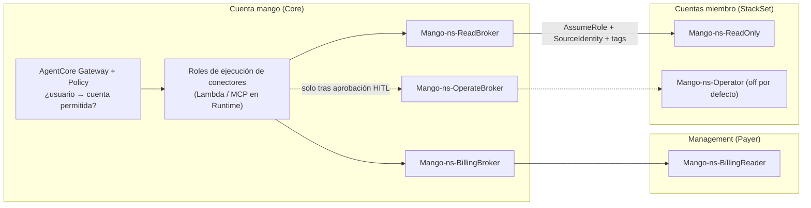

# Mango Hub: arquitectura AWS de referencia (v0.1)

> Fecha: 2026-09-28 · Estado: **propuesta para discusión**
> Base: análisis de [`aws-samples/bedrock-chat`](https://github.com/aws-samples/bedrock-chat) @ `4419d62` y verificación del estado de los servicios AWS a sep-2026.
> Los reportes de detalle, con referencias `archivo:línea` y URLs, están en [`research/`](./research):
> - [infra](./research/infra.md): infraestructura y CDK de bedrock-chat
> - [codebase](./research/codebase.md): backend y frontend de bedrock-chat
> - [vectors](./research/vectors.md): RAG y vector stores
> - [runtime](./research/runtime.md): runtime de agentes: AgentCore vs EKS/ECS/Lambda
> - [governance](./research/governance.md): identidad, RBAC, budgets, HITL, auditoría
> - [isb-multiaccount](./research/isb-multiaccount.md): despliegue multi-cuenta de Innovation Sandbox on AWS
>
> Diagramas en draw.io: [`diagrams/mango-reference-architecture.drawio`](./diagrams/mango-reference-architecture.drawio). Tiene 4 páginas: Overview, Request flow, Multi-account access y Release & upgrade.
> Modelo de amenazas: [`../security/threat-models/mango-architecture-threat-model.md`](../security/threat-models/mango-architecture-threat-model.md).
>
> Hechos críticos verificados en fuentes primarias de AWS el 2026-09-28:
> - AgentCore harness GA (jul-2026); Policy y Evaluations GA (mar-2026); Agent Registry GA (ago-2026).
> - Bedrock Agents Classic en *maintenance mode* desde el 30-jul-2026.
> - CloudTrail Lake cerrado a clientes nuevos desde el 31-may-2026.
>
> Nota: `research/codebase.md` §8 marca como "preview" servicios que ya son GA; en eso manda `research/runtime.md`.

---

## 1. Resumen ejecutivo

1. **bedrock-chat se usa como cantera, no como fork.** Aporta buenos patrones de dominio y un buen frontend de chat. Su esqueleto choca con Mango en tres puntos:
   - Aprovisiona con `cdk deploy` en runtime vía CodeBuild, un stack por bot.
   - Usa OpenSearch Serverless y OSIS, que suman ~550 USD/mes fijos sin usuarios.
   - Ejecuta el agente dentro de una Lambda WebSocket, con el mismo rol IAM para todos los bots, sin MCP, sin HITL y sin budgets.
2. **El plano de ejecución de agentes es Amazon Bedrock AgentCore:**
   - Runtime v2 con microVM por sesión.
   - *Harness* declarativo: agente = configuración.
   - Gateway MCP como única superficie de tools.
   - Identity para OBO/3LO, más Memory, Policy (Cedar), Observability y Evaluations.
   - Cubre ~80 % de la necesidad. **EKS se descarta por ahora**: exige 1–2 FTE de plataforma para reconstruir lo que AgentCore ya trae, y el cómputo del runtime es solo el 3–8 % del gasto en tokens.
3. **El plano de control lo construimos nosotros, y es el producto.** Incluye marketplace, RBAC, **budgets en dólares con enforcement en tiempo real**, bandeja de aprobaciones, audit trail, historial de conversaciones y el router que elige el agente. AgentCore no trae nada de esto.
4. **RAG sin OpenSearch Serverless:**
   - Default: Bedrock KB sobre **S3 Vectors**, compartidas por perfil de indexación, con filtros de metadata por unidad de negocio, KB y ACL. Cuesta ~0 en reposo.
   - Tier premium: **Bedrock Managed Knowledge Base**, con conectores Drive/SharePoint/Confluence, ACL por usuario, hybrid search y rerank.
5. **Costo fijo por entorno sin tráfico: ~100–150 USD/mes**, frente a ~550–900 de bedrock-chat. Todo lo demás se paga por consumo. **La palanca de costo real son los tokens**; por eso los budgets son la pieza propia más importante.

---

## 2. Principios de arquitectura

| # | Principio | Consecuencia |
|---|---|---|
| P1 | **Serverless y pago por uso por defecto** | Nada con costo fijo relevante salvo el BFF. Sin VPC ni NAT salvo para conectores privados |
| P2 | **Un solo punto de paso para tools** | Toda tool, MCP propio o de terceros, va detrás de AgentCore Gateway. Ahí se aplican policy, identidad, guardrails, rate limits y auditoría, fuera del alcance del LLM |
| P3 | **El agente es configuración, no un despliegue** | Crear o publicar un agente es una llamada a API, que tarda segundos. **Nunca build ni `cdk deploy` en runtime** (lección de bedrock-chat); stacks de CloudFormation solo desde plantillas de la release (D25) |
| P4 | **Gobernanza preventiva, no reactiva** | Autorizar y reservar budget *antes* de gastar. El reporte a posteriori (Athena/CUR) sirve solo para reconciliar |
| P5 | **Identidad del usuario hasta el sistema destino** | OBO/3LO o AssumeRole con `SourceIdentity`. Prohibido que una tool use el rol del runtime para datos de usuario |
| P6 | **Estándares abiertos en los bordes** | MCP (tools), AgentSkills.io (skills), A2A, OTel GenAI, Cedar. Mitiga el lock-in con AgentCore |
| P7 | **Contexto organizacional en todo** | Como la instalación es por cliente (D1), el aislamiento principal es la cuenta. Dentro de ella, `business_unit`/`team`/`user` viajan en el token, en las claves DynamoDB (`LeadingKeys` por usuario), en la metadata vectorial, en las políticas Cedar y en los eventos de auditoría. Se reserva un `tenant_id` fijo por instalación por si en el futuro hay un modo SaaS |

---

## 3. Vista general

> Versión detallada con iconos AWS, flujo de una petición, acceso multi-cuenta y release: [`diagrams/mango-reference-architecture.drawio`](./diagrams/mango-reference-architecture.drawio). Se abre en draw.io o diagrams.net.


---

## 4. Decisiones por dominio

### 4.1 Runtime de agentes

| Decisión | Detalle |
|---|---|
| **AgentCore Runtime v2 + harness por defecto** | Cada agente del marketplace es un *harness* con modelo, prompt, tools (referencias al Gateway), skills y política de memoria. Se crea con `CreateHarness` desde Step Functions, sin contenedor |
| **Strands code-defined en Runtime para casos avanzados** | Supervisor multi-dominio y prompts por etapa. El harness solo soporta *agent-as-tool* y no *routing* multi-agente |
| **Claude Agent SDK en Runtime** solo para agentes "trabajador de archivos/código" | Necesitan filesystem y skills estilo Claude Code |
| **Fuente de verdad = `AgentDefinition` en DynamoDB** | El provisioner la "compila" a un harness. Como el harness exporta a Strands, podríamos correr la misma definición en un runtime Strands propio (Fargate/EKS) si hiciera falta salir de AgentCore |
| **Contrato interno `AgentInvoker`** en mango-api | Oculta harness, runtime code-defined u otro backend futuro. Principal mitigación del lock-in |
| **Descartados** | Bedrock Agents Classic (maintenance mode). EKS/kagent: se revisa si hay requisito multicloud/on-prem o si el runtime supera ~5k USD/mes. Lambda no ejecuta el loop del agente; solo tools y jobs |

Límites a tener presentes:
- 2 vCPU/8 GB por sesión, sesión de 8 h (14 días con Runtime Instances).
- Cuotas: 25 TPS de nuevas sesiones y 2 500–5 000 sesiones activas por cuenta.
- v2 solo está en us-east-1, us-east-2, us-west-2, eu-west-1 y ap-northeast-1.

### 4.2 Tools, MCP y skills

- **Un AgentCore Gateway por entorno.** Targets:
  - Lambda y OpenAPI: Cost Explorer y SAP OData.
  - MCP propios hospedados en Runtime: CloudWatch (awslabs) y `knowledge-retrieve`.
  - MCP de terceros con 3LO: Drive.
  - Runtime como *agent-as-tool*.
- **Conectores iniciales:**

  | Sistema | Patrón | Identidad |
  |---|---|---|
  | Cost Explorer | Lambda target (o MCP awslabs), con cache por costo de API | `AssumeRole` read-only por cuenta cliente + `ExternalId` + session tags + `SourceIdentity=user` |
  | CloudWatch | MCP awslabs en Runtime | Igual, cross-account read-only; acciones mutantes con HITL |
  | SAP | OpenAPI (BTP/OData) o MCP de SAP, **VPC egress** a la red del cliente | OAuth **OBO** vía Identity; escritura siempre con aprobación |
  | Google Drive | Lectura: Managed KB (ACL nativa). Acciones: MCP con **3LO** + Consent Portal | Token del usuario en el vault de Identity |

- **Skills** en formato AgentSkills.io (`SKILL.md`):
  - Se guardan en **S3 versionado** y se referencian por agente en el harness.
  - Sus scripts corren con el tool `shell` *dentro de la microVM de la sesión*.
  - Quitar `shell` y `file_operations` (`allowedTools`) a los agentes que no ejecutan scripts.
  - Solo skills y MCP aprobados: el flujo de aprobación de **Agent Registry** entra en la fase 2 como catálogo gobernado de tools/skills/MCP.
- **Cómo entran los MCP (D19):** conectores propios de Mango y **MCP packs** curados (servidores de awslabs empaquetados, escaneados y firmados en el CI de Mango, hospedados en AgentCore Runtime). Los MCP remotos del cliente llegan en v1.x. Nunca se instalan paquetes arbitrarios en la cuenta del cliente. Detalle en `docs/specs/marketplace-v1.md`.

### 4.3 Plano de control y streaming

- Un solo servicio **`mango-api` (Python/FastAPI) en ECS Fargate** detrás de ALB y CloudFront. Hace de BFF de streaming (**SSE / AG-UI**), router, API de catálogo y admin.
  - **Por qué Fargate y no Lambda + API GW WebSocket (como bedrock-chat):**
    - Elimina el límite de 32 KB por frame y el reensamblado por trozos en DynamoDB.
    - Elimina el tope de 15 min y el WebSocket anónimo en `$connect`.
    - Las conexiones de streaming largas y el router con estado son naturales en un contenedor.
  - Costo: 2 tareas de 0,5–1 vCPU más ALB, unos 60–90 USD/mes.
- **Router:**
  - La elección explícita del usuario en el marketplace tiene prioridad.
  - Si el usuario no elige ("Asistente Mango"), un clasificador **Haiku con structured output** elige entre las Agent Cards *ya filtradas por RBAC*, con umbral de confianza; si la confianza es baja, pregunta al usuario.
  - El router vive fuera de AgentCore para que la decisión sea barata, auditable y posterior al RBAC.
- **Step Functions** para operaciones largas:
  - Provisioning de agente, KB y guardrail por **llamadas SDK** (nunca CodeBuild + CDK).
  - Ingesta de KB, reutilizando el lock S3 y la ingesta incremental de bedrock-chat.
  - Aprobaciones HITL.

### 4.4 RAG / Knowledge

| Tier | Backend | Costo (chico / mediano / grande)* | Cuándo |
|---|---|---|---|
| **Standard (default)** | Bedrock KB customer-managed + **S3 Vectors**, pooled por "perfil de indexación" | ~0,3 / ~8 / ~125 USD/mes | Todo agente con documentos propios |
| **Premium** | **Bedrock Managed KB** | ~55 / ~1 250 / ~15 000 USD/mes (lo domina el costo por Retrieve) | Conectores con ACL nativa (Drive, SharePoint, Confluence), hybrid, rerank, agentic retrieval. *Pass-through* al cliente |
| Search+ (futuro) | OpenSearch con motor S3 Vectors o AOSS NextGen (scale-to-zero) | a evaluar | Búsqueda exacta de códigos (SAP) o <50 ms. Validar primero si Bedrock KB soporta NextGen |
| Add-on | Neptune Analytics (GraphRAG) | ~350 USD/mes, ~35 en pausa | Solo agentes que necesiten grafo |

*Escenarios de `research/vectors.md` §3: chico = 10 KB / 1 GB, mediano = 100 KB / 50 GB, grande = 1 000 KB / 1 TB.

- **Aislamiento.** Cada chunk lleva metadata `business_unit`, `kb_id`, `acl_groups` y `classification`, inyectada en la ingesta con una custom transformation Lambda (patrón de bedrock-chat).
  - El filtro lo construye **siempre el MCP `knowledge-retrieve`** a partir del JWT verificado, nunca el LLM.
  - Hay tests de aislamiento entre áreas y KBs en CI.
- **Cuotas que condicionan el diseño:**
  - **100 KBs customer-managed por cuenta (no ajustable)**: obliga al modelo pooled.
  - **Retrieve a 20 req/s**: validar en Service Quotas; si hace falta, cache semántico o subir a Managed KB (600 RPM por KB, ajustable).
- Calidad sin hybrid: chunking jerárquico/semántico, rerank opcional por agente (Cohere Rerank 3.5, 2 USD/1k, cargado al budget del agente) y query rewriting.

### 4.5 Gobernanza

**Identidad:**
- **Cognito Essentials** es el broker único, federado con **el IdP del cliente** (SAML/OIDC; una sola federación por instalación).
- Access tokens cortos (15–60 min) enriquecidos por una *pre-token-generation* Lambda con `business_unit`, `teams` y `roles` de Mango. Nunca los grupos crudos del IdP.
- Clientes M2M con *client credentials*, **no API keys**.
- IAM Identity Center solo para los operadores de Mango.

**Autorización en 3 niveles, todo en Cedar:**

| Nivel | Pregunta | PDP / PEP |
|---|---|---|
| L1 plataforma | ¿Puede usar, crear, publicar o aprobar el agente X o el modelo Y? | Verified Permissions (5 USD/M) en mango-api. Visibilidad del catálogo precomputada en DynamoDB |
| L2 tools | ¿Puede *este usuario vía este agente* llamar `sap.create_po(amount=50k)`? | **AgentCore Policy** en el Gateway. Default-deny; `tools/list` solo devuelve lo permitido |
| L3 destino | ¿El sistema acepta la acción del usuario? | Permisos nativos (SAP, Google, IAM ABAC) vía identidad propagada |

**Budgets (servicio propio; AWS no ofrece enforcement en tiempo real):**
- Jerarquía `instalación → business_unit → team → user`, ortogonal a `agent` y `api_client`.
- **Reserva** con `TransactWriteItems` condicional antes de cada invocación, **clamp** de `max_tokens` al saldo y **liquidación** con el `usage` real. Barrido de reservas huérfanas.
- Topes técnicos adicionales:
  - Límites de iteraciones y tokens del harness.
  - TPM por `jwt.sub` en el Gateway.
  - Allowlist de modelos por agente.
- Precios como datos (`MODEL_PRICE` versionada; se reemplaza la tabla hard-coded de bedrock-chat).
- Atribución con *application inference profiles* etiquetados y reconciliación diaria contra CUR 2.0 (atribución por IAM principal).

**HITL en dos niveles:**
- **Autoconfirmación del usuario** (segundos): `inline_function` del harness o interrupts de Strands; la UI muestra una tarjeta.
- **Aprobación de terceros** (horas/días): Step Functions `waitForTaskToken`; el aprobador se autoriza por AVP `ApproveToolCall` con separación de funciones.
- **No evadible:** un interceptor del Gateway exige un *approval token* firmado con KMS, de un solo uso y ligado a `hash(tool, args)`.

**Audit:**
- **Firehose → S3 Object Lock (COMPLIANCE) + KMS CMK** en la cuenta Log Archive.
- Eventos hash-encadenados con digest diario firmado.
- CloudTrail organization trail. **No CloudTrail Lake.**
- Retención: decisiones 7 años; contenido de prompts 30–90 días, separado.

**Guardrails:**
- Guardrail base **enforced a nivel cuenta/organización** (PROMPT_ATTACK, PII, content).
- Guardrail por agente vía API.
- `ApplyGuardrail` sobre las salidas de tools y RAG (indirect prompt injection).
- Los guardrails son el costo de gobernanza dominante: ~1 000 USD por 1M de turnos.

**Observabilidad:**
- OTel GenAI semconv y AgentCore Observability → CloudWatch GenAI observability.
- `trace_id` en todo evento de uso, auditoría y aprobación.
- Contenido de prompts fuera de los spans por defecto.

### 4.6 Datos (DynamoDB)

- On-demand, **RLS con STS session policy + `dynamodb:LeadingKeys`** (patrón de bedrock-chat) con prefijo `USER#u` (y `BU#` para datos de área).
- Conversación: **un item por mensaje** (`SK=MSG#<ulid>`) en lugar del `MessageMap` monolítico de bedrock-chat. Se conserva el árbol (`parent`/`children`) para editar y regenerar.
- Offload a S3 de items de más de 300 KB. Índices sparse para listados.
- Producción: `RETAIN`, `deletionProtection` y PITR.
- Modelo de gobernanza mínimo (tenants, principals, teams, agents, versions, tools, budgets, counters, approvals, prices, api_clients): ver el diagrama ER en `research/governance.md` §11.2.

### 4.7 Modelo de despliegue: una instalación por cliente, en su cuenta (decidido 2026-09-28)

Mango se instala completo (plano de control + AgentCore + datos) **en la cuenta AWS del cliente**. No hay, por ahora, un plano de control central operado por Mango.

```
Organización AWS del cliente
├── (sus cuentas: management, security, log-archive…)
├── mango-prod   ← instalación de Mango (recomendado: cuenta dedicada)
└── mango-nonprod (opcional) ← pruebas de upgrades antes de prod
Cuentas "fuente" del cliente (Cost Explorer, CloudWatch) ← roles read-only asumidos por Mango
```

Qué cambia respecto al diseño multi-tenant:
- **Un tenant por instalación.** Desaparece el modelo pool/silo. `tenant_id` deja de ser la clave de aislamiento principal. Lo reemplazan las **unidades organizacionales del cliente** (`business_unit → team → user`) en RBAC, budgets y metadata RAG. La RLS por usuario en DynamoDB se mantiene.
- **Identidad:** Cognito federa con **un solo IdP**, el del cliente (Entra, Okta o Google). IAM Identity Center sigue siendo opcional como upstream.
- **Costos:** el cliente paga directo su factura AWS (tokens incluidos). Los budgets siguen siendo núcleo: sirven para *chargeback* interno por área y para evitar sorpresas. El fijo de ~100–150 USD/mes lo absorbe cada instalación.
- **Cuotas por cuenta del cliente:** ya no hay *noisy neighbor* entre clientes, pero cada instalación debe pedir sus aumentos (AgentCore, Bedrock TPM, Retrieve).
- **Audit:** va al bucket Object Lock de la instalación. Si el cliente tiene cuenta log-archive, se replica o se escribe ahí.
- **Nuevas responsabilidades de Mango como "software instalable":**
  - Releases versionadas e inmutables.
  - Upgrades seguros con migraciones de datos.
  - Rol de soporte *break-glass* opcional, con consentimiento del cliente y auditado.
  - Telemetría o licenciamiento *opt-in* (fase posterior).
- **Región:** sin requisito de residencia en LatAm, así que el default es **us-east-1**. Alternativas soportadas: us-west-2 y eu-west-1 (tienen Runtime v2 y Managed KB).

### 4.8 IaC, CI/CD y calidad

- **AWS CDK v2 en TypeScript**, en un monorepo con apps por dominio:
  - `edge` (us-east-1)
  - `core` (auth, datos, mango-api)
  - `agents` (AgentCore)
  - `audit` (log-archive)
- **Constructs de AgentCore:** estables desde CDK v2.255, salvo Policy (alpha). Fijar versiones.
- **Buenas prácticas copiadas de bedrock-chat:** parámetros con zod, `envPrefix`, Aspects (retención de logs y **tags de costo obligatorios**), build del frontend en deploy-time y tests Jest de CDK.
- **Añadido:** `AwsSolutionsChecks` (cdk-nag) aplicado de verdad.
- **Despliegue:** GitHub Actions con OIDC → cuentas dev/stg/prod, `cdk diff` en el PR y aprobación manual para prod. Bootstrap con políticas de ejecución acotadas. **Prohibido `cdk deploy` en runtime y runners con AdministratorAccess.**
- **CDK vs Terraform:** ver §4.9. Recomendación: CDK para escribir y CloudFormation para distribuir; Terraform solo como envoltorio para clientes que lo exijan.
- **Backend:** Python 3.13, `uv`, ruff, mypy estricto por módulo, pytest con moto en CI. La deuda de bedrock-chat es que no corre tests en CI.
- **Frontend:** Vitest + Playwright para el flujo de chat.

### 4.9 CDK/CloudFormation vs Terraform (propuesta, pendiente de confirmación)

**Recomendación: escribir la infraestructura con AWS CDK (TypeScript) y distribuirla como CloudFormation.** Es decir, la estrategia de bedrock-chat, corrigiendo sus errores.

Cobertura verificada el 2026-09-28:
- Terraform (`hashicorp/aws`) tiene 21 recursos `aws_bedrockagentcore_*`, incluidos `harness`, `gateway_target`, `policy_engine` y `registry`.
- CDK tiene L2 para Runtime, Gateway, Gateway Target, Memory, Policy Engine y Online Evaluation, además de L1 para el resto.

Ninguna de las dos herramientas es bloqueante. Además, los harness de cada agente **no se crean con IaC**: los crea el provisioner de Mango por API en runtime (P3). La cobertura de AgentCore pesa poco; lo que decide es **el modelo de instalación en la cuenta del cliente**.

| Criterio (instalación en la cuenta del cliente) | CDK → CloudFormation | Terraform |
|---|---|---|
| **Estado** | Lo guarda CloudFormation en la cuenta del cliente; nada que operar | Requiere backend de estado (S3 + lock) por cliente. Alguien tiene que custodiarlo, sea el cliente o Mango |
| **Qué necesita el cliente para instalar** | Solo la consola o CloudShell: "Launch stack" o el instalador de un clic | Toolchain de TF, backend y credenciales, o un runner que se lo provea |
| **Upgrades y rollback** | `UpdateStack` con rollback automático y *drift detection* nativos | `plan/apply`; rollback manual |
| **Distribución enterprise** | Service Catalog, StackSets y AWS Marketplace (productos CloudFormation) | Módulos en registry privado; menos canales nativos de AWS |
| **Revisión de seguridad del cliente** | Plantilla estática auditable (`cdk synth`), revisable con cfn-guard o cdk-nag | Código HCL auditable; también bien valorado |
| **Reuso de bedrock-chat** | Directo (constructs Frontend, Auth, Database, Step Functions) | Reescritura |
| **Contras** | Rollbacks lentos, límite de 500 recursos por stack, *bootstrap* de CDK si hay assets | Estado por cliente, drift y upgrades coordinados en N cuentas |

**Cómo se distribuye.** Patrón de Innovation Sandbox on AWS; detalle en [`research/isb-multiaccount.md`](./research/isb-multiaccount.md).

**Plantillas pre-sintetizadas desde el MVP.** No hay CodeBuild ni `cdk deploy` en la cuenta del cliente.
- **Synthesizer propio** (subclase de `DefaultStackSynthesizer`):
  - Assets en buckets **regionales** del proveedor: `s3://<mango-releases>-<region>/mango/<version>/`.
  - Plantillas principales en un bucket global.
  - Todo **inmutable por versión**.
  - `generateBootstrapVersionRule: false`, así que **no hace falta bootstrap de CDK** en el cliente.
  - Zip de assets en synth, retirada de `AWS::LanguageExtensions` y alarma al acercarse al límite de 1 MB por plantilla.
  - **Modo dual:** sin bucket de release se comporta como el synthesizer estándar, para desarrollo con `cdk deploy`.
- **Instalación y upgrade:** el cliente instala y actualiza con **"Launch stack" / `CreateStack` / `UpdateStack`** sobre la URL de una versión concreta.
- **Imágenes de contenedor** (`mango-api`, runtimes de agentes code-defined):
  - No se usa `DockerImageAsset`, porque exige bootstrap y ECR en el cliente.
  - Se publican en **ECR Public** o en un ECR del proveedor con lectura por cuenta, y se referencian **por digest**.
  - Opción `privateEcrRepo` para clientes que no permiten registries externos.
  - AgentCore Runtime acepta ECR privado de cualquier cuenta, ECR Public y un zip en S3 sin contenedor (verificado en la documentación el 2026-10-01; falta la prueba en el laboratorio). Los MCP packs usan el zip (D36).
- **Trazabilidad de versión:**
  - Contexto de build congelado en un `CfnMapping` dentro de la plantilla.
  - Versión en la descripción de cada stack (`(Mango) mango-hub vX.Y.Z`).
  - User-agent `Mango/<ver>` en los SDK.
  - `release.yaml` como fuente única de versión, con un test de consistencia.
- **Parámetro `Namespace`** (3–8 alfanuméricos) en **todo** nombre global: roles, StackSet, alias KMS, SSM, log groups, grupos IDC. Permite `mango-prod` y `mango-nonprod` en la misma organización. Tests de regresión dedicados.
- **Upgrades:**
  - Orden documentado por release.
  - Modo mantenimiento en la app.
  - Migraciones como custom resource idempotente que revierte el stack si falla.
  - `RETAIN` en datos.
  - Cada stack publica `version`/`schema`; `Core` **valida** la compatibilidad en runtime. ISB lo guarda pero no lo valida.
- **Clientes con Terraform obligatorio:** módulo delgado que envuelve las plantillas con `aws_cloudformation_stack`.
- **Canales posteriores:** Service Catalog y AWS Marketplace, sobre las mismas plantillas.
- **Testing de IaC:**
  - Snapshots normalizados.
  - Aserciones dirigidas sobre IAM y trusts.
  - Tests de namespacing y de consistencia de release.
  - **cdk-nag** en synth y **cfn-guard** sobre las plantillas finales en CI.
  - Un test que falla si algún trust spoke no exige `PrincipalOrgID` y `SourceIdentity`.

**Cuándo elegir Terraform en su lugar:**
- Si el equipo de Mango es nativo en Terraform y no en TypeScript.
- Si el mercado objetivo (p. ej. banca) exige módulos TF nativos de forma generalizada.

---

### 4.10 Conectividad multi-cuenta (AWS Organizations / Control Tower del cliente)

Mango se instala en **una cuenta dedicada** (`mango`) dentro de la organización del cliente y opera sobre **todas las cuentas** mediante roles. La estructura de stacks sigue el patrón de Innovation Sandbox on AWS (ver [`research/isb-multiaccount.md`](./research/isb-multiaccount.md)), corrigiendo lo que no aplica a cuentas productivas.

**Stacks e instalación (una sola región por instalación):**

| Stack | Cuenta | Contenido | Obligatorio |
|---|---|---|---|
| `Mango-<ns>-Core` (+ `Edge` en us-east-1 si hay dominio propio) | `mango` | Plataforma completa, roles de ejecución de conectores y **brokers** | Sí |
| `Mango-<ns>-OrgAccess` | Management **o delegated admin de StackSets** (`callAs: DELEGATED_ADMIN`) | `AWS::CloudFormation::StackSet` **SERVICE_MANAGED** con auto-deployment sobre la raíz u OUs elegidas por parámetro. El template del spoke va **como asset versionado** | Sí (multi-cuenta) |
| `Mango-<ns>-Payer` | Management | Solo `Mango-<ns>-BillingReader`: Cost Explorer, `organizations:List*/Describe*` y lectura de Data Exports. Los StackSets no llegan a la management | Opcional (alternativa: solo CUR 2.0) |
| `Mango-<ns>-Support` | Cuenta de Identity Center (management o delegated admin) | Permission sets de soporte acotados a la cuenta `mango`, **sin assignment** (§4.11) | Opcional |
| `Mango-<ns>-Member` (template spoke) | Cada cuenta miembro, vía StackSet (o CfCT/AFT con la misma plantilla) | `Mango-<ns>-ReadOnly` + `Mango-<ns>-Operator` (desactivado por parámetro) | Vía StackSet |

- **Orden independiente por diseño:**
  - Todos los nombres y ARNs son deterministas (`Mango-<ns>-…`) y se calculan a partir de los *account IDs* que recibe cada stack como parámetros.
  - **Ningún stack lee a otro en deploy-time.** Se descarta el acoplamiento SSM+RAM de ISB.
  - Orden recomendado: `Core` → `OrgAccess` → `Payer` → `Support`.
  - El **connectivity check** de la consola admin prueba `AssumeRole` contra la payer y una muestra de spokes, lee el estado de las instancias del StackSet y muestra qué falta.
- **No modificamos la estructura de la organización:** no creamos OUs ni SCPs, a diferencia de ISB.
- **Prerrequisitos (checklist de la guía de instalación):**
  - Trusted access de StackSets activado.
  - Delegated admin de StackSets (opcional).
  - Cost Explorer habilitado (~24 h).
  - Región de la instalación definida y OUs objetivo.
  - Cuotas de STS y Lambda.



**Patrón de roles:**
- **Brokers por nivel de privilegio** en la cuenta `mango` (`Read`, `Billing`, `Operate`). Los roles de conector asumen el broker y el broker asume el rol spoke.
  - Añadir o quitar conectores **no obliga a redesplegar el StackSet** en cientos de cuentas.
  - El trust de `ReadOnly` no permite llegar a `Operator`.
  - Costo: el *role chaining* limita la sesión a 1 h.
- **Trust del spoke:**
  - `Principal: arn:aws:iam::<MANGO>:root`, más la condición `aws:PrincipalArn` = broker correspondiente (no el ARN como `Principal`). Así el spoke puede existir antes que el broker y sobrevive a recreaciones.
  - Además `aws:PrincipalOrgID` y `sts:SetSourceIdentity`/`sts:TagSession`, con **`SourceIdentity` obligatorio**.
  - El trust de cada broker lista ARNs explícitos de conectores. No se usa ABAC con `:root`.
- **Trazabilidad:** `SourceIdentity` = usuario de Mango, session tags (`mango_user`, `agent_id`, `business_unit`) y nombre de sesión con el usuario. El **CloudTrail de cada cuenta destino muestra qué persona**, vía qué agente, hizo cada llamada.
  - ⚠️ **Verificar en PoC** que `SourceIdentity` y los tags transitivos se propagan como se espera en el chaining broker → spoke.
- **Permisos:**
  - `ReadOnly`: acciones explícitas por conector (CloudWatch, Cost Explorer, Config, Tagging…), **no** `ReadOnlyAccess`. Se evita leer datos sensibles (S3, Secrets, DynamoDB).
  - `Operator`: desactivado por defecto; solo tras HITL, acotado por caso de uso, con *permission boundary*.
  - `BillingReader`: `ce:GetCostAndUsage` sobre `*` (no se puede acotar); documentado.
  - `ExternalId` solo para accesos de terceros, no dentro de la organización.
- **StackSet:**
  - **Una sola región**, porque los roles IAM son globales y repetir la instancia en varias regiones colisiona por nombre. La multi-región aplica a los *conectores* en runtime (CloudWatch es regional).
  - Tolerancia a fallos razonable, **no 100 %**, y estado de las instancias monitoreado y visible en el connectivity check.

**Modelo de roles por agente (D10):**

| Capa | Granularidad | Control |
|---|---|---|
| Rol de ejecución del agente (AgentCore, cuenta `mango`) | **Uno por agente**, creado por API al publicar | Solo su inference profile, su Memory y la invocación al Gateway |
| Rol del conector (Lambda/MCP detrás del Gateway) | **Uno por conector** | Qué agente o usuario usa qué tool lo decide la Policy Cedar L2 del Gateway, no IAM |
| Roles spoke (`ReadOnly`, `Operator-*`, `BillingReader`) | **Compartidos por nivel**, sin roles por agente | Un rol por agente obligaría a redesplegar el StackSet en todas las cuentas y violaría "nada de IaC en runtime" |

- **Mínimo privilegio por llamada:** el broker genera en cada `AssumeRole` una **session policy** con la acción, el recurso y la cuenta concretos de la tool, más session tags (`mango_user`, `agent_id`, `approval_id`). Los permisos efectivos son la intersección entre el rol y la session policy.
- **Escritura:**
  - `Operator` se **divide por dominio** (p. ej. `Operator-Tagging`, `Operator-Compute`), cada uno deshabilitado por defecto y habilitable por parámetro del StackSet.
  - Solo el **approval executor** (Lambda dedicado) puede asumir `OperateBroker`, y antes valida el approval token (KMS, un solo uso, ligado a `hash(tool, args)`).
  - Un conector comprometido no puede escribir sin aprobación.
- **Payer:** el conector de Cost Explorer y CUR **impone el filtro `LINKED_ACCOUNT`** con las cuentas permitidas del usuario, sin depender del LLM.
- Detalle y justificación: `docs/security/threat-models/mango-architecture-threat-model.md` (TM-003, TM-004).

**Datos de costo a escala:** además de la API de Cost Explorer (≈0,01 USD/request, con cache obligatorio), se recomienda un **Data Export CUR 2.0** hacia un bucket legible por la cuenta `mango` (Athena). Es más barato, más granular y no depende de la payer en cada pregunta.

**Gobernanza de "quién ve qué cuenta":**
- El inventario (cuenta → OU → área) se sincroniza desde Organizations en runtime.
- **AgentCore Policy (Cedar)** valida que el `account_id` de cada tool call esté dentro de las OUs o áreas permitidas para el usuario.
- El LLM propone la cuenta; el Gateway decide.

**Riesgos:**
- El stack `Payer` en la management es lo más sensible para el equipo de seguridad del cliente. Debe ser mínimo y opcional, con la alternativa de operar solo con CUR 2.0.
- Las cuotas de STS y Cost Explorer al consultar cientos de cuentas requieren cache de credenciales y resultados, y paralelismo acotado.
- Instancias del StackSet fallidas en silencio: se mitiga con el monitoreo descrito arriba.

### 4.11 Soporte y diagnóstico

**Botón "Exportar diagnóstico"** en la consola admin de Mango, solo para el rol `mango-admin`:
- **Contenido del paquete:**
  - Versión instalada y estado de los stacks CloudFormation (incluida la detección de *drift*).
  - Configuración efectiva sin secretos.
  - Health checks de cada dependencia: AgentCore, Gateway targets, KB, roles cross-account por cuenta.
  - Uso de cuotas.
  - Errores recientes y trazas OTel **sin contenido de prompts ni respuestas**.
- **Redacción obligatoria:** PII, ARNs con account IDs opcionalmente enmascarados, tokens.
- **Entrega:** ZIP con manifiesto y hash, descargable por URL prefirmada de corta vida. El cliente decide si nos lo envía.
- Se genera un `AuditEvent` (`support.diagnostic_exported`).

**Acceso del equipo de Mango vía IAM Identity Center del cliente:**
- Stack opcional `Mango-<ns>-Support` en la cuenta de IAM Identity Center (management o delegated admin), siguiendo el patrón del stack IDC de ISB.
  - Crea los permission sets `Mango-<ns>-SupportReadOnly` y `Mango-<ns>-SupportOperator` **sin assignments**.
  - El cliente asigna y retira el acceso, solo sobre la cuenta `mango`, a los usuarios de Mango que dé de alta en su IdP.
- **Permisos de solo lectura operativa:** CloudFormation (describe), CloudWatch Logs y métricas, AgentCore Observability, estado de Step Functions y metadata de configuración.
- **Deny explícito** sobre el contenido de conversaciones (tablas y buckets de datos de usuario), auditoría y secretos.
- **Un permission set opcional `MangoSupportOperator`** para acciones de remediación (reintentar provisionamiento, reiniciar el servicio), activado solo durante un caso.
- La activación y la duración las controla el cliente, idealmente con acceso temporal elevado (TEAM o similar). Todo queda en su CloudTrail con la identidad nominal del ingeniero.
- Mango no mantiene credenciales ni roles de confianza hacia cuentas propias del proveedor.

---

### 4.12 Versionado, canales de actualización y upgrades

**Modelo comercial y técnico:**
- **Cada instalación queda fijada a una versión** (`vX.Y.Z`): sus stacks apuntan a las plantillas de esa release y no cambian hasta que el equipo de Mango ejecuta una actualización. Es el mismo principio que bedrock-chat (`bin.sh --version`), pero sin CodeBuild.
- **Dos canales:**

  | Canal | Contenido | Comercial |
  |---|---|---|
  | **Parches** `vX.Y.Z` | Seguridad (CVEs), compatibilidad con cambios de AWS (APIs de AgentCore/Bedrock, runtimes de Lambda), modelos nuevos o retirados, bugs | Incluido en el contrato de soporte/mantenimiento |
  | **Versiones** `vX.Y` / `vX` | Features nuevas (agentes, conectores, capacidades de gobernanza) | Se cobra |

- **Por qué hace falta el canal de parches:** una instalación congelada se degrada sola en 6–12 meses. Bedrock retira modelos, AgentCore y Strands cambian sus APIs, Lambda depreca runtimes y aparecen CVEs.
- **Política de versiones soportadas:** solo se dan parches a las **dos últimas versiones menores**. Una instalación más antigua tiene que actualizar para recibir soporte. Así se limita la dispersión de versiones entre clientes.
- **Futuro a evaluar:** licencias por feature (archivo firmado, verificado localmente, sin "llamar a casa"), con todos los clientes en una versión reciente, en lugar de cobrar por versión.

**Mecánica de actualización (igual para ambos canales, sin CodeBuild):**
1. **Build una sola vez por release, en el CI de Mango** (GitHub Actions, en cuentas de Mango): plantillas, Lambdas empaquetadas e imágenes. Se publica todo inmutable en `s3://<mango-releases>-<region>/mango/vX.Y.Z/` y en ECR, con imágenes referenciadas por digest.
2. **En la cuenta del cliente solo se ejecuta `UpdateStack`** con la URL de la plantilla de la versión destino.
   - Lo hace el equipo de Mango, con acceso vía IAM Identity Center del cliente (§4.11), desde la consola o la CLI.
   - Con la opción "Rollback all stack resources".
   - Futuro: un botón en la consola admin que dispare un Step Functions en la cuenta `mango`.
3. **CloudFormation descarga los artefactos ya construidos.** En la cuenta del cliente no se compila nada.
4. **Migraciones de datos:** recurso personalizado de CloudFormation (una Lambda) idempotente, que nunca pisa configuración guardada por un admin y revierte el stack si falla (patrón ISB).
5. **Modo mantenimiento** en la app durante el upgrade y **validación de compatibilidad de versión/esquema** entre stacks antes de reabrir.
6. **Orden:** Core concentra casi todos los cambios. `OrgAccess`, `Payer` y `Support` cambian rara vez y se actualizan solo si la release lo indica en sus notas.

**Reglas de diseño que reducen la necesidad de releases:**
- **Catálogo de modelos y precios como configuración, no código:** agregar o retirar un modelo no exige una versión nueva.
- **Personalizaciones del cliente solo por parámetros de stack o configuración de la app.** Nunca edición manual de recursos gestionados, ni builds distintos por cliente.
- **Actualizar siempre a una versión concreta**, no a `latest`.

**Casos borde, todos sin CodeBuild:**
- Artefactos de AgentCore Runtime: no exige un ECR de la misma cuenta (verificado el 2026-10-01). Los MCP packs van como zip copiado por CloudFormation a un bucket de la instalación (D36); la imagen por digest queda como alternativa.
- El cliente no permite descargar desde buckets externos: se replica la release a un bucket del cliente con `aws s3 sync` y se instala desde ahí.

**Uso de CodeBuild en Mango:** ninguno en la cuenta del cliente, ni para instalar, ni para actualizar, ni para crear agentes. Solo se reconsideraría si algún día hubiera que compilar código dentro de la cuenta del cliente, y el diseño evita ese caso.

---

### 4.13 Requisitos de seguridad del modelo de amenazas (D11)

Salen de [`docs/security/threat-models/mango-architecture-threat-model.md`](../security/threat-models/mango-architecture-threat-model.md) v0.1 y son **requisitos de diseño obligatorios** para la implementación:

| # | Requisito | Amenazas |
|---|---|---|
| R2 | **Taint de sesión y tools `egress`:** si una sesión leyó contenido no confiable (RAG, tools, web), toda tool con salida externa (correo, web, compartir) exige HITL. El interceptor del Gateway lo aplica | TM-001 |
| R3 | **UI de aprobación con argumentos canónicos y diff** renderizados por el backend, nunca el resumen del LLM. SoD obligatoria (el aprobador es distinto del solicitante) | TM-002 |
| R4 | **Namespaces de AgentCore Memory por usuario** (`/{agent}/{user}`). La memoria compartida por área solo con opt-in explícito. Tests de aislamiento usuario↔usuario y área↔área en CI | TM-007 |
| R5 | **Firma de releases** (manifiesto firmado con KMS o Sigstore), verificada antes de cada `UpdateStack`. Bucket de releases con Object Lock | TM-008 |
| R6 | **Egress restringido** de la microVM de AgentCore y de los conectores a destinos en allowlist. Bloqueo de rangos privados salvo los hosts declarados (p. ej. SAP). **Construido para los Runtimes de packs (D54, 2026-10-02)**; pendiente para conectores y hosts externos | TM-009, TM-014 |
| R7 | **Guardrails de recurso por agente de escritura:** allowlists de tipos, AMIs y regiones, tags obligatorios (`mango:agent`, `mango:user`, `mango:approval`) y límites de cantidad. Se aplican en Cedar L2 **y** en la session policy. Estimación de costo en la aprobación, con escalado por umbral | TM-016 |
| R8 | **Plantilla de SCPs recomendadas** al cliente: protege los roles `Mango-<ns>-*` y restringe lo que `Operator-*` puede crear. Se entrega con la instalación y es opcional | TM-004, TM-016 |

Contexto que los motiva:
- Habrá agentes con salida a internet.
- Las escrituras dependen de la naturaleza de cada agente (p. ej. un agente EC2 crea instancias).
- Los agentes manejan datos sensibles.
- La interfaz se expone a internet.

---

### 4.14 Estructura del monorepo (D12)

Monorepo políglota **organizado por dominio**:
- **uv workspace** para todo lo Python.
- **pnpm workspace** para todo lo TypeScript.
- **mise** para fijar versiones de herramientas y definir las tareas comunes.
- Sin Nx ni Turborepo al inicio.

```
mango/
├── AGENTS.md · README.md
├── release.yaml              # fuente única de versión
├── mise.toml                 # versiones (python, node, uv, pnpm, cfn-guard) + tareas lint/test/synth/dist
├── pyproject.toml            # raíz del uv workspace
├── pnpm-workspace.yaml       # raíz del pnpm workspace
├── apps/
│   ├── api/                  # mango-api (FastAPI): BFF SSE, router, catálogo, admin
│   └── web/                  # React + Vite + Tailwind
├── packages/
│   ├── py/
│   │   ├── mango-core/       # dominio compartido, errores, contratos de eventos (audit/usage)
│   │   ├── mango-governance/ # clientes AVP, Budget Service, emisor de auditoría, approval tokens
│   │   ├── mango-aws/        # broker, session policies, SourceIdentity (D10)
│   │   ├── mango-packs/      # formato de MCP packs: manifiesto, hash de tools, verificación de firma (D19)
│   │   └── mango-pack-runtime/ # punto de entrada común de los packs de datos de cuentas; va dentro de su zip (D37)
│   └── ts/
│       └── api-client/       # generado desde el OpenAPI de apps/api (no se edita a mano)
├── functions/                # Lambdas Python, un paquete por función
│   ├── provisioner/  approval-executor/  gateway-interceptor/
│   └── pre-token/  budget-reconciler/  migrations/
├── connectors/               # tools detrás del Gateway: cost-explorer/, cloudwatch/, knowledge-retrieve/
├── agents/                   # definiciones incluidas en la release (finops/agent.json + evals) y skills/
├── policies/
│   ├── cedar/platform/       # L1 Verified Permissions (schema + policies + tests)
│   ├── cedar/gateway/        # L2 AgentCore Policy (schema + policies + tests)
│   └── scp/                  # plantilla de SCPs recomendadas (R8)
├── infra/                    # CDK: bin/, lib/{stacks,constructs,synthesizer}/, test/
├── packs/                    # MCP packs de la release: manifiesto, lock con hashes, punto de entrada (D19)
├── deployment/               # build-dist: synth, empaquetado, firma (R5), publicación
│   └── pack-builder/         # pipeline de packs: lock, zip reproducible, snapshot de tools, firma KMS
├── tests/
│   ├── e2e/                  # Playwright
│   └── isolation/            # aislamiento usuario/área y RBAC (R4)
├── docs/
└── .github/workflows/
```

Reglas:
1. **Separación por responsabilidad, no por lenguaje.**
2. **Una Lambda por paquete**, con dependencias mínimas. Lo compartido va en `packages/py/`.
3. **Piezas críticas de seguridad aisladas y testeables por separado:** `mango-aws`, `approval-executor`, `gateway-interceptor` y `policies/`.
4. **Políticas Cedar como código**, con tests en CI.
5. **Agentes incluidos en la release como datos** (definiciones que el provisioner carga por API), no como despliegues.
6. **`packages/ts/api-client` es generado.** El CI falla si hay drift con el OpenAPI.
7. **`infra/` define los recursos; `deployment/` produce la release firmada.**
8. **Reglas de dependencias verificadas en CI:** p. ej. `connectors/` no importa `apps/api`, y solo `approval-executor` usa la capacidad de escritura de `mango-aws`.

---

## 5. Qué tomamos de bedrock-chat

| Tomar (copiar y adaptar) | Reescribir | Descartar |
|---|---|---|
| Capas `routes → usecases → repositories → models`, con excepciones de dominio mapeadas a HTTP | Adaptador Strands (1.9 → ≥1.57, hooks estables, interrupts, MCPClient) | `cdk deploy` en runtime vía CodeBuild (stacks por bot, KB, API y guardrail) |
| Modelos pydantic de conversación: contenidos discriminados, árbol, `thinking_log` | Registro de tools en duro → catálogo de `AgentDefinition` y `ToolBinding` apuntando al Gateway | Bot Store en OpenSearch Serverless + 2 pipelines OSIS |
| RLS DynamoDB con `LeadingKeys` | Persistencia de conversaciones (un item por mensaje) | KB "dedicated" con una colección AOSS por bot |
| Protocolo de eventos de streaming y máquina XState del front (se añaden `APPROVAL_REQUIRED`, `BUDGET_WARNING` y `POLICY_DENIED`) | RBAC de 3 grupos fijos → Cedar (AVP + AgentCore Policy) | Tool `bedrock_agent` (Agents Classic) y búsqueda web con DuckDuckGo |
| `calculate_price` como base del metering | Budgets (inexistentes) y precios hard-coded | Published API que opera como Admin, API keys y usage plans por stack |
| Citas con `source_id`, extracción de fuentes y páginas (`vector_search.py`) | Validación JWT: ID token y JWKS por request → access token y JWKS cacheado | Logging de cabeceras `Authorization`, bypass `test_user` fuera de Lambda |
| Ingesta incremental de KB, lock S3 y Step Functions con compensación | Transporte de streaming: WebSocket por mensaje → SSE/AG-UI persistente | `bedrock:*` sobre `*`, `RemovalPolicy.DESTROY` en datos, WAF sin reglas |
| Frontend (~60 %): auth Amplify/OIDC, chat, markdown/mermaid/katex, i18n `es`, Ladle | Editor de bots → *Agent Builder* (MCP, skills, KB, budget, aprobaciones); Discover → marketplace gobernado; admin → budgets, aprobaciones, auditoría | |
| Export incremental DDB → S3 → Glue (projection) → Athena para analítica | | |

---

## 6. Costos orientativos

**Fijo por entorno sin tráfico:**

| Componente | USD/mes |
|---|---|
| mango-api en Fargate (2 × 0,5 vCPU/1 GB) + ALB | ~60–90 |
| CloudFront + WAF (plan flat-rate Pro o WAF a la carta) | ~15–25 |
| KMS, Secrets, CloudWatch Logs, PITR | ~10–20 |
| AgentCore, S3 Vectors, DynamoDB, Lambda, Step Functions, Cognito | ~0 en reposo |
| **Total** | **~100–150** (dev con 1 tarea: ~50) |

**NAT:** +~33 USD/mes por AZ, solo si hay conectores privados (SAP).

**Variable, escenario de referencia** (300 usuarios, 20k conversaciones/mes; ver `research/runtime.md` §4.1):
- AgentCore: ~225 USD. Memory es la partida mayor, así que la memoria de largo plazo se activa solo donde aporte.
- Tokens LLM: ~3 000–8 000 USD (orden de magnitud, a validar).
- Guardrails: ~100–500 USD según volumen.

**Conclusión:** optimizar tokens (routing a Haiku, prompt caching, budgets) importa 10× más que optimizar infraestructura.

---

## 7. Riesgos principales

| Riesgo | Mitigación |
|---|---|
| **Lock-in y madurez de AgentCore** (harness GA jul-2026, Runtime v2 GA sep-2026) | `AgentInvoker` propio, `AgentDefinition` en DynamoDB exportable a Strands, estándares abiertos (MCP, skills, OTel, Cedar), versiones fijadas y entorno canary |
| **Budget enforcement es código propio**: un bug causa sobregasto o bloqueos | Reserva por iteración + clamp, límites duros del harness y TPM en el Gateway, reconciliación CUR con alertas de drift, kill-switch por tenant |
| **Granularidad de hooks del harness** para re-chequear budget en cada llamada al modelo (no confirmada) | PoC temprano. Si no alcanza: límites del harness + Gateway de inferencia con TPM, o agente code-defined con hooks de Strands |
| **Cuotas** (sesiones AgentCore, Retrieve 20 rps, 100 KBs, TPM Bedrock por cuenta) | Pedir aumentos antes del lanzamiento, load test, KBs compartidas por perfil de indexación. Cada instalación pide sus propios aumentos (checklist de instalación) |
| **Indirect prompt injection** vía documentos y tool outputs | Guardrails sobre tool outputs, default-deny L2, HITL en escritura, `allowedTools` mínimo |
| **Regiones**: Runtime v2 y Managed KB no están en sa-east-1 | Decidir la región según residencia de datos (§8). Default us-east-1 |
| **Conectividad SAP** (on-prem, auth corporativa) | PoC de VPC egress + OBO con el IdP del cliente; fallback con MCP propio en Runtime |

---

## 8. Registro de decisiones

| # | Tema | Decisión | Fecha |
|---|---|---|---|
| D1 | Modelo de despliegue | **Instalación en la cuenta AWS de cada cliente** (single-tenant por instalación). Ver §4.7 | 2026-09-28 |
| D2 | Residencia de datos | Sin requisito de LatAm. Región default **us-east-1** | 2026-09-28 |
| D3 | IaC | **CDK (TypeScript) para escribir, CloudFormation para distribuir**; módulo TF envoltorio opcional (§4.9) | 2026-09-28 |
| D4 | Primer agente del MVP | **FinOps sobre Cost Explorer** | 2026-09-28 |
| D5 | Alcance de cuentas | **Multi-cuenta**: Mango en una cuenta dedicada de la organización del cliente, con acceso por roles a todas las cuentas (StackSets service-managed + stack en la payer) (§4.10) | 2026-09-28 |
| D6 | Lenguajes | **Python** (backend, agentes, MCP propios) + **TypeScript** (CDK y frontend); cliente TS generado desde el OpenAPI de FastAPI | 2026-09-28 |
| D7 | Soporte | **Botón de diagnóstico** + acceso del equipo Mango vía **IAM Identity Center del cliente** (permission sets provistos por Mango) (§4.11) | 2026-09-28 |
| D8 | Distribución | **Plantillas CloudFormation pre-sintetizadas desde el MVP** (synthesizer propio, assets versionados en buckets regionales, sin bootstrap ni CodeBuild en el cliente), patrón ISB (§4.9) | 2026-09-28 |
| D9 | Versionado y upgrades | **Versión fijada por cliente**; canal de **parches** incluido en soporte y **versiones** con features cobradas; soporte a las 2 últimas menores; upgrades = `UpdateStack` con plantillas pre-construidas, ejecutado por el equipo Mango vía IdC. **Sin CodeBuild en la cuenta del cliente** (§4.12) | 2026-09-28 |
| D10 | Modelo de roles | Rol de ejecución **por agente**, rol **por conector**, roles spoke **compartidos por nivel** con **session policy por llamada**; `Operator` dividido por dominio y `OperateBroker` asumible solo por el approval executor (§4.10) | 2026-09-28 |
| D11 | Requisitos de seguridad | Requisitos R2–R8 del modelo de amenazas v0.1 como obligatorios de diseño: taint/egress con HITL, UI de aprobación canónica, Memory por usuario, firma de releases, egress en allowlist, guardrails de recurso, plantilla de SCPs (§4.13) | 2026-09-28 |
| D12 | Monorepo | Monorepo políglota por dominio (apps, packages, functions, connectors, agents, policies, infra, deployment, tests); uv + pnpm workspaces; mise para versiones y tareas (§4.14) | 2026-09-28 |
| D13 | Propagación de identidad a las tools | `mango-api` valida el access token y lo pasa por invocación al harness como header `Authorization` de una tool `remote_mcp` apuntando al Gateway (`CUSTOM_JWT` contra Cognito; Policy Cedar con claims como tags). Un **REQUEST interceptor** borra cualquier `_mango_ctx` que ponga el modelo e inyecta el token; el Lambda target **revalida el JWT** y solo confía en él. El budget se reserva en `mango-api` antes de cada invocación, más los topes del harness (`maxTokens`, `maxIterations`, `timeoutSeconds`), porque no hay hook antes de cada llamada al modelo. Harness con `Memory: Disabled` y `AllowedTools: ["@finops"]`. **Complemento (2026-09-29, hallazgo F1):** `mango-api` firma cada invocación (`X-Mango-Invocation`, HMAC con llave en Secrets Manager) y el interceptor rechaza llamadas al Gateway sin firma válida, para que el token del usuario no permita saltarse autorización, budget y auditoría | 2026-09-28 |
| D14 | Login de la PoC (el login lo reemplaza D20, 2026-09-30) | **Usuarios nativos de Cognito** creados por IaC desde la configuración local (sin SSO), grupos de Cognito mapeados a claims `mango_role`/`mango_business_unit` por un pre-token V2. El SSO con IAM Identity Center (app SAML creada en consola como prerrequisito del IdP) queda para después. **Laboratorio (2026-09-29):** MFA desactivado a pedido del usuario (`mfa: off` en la config; las instalaciones de clientes usan `required`) | 2026-09-28 |
| D15 | Red de la PoC | CloudFront con VPC origin hacia un ALB **interno**; el tramo CloudFront → ALB en **HTTP solo en la PoC** (en producción, HTTPS con certificado del dominio del cliente). `mango-api` en Fargate con **IP pública** y security group que solo acepta tráfico del ALB (sin NAT ni VPC endpoints en la PoC) | 2026-09-28 |
| D16 | Observabilidad de agentes | Los harness se despliegan con **captura de contenido GenAI apagada** (`OTEL_SEMCONV_STABILITY_OPT_IN=gen_ai_unredacted_attributes=`, `OTEL_INSTRUMENTATION_GENAI_CAPTURE_MESSAGE_CONTENT=false` y la instrumentación MCP de ADOT desactivada con `OTEL_PYTHON_DISABLED_INSTRUMENTATIONS=urllib3,aws_mcp`, porque siempre registra argumentos y resultados de tools): prompts, respuestas y resultados de tools quedan como `[REDACTED]` en logs y spans; el contenido solo vive en auditoría y en la tabla de conversaciones. El log group del runtime se crea o adopta por IaC con KMS propio y retención de 30 días. **CloudWatch Transaction Search** (necesario para las trazas de AgentCore) se habilita desde el stack (`observability.transactionSearch: stack`) o se declara `external` si la cuenta ya lo gestiona | 2026-09-29 |
| D17 | Administración en la app (Admin v0) | Los límites de presupuesto (por usuario y por agente) y el mapeo área↔OU pasan de la configuración del IaC a una tabla `Settings` editable desde la app por admins (`mango-admin`). El IaC solo siembra los valores iniciales. **El mapeo área↔OU exige doble aprobación** (propone un admin, aprueba otro distinto), porque define el aislamiento entre áreas. **Nadie edita lo que le afecta** (su propio presupuesto, el mapeo de su área). Los presupuestos no tienen techo en IaC (riesgo residual aceptado). El conector lee el mapeo con caché corta y fail-closed. Un Lambda de solo lectura (`AdminProbe`) valida OUs y hace el chequeo de conectividad con la identidad del admin. Modelo de amenazas: `docs/security/threat-models/admin-v0-threat-model.md` | 2026-09-29 |
| D18 | Creación y publicación de agentes | Crean agentes los admins (`mango-admin`) y quienes tengan la acción Cedar `CreateAgent`, asignada por grupo (p. ej. `mango-agent-creator`). **Todo agente nuevo y toda versión nueva de un agente publicado requiere aprobación** de un admin con `ApproveAgent` **distinto del creador de esa versión**; sin aprobación no aparece en el marketplace. Al aprobar, el provisioner (Step Functions, por SDK) crea el rol de ejecución y el harness. El harness del agente FinOps creado por CDK en la PoC es un atajo que se reemplaza por el provisioner (P3). Spec: `docs/specs/marketplace-v1.md`. **Ajuste (2026-10-01):** el texto original decía que el provisioner también creaba un guardrail y políticas Cedar L2 por agente; D33 (tools por agente con firma e interceptor, porque el Gateway no ve al agente) y D34 (guardrail base compartido) lo cambian | 2026-09-29 |
| D19 | Catálogo de MCP | Los MCP entran de tres formas: (1) **conectores de Mango**, que vienen en la release; (2) **MCP packs** curados: servidores de terceros (p. ej. awslabs, que se distribuyen para `uvx`/stdio) que el CI de Mango fija por versión y hash, con **cuarentena de 7 días** antes de adoptar una versión upstream nueva (salvo parches de seguridad, que se adoptan tras el escaneo), empaqueta en un zip con un punto de entrada propio que lo sirve por HTTP, escanea (SBOM, pip-audit), firma y publica por hash con un **manifiesto** (acciones IAM exactas, tools con lectura/escritura, nivel de datos y modo de identidad); en la instalación se habilitan desde la app con **doble aprobación** y el provisioner crea el rol (con permissions boundary), el AgentCore Runtime y el target del Gateway; sus tools quedan **denegadas por defecto**; (3) **MCP remotos del cliente** (hospedados por él, con OAuth vía AgentCore Identity), en **v1.x**. **Nunca** se instalan paquetes arbitrarios (`uvx`/pip) en la cuenta del cliente. Por nivel de datos: packs de datos públicos (Pricing, Documentation) sin restricción; packs sobre datos de cuentas (CloudWatch, Billing) **solo para roles centrales** vía Cedar, porque no filtran por usuario, salvo que se valide un adaptador de identidad por llamada; tools de escritura siempre con aprobación. Un cambio en las tools o descripciones de un pack exige reaprobación. **Ajuste (2026-10-01, D36):** el texto original decía «envuelve en una imagen con transporte HTTP» y «publica por digest»; pasa a zip con despliegue directo de código, y la imagen por digest queda como alternativa | 2026-09-29 |
| D20 | Login y registro (reemplaza el login de D14) | **Login propio en la SPA, al estilo de bedrock-chat pero sin Amplify**, siguiendo el diseño de Claude Design: flujo **SRP** de Cognito (`USER_SRP_AUTH`; nunca `USER_PASSWORD_AUTH`). **Auto-registro solo con correos de los dominios de la empresa** (parámetro de stack), validado en el servidor por una Lambda *pre sign-up*; verificación del correo con código antes del primer ingreso; `PreventUserExistenceErrors` activo. MFA (TOTP) y recuperación de contraseña con las APIs de Cognito. Un usuario recién registrado **no tiene rol**: no ve nada hasta que un admin lo asigna a un grupo (deny por defecto). El SSO con el IdP del cliente sigue siendo un redirect. Tokens solo en memoria y CSP estricta. Modelo de amenazas: `docs/security/threat-models/login-threat-model.md`. **Acordado tras el modelo:** Cognito **Plus** en clientes (parámetro de stack) y Essentials en el laboratorio; nunca vincular automáticamente SSO con cuentas locales por correo; suprimir el scope `aws.cognito.signin.user.admin` en el pre-token (sin autoservicio de cuenta); MFA solo "Obligatorio" en clientes. **Restablecer el MFA de un usuario:** desde la app, lo propone un admin y lo aprueba otro distinto (acción Cedar propia); nadie restablece el suyo; al aplicarse, `AdminDeleteSoftwareToken` borra el TOTP registrado (corregido el 2026-09-30: `AdminSetUserMFAPreference` solo cambiaba la preferencia y Cognito seguía pidiendo el código viejo) y `AdminUserGlobalSignOut` cierra sus sesiones, y el siguiente ingreso cae en el alta de MFA; auditoría fail-closed; se notifica al usuario afectado, se verifica su identidad fuera de banda antes de proponerlo y se limita la frecuencia. Se entrega junto con el login propio. Un cambio de MFA no permitido se rechaza y se audita | 2026-09-30 |
| D21 | Ajustes › Auth | User Pool, región y app client se muestran **en solo lectura**. **MFA, duración de sesión e IdP** se editan desde la app con **doble aprobación** (propone un admin, aprueba otro) y auditoría fail-closed; en instalaciones de clientes MFA solo puede ser "Obligatorio" (ni "Opcional" ni desactivado). El stack solo siembra esos valores y deja de gestionarlos, para que un `UpdateStack` no revierta lo configurado. Webhooks, keys de terceros y la "zona peligrosa" (redeploy, borrar la organización) no están en la app | 2026-09-30 |
| D22 | Marketplace: compartir, retirar, modelos y presupuesto del agente | **Compartir** es un cambio de grupos o usuarios que pasa por revisión (D18): los creadores comparten con usuarios o grupos concretos; **solo admins** comparten con toda la organización, también con aprobación de otro admin, y nunca si el agente usa "Datos de cuentas". Sin invitaciones a correos fuera del directorio ni rol "Puede editar". Los agentes no se eliminan ni se archivan: un admin los **retira** y se conserva el historial. **Modelo en el chat:** la versión aprobada define la lista de modelos permitidos y el usuario elige entre ellos; el presupuesto se reserva con el precio del modelo elegido y las evals obligatorias corren con cada modelo de la lista. **El presupuesto del agente** se edita solo en Presupuestos (admins); el Builder lo muestra en solo lectura y los agentes nuevos arrancan con el límite por defecto. El catálogo de MCP muestra como "conectores de Mango" solo los que existen | 2026-09-30 |
| D23 | Acceso de admins a conversaciones | Parámetro de instalación, **desactivado por defecto**. Si se activa, solo quien tenga la acción Cedar `ViewConversations` puede leer conversaciones de otros usuarios, y **cada lectura queda en auditoría** (fail-closed: si no se registra, no se muestra). Las trazas siguen redactadas (D16): el contenido sale de la tabla de conversaciones | 2026-09-30 |
| D24 | Diseño de la UI | **Claude Design es la fuente de verdad del UI**: se implementa tal cual, y cualquier cambio de diseño se hace primero allí. Presupuestos y Ajustes siguen `Mango.html`. Las vistas y acciones del diseño **sin backend se muestran deshabilitadas con "Próximamente"**, sin datos de ejemplo. Nada de datos realistas en el diseño ni en la app (placeholders neutros) | 2026-09-30 |
| D25 | Recursos creados en runtime (flexibiliza P3 y la regla 1) | **Sin CodeBuild ni `cdk deploy` en la cuenta del cliente** (se mantiene D9 y §4.12). Por defecto, el provisioner crea recursos por API/SDK. Para recursos compuestos que conviene gestionar como unidad (p. ej. knowledge bases, APIs publicadas), **puede crear stacks de CloudFormation solo desde plantillas pre-sintetizadas que vienen en la release**, con un rol de ejecución de CloudFormation acotado por permissions boundary y parámetros validados (nunca plantillas ni IAM armados con datos del usuario). Se revisa cuando se implemente el primer caso (KB o API publicada), frente a la alternativa de replicar bedrock-chat (CodeBuild + `cdk deploy`) | 2026-09-30 |
| D26 | Reglas del ciclo de vida (del diseño de Claude Design, R1–R16) | **Evals:** una eval obligatoria que falla **bloquea** la aprobación; quitar la obligatoriedad requiere un segundo admin; casos de eval desde conversaciones reales solo si la instalación activó D23, enmascarados, auditados y con retención propia (requiere modelo de amenazas). **Validaciones del servidor** al enviar a revisión: detección de secretos (prompt, skills, tareas, casos de eval) y un modelo sin soporte de tools no puede tener tools. **Grupos de acceso** con tipo central, de área o general (solo los centrales usan "Datos de cuentas"); crear un grupo o cambiarle el tipo requiere **doble aprobación**. **Packs MCP:** cambiar parámetros y actualizar a una versión con tools nuevas requieren doble aprobación (mientras tanto sigue la anterior); deshabilitar lo hace un solo admin con motivo. **Skills versionadas** (el agente usa la versión de su publicación): las skills **con scripts** solo vienen en la release de Mango (revisadas, escaneadas y firmadas); las de **solo instrucciones** las crean admins y creadores, con aprobación por versión (D18) y detección de secretos; los agentes que no ejecutan scripts no tienen `shell`. **Schedules:** cada tarea corre con la identidad de quien la creó (regla 5) y se pausa si pierde el acceso; entrega a Slack "Próximamente"; requiere modelo de amenazas. **Knowledge bases:** alerta de exposición si el agente es visible para grupos sin acceso a la KB (al llegar esa fase). **HITL:** umbral y número de aprobadores configurables por tool (p. ej. doble aprobación sobre un monto) y vencimiento por tool (lo vencido se rechaza) | 2026-09-30 |
| D27 | Confirmación de tools de escritura por tramos | Ninguna tool de escritura se ejecuta sin confirmación. La política de cada tool define un umbral (monto, cantidad de recursos o entorno): **por debajo, confirma el propio usuario** (tarjeta en el chat, auditada); **por encima, N aprobadores distintos de quien la pidió** (1 a 3, con vencimiento; lo vencido se rechaza). **Fail-closed:** si falta el dato o no se puede interpretar, aplica el tramo de aprobadores. El tramo lo calcula el backend con los argumentos reales de la tool, nunca el LLM ni el texto del chat. La autoconfirmación también emite el approval token ligado a `hash(tool, args)`, para que no se confirme una cosa y se ejecute otra. Cambiar una política requiere doble aprobación | 2026-09-30 |
| D28 | Implementación del login propio (D20) | **SRP propio** en la SPA (~200 líneas, BigInt + WebCrypto, sin AWS SDK ni Amplify), validado con vectores de una implementación independiente (pycognito); se revisa en el primer login real del laboratorio. Dependencia **`qrcode-generator`** (MIT, sin dependencias, fijada, cargada solo en el alta de MFA; el SVG lo dibuja React). **WAF regional siempre asociado al User Pool** en toda instalación, laboratorio incluido (buena práctica: las APIs públicas de Cognito no pasan por CloudFront; ~USD 8/mes). Parámetro **`installationType`** (`customer` \| `lab`): en clientes fuerza MFA obligatorio, Cognito Plus y retención de datos, y **prohíbe dominios de correo públicos** (Gmail, Outlook, etc.) en el auto-registro; el laboratorio permite `gmail.com` mientras dure la PoC, compensado por el deny por defecto (sin grupo no hay acceso). Cerrar sesión revoca el refresh token (`RevokeToken`); el access token vive hasta su vencimiento (≤ 60 min), porque sin el scope de autoservicio no hay `GlobalSignOut` del usuario. Los usuarios que crea un admin (`AdminCreateUser`, solo IAM) no pasan por el filtro de dominio. El nombre visible lo elige el usuario: solo se muestra, y las pantallas de admin muestran siempre el correo (TM-L15). Reset de MFA: quien propone **declara que verificó la identidad del usuario por otro canal** (`identity_verified: true`, exigido por el servidor y guardado en la solicitud y en la auditoría); la solicitud vence a las **72 h** (alineado con el diseño v13, 2026-09-30; antes 24 h), hay 24 h de espera entre resets del mismo usuario, 5 propuestas por hora por admin y máximo 10 pendientes; no aplica a usuarios federados (422). Parámetro opcional **`auth.aiPolicyUrl`** (solo `https:`, sin credenciales): si existe, el registro pide aceptar la política de uso de IA y Ajustes › Autenticación la muestra; se publica en `config.json` y la SPA lo vuelve a validar antes de ponerlo en un `href`. Ajustes › General › Autenticación queda disponible **en solo lectura** más el reset de MFA; «Proponer cambio» de MFA, sesión e IdP sigue en Próximamente hasta que exista el backend de D21. **Pendientes:** aviso por correo al afectado (requiere SES), reconciliación de un reset que quede en `applying`, limpieza de cuentas sin confirmar | 2026-09-30 |
| D29 | Plan de Cognito en clientes (revisa D20 y D28) | **Se mantiene Cognito Plus forzado en clientes** (Essentials en el laboratorio), pero configurado solo con lo que funciona con SRP y MFA obligatorio. **Credenciales comprometidas:** `BLOCK` en `SIGN_UP` y `PASSWORD_CHANGE` (`ConfirmForgotPassword` y el reto `NEW_PASSWORD_REQUIRED`); se quita `SIGN_IN`, porque Cognito no ve la contraseña en `USER_SRP_AUTH` y no actúa sobre ese flujo. **Autenticación adaptativa:** `NO_ACTION` en los tres niveles, sin notificación: con MFA obligatorio en cada ingreso, `MFA_IF_CONFIGURED`/`MFA_REQUIRED` no agregan nada (AWS exige MFA opcional para esas respuestas), y un `BLOCK` sin aviso al usuario (no hay SES) ni huella de dispositivo (la SPA no envía `UserContextData`) arriesga bloquear usuarios legítimos. El riesgo se sigue calculando y queda en el historial de eventos del usuario (2 años, `AdminListUserAuthEvents`) y en métricas de CloudWatch. Las listas de IP permitidas/bloqueadas de Plus no se usan: el WAF regional (D28) ya lo cubre en todas las operaciones. **Motivo:** Plus es la única forma de rechazar contraseñas filtradas o comunes al registrarse y al restablecerlas (defensa en profundidad frente al reset de MFA, TM-L14), da el historial de riesgo para investigar incidentes y cumple cdk-nag COG8 sin excepciones; cuesta USD 0,020/MAU sin capa gratuita frente a USD 0,015/MAU con 10 000 MAU gratis en Essentials (p. ej. 1 000 MAU: ~USD 20/mes frente a USD 0). **Actualizado el 2026-10-01:** los dos pendientes (exportar `userAuthEvents` con retención propia y evaluar `BLOCK` en riesgo alto) se resuelven en D31 | 2026-09-30 |
| D30 | «Reporta a» y delegación entre agentes | **Organización ahora, delegación después.** (1) En Marketplace v1, «Reporta a» (supervisor o raíz) y «Rol» (máx. 40) son datos de la **versión** del agente: obligatorios al enviar a aprobación, sin ciclos (no el propio agente ni un subordinado), incluidos en la revisión y el diff, y cambian solo con una versión aprobada. Se muestran en el Marketplace y en un **Org Chart de solo lectura**. No tienen efecto en la ejecución: no dan permisos ni comparten presupuesto. (2) **Fase 2: delegación A2A.** Usa ese árbol como lista de quién puede delegar en quién: solo de supervisor a subordinado directo. El subordinado trabaja con la **identidad del usuario que pidió** (regla 5), nunca con la del supervisor. Antes de cada salto se autoriza con Cedar (`DelegateTo` y `UseAgent` del usuario sobre el subordinado) y se reserva presupuesto (del usuario y de cada agente). Las tools de escritura siguen pidiendo aprobación. La auditoría se encadena con un id de delegación, con profundidad y costo máximos por cadena. Hasta entonces el diseño muestra la delegación como «Próximamente» | 2026-10-01 |
| D31 | Logs de actividad de Cognito y `BLOCK` en riesgo alto (cierra los pendientes de D29) | **Exportación:** con Plus, el stack exporta `userAuthEvents` (nivel `INFO`, el único que admite) a un log group propio, `/aws/vendedlogs/Mango-<ns>-cognito-auth-events`: cifrado con la CMK de logs, con una política de recurso que solo deja escribir a `delivery.logs.amazonaws.com` desde la misma cuenta, y `RETAIN` donde se retienen datos. Retención por parámetro `auth.authEventsRetentionDays` (**365 días** por defecto; de 90 a 3653): un año cubre la investigación de una toma de cuenta detectada tarde y la línea base habitual de logs de seguridad (p. ej. PCI DSS 10.5.1), sin guardar PII (correo, IP, dispositivo, ciudad) más de lo necesario. Los eventos no traen tokens ni contraseñas y no se reenvían a logs operativos. Con Essentials (laboratorio) no se crea nada: sin threat protection no hay eventos. `userNotification` (errores de entrega de correo y SMS) **no** se exporta todavía: se agrega junto con SES. **Riesgo alto:** se mantiene `NO_ACTION` por defecto, por los motivos de D29: sin SES no hay aviso al usuario bloqueado, la SPA no envía `UserContextData` (sin huella de dispositivo) y el MFA ya se exige en cada ingreso. Nuevo parámetro `auth.highRiskAction` (`NO_ACTION` \| `BLOCK`; `BLOCK` solo con Plus); riesgo bajo y medio siguen en `NO_ACTION`. **Criterios para pasar a `BLOCK`:** (1) SES configurado y notificación de riesgo activa; (2) al menos **4 semanas** de observación con `userAuthEvents` y tráfico real; (3) falsos positivos (ingresos de riesgo alto que completaron el MFA y no corresponden a un incidente) por debajo del **0,1 % de los ingresos**, sin oficinas ni VPN afectadas de forma recurrente; (4) un proceso de soporte para atender a un usuario bloqueado. El cambio se aplica con `UpdateStack` | 2026-10-01 |
| D32 | Harness por agente e id del agente | **Un harness por agente** (necesario para el rol por agente, D10). Cada versión aprobada es un `UpdateHarness`, que crea una versión inmutable; `mango-api` invoca un endpoint con nombre (`live`) que el provisioner mueve cuando la versión está lista. No hay un harness por versión. El rollback sigue siendo una versión nueva aprobada (D18). `mango-api` sigue armando cada invocación desde la versión publicada, leída por su hash. **Nombres:** harness `Mango_<ns>_a_<id>` y Runtime de packs `Mango_<ns>_mcp_<id>`, porque AgentCore no admite guiones y limita el nombre a 40 y 48 caracteres; los roles IAM siguen como `Mango-<ns>-agent-<id>` y `Mango-<ns>-mcp-<id>` (regla 6). **Id del agente:** aleatorio de 16 caracteres en base32 (80 bits); un ULID no cabe. Los agentes que vienen en la release conservan su slug (`finops`). Se autoriza crear recursos temporales en el laboratorio para medir lo que falta de los spikes, con limpieza al terminar | 2026-10-01 |
| D33 | Autorización de agentes y de sus tools (ajusta D18) | **`UseAgent` por datos:** `mango-api` pasa a Verified Permissions la entidad del agente con sus grupos y usuarios, y una política estática decide. El provisioner no escribe en el policy store. **Tools por agente:** el Gateway solo ve al usuario (su JWT), no al agente, así que no hay Cedar L2 por agente. La lista de tools de la versión aprobada se aplica en `allowedTools` y en el interceptor, con una firma `X-Mango-Invocation` v2 que incluye agente, versión y tools; la firma v1 se rechaza. Cedar L2 queda por tool y por tipo de usuario. Solo el rol de `mango-api` puede llamar a `InvokeHarness`, porque esa llamada permite sobrescribir prompt y tools | 2026-10-01 |
| D34 | Guardrail y agentes de la release | **Guardrail base compartido** por todos los agentes en Marketplace v1; el guardrail por agente queda para cuando el Builder tenga esa sección. **Los agentes que vienen en la release (FinOps) están preaprobados:** se siembran como aprobados con `approved_by: release@<versión>` y un evento de auditoría, y el provisioner los publica. Cualquier cambio posterior hecho en la instalación sigue D18 | 2026-10-01 |
| D35 | Grupos de acceso y regla de datos de cuentas | Los grupos de acceso son grupos de Cognito (`cognito:groups`) más un registro en `Settings` con su tipo (central, de área o general, D26), sembrado por IaC. Un usuario puede tener grupos sin rol FinOps; sin grupo sigue sin acceso. El grupo de creadores es `mango-agent-creator`. La pantalla Ajustes › Grupos llega en la fase C. **La regla «Datos de cuentas solo para grupos centrales» se decide por modo de identidad y por tool:** un conector que filtra por usuario (`per_user`, como Cost Explorer) se permite a grupos de área; las tools de toda la organización, solo a centrales. El diseño se corrige primero en Claude Design (D24) | 2026-10-01 |
| D36 | Artefacto y firma de los MCP packs (ajusta D19) | Un pack es un **zip** con el paquete upstream fijado por hash y un punto de entrada propio que arranca el servidor por streamable HTTP; no hace falta fork ni puente stdio→HTTP. Se despliega en AgentCore Runtime con despliegue directo de código, sin ECR. CloudFormation copia el zip a un bucket de la instalación al instalar o actualizar: no hay descargas en runtime. La imagen por digest queda como alternativa si la prueba en el laboratorio descarta el zip. El Gateway llega al Runtime con un target `mcpServer` y SigV4. **Firma:** llave asimétrica de KMS en la cuenta del proveedor; la llave pública va en la plantilla y el provisioner verifica firma y hash sin salir a internet. Por ahora la cuenta del proveedor es la de management del laboratorio | 2026-10-01 |
| D37 | Packs de datos de cuentas: identidad y primer pack | En modo `central_only`, el punto de entrada del pack asume el broker con **`SourceIdentity` = usuario en cada llamada**, aunque el servidor no filtre por área, para que CloudTrail muestre a la persona (regla 5). **El primer pack de datos de cuentas es Billing**, con el broker de la payer que ya existe. CloudWatch espera a que existan los roles en las cuentas miembro (`OrgAccess`, `Member`, `ReadBroker`, §4.10) | 2026-10-01 |
| D38 | Alcance de Marketplace v1 por fase | **Compartir** sigue D22: crea una versión con solo el acceso cambiado; en la fase A el modal «Compartir» queda Próximamente y los grupos se editan en el Builder. **Brains:** catálogo de modelos de solo lectura en la fase A y pantalla completa en la fase B. **Evals obligatorias y skills (D26)** quedan fuera de las fases A a C; la revisión no muestra el bloque de evals hasta que exista. **Org Chart:** admins y creadores ven el árbol completo; el resto, solo los agentes que puede usar. **Cliente TypeScript:** se genera desde el OpenAPI de `mango-api` a partir de la fase A. Plan: `docs/specs/marketplace-v1-plan.md` | 2026-10-01 |
| D39 | Sesión del runtime por conversación y latencia del chat | **El guardrail sigue en modo síncrono:** la salida se evalúa antes de mostrarse, así que Bedrock la entrega en bloques de unos 1.000 caracteres y no token a token; el modo asíncrono queda descartado porque mostraría texto que el guardrail aún no revisó. **Una sesión de AgentCore por conversación:** el `runtimeSessionId` es un SHA-256 del usuario verificado, su acceso (rol, área y grupos), el agente, la conversación, una generación y la huella de la configuración del agente. Nunca viene del cliente y dos usuarios no pueden compartirlo; es necesario porque la sesión conserva el historial y se direcciona solo por su id (verificado en el laboratorio: otro `actorId` con el mismo id lee el historial). Con la sesión viva, `mango-api` envía solo el mensaje nuevo. Si no es seguro que siga viva o intacta, abre una generación nueva y reenvía el historial guardado: inactividad mayor al timeout menos 60 s, vida máxima próxima, turno en curso, fallido o cortado por el guardrail, cambio de acceso del usuario o de configuración del agente. Cada sesión la toma un solo turno a la vez (escritura condicional en la conversación). **`idleRuntimeSessionTimeout` baja de 900 a 300 s:** antes cada turno dejaba una sesión viva 15 minutos; ahora hay una por conversación y la memoria en espera se factura un tercio del tiempo. **Objetivo de latencia:** «primer bloque de la respuesta ≤ 6 s (p50)» reemplaza a «primer token ≤ 3 s», inalcanzable con el guardrail síncrono (`docs/specs/mvp-finops.md` §8) | 2026-10-01 |
| D40 | Provisioner de agentes: quién publica y con qué permisos | **(1) Puntero de publicación.** Qué versión sirve un agente lo dice el ítem `PUBLISHED#<id>` de la tabla `Agents` (versión, `content_hash`, harness y su versión), que el provisioner escribe en la misma transacción que publica. Solo el provisioner puede escribir esa partición; `mango-api` tiene un `Deny` explícito (`dynamodb:LeadingKeys`). El chat debe servir desde ese puntero y verificar el contenido contra su hash (A5); el provisioner ya compensa a partir de él. **(2) `CreateHarness` sobre `Resource: *` con tags obligatorios.** AgentCore autoriza `CreateHarness` sobre `harness/*` y, como un harness es un Runtime gestionado, crea ese Runtime, su endpoint y su workload identity con los permisos de quien llama, también sobre `runtime/*` y `workload-identity/*`: el id se genera al crear, así que IAM no puede acotar por nombre. `aws:CalledVia` y `aws:ViaAWSService` no sirven (probado en el laboratorio: la creación falla). En su lugar esas acciones exigen los tags `mango:namespace=<ns>` y `mango:component=agent` (`aws:RequestTag`), que AgentCore propaga del harness al Runtime; el resto de acciones (update, delete, endpoints) sí va por prefijo `Mango_<ns>_a_*`, y el provisioner solo puede pasar roles `Mango-<ns>-agent-*` con el permissions boundary. Riesgo residual aceptado: un provisioner comprometido podría crear un Runtime propio, pero solo con un rol de agente acotado por el boundary. **(3) Tools de escritura.** El provisioner no publica agentes con tools de escritura ni con `approval_tools` (`write_tools_unsupported`) hasta que exista la aprobación por llamada (D27). **(4) Trust de los roles de agente.** Solo AgentCore, de la cuenta de la instalación y con `aws:SourceArn` limitado al harness y al Runtime de ese agente (el ARN del harness es obligatorio: sin él `CreateHarness` rechaza el rol) | 2026-10-01 |
| D41 | Alertas operativas y reconciliación diaria | **Topic de alertas.** Toda alarma de CloudWatch de la instalación notifica al topic SNS `Mango-<ns>-Alerts`, cifrado con una llave KMS propia (`alias/Mango-<ns>-alerts`) y solo por TLS. Es obligatorio: cfn-guard (`CLOUDWATCH_ALARM_ACTION_CHECK`) exige que cada alarma tenga una acción y no se suprime. Solo publican las alarmas de CloudWatch de la cuenta. **Suscripciones:** por parámetro de la instalación (regla 8), **pendiente**; hasta entonces el stack no crea ninguna y el cliente suscribe su canal al topic (salida `AlertsTopicArn`). **Reconciliación diaria (TM-M6, TM-M9):** una Lambda de solo lectura compara la tabla `Agents` con los harness y roles de agente, a las **07:00 UTC**; detecta y avisa, no repara, y nunca lee la definición de un agente. Es asíncrona, así que lleva DLQ. **Umbrales fijos en el código** (no son configuración por ahora): más de **30 publicaciones por hora** dispara la alarma de volumen del provisioner, y una versión `approved` con más de **45 minutos** se considera atascada (la máquina de estados corta a los 25 y el bloqueo vence a los 30). Amenazas TM-M18 a TM-M20 en el modelo de Marketplace v1 | 2026-10-01 |
| D42 | Chat con varios agentes y agentes de la release | **(1) Agente y modelo de una conversación.** La conversación guarda el agente de su primer turno y no cambia; el modelo se elige por turno entre los permitidos de la versión publicada y no se guarda. `mango-api` sirve cada turno desde el puntero `PUBLISHED#<id>` (D40) y reserva el presupuesto con el precio de ese modelo en el catálogo de modelos, en el ámbito `AGENT#<id>`. **(2) Agentes retirados.** Un agente retirado no recibe turnos, ni en conversaciones nuevas ni en las que ya existían (409 `agent_retired`); el historial se sigue leyendo. **(3) Siembra de los agentes de la release (precisa D34).** El stack escribe la versión 1 de cada agente de la release ya aprobada (`approved_by: release@<versión>`), solo si el agente no existe, e inicia el provisioner. El provisioner solo publica una aprobación de la release para los ids y hashes que el stack trae. No hay evento de auditoría propio de la siembra: los del provisioner llevan ese aprobador. Cambiar la definición en una release posterior no cambia una instalación existente; el cambio se hace en la app (D18). **(4) Sesión del runtime (precisa D39).** La conversación guarda con qué se abrió su sesión (acceso del usuario, versión del agente y modelo); un turno con otro valor abre una sesión nueva y reenvía el historial. **(5) Riesgo aceptado.** La siembra la hace la Lambda proveedora de CDK, cuyo rol puede escribir la partición de los agentes de la release e iniciar el provisioner; quien pueda invocarla podría publicar otro contenido bajo el id de un agente de la release. Se acepta (TM-M16) con un control de detección: el reconciliador diario (D41) alarma si un agente de la release sirve un hash distinto del de la release. Esa alarma también salta, y se mantiene, tras un cambio legítimo aprobado en la instalación: lo confirma una persona. **(6) Migración de FinOps.** Dos despliegues: en el primero conviven el harness de CDK y el del provisioner, y el interceptor acepta las firmas v1 y v2; el segundo elimina el harness de CDK, la firma v1 y la política Cedar por rol (`docs/runbooks/poc-deploy.md`) | 2026-10-01 |
| D43 | Provisioner de packs: qué se instala, quién lo registra y qué packs entran | **(1) Catálogo de la release por digest.** Qué pack se puede instalar lo fija la plantilla: la llave pública de firma y, por pack, la versión y el sha256 de **una** declaración firmada. El provisioner de packs exige que la entrada, la habilitación, el manifiesto firmado y ese catálogo coincidan, así que un pack antiguo con firma válida no se instala (sin rollback). Sin llave pública el catálogo queda vacío y no se instala nada. El zip se verifica en una versión concreta del objeto de S3 y el Runtime se crea con ese mismo `versionId`. **(2) Puntero de instalación y segundo escritor de `Settings`.** Qué está instalado lo dice el ítem `MCP_INSTALLED#<pack>` de la tabla `Settings`, que solo escribe el provisioner de packs (`mango-api` tiene un `Deny` explícito); la compensación y las actualizaciones deciden a partir de él. El provisioner de packs escribe además el estado de la habilitación (`MCP#<pack>` / `ENABLEMENT`: estado, fallo y su bloqueo), como prevé el spec §8. **Esto ajusta la mitigación de TM-A6 (Admin v0), que decía que solo el rol de `mango-api` escribe en `Settings`:** el usuario aceptó el 2026-10-01 que el provisioner de packs escriba en la tabla, acotado por IAM a las particiones `MCP#*` (`UpdateItem` sobre una lista cerrada de atributos, nunca `config` ni `approved_by`) y `MCP_INSTALLED#*` (`PutItem` y `DeleteItem`). No alcanza el mapeo área↔OU, los grupos, los modelos ni los presupuestos (comprobado en el laboratorio con la política sintetizada). El provisioner de packs tiene rol y Lambda propios, separados del provisioner de agentes. **(3) Solo packs `public` con tools de lectura por ahora.** El provisioner rechaza (`data_tier_unsupported`) los packs de datos de cuentas, que necesitan la identidad por llamada (D37, fase C) y la allowlist de egress (R6), y los que tienen tools de escritura, que necesitan la aprobación por llamada (D27). Las acciones IAM de un pack deben estar en la lista cerrada del permissions boundary de packs (`Mango-<ns>-mcp-boundary`); un manifiesto firmado que pida otra se rechaza. Modelo de amenazas: `docs/security/threat-models/mcp-pack-provisioner-threat-model.md` | 2026-10-01 |
| D44 | Cambios de grupos de acceso y claim de «central» | **(1) Doble aprobación desde la app.** Crear un grupo de acceso, cambiarle el tipo o el área, o eliminarlo lo propone un administrador y lo aprueba otro distinto, desde Ajustes › Grupos (D26). Quien propone no aprueba ni rechaza su propia solicitud; solo la retira. La descripción la edita un solo administrador. Cada cambio usa bloqueo optimista (una solicitud abierta por grupo, ligada a la versión del grupo) y auditoría fail-closed. **(2) Nadie decide sobre un grupo al que pertenece.** Un administrador no propone, aprueba ni rechaza la creación o el cambio de tipo de un grupo del que es miembro; eliminarlo sí puede. Si todos los administradores pertenecen a un grupo, su tipo no se cambia desde la app. **(3) Vencimiento.** Una solicitud que nadie aprueba en 72 h vence y deja de bloquear al grupo. **(4) Nombres con significado fijo.** `mango-*` está reservado y nunca entra al registro. `finops-central` solo existe como central, `bu-lead` como general y `bu-<área>` como grupo de área de esa misma área, porque así los lee el pre-token; `finops-central` y `bu-lead` no se eliminan. **(5) Un nombre en uso no se recrea.** No se crea un grupo con un nombre que un agente publicado, aprobado o en revisión todavía usa: sus miembros nuevos heredarían esos agentes sin revisión. Por la misma razón, un grupo central no deja de serlo mientras un agente lo use con tools de datos de cuentas. **(6) Cognito al aplicar.** Aprobar una creación crea el grupo en el User Pool; si ya existía, se adopta y queda anotado en auditoría. Aprobar una eliminación lo borra. `mango-api` solo puede crear y borrar grupos de su User Pool; la pertenencia se gestiona en el directorio y no se muestra el número de miembros. **(7) Claim `mango_central`.** El pre-token lo añade al access token y al ID token cuando el usuario pertenece a un grupo cuyo tipo en el registro es `central`. Lo calcula desde el registro en cada emisión, nunca desde atributos del usuario ni desde el cliente, y solo puede leer la partición `GROUPS` de `Settings`. **Fail-closed de privilegios:** si el registro no se puede leer, el token se emite sin el claim; el usuario entra, pero sin acceso a datos de cuentas hasta su siguiente token. Un cambio de tipo se refleja en el siguiente token (como máximo 60 minutos después). **(8) Datos.** En `Settings`, `GROUPS/<id>` gana `version`, y hay dos particiones nuevas: `GROUP_CHANGE/<id de solicitud>` (la solicitud y su decisión) y `GROUP_LOCK/<id de grupo>` (la solicitud abierta). Van aparte para que el pre-token no las lea. Amenaza: TM-M13 | 2026-10-01 |
| D45 | Cierre de la fase A de Marketplace v1 | **(1) Rechazos en el historial de revisión.** Un rechazo devuelve la versión a `draft` (spec §3), pero el borrador sigue en el índice `ByStatus` de la tabla `Agents` con la marca `VERSION#rejected` hasta que su autor lo reenvía o lo descarta; así el historial de Revisión lo muestra con su motivo. **(2) Correos de quien decide.** El correo de quien aprueba, rechaza o retira se guarda en la tabla `Agents` al decidir (`approved_by_email`, `rejected_by_email`, `retired_by_email`), igual que el del creador. Solo se muestran a administradores (Revisión) y al autor de la versión (Builder); nunca en el Marketplace. **(3) Reintento de una aprobación vencida.** `retry` acepta una versión `approved` con más de 45 minutos: la ejecución del provisioner vence a los 25 y su bloqueo a los 30, así que ya nada la publica. Primero pasa a `failed` (`publication_expired`), con condición en DynamoDB sobre antigüedad y hash, y luego se publica de nuevo con el mismo hash y el mismo aprobador; antes de ese plazo responde 409. El reconciliador (D41) usa el mismo umbral. **(4) Capacidades de los modelos como dato de la release (regla 7).** Bedrock no informa si un modelo admite tools ni su tamaño de contexto: salen de `models/capabilities.json`, por id de modelo base y con coincidencia exacta, dentro de la imagen de `mango-api`. Se aplican al actualizar el catálogo en Brains. Un modelo que no está en el archivo entra sin uso de tools (fail-closed) y sin tamaño de contexto. **(5) Restricciones L2 de los conectores también como `forbid`.** Cada restricción de Cedar del Gateway sobre un conector se escribe dos veces: el `permit` por rol (deny por defecto) y un `forbid … unless` con la misma condición. Cedar evalúa `forbid` sobre cualquier `permit`, así que una política añadida después al motor (el provisioner de packs crea políticas, D43) no puede abrir esas tools a nadie más. Las tools de toda la organización se leen del manifiesto del conector (`audience: central`). **(6) Dependencia de desarrollo `@playwright/test`.** Versión fijada, solo en `apps/web`, para la prueba de navegador del flujo crear → revisar → usar contra el mock local (`mise run e2e`); CI descarga Chromium y no usa AWS ni secretos. No entra en el bundle ni en la imagen | 2026-10-01 |
| D46 | API del catálogo de MCP: quién decide, qué lee `mango-api` y qué pasa con los agentes | **(1) Un agente sigue sirviendo sin las tools de un pack deshabilitado.** Cuando un pack deja de estar instalado (o su versión instalada ya no sirve una tool), `mango-api` arma la invocación solo con las tools que siguen instaladas: siempre menos de lo aprobado, nunca más. El agente no queda fuera de servicio. Si el pack se vuelve a habilitar (con doble aprobación), el agente recupera esas tools sin una nueva revisión del agente. Una tool de un servidor que la release no trae, o un estado de packs que no se puede leer, sigue dejando al agente no disponible (falla cerrado). **(2) La API de agentes dice qué tools faltan.** `Agent.unavailable_tools` lista las tools de la versión publicada que su pack no sirve ahora; la marca en el Marketplace y el Builder llega con las pantallas. **(3) `mango-api` lee el bucket de packs (amplía D43).** Hasta ahora solo lo leía el provisioner de packs. `mango-api` lee **solo las declaraciones firmadas** de los packs que nombra la release (`s3:GetObject` sobre los objetos exactos; sin zips, sin listar, sin comodín) y las verifica con la misma llave pública y el mismo catálogo por digest que el provisioner. Una declaración ausente, de otra llave, alterada o que no es la de la release deja al pack fuera del catálogo. Así quien aprueba ve el manifiesto que se va a instalar. **(4) Una sola familia de rutas para decidir.** Habilitar (`POST /api/mcp/{pack}/enablements`), cambiar parámetros (`…/params`) y actualizar (`…/update`) crean el mismo tipo de solicitud, una pendiente por pack; las tres se aprueban, rechazan o retiran en `…/enablements/{id}/approve`, `reject` y `withdraw`. Retirar (solo quien pidió) se añade a lo que decía el spec §7. Reintentar y deshabilitar (con motivo) los hace un solo administrador, como dice el spec §4.4. **(5) Límites.** Máximo de 10 packs habilitados o instalándose (TM-M9), 10 escrituras por minuto por administrador, una solicitud vigente 7 días, y una aprobación cuya ejecución no arrancó se muestra como error a los 2 minutos para reintentarla. **(6) Motivo del rechazo.** Obligatorio para rechazar una habilitación o una actualización; opcional para un cambio de parámetros, como en el diseño. **(7) Datos de las solicitudes.** Partición `MCP_CHANGE#<pack>` de `Settings`, con un ítem por solicitud (`CHANGE#<id>`, 90 días) y un marcador `PENDING` que se crea y se borra en la misma transacción que la solicitud: garantiza una sola pendiente por pack sin `Scan`. Sustituye al `MCP_CHANGE#<id>` del spec §8. El provisioner de packs no puede leer esa partición. Además, el provisioner de agentes lee el puntero `MCP_INSTALLED#<pack>` (`dynamodb:GetItem`, solo lectura) para aceptar las tools de un pack instalado, con el target del Gateway igual al id del pack. Contrato: `docs/specs/poc-api-contract.md`. Modelo de amenazas: `docs/security/threat-models/mcp-pack-provisioner-threat-model.md` v0.2 (TM-B14 a TM-B20) | 2026-10-01 |
| D47 | Runtime de los packs: tiempo de inactividad de 60 s, y sesiones MCP en el Gateway | **Contexto (S-M5, medido en el laboratorio).** Cada llamada a una tool de un pack arrancaba una microVM nueva (4 a 6 s) que seguía facturando memoria los 900 s del tiempo de inactividad por defecto: USD 0,003 a 0,005 por llamada. En caliente el servidor responde en 0,5 s. **(1) Inactividad de 60 s en el Runtime de cada pack.** El provisioner de packs crea cada versión del Runtime con `lifecycleConfiguration`: `idleRuntimeSessionTimeout` de 60 s (el mínimo de AgentCore) y `maxLifetime` de 28 800 s (el valor por defecto, escrito a propósito). Son constantes del provisioner, no configuración de la instalación. Una microVM deja de facturar un minuto después de su última llamada; la latencia no cambia. **(2) Runtimes ya instalados.** El cambio altera la huella de configuración, pero no hay migración automática: el provisioner solo actúa con una habilitación aprobada, y una versión nueva del Runtime debe pasar la comparación de `tools/list` antes de recibir tráfico. Un Runtime instalado sigue con 900 s hasta la siguiente ejecución aprobada de ese pack (actualizar, cambiar parámetros, o deshabilitar y volver a habilitar); esa ejecución crea una versión nueva con los 60 s y mueve `live` a ella. Mientras tanto la diferencia es solo de costo. **(3) Sesiones MCP en el Gateway.** El Gateway se crea con `protocolConfiguration.mcp.sessionConfiguration` y un tiempo de sesión de 900 s (el mínimo; cuenta desde el `initialize`). Dentro de una sesión el Gateway guarda la sesión de cada target MCP y la reutiliza: la segunda llamada de un turno al mismo pack va a la misma microVM. Una invocación dura como máximo 600 s y su firma vence 60 s después, así que la sesión nunca tiene que durar más. **(4) Efecto en todas las tools.** Con sesiones, el Gateway responde 400 a cualquier petición posterior al `initialize` que no lleve el `Mcp-Session-Id` que emitió, también para las tools de FinOps, y 404 si la sesión venció o es de otro usuario (la liga al `sub` del token). El harness de AgentCore es un cliente MCP estándar y `mango-api` le pasa cabeceras nuevas en cada invocación, así que abre una sesión por invocación. La documentación no describe el manejo de sesiones del harness: se comprueba en el laboratorio tras desplegar (`docs/runbooks/poc-deploy.md`). **(4b) `mango-api` también es cliente MCP (2026-10-02).** Al ejecutar una llamada de escritura aprobada (D27), `mango-api` llama al Gateway sin el harness: abre su propia sesión (`initialize`, `notifications/initialized`) y envía el `tools/call` con el `Mcp-Session-Id` recibido. Medido en el laboratorio: sin sesión el Gateway responde 400 (`Missing required Mcp-Session-Id header`), y lo hace **después** de pasar por el interceptor, que ya gastó la aprobación; la solicitud quedaba fallida sin haberse ejecutado. Por eso el token de aprobación solo viaja en el `tools/call`: si la sesión no abre, nada se ejecutó, la aprobación sigue sin usar y la solicitud vuelve a «aprobada». Si el `initialize` no devuelve `Mcp-Session-Id` (Gateway sin sesiones), la llamada va sin esa cabecera. **(5) Lo que no cambia.** Cada petición sigue pasando por la autenticación del Gateway, el interceptor (token y firma v2 por petición) y Cedar. El interceptor no necesitó cambios. Un target no puede propagar `Mcp-Session-Id` por su cuenta: con sesiones, AgentCore rechaza esa configuración. **(6) Vuelta atrás por configuración (regla 8).** `gateway.mcpSessions` en la configuración de la instalación, `true` por defecto; con `false` el Gateway queda sin sesiones, como antes. **(7) Primera llamada de cada turno.** Sigue en frío: la sesión es por invocación. **Riesgo aceptado.** Dentro de una sesión, una microVM de un pack atiende varias llamadas del mismo usuario en el mismo turno (antes, una microVM por llamada); nunca las de otro usuario. Amenaza TM-B21 en `docs/security/threat-models/mcp-pack-provisioner-threat-model.md` | 2026-10-01 |
| D48 | Desaprovisionamiento al retirar un agente | **(1) Qué se borra.** Retirar un agente (`POST /api/agents/{id}/retire`) inicia, además del retiro, el borrado de sus recursos en AWS: los endpoints del harness salvo `DEFAULT`, el harness `Mango_<ns>_a_<id>` (y con él su Runtime gestionado y su workload identity) y el rol `Mango-<ns>-agent-<id>` con sus políticas inline. Nada más: las versiones quedan `retired`, el puntero `PUBLISHED#<id>` y el historial se conservan (D22), y los log groups del Runtime vencen por su retención de 30 días (D16). **(2) Cómo.** Por SDK, con el patrón del provisioner: una máquina de Step Functions (`Mango-<ns>-AgentDeprovisioner`) y una Lambda del mismo paquete. **Sin CodeBuild ni `cdk deploy`: D25 y la regla 2 no cambian.** `mango-api` solo inicia la ejecución con `{agent_id}`; cada paso vuelve a leer que el agente está `retired` y deriva del id qué borra. El orden es obligado (comprobado en el laboratorio): `DeleteHarness` falla mientras exista un endpoint distinto de `DEFAULT` y borrar un endpoint es asíncrono (minutos); el rol se borra al final, cuando el harness ya no existe. Es idempotente y usa el mismo bloqueo por agente que el provisioner. **(3) Qué no se borra nunca.** Los agentes de la release (FinOps), aunque se retiren: su lista viene del stack y el rol del deprovisioner tiene además un `Deny` explícito sobre sus nombres. Tampoco un agente que no esté `retired`, ni uno cuya versión servida no lo esté, ni un rol sin el permissions boundary de agentes o con políticas gestionadas (se deja para una persona y se reporta). **(4) Permisos.** Rol propio `Mango-<ns>-Deprovisioner`, separado del provisioner: solo borra, por prefijo de nombre. Sin `Create*`, `Update*`, `PassRole`, `Invoke*` ni `GetHarness`; `DeleteRolePolicy` exige el boundary. En la tabla `Agents` lee seis atributos (nunca la definición) y escribe solo el bloqueo. **(5) Auditoría y fallos.** Evento `agent.deprovision` con `requested`, `applied` o `rejected`, fail-closed: sin `requested` no se borra nada y sin `applied` no se da por terminado. El retiro no depende del borrado: si la ejecución no arranca o falla, el agente sigue retirado. Una ejecución fallida dispara la alarma `Mango-<ns>-AgentDeprovisioner-failed` (topic de alertas, D41) y, si 45 minutos después del retiro queda algo, el reconciliador diario lo reporta como `deprovision_incomplete` (con alarma) hasta que una ejecución lo borre; un operador la reinicia a mano (runbook). **Ajusta D41:** el reconciliador sigue sin reparar, pero los restos de un agente retirado dejan de ser solo informativos. **(6) Riesgo aceptado.** «Retirado» lo dice la tabla, que escribe `mango-api`, y el retiro lo decide un solo administrador (spec §3): ahora tiene efecto en AWS. Se acepta porque el retiro ya dejaba al agente sin servicio y no se deshace. Amenazas TM-M21 a TM-M23 en el modelo de Marketplace v1 | 2026-10-01 |
| D49 | Identidad en packs de datos de cuentas (precisa D37) | **(1) Aserción firmada, nunca el token.** Para las tools de un pack `central_only`, el interceptor del Gateway firma con una llave asimétrica de KMS (`alias/Mango-<ns>-pack-identity`, `ECC_NIST_P256`) quién llama: usuario, pack, tool, agente y 60 s de vigencia. Solo el rol del interceptor puede firmar (la política de la llave se lo niega a cualquier otro principal); el pack solo recibe la llave pública, por el provisioner. Solo se firma si el token validado trae `mango_central`. Cuesta una llamada a KMS por tool. La llave no rota sola: si se cambia, hay que reinstalar los packs `central_only`. **(2) El rol de un pack `central_only` no tiene permisos de datos.** Solo puede asumir el broker, que exige `SourceIdentity`. Las acciones `iam` de su manifiesto firmado pasan a ser el tope de cada llamada (session policy sobre el rol detrás del broker), no permisos del rol; deben estar en la lista de ese rol (`BILLING_READER_DATA_ACTIONS`). El trust del broker nombra el ARN exacto del rol de cada pack `central_only` de la release, sin comodines. El permissions boundary de packs permite además asumir el broker (precisa D43: su lista de acciones de datos sigue cerrada y no cambia): quién lo usa lo decide el trust. **(3) Punto de entrada común.** El paquete `mango-pack-runtime` viaja dentro del zip de los packs que no son `service`. Verifica la aserción, quita `_mango_ctx` y sustituye la cadena por defecto de credenciales de boto3 por las de la llamada en curso: fuera de una llamada con identidad verificada, firmar falla. Cierra S-M1 sin tocar funciones internas de los servidores upstream. **(4) Cedar L2 para centrales.** Las políticas generadas de un pack `central_only` son un `permit` por `mango_central` y el mismo límite como `forbid … unless`, para que ninguna otra política del motor abra esas tools. **(5) Una sola cadena por instalación:** broker de Billing → `Mango-<ns>-BillingReader` en la pagadora. El manifiesto no la nombra; un pack sobre cuentas miembro (§4.10) necesitará otra y un campo nuevo. **(6) Una actualización no cambia el modo de identidad** de un pack instalado (409 `identity_mode_changed`): se deshabilita y se habilita de nuevo, para que quien aprueba vea en qué se convierte. El puntero `MCP_INSTALLED#` guarda nivel de datos y modo de identidad, y el catálogo decide con los de la versión instalada. **(7) Red `PUBLIC` solo en laboratorio.** Los Runtimes de packs siguen en modo de red `PUBLIC` hasta que exista la allowlist de egress (R6). Un pack de datos de cuentas en esa red podría enviar fuera lo que lee, así que **solo una instalación `lab` puede traerlo e instalarlo**. Es un bloqueo, no una recomendación: con `installationType: customer` la síntesis falla si la release trae un pack `central_only`, y el provisioner de packs lo rechaza (`egress_allowlist_required`). **R6 es obligatoria antes de la primera instalación de un cliente con packs de datos de cuentas**; el bloqueo se retira en la misma PR que construya R6. **(8) `mcp` como dependencia de desarrollo** (el SDK sobre el que están hechos los servidores awslabs), solo para probar el punto de entrada contra el SDK real; nunca se despliega. **Riesgos aceptados:** la aserción no liga los argumentos de la llamada (repetible 60 s por quien pueda invocar el Runtime, que hoy son el Gateway y el provisioner de packs); el claim `mango_central` de un token ya emitido vale hasta 60 minutos; y el código dentro del proceso del pack es de confianza para la atribución (tiene el rol que asume el broker). Modelo de amenazas: `docs/security/threat-models/pack-identity-threat-model.md` | 2026-10-01 |
| D50 | `per_user_adapter` en v1 (C5) | **No se habilita en ningún pack de v1.** El modo sigue en el esquema del manifiesto, pero el provisioner y el catálogo lo rechazan como hasta ahora. Motivos: (1) los usuarios centrales ya leen datos de cuentas con `central_only` (D49) y `SourceIdentity` = usuario en cada llamada; (2) el pack que lo necesitaría para líderes de área, CloudWatch, depende de los roles de las cuentas miembro (C4, §4.10); (3) exige reemplazar funciones internas de los servidores awslabs (`get_aws_client`, `create_pricing_client`), que no son API pública y pueden cambiar en cada versión. El aislamiento de credenciales por llamada que pedía S-M1 ya está probado (C2), así que reabrirlo es una decisión de producto, no técnica. **Se reevalúa** al construir el pack de CloudWatch sobre C4 | 2026-10-01 |
| D51 | Acceso a cuentas miembro (C4, precisa §4.10) | **(1) Plantilla del spoke embebida:** `Mango-<ns>-OrgAccess` es solo un StackSet `SERVICE_MANAGED` con auto-deployment (`RetainStacksOnAccountRemoval: false`) cuya plantilla `Mango-<ns>-Member` va en `TemplateBody`, con su `sha256` como output; sin bucket, sin bootstrap en la cuenta de administración. Instalar es `CreateStack`/`UpdateStack` (`deployment/deploy-org-access.sh`), sin CodeBuild. **(2) Objetivos por configuración** (`orgAccess.targets`: la raíz o hasta 50 OUs, y `excludedAccountIds`). **La cuenta Mango se excluye** aunque esté en una OU objetivo, para que ningún agente lea datos operativos de la propia Mango (usuario, 2026-10-01). **(3) `Mango-<ns>-ReadOnly` sin acciones de datos** hasta el primer pack que las use (CloudWatch); su trust: raíz de la cuenta Mango con `aws:PrincipalArn` = `Mango-<ns>-ReadBroker`, `aws:PrincipalOrgID`, `SourceIdentity` obligatorio y tags `mango_user`/`mango_agent`/`mango_bu`. **(4) `Mango-<ns>-ReadBroker` en Core:** sin permisos de datos; `sts:AssumeRole` sobre `arn:aws:iam::*:role/Mango-<ns>-ReadOnly` con `aws:ResourceOrgID` = la organización. La cuenta es comodín porque las cuentas entran y salen de las OUs sin redesplegar Core: **reconocimiento de cdk-nag `AwsSolutions-IAM5` acordado con el usuario el 2026-10-01**, granular y con motivo junto al código. Hoy solo el AdminProbe puede asumir el broker. **(5) `Operator`/`OperateBroker` fuera** hasta que exista el approval executor. **(6) Laboratorio:** acceso de confianza de StackSets activado en Organizations (2026-10-01); el rol llega a Audit y Log Archive (OUs Security y Sandbox, sin la cuenta Mango); `tests/e2e/member_access.py` pasa 12/12, incluido `aws:ResourceOrgID` en el `AssumeRole` entre cuentas y `SourceIdentity` en CloudTrail de cada cuenta miembro. **(7) Campo de manifiesto para packs sobre cuentas miembro** (D49 (5)): `identity.chain: payer | member`, descrito en el modelo de amenazas y sin construir. Modelo de amenazas: `docs/security/threat-models/member-access-threat-model.md` | 2026-10-01 |
| D52 | Pack de Billing ampliado (C3b, precisa D37 y D43) | **(1) El rol detrás del broker crece, solo en lectura.** `BILLING_READER_DATA_ACTIONS` (`Mango-<ns>-BillingReader`, cuenta pagadora) pasa de 6 a 37 acciones exactas, sin comodines, todas de lectura y comprobadas contra la referencia de servicios de IAM: 29 de facturación (16 `ce:Get*`, 8 `compute-optimizer:Get*`, 4 de `cost-optimization-hub` y `budgets:ViewBudget`) y 8 de inventario. Ninguna crea, cambia ni arranca nada (D43). El trust no cambia. El pack `aws-billing` pasa de 3 a 9 tools de lectura y cada llamada suya queda limitada a 36 acciones (28 de facturación y las 8 de inventario). **(2) Budgets acotado.** `budgets:ViewBudget` solo sobre `arn:aws:budgets::<pagadora>:budget/*`, con un reconocimiento granular de cdk-nag (`AwsSolutions-IAM5` para ese recurso) y su motivo junto al código: los nombres de los presupuestos no se conocen de antemano. **(3) Inventario de solo lectura para Compute Optimizer (usuario, 2026-10-01).** Para devolver recomendaciones, Compute Optimizer comprueba al llamador contra la acción que lista cada tipo de recurso. El rol recibe exactamente esas acciones: `ec2:DescribeInstances`, `ec2:DescribeVolumes`, `autoscaling:DescribeAutoScalingGroups`, `lambda:ListProvisionedConcurrencyConfigs`, `rds:DescribeDBInstances`, `rds:DescribeDBClusters`, `ecs:ListClusters` y `ecs:ListServices`. Ninguna lee contenido de datos y ninguna tool del pack las llama. **`lambda:ListFunctions` queda fuera (usuario, 2026-10-01):** devuelve las variables de entorno de las funciones de Lambda de la pagadora; a cambio, las recomendaciones de Lambda pueden responder `AccessDenied`. Un test impide añadirla. **(4) El conector de Cost Explorer comparte el rol y no cambia:** sigue asumiéndolo con una session policy de una acción por llamada, así que sus usuarios no alcanzan nada nuevo. Lo que crece es lo que podría leer quien comprometa un rol capaz de asumir el broker (TM-BL11, TM-C4). **(5) `region` se queda.** La tool `compute-optimizer` acepta la región como argumento del modelo: el servicio es regional, botocore solo admite un nombre de host válido dentro de un dominio de AWS, y la credencial y la session policy son las mismas en cualquier región (TM-BL12). **(6) Sin inscripción.** Mango no inscribe la pagadora en Compute Optimizer ni en Cost Optimization Hub, ni tiene permisos para hacerlo; mientras el cliente no los active, sus tools responden ese error. **(7) Fuera del pack:** `session-sql`, `storage-lens`, `sp-recommendation` y `sp-purchase-analyzer` (estado compartido, escritura o trabajos), y las tools de lectura que piden acciones fuera de esta lista (`budget-actions`, `rec-details`, `sp-explorer` y el resto) | 2026-10-01 |
| D53 | Ronda de alineación con Claude Design (oct 2026): datos nuevos de la API | **(1) `is_mine` en los agentes:** «Editar» y «Duplicar» solo para admins y para quien creó el agente; la API devuelve un booleano (creador = yo y con rol de creador), nunca el `sub` ni el correo del creador. **(2) Estado de la limpieza al retirar (precisa D48):** `mango-api` gana `states:ListExecutions` sobre `Mango-<ns>-AgentDeprovisioner` (sin `DescribeExecution`, `GetExecutionHistory` ni `StopExecution`) y devuelve a los admins `cleanup: running | done | failed` de los agentes retirados que pueden ver, a partir del nombre y el estado de la ejecución, nunca su entrada ni su salida. El reintento manual lleva el nombre `<id>-retire-manual-…`. **(3) Servicio requerido por tool** (`requires_service`, p. ej. Compute Optimizer y Cost Optimization Hub en `aws-billing`): dato estático de la release en `mcp_catalog.py`; Mango no consulta a la pagadora si están activos, por eso el texto es «Requiere <servicio>» y no «sin activar» (usuario, 2026-10-02). **(4) Cuentas miembro en Conectividad:** endpoint de solo admins que invoca la operación `member_access` del AdminProbe (D51); las cuentas objetivo las calcula el probe desde `orgAccess` (OUs y exclusiones) con las lecturas de Organizations que ya tenía; respuesta con textos fijos, sin ARNs; máximo 50 cuentas por comprobación. **(5) Mandan los límites de la API** sobre los del diseño (usuario, 2026-10-02): 100 grupos, precio de modelo hasta USD 100.000 y `bu-lead` de tipo general. **(6) Personas por correo en el Agent Builder:** excepción a la regla «Sin revelar si un usuario existe» para creadores de agentes y admins (usuario, 2026-10-02; tabla de excepciones de AGENTS.md): `POST /api/directory/users/resolve` con límites por llamada, por minuto y por día, auditoría (`directory.lookup`, sin la lista de correos) y `cognito-idp:ListUsers`/`AdminGetUser` sobre el User Pool. Las versiones siguen guardando identificadores. Usuarios federados (SSO): pendiente de decidir antes de habilitar un IdP. Modelo de amenazas: TM-M23 y TM-M24 en `marketplace-v1-threat-model.md` | 2026-10-02 |
| D54 | Egress restringido de los Runtimes de packs (R6; retira D49 (7)) | (1) Los Runtimes de packs corren en modo `VPC` en una VPC propia (`Mango-<ns>-PackVpc`) sin internet gateway ni NAT, separada de la de `mango-api` (D15 no cambia). (2) El manifiesto firmado declara `egress`: `aws` (lista cerrada de servicios) y `hosts` (hosts externos; el campo existe, pero un pack que declare alguno no se sintetiza ni se instala hasta que haya un control que los aplique). (3) La plantilla crea, a partir de los manifiestos firmados de la release, un endpoint de interfaz por servicio declarado (más CloudWatch Logs y el gateway de S3), un security group por pack que solo alcanza sus endpoints, políticas de endpoint limitadas a la organización y un DNS Firewall con allowlist. Todo estático (D25). (4) El rol del provisioner solo puede crear o actualizar un Runtime con subnets y security groups de esa red. (5) Dos zonas como mínimo en toda instalación, también en el laboratorio (usuario, 2026-10-02). (6) Los packs solo leen la región de la instalación; `aws-cloudwatch` rechaza otra (usuario, 2026-10-02); otras regiones exigirán una red de packs por región. (7) Se retira el bloqueo de D49 (7). Control elegido por el usuario (2026-10-02) frente a proxy de egress y Network Firewall: endpoints de VPC. Costo: ~USD 7,30 al mes por endpoint y zona (~USD 117 al mes con los tres packs). Verificado en el laboratorio: los tres packs en `networkMode: VPC`, sus llamadas a STS registradas en CloudTrail con `vpcEndpointId`. Riesgos aceptados: principals de otras cuentas de la misma organización pasan la política de endpoint; canal encubierto de bajo ancho de banda con credenciales ajenas, sin validar (TM-E11). Modelo de amenazas: `docs/security/threat-models/pack-egress-threat-model.md` | 2026-10-02 |
| D55 | Pack de CloudWatch sobre cuentas miembro (precisa D49 (5) y D51 (3, 7)) | **(1) `identity.chain: payer \| member`** en el manifiesto firmado; con `member`, cada llamada asume `Mango-<ns>-ReadBroker` con `SourceIdentity` = usuario y luego `Mango-<ns>-ReadOnly` en la cuenta pedida. **(2) Cuenta:** el argumento `account_id` (de Mango, no de upstream) se valida por formato (12 dígitos, nunca la cuenta Mango) y el resto lo decide IAM en la misma llamada; cualquier fallo da el mismo mensaje fijo (usuario, 2026-10-02). **(3) Qué lee:** métricas, alarmas y metadatos de log groups (`cloudwatch:GetMetricData`, `DescribeAlarms`, `DescribeAlarmHistory`, `logs:DescribeLogGroups`, `logs:DescribeQueryDefinitions`); sin Logs Insights ni eventos de log (usuario, 2026-10-02). **(4) cdk-nag:** reconocimientos granulares de `AwsSolutions-IAM5` en `Mango-<ns>-ReadOnly` para las APIs sin recurso y para las alarmas acotadas por ARN de cuenta (usuario, 2026-10-02). **(5) Zip comprimido solo para este pack** (304 MB sin comprimir, límite del Runtime 250 MB); reproducible con las zlib de macOS y CI, y el job de firma compara byte a byte (usuario, 2026-10-02). Dependencias fijadas a wheels `manylinux2014` arm64. **(6) `central_only`** como Billing; `per_user_adapter` sigue apagado (D50). Verificado en el laboratorio: el central lee Audit y Log Archive, la cuenta Mango y la de gestión se rechazan, el líder de área queda negado, y CloudTrail de cada cuenta miembro registra al usuario | 2026-10-02 |
| D56 | Tools de escritura con aprobación (D27 construido; precisa D43 (3)) | **(1) Primera tool de escritura:** `aws-budgets.create_budget` en la pagadora, sin notificaciones; rol `Mango-<ns>-BudgetsOperator` con `budgets:ModifyBudget` solo sobre `budget/Mango-<ns>-*` (IAM no separa crear de modificar o borrar; la tool solo crea y la session policy de cada llamada nombra un único presupuesto) (usuario, 2026-10-02). **(2) Quién ejecuta lo aprobado por terceros:** quien pidió la acción, con su propia sesión («Ejecutar», antes del vencimiento); aprobar no ejecuta nada y todo pasa por el Gateway y Cedar; no existe identidad de servicio que escriba. **Ajusta §4.5** (`waitForTaskToken`) (usuario, 2026-10-02). **(3)** Approval token firmado con KMS, ligado a `hash(tool, args canónicos)`, de un solo uso y con vencimiento; el interceptor y el approval executor (`functions/approval-executor`, target `ops` del Gateway) lo verifican; fail-closed. El executor abre su sesión MCP antes del `tools/call` (D47). **(4)** El tramo lo calcula `mango-api` con los argumentos del stream del harness y la política; qué argumento es monto, cantidad o entorno lo declara el manifiesto del conector. Una solicitud conserva la política con la que nació. **(5)** Solo se abren tools de escritura de **conectores de Mango** marcadas en `approval_tools`; los packs de terceros con escritura siguen rechazados. Aprueban admins y FinOps central (`ApproveToolCall`); las políticas las cambian solo admins, con doble aprobación. **Riesgo aceptado (TM-W13):** partir una acción grande en varias por debajo del umbral (cada confirmación queda auditada; una política «Siempre» lo cierra). Verificado en el laboratorio de punta a punta (autoconfirmación, un solo uso, separación de funciones, tramo de aprobadores). Modelo de amenazas: `docs/security/threat-models/write-tools-approval-threat-model.md` | 2026-10-02 |
| D57 | Progreso del turno en vivo en el chat (precisa D39) | El chat recibe en vivo la fase del turno (pensando, consultando una tool, procesando resultados, escribiendo) como evento SSE `status`, calculada por `mango-api` y **sin texto del modelo**; el texto sigue llegando en bloques revisados por el guardrail síncrono. Medido en el laboratorio: con el guardrail síncrono Bedrock no entrega texto ni razonamiento antes del primer bloque revisado y el tamaño del bloque no es configurable; el razonamiento nativo retrasa el primer bloque de 6–7 s a ~16 s. Por eso el razonamiento del modelo no se muestra (usuario, 2026-10-02, opción «progreso estructurado» frente a guardrail propio en bloques chicos o razonamiento al final). Primera señal en el chat a ~0,5 s (antes 4–8 s). La presentación visual la define Claude Design | 2026-10-02 |
| D58 | Distribución para clientes (precisa D8; ajusta §4.9; precisa D25, D34, D36, D48 y D54; retira las excepciones de laboratorio de D14, D20 y D28) | Diseño: `docs/specs/customer-distribution.md`; modelo de amenazas: `docs/security/threat-models/customer-distribution-threat-model.md`. **(1) Parámetros mínimos + aplicación:** una plantilla para todos los clientes; `Core` pide 6 parámetros (`Namespace`, `OrganizationId`, `ManagementAccountId`, `FirstAdminEmail`, `AlertsEmail`, `SignUpDomains`); el resto son valores de la release o configuración de la app. **(2) Como Innovation Sandbox:** plantillas en un bucket global y assets en buckets regionales de una **cuenta de AWS del proveedor, fuera de la organización del cliente**, con claves inmutables; publica GitHub Actions por OIDC; el cliente solo hace `CreateStack`/`UpdateStack` («Launch stack»). Se descartan el instalador con CodeBuild de bedrock-chat (contradice D9, D25 y las reglas 1 y 2) y la copia a un bucket del cliente como camino normal. **(3) Lectura por organización del cliente** (`aws:PrincipalOrgID`) en los buckets y en el ECR privado del proveedor; imagen de `mango-api` por digest. **(4) Firma con KMS en la cuenta del proveedor** (se mantiene D36): la llave y el rol de firma de packs se mudan allí desde la cuenta de gestión del laboratorio, con llave nueva; el manifiesto de la release se firma con la misma llave. Se descarta la firma sin llave (Sigstore publica metadatos del repo en un registro público; las attestations de GitHub exigen Enterprise Cloud en repos privados). **(5) Solo `installationType: customer`:** el laboratorio se instala como un cliente (MFA obligatorio, Cognito Plus, sin dominios públicos). **(6) Sin modo dual del synthesizer:** no hay `cdk deploy` de desarrollo. **(7) Datos siempre `RETAIN`**, con un script de purga para borrar lo retenido. **(8) Red de packs en un stack propio** `Mango-<ns>-PackNetwork`, que `Core` importa, para que `Core` se borre aunque AgentCore retenga las ENI. **(9) `UninstallGuard`:** `Core` borra agentes y packs creados por API al borrarse, y solo entonces; retirar el agente de la release borra su harness y su rol. **(10)** Objetivos de `OrgAccess` repetidos como parámetro de `Core`; `SecondAdminEmail` opcional hasta que la app gestione personas; presupuestos por defecto de la release USD 5 por usuario y USD 30 por agente. **(11) Precisión tras la primera batería e2e sobre una instalación de cliente (2026-10-03):** las plantillas solo llevan ASCII en lo que viaja dentro de un StackSet (CloudFormation guarda cualquier otro carácter como `?` y el hash publicado de la plantilla miembro dejaría de coincidir; lo impide un test); las pruebas e2e y la evaluación FinOps no llevan valores de ninguna instalación: leen los outputs de `Core`, los parámetros de `OrgAccess` y las áreas de la propia aplicación | 2026-10-03 |
| D59 | Repositorio público (precisa D58 (4)) | **(1) Repositorio nuevo y público, `mango`, con historial limpio:** un único commit inicial con el árbol ya revisado. El repositorio privado anterior se renombra a `mango-old`, queda como archivo y no recibe más cambios. El nombre no hereda nada: el repositorio nuevo tiene otro identificador numérico. **Motivo:** el plan gratuito de GitHub da 2.000 minutos de Actions al mes a un repositorio privado y el CI los agotó en tres días; en uno público son gratuitos. La auditoría previa (2026-10-03) no encontró secretos en el árbol, el historial, los PR ni los logs, pero sí datos que ninguna limpieza del árbol quita: un correo personal como autor de commits, el id de una cuenta del laboratorio en un commit y en logs de Actions, y todo el historial bajo MIT. Reescribir el historial en el mismo repositorio no los elimina (GitHub conserva las referencias de los PR y los logs). **(2) Licencia propietaria**, todos los derechos reservados (`LICENSE`): publicar el código no concede permiso de uso, copia, modificación ni distribución. El material de terceros y sus licencias van en `NOTICE`. **(3) Sin líneas de atribución en los commits** (`Co-Authored-By`, enlaces de sesión): autor y committer son el titular, con el correo `noreply` de GitHub. **(4) Los documentos internos se publican todos:** arquitectura y decisiones, modelos de amenazas y revisiones, especificaciones y hoja de ruta, copia del diseño y briefs. Ningún archivo versionado lleva ids reales de cuentas, organizaciones, OUs, user pools ni dominios, ni correos de personas: solo valores de ejemplo. **(5) Firma:** se mantiene la llave de KMS de la cuenta del proveedor (D36, D58 (4)); el trust de los roles de firma y de publicación pasa al `sub` inmutable del repositorio nuevo y deja de aceptar el anterior. Con el repositorio público, `main` se protege (PR, revisión de los dueños, checks de CI) y los entornos de firma y publicación llevan revisor obligatorio (`packs/README.md`). Las attestations de GitHub vuelven a estar disponibles; adoptarlas sería otra decisión | 2026-10-03 |
| D60 | Gestión de personas en la aplicación (precisa D14, D20, D26, D28 y D58) | Modelo de amenazas: `docs/security/threat-models/people-management-threat-model.md`. **(1) Ajustes › Personas** (solo administradores): el directorio (correo, estado, MFA, grupos, alta), asignar y quitar grupos, invitar (contraseña temporal por correo de Cognito; MFA en el primer ingreso), deshabilitar y rehabilitar. No se borran personas ni se cambia su correo o contraseña. Restablecer MFA (D20) se pide desde la persona. **(2) Doble aprobación (otro administrador, 72 h) solo para lo sensible:** dar o quitar `mango-admin` o `finops-central`, deshabilitar a un administrador y rehabilitar a quien tenga uno de esos dos grupos. El resto de los grupos se aplica al momento y queda en auditoría (decisión del usuario: tal cual el diseño; se acepta que un grupo propio de tipo `central` se asigne sin aprobación, TM-P2). Lo decide `mango-api`, nunca el cliente. **(3) Reglas:** nadie decide un cambio sensible sobre su propia cuenta, ni se quita él solo un grupo sensible, ni se deshabilita (pedir uno para sí mismo es una propuesta que aprueba otro administrador); la aplicación nunca deja menos de dos administradores habilitados; al aprobar se vuelven a comprobar todas las reglas; al quitar un grupo sensible o deshabilitar se revocan los refresh tokens (el access token vigente dura hasta 60 minutos). **(4) Arranque:** mientras quien llama sea el único administrador habilitado, nombrar al segundo (agregarlo a `mango-admin` o invitarlo con ese grupo) se aplica sin segundo aprobador y el evento lleva `bootstrap`. **(5) Excepción a «sin revelar si un usuario existe»:** los administradores listan el directorio y la invitación dice si el correo ya existe (registrada en `AGENTS.md`); lecturas con límite de tasa y auditadas con conteos, sin correos. **(6) Invitaciones:** `mango-api` valida el correo (`AdminCreateUser` no pasa por el trigger *pre sign-up*); qué dominios acepta lo precisa D61; los grupos sensibles no se aceptan en la invitación salvo el arranque. **(7) IAM:** el rol de `mango-api` suma `ListUsersInGroup`, `AdminListGroupsForUser`, `AdminAddUserToGroup`, `AdminRemoveUserFromGroup`, `AdminCreateUser`, `AdminDisableUser` y `AdminEnableUser`, solo sobre el user pool. Cognito no acota por grupo: qué grupo se puede dar lo valida `mango-api` (los cuatro de sistema y los del registro). Sin supresiones nuevas. **(8) Datos de la instalación** (versión, organización, cuenta de gestión, correo de alertas, dominios, administradores iniciales): solo lectura, por `GET /api/admin/installation` para administradores; no van en el `config.json` público. **(9) Pendiente:** el evento «Persona registrada» (`directory.signup`) exige un trigger *post confirmation* nuevo; una alarma sobre `AdminAddUserToGroup` a `mango-admin` en CloudTrail (TM-P11). | 2026-10-03 |
| D61 | Invitaciones a otros dominios, MFA en el directorio y etiqueta de la versión (precisa D60 (6), (7) y (8)) | **(1) Una invitación acepta cualquier dominio que no sea de un proveedor de correo público** (decisión del usuario): un administrador puede invitar a alguien de otra empresa (un consultor, un proveedor) aunque su dominio no esté en `SignUpDomains`. Los proveedores públicos (`gmail.com` y los demás de la lista del trigger *pre sign-up*) se rechazan siempre. **El registro abierto no cambia:** solo se registran solos los correos de `SignUpDomains`. Controles (TM-P7 y TM-P17 de `people-management-threat-model.md`): solo administradores, con límite de tasa; el evento `directory.invite` lleva `external_domain` cuando el dominio no es de la instalación; la persona aparece en el directorio con su correo completo, a la vista de todos los administradores; `mango-admin` y `finops-central` no se aceptan en la invitación (se piden después, con doble aprobación), salvo el arranque de D60 (4); sin grupos, la persona entra y no ve nada. **(2) Una invitación rechazada queda en Auditoría** (`directory.invite`, `rejected`, con el código). Si el correo no pasó la validación (formato o proveedor público) se registra solo su dominio, nunca lo que se escribió: no es una persona del directorio. **(3) MFA en Personas:** Cognito no lista en `UserMFASettingList` un TOTP registrado por el reto `MFA_SETUP` (la única vía de la SPA, porque el access token no lleva el scope de autoservicio) hasta que se fija una preferencia, y ninguna API lee «tiene un TOTP verificado». `mango-api` lo resuelve con `AdminSetUserMFAPreference` (activar TOTP): Cognito solo lo acepta si la persona tiene un TOTP verificado, no cambia cómo entra y desde entonces la lista lo dice. Restablecer MFA (`AdminDeleteSoftwareToken`) vacía la lista. Comprobado en el laboratorio. El rol de `mango-api` suma esa acción, solo sobre el user pool; el código nunca desactiva un factor y, con MFA obligatorio, una preferencia no apaga el reto (hallazgo del 2026-09-30). Sin supresiones nuevas. **(4) «Instalación» muestra la etiqueta de la release** («Publicación `v0.1.0-g<commit>`») junto a la versión: `mango-api` la recibe en `MANGO_RELEASE` desde la plantilla y la sirve en `GET /api/admin/installation` (`release`). Dos builds de una misma versión se distinguen. | 2026-10-03 |

Preguntas abiertas:
- (sin preguntas abiertas por ahora)

Notas a futuro (no decididas):
- **SES para correos de Cognito, 2026-09-30.** A evaluar: identidad de SES del dominio del cliente como remitente propio de Cognito, para avisar al usuario afectado por un reset de MFA (pendiente de D28, TM-L14), habilitar las notificaciones de riesgo de Plus (D29; condición para `BLOCK` en riesgo alto, D31), exportar los errores de entrega (`userNotification`, D31) y salir de la cuota del correo por defecto de Cognito (TM-L11).
- **Multinube (Azure/GCP), 2026-09-29.** Por ahora solo AWS (D5). Si un cliente lo pide, se registra como decisión nueva. Lo ya analizado:
  - los MCP de Azure o GCP entran por el Gateway como MCP remoto o como MCP pack (D19), sin CodeBuild;
  - preferencia de credenciales: (1) identidad del usuario (OAuth OBO/3LO con AgentCore Identity, p. ej. Entra ID); (2) federación sin secretos (Workload Identity Federation de GCP con el rol IAM del conector; credencial federada de Entra ID, a validar qué emite el token OIDC del lado AWS); (3) como último recurso, un secreto en AgentCore Identity, creado por API desde la app y sin volver al navegador;
  - queda por definir el mapeo de áreas a suscripciones o proyectos y el modelo de amenazas de identidad federada.
- **Modelos fuera de Bedrock (Gemini, OpenAI, otros vía LiteLLM), 2026-09-29.** El harness los soporta (`CfnHarness` → `geminiModelConfig`, `openAiModelConfig`, `liteLlmModelConfig`, con `apiKeyArn`). Por ahora solo Bedrock. Si se habilita:
  - como **proveedor externo** desactivado por defecto por instalación, con doble aprobación de admins y la marca "los datos salen de AWS" en el catálogo de modelos;
  - la API key se guarda por API (AgentCore Identity o Secrets Manager) y nunca vuelve al navegador; sin CodeBuild;
  - precios en el catálogo (regla 7) y reconciliación contra la factura del proveedor, porque CUR no la ve;
  - `ApplyGuardrail` sobre entradas y salidas, dominio del proveedor en la allowlist de egress (R6) y evaluación del modelo con tools antes de habilitarlo;
  - revisar antes los modelos de terceros disponibles en Bedrock, que no sacan datos de AWS.

---

## 9. Próximos pasos (PoC de 2–3 semanas)

1. **Esqueleto:** monorepo, CDK `core` + `agents`, Cognito + un IdP de prueba, mango-api en Fargate con SSE.
2. **Agente FinOps** en harness con Gateway → Cost Explorer (Lambda) + una skill en S3, extremo a extremo con streaming.
3. **Gobernanza mínima:** AVP (`UseAgent`), Budget Service con reserva/liquidación, AgentCore Policy por rol y AuditEvent a S3 Object Lock.
4. **HITL:** una tool de escritura simulada con `inline_function` y approval token validado por el interceptor.
5. **RAG:** S3 Vectors vs Managed KB sobre ~1 GB de documentos reales (recall@5, p95, USD).
6. **Medir** costo real por conversación y calibrar cuotas con un load test de 50 sesiones concurrentes.
