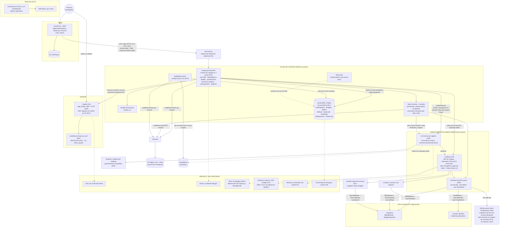
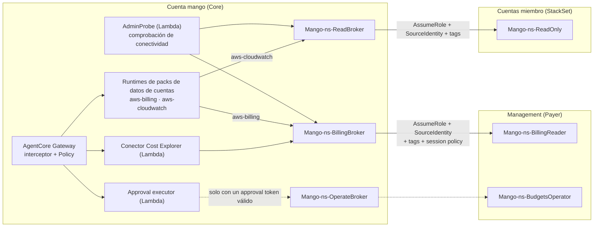

# Mango Hub: arquitectura AWS de referencia

> Fecha: 2026-09-28 · Revisión de coherencia: 2026-10-05 · Puesta al día con lo construido: 2026-10-08 · Estado: **adoptada**. Nació como propuesta para discusión; sus decisiones están tomadas y registradas en §8 (las primeras son del mismo 2026-09-28).
> **Cómo leerla:** §1 a §7 describen el sistema que existe y la parte del plan que sigue sin construir. Lo que no está construido lleva la marca **previsto**. Donde este texto y una decisión de §8 difieran, manda la decisión. El resumen de qué existe: la tabla «Estado de lo construido», antes de §1.
> Base: análisis de [`aws-samples/bedrock-chat`](https://github.com/aws-samples/bedrock-chat) @ `4419d62` y verificación del estado de los servicios AWS a sep-2026.
> Los reportes de detalle, con referencias `archivo:línea` y URLs, están en [`research/`](./research):
> - [infra](./research/infra.md): infraestructura y CDK de bedrock-chat
> - [codebase](./research/codebase.md): backend y frontend de bedrock-chat
> - [vectors](./research/vectors.md): RAG y vector stores
> - [runtime](./research/runtime.md): runtime de agentes: AgentCore vs EKS/ECS/Lambda
> - [governance](./research/governance.md): identidad, RBAC, budgets, HITL, auditoría
> - [isb-multiaccount](./research/isb-multiaccount.md): despliegue multi-cuenta de Innovation Sandbox on AWS
>
> Diagramas en draw.io: [`diagrams/mango-reference-architecture.drawio`](./diagrams/mango-reference-architecture.drawio). Tiene 4 páginas: Overview, Request flow, Multi-account access y Release & upgrade. **Puestas al día el 2026-10-06:** dibujan lo construido, con lo previsto en un bloque aparte de cada página, marcado como «previsto».
> Modelo de amenazas: [`../security/threat-models/mango-architecture-threat-model.md`](../security/threat-models/mango-architecture-threat-model.md).
>
> Hechos críticos verificados en fuentes primarias de AWS el 2026-09-28:
> - AgentCore harness GA (jul-2026); Policy y Evaluations GA (mar-2026); Agent Registry GA (ago-2026).
> - Bedrock Agents Classic en *maintenance mode* desde el 30-jul-2026.
> - CloudTrail Lake cerrado a clientes nuevos desde el 31-may-2026.
>
> Nota: `research/codebase.md` §8 marca como "preview" servicios que ya son GA; en eso manda `research/runtime.md`.

---

## Estado de lo construido (2026-10-06)

Cada fila se comprobó contra el código de `main`: el archivo citado existe y hace lo que dice. La tabla se armó el 2026-10-05 y se repasó entera el 2026-10-06, al poner al día el cuerpo del documento; las filas que nombran otra fecha se comprobaron ese día. «Hecho» significa que hay código y pruebas, no que esté probado en una instalación de producción. Lo que no está aquí no se comprobó.

| Capacidad | Estado | Dónde está | Decisiones |
|---|---|---|---|
| Chat con streaming y fase del turno en vivo | Hecho | `POST /api/chat` en `apps/api/src/mango_api/app.py` | D39, D57 |
| Agente FinOps de la release | Hecho | `agents/finops/agent.json` | D4, D34, D42 |
| Marketplace, Agent Builder, Revisión y Org Chart | Hecho | `apps/api/src/mango_api/agents.py`; `apps/web/src/pages/` | D18, D30, D38 |
| Publicar y retirar agentes por SDK, sin CodeBuild | Hecho. En una cuenta que nunca usó AgentCore la primera publicación fallaba: el provisioner no podía crear el rol vinculado de identidad de AgentCore (visto en una primera instalación el 2026-10-07). Desde D40 (5) puede crear ese rol y solo ese: visto ese mismo día en otra instalación desde cero (el provisioner creó el rol y el agente de la versión se publicó) y, el 2026-10-08, en la actualización de una instalación con datos (D40 (6)) | `functions/provisioner`; `infra/lib/constructs/provisioner.ts` y `deprovisioner.ts` | D25, D40, D48 |
| MCP packs firmados, con egress restringido | Hecho: tres packs de lectura. El provisioner de packs también puede crear el rol vinculado de identidad de AgentCore (D43 (4), del 2026-10-07; comprobado con tests y visto llegar en una actualización el 2026-10-08, sin que ninguna instalación lo haya ejercitado: el rol lo creó antes el provisioner de agentes, D43 (5)) | `packs/aws-pricing`, `packs/aws-billing`, `packs/aws-cloudwatch`; `infra/lib/constructs/pack-network.ts` | D19, D36, D43, D54 |
| RBAC L1 (Verified Permissions) | Hecho | `policies/cedar/platform/` (15 políticas) | §4.5 |
| RBAC L2 (Cedar en el Gateway) | Hecho por tool y por tipo de usuario; no por agente | `infra/lib/constructs/tools.ts` y `write-tools.ts`; `functions/provisioner/src/mango_provisioner/packs/gateway.py` | D33, D45 |
| Identidad del usuario hasta el destino | Hecho: pagadora y cuentas miembro | `packages/py/mango-aws`; `infra/lib/constructs/member-access.ts` | D10, D37, D49, D51, D55 |
| Presupuesto con reserva previa | **A medias:** solo por usuario y por agente | `apps/api/src/mango_api/budget.py` | §4.5 |
| Un turno cortado nunca cuesta cero (comprobado el 2026-10-06) | Hecho. **Visto en una instalación de laboratorio** el 2026-10-06 (D73 (17)): la reserva y el registro del turno van en una transacción; con final desconocido se cobra lo conocido y el resto queda retenido y cuenta para el tope; una función cada 5 minutos concilia con las trazas de AgentCore. Esa validación encontró que un turno cortado por su límite de tiempo se conciliaba con costo cero (D73 (18)). **La corrección se vio ese día en una instalación de laboratorio** (D73 (19) y (21)): se suman también las llamadas al modelo y se espera a que terminen; un turno cortado por tiempo se concilió por su llamada, con el costo de su traza, 3 min 24 s después de empezar. Un turno retenido puede esperar dos pasadas (se vieron 8 min 27 s, D73 (22)). Sin ver: el cobro por la reserva al plazo, el motivo `model_call_unfinished`, las filas 6, 7, 9 y 10 de la tabla de D73 y las dos alarmas (D73 (23)). La fila 6 está comprobada con tests que leen el error como lo lanza el SDK; un error que llegara como evento termina el turno igual, y una conversación nueva cuyo primer turno no se respondió no recibe título (D73 (24) a (26), decididos el 2026-10-07; sin ver en una instalación). **El tope de tokens en cada llamada al modelo está desplegado en una instalación de laboratorio** desde el 2026-10-06 (D74 (12)): viaja y corta; la reserva cubre una llamada entera; un turno de varias llamadas puede costar más. Esa instalación mostró que una respuesta cortada en su tope terminaba como error, sin guardarse y con la reserva retenida. **El arreglo se desplegó y se vio ese día en esa instalación** (D74 (13), aceptado por delegación del dueño el 2026-10-06, que lo confirmó el 2026-10-07; D74 (15)): ese turno termina como final conocido, con su texto guardado y liquidado al momento. Visto en un turno, sin tools; sin ver, el tope en un turno con tools (D74 (16)). Una tool de escritura cortada por el tope, o por cualquier otro final que no sea `tool_use`, no pide confirmar nada (D74 (18), 2026-10-07): comprobado con tests, sin ver en una instalación | `packages/py/mango-core/src/mango_core/budget_turns.py`; `apps/api/src/mango_api/budget.py`, `pricing.py` y `harness.py`; `functions/budget-reconciler`; `infra/lib/constructs/budget-reconciler.ts` | D73, D74 |
| Jerarquía de presupuestos instalación → área → equipo → usuario | No hecho | — | §4.5 |
| Límite de presupuesto por agente editable | No hecho | La API solo edita los valores por defecto y el límite por usuario (`apps/api/src/mango_api/admin.py`) | D17, D22 |
| Reconciliación del gasto contra CUR | No hecho | — | §4.5 |
| Aprobación de tools de escritura | Hecho, con una tool. Solo un mensaje del modelo que terminó como llamada a tool (`tool_use`) pide confirmar una escritura: cualquier otro final, o ninguno, no pide nada (D74 (18), decidido el 2026-10-07; comprobado con tests, sin ver en una instalación) | `connectors/aws-budgets` (`create_budget`); `apps/api/src/mango_api/approvals.py`; `functions/approval-executor` | D27, D56, D74 (18) |
| Tool de escritura en un agente de la release | No hecho | `approval_tools: []` en `infra/lib/constructs/release-agents.ts` | — |
| Auditoría en S3 con Object Lock | **A medias:** hash por evento, sin cadena ni digest firmado; bucket en la cuenta de la instalación, `GOVERNANCE` por defecto | `apps/api/src/mango_api/audit.py`; `infra/lib/constructs/governance.ts` | §4.5 |
| Guardrail base compartido | Hecho | `infra/lib/constructs/agent-platform.ts` | D34 |
| Guardrail por agente y sobre salidas de tools | No hecho | `ApplyGuardrail` solo aparece como permiso de IAM | §4.5, D34 |
| RAG y bases de conocimiento | No hecho | — | §4.4 |
| Router «Asistente Mango» | No hecho | — | §4.3 |
| Memoria de AgentCore | No hecho: desactivada a propósito | `functions/provisioner/src/mango_provisioner/harness.py` | D13 |
| Skills, tareas programadas y evals | No hecho | Sin pantalla ni API; fuera de `AVAILABLE_VIEWS` (`apps/web/src/layouts/navigation.ts`) | D26, D38 |
| Delegación entre agentes | No hecho (fase 2) | — | D30 |
| SSO con el IdP del cliente | No hecho en la infraestructura | El cliente del User Pool solo admite `COGNITO` (`infra/lib/constructs/identity.ts`) | D20, D53 (6) |
| Editar MFA, duración de sesión e IdP desde la app | No hecho | — | D21 |
| Gestión de personas y grupos de acceso | Hecho | `apps/api/src/mango_api/people.py` y `group_admin.py` | D44, D60 a D62, D66 |
| Sesión web que sobrevive a la recarga | Hecho. Se crea y se renueva con la operación firmada de Cognito, que no pasa por el WAF del user pool | `apps/api/src/mango_api/web_session.py` | D63, D64, D72 |
| Límites por IP para una oficina detrás de una sola dirección | Hecho; los tres bloqueos y las dos alarmas se vieron el 2026-10-06 en una instalación de laboratorio: 6.000 peticiones a `/api/*` y 20.000 en total en el borde, 1.500 operaciones con secreto y 5.000 en total en el user pool, cada 5 minutos. Los números son aproximados: el WAF tarda entre 34 y 52 segundos en empezar a bloquear y hasta entonces deja pasar todo. Un bloqueo del borde responde 429 con una espera de 180 segundos y avisa. Los bloqueos del borde se vieron ese día en un navegador: cada pantalla muestra su error genérico, sin decir que es un límite ni cuánto esperar, y la persona no vuelve al ingreso; en una red con más de una salida el bloqueo puede ser parcial. La regla de correos del user pool bloqueó de verdad, dos veces; la segunda, con las pantallas de ingreso ya corregidas, las tres se quedaron en su formulario con el error genérico (D20, puntos del 2026-10-06; D72 (20)). Falta provocar la regla total del user pool. Sin redes de confianza | `infra/lib/constructs/edge.ts` e `identity.ts`; `operational-alarms.ts`; `apps/web/src/pages/login/errors.ts` | D72, D20 |
| Distribución por plantillas, con seis parámetros | Hecho | `infra/lib/config/release.ts`; `docs/runbooks/install.md` | D8, D58 |
| Comprobación de una instalación, de solo lectura (comprobado el 2026-10-08) | Hecho. Falla si un agente de la versión no está publicado y servido, o si ningún usuario de prueba tiene un agente activo; un código TOTP que Cognito rechaza se reintenta una vez. **Visto en una instalación de laboratorio** el 2026-10-08 (D75 (8)): la corrida pasó con su agente publicado, y un rechazo provocado (`ExpiredCodeException`) se reintentó y pasó. Ese día pasó también en una instalación sin segundo administrador y con el stack `Core` en `DELETE_FAILED`. Sin ver en una instalación: un veredicto de fallo y un segundo rechazo seguido (con tests). No prueba que el agente responda: eso es el recorrido con efecto `chat`. **Tampoco ve un agente cuyo harness ya no existe** (lee la API, que no pregunta a AgentCore): visto el 2026-10-08 tras un fallo del `UninstallGuard` a medio barrido, pasó con el harness borrado (D75 (9)) | `tests/install`; `docs/runbooks/install.md` | D75 |
| Dominio propio y TLS de punta a punta | No hecho | Certificado por defecto de CloudFront (`infra/lib/constructs/edge.ts`) | D15 |
| Más de una tarea de `mango-api` | Hecho: dos tareas en dos zonas, con IP pública y sin autoescalado. Los límites de tasa que sostienen una excepción de seguridad o acotan abuso se cuentan en DynamoDB; cuatro siguen por tarea (el cuarto, el de las listas de agentes, desde D70 (11)). Un turno de chat abierto durante una actualización terminó bien (2026-10-06, en una instalación de laboratorio). Medido ese día con una prueba de carga: 80 lecturas por segundo con margen y 160 en el límite, unas 330 personas activas a la vez; se promete «hasta unas 300», si la cuota de Bedrock de la cuenta acompaña (`deployment/check-bedrock-quotas.py`). Visto ese día con la versión instalada: el balanceador reparte por peticiones abiertas (la tarea rápida recibió el 57 %); `mango-api` espera a un turno lo que dura su límite (con la cuota de Bedrock baja los turnos se alargan y no fallan); al parar una tarea con turnos abiertos terminaron todos, dentro de los 120 s de espera; y el límite de las listas de agentes corta exacto. Que `mango-api` suelta los clientes de datos por persona que caducan: hecho, sin probar todavía en una instalación | `infra/lib/constructs/api-service.ts`; `apps/api/src/mango_api/harness.py` (`TurnClients`); `apps/api/src/mango_api/limits.py` y `rate_limits.py`; `docs/specs/api-state-inventory.md` | D15, D70 |
| Alarmas operativas y tablero (comprobado el 2026-10-06) | Hecho; el correo llega (dos alarmas de prueba, 2026-10-06, en una instalación de laboratorio). `PackDns-blocked` ya no cuenta lo que pide la máquina de AgentCore (`time.aws.com`, lista aparte) y la red de packs registra sus consultas DNS: visto desplegado el 2026-10-06 con el pack `aws-cloudwatch`; faltan `aws-pricing` y `aws-billing`. Dos alarmas de saturación desde el 2026-10-06: `Bedrock-throttled` (Bedrock rechaza llamadas por la cuota de la cuenta) saltó ese día con rechazos de verdad en una instalación de laboratorio; `Api-slow` (la aplicación responde lento) tiene datos y no se ha visto saltar | `infra/lib/constructs/operational-alarms.ts`; la del DNS Firewall, en `pack-network.ts`; `docs/runbooks/operations.md` | D71 |
| Firma de la release y verificación antes de instalar (comprobado el 2026-10-06) | Hecho: manifiesto firmado con la llave de KMS del proveedor; quien instala lo verifica con un guion | `deployment/dist.py`; `deployment/verify-release.py`; `infra/lib/stacks/provider-stack.ts` | D36, D58 (4), D69 |
| Reconciliación diaria de agentes, solo lectura (comprobado el 2026-10-06) | Hecho | `functions/reconciler`; `infra/lib/constructs/reconciler.ts` | D41, D48 |
| Desinstalación que borra lo creado por API (comprobado el 2026-10-06) | Hecho, con un permiso corregido el 2026-10-07. El `UninstallGuard` corrió por primera vez con algo que borrar el 2026-10-07 (dos agentes y un pack, en una instalación de laboratorio): no pudo borrar la política del pack y `Core` quedó a medio borrar. Le faltaba `bedrock-agentcore:ManageResourceScopedPolicy` sobre el Gateway; con ese permiso puesto a mano completó el barrido en unos 9 minutos. La plantilla ya lo trae y el guard dice qué operación le falló. Desde el 2026-10-08 el guard depende de todos los demás recursos de `Core`, y de los cinco con condición a través de un ancla: si falla, el stack no borra nada más y la instalación queda en pie, y su mensaje dice si repetir el borrado sirve (decidido por el dueño ese día; el ancla, probada en AWS con stacks de relleno). **Visto en una instalación ese mismo día** (D58 (18)), con `v0.1.0-g6f9b8e4` instalada desde cero y el fallo provocado dos veces: `DELETE_FAILED` a los 11 s y a los 317 s, con un solo recurso fallido, nada más borrado y los cinco condicionales en pie; arreglada la causa, `Core` se borró en 18 min 4 s y nada empezó a borrarse antes de que el guard terminara (unos 23 minutos el camino completo, como antes del cambio). Ninguna alarma saltó con esos fallos, y tras el segundo la aplicación siguió listando un agente sin harness. La actualización de una instalación con datos a esa versión trajo 17 entradas y no invocó la función del guard. Nombrar al segundo administrador por parámetro redespliega la API. Las desinstalaciones de ese día mostraron además dos cosas: `Core` fallaba la primera vez por el almacén de políticas de Verified Permissions (nacía con protección de borrado y la plantilla mandaba borrarlo; ya nace sin ella, decidido por el dueño ese día; para las versiones anteriores la salida está en el runbook), y la purga de lo retenido dejó 3 de 4 buckets y 7 llaves KMS. La purga está corregida (llaves por la etiqueta `mango:namespace`, salto de retención solo donde hay Object Lock, error si algo queda, y no corre hasta saber que `Core` y `PackNetwork` no existen). **Los tres arreglos, vistos en una instalación:** el 2026-10-07, con `v0.1.0-g5c86ad2`, `Core`, con dos agentes y un pack, se borró a la primera en 23 min 34 s (el guard borró la política del pack y el almacén se borró con el stack); el 2026-10-08 la purga corrió en dos instalaciones ya desinstaladas, 89 s cada una, sin error y sin dejar nada de lo que listó. El 2026-10-08 una instalación con datos se actualizó a esa versión: el almacén perdió la protección sin reemplazo y conservó su id y sus 15 políticas. Falta ver en la purga un bucket en otra región, la retención `COMPLIANCE`, una llave ilegible y un fallo a medias (solo con tests). La red de packs se borra en dos veces si hubo algún pack: AgentCore soltó sus interfaces de red unas 8 horas después de borrarse el Runtime (dos medidas), sin costo mientras tanto. Desinstalar no apaga CloudWatch Application Signals, que queda activo para toda la cuenta; desde el 2026-10-08 la purga nombra su log group y no lo borra (D58 (15)) | `infra/lib/constructs/uninstall-guard.ts`; `deployment/purge-retained.sh`; `docs/runbooks/install.md`, paso 5 | D58 (7), (8), (9), (12), (13), (14), (15), (16), (17), (18) |
| Trazas de agentes sin contenido (comprobado el 2026-10-06) | Hecho | `infra/lib/constructs/observability.ts`; `functions/provisioner/src/mango_provisioner/harness.py` | D16 |
| Otra región que `us-east-1` | No hecho: la configuración solo admite esa región | `infra/lib/config/schema.ts` | D2, D71 (7) |
| Migraciones de datos y modo mantenimiento | No hecho | — | D9, §4.12 |
| Diagnóstico exportable y stack de soporte | No hecho | — | D7, §4.11 |
| Acceso de admins a conversaciones | No hecho | — | D23 |
| Clientes M2M y MCP remotos del cliente | No hecho | — | §4.5, D19 (3) |
| Plantilla de SCP y tests de aislamiento | No hecho | No existen `policies/scp` ni `tests/isolation` | D11 |

---

## 1. Resumen ejecutivo

1. **bedrock-chat se usa como cantera, no como fork.** Aporta buenos patrones de dominio. Su esqueleto choca con Mango en tres puntos:
   - Aprovisiona con `cdk deploy` en runtime vía CodeBuild, un stack por bot.
   - Usa OpenSearch Serverless y OSIS, que suman ~550 USD/mes fijos sin usuarios.
   - Ejecuta el agente dentro de una Lambda WebSocket, con el mismo rol IAM para todos los bots, sin MCP, sin HITL y sin budgets.
2. **El plano de ejecución de agentes es Amazon Bedrock AgentCore:**
   - Runtime con microVM por sesión.
   - *Harness* declarativo: agente = configuración.
   - Gateway MCP como única superficie de tools, con Policy (Cedar).
   - Observability: trazas sin contenido (D16).
   - **Previsto, sin usar todavía:** Identity para OBO/3LO, Memory (desactivada a propósito, D13) y Evaluations.
   - **EKS se descarta por ahora**: exige 1–2 FTE de plataforma para reconstruir lo que AgentCore ya trae.
3. **El plano de control lo construimos nosotros, y es el producto.** Incluye marketplace y Agent Builder, RBAC, **presupuestos en dólares con reserva antes de cada turno**, aprobaciones, gestión de personas, audit trail e historial de conversaciones. AgentCore no trae nada de esto. El router que elige el agente es **previsto**.
4. **RAG sin OpenSearch Serverless (previsto, sin construir):**
   - Default: Bedrock KB sobre **S3 Vectors**, compartidas por perfil de indexación, con filtros de metadata por área, KB y ACL.
   - Tier premium: **Bedrock Managed Knowledge Base**, con conectores Drive/SharePoint/Confluence, ACL por usuario, hybrid search y rerank.
5. **Costo fijo por instalación sin tráfico: entre 210 y 230 USD/mes** a precios de lista, estimado y sin contrastar con una factura (§6). Más que los ~100–150 del plan original: la red cerrada de los MCP packs (D54) es hoy la partida mayor. Todo lo demás se paga por consumo. **La palanca de costo real son los tokens**; por eso los presupuestos son la pieza propia más importante.
6. **Una instalación sirve hasta unas 300 personas activas a la vez** (D70 (9)), si la cuota de Bedrock de la cuenta deja pasar sus turnos. De dónde sale la cifra y cómo se opera: §4.15.

---

## 2. Principios de arquitectura

| # | Principio | Consecuencia |
|---|---|---|
| P1 | **Serverless y pago por uso por defecto** | Lo que tiene costo fijo es lo que no admite otra forma: `mango-api` con su balanceador, los dos WAF y la red de los MCP packs. Sin NAT: `mango-api` sale con IP pública (D15) y los packs solo alcanzan endpoints de VPC (D54) |
| P2 | **Un solo punto de paso para tools** | Toda tool, MCP propio o de terceros, va detrás de AgentCore Gateway. Ahí se aplican identidad, policy, la firma de la invocación y el token de aprobación, fuera del alcance del LLM |
| P3 | **El agente es configuración, no un despliegue** | Crear o publicar un agente es una llamada a API. **Nunca build ni `cdk deploy` en runtime** (lección de bedrock-chat); stacks de CloudFormation solo desde plantillas de la release (D25) |
| P4 | **Gobernanza preventiva, no reactiva** | Autorizar y reservar presupuesto *antes* de gastar. Lo que se hace después solo reconcilia: hoy, la conciliación de turnos cortados con las trazas (D73); la reconciliación contra la factura (CUR) es prevista |
| P5 | **Identidad del usuario hasta el sistema destino** | AssumeRole con `SourceIdentity` (hoy); OBO/3LO para sistemas externos (previsto). Prohibido que una tool use el rol del runtime para datos de usuario |
| P6 | **Estándares abiertos en los bordes** | En uso: MCP (tools), OTel GenAI y Cedar. Previstos: AgentSkills.io (skills) y A2A (delegación). Mitiga el lock-in con AgentCore |
| P7 | **Contexto organizacional en todo** | Como la instalación es de un solo cliente (D1), el aislamiento principal es la cuenta. Dentro de ella, el área (`business_unit`), los grupos de acceso y el usuario viajan en el token, en las claves de DynamoDB (`LeadingKeys` por usuario), en las políticas Cedar y en los eventos de auditoría. No existe un identificador de cliente: el `tenant_id` que el plan original reservaba para un modo SaaS no se construyó |

---

## 3. Vista general

> Este diagrama está al día (2026-10-06): lo construido va con línea continua y lo previsto, aparte y con línea discontinua. El archivo de draw.io ([`diagrams/mango-reference-architecture.drawio`](./diagrams/mango-reference-architecture.drawio)) se puso al día el mismo 2026-10-06 y dibuja lo mismo con más detalle: la vista general, el flujo de un turno de chat, el acceso multi-cuenta y la release con su actualización.



Qué cambió respecto al diagrama del plan: el ingreso es propio y no un SSO; no hay router; el Gateway tiene tres clases de target (un conector, el ejecutor de escrituras aprobadas y los packs); los packs corren en una red cerrada propia; `mango-api` son dos tareas con sesión por cookie y límites de tasa compartidos; y hay dos funciones de conciliación, alarmas y un tablero. Las cifras de alarmas son las de la plantilla sintetizada con la configuración de ejemplo el 2026-10-06.

---

## 4. Decisiones por dominio

### 4.1 Runtime de agentes

| Decisión | Detalle | Estado |
|---|---|---|
| **AgentCore Runtime + harness por defecto** | Cada agente del marketplace es un *harness* con modelo, prompt, tools (referencias al Gateway) y límites. Hay **un harness por agente**: cada versión aprobada es un `UpdateHarness` y `mango-api` invoca el endpoint `live` (D32). Lo crea el provisioner (Step Functions + Lambda) por SDK, sin contenedor. El primer Runtime de una cuenta hace que AgentCore cree su rol vinculado de identidad con los permisos de quien llama: los dos provisioners pueden crear ese rol y ningún otro de ese tipo, salvo el de red en el de packs (D40 (5), D43 (4)). Memoria desactivada (D13) y sin skills (D38) | Hecho |
| **Fuente de verdad = definición del agente en DynamoDB** | Tabla `Agents`. Qué versión sirve un agente lo dice el puntero `PUBLISHED#<id>`, que solo escribe el provisioner (D40). `mango-api` arma cada invocación desde la versión publicada. Como el harness exporta a Strands, la misma definición podría correr en un runtime propio si hiciera falta salir de AgentCore | Hecho |
| **Strands code-defined en Runtime para casos avanzados** | Supervisor multi-dominio y prompts por etapa. El harness solo soporta *agent-as-tool* y no *routing* multi-agente | Previsto |
| **Claude Agent SDK en Runtime** solo para agentes "trabajador de archivos/código" | Necesitan filesystem y skills estilo Claude Code | Previsto |
| **Contrato interno `AgentInvoker`** en mango-api | Ocultaría harness, runtime code-defined u otro backend futuro. Hoy la invocación del harness vive en un solo módulo (`apps/api/src/mango_api/harness.py`), sin esa interfaz | Previsto |
| **Descartados** | Bedrock Agents Classic (maintenance mode). EKS/kagent: se revisa si hay requisito multicloud/on-prem. Lambda no ejecuta el loop del agente; solo tools y jobs | — |

Límites a tener presentes:
- **De Mango:** una sesión del runtime por conversación, con 300 s de inactividad y 8 h de vida máxima (D39). Un turno dura 120 s por defecto y hasta 600 s si el agente lo configura (D70 (6)). Un turno a la vez por conversación.
- **De AgentCore** (verificados el 2026-09-28): 2 vCPU/8 GB por sesión; 25 sesiones nuevas por segundo y 2 500–5 000 sesiones activas por cuenta.
- **De Bedrock:** la cuota de llamadas por minuto de cada modelo es de la cuenta y es lo primero que se agota en el chat (§4.15).
- **Región:** hoy Mango solo se instala en us-east-1 (§4.7).

### 4.2 Tools, MCP y skills

- **Un AgentCore Gateway por instalación**, con sesiones MCP (D47). Targets que existen hoy:
  - `finops`: el conector de Cost Explorer (Lambda).
  - `ops`: el approval executor (Lambda), que ejecuta las escrituras aprobadas (D56).
  - Uno por MCP pack habilitado, de tipo `mcpServer`, hacia su Runtime (D36).
- **Previstos:** targets OpenAPI (SAP OData), `knowledge-retrieve`, MCP de terceros con 3LO (Drive) y Runtime como *agent-as-tool*.
- **Conectores y packs:**

  | Sistema | Patrón | Identidad | Estado |
  |---|---|---|---|
  | Cost Explorer | Conector de Mango: Lambda target. Filtra por las cuentas del área de quien pregunta (`per_user`, D35) | `BillingBroker` → `BillingReader` en la pagadora, con `SourceIdentity` = usuario, session tags y una session policy de una acción por llamada | Hecho |
  | AWS Billing and Cost Management | Pack `aws-billing` (awslabs), 9 tools de lectura (D52). Solo usuarios centrales | La misma cadena de la pagadora, con una aserción firmada de quién llama (D49) | Hecho |
  | CloudWatch | Pack `aws-cloudwatch` (awslabs): métricas, alarmas y metadatos de log groups, sin eventos de log (D55). Solo usuarios centrales | `ReadBroker` → `ReadOnly` en la cuenta miembro que nombra la pregunta, con `SourceIdentity` = usuario | Hecho |
  | AWS Pricing | Pack `aws-pricing` (awslabs): precios de lista públicos | Rol propio del pack, sin datos de cuentas | Hecho |
  | AWS Budgets | Conector de Mango `aws-budgets`: `create_budget`, la única tool de escritura (D56) | `OperateBroker` → `BudgetsOperator` en la pagadora, solo con un approval token válido | Hecho |
  | SAP | OpenAPI (BTP/OData) o MCP de SAP, **VPC egress** a la red del cliente | OAuth **OBO** vía Identity; escritura siempre con aprobación | Previsto |
  | Google Drive | Lectura: Managed KB (ACL nativa). Acciones: MCP con **3LO** + Consent Portal | Token del usuario en el vault de Identity | Previsto |

- **Red de los packs (D54):** los Runtimes de packs corren en una VPC propia sin internet ni NAT. Solo alcanzan los endpoints de VPC de los servicios que declara su manifiesto firmado, con un DNS Firewall que resuelve esos nombres y nada más, y registro de consultas (D71 (13), (14)).
- **Skills** en formato AgentSkills.io (`SKILL.md`), **previsto, sin construir** (D26, D38):
  - Se guardarían en **S3 versionado**, referenciadas por agente en el harness.
  - Sus scripts correrían con el tool `shell` *dentro de la microVM de la sesión*; los agentes que no ejecutan scripts no tienen `shell` ni `file_operations`.
  - El flujo de aprobación de **Agent Registry** entraría en la fase 2 como catálogo gobernado de tools/skills/MCP.
- **Cómo entran los MCP (D19):** conectores propios de Mango y **MCP packs** curados (servidores de awslabs empaquetados en un zip, escaneados y firmados en el CI de Mango, hospedados en AgentCore Runtime). Se habilitan desde la app con doble aprobación. Los MCP remotos del cliente son previstos (v1.x). Nunca se instalan paquetes arbitrarios en la cuenta del cliente. Detalle en `docs/specs/marketplace-v1.md`.

### 4.3 Plano de control y streaming

- Un solo servicio **`mango-api` (Python/FastAPI) en ECS Fargate** detrás de un ALB interno y CloudFront. Sirve el chat por streaming (**SSE**, con eventos propios: texto, fase del turno, aprobación y error; D57), el catálogo, la administración y la sesión web.
  - **Por qué Fargate y no Lambda + API GW WebSocket (como bedrock-chat):**
    - Elimina el límite de 32 KB por frame y el reensamblado por trozos en DynamoDB.
    - Elimina el tope de 15 min y el WebSocket anónimo en `$connect`.
    - Las conexiones de streaming largas son naturales en un contenedor.
  - **Dos tareas, una por zona, número fijo y sin autoescalado** (D70): 0,5 vCPU y 1 GB cada una, arm64, con IP pública (D15). El balanceador manda cada petición a la tarea con menos peticiones abiertas.
  - **Una actualización no corta el servicio:** arrancan las tareas nuevas y las anteriores conservan 120 s sus peticiones abiertas. Un turno más largo que eso se corta (D70 (6)).
  - **Sin estado que decida en la tarea:** cualquier tarea atiende a cualquier persona. Los límites de tasa que importan se cuentan en DynamoDB y las copias en memoria duran segundos. Inventario: [`docs/specs/api-state-inventory.md`](../specs/api-state-inventory.md).
  - **Sesión web (D63):** una cookie `HttpOnly` de `mango-api` permite renovar el access token tras recargar; dura 8 h como máximo. El resto de la API sigue validando access tokens de Cognito, que viven solo en memoria.
  - Costo: unos USD 36 al mes las dos tareas con sus IP y unos USD 16 a 20 el balanceador, a precios de lista (D70 (7); `docs/runbooks/install.md`).
- **Router (previsto, sin construir):**
  - Hoy la persona elige el agente en el marketplace, y la conversación guarda el agente de su primer turno (D42).
  - Plan: si el usuario no elige ("Asistente Mango"), un clasificador Haiku con structured output elige entre las Agent Cards *ya filtradas por RBAC*, con umbral de confianza. Viviría fuera de AgentCore para que la decisión sea barata, auditable y posterior al RBAC.
- **Step Functions** para operaciones largas, siempre por **llamadas SDK** (nunca CodeBuild + CDK):
  - Publicar un agente (`AgentProvisioner`), retirarlo (`AgentDeprovisioner`, D48) e instalar un pack (`PackProvisioner`, D43).
  - Cada una tiene su rol. Los dos que crean Runtimes crean roles solo bajo su prefijo y con su permissions boundary; fuera de eso solo pueden crear los roles vinculados al servicio que AgentCore necesita en la cuenta: el de identidad (los dos; D40 (5), D43 (4)) y el de red (el de packs, D54).
  - Ingesta de KB, reutilizando el lock S3 y la ingesta incremental de bedrock-chat (previsto; no hay KB todavía).
  - Las aprobaciones HITL **no** pasan por Step Functions (D56 (2)); ver §4.5.
- **Trabajos programados:** la reconciliación diaria de agentes, de solo lectura (D41), y la conciliación del presupuesto cada 5 minutos (D73). Las dos son Lambdas con cola de mensajes fallidos.

### 4.4 RAG / Knowledge

> **Estado (2026-10-06): previsto, sin construir.** No hay bases de conocimiento, ni el MCP `knowledge-retrieve`, ni ingesta. Lo que sigue es el diseño.

| Tier | Backend | Costo (chico / mediano / grande)* | Cuándo |
|---|---|---|---|
| **Standard (default)** | Bedrock KB customer-managed + **S3 Vectors**, pooled por "perfil de indexación" | ~0,3 / ~8 / ~125 USD/mes | Todo agente con documentos propios |
| **Premium** | **Bedrock Managed KB** | ~55 / ~1 250 / ~15 000 USD/mes (lo domina el costo por Retrieve) | Conectores con ACL nativa (Drive, SharePoint, Confluence), hybrid, rerank, agentic retrieval. *Pass-through* al cliente |
| Search+ (futuro) | OpenSearch con motor S3 Vectors o AOSS NextGen (scale-to-zero) | a evaluar | Búsqueda exacta de códigos (SAP) o <50 ms. Validar primero si Bedrock KB soporta NextGen |
| Add-on | Neptune Analytics (GraphRAG) | ~350 USD/mes, ~35 en pausa | Solo agentes que necesiten grafo |

*Escenarios de `research/vectors.md` §3: chico = 10 KB / 1 GB, mediano = 100 KB / 50 GB, grande = 1 000 KB / 1 TB.

- **Aislamiento.** Cada chunk lleva metadata `business_unit`, `kb_id`, `acl_groups` y `classification`, inyectada en la ingesta con una custom transformation Lambda (patrón de bedrock-chat).
  - El filtro lo construye **siempre el MCP `knowledge-retrieve`** a partir del JWT verificado, nunca el LLM.
  - Habrá tests de aislamiento entre áreas y KBs en CI.
- **Cuotas que condicionan el diseño:**
  - **100 KBs customer-managed por cuenta (no ajustable)**: obliga al modelo pooled.
  - **Retrieve a 20 req/s**: validar en Service Quotas; si hace falta, cache semántico o subir a Managed KB (600 RPM por KB, ajustable).
- Calidad sin hybrid: chunking jerárquico/semántico, rerank opcional por agente (Cohere Rerank 3.5, 2 USD/1k, cargado al budget del agente) y query rewriting.

### 4.5 Gobernanza

**Identidad:**
- **Cognito Plus** (D29; toda instalación es de tipo cliente, D58 (5)) con **login propio** en la SPA: flujo SRP, MFA con TOTP obligatorio y registro solo con correos de los dominios de la empresa, validados en una Lambda *pre sign-up* (D20). Un WAF regional protege las operaciones públicas del user pool (D28). Cuando ese WAF, el límite de tasa de Cognito, la red o el servicio rechazan el envío de un código, la pantalla se queda en su formulario con un error genérico en vez de decir que lo envió; lo que depende de la cuenta sigue respondiendo igual exista o no (D20, puntos del 2026-10-06). Visto ese día en una instalación de laboratorio, bajo un bloqueo real de ese WAF: «Enviar código», «Reenviar código» y «Crear cuenta» se quedaron en su formulario con el error, sin enviar ningún correo ni crear ninguna cuenta. Sin mirar en un navegador: el límite de intentos por usuario de Cognito, que sigue avanzando sin error.
- Access tokens de 60 minutos, enriquecidos por una Lambda *pre-token* con el rol, el área y la marca de usuario central (`mango_role`, `mango_business_unit`, `mango_central`), calculados desde los grupos de Cognito y el registro de grupos (D35, D44).
- **Sesión web con cookie del servidor** (D63): `mango-api` guarda el refresh token cifrado con KMS en una cookie `HttpOnly` y lo usa solo para renovar. La sesión dura 8 h. Crea y renueva con la operación firmada `AdminInitiateAuth`, que no pasa por el WAF del user pool (D72).
- Las personas y sus grupos se gestionan desde la app, con doble aprobación para los grupos sensibles (D44, D60).
- **Previsto, sin construir:** federación con **el IdP del cliente** (SAML/OIDC; una sola por instalación; falta decidir cómo recibe sus grupos un usuario federado, D53 (6)), clientes M2M con *client credentials* (no API keys) e IAM Identity Center para los operadores de Mango (D7).

**Autorización en 3 niveles, todo en Cedar:**

| Nivel | Pregunta | PDP / PEP |
|---|---|---|
| L1 plataforma | ¿Puede usar, crear, editar, publicar o aprobar el agente X, o administrar personas, grupos, modelos y packs? | Verified Permissions en mango-api, con 15 políticas estáticas (`policies/cedar/platform/`). `UseAgent` se decide en cada petición con los grupos y personas del agente como datos (D33) |
| L2 tools | ¿Puede *este tipo de usuario* llamar a esta tool? | **AgentCore Policy** en el Gateway, default-deny y con cada restricción repetida como `forbid` (D45 (5)). El Gateway solo ve al usuario, no al agente: las tools de cada agente se aplican con `allowedTools` y con la firma de la invocación que verifica el interceptor (D33) |
| L3 destino | ¿El sistema acepta la acción del usuario? | IAM, vía identidad propagada: el rol detrás del broker y una session policy por llamada. Permisos nativos de SAP o Google: previsto |

**Presupuestos (servicio propio; AWS no ofrece enforcement en tiempo real):**
- **Dos ámbitos hoy:** por usuario y por agente, por mes. Valores por defecto de la release: USD 5 por usuario y USD 30 por agente (D58 (10)). Los administradores editan los valores por defecto y el límite de un usuario; el de un agente todavía no (D17).
- **Previsto:** la jerarquía `instalación → área → equipo → usuario` y el ámbito `api_client`.
- **Reserva antes de invocar:** una transacción condicional (`TransactWriteItems`) reserva en los dos ámbitos una estimación alta del turno (D74), con el precio del modelo elegido (D42), y escribe la fila del turno pendiente (D73). Si no cabe, el turno se rechaza (402) sin invocar nada. No se recorta `max_tokens` al saldo.
- **Final conocido:** se cobra el uso real, se libera el resto y se borra la fila, en una transacción.
- **Final desconocido** (`mango-api` dejó de leer, el harness falló, la tarea murió): se cobra lo ya sumado y **el resto queda retenido**. La regla: «no sé cuánto costó» nunca se anota como «costó cero» (D73).
- **Conciliación:** la función `Mango-<ns>-BudgetReconciler` corre cada 5 minutos y lee las trazas de la sesión del turno. Lo suma dos veces, por invocaciones (`invoke_agent`) y por llamadas al modelo (`chat <id del modelo>`), y cobra la mayor con el precio guardado. Sin nada legible 15 minutos después del límite de tiempo del turno, cobra la reserva entera, lo audita y dispara una alarma. Nada se cobra ni se libera dos veces. La tabla con todas las formas de terminar un turno está en D73 (6).
- **Un turno que el harness corta por su límite de tiempo** anota cero tokens en su invocación y la llamada al modelo sigue hasta acabar. Por eso el conciliador no cierra un turno mientras una llamada que el harness abrió no tenga su traza: la reserva sigue retenida hasta entonces, como mucho hasta el plazo (D73 (18) y (19)). Visto en una instalación de laboratorio el 2026-10-06 (D73 (21)): un turno así se concilió por su llamada al modelo, con el costo de su traza, 3 min 24 s después de empezar; y la llamada que siguió tras el corte paró en su tope. Un turno retenido puede esperar dos pasadas del conciliador si su hora de lectura cae segundos después de una: se vieron 8 min 27 s (D73 (22)). Sin ver: una llamada cuya traza no llega nunca y el cobro por la reserva al plazo (D73 (23)).
- **Cada llamada al modelo lleva un tope de tokens de salida** (D74; **desplegado en una instalación de laboratorio** desde el 2026-10-06): el «tokens por llamada» de la versión del agente o, si no lo fija, su máximo de tokens. `mango-api` lo envía en cada invocación, así que vale para los agentes ya publicados sin republicarlos. El `max_tokens` del agente, como límite del harness, no corta una llamada: se vieron 5.765 y 10.033 tokens con 4.096.
- **Una respuesta más larga que el tope se corta ahí.** El harness cierra entonces el turno con un error, después de entregar el mensaje y su uso. En la instalación del 2026-10-06 `mango-api` lo tomaba por un turno fallido: la persona veía un aviso de error, la respuesta no se guardaba y el resto de la reserva quedaba retenido hasta la conciliación (D74 (12)). **El arreglo** (D74 (13), aceptado por delegación del dueño el 2026-10-06, que lo confirmó el 2026-10-07): ese final es conocido, porque el uso de la llamada ya llegó y no queda ninguna en curso. Se guarda el texto hasta el corte, el chat lo muestra como una respuesta terminada, se cobra lo real y se libera el resto al momento. **Desplegado y visto ese día en una instalación de laboratorio** (D74 (15)), en un turno sin tools: la respuesta quedó guardada, el turno se liquidó al momento sin nada retenido, y el mensaje siguiente abrió una sesión nueva con la respuesta cortada a la vista del agente. La traza `invoke_agent` de ese turno sigue saliendo con error y sin tokens: la escribe el harness. Sin ver: el tope en una llamada posterior de un turno con tools, una llamada a una tool cortada a medias y un harness creado ya con el tope que pase una reconciliación diaria (D74 (16) y (17)). **Una tool de escritura cortada por el tope no pide confirmar nada** (D74 (18), decidido por el dueño el 2026-10-07): solo pide un mensaje que terminó como llamada a tool, así que de uno cortado no sale ninguna solicitud, ni de la llamada cortada ni de otra completa del mismo mensaje, y la persona repite la petición. El turno se liquida igual: final conocido si llegó el uso de ese mensaje. Comprobado con tests, sin ver en una instalación. La primera reconciliación diaria posterior a esos despliegues no marcó desvíos (D74 (17)). Cualquier otro error del harness sigue retenido (D73 (6), fila 6). La sesión del runtime de ese turno no se continúa: el siguiente abre una nueva con el historial guardado (D39). Nada avisa todavía a la persona de que la respuesta se cortó por su límite: falta en el diseño (D24).
- **La reserva cubre una llamada entera, no el turno entero:** cuenta como salida el mayor entre el máximo de tokens del agente y su tope por llamada, así que la salida de una llamada nunca pasa de lo reservado para salida. Sigue siendo una estimación: un turno con tools hace varias llamadas (por defecto, hasta USD 0,49 de salida con USD 0,205 reservados) y la entrada se estima, no se limita. Lo gastado de más se cobra entero. El límite de tiempo no detiene una llamada en curso, y parar la sesión del runtime tampoco y además pierde su traza: no se para (D73 (20)).
- **Lo que ve la persona:** lo retenido se suma al gasto mostrado hasta que se concilia; nunca aparece como disponible.
- **Un turno falla de una sola manera** (D73 (24) y (25), decididos el 2026-10-07; comprobado con tests, sin ver en una instalación): el error del harness llega como una excepción del SDK mientras se lee el stream, y uno que llegara como evento del stream termina igual. El navegador recibe un solo error, se guarda solo la pregunta, se cobra lo conocido y el resto queda retenido. La única excepción es el error que sigue al uso de un mensaje cortado en su tope, que es un final conocido (D74 (13)).
- **Fuera de todo presupuesto hoy:** el título de una conversación nueva (se cobra sin reserva previa) y el costo del guardrail (D73 (15)). El título solo se genera, y se cobra, si el primer turno de la conversación se respondió; si falló, la conversación queda con el inicio de la pregunta como título (D73 (26), decidido el 2026-10-07).
- Topes técnicos adicionales:
  - Límites de iteraciones, tokens y tiempo del harness (D13).
  - Lista de modelos permitidos por versión del agente (D22).
  - TPM por `jwt.sub` en el Gateway: previsto.
- Precios como datos: el catálogo de modelos vive en la tabla `Settings`, sembrado por la release y editable por administradores. El turno pendiente guarda el precio con el que se reservó.
- **Previsto:** atribución con *application inference profiles* etiquetados y reconciliación diaria contra CUR 2.0.

**Límites de tasa:**
- **Por persona, en `mango-api`** (D70). Los que sostienen una excepción de seguridad o acotan abuso o costo se cuentan en la tabla `Mango-<ns>-RateLimits`: valen para todas las tareas juntas, con ventana deslizante, y si la tabla no responde la llamada se rechaza. Cuatro se cuentan en la memoria de cada tarea, a propósito: crear y renovar la sesión, actualizar el catálogo de modelos y las listas de agentes. La lista, con el motivo de cada uno: `apps/api/src/mango_api/limits.py` y [`docs/specs/api-state-inventory.md`](../specs/api-state-inventory.md).
- `POST /api/chat` no tiene límite de tasa: lo acota el presupuesto.
- **Por dirección IP, en los dos WAF** (D72), cada 5 minutos:

  | Dónde | Límite | Qué responde |
  |---|---|---|
  | Borde, lo que llega a `mango-api` (`/api/*`) | 6.000 | 429 con el JSON de `rate_limited` y `Retry-After: 180` |
  | Borde, todo (archivos de la web incluidos) | 20.000 | 429 con una página mínima y `Retry-After: 180` |
  | User pool, operaciones con secreto (ingreso, códigos) | 1.500 | 403 |
  | User pool, operaciones que envían correo | 50 | 403 |
  | User pool, total | 5.000 | 403 |

  Son constantes de la release, no parámetros, pensadas para una oficina que sale por una sola dirección. Los números son aproximados: una regla por tasa de AWS WAF empieza a bloquear entre 34 y 52 segundos después de cruzar el límite (medido en una instalación de laboratorio el 2026-10-06, D72 (11)). Las redes de confianza no están construidas (D72 (6)).

**HITL en dos tramos (D27, D56):**
- Ninguna tool de escritura se ejecuta sin confirmación. El tramo lo calcula `mango-api` con los argumentos reales de la tool y la política de esa tool, nunca el LLM.
- **La solicitud se crea al terminar el mensaje del modelo que trae la llamada, y solo si terminó como llamada a tool** (`tool_use`). Un mensaje que termina de otra manera (su tope de tokens, el límite de tiempo, una intervención del guardrail, el contexto agotado, una llamada mal formada, un final que hoy no se conoce) o cuyo fin no llega no pide confirmar nada, aunque traiga una llamada completa: la persona repite la petición. Es una lista de permitidos de un solo valor, para fallar cerrado ante un final nuevo (D74 (18) y (19), decidido el 2026-10-07; comprobado con tests, sin ver en una instalación).
- **Autoconfirmación del usuario** (por debajo del umbral): una tarjeta en el chat, auditada.
- **Aprobación de terceros** (por encima): la solicitud vive en `mango-api`; el aprobador se autoriza por AVP `ApproveToolCall` con separación de funciones. **Aprobar no ejecuta nada:** quien pidió la acción la ejecuta con su propia sesión antes del vencimiento, y todo pasa por el Gateway y Cedar. No existe una identidad de servicio que escriba (D56 (2), que sustituye al `waitForTaskToken` de Step Functions de la versión original de este texto).
- **No evadible:** el interceptor del Gateway y el approval executor exigen un *approval token* firmado con KMS, de un solo uso y ligado a `hash(tool, args)`. Los dos tramos lo emiten.
- Hoy hay una tool de escritura, `aws-budgets.create_budget`, y ningún agente de la release la usa.

**Audit:**
- **Hoy:** Firehose → S3 con Object Lock + KMS CMK, en un bucket de **la cuenta de la instalación**. El modo y los días son parámetros (`AuditLockMode`: `GOVERNANCE` por defecto, `COMPLIANCE` a elección del cliente; `AuditRetentionDays`: 365 por defecto). Un índice en DynamoDB sirve la pantalla de Auditoría.
- **Quién escribe:** `mango-api`, los provisioners (agentes, retiro y packs) y la función conciliadora del presupuesto.
- **Hoy:** cada evento lleva el SHA-256 de su propio contenido (`apps/api/src/mango_api/audit.py`). Detecta que un registro cambió; **no** hay cadena entre eventos ni digest firmado, así que no detecta que falte uno.
- **Previsto, sin construir:** eventos encadenados (cada uno con el hash del anterior) y digest diario firmado; escritura o réplica en la cuenta Log Archive del cliente; `COMPLIANCE` por defecto; consulta con Athena; retención separada para decisiones (7 años) y contenido.
- El CloudTrail de cada cuenta lo gestiona el cliente; Mango no crea trails. **No CloudTrail Lake.**
- Los eventos de ingreso de Cognito se exportan a un log group propio, con retención de 365 días por defecto (D31).

**Guardrails:**
- **Hoy:** un guardrail base **compartido por todos los agentes** (D34), que el provisioner fija en cada harness. Bloquea ataques de prompt en la entrada, contenido dañino y credenciales o datos de tarjetas. Corre en modo síncrono: la respuesta se revisa antes de mostrarse y llega en bloques (D39).
- **Previsto:** forzarlo a nivel de cuenta u organización, un guardrail por agente y `ApplyGuardrail` sobre las salidas de tools y RAG (indirect prompt injection).
- Los guardrails son el costo de gobernanza dominante: ~1 000 USD por 1M de turnos (estimación del plan, sin medir), y hoy no entran en ningún presupuesto.

**Observabilidad:**
- Trazas de AgentCore (OTel GenAI) → CloudWatch, en el log group `aws/spans` de Transaction Search, que el stack habilita o declara gestionado por fuera (D16).
- Transaction Search es de toda la cuenta y, al encenderlo, queda activo CloudWatch Application Signals, con su log group `/aws/application-signals/data`. Borrar `Core` revierte Transaction Search y no apaga Application Signals (visto el 2026-10-08; D58 (15)).
- Contenido de prompts, respuestas y resultados de tools fuera de logs y spans: solo vive en la tabla de conversaciones.
- Esas trazas son además la fuente del gasto de un turno cortado (D73).
- Alarmas operativas y un tablero: §4.15.

### 4.6 Datos (DynamoDB)

- Ocho tablas, todas on-demand y cifradas con la llave de datos de la instalación:

  | Tabla | Qué guarda |
  |---|---|
  | `Conversations` | Conversaciones y mensajes, y con qué se abrió la sesión del runtime |
  | `Budgets` | Gasto y reservas por usuario y por agente, y los turnos pendientes (D73) |
  | `Agents` | Definiciones, versiones, revisión y puntero de publicación (D40) |
  | `Settings` | Mapeo área↔OU, grupos, catálogo de modelos, límites de presupuesto, packs y solicitudes de doble aprobación |
  | `Approvals` | Solicitudes de tools de escritura (D56) |
  | `AuditIndex` | Índice de la pantalla de Auditoría |
  | `WebSessions` | Registro de las sesiones web; ningún secreto (D63) |
  | `RateLimits` | Límites de tasa compartidos entre tareas (D70) |

- **RLS con STS session policy + `dynamodb:LeadingKeys`** (patrón de bedrock-chat) en `Conversations`: `mango-api` lee los datos de cada persona con credenciales que solo alcanzan sus filas (`USER#u`). Otras particiones tienen sus escritores fijados por IAM: el puntero de publicación (provisioner), el de packs instalados (provisioner de packs) y los turnos pendientes (`mango-api` y la función conciliadora).
- Conversación: **un item por mensaje** (`SK=MSG#…`) en lugar del `MessageMap` monolítico de bedrock-chat. El árbol (`parent`/`children`) para editar y regenerar y el offload a S3 de items grandes son previstos.
- Dos índices secundarios en `Agents` (por estado y por creador).
- `RETAIN` siempre, `deletionProtection` y PITR (D58 (7)). Es para lo que guarda datos: el almacén de políticas de Verified Permissions no guarda ninguno y se borra con el stack (D58 (14)). Lo retenido solo lo borra `deployment/purge-retained.sh`, un acto aparte de desinstalar: tablas, directorio, buckets y log groups por su nombre, que lleva el namespace, y las llaves KMS por la etiqueta `mango:namespace`. No corre mientras exista `Core` o `PackNetwork`, ni si no puede comprobarlo (D58 (12)). Lo que es de toda la cuenta y no de la instalación lo nombra y no lo borra: los log groups `aws/spans`, de Transaction Search, y `/aws/application-signals/data`, de Application Signals (D58 (15)).
- El diagrama ER de `research/governance.md` §11.2 es el modelo del plan original (con tenants, principals y api_clients): no describe estas tablas.

### 4.7 Modelo de despliegue: una instalación por cliente, en su cuenta (decidido 2026-09-28)

Mango se instala completo (plano de control + AgentCore + datos) **en la cuenta AWS del cliente**. No hay, por ahora, un plano de control central operado por Mango.

```
Organización AWS del cliente
├── (sus cuentas: management, security, log-archive…)
├── mango-prod   ← instalación de Mango (recomendado: cuenta dedicada)
└── mango-nonprod (opcional) ← pruebas de upgrades antes de prod
Cuentas "fuente" del cliente (Cost Explorer, CloudWatch) ← roles read-only asumidos por Mango
```

Qué implica:
- **Una instalación es de un solo cliente.** No hay modelo pool/silo ni identificador de cliente en los datos. El aislamiento dentro de la instalación lo dan las **áreas del cliente** (cada una con sus OU), los grupos de acceso y el usuario, en RBAC y presupuestos. La RLS por usuario en DynamoDB se mantiene.
- **Identidad:** hoy, login propio sobre Cognito (D20). La federación con **un solo IdP**, el del cliente (Entra, Okta o Google), es prevista.
- **Costos:** el cliente paga directo su factura AWS (tokens incluidos). Los presupuestos siguen siendo núcleo: sirven para evitar sorpresas y, cuando exista la jerarquía por área, para *chargeback* interno. El fijo (§6) lo absorbe cada instalación.
- **Cuotas por cuenta del cliente:** ya no hay *noisy neighbor* entre clientes, pero cada instalación depende de las cuotas de su cuenta. La de Bedrock decide cuánta gente puede chatear a la vez y se comprueba antes de instalar (`deployment/check-bedrock-quotas.py`; §4.15).
- **Audit:** va al bucket Object Lock de la instalación. Escribir o replicar en la cuenta log-archive del cliente es previsto.
- **Responsabilidades de Mango como "software instalable":**
  - Releases versionadas, firmadas e inmutables (hecho: D58, D69).
  - Upgrades con `UpdateStack` (hecho); las migraciones de datos son previstas.
  - Rol de soporte *break-glass* opcional, con consentimiento del cliente y auditado (previsto, D7).
  - Telemetría o licenciamiento *opt-in* (fase posterior).
- **Región:** sin requisito de residencia en LatAm (D2). **Hoy Mango solo se instala en us-east-1:** la configuración no admite otra región y las alarmas del borde dependen de ella (D71 (7)). us-west-2 y eu-west-1 son alternativas previstas; los packs solo leen la región de la instalación (D54 (6)).

### 4.8 IaC, CI/CD y calidad

- **AWS CDK v2 en TypeScript**, en un monorepo. Los stacks que existen (`infra/lib/stacks/`):
  - `Core`: borde, identidad, datos, `mango-api`, AgentCore, gobernanza y alarmas, todo en la cuenta de la instalación.
  - `PackNetwork`: la red de los MCP packs (D54, D58 (8)).
  - `Payer`, `OrgAccess` y `Member`: los roles en la pagadora y en las cuentas miembro (§4.10).
  - `Provider`: la cuenta del proveedor (buckets de la release, repositorio de la imagen, llave de firma y roles de GitHub Actions). No se instala en el cliente.
- **Constructs de AgentCore:** estables desde CDK v2.255, salvo Policy (alpha). Fijar versiones.
- **Buenas prácticas copiadas de bedrock-chat:** parámetros validados con zod, Aspects (retención de logs y **tags de costo obligatorios**) y tests Jest de CDK. La SPA se construye una vez por release, no al desplegar.
- **Añadido:** `AwsSolutionsChecks` (cdk-nag), cfn-guard y Checkov sobre las plantillas finales, auditoría de dependencias y búsqueda de secretos, todo en CI.
- **Despliegue:** el CI solo verifica, nunca despliega. Publicar una release y firmar packs lo hace GitHub Actions por OIDC, solo desde `main` y en entornos protegidos que exigen la aprobación del dueño (D59). No hay cuentas dev/stg/prod ni `cdk deploy` de desarrollo: el laboratorio se instala como un cliente (D58 (5), (6)). **Prohibido `cdk deploy` en runtime y runners con AdministratorAccess.**
- **CDK vs Terraform:** ver §4.9. Recomendación: CDK para escribir y CloudFormation para distribuir; Terraform solo como envoltorio para clientes que lo exijan.
- **Backend:** Python 3.13, `uv`, ruff, mypy estricto por módulo, pytest con moto en CI. La deuda de bedrock-chat es que no corre tests en CI.
- **Frontend:** Vitest + Playwright para el flujo de chat. Además, recorridos de navegador contra una instalación (`tests/install`): la corrida de solo lectura es lo primero que se corre tras instalar o actualizar, y falla si los agentes de la versión no están publicados y servidos (D75). No invoca el modelo: que el agente responda lo prueba su recorrido con efecto `chat`, opcional.

### 4.9 CDK/CloudFormation vs Terraform (decidido: D3)

**Decisión (D3, 2026-09-28): escribir la infraestructura con AWS CDK (TypeScript) y distribuirla como CloudFormation.** Es decir, la estrategia de bedrock-chat, corrigiendo sus errores. Cómo se distribuye lo fijan D8 y D58. El módulo de Terraform envoltorio no está construido.

Cobertura verificada el 2026-09-28:
- Terraform (`hashicorp/aws`) tiene 21 recursos `aws_bedrockagentcore_*`, incluidos `harness`, `gateway_target`, `policy_engine` y `registry`.
- CDK tiene L2 para Runtime, Gateway, Gateway Target, Memory, Policy Engine y Online Evaluation, además de L1 para el resto.

Ninguna de las dos herramientas es bloqueante. Además, los harness de cada agente **no se crean con IaC**: los crea el provisioner de Mango por API en runtime (P3). La cobertura de AgentCore pesa poco; lo que decide es **el modelo de instalación en la cuenta del cliente**.

| Criterio (instalación en la cuenta del cliente) | CDK → CloudFormation | Terraform |
|---|---|---|
| **Estado** | Lo guarda CloudFormation en la cuenta del cliente; nada que operar | Requiere backend de estado (S3 + lock) por cliente. Alguien tiene que custodiarlo, sea el cliente o Mango |
| **Qué necesita el cliente para instalar** | Solo la consola o CloudShell: "Launch stack" o el instalador de un clic | Toolchain de TF, backend y credenciales, o un runner que se lo provea |
| **Upgrades y rollback** | `UpdateStack` con rollback automático y *drift detection* nativos | `plan/apply`; rollback manual |
| **Distribución enterprise** | Service Catalog, StackSets y AWS Marketplace (productos CloudFormation) | Módulos en registry privado; menos canales nativos de AWS |
| **Revisión de seguridad del cliente** | Plantilla estática auditable (`cdk synth`), revisable con cfn-guard o cdk-nag | Código HCL auditable; también bien valorado |
| **Reuso de bedrock-chat** | Directo (constructs Frontend, Auth, Database, Step Functions) | Reescritura |
| **Contras** | Rollbacks lentos, límite de 500 recursos por stack, *bootstrap* de CDK si hay assets | Estado por cliente, drift y upgrades coordinados en N cuentas |

**Cómo se distribuye.** Patrón de Innovation Sandbox on AWS; detalle en [`research/isb-multiaccount.md`](./research/isb-multiaccount.md).

**Plantillas pre-sintetizadas desde el MVP.** No hay CodeBuild ni `cdk deploy` en la cuenta del cliente.
- **Synthesizer propio** (subclase de `DefaultStackSynthesizer`):
  - Assets en buckets **regionales** del proveedor: `s3://<mango-releases>-<region>/mango/assets/`, con el nombre sacado de su contenido y compartidos entre versiones (D69); las plantillas y el manifiesto, en `mango/<version>/` del bucket global.
  - Plantillas principales en un bucket global.
  - Todo **inmutable por versión**.
  - `generateBootstrapVersionRule: false`, así que **no hace falta bootstrap de CDK** en el cliente.
  - Assets empaquetados en la síntesis; el nombre de cada uno sale de su contenido (D69).
  - **Sin modo dual (D58 (6)):** no hay `cdk deploy` de desarrollo; el laboratorio se instala como un cliente. La versión original de este texto preveía un modo dual.
- **Instalación y upgrade:** el cliente instala y actualiza con **"Launch stack" / `CreateStack` / `UpdateStack`** sobre la URL de una versión concreta.
- **Imágenes de contenedor** (hoy solo `mango-api`; los runtimes de agentes code-defined son previstos):
  - No se usa `DockerImageAsset`, porque exige bootstrap y ECR en el cliente.
  - Se publican en el **ECR privado de la cuenta del proveedor**, con lectura por organización del cliente (`aws:PrincipalOrgID`), y se referencian **por digest** (D58 (3)). La imagen es reproducible (D69 (5)).
  - Una opción para clientes que no permiten registries externos (`privateEcrRepo`) es prevista.
  - Los MCP packs van a AgentCore Runtime como un zip en S3, sin contenedor (D36); así corren los tres packs de la release (D54). Un Runtime desde el ECR de otra cuenta no se ha probado.
- **Trazabilidad de versión:**
  - `release.yaml` como fuente única de versión, con un test de consistencia.
  - Qué release corre un stack lo dice el sha256 de su plantilla en el manifiesto firmado. **Ninguna descripción de stack nombra la release** (D69 (4), que retira el `(Mango) mango-hub vX.Y.Z` de la versión original de este texto). `Core` muestra la etiqueta (`vX.Y.Z-g<commit>`) en Ajustes › Instalación.
  - Previsto, sin construir: el contexto de build en un `CfnMapping` y un user-agent `Mango/<ver>` en los SDK.
- **Parámetro `Namespace`** (3 a 8 letras minúsculas o dígitos) en **todo** nombre global: roles, StackSet, alias KMS, log groups, tablas. Permite `mango-prod` y `mango-nonprod` en la misma organización. Tests de regresión dedicados.
- **Upgrades:** §4.12. `RETAIN` en datos. El modo mantenimiento, las migraciones y la validación de `version`/`schema` entre stacks son previstos.
- **Clientes con Terraform obligatorio (previsto):** módulo delgado que envuelve las plantillas con `aws_cloudformation_stack`.
- **Canales posteriores (previsto):** Service Catalog y AWS Marketplace, sobre las mismas plantillas.
- **Testing de IaC:**
  - Snapshots normalizados.
  - Aserciones dirigidas sobre IAM y trusts.
  - Tests de namespacing y de consistencia de release.
  - **cdk-nag** en synth, y **cfn-guard** y **Checkov** sobre las plantillas finales en CI.
  - Un test que falla si algún trust spoke no exige `PrincipalOrgID` y `SourceIdentity`.

**Cuándo elegir Terraform en su lugar:**
- Si el equipo de Mango es nativo en Terraform y no en TypeScript.
- Si el mercado objetivo (p. ej. banca) exige módulos TF nativos de forma generalizada.

---

### 4.10 Conectividad multi-cuenta (AWS Organizations / Control Tower del cliente)

Mango se instala en **una cuenta dedicada** (`mango`) dentro de la organización del cliente y opera sobre **todas las cuentas** mediante roles. La estructura de stacks sigue el patrón de Innovation Sandbox on AWS (ver [`research/isb-multiaccount.md`](./research/isb-multiaccount.md)), corrigiendo lo que no aplica a cuentas productivas.

**Stacks e instalación (una sola región por instalación):**

| Stack | Cuenta | Contenido | Obligatorio |
|---|---|---|---|
| `Mango-<ns>-Core` | `mango` | Plataforma completa (CloudFront incluido: no hay un stack `Edge` aparte), roles de ejecución de conectores y **brokers** | Sí |
| `Mango-<ns>-OrgAccess` | Management **o delegated admin de StackSets** (`CallAs`) | `AWS::CloudFormation::StackSet` **SERVICE_MANAGED** con auto-deployment sobre la raíz u OUs elegidas por parámetro. La plantilla del spoke va **embebida** (`TemplateBody`) y su sha256 es un output del stack (D51 (1)) | Sí (multi-cuenta) |
| `Mango-<ns>-Payer` | Management | `Mango-<ns>-BillingReader` (37 acciones de lectura de facturación e inventario, D52, y listados de Organizations) y `Mango-<ns>-BudgetsOperator`, el rol de la única tool de escritura (D56). Los StackSets no llegan a la management | Sí: es el primer paso de la instalación. Operar solo con CUR 2.0 es previsto |
| `Mango-<ns>-PackNetwork` | `mango` | Red de los Runtimes de packs; `Core` la importa (D54, D58 (8)) | Sí, antes que `Core` |
| `Mango-<ns>-Support` (**previsto, sin construir:** D7 está pendiente) | Cuenta de Identity Center (management o delegated admin) | Permission sets de soporte acotados a la cuenta `mango`, **sin assignment** (§4.11) | Opcional |
| `Mango-<ns>-Member` (template spoke) | Cada cuenta miembro, vía StackSet. La cuenta `mango` se excluye (D51 (2)) | `Mango-<ns>-ReadOnly`. Los roles `Operator` son previstos (D51 (5)) | Vía StackSet |

- **Orden independiente por diseño:**
  - Todos los nombres y ARNs son deterministas (`Mango-<ns>-…`) y se calculan a partir de los *account IDs* que recibe cada stack como parámetros.
  - **Entre cuentas, ningún stack lee a otro en deploy-time.** Se descarta el acoplamiento SSM+RAM de ISB. Dentro de la cuenta `mango`, `Core` importa de `PackNetwork` las subnets y los security groups de los packs.
  - Orden de instalación vigente (`docs/runbooks/install.md`): `Payer` → `OrgAccess` → `PackNetwork` → `Core`. `Support` no existe todavía.
  - El **connectivity check** (Ajustes › Conectividad) prueba `AssumeRole` contra la pagadora y contra las cuentas miembro objetivo, hasta 50 por comprobación (D53 (4)). Leer el estado de las instancias del StackSet es previsto.
- **No modificamos la estructura de la organización:** no creamos OUs ni SCPs, a diferencia de ISB.
- **Desinstalar (D58 (8), (9), (13), (14), (15), (16), (17), (18)):** `Core` → `PackNetwork` → `OrgAccess` → `Payer`, con `delete-stack`.
  - Los agentes y los packs se crean por API, fuera de CloudFormation (D25), y sus roles llevan boundaries del stack: mientras existan, `Core` no se puede borrar. Los borra el `UninstallGuard`, un recurso de `Core` que depende de todos los demás recursos del stack: se crea el último y se borra el primero, antes que la aplicación, los provisioners, el directorio, las alarmas, los boundaries, el Gateway y el motor de políticas (D58 (16)). Los cinco recursos con condición (el segundo administrador y Transaction Search) no pueden ir en un `DependsOn`: los sujeta un ancla, un recurso que no crea nada y cuyo `Metadata` nombra cada uno bajo su condición; el guard depende del ancla y sigue sin propiedades propias (D58 (17)).
  - Solo actúa si el stack se está borrando. Su rol solo borra, y solo lo que lleva el prefijo de la instalación: harness y Runtimes, targets y políticas Cedar de packs, roles con un boundary de Mango y sus log groups.
  - Sobre el Gateway tiene tres acciones: listar y borrar targets de packs, y `ManageResourceScopedPolicy`, la autorización que AgentCore pide para borrar una política ligada al Gateway. No puede crear ni cambiar políticas, ni leer o invocar el Gateway.
  - Si una llamada falla, el borrado de `Core` falla y el guard dice qué operación y con qué código, que el resto del stack no se borró y si repetir el borrado puede servir (ante un permiso denegado, no). CloudFormation no borra aquello de lo que depende un recurso que falló al borrarse: la instalación queda en pie y usable, con el stack en `DELETE_FAILED`, y se repite el `delete-stack` después de arreglar la causa. Hasta `v0.1.0-g5c86ad2` el guard dependía solo de lo que agentes y packs retienen y un fallo dejaba la instalación a medias (visto el 2026-10-07). El orden nuevo se vio en una instalación el 2026-10-08 (D58 (18)): con el guard fallando a propósito, dos veces, `Core` quedó en `DELETE_FAILED` con un solo recurso fallido y la instalación entera en pie, también el segundo administrador y Transaction Search; arreglada la causa, se borró en 18 min 4 s y ningún recurso empezó a borrarse antes de que el guard terminara.
  - Lo que un fallo deja a la vista (visto ese día, sin decidir nada todavía): si el guard falla a medio barrido, la aplicación sigue listando agentes cuyo harness ya borró, y la comprobación de solo lectura no lo nota (D75 (9)); y ninguna alarma salta, porque el guard responde a CloudFormation y no deja nada en su cola de errores.
  - En el camino bueno el barrido corre antes que el resto y no alarga el borrado de forma apreciable: unos 23 minutos con un agente y sin packs, como antes del cambio.
  - Lo que no guarda datos se borra con el stack, también el almacén de políticas de Verified Permissions, que no lleva protección de borrado: solo tiene el esquema y las políticas de la plantilla (D58 (14)).
  - `PackNetwork` se borra en dos veces si la instalación tuvo algún pack: AgentCore retiene sus interfaces de red unas 8 horas después de borrarse el Runtime del pack (dos medidas, 2026-10-07 y 2026-10-08). El primer borrado falla a los 19 minutos; repetido sin interfaces, tarda segundos. Mientras espera no cuesta nada: los endpoints ya se borraron.
  - Los datos se retienen y los borra la purga, un acto aparte (§4.6, D58 (7), (12)). Espera a que `PackNetwork` termine de borrarse.
  - Queda en la cuenta lo que es de la cuenta y no de la instalación: CloudWatch Application Signals activo, con su log group sin retención, `aws/spans` y los roles vinculados a servicios. La documentación de AWS no dice cómo se apaga Application Signals en una cuenta (consultada el 2026-10-08; D58 (15)).
- **Prerrequisitos (checklist de la guía de instalación):**
  - Trusted access de StackSets activado.
  - Delegated admin de StackSets (opcional).
  - Cost Explorer habilitado (~24 h).
  - OUs objetivo definidas.
  - Cuota de Bedrock de la cuenta y cupo de políticas de recursos de CloudWatch Logs (`docs/runbooks/install.md`, «Antes de empezar»).
  - Permiso para crear roles vinculados a servicios (`iam:CreateServiceLinkedRole`): en una cuenta nueva, CloudFormation crea seis con las credenciales de quien instala (Route 53 Resolver, los dos de CloudFront, Application Signals, Elastic Load Balancing y ECS). Los dos de AgentCore los crean los provisioners (D40 (5), D54). Visto el 2026-10-07 (D58 (15)).



**Patrón de roles:**
- **Brokers por nivel de privilegio** en la cuenta `mango` (`Read`, `Billing`, `Operate`). Los roles de conector asumen el broker y el broker asume el rol spoke.
  - Añadir o quitar conectores **no obliga a redesplegar el StackSet** en cientos de cuentas.
  - El trust de `ReadOnly` no permite llegar a `Operator`.
  - Costo: el *role chaining* limita la sesión a 1 h.
- **Trust del spoke:**
  - `Principal: arn:aws:iam::<MANGO>:root`, más la condición `aws:PrincipalArn` = broker correspondiente (no el ARN como `Principal`). Así el spoke puede existir antes que el broker y sobrevive a recreaciones.
  - Además `aws:PrincipalOrgID` y `sts:SetSourceIdentity`/`sts:TagSession`, con **`SourceIdentity` obligatorio**.
  - El trust de cada broker lista ARNs explícitos de conectores. No se usa ABAC con `:root`.
- **Trazabilidad:** `SourceIdentity` = usuario de Mango y session tags (`mango_user`, `mango_agent`, `mango_bu`; en una escritura, `mango_approval`). El **CloudTrail de cada cuenta destino muestra qué persona**, vía qué agente, hizo cada llamada.
  - Comprobado en una instalación de laboratorio: `SourceIdentity` llega al CloudTrail de cada cuenta miembro a través del broker (D51 (6), D55).
- **Permisos:**
  - `ReadOnly`: acciones explícitas por pack, **no** `ReadOnlyAccess`. Hoy son las del pack de CloudWatch: métricas, alarmas y metadatos de log groups (D55 (3)). Se evita leer datos sensibles (S3, Secrets, DynamoDB, eventos de log).
  - `BillingReader`: 37 acciones exactas de lectura, sin comodines (D52). Las de Cost Explorer van sobre `*` porque la API no admite recurso; documentado.
  - `BudgetsOperator`: `budgets:ModifyBudget` solo sobre presupuestos `Mango-<ns>-*` (D56 (1)).
  - `Operator` en las cuentas miembro: previsto; desactivado por defecto, solo tras HITL, acotado por caso de uso y con *permission boundary*.
  - `ExternalId` solo para accesos de terceros, no dentro de la organización.
- **StackSet:**
  - **Una sola región**, porque los roles IAM son globales y repetir la instancia en varias regiones colisiona por nombre. La multi-región aplica a los *conectores* en runtime (CloudWatch es regional).
  - Tolerancia a fallos razonable, **no 100 %**, y estado de las instancias monitoreado y visible en el connectivity check.

**Modelo de roles por agente (D10):**

| Capa | Granularidad | Control |
|---|---|---|
| Rol de ejecución del agente (AgentCore, cuenta `mango`) | **Uno por agente**, creado por API al publicar, con permissions boundary | Solo los modelos de su versión aprobada, el guardrail base y lo que el harness necesita para sí |
| Rol del conector (Lambda/MCP detrás del Gateway) | **Uno por conector** | Qué agente o usuario usa qué tool lo decide la Policy Cedar L2 del Gateway, no IAM |
| Roles spoke (`ReadOnly`, `BillingReader`, `BudgetsOperator`; `Operator-*` previsto) | **Compartidos por nivel**, sin roles por agente | Un rol por agente obligaría a redesplegar el StackSet en todas las cuentas y violaría "nada de IaC en runtime" |

- **Mínimo privilegio por llamada:** el broker genera en cada `AssumeRole` una **session policy** con la acción, el recurso y la cuenta concretos de la tool, más session tags (`mango_user`, `mango_agent` y, en una escritura, `mango_approval`). Los permisos efectivos son la intersección entre el rol y la session policy.
- **Escritura:**
  - Hoy hay un solo rol de escritura, `BudgetsOperator` en la pagadora (D56).
  - Solo el **approval executor** (Lambda dedicado) puede asumir `OperateBroker`, y antes valida el approval token (KMS, un solo uso, ligado a `hash(tool, args)`).
  - Previsto: `Operator` en las cuentas miembro, **dividido por dominio** (p. ej. `Operator-Tagging`, `Operator-Compute`), cada uno deshabilitado por defecto y habilitable por parámetro del StackSet.
  - Un conector comprometido no puede escribir sin aprobación.
- **Payer:** el conector de Cost Explorer **impone el filtro `LINKED_ACCOUNT`** con las cuentas permitidas del usuario, sin depender del LLM.
- Detalle y justificación: `docs/security/threat-models/mango-architecture-threat-model.md` (TM-003, TM-004).

**Datos de costo a escala (previsto, sin construir):** hoy cada pregunta de costos llama a la API de Cost Explorer (≈0,01 USD/request). El plan es un **Data Export CUR 2.0** hacia un bucket legible por la cuenta `mango` (Athena): más barato, más granular y sin depender de la pagadora en cada pregunta.

**Gobernanza de "quién ve qué cuenta":**
- El mapeo área ↔ OU vive en `Settings` y cambia con doble aprobación (D17). El inventario de cuentas se lee de Organizations en runtime.
- **El conector de Cost Explorer** resuelve las cuentas del área de quien pregunta y las impone como filtro: un líder de área solo ve las suyas (D35).
- **Los packs de datos de cuentas** no filtran por área: solo los usan los usuarios centrales, por Cedar L2 (D49 (4)). En el de CloudWatch, la cuenta que nombra la pregunta se valida por formato y el resto lo decide IAM en la misma llamada (D55 (2)).
- El LLM propone la cuenta; nunca decide.

**Riesgos:**
- El stack `Payer` en la management es lo más sensible para el equipo de seguridad del cliente. Debe ser mínimo. Hoy no es opcional: la alternativa de operar solo con CUR 2.0 no está construida.
- Las cuotas de STS y Cost Explorer al consultar cientos de cuentas requieren cache de credenciales y resultados, y paralelismo acotado.
- Instancias del StackSet fallidas en silencio: se mitiga con el monitoreo descrito arriba.

### 4.11 Soporte y diagnóstico

> **Estado (2026-10-06): previsto, sin construir.** D7 está `pendiente`: no existen el botón de diagnóstico ni el stack `Mango-<ns>-Support`. Lo que sigue es el diseño.

**Botón "Exportar diagnóstico"** en la consola admin de Mango, solo para el rol `mango-admin`:
- **Contenido del paquete:**
  - Versión instalada y estado de los stacks CloudFormation (incluida la detección de *drift*).
  - Configuración efectiva sin secretos.
  - Health checks de cada dependencia: AgentCore, Gateway targets, KB, roles cross-account por cuenta.
  - Uso de cuotas.
  - Errores recientes y trazas OTel **sin contenido de prompts ni respuestas**.
- **Redacción obligatoria:** PII, ARNs con account IDs opcionalmente enmascarados, tokens.
- **Entrega:** ZIP con manifiesto y hash, descargable por URL prefirmada de corta vida. El cliente decide si nos lo envía.
- Se genera un `AuditEvent` (`support.diagnostic_exported`).

**Acceso del equipo de Mango vía IAM Identity Center del cliente:**
- Stack opcional `Mango-<ns>-Support` en la cuenta de IAM Identity Center (management o delegated admin), siguiendo el patrón del stack IDC de ISB.
  - Crea los permission sets `Mango-<ns>-SupportReadOnly` y `Mango-<ns>-SupportOperator` **sin assignments**.
  - El cliente asigna y retira el acceso, solo sobre la cuenta `mango`, a los usuarios de Mango que dé de alta en su IdP.
- **Permisos de solo lectura operativa:** CloudFormation (describe), CloudWatch Logs y métricas, AgentCore Observability, estado de Step Functions y metadata de configuración.
- **Deny explícito** sobre el contenido de conversaciones (tablas y buckets de datos de usuario), auditoría y secretos.
- **Un permission set opcional `MangoSupportOperator`** para acciones de remediación (reintentar provisionamiento, reiniciar el servicio), activado solo durante un caso.
- La activación y la duración las controla el cliente, idealmente con acceso temporal elevado (TEAM o similar). Todo queda en su CloudTrail con la identidad nominal del ingeniero.
- Mango no mantiene credenciales ni roles de confianza hacia cuentas propias del proveedor.

---

### 4.12 Versionado, canales de actualización y upgrades

**Modelo comercial y técnico:**
- **Cada instalación queda fijada a una versión** (`vX.Y.Z`; la etiqueta de una release es `vX.Y.Z-g<commit>`): sus stacks apuntan a las plantillas de esa release y no cambian hasta que el cliente la actualiza (D58 (2)). Es el mismo principio que bedrock-chat (`bin.sh --version`), pero sin CodeBuild.
- **Dos canales:**

  | Canal | Contenido | Comercial |
  |---|---|---|
  | **Parches** `vX.Y.Z` | Seguridad (CVEs), compatibilidad con cambios de AWS (APIs de AgentCore/Bedrock, runtimes de Lambda), modelos nuevos o retirados, bugs | Incluido en el contrato de soporte/mantenimiento |
  | **Versiones** `vX.Y` / `vX` | Features nuevas (agentes, conectores, capacidades de gobernanza) | Se cobra |

- **Por qué hace falta el canal de parches:** una instalación congelada se degrada sola en 6–12 meses. Bedrock retira modelos, AgentCore y Strands cambian sus APIs, Lambda depreca runtimes y aparecen CVEs.
- **Política de versiones soportadas:** solo se dan parches a las **dos últimas versiones menores**. Una instalación más antigua tiene que actualizar para recibir soporte. Así se limita la dispersión de versiones entre clientes.
- **Futuro a evaluar:** licencias por feature (archivo firmado, verificado localmente, sin "llamar a casa"), con todos los clientes en una versión reciente, en lugar de cobrar por versión.

**Mecánica de actualización (igual para ambos canales, sin CodeBuild):**
1. **Build una sola vez por release, en el CI de Mango** (GitHub Actions, en cuentas de Mango): plantillas, Lambdas empaquetadas e imágenes. Se publica todo inmutable en los buckets del proveedor (plantillas y manifiesto en `mango/vX.Y.Z/`, assets en `mango/assets/`, D69) y en ECR, con imágenes referenciadas por digest.
2. **En la cuenta del cliente solo se ejecuta `UpdateStack`** con la URL de la plantilla de la versión destino.
   - Lo hace **el cliente**, desde la consola o la CLI (D58 (2); `docs/runbooks/install.md`, paso 4). D9 decía «el equipo de Mango vía IdC»: ese acceso depende de §4.11, que no está construido.
   - Siempre con un change set y a una etiqueta concreta, después de verificar la firma de la versión (`deployment/verify-release.py`). Qué entradas son normales en el change set: `docs/runbooks/install.md`, paso 4.
   - Un stack cuya plantilla no cambió no se actualiza: una actualización toca solo lo que cambió (D69).
   - `mango-api` se despliega sin corte: arrancan las tareas nuevas y las anteriores conservan 120 s sus peticiones abiertas (D70 (2), (6)).
   - **Cambiar un parámetro que `mango-api` lee es también un despliegue de la API,** aunque la versión sea la misma. Visto el 2026-10-08 con `SecondAdminEmail`, que el contenedor lee en una variable de entorno: nombrar al segundo administrador por parámetro trajo 8 entradas (el usuario y sus dos pertenencias, el `Modify` del ancla del `UninstallGuard`, y la task definition, el servicio y sus dos reevaluaciones) y tardó 205 s (D58 (18)). Nombrarlo desde Ajustes › Personas no redespliega nada.
   - Futuro: un botón en la consola admin que dispare un Step Functions en la cuenta `mango`.
3. **CloudFormation descarga los artefactos ya construidos.** En la cuenta del cliente no se compila nada.
4. **Migraciones de datos (previsto, sin construir):** recurso personalizado de CloudFormation (una Lambda) idempotente, que nunca pisa configuración guardada por un admin y revierte el stack si falla (patrón ISB).
5. **Modo mantenimiento** en la app durante el upgrade y **validación de compatibilidad de versión/esquema** entre stacks antes de reabrir (previsto, sin construir).
6. **Orden:** Core concentra casi todos los cambios. `OrgAccess`, `Payer` y `PackNetwork` cambian rara vez y se actualizan solo si la release lo indica en sus notas. `PackNetwork` va antes que `Core` cuando la versión añade un pack o cambia su red, y después cuando lo quita (`docs/runbooks/install.md`).

**Reglas de diseño que reducen la necesidad de releases:**
- **Catálogo de modelos y precios como configuración, no código:** agregar o retirar un modelo no exige una versión nueva.
- **Personalizaciones del cliente solo por parámetros de stack o configuración de la app.** Nunca edición manual de recursos gestionados, ni builds distintos por cliente.
- **Actualizar siempre a una versión concreta**, no a `latest`.

**Casos borde, todos sin CodeBuild:**
- Artefactos de AgentCore Runtime: no exige un ECR de la misma cuenta (verificado el 2026-10-01). Los MCP packs van como zip copiado por CloudFormation a un bucket de la instalación (D36); la imagen por digest queda como alternativa.
- El cliente no permite descargar desde buckets externos: replicar la release a un bucket del cliente e instalar desde ahí. No es el camino normal (D58 (2)) y no se ha probado.

**Uso de CodeBuild en Mango:** ninguno en la cuenta del cliente, ni para instalar, ni para actualizar, ni para crear agentes. Solo se reconsideraría si algún día hubiera que compilar código dentro de la cuenta del cliente, y el diseño evita ese caso.

---

### 4.13 Requisitos de seguridad del modelo de amenazas (D11)

Salen de [`docs/security/threat-models/mango-architecture-threat-model.md`](../security/threat-models/mango-architecture-threat-model.md) v0.1 y son **requisitos de diseño obligatorios** para la implementación:

| # | Requisito | Amenazas | Estado (D11) |
|---|---|---|---|
| R2 | **Taint de sesión y tools `egress`:** si una sesión leyó contenido no confiable (RAG, tools, web), toda tool con salida externa (correo, web, compartir) exige HITL. El interceptor del Gateway lo aplica | TM-001 | Falta. Hoy no hay tools con salida externa |
| R3 | **UI de aprobación con argumentos canónicos y diff** renderizados por el backend, nunca el resumen del LLM. SoD obligatoria (el aprobador es distinto del solicitante) | TM-002 | Construido (D56) |
| R4 | **Namespaces de AgentCore Memory por usuario** (`/{agent}/{user}`). La memoria compartida por área solo con opt-in explícito. Tests de aislamiento usuario↔usuario y área↔área en CI | TM-007 | Espera a que haya memoria: hoy está desactivada (D13) |
| R5 | **Firma de releases** (manifiesto firmado con KMS), verificada antes de cada `UpdateStack`. Bucket de releases con Object Lock | TM-008 | Firma construida (D36, D58 (4)). La verificación la corre quien instala (`deployment/verify-release.py`); CloudFormation no la exige |
| R6 | **Egress restringido** de la microVM de AgentCore y de los conectores a destinos en allowlist. Bloqueo de rangos privados salvo los hosts declarados (p. ej. SAP) | TM-009, TM-014 | **Construido para los Runtimes de packs (D54, 2026-10-02)**; pendiente para conectores y hosts externos |
| R7 | **Guardrails de recurso por agente de escritura:** allowlists de tipos, AMIs y regiones, tags obligatorios (`mango:agent`, `mango:user`, `mango:approval`) y límites de cantidad. Se aplican en Cedar L2 **y** en la session policy. Estimación de costo en la aprobación, con escalado por umbral | TM-016 | Falta |
| R8 | **Plantilla de SCPs recomendadas** al cliente: protege los roles `Mango-<ns>-*` y restringe lo que `Operator-*` puede crear. Se entrega con la instalación y es opcional | TM-004, TM-016 | Falta |

Contexto que los motiva (del plan; hoy ningún agente sale a internet y la única escritura crea un presupuesto):
- Habrá agentes con salida a internet.
- Las escrituras dependen de la naturaleza de cada agente (p. ej. un agente EC2 crea instancias).
- Los agentes manejan datos sensibles.
- La interfaz se expone a internet.

---

### 4.14 Estructura del monorepo (D12)

Monorepo políglota **organizado por dominio**:
- **uv workspace** para todo lo Python.
- **pnpm workspace** para todo lo TypeScript.
- **mise** para fijar versiones de herramientas y definir las tareas comunes.
- Sin Nx ni Turborepo al inicio.

```
mango/
├── AGENTS.md · README.md
├── release.yaml              # fuente única de versión
├── mise.toml                 # versiones (python, node, uv, pnpm, cfn-guard, checkov) + tareas lint/test/synth/dist/guard/checkov/audit/secrets
├── pyproject.toml            # raíz del uv workspace
├── pnpm-workspace.yaml       # raíz del pnpm workspace
├── apps/
│   ├── api/                  # mango-api (FastAPI): chat SSE, catálogo, aprobaciones, personas, admin, sesión web
│   └── web/                  # React + Vite; hojas CSS propias y utilidades de Tailwind; e2e/ con Playwright
├── packages/
│   ├── py/
│   │   ├── mango-core/       # dominio compartido: contratos de agentes y aprobaciones, grupos, firma de invocación, identidad de packs, dominios de correo público, turno pendiente de presupuesto (D73)
│   │   ├── mango-aws/        # broker, session policies, SourceIdentity (D10)
│   │   ├── mango-packs/      # formato de MCP packs: manifiesto, hash de tools, verificación de firma (D19)
│   │   └── mango-pack-runtime/ # punto de entrada común de los packs de datos de cuentas; va dentro de su zip (D37)
│   └── ts/
│       └── api-client/       # generado desde el OpenAPI de apps/api (no se edita a mano)
├── functions/                # Lambdas Python, un paquete por función
│   ├── provisioner/  approval-executor/  gateway-interceptor/  admin-probe/
│   └── pre-token/  pre-sign-up/  reconciler/  budget-reconciler/
├── connectors/               # tools detrás del Gateway: cost-explorer/, aws-budgets/
├── agents/                   # definiciones incluidas en la release (finops/agent.json)
├── policies/
│   ├── cedar/platform/       # L1 Verified Permissions (schema + policies + tests)
│   └── guard/                # ruleset de cfn-guard (Well-Architected Security Pillar)
├── infra/                    # CDK: bin/, lib/{stacks,constructs,synthesizer}/, test/
├── packs/                    # MCP packs de la release: manifiesto, lock con hashes, punto de entrada (D19)
├── deployment/               # dist.py (synth, empaquetado, firma R5, publicación), verify-release.py,
│   │                         # check-bedrock-quotas.py, check-real-data.py, purge-retained.sh, tests/
│   ├── pack-builder/         # pipeline de packs: lock, zip reproducible, snapshot de tools, firma KMS
│   └── provider/             # la cuenta del proveedor: cómo se despliega y se publica
├── tests/
│   ├── e2e/                  # pruebas de punta a punta contra una instalación (scripts de Python)
│   ├── eval/                 # evaluación del agente FinOps con verdad de referencia
│   └── install/              # recorridos de navegador contra una instalación (Playwright)
├── docs/
└── .github/workflows/
```

Árbol al 2026-10-06. **Previsto en D12 y sin construir:** `packages/py/mango-governance` (AVP, presupuestos y auditoría viven hoy en `apps/api`; los approval tokens, en `mango-core`), `functions/migrations`, los conectores `cloudwatch` (se hizo como pack, D55) y `knowledge-retrieve`, `agents/skills`, `policies/scp` (R8) y `tests/isolation` (R4). Las políticas Cedar L2 del Gateway se generan en `infra/lib/constructs/` y en el provisioner de packs, no en `policies/cedar/gateway`.

Reglas:
1. **Separación por responsabilidad, no por lenguaje.**
2. **Una Lambda por paquete**, con dependencias mínimas. Lo compartido va en `packages/py/`.
3. **Piezas críticas de seguridad aisladas y testeables por separado:** `mango-aws`, `approval-executor`, `gateway-interceptor` y `policies/`.
4. **Políticas Cedar como código**, con tests en CI.
5. **Agentes incluidos en la release como datos** (definiciones que el provisioner carga por API), no como despliegues.
6. **`packages/ts/api-client` es generado.** El CI falla si hay drift con el OpenAPI.
7. **`infra/` define los recursos; `deployment/` produce la release firmada.**
8. **Reglas de dependencias verificadas en CI:** p. ej. `connectors/` no importa `apps/api`, y solo `approval-executor` usa la capacidad de escritura de `mango-aws`.

---

### 4.15 Capacidad y operación

Lo medido sale de una prueba de carga del 2026-10-06 en una instalación de laboratorio, con las dos tareas de `mango-api` (0,5 vCPU y 1 GB cada una). Está registrado en D70 (9) a (11), D71 (16), D72 (11) y (15) y D73. Esa versión se validó ya instalada el mismo día, en la misma instalación: D70 (12) a (16), D71 (17) y D72 (16) a (19). Las dos versiones siguientes, también ese día: D73 (21) a (23), D74 (12) a (16), D20 y D72 (20).

**Cuánta gente aguanta una instalación:**

| Qué | Cifra | Origen |
|---|---|---|
| Lecturas de la API por segundo, con margen | 80: el 95 % responde en 0,1 s y la tarea más cargada va al 50 % de CPU | Medido (D70 (9)) |
| Lecturas por segundo, en el límite | 160: sin errores, ya lento (el 95 % en 0,5 s) | Medido (D70 (9)) |
| Lecturas por segundo, saturada | 200: en 30 s el 95 % pasa de 10 s. Sin reinicios; se recupera en 10 s al bajar la carga | Medido (D70 (9)) |
| Personas activas a la vez | Unas 330. **Se promete «hasta unas 300»** | Cálculo sobre lo medido, con los supuestos de abajo (D70 (9)) |
| Lecturas por segundo, con el reparto por peticiones abiertas | 120: sin errores, el 95 % responde en 0,12 s y la tarea más cargada va al 70 % de CPU. La tarea rápida recibe el 57 % | Medido, un solo escalón (D70 (12)) |
| Turnos de chat abiertos a la vez en `mango-api` | 40 sin efecto medible; no se encontró su techo | Medido (D70 (9)) |
| Turnos de chat a la vez con una cuota de Bedrock de 10 llamadas por minuto | Unos 5 responden en segundos. Con más no fallan: esperan. Con 35 a la vez terminaron todos, cerca de la mitad en más de 60 s y hasta uno de cada cuatro en más de 180 s. Antes de D70 (10), con 40 fallaba más de la mitad | Medido (D70 (9) y (14), `docs/runbooks/install.md`) |
| Listas de agentes del Marketplace, por persona | 30 llamadas por minuto y tarea (60 con dos tareas); corta exacto. Cada llamada cuesta la tercera parte que antes de D70 (11) | Medido (D70 (15)) |
| Personas de una misma dirección IP | Unas 400 trabajando a la vez, o unas 1.000 entrando a la vez; 500 ingresos en 5 minutos | Cálculo sobre los límites por IP (D72 (3)) |
| Turnos cortados a la vez que caben en un presupuesto de USD 5 | 14 | Cálculo sobre la reserva de un turno (D73 (12)) |

**Supuestos, a la vista.** Una persona activa envía un turno de chat por minuto y navega algo: 15 llamadas a la API cada 5 minutos. Un turno pesa unas 10 lecturas y abrir el Marketplace unas 6 (medido). En una oficina está activo el 30 %, así que 300 personas activas son una empresa de unas 1.000. Son supuestos razonados, **no datos de una empresa** (D72 (10)).

**Qué se agota primero:**
- **En el chat, la cuota de Bedrock de la cuenta,** mucho antes que `mango-api`. Es un requisito de la instalación: 300 personas con un turno por minuto son al menos 300 llamadas por minuto al modelo, y más si el agente usa tools. Una cuenta nueva puede tenerla muy por debajo del valor por defecto de AWS, y esa cuota no se sube desde Service Quotas sino con un caso de soporte. Con la cuota corta los turnos no se rompen: esperan su sitio y tardan minutos (D70 (14)). Se comprueba antes de instalar con `deployment/check-bedrock-quotas.py`.
- **En las lecturas, la CPU de una tarea.** No la memoria, DynamoDB ni Verified Permissions. Dos tareas iguales no rindieron igual: una gastó 1,8 veces la CPU de la otra por petición (1,9 en la segunda medición, con otras tareas). Por eso el balanceador reparte por peticiones abiertas: lo compensa en parte (D70 (12)).
- **En el correo, el remitente por defecto de Cognito:** 50 correos al día por cuenta. Frena un alta de más de 50 personas en un día; pide SES, que no está construido (D72 (9)).
- **Por encima de la cifra prometida no hay margen.** El tamaño y el número de tareas son de la versión, no parámetros, y no hay autoescalado (D70 (1)).

**Lo que no se ha medido** (D70 (16)): cuántos turnos a la vez aguanta `mango-api` más allá de 40; turnos largos de verdad, con tools; muchas personas distintas a la vez (las pruebas usaron cinco); crear y renovar sesiones bajo carga; un despliegue bajo carga, y la caída de una tarea bajo carga de lecturas (con una sola tarea la capacidad es la mitad o menos; con turnos abiertos sí se vio, D70 (13)); un turno todavía abierto cuando su tarea termina de drenar; y las cifras de uso de una empresa real.

**Operación:**
- **Alarmas.** 30 en `Core` y una en `PackNetwork` (plantilla de ejemplo, 2026-10-06). Notifican al topic `Mango-<ns>-Alerts`, que envía al correo del parámetro `AlertsEmail`; hay que confirmar la suscripción. Cubren lo que deja a la gente sin servicio o un gasto mal contado: la API y su balanceador, la saturación (`Api-slow`, `Bedrock-throttled`), las funciones de ingreso y de tools, las tablas, el borde y los límites por IP, la publicación de agentes, la red de packs y los turnos cobrados por su reserva (D41, D71, D72, D73).
- **Vistas saltar en una instalación de laboratorio** (2026-10-06): `Bedrock-throttled`, `Edge-rate-limited` y `Cognito-rate-limited`, con bloqueos y rechazos de verdad. Sin ver: `Api-slow` y las dos de la conciliación del presupuesto (D71 (17)).
- **Sin ruido:** solo avisan al pasar a `ALARM`, y los datos ausentes no cuentan, salvo en `Api-no-healthy-targets` (D71 (11)). Los umbrales son constantes de la versión.
- **Tablero** `Mango-<ns>-Operations`: el estado de todas las alarmas y las señales de las que salen.
- **Trabajos programados:** la reconciliación de agentes, a las 07:00 UTC (D41), y la conciliación del presupuesto, cada 5 minutos (D73).
- **Lo que no existe todavía:** autoescalado, modo mantenimiento, migraciones de datos, diagnóstico exportable y acceso de soporte (§4.11), y dominio propio con TLS de punta a punta (D15).

**Runbooks** (qué hacer, paso a paso):
- [`docs/runbooks/install.md`](../runbooks/install.md): requisitos, la cuota de Bedrock, instalar, comprobar una instalación, actualizar (qué esperar en el change set) y desinstalar.
- [`docs/runbooks/operations.md`](../runbooks/operations.md): qué significa cada alarma y qué mirar primero, qué hacer cuando la aplicación va lenta, cuando Bedrock rechaza por cuota o cuando un límite por IP bloquea a una oficina, los turnos cortados y el presupuesto, y cómo comprobar que el correo de alertas llega.

---

## 5. Qué tomamos de bedrock-chat

La tabla es la del plan original. La última columna dice qué pasó con cada fila (2026-10-06).

| Tomar (copiar y adaptar) | Qué pasó |
|---|---|
| Excepciones de dominio mapeadas a HTTP en un solo sitio | Hecho. Las capas `routes → usecases → repositories → models` **no se adoptaron**: `mango-api` es un módulo por dominio (`AGENTS.md`) |
| Modelos pydantic de conversación: contenidos discriminados, árbol, `thinking_log` | Parcial: un item por mensaje, sin árbol. El razonamiento del modelo no se muestra (D57) |
| RLS DynamoDB con `LeadingKeys` | Hecho |
| Protocolo de eventos de streaming y máquina XState del front | No adoptado: SSE con eventos propios (D57), sin XState |
| `calculate_price` como base del metering | Hecho de otra forma: precios en el catálogo de modelos y reserva por turno (D42, D73) |
| Citas con `source_id`, extracción de fuentes y páginas (`vector_search.py`) | Previsto: no hay RAG |
| Ingesta incremental de KB, lock S3 y Step Functions con compensación | Previsto: no hay KB. El patrón de Step Functions con compensación sí se usa en los provisioners |
| Frontend (~60 %): auth Amplify/OIDC, chat, markdown/mermaid/katex, i18n `es`, Ladle | No adoptado como base: la interfaz es la de Claude Design (D24) y el login es propio, sin Amplify (D20, D28). Quedan la idea del chat, Markdown sin HTML crudo e i18n |
| Export incremental DDB → S3 → Glue (projection) → Athena para analítica | Previsto |

| Reescribir | Qué pasó |
|---|---|
| Adaptador Strands (1.9 → ≥1.57, hooks estables, interrupts, MCPClient) | No hizo falta: los agentes son harness de AgentCore. Strands code-defined es previsto (§4.1) |
| Registro de tools en duro → catálogo de definiciones de agente apuntando al Gateway | Hecho (D18, D19) |
| Persistencia de conversaciones (un item por mensaje) | Hecho |
| RBAC de 3 grupos fijos → Cedar (AVP + AgentCore Policy) | Hecho (D33, D35, D44) |
| Budgets (inexistentes) y precios hard-coded | Hecho por usuario y por agente (§4.5) |
| Validación JWT: ID token y JWKS por request → access token y JWKS cacheado | Hecho |
| Transporte de streaming: WebSocket por mensaje → SSE persistente | Hecho |
| Editor de bots → *Agent Builder*; Discover → marketplace gobernado; admin → presupuestos, aprobaciones, auditoría | Hecho, sin skills ni KB en el Builder (D38) |

**Descartado, y sigue descartado:** `cdk deploy` en runtime vía CodeBuild (stacks por bot, KB, API y guardrail); Bot Store en OpenSearch Serverless + 2 pipelines OSIS; KB "dedicated" con una colección AOSS por bot; la tool `bedrock_agent` (Agents Classic) y la búsqueda web con DuckDuckGo; la Published API que opera como Admin, las API keys y los usage plans por stack; el logging de cabeceras `Authorization` y el bypass `test_user` fuera de Lambda; `bedrock:*` sobre `*`, `RemovalPolicy.DESTROY` en datos y un WAF sin reglas.

---

## 6. Costos orientativos

Todo son **estimaciones a precios de lista de `us-east-1`**, armadas con lo que dicen las decisiones y las plantillas. Ninguna está contrastada con la factura de una instalación.

**Fijo por instalación sin tráfico:**

| Componente | USD/mes | Origen |
|---|---|---|
| `mango-api`: 2 tareas de Fargate (0,5 vCPU, 1 GB, arm64) con IP pública | ~36 | D70 (7) |
| Balanceador interno | ~16–20 | `docs/runbooks/install.md` |
| Red de los MCP packs: 8 endpoints de interfaz en 2 zonas, con los tres packs de la release | ~117 | D54 (USD 7,30 por endpoint y zona) |
| WAF del borde y WAF del user pool: 2 web ACL con 5 reglas cada uno | ~20 | Precio de lista (USD 5 por web ACL y USD 1 por regla); D28 estimó ~8 para el del user pool con menos reglas |
| KMS: 9 llaves (8 en `Core`, 1 en `PackNetwork`) | ~9 | Recuento de la plantilla de ejemplo (2026-10-06), a USD 1 por llave |
| Alarmas, tablero y métricas de la función conciliadora | ~9 | D71 (9) y (16), D72 (8), D73 (14); `docs/runbooks/operations.md` |
| Logs, PITR, Container Insights, flow logs, un secreto | Unos pocos dólares | Sin estimar: dependen del uso |
| AgentCore, DynamoDB, Lambda, Step Functions, Firehose, CloudFront | ~0 en reposo | Pago por uso |
| **Total** | **~210–230** | Suma de lo anterior |

- El plan original estimaba ~100–150. La diferencia es casi toda la red cerrada de los packs (D54), que existe aunque no se habilite ningún pack: la crea el stack `PackNetwork` a partir de los packs que trae la release.
- **Sin NAT.** `mango-api` sale con IP pública (D15) y los packs no tienen salida a internet. Un NAT (+~33 USD/mes por zona) solo entraría con conectores privados (SAP), que son previstos.
- Subir las tareas a 1 vCPU y 2 GB sumaría unos USD 29 al mes (D70 (9)).

**Variable:**
- **Cognito Plus:** USD 0,020 por usuario activo al mes, sin capa gratuita: unos USD 20 con 1.000 usuarios activos (D29).
- **Tokens LLM:** la partida mayor. Un turno simple con el modelo por defecto, sin tools, costó USD 0,013 (medido en una instalación de laboratorio el 2026-10-06: unos 3.000 tokens de entrada y 250 de salida). Un turno con tools cuesta varias veces más y no se ha medido. El plan original estimaba ~3 000–8 000 USD/mes para 300 usuarios y 20k conversaciones; sigue sin validar.
- **AgentCore:** el plan estimaba ~225 USD/mes para ese escenario, con Memory como partida mayor; hoy Memory está desactivada (D13). La sesión del runtime factura memoria mientras espera: 300 s de inactividad por conversación (D39) y 60 s en los packs (D47). Sin medir.
- **Guardrails:** ~100–500 USD/mes según volumen (estimación del plan, sin medir). No entran en ningún presupuesto (D73 (15)).
- **Cost Explorer:** ≈0,01 USD por llamada a la API.
- **Presupuestos por defecto de la release:** USD 5 por usuario y USD 30 por agente al mes (D58 (10)). Son el tope de gasto en modelos que la instalación acepta sin que un administrador lo suba.

**Conclusión:** optimizar tokens (modelo por agente, prompt caching, presupuestos) importa mucho más que optimizar infraestructura. El costo real por conversación sigue sin medirse.

---

## 7. Riesgos principales

| Riesgo | Mitigación hoy | Lo que falta |
|---|---|---|
| **Lock-in y madurez de AgentCore** | La definición del agente vive en DynamoDB y es exportable a Strands; estándares abiertos (MCP, OTel, Cedar); versiones fijadas | El contrato `AgentInvoker` y un entorno canary |
| **El presupuesto es código propio**: un bug causa sobregasto o bloqueos | Reserva estimada antes de cada turno, un tope de tokens en cada llamada al modelo (D74), límites del harness, y un turno cortado nunca cuesta cero (D73), con alarma cuando se cobra una reserva entera | Reconciliación contra la factura (CUR), TPM en el Gateway y un corte general. El guardrail y el título de la conversación quedan fuera del presupuesto (un primer turno que falló no genera título, D73 (26)). **Un turno de varias llamadas puede costar más que su reserva** (D74 (6)) y el límite de tiempo no detiene una llamada al modelo en curso, solo la acota su tope. Una respuesta cortada en su tope terminaba como error en la primera instalación del 2026-10-06: el arreglo se vio ese día en una instalación, en un turno sin tools (D74 (15)). Falta verlo en un turno con tools (D74 (16)); una tool de escritura cuyo mensaje no terminó como llamada a tool no pide confirmar nada, comprobado con tests y sin ver en una instalación (D74 (18)). La reconciliación diaria posterior no marcó desvíos; falta que la pase un harness creado ya con el tope (D74 (17)) |
| **La conciliación del gasto depende de telemetría** (D73 (8)): AWS no garantiza cada traza y los nombres de sus atributos pueden cambiar con una versión del harness | Plazo de 15 minutos, cobro de la reserva, evento de auditoría y alarma. Se leen dos nombres por dato. El turno se suma por invocaciones y por llamadas al modelo, y no se cierra con una llamada sin terminar (D73 (19)) | Ver en una instalación el cobro por la reserva, una llamada cuya traza no llega (`model_call_unfinished`) y las alarmas (D73 (23)). La primera versión se vio el 2026-10-06 y cerraba con costo cero los turnos cortados por tiempo (D73 (17) y (18)); la corrección de D73 (19) se vio ese mismo día (D73 (21)) |
| **No hay hook antes de cada llamada al modelo** en el harness (confirmado, D13) | Se reserva por turno; cada llamada lleva su tope de tokens (D74) y el harness corta por iteraciones y por tiempo. Su límite de tokens no corta una llamada (visto el 2026-10-06) | — |
| **Cuota de Bedrock de la cuenta**: es lo primero que se agota en el chat (medido el 2026-10-06, D70 (9)) | Se comprueba antes de instalar (`deployment/check-bedrock-quotas.py`) y la alarma `Bedrock-throttled` avisa (D71 (16), vista saltar: D71 (17)). Con la cuota corta los turnos se alargan, ya no fallan (D70 (14)) | Depende de AWS y de cada cuenta: una cuota bajo el valor por defecto exige un caso de soporte |
| **Capacidad fija**: dos tareas, sin autoescalado; hasta unas 300 personas activas a la vez, y con una sola tarea la mitad o menos (D70 (9)) | Dos zonas, despliegue sin corte, reparto por peticiones abiertas y alarma `Api-slow` | Tareas más grandes o autoescalado, cuando una instalación lo necesite. Las cifras de uso son supuestos |
| **Límites por IP**: una oficina de más de unas 1.000 personas detrás de una sola dirección los alcanza (D72 (3), (6)) | Límites dimensionados para una oficina, respuesta 429 con espera y alarmas | Redes de confianza. Un estado propio en la aplicación: hoy un bloqueo se ve como un error genérico (D72 (16)) |
| **Red de la PoC** (D15): tramo CloudFront → ALB en HTTP, tareas con IP pública, certificado por defecto de CloudFront | ALB interno, security group que solo acepta al ALB, excepciones registradas en `AGENTS.md` | Dominio propio y TLS de punta a punta |
| **Indirect prompt injection** vía documentos y tool outputs | Guardrail contra ataques de prompt en la entrada, default-deny en L2, aprobación en toda escritura, `allowedTools` mínimo, packs sin salida a internet (D54) | `ApplyGuardrail` sobre salidas de tools y el taint de sesión (R2) |
| **Auditoría sin cadena**: un evento que falte no se detecta (§4.5) | Hash por evento y Object Lock | Cadena, digest firmado y copia en Log Archive |
| **Correo de Cognito**: 50 al día por cuenta con el remitente por defecto (D72 (9)) | — | SES con el dominio del cliente |
| **La cuenta del laboratorio no es una cuenta nueva**: trae roles vinculados a servicios, acuerdos de modelos y cuotas de usos anteriores, y lo que una cuenta nueva no tiene no falla ahí (así pasó con el rol de identidad de AgentCore, D40 (5)) | Una instalación desde cero en una cuenta nueva (2026-10-07), que encontró ese fallo; el runbook dice qué comprobar antes de instalar | Repetida ese mismo día con la versión que trae el arreglo (D40 (6)); repetirla con cada cambio de la instalación |
| **Parte de lo construido no se ha visto en una instalación** | Tests; cada fila de «Estado de lo construido» y cada decisión dicen qué falta comprobar | Las validaciones en una instalación |
| **Regiones**: hoy solo us-east-1 | Sin requisito de residencia (D2) | Otra región exige cambios en la plantilla (D71 (7)) y una red de packs por región (D54 (6)) |
| **Cuotas de RAG** (Retrieve 20 rps, 100 KBs) y **conectividad SAP** (on-prem, auth corporativa) | No aplican todavía: son de componentes previstos | KBs compartidas por perfil de indexación; PoC de VPC egress + OBO |

---

## 8. Registro de decisiones

Cada decisión vive en su propio archivo, en [`decisions/`](decisions/README.md): su estado, sus fechas, a qué otras decisiones precisa o reemplaza y su texto completo. Esta tabla es solo el índice; el resto del documento y del repositorio las sigue citando por número («D47») y por sección («§8»).

- **Estados:** `vigente`, `parcial` (rige en parte: falta construir algo o un punto ya no rige; el archivo dice cuál), `pendiente` (decidida y sin construir), `reemplazada por Dnn` y `propuesta` (registrada por un agente, a la espera de que el dueño la acepte).
- **Cómo se registra una decisión nueva:** [`decisions/README.md`](decisions/README.md).
- **Sincronía:** un test (`deployment/tests/test_decision_records.py`, corre con `mise run test` y en CI) falla si un archivo no está en el índice o al revés, si se repite un número, si el estado, el tema o la fecha del índice no son los del archivo, o si un enlace no existe.

| # | Tema | Estado | Fecha | Archivo |
|---|---|---|---|---|
| D1 | Modelo de despliegue | vigente | 2026-09-28 | [D001-modelo-de-despliegue.md](decisions/D001-modelo-de-despliegue.md) |
| D2 | Residencia de datos | vigente | 2026-09-28 | [D002-residencia-de-datos.md](decisions/D002-residencia-de-datos.md) |
| D3 | IaC | vigente | 2026-09-28 | [D003-iac.md](decisions/D003-iac.md) |
| D4 | Primer agente del MVP | vigente | 2026-09-28 | [D004-primer-agente-del-mvp.md](decisions/D004-primer-agente-del-mvp.md) |
| D5 | Alcance de cuentas | vigente | 2026-09-28 | [D005-alcance-de-cuentas.md](decisions/D005-alcance-de-cuentas.md) |
| D6 | Lenguajes | vigente | 2026-09-28 | [D006-lenguajes.md](decisions/D006-lenguajes.md) |
| D7 | Soporte | pendiente | 2026-09-28 | [D007-soporte.md](decisions/D007-soporte.md) |
| D8 | Distribución | vigente | 2026-09-28 | [D008-distribucion.md](decisions/D008-distribucion.md) |
| D9 | Versionado y upgrades | parcial | 2026-09-28 | [D009-versionado-y-upgrades.md](decisions/D009-versionado-y-upgrades.md) |
| D10 | Modelo de roles | vigente | 2026-09-28 | [D010-modelo-de-roles.md](decisions/D010-modelo-de-roles.md) |
| D11 | Requisitos de seguridad | parcial | 2026-09-28 | [D011-requisitos-de-seguridad.md](decisions/D011-requisitos-de-seguridad.md) |
| D12 | Monorepo | vigente | 2026-09-28 | [D012-monorepo.md](decisions/D012-monorepo.md) |
| D13 | Propagación de identidad a las tools | vigente | 2026-09-28 · complemento del 2026-09-29 | [D013-identidad-hasta-las-tools.md](decisions/D013-identidad-hasta-las-tools.md) |
| D14 | Login de la PoC | reemplazada por D20 | 2026-09-28 · nota de laboratorio del 2026-09-29 | [D014-login-de-la-poc.md](decisions/D014-login-de-la-poc.md) |
| D15 | Red de la PoC | vigente | 2026-09-28 | [D015-red-de-la-poc.md](decisions/D015-red-de-la-poc.md) |
| D16 | Observabilidad de agentes | vigente | 2026-09-29 | [D016-observabilidad-de-agentes.md](decisions/D016-observabilidad-de-agentes.md) |
| D17 | Administración en la app (Admin v0) | parcial | 2026-09-29 | [D017-admin-v0.md](decisions/D017-admin-v0.md) |
| D18 | Creación y publicación de agentes | vigente | 2026-09-29 · ajuste del 2026-10-01 | [D018-creacion-y-publicacion-de-agentes.md](decisions/D018-creacion-y-publicacion-de-agentes.md) |
| D19 | Catálogo de MCP | parcial | 2026-09-29 · ajuste del 2026-10-01 | [D019-catalogo-de-mcp.md](decisions/D019-catalogo-de-mcp.md) |
| D20 | Login y registro | vigente | 2026-09-30 · puntos del 2026-10-06 | [D020-login-y-registro.md](decisions/D020-login-y-registro.md) |
| D21 | Ajustes › Auth | parcial | 2026-09-30 | [D021-ajustes-auth.md](decisions/D021-ajustes-auth.md) |
| D22 | Marketplace: compartir, retirar, modelos y presupuesto del agente | parcial | 2026-09-30 | [D022-marketplace-compartir-retirar.md](decisions/D022-marketplace-compartir-retirar.md) |
| D23 | Acceso de admins a conversaciones | pendiente | 2026-09-30 | [D023-acceso-de-admins-a-conversaciones.md](decisions/D023-acceso-de-admins-a-conversaciones.md) |
| D24 | Diseño de la UI | vigente | 2026-09-30 | [D024-diseno-de-la-ui.md](decisions/D024-diseno-de-la-ui.md) |
| D25 | Recursos creados en runtime | vigente | 2026-09-30 | [D025-recursos-creados-en-runtime.md](decisions/D025-recursos-creados-en-runtime.md) |
| D26 | Reglas del ciclo de vida (del diseño de Claude Design, R1–R16) | parcial | 2026-09-30 | [D026-reglas-del-ciclo-de-vida.md](decisions/D026-reglas-del-ciclo-de-vida.md) |
| D27 | Confirmación de tools de escritura por tramos | vigente | 2026-09-30 (precisada el 2026-10-07: solo un mensaje que terminó como llamada a tool pide confirmar una escritura) | [D027-confirmacion-de-escritura-por-tramos.md](decisions/D027-confirmacion-de-escritura-por-tramos.md) |
| D28 | Implementación del login propio | parcial | 2026-09-30 | [D028-implementacion-del-login-propio.md](decisions/D028-implementacion-del-login-propio.md) |
| D29 | Plan de Cognito en clientes | vigente | 2026-09-30 · actualizada el 2026-10-01 | [D029-plan-de-cognito-en-clientes.md](decisions/D029-plan-de-cognito-en-clientes.md) |
| D30 | «Reporta a» y delegación entre agentes | parcial | 2026-10-01 | [D030-reporta-a-y-delegacion.md](decisions/D030-reporta-a-y-delegacion.md) |
| D31 | Logs de actividad de Cognito y `BLOCK` en riesgo alto | vigente | 2026-10-01 | [D031-logs-de-cognito-y-block.md](decisions/D031-logs-de-cognito-y-block.md) |
| D32 | Harness por agente e id del agente | vigente | 2026-10-01 | [D032-harness-por-agente.md](decisions/D032-harness-por-agente.md) |
| D33 | Autorización de agentes y de sus tools | vigente | 2026-10-01 | [D033-autorizacion-de-agentes-y-tools.md](decisions/D033-autorizacion-de-agentes-y-tools.md) |
| D34 | Guardrail y agentes de la release | vigente | 2026-10-01 | [D034-guardrail-y-agentes-de-la-release.md](decisions/D034-guardrail-y-agentes-de-la-release.md) |
| D35 | Grupos de acceso y regla de datos de cuentas | vigente | 2026-10-01 | [D035-grupos-de-acceso.md](decisions/D035-grupos-de-acceso.md) |
| D36 | Artefacto y firma de los MCP packs | vigente | 2026-10-01 | [D036-artefacto-y-firma-de-packs.md](decisions/D036-artefacto-y-firma-de-packs.md) |
| D37 | Packs de datos de cuentas: identidad y primer pack | vigente | 2026-10-01 | [D037-packs-de-datos-de-cuentas.md](decisions/D037-packs-de-datos-de-cuentas.md) |
| D38 | Alcance de Marketplace v1 por fase | vigente | 2026-10-01 | [D038-alcance-de-marketplace-v1.md](decisions/D038-alcance-de-marketplace-v1.md) |
| D39 | Sesión del runtime por conversación y latencia del chat | vigente | 2026-10-01 | [D039-sesion-del-runtime-y-latencia.md](decisions/D039-sesion-del-runtime-y-latencia.md) |
| D40 | Provisioner de agentes: quién publica y con qué permisos | parcial | 2026-10-01 (el rol vinculado de identidad de AgentCore, visto en una primera instalación y decidido por el dueño el 2026-10-07, punto 5, con el detalle propuesto por un agente y aceptado por el dueño ese día; ese permiso, visto en una instalación, 2026-10-08, punto 6) | [D040-provisioner-de-agentes.md](decisions/D040-provisioner-de-agentes.md) |
| D41 | Alertas operativas y reconciliación diaria | vigente | 2026-10-01 | [D041-alertas-y-reconciliacion.md](decisions/D041-alertas-y-reconciliacion.md) |
| D42 | Chat con varios agentes y agentes de la release | vigente | 2026-10-01 | [D042-chat-con-varios-agentes.md](decisions/D042-chat-con-varios-agentes.md) |
| D43 | Provisioner de packs: qué se instala, quién lo registra y qué packs entran | parcial | 2026-10-01 (el rol vinculado de identidad de AgentCore, decidido por el dueño el 2026-10-07, punto 4; lo que se ha visto de ese permiso en una instalación, 2026-10-08, punto 5) | [D043-provisioner-de-packs.md](decisions/D043-provisioner-de-packs.md) |
| D44 | Cambios de grupos de acceso y claim de «central» | vigente | 2026-10-01 | [D044-cambios-de-grupos-y-claim-central.md](decisions/D044-cambios-de-grupos-y-claim-central.md) |
| D45 | Cierre de la fase A de Marketplace v1 | vigente | 2026-10-01 | [D045-cierre-fase-a-marketplace.md](decisions/D045-cierre-fase-a-marketplace.md) |
| D46 | API del catálogo de MCP: quién decide, qué lee `mango-api` y qué pasa con los agentes | vigente | 2026-10-01 | [D046-api-del-catalogo-de-mcp.md](decisions/D046-api-del-catalogo-de-mcp.md) |
| D47 | Runtime de los packs: tiempo de inactividad de 60 s, y sesiones MCP en el Gateway | vigente | 2026-10-01 · punto (4b) del 2026-10-02 | [D047-runtime-de-packs-y-sesiones-mcp.md](decisions/D047-runtime-de-packs-y-sesiones-mcp.md) |
| D48 | Desaprovisionamiento al retirar un agente | vigente | 2026-10-01 | [D048-desaprovisionamiento.md](decisions/D048-desaprovisionamiento.md) |
| D49 | Identidad en packs de datos de cuentas | parcial | 2026-10-01 | [D049-identidad-en-packs-de-datos.md](decisions/D049-identidad-en-packs-de-datos.md) |
| D50 | `per_user_adapter` en v1 (C5) | vigente | 2026-10-01 | [D050-per-user-adapter-en-v1.md](decisions/D050-per-user-adapter-en-v1.md) |
| D51 | Acceso a cuentas miembro | vigente | 2026-10-01 | [D051-acceso-a-cuentas-miembro.md](decisions/D051-acceso-a-cuentas-miembro.md) |
| D52 | Pack de Billing ampliado | vigente | 2026-10-01 | [D052-pack-de-billing-ampliado.md](decisions/D052-pack-de-billing-ampliado.md) |
| D53 | Ronda de alineación con Claude Design (oct 2026): datos nuevos de la API | vigente | 2026-10-02 | [D053-alineacion-con-claude-design.md](decisions/D053-alineacion-con-claude-design.md) |
| D54 | Egress restringido de los Runtimes de packs (R6) | vigente | 2026-10-02 | [D054-egress-de-packs.md](decisions/D054-egress-de-packs.md) |
| D55 | Pack de CloudWatch sobre cuentas miembro | vigente | 2026-10-02 | [D055-pack-de-cloudwatch.md](decisions/D055-pack-de-cloudwatch.md) |
| D56 | Tools de escritura con aprobación | vigente | 2026-10-02 (precisada el 2026-10-07: solo un mensaje que terminó como llamada a tool pide confirmar una escritura) | [D056-tools-de-escritura-con-aprobacion.md](decisions/D056-tools-de-escritura-con-aprobacion.md) |
| D57 | Progreso del turno en vivo en el chat | vigente | 2026-10-02 | [D057-progreso-del-turno-en-vivo.md](decisions/D057-progreso-del-turno-en-vivo.md) |
| D58 | Distribución para clientes | vigente | 2026-10-03 (la purga tras la primera desinstalación, decidido por el dueño el 2026-10-07, punto 12; el permiso del `UninstallGuard` para borrar la política de un pack, decidido por el dueño el 2026-10-07, punto 13; el almacén de políticas sin protección de borrado, decidido por el dueño el 2026-10-07, punto 14; la purga nombra el log group de Application Signals y lo que vio el cierre del ensayo de ciclo de vida, decidido por el dueño el 2026-10-08, punto 15; el `UninstallGuard` depende de todo lo demás de `Core`, decidido por el dueño el 2026-10-08, punto 16; el guard cubre también los recursos con condición, decidido por el dueño el 2026-10-08, punto 17; lo que dos instalaciones mostraron del guard, del ancla y de sus change sets, propuesto por un agente el 2026-10-08, punto 18) | [D058-distribucion-para-clientes.md](decisions/D058-distribucion-para-clientes.md) |
| D59 | Repositorio público | vigente | 2026-10-03 · punto (6) del 2026-10-05 | [D059-repositorio-publico.md](decisions/D059-repositorio-publico.md) |
| D60 | Gestión de personas en la aplicación | parcial | 2026-10-03 · punto (9) revisado el 2026-10-04 | [D060-gestion-de-personas.md](decisions/D060-gestion-de-personas.md) |
| D61 | Invitaciones a otros dominios, MFA en el directorio y etiqueta de la versión | vigente | 2026-10-03 | [D061-invitaciones-mfa-y-etiqueta.md](decisions/D061-invitaciones-mfa-y-etiqueta.md) |
| D62 | Una sola lista de proveedores de correo público; el servidor decide y audita | vigente | 2026-10-03 | [D062-proveedores-de-correo-publico.md](decisions/D062-proveedores-de-correo-publico.md) |
| D63 | Sesión web con cookie del servidor | vigente | 2026-10-03 | [D063-sesion-web-con-cookie.md](decisions/D063-sesion-web-con-cookie.md) |
| D64 | Interfaz de la sesión web | vigente | 2026-10-04 · punto (6) del 2026-10-06 | [D064-interfaz-de-la-sesion-web.md](decisions/D064-interfaz-de-la-sesion-web.md) |
| D65 | El Org Chart dice quién usa un agente que no puedes usar | vigente | 2026-10-04 | [D065-org-chart-quien-usa-un-agente.md](decisions/D065-org-chart-quien-usa-un-agente.md) |
| D66 | La lista de cambios de personas dice quién ya no está en el directorio | vigente | 2026-10-04 | [D066-cambios-de-personas-fuera-del-directorio.md](decisions/D066-cambios-de-personas-fuera-del-directorio.md) |
| D67 | Las lecturas del directorio se leen en palabras en Auditoría, y un cambio de quien ya no está no se aprueba | vigente | 2026-10-05 | [D067-lecturas-del-directorio-en-auditoria.md](decisions/D067-lecturas-del-directorio-en-auditoria.md) |
| D68 | El filtro de la búsqueda de personas se nombra en Auditoría, la pantalla espera al otro cambio de administradores y «Respuesta completa» solo avisa a quien no ve el final | vigente | 2026-10-05 | [D068-filtro-de-busqueda-y-espera-de-cambios.md](decisions/D068-filtro-de-busqueda-y-espera-de-cambios.md) |
| D69 | Una actualización toca solo lo que cambió: assets por contenido bajo un prefijo único, sin etiqueta en las descripciones e imagen reproducible | vigente | 2026-10-05 (propuesta por un agente y aceptada por el dueño el mismo día) | [D069-assets-por-contenido-y-prefijo-unico.md](decisions/D069-assets-por-contenido-y-prefijo-unico.md) |
| D70 | `mango-api` corre con dos tareas y sus límites de tasa se cuentan una sola vez | vigente | 2026-10-06 (propuesta por un agente y aceptada por el dueño el mismo día; precisada ese día tras verla en una instalación, punto 8, y tras una prueba de carga, puntos 9 a 11; lo que se vio de esos puntos ya instalados, puntos 12 a 16) | [D070-dos-tareas-y-limites-compartidos.md](decisions/D070-dos-tareas-y-limites-compartidos.md) |
| D71 | La instalación avisa: alarmas operativas sobre lo que fallaba en silencio y un tablero | vigente | 2026-10-06 (propuesta por un agente y aceptada por el dueño el mismo día; precisada ese día tras validarla en una instalación, puntos 11 a 15, y tras una prueba de carga, punto 16; lo que se vio del punto 16 ya instalado, punto 17) | [D071-alarmas-operativas-y-tablero.md](decisions/D071-alarmas-operativas-y-tablero.md) |
| D72 | Los límites por IP alcanzan para una oficina detrás de una sola dirección, y `mango-api` renueva la sesión con la operación firmada | vigente | 2026-10-06 (propuesta por un agente y aceptada por el dueño el mismo día; precisada ese día tras validarla en una instalación, puntos 11 a 14, y tras una prueba de carga, punto 15; lo que se vio en un navegador, puntos 16 a 20) | [D072-limites-por-ip-para-una-oficina.md](decisions/D072-limites-por-ip-para-una-oficina.md) |
| D73 | Un turno cortado nunca cuesta cero: la reserva se retiene y se concilia con las trazas de AgentCore | vigente | 2026-10-06 (propuesta por un agente y aceptada por el dueño el mismo día; precisada ese día tras validarla en una instalación, puntos 17 a 20; el dueño aceptó ese día la corrección del punto 19 y decidió no parar la sesión, punto 20; lo que una instalación mostró ese día de esa corrección, puntos 21 a 23; la fila 6 con el error como lo lanza el SDK, un solo camino de error y el título de un primer turno fallido, decididos por el dueño el 2026-10-07, puntos 24 a 26, con el detalle de los puntos 25 y 26 propuesto por un agente y aceptado por el dueño ese día) | [D073-turno-cortado-nunca-cuesta-cero.md](decisions/D073-turno-cortado-nunca-cuesta-cero.md) |
| D74 | Toda llamada al modelo lleva un tope de tokens, y la reserva cubre una llamada entera | vigente | 2026-10-06 (propuesta por un agente y aceptada por el dueño el mismo día; precisada ese día tras verla en una instalación, puntos 12 a 14; el detalle del punto 13 lo propuso un agente y se aceptó ese día por delegación del dueño, que lo confirmó el 2026-10-07; lo que una instalación mostró ese día de ese arreglo, puntos 15 y 16; la reconciliación diaria, comprobada el 2026-10-07, punto 17; solo un mensaje que terminó como llamada a tool pide confirmar una escritura, decidido por el dueño el 2026-10-07, punto 18, con el detalle del punto 19 propuesto por un agente y aceptado por el dueño ese día) | [D074-tope-de-tokens-en-cada-llamada.md](decisions/D074-tope-de-tokens-en-cada-llamada.md) |
| D75 | La comprobación de solo lectura de una instalación falla si la versión no quedó servible | vigente | 2026-10-08 (propuesta por un agente y aceptada por el dueño el mismo día) | [D075-comprobacion-de-solo-lectura-falla-sin-agentes.md](decisions/D075-comprobacion-de-solo-lectura-falla-sin-agentes.md) |

Preguntas abiertas (2026-10-05):
- **Hoja de ruta:** las siete decisiones A1 a A7 de `docs/specs/roadmap-agentes-proactivos-propuesta.md` §6. La propuesta sigue sin aprobar. Lo aprobado desde entonces es el hito 1, «instalable por una empresa real» (2026-10-05), del que salen D70 a D74.
- **Usuarios federados (SSO):** cómo recibe sus grupos una persona que entra por el IdP del cliente. D53 (6) lo deja pendiente «antes de habilitar un IdP».

Notas a futuro (no decididas):
- **SES para correos de Cognito, 2026-09-30.** A evaluar: identidad de SES del dominio del cliente como remitente propio de Cognito, para avisar al usuario afectado por un reset de MFA (pendiente de D28, TM-L14), habilitar las notificaciones de riesgo de Plus (D29; condición para `BLOCK` en riesgo alto, D31), exportar los errores de entrega (`userNotification`, D31) y salir de la cuota del correo por defecto de Cognito (TM-L11).
- **Multinube (Azure/GCP), 2026-09-29.** Por ahora solo AWS (D5). Si un cliente lo pide, se registra como decisión nueva. Lo ya analizado:
  - los MCP de Azure o GCP entran por el Gateway como MCP remoto o como MCP pack (D19), sin CodeBuild;
  - preferencia de credenciales: (1) identidad del usuario (OAuth OBO/3LO con AgentCore Identity, p. ej. Entra ID); (2) federación sin secretos (Workload Identity Federation de GCP con el rol IAM del conector; credencial federada de Entra ID, a validar qué emite el token OIDC del lado AWS); (3) como último recurso, un secreto en AgentCore Identity, creado por API desde la app y sin volver al navegador;
  - queda por definir el mapeo de áreas a suscripciones o proyectos y el modelo de amenazas de identidad federada.
- **Modelos fuera de Bedrock (Gemini, OpenAI, otros vía LiteLLM), 2026-09-29.** El harness los soporta (`CfnHarness` → `geminiModelConfig`, `openAiModelConfig`, `liteLlmModelConfig`, con `apiKeyArn`). Por ahora solo Bedrock. Si se habilita:
  - como **proveedor externo** desactivado por defecto por instalación, con doble aprobación de admins y la marca "los datos salen de AWS" en el catálogo de modelos;
  - la API key se guarda por API (AgentCore Identity o Secrets Manager) y nunca vuelve al navegador; sin CodeBuild;
  - precios en el catálogo (regla 7) y reconciliación contra la factura del proveedor, porque CUR no la ve;
  - `ApplyGuardrail` sobre entradas y salidas, dominio del proveedor en la allowlist de egress (R6) y evaluación del modelo con tools antes de habilitarlo;
  - revisar antes los modelos de terceros disponibles en Bedrock, que no sacan datos de AWS.

---

## 9. Plan original de la PoC (histórico, 2026-09-28)

Estos eran los «próximos pasos (PoC de 2–3 semanas)» de la primera versión del documento. Se conservan con lo que pasó con cada uno. No son el plan vigente: la hoja de ruta sigue sin aprobar y el trabajo en curso es el hito 1 (ver las preguntas abiertas de §8).

| # | Paso previsto | Qué pasó |
|---|---|---|
| 1 | **Esqueleto:** monorepo, CDK `core` + `agents`, Cognito + un IdP de prueba, mango-api en Fargate con SSE | Hecho, sin el IdP de prueba: el login es propio (D20) y el SSO no se puede configurar todavía |
| 2 | **Agente FinOps** en harness con Gateway → Cost Explorer (Lambda) + una skill en S3, extremo a extremo con streaming | Hecho, sin la skill: no hay skills (D38) |
| 3 | **Gobernanza mínima:** AVP (`UseAgent`), Budget Service con reserva/liquidación, AgentCore Policy por rol y AuditEvent a S3 Object Lock | Hecho |
| 4 | **HITL:** una tool de escritura simulada con `inline_function` y approval token validado por el interceptor | Hecho de otra forma: una tool de escritura real (`aws-budgets.create_budget`) con approval token (D56) |
| 5 | **RAG:** S3 Vectors vs Managed KB sobre ~1 GB de documentos reales (recall@5, p95, USD) | No hecho |
| 6 | **Medir** costo real por conversación y calibrar cuotas con un load test de 50 sesiones concurrentes | Hecho en parte el 2026-10-06, en una instalación de laboratorio: lecturas hasta 200 por segundo y hasta 40 turnos de chat a la vez (§4.15, D70 (9)). El costo real por conversación sigue sin medirse |
