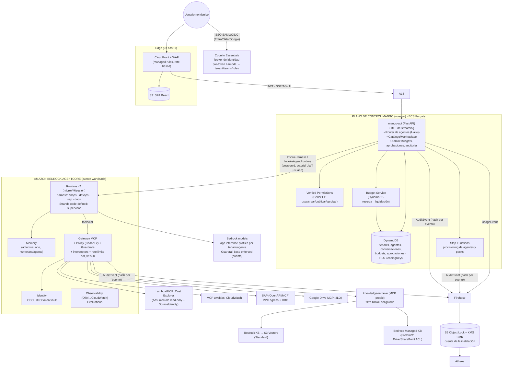
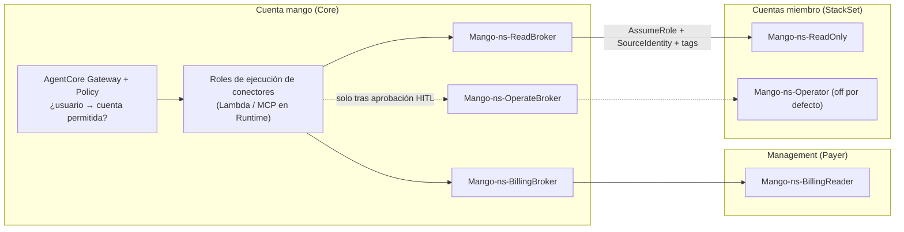

# Mango Hub: arquitectura AWS de referencia

> Fecha: 2026-09-28 · Revisión de coherencia: 2026-10-05 · Estado: **adoptada**. Nació como propuesta para discusión; sus decisiones están tomadas y registradas en §8 (las primeras son del mismo 2026-09-28).
> **Cómo leerla:** §1 a §7 describen la arquitectura objetivo, y no todo está construido. Donde este texto y una decisión de §8 difieran, manda la decisión. Qué existe hoy: la tabla «Estado de lo construido», antes de §1.
> Base: análisis de [`aws-samples/bedrock-chat`](https://github.com/aws-samples/bedrock-chat) @ `4419d62` y verificación del estado de los servicios AWS a sep-2026.
> Los reportes de detalle, con referencias `archivo:línea` y URLs, están en [`research/`](./research):
> - [infra](./research/infra.md): infraestructura y CDK de bedrock-chat
> - [codebase](./research/codebase.md): backend y frontend de bedrock-chat
> - [vectors](./research/vectors.md): RAG y vector stores
> - [runtime](./research/runtime.md): runtime de agentes: AgentCore vs EKS/ECS/Lambda
> - [governance](./research/governance.md): identidad, RBAC, budgets, HITL, auditoría
> - [isb-multiaccount](./research/isb-multiaccount.md): despliegue multi-cuenta de Innovation Sandbox on AWS
>
> Diagramas en draw.io: [`diagrams/mango-reference-architecture.drawio`](./diagrams/mango-reference-architecture.drawio). Tiene 4 páginas: Overview, Request flow, Multi-account access y Release & upgrade.
> Modelo de amenazas: [`../security/threat-models/mango-architecture-threat-model.md`](../security/threat-models/mango-architecture-threat-model.md).
>
> Hechos críticos verificados en fuentes primarias de AWS el 2026-09-28:
> - AgentCore harness GA (jul-2026); Policy y Evaluations GA (mar-2026); Agent Registry GA (ago-2026).
> - Bedrock Agents Classic en *maintenance mode* desde el 30-jul-2026.
> - CloudTrail Lake cerrado a clientes nuevos desde el 31-may-2026.
>
> Nota: `research/codebase.md` §8 marca como "preview" servicios que ya son GA; en eso manda `research/runtime.md`.

---

## Estado de lo construido (2026-10-05)

Cada fila se comprobó ese día contra el código de `main`: el archivo citado existe y hace lo que dice. «Hecho» significa que hay código y pruebas, no que esté probado en una instalación de producción. Lo que no está aquí no se comprobó.

| Capacidad | Estado | Dónde está | Decisiones |
|---|---|---|---|
| Chat con streaming y fase del turno en vivo | Hecho | `POST /api/chat` en `apps/api/src/mango_api/app.py` | D39, D57 |
| Agente FinOps de la release | Hecho | `agents/finops/agent.json` | D4, D34, D42 |
| Marketplace, Agent Builder, Revisión y Org Chart | Hecho | `apps/api/src/mango_api/agents.py`; `apps/web/src/pages/` | D18, D30, D38 |
| Publicar y retirar agentes por SDK, sin CodeBuild | Hecho | `functions/provisioner`; `infra/lib/constructs/provisioner.ts` y `deprovisioner.ts` | D25, D40, D48 |
| MCP packs firmados, con egress restringido | Hecho: tres packs de lectura | `packs/aws-pricing`, `packs/aws-billing`, `packs/aws-cloudwatch`; `infra/lib/constructs/pack-network.ts` | D19, D36, D43, D54 |
| RBAC L1 (Verified Permissions) | Hecho | `policies/cedar/platform/` (15 políticas) | §4.5 |
| RBAC L2 (Cedar en el Gateway) | Hecho por tool y por tipo de usuario; no por agente | `infra/lib/constructs/tools.ts` y `write-tools.ts`; `functions/provisioner/src/mango_provisioner/packs/gateway.py` | D33, D45 |
| Identidad del usuario hasta el destino | Hecho: pagadora y cuentas miembro | `packages/py/mango-aws`; `infra/lib/constructs/member-access.ts` | D10, D37, D49, D51, D55 |
| Presupuesto con reserva previa | **A medias:** solo por usuario y por agente | `apps/api/src/mango_api/budget.py` | §4.5 |
| Jerarquía de presupuestos instalación → área → equipo → usuario | No hecho | — | §4.5 |
| Límite de presupuesto por agente editable | No hecho | La API solo edita los valores por defecto y el límite por usuario (`apps/api/src/mango_api/admin.py`) | D17, D22 |
| Reconciliación del gasto contra CUR | No hecho | — | §4.5 |
| Aprobación de tools de escritura | Hecho, con una tool | `connectors/aws-budgets` (`create_budget`); `apps/api/src/mango_api/approvals.py`; `functions/approval-executor` | D27, D56 |
| Tool de escritura en un agente de la release | No hecho | `approval_tools: []` en `infra/lib/constructs/release-agents.ts` | — |
| Auditoría en S3 con Object Lock | **A medias:** hash por evento, sin cadena ni digest firmado; bucket en la cuenta de la instalación, `GOVERNANCE` por defecto | `apps/api/src/mango_api/audit.py`; `infra/lib/constructs/governance.ts` | §4.5 |
| Guardrail base compartido | Hecho | `infra/lib/constructs/agent-platform.ts` | D34 |
| Guardrail por agente y sobre salidas de tools | No hecho | `ApplyGuardrail` solo aparece como permiso de IAM | §4.5, D34 |
| RAG y bases de conocimiento | No hecho | — | §4.4 |
| Router «Asistente Mango» | No hecho | — | §4.3 |
| Memoria de AgentCore | No hecho: desactivada a propósito | `functions/provisioner/src/mango_provisioner/harness.py` | D13 |
| Skills, tareas programadas y evals | No hecho | Sin pantalla ni API; fuera de `AVAILABLE_VIEWS` (`apps/web/src/layouts/navigation.ts`) | D26, D38 |
| Delegación entre agentes | No hecho (fase 2) | — | D30 |
| SSO con el IdP del cliente | No hecho en la infraestructura | El cliente del User Pool solo admite `COGNITO` (`infra/lib/constructs/identity.ts`) | D20, D53 (6) |
| Editar MFA, duración de sesión e IdP desde la app | No hecho | — | D21 |
| Gestión de personas y grupos de acceso | Hecho | `apps/api/src/mango_api/people.py` y `group_admin.py` | D44, D60 a D62, D66 |
| Sesión web que sobrevive a la recarga | Hecho | `apps/api/src/mango_api/web_session.py` | D63, D64 |
| Distribución por plantillas, con seis parámetros | Hecho | `infra/lib/config/release.ts`; `docs/runbooks/install.md` | D8, D58 |
| Dominio propio y TLS de punta a punta | No hecho | Certificado por defecto de CloudFront (`infra/lib/constructs/edge.ts`) | D15 |
| Más de una tarea de `mango-api` | No hecho: una tarea, con IP pública | `infra/lib/constructs/api-service.ts` | D15 |
| Migraciones de datos y modo mantenimiento | No hecho | — | D9, §4.12 |
| Diagnóstico exportable y stack de soporte | No hecho | — | D7, §4.11 |
| Acceso de admins a conversaciones | No hecho | — | D23 |
| Clientes M2M y MCP remotos del cliente | No hecho | — | §4.5, D19 (3) |
| Plantilla de SCP y tests de aislamiento | No hecho | No existen `policies/scp` ni `tests/isolation` | D11 |

---

## 1. Resumen ejecutivo

1. **bedrock-chat se usa como cantera, no como fork.** Aporta buenos patrones de dominio y un buen frontend de chat. Su esqueleto choca con Mango en tres puntos:
   - Aprovisiona con `cdk deploy` en runtime vía CodeBuild, un stack por bot.
   - Usa OpenSearch Serverless y OSIS, que suman ~550 USD/mes fijos sin usuarios.
   - Ejecuta el agente dentro de una Lambda WebSocket, con el mismo rol IAM para todos los bots, sin MCP, sin HITL y sin budgets.
2. **El plano de ejecución de agentes es Amazon Bedrock AgentCore:**
   - Runtime v2 con microVM por sesión.
   - *Harness* declarativo: agente = configuración.
   - Gateway MCP como única superficie de tools.
   - Identity para OBO/3LO, más Memory, Policy (Cedar), Observability y Evaluations.
   - Cubre ~80 % de la necesidad. **EKS se descarta por ahora**: exige 1–2 FTE de plataforma para reconstruir lo que AgentCore ya trae, y el cómputo del runtime es solo el 3–8 % del gasto en tokens.
3. **El plano de control lo construimos nosotros, y es el producto.** Incluye marketplace, RBAC, **budgets en dólares con enforcement en tiempo real**, bandeja de aprobaciones, audit trail, historial de conversaciones y el router que elige el agente. AgentCore no trae nada de esto.
4. **RAG sin OpenSearch Serverless:**
   - Default: Bedrock KB sobre **S3 Vectors**, compartidas por perfil de indexación, con filtros de metadata por unidad de negocio, KB y ACL. Cuesta ~0 en reposo.
   - Tier premium: **Bedrock Managed Knowledge Base**, con conectores Drive/SharePoint/Confluence, ACL por usuario, hybrid search y rerank.
5. **Costo fijo por entorno sin tráfico: ~100–150 USD/mes**, frente a ~550–900 de bedrock-chat. Todo lo demás se paga por consumo. **La palanca de costo real son los tokens**; por eso los budgets son la pieza propia más importante.

---

## 2. Principios de arquitectura

| # | Principio | Consecuencia |
|---|---|---|
| P1 | **Serverless y pago por uso por defecto** | Nada con costo fijo relevante salvo el BFF. Sin VPC ni NAT salvo para conectores privados |
| P2 | **Un solo punto de paso para tools** | Toda tool, MCP propio o de terceros, va detrás de AgentCore Gateway. Ahí se aplican policy, identidad, guardrails, rate limits y auditoría, fuera del alcance del LLM |
| P3 | **El agente es configuración, no un despliegue** | Crear o publicar un agente es una llamada a API, que tarda segundos. **Nunca build ni `cdk deploy` en runtime** (lección de bedrock-chat); stacks de CloudFormation solo desde plantillas de la release (D25) |
| P4 | **Gobernanza preventiva, no reactiva** | Autorizar y reservar budget *antes* de gastar. El reporte a posteriori (Athena/CUR) sirve solo para reconciliar |
| P5 | **Identidad del usuario hasta el sistema destino** | OBO/3LO o AssumeRole con `SourceIdentity`. Prohibido que una tool use el rol del runtime para datos de usuario |
| P6 | **Estándares abiertos en los bordes** | MCP (tools), AgentSkills.io (skills), A2A, OTel GenAI, Cedar. Mitiga el lock-in con AgentCore |
| P7 | **Contexto organizacional en todo** | Como la instalación es por cliente (D1), el aislamiento principal es la cuenta. Dentro de ella, `business_unit`/`team`/`user` viajan en el token, en las claves DynamoDB (`LeadingKeys` por usuario), en la metadata vectorial, en las políticas Cedar y en los eventos de auditoría. Se reserva un `tenant_id` fijo por instalación por si en el futuro hay un modo SaaS |

---

## 3. Vista general

> Versión detallada con iconos AWS, flujo de una petición, acceso multi-cuenta y release: [`diagrams/mango-reference-architecture.drawio`](./diagrams/mango-reference-architecture.drawio). Se abre en draw.io o diagrams.net.



---

## 4. Decisiones por dominio

### 4.1 Runtime de agentes

| Decisión | Detalle |
|---|---|
| **AgentCore Runtime v2 + harness por defecto** | Cada agente del marketplace es un *harness* con modelo, prompt, tools (referencias al Gateway), skills y política de memoria. Se crea con `CreateHarness` desde Step Functions, sin contenedor |
| **Strands code-defined en Runtime para casos avanzados** | Supervisor multi-dominio y prompts por etapa. El harness solo soporta *agent-as-tool* y no *routing* multi-agente |
| **Claude Agent SDK en Runtime** solo para agentes "trabajador de archivos/código" | Necesitan filesystem y skills estilo Claude Code |
| **Fuente de verdad = `AgentDefinition` en DynamoDB** | El provisioner la "compila" a un harness. Como el harness exporta a Strands, podríamos correr la misma definición en un runtime Strands propio (Fargate/EKS) si hiciera falta salir de AgentCore |
| **Contrato interno `AgentInvoker`** en mango-api | Oculta harness, runtime code-defined u otro backend futuro. Principal mitigación del lock-in |
| **Descartados** | Bedrock Agents Classic (maintenance mode). EKS/kagent: se revisa si hay requisito multicloud/on-prem o si el runtime supera ~5k USD/mes. Lambda no ejecuta el loop del agente; solo tools y jobs |

Límites a tener presentes:
- 2 vCPU/8 GB por sesión, sesión de 8 h (14 días con Runtime Instances).
- Cuotas: 25 TPS de nuevas sesiones y 2 500–5 000 sesiones activas por cuenta.
- v2 solo está en us-east-1, us-east-2, us-west-2, eu-west-1 y ap-northeast-1.

### 4.2 Tools, MCP y skills

- **Un AgentCore Gateway por entorno.** Targets:
  - Lambda y OpenAPI: Cost Explorer y SAP OData.
  - MCP propios hospedados en Runtime: CloudWatch (awslabs) y `knowledge-retrieve`.
  - MCP de terceros con 3LO: Drive.
  - Runtime como *agent-as-tool*.
- **Conectores iniciales:**

  | Sistema | Patrón | Identidad |
  |---|---|---|
  | Cost Explorer | Lambda target (o MCP awslabs), con cache por costo de API | `AssumeRole` read-only por cuenta cliente + `ExternalId` + session tags + `SourceIdentity=user` |
  | CloudWatch | MCP awslabs en Runtime | Igual, cross-account read-only; acciones mutantes con HITL |
  | SAP | OpenAPI (BTP/OData) o MCP de SAP, **VPC egress** a la red del cliente | OAuth **OBO** vía Identity; escritura siempre con aprobación |
  | Google Drive | Lectura: Managed KB (ACL nativa). Acciones: MCP con **3LO** + Consent Portal | Token del usuario en el vault de Identity |

- **Skills** en formato AgentSkills.io (`SKILL.md`):
  - Se guardan en **S3 versionado** y se referencian por agente en el harness.
  - Sus scripts corren con el tool `shell` *dentro de la microVM de la sesión*.
  - Quitar `shell` y `file_operations` (`allowedTools`) a los agentes que no ejecutan scripts.
  - Solo skills y MCP aprobados: el flujo de aprobación de **Agent Registry** entra en la fase 2 como catálogo gobernado de tools/skills/MCP.
- **Cómo entran los MCP (D19):** conectores propios de Mango y **MCP packs** curados (servidores de awslabs empaquetados, escaneados y firmados en el CI de Mango, hospedados en AgentCore Runtime). Los MCP remotos del cliente llegan en v1.x. Nunca se instalan paquetes arbitrarios en la cuenta del cliente. Detalle en `docs/specs/marketplace-v1.md`.

### 4.3 Plano de control y streaming

- Un solo servicio **`mango-api` (Python/FastAPI) en ECS Fargate** detrás de ALB y CloudFront. Hace de BFF de streaming (**SSE / AG-UI**), router, API de catálogo y admin.
  - **Por qué Fargate y no Lambda + API GW WebSocket (como bedrock-chat):**
    - Elimina el límite de 32 KB por frame y el reensamblado por trozos en DynamoDB.
    - Elimina el tope de 15 min y el WebSocket anónimo en `$connect`.
    - Las conexiones de streaming largas y el router con estado son naturales en un contenedor.
  - Costo: 2 tareas de 0,5–1 vCPU más ALB, unos 60–90 USD/mes.
- **Router:**
  - La elección explícita del usuario en el marketplace tiene prioridad.
  - Si el usuario no elige ("Asistente Mango"), un clasificador **Haiku con structured output** elige entre las Agent Cards *ya filtradas por RBAC*, con umbral de confianza; si la confianza es baja, pregunta al usuario.
  - El router vive fuera de AgentCore para que la decisión sea barata, auditable y posterior al RBAC.
- **Step Functions** para operaciones largas:
  - Provisioning de agente, KB y guardrail por **llamadas SDK** (nunca CodeBuild + CDK).
  - Ingesta de KB, reutilizando el lock S3 y la ingesta incremental de bedrock-chat (previsto; no hay KB todavía).
  - Las aprobaciones HITL **no** pasan por Step Functions (D56 (2)); ver §4.5.

### 4.4 RAG / Knowledge

| Tier | Backend | Costo (chico / mediano / grande)* | Cuándo |
|---|---|---|---|
| **Standard (default)** | Bedrock KB customer-managed + **S3 Vectors**, pooled por "perfil de indexación" | ~0,3 / ~8 / ~125 USD/mes | Todo agente con documentos propios |
| **Premium** | **Bedrock Managed KB** | ~55 / ~1 250 / ~15 000 USD/mes (lo domina el costo por Retrieve) | Conectores con ACL nativa (Drive, SharePoint, Confluence), hybrid, rerank, agentic retrieval. *Pass-through* al cliente |
| Search+ (futuro) | OpenSearch con motor S3 Vectors o AOSS NextGen (scale-to-zero) | a evaluar | Búsqueda exacta de códigos (SAP) o <50 ms. Validar primero si Bedrock KB soporta NextGen |
| Add-on | Neptune Analytics (GraphRAG) | ~350 USD/mes, ~35 en pausa | Solo agentes que necesiten grafo |

*Escenarios de `research/vectors.md` §3: chico = 10 KB / 1 GB, mediano = 100 KB / 50 GB, grande = 1 000 KB / 1 TB.

- **Aislamiento.** Cada chunk lleva metadata `business_unit`, `kb_id`, `acl_groups` y `classification`, inyectada en la ingesta con una custom transformation Lambda (patrón de bedrock-chat).
  - El filtro lo construye **siempre el MCP `knowledge-retrieve`** a partir del JWT verificado, nunca el LLM.
  - Hay tests de aislamiento entre áreas y KBs en CI.
- **Cuotas que condicionan el diseño:**
  - **100 KBs customer-managed por cuenta (no ajustable)**: obliga al modelo pooled.
  - **Retrieve a 20 req/s**: validar en Service Quotas; si hace falta, cache semántico o subir a Managed KB (600 RPM por KB, ajustable).
- Calidad sin hybrid: chunking jerárquico/semántico, rerank opcional por agente (Cohere Rerank 3.5, 2 USD/1k, cargado al budget del agente) y query rewriting.

### 4.5 Gobernanza

**Identidad:**
- **Cognito Essentials** es el broker único, federado con **el IdP del cliente** (SAML/OIDC; una sola federación por instalación).
- Access tokens cortos (15–60 min) enriquecidos por una *pre-token-generation* Lambda con `business_unit`, `teams` y `roles` de Mango. Nunca los grupos crudos del IdP.
- Clientes M2M con *client credentials*, **no API keys**.
- IAM Identity Center solo para los operadores de Mango.

**Autorización en 3 niveles, todo en Cedar:**

| Nivel | Pregunta | PDP / PEP |
|---|---|---|
| L1 plataforma | ¿Puede usar, crear, publicar o aprobar el agente X o el modelo Y? | Verified Permissions (5 USD/M) en mango-api. Visibilidad del catálogo precomputada en DynamoDB |
| L2 tools | ¿Puede *este usuario vía este agente* llamar `sap.create_po(amount=50k)`? | **AgentCore Policy** en el Gateway. Default-deny; `tools/list` solo devuelve lo permitido |
| L3 destino | ¿El sistema acepta la acción del usuario? | Permisos nativos (SAP, Google, IAM ABAC) vía identidad propagada |

**Budgets (servicio propio; AWS no ofrece enforcement en tiempo real):**
- Jerarquía `instalación → business_unit → team → user`, ortogonal a `agent` y `api_client`.
- **Reserva** con `TransactWriteItems` condicional antes de cada invocación, **clamp** de `max_tokens` al saldo y **liquidación** con el `usage` real. Barrido de reservas huérfanas.
- Topes técnicos adicionales:
  - Límites de iteraciones y tokens del harness.
  - TPM por `jwt.sub` en el Gateway.
  - Allowlist de modelos por agente.
- Precios como datos (`MODEL_PRICE` versionada; se reemplaza la tabla hard-coded de bedrock-chat).
- Atribución con *application inference profiles* etiquetados y reconciliación diaria contra CUR 2.0 (atribución por IAM principal).

**HITL en dos niveles:**
- **Autoconfirmación del usuario** (segundos): `inline_function` del harness o interrupts de Strands; la UI muestra una tarjeta.
- **Aprobación de terceros** (horas/días): la solicitud vive en `mango-api`; el aprobador se autoriza por AVP `ApproveToolCall` con separación de funciones. **Aprobar no ejecuta nada:** quien pidió la acción la ejecuta con su propia sesión antes del vencimiento, y todo pasa por el Gateway y Cedar. No existe una identidad de servicio que escriba (D56 (2), que sustituye al `waitForTaskToken` de Step Functions de la versión original de este texto).
- **No evadible:** un interceptor del Gateway exige un *approval token* firmado con KMS, de un solo uso y ligado a `hash(tool, args)`.

**Audit:**
- **Hoy:** Firehose → S3 con Object Lock + KMS CMK, en un bucket de **la cuenta de la instalación**. El modo es un parámetro (`AuditLockMode`: `GOVERNANCE` por defecto, `COMPLIANCE` a elección del cliente). Un índice en DynamoDB sirve la pantalla de Auditoría.
- **Hoy:** cada evento lleva el SHA-256 de su propio contenido (`apps/api/src/mango_api/audit.py`). Detecta que un registro cambió; **no** hay cadena entre eventos ni digest firmado, así que no detecta que falte uno.
- **Previsto, sin construir:** eventos encadenados (cada uno con el hash del anterior) y digest diario firmado; escritura o réplica en la cuenta Log Archive del cliente; `COMPLIANCE` por defecto.
- CloudTrail organization trail. **No CloudTrail Lake.**
- Retención: decisiones 7 años; contenido de prompts 30–90 días, separado.

**Guardrails:**
- Guardrail base **enforced a nivel cuenta/organización** (PROMPT_ATTACK, PII, content).
- Guardrail por agente vía API.
- `ApplyGuardrail` sobre las salidas de tools y RAG (indirect prompt injection).
- Los guardrails son el costo de gobernanza dominante: ~1 000 USD por 1M de turnos.

**Observabilidad:**
- OTel GenAI semconv y AgentCore Observability → CloudWatch GenAI observability.
- `trace_id` en todo evento de uso, auditoría y aprobación.
- Contenido de prompts fuera de los spans por defecto.

### 4.6 Datos (DynamoDB)

- On-demand, **RLS con STS session policy + `dynamodb:LeadingKeys`** (patrón de bedrock-chat) con prefijo `USER#u` (y `BU#` para datos de área).
- Conversación: **un item por mensaje** (`SK=MSG#<ulid>`) en lugar del `MessageMap` monolítico de bedrock-chat. Se conserva el árbol (`parent`/`children`) para editar y regenerar.
- Offload a S3 de items de más de 300 KB. Índices sparse para listados.
- Producción: `RETAIN`, `deletionProtection` y PITR.
- Modelo de gobernanza mínimo (tenants, principals, teams, agents, versions, tools, budgets, counters, approvals, prices, api_clients): ver el diagrama ER en `research/governance.md` §11.2.

### 4.7 Modelo de despliegue: una instalación por cliente, en su cuenta (decidido 2026-09-28)

Mango se instala completo (plano de control + AgentCore + datos) **en la cuenta AWS del cliente**. No hay, por ahora, un plano de control central operado por Mango.

```
Organización AWS del cliente
├── (sus cuentas: management, security, log-archive…)
├── mango-prod   ← instalación de Mango (recomendado: cuenta dedicada)
└── mango-nonprod (opcional) ← pruebas de upgrades antes de prod
Cuentas "fuente" del cliente (Cost Explorer, CloudWatch) ← roles read-only asumidos por Mango
```

Qué cambia respecto al diseño multi-tenant:
- **Un tenant por instalación.** Desaparece el modelo pool/silo. `tenant_id` deja de ser la clave de aislamiento principal. Lo reemplazan las **unidades organizacionales del cliente** (`business_unit → team → user`) en RBAC, budgets y metadata RAG. La RLS por usuario en DynamoDB se mantiene.
- **Identidad:** Cognito federa con **un solo IdP**, el del cliente (Entra, Okta o Google). IAM Identity Center sigue siendo opcional como upstream.
- **Costos:** el cliente paga directo su factura AWS (tokens incluidos). Los budgets siguen siendo núcleo: sirven para *chargeback* interno por área y para evitar sorpresas. El fijo de ~100–150 USD/mes lo absorbe cada instalación.
- **Cuotas por cuenta del cliente:** ya no hay *noisy neighbor* entre clientes, pero cada instalación debe pedir sus aumentos (AgentCore, Bedrock TPM, Retrieve).
- **Audit:** va al bucket Object Lock de la instalación. Si el cliente tiene cuenta log-archive, se replica o se escribe ahí.
- **Nuevas responsabilidades de Mango como "software instalable":**
  - Releases versionadas e inmutables.
  - Upgrades seguros con migraciones de datos.
  - Rol de soporte *break-glass* opcional, con consentimiento del cliente y auditado.
  - Telemetría o licenciamiento *opt-in* (fase posterior).
- **Región:** sin requisito de residencia en LatAm, así que el default es **us-east-1**. Alternativas soportadas: us-west-2 y eu-west-1 (tienen Runtime v2 y Managed KB).

### 4.8 IaC, CI/CD y calidad

- **AWS CDK v2 en TypeScript**, en un monorepo con apps por dominio:
  - `edge` (us-east-1)
  - `core` (auth, datos, mango-api)
  - `agents` (AgentCore)
  - `audit` (log-archive)
- **Constructs de AgentCore:** estables desde CDK v2.255, salvo Policy (alpha). Fijar versiones.
- **Buenas prácticas copiadas de bedrock-chat:** parámetros con zod, `envPrefix`, Aspects (retención de logs y **tags de costo obligatorios**), build del frontend en deploy-time y tests Jest de CDK.
- **Añadido:** `AwsSolutionsChecks` (cdk-nag) aplicado de verdad.
- **Despliegue:** GitHub Actions con OIDC → cuentas dev/stg/prod, `cdk diff` en el PR y aprobación manual para prod. Bootstrap con políticas de ejecución acotadas. **Prohibido `cdk deploy` en runtime y runners con AdministratorAccess.**
- **CDK vs Terraform:** ver §4.9. Recomendación: CDK para escribir y CloudFormation para distribuir; Terraform solo como envoltorio para clientes que lo exijan.
- **Backend:** Python 3.13, `uv`, ruff, mypy estricto por módulo, pytest con moto en CI. La deuda de bedrock-chat es que no corre tests en CI.
- **Frontend:** Vitest + Playwright para el flujo de chat.

### 4.9 CDK/CloudFormation vs Terraform (decidido: D3)

**Decisión (D3, 2026-09-28): escribir la infraestructura con AWS CDK (TypeScript) y distribuirla como CloudFormation.** Es decir, la estrategia de bedrock-chat, corrigiendo sus errores. Cómo se distribuye lo fijan D8 y D58. El módulo de Terraform envoltorio no está construido.

Cobertura verificada el 2026-09-28:
- Terraform (`hashicorp/aws`) tiene 21 recursos `aws_bedrockagentcore_*`, incluidos `harness`, `gateway_target`, `policy_engine` y `registry`.
- CDK tiene L2 para Runtime, Gateway, Gateway Target, Memory, Policy Engine y Online Evaluation, además de L1 para el resto.

Ninguna de las dos herramientas es bloqueante. Además, los harness de cada agente **no se crean con IaC**: los crea el provisioner de Mango por API en runtime (P3). La cobertura de AgentCore pesa poco; lo que decide es **el modelo de instalación en la cuenta del cliente**.

| Criterio (instalación en la cuenta del cliente) | CDK → CloudFormation | Terraform |
|---|---|---|
| **Estado** | Lo guarda CloudFormation en la cuenta del cliente; nada que operar | Requiere backend de estado (S3 + lock) por cliente. Alguien tiene que custodiarlo, sea el cliente o Mango |
| **Qué necesita el cliente para instalar** | Solo la consola o CloudShell: "Launch stack" o el instalador de un clic | Toolchain de TF, backend y credenciales, o un runner que se lo provea |
| **Upgrades y rollback** | `UpdateStack` con rollback automático y *drift detection* nativos | `plan/apply`; rollback manual |
| **Distribución enterprise** | Service Catalog, StackSets y AWS Marketplace (productos CloudFormation) | Módulos en registry privado; menos canales nativos de AWS |
| **Revisión de seguridad del cliente** | Plantilla estática auditable (`cdk synth`), revisable con cfn-guard o cdk-nag | Código HCL auditable; también bien valorado |
| **Reuso de bedrock-chat** | Directo (constructs Frontend, Auth, Database, Step Functions) | Reescritura |
| **Contras** | Rollbacks lentos, límite de 500 recursos por stack, *bootstrap* de CDK si hay assets | Estado por cliente, drift y upgrades coordinados en N cuentas |

**Cómo se distribuye.** Patrón de Innovation Sandbox on AWS; detalle en [`research/isb-multiaccount.md`](./research/isb-multiaccount.md).

**Plantillas pre-sintetizadas desde el MVP.** No hay CodeBuild ni `cdk deploy` en la cuenta del cliente.
- **Synthesizer propio** (subclase de `DefaultStackSynthesizer`):
  - Assets en buckets **regionales** del proveedor: `s3://<mango-releases>-<region>/mango/<version>/`.
  - Plantillas principales en un bucket global.
  - Todo **inmutable por versión**.
  - `generateBootstrapVersionRule: false`, así que **no hace falta bootstrap de CDK** en el cliente.
  - Zip de assets en synth, retirada de `AWS::LanguageExtensions` y alarma al acercarse al límite de 1 MB por plantilla.
  - **Sin modo dual (D58 (6)):** no hay `cdk deploy` de desarrollo; el laboratorio se instala como un cliente. La versión original de este texto preveía un modo dual.
- **Instalación y upgrade:** el cliente instala y actualiza con **"Launch stack" / `CreateStack` / `UpdateStack`** sobre la URL de una versión concreta.
- **Imágenes de contenedor** (`mango-api`, runtimes de agentes code-defined):
  - No se usa `DockerImageAsset`, porque exige bootstrap y ECR en el cliente.
  - Se publican en el **ECR privado de la cuenta del proveedor**, con lectura por organización del cliente (`aws:PrincipalOrgID`), y se referencian **por digest** (D58 (3)).
  - Opción `privateEcrRepo` para clientes que no permiten registries externos.
  - AgentCore Runtime acepta ECR privado de cualquier cuenta, ECR Public y un zip en S3 sin contenedor (verificado en la documentación el 2026-10-01; falta la prueba en el laboratorio). Los MCP packs usan el zip (D36).
- **Trazabilidad de versión:**
  - Contexto de build congelado en un `CfnMapping` dentro de la plantilla.
  - Versión en la descripción de cada stack (`(Mango) mango-hub vX.Y.Z`).
  - User-agent `Mango/<ver>` en los SDK.
  - `release.yaml` como fuente única de versión, con un test de consistencia.
- **Parámetro `Namespace`** (3–8 alfanuméricos) en **todo** nombre global: roles, StackSet, alias KMS, SSM, log groups, grupos IDC. Permite `mango-prod` y `mango-nonprod` en la misma organización. Tests de regresión dedicados.
- **Upgrades:**
  - Orden documentado por release.
  - Modo mantenimiento en la app.
  - Migraciones como custom resource idempotente que revierte el stack si falla.
  - `RETAIN` en datos.
  - Cada stack publica `version`/`schema`; `Core` **valida** la compatibilidad en runtime. ISB lo guarda pero no lo valida.
- **Clientes con Terraform obligatorio:** módulo delgado que envuelve las plantillas con `aws_cloudformation_stack`.
- **Canales posteriores:** Service Catalog y AWS Marketplace, sobre las mismas plantillas.
- **Testing de IaC:**
  - Snapshots normalizados.
  - Aserciones dirigidas sobre IAM y trusts.
  - Tests de namespacing y de consistencia de release.
  - **cdk-nag** en synth y **cfn-guard** sobre las plantillas finales en CI.
  - Un test que falla si algún trust spoke no exige `PrincipalOrgID` y `SourceIdentity`.

**Cuándo elegir Terraform en su lugar:**
- Si el equipo de Mango es nativo en Terraform y no en TypeScript.
- Si el mercado objetivo (p. ej. banca) exige módulos TF nativos de forma generalizada.

---

### 4.10 Conectividad multi-cuenta (AWS Organizations / Control Tower del cliente)

Mango se instala en **una cuenta dedicada** (`mango`) dentro de la organización del cliente y opera sobre **todas las cuentas** mediante roles. La estructura de stacks sigue el patrón de Innovation Sandbox on AWS (ver [`research/isb-multiaccount.md`](./research/isb-multiaccount.md)), corrigiendo lo que no aplica a cuentas productivas.

**Stacks e instalación (una sola región por instalación):**

| Stack | Cuenta | Contenido | Obligatorio |
|---|---|---|---|
| `Mango-<ns>-Core` (+ `Edge` en us-east-1 si hay dominio propio) | `mango` | Plataforma completa, roles de ejecución de conectores y **brokers** | Sí |
| `Mango-<ns>-OrgAccess` | Management **o delegated admin de StackSets** (`callAs: DELEGATED_ADMIN`) | `AWS::CloudFormation::StackSet` **SERVICE_MANAGED** con auto-deployment sobre la raíz u OUs elegidas por parámetro. El template del spoke va **como asset versionado** | Sí (multi-cuenta) |
| `Mango-<ns>-Payer` | Management | Solo `Mango-<ns>-BillingReader`: Cost Explorer, `organizations:List*/Describe*` y lectura de Data Exports. Los StackSets no llegan a la management | Opcional (alternativa: solo CUR 2.0) |
| `Mango-<ns>-PackNetwork` | `mango` | Red de los Runtimes de packs; `Core` la importa (D54, D58 (8)) | Sí, antes que `Core` |
| `Mango-<ns>-Support` (**previsto, sin construir:** D7 está pendiente) | Cuenta de Identity Center (management o delegated admin) | Permission sets de soporte acotados a la cuenta `mango`, **sin assignment** (§4.11) | Opcional |
| `Mango-<ns>-Member` (template spoke) | Cada cuenta miembro, vía StackSet (o CfCT/AFT con la misma plantilla) | `Mango-<ns>-ReadOnly` + `Mango-<ns>-Operator` (desactivado por parámetro) | Vía StackSet |

- **Orden independiente por diseño:**
  - Todos los nombres y ARNs son deterministas (`Mango-<ns>-…`) y se calculan a partir de los *account IDs* que recibe cada stack como parámetros.
  - **Ningún stack lee a otro en deploy-time.** Se descarta el acoplamiento SSM+RAM de ISB.
  - Orden de instalación vigente (`docs/runbooks/install.md`): `Payer` → `OrgAccess` → `PackNetwork` → `Core`. `Support` no existe todavía.
  - El **connectivity check** de la consola admin prueba `AssumeRole` contra la payer y una muestra de spokes, lee el estado de las instancias del StackSet y muestra qué falta.
- **No modificamos la estructura de la organización:** no creamos OUs ni SCPs, a diferencia de ISB.
- **Prerrequisitos (checklist de la guía de instalación):**
  - Trusted access de StackSets activado.
  - Delegated admin de StackSets (opcional).
  - Cost Explorer habilitado (~24 h).
  - Región de la instalación definida y OUs objetivo.
  - Cuotas de STS y Lambda.



**Patrón de roles:**
- **Brokers por nivel de privilegio** en la cuenta `mango` (`Read`, `Billing`, `Operate`). Los roles de conector asumen el broker y el broker asume el rol spoke.
  - Añadir o quitar conectores **no obliga a redesplegar el StackSet** en cientos de cuentas.
  - El trust de `ReadOnly` no permite llegar a `Operator`.
  - Costo: el *role chaining* limita la sesión a 1 h.
- **Trust del spoke:**
  - `Principal: arn:aws:iam::<MANGO>:root`, más la condición `aws:PrincipalArn` = broker correspondiente (no el ARN como `Principal`). Así el spoke puede existir antes que el broker y sobrevive a recreaciones.
  - Además `aws:PrincipalOrgID` y `sts:SetSourceIdentity`/`sts:TagSession`, con **`SourceIdentity` obligatorio**.
  - El trust de cada broker lista ARNs explícitos de conectores. No se usa ABAC con `:root`.
- **Trazabilidad:** `SourceIdentity` = usuario de Mango, session tags (`mango_user`, `agent_id`, `business_unit`) y nombre de sesión con el usuario. El **CloudTrail de cada cuenta destino muestra qué persona**, vía qué agente, hizo cada llamada.
  - ⚠️ **Verificar en PoC** que `SourceIdentity` y los tags transitivos se propagan como se espera en el chaining broker → spoke.
- **Permisos:**
  - `ReadOnly`: acciones explícitas por conector (CloudWatch, Cost Explorer, Config, Tagging…), **no** `ReadOnlyAccess`. Se evita leer datos sensibles (S3, Secrets, DynamoDB).
  - `Operator`: desactivado por defecto; solo tras HITL, acotado por caso de uso, con *permission boundary*.
  - `BillingReader`: `ce:GetCostAndUsage` sobre `*` (no se puede acotar); documentado.
  - `ExternalId` solo para accesos de terceros, no dentro de la organización.
- **StackSet:**
  - **Una sola región**, porque los roles IAM son globales y repetir la instancia en varias regiones colisiona por nombre. La multi-región aplica a los *conectores* en runtime (CloudWatch es regional).
  - Tolerancia a fallos razonable, **no 100 %**, y estado de las instancias monitoreado y visible en el connectivity check.

**Modelo de roles por agente (D10):**

| Capa | Granularidad | Control |
|---|---|---|
| Rol de ejecución del agente (AgentCore, cuenta `mango`) | **Uno por agente**, creado por API al publicar | Solo su inference profile, su Memory y la invocación al Gateway |
| Rol del conector (Lambda/MCP detrás del Gateway) | **Uno por conector** | Qué agente o usuario usa qué tool lo decide la Policy Cedar L2 del Gateway, no IAM |
| Roles spoke (`ReadOnly`, `Operator-*`, `BillingReader`) | **Compartidos por nivel**, sin roles por agente | Un rol por agente obligaría a redesplegar el StackSet en todas las cuentas y violaría "nada de IaC en runtime" |

- **Mínimo privilegio por llamada:** el broker genera en cada `AssumeRole` una **session policy** con la acción, el recurso y la cuenta concretos de la tool, más session tags (`mango_user`, `agent_id`, `approval_id`). Los permisos efectivos son la intersección entre el rol y la session policy.
- **Escritura:**
  - `Operator` se **divide por dominio** (p. ej. `Operator-Tagging`, `Operator-Compute`), cada uno deshabilitado por defecto y habilitable por parámetro del StackSet.
  - Solo el **approval executor** (Lambda dedicado) puede asumir `OperateBroker`, y antes valida el approval token (KMS, un solo uso, ligado a `hash(tool, args)`).
  - Un conector comprometido no puede escribir sin aprobación.
- **Payer:** el conector de Cost Explorer y CUR **impone el filtro `LINKED_ACCOUNT`** con las cuentas permitidas del usuario, sin depender del LLM.
- Detalle y justificación: `docs/security/threat-models/mango-architecture-threat-model.md` (TM-003, TM-004).

**Datos de costo a escala:** además de la API de Cost Explorer (≈0,01 USD/request, con cache obligatorio), se recomienda un **Data Export CUR 2.0** hacia un bucket legible por la cuenta `mango` (Athena). Es más barato, más granular y no depende de la payer en cada pregunta.

**Gobernanza de "quién ve qué cuenta":**
- El inventario (cuenta → OU → área) se sincroniza desde Organizations en runtime.
- **AgentCore Policy (Cedar)** valida que el `account_id` de cada tool call esté dentro de las OUs o áreas permitidas para el usuario.
- El LLM propone la cuenta; el Gateway decide.

**Riesgos:**
- El stack `Payer` en la management es lo más sensible para el equipo de seguridad del cliente. Debe ser mínimo y opcional, con la alternativa de operar solo con CUR 2.0.
- Las cuotas de STS y Cost Explorer al consultar cientos de cuentas requieren cache de credenciales y resultados, y paralelismo acotado.
- Instancias del StackSet fallidas en silencio: se mitiga con el monitoreo descrito arriba.

### 4.11 Soporte y diagnóstico

> **Estado (2026-10-05): previsto, sin construir.** D7 está `pendiente`: no existen el botón de diagnóstico ni el stack `Mango-<ns>-Support`. Lo que sigue es el diseño.

**Botón "Exportar diagnóstico"** en la consola admin de Mango, solo para el rol `mango-admin`:
- **Contenido del paquete:**
  - Versión instalada y estado de los stacks CloudFormation (incluida la detección de *drift*).
  - Configuración efectiva sin secretos.
  - Health checks de cada dependencia: AgentCore, Gateway targets, KB, roles cross-account por cuenta.
  - Uso de cuotas.
  - Errores recientes y trazas OTel **sin contenido de prompts ni respuestas**.
- **Redacción obligatoria:** PII, ARNs con account IDs opcionalmente enmascarados, tokens.
- **Entrega:** ZIP con manifiesto y hash, descargable por URL prefirmada de corta vida. El cliente decide si nos lo envía.
- Se genera un `AuditEvent` (`support.diagnostic_exported`).

**Acceso del equipo de Mango vía IAM Identity Center del cliente:**
- Stack opcional `Mango-<ns>-Support` en la cuenta de IAM Identity Center (management o delegated admin), siguiendo el patrón del stack IDC de ISB.
  - Crea los permission sets `Mango-<ns>-SupportReadOnly` y `Mango-<ns>-SupportOperator` **sin assignments**.
  - El cliente asigna y retira el acceso, solo sobre la cuenta `mango`, a los usuarios de Mango que dé de alta en su IdP.
- **Permisos de solo lectura operativa:** CloudFormation (describe), CloudWatch Logs y métricas, AgentCore Observability, estado de Step Functions y metadata de configuración.
- **Deny explícito** sobre el contenido de conversaciones (tablas y buckets de datos de usuario), auditoría y secretos.
- **Un permission set opcional `MangoSupportOperator`** para acciones de remediación (reintentar provisionamiento, reiniciar el servicio), activado solo durante un caso.
- La activación y la duración las controla el cliente, idealmente con acceso temporal elevado (TEAM o similar). Todo queda en su CloudTrail con la identidad nominal del ingeniero.
- Mango no mantiene credenciales ni roles de confianza hacia cuentas propias del proveedor.

---

### 4.12 Versionado, canales de actualización y upgrades

**Modelo comercial y técnico:**
- **Cada instalación queda fijada a una versión** (`vX.Y.Z`): sus stacks apuntan a las plantillas de esa release y no cambian hasta que el cliente la actualiza (D58 (2)). Es el mismo principio que bedrock-chat (`bin.sh --version`), pero sin CodeBuild.
- **Dos canales:**

  | Canal | Contenido | Comercial |
  |---|---|---|
  | **Parches** `vX.Y.Z` | Seguridad (CVEs), compatibilidad con cambios de AWS (APIs de AgentCore/Bedrock, runtimes de Lambda), modelos nuevos o retirados, bugs | Incluido en el contrato de soporte/mantenimiento |
  | **Versiones** `vX.Y` / `vX` | Features nuevas (agentes, conectores, capacidades de gobernanza) | Se cobra |

- **Por qué hace falta el canal de parches:** una instalación congelada se degrada sola en 6–12 meses. Bedrock retira modelos, AgentCore y Strands cambian sus APIs, Lambda depreca runtimes y aparecen CVEs.
- **Política de versiones soportadas:** solo se dan parches a las **dos últimas versiones menores**. Una instalación más antigua tiene que actualizar para recibir soporte. Así se limita la dispersión de versiones entre clientes.
- **Futuro a evaluar:** licencias por feature (archivo firmado, verificado localmente, sin "llamar a casa"), con todos los clientes en una versión reciente, en lugar de cobrar por versión.

**Mecánica de actualización (igual para ambos canales, sin CodeBuild):**
1. **Build una sola vez por release, en el CI de Mango** (GitHub Actions, en cuentas de Mango): plantillas, Lambdas empaquetadas e imágenes. Se publica todo inmutable en `s3://<mango-releases>-<region>/mango/vX.Y.Z/` y en ECR, con imágenes referenciadas por digest.
2. **En la cuenta del cliente solo se ejecuta `UpdateStack`** con la URL de la plantilla de la versión destino.
   - Lo hace **el cliente**, desde la consola o la CLI (D58 (2); `docs/runbooks/install.md`, paso 4). D9 decía «el equipo de Mango vía IdC»: ese acceso depende de §4.11, que no está construido.
   - Con la opción "Rollback all stack resources".
   - Futuro: un botón en la consola admin que dispare un Step Functions en la cuenta `mango`.
3. **CloudFormation descarga los artefactos ya construidos.** En la cuenta del cliente no se compila nada.
4. **Migraciones de datos (previsto, sin construir):** recurso personalizado de CloudFormation (una Lambda) idempotente, que nunca pisa configuración guardada por un admin y revierte el stack si falla (patrón ISB).
5. **Modo mantenimiento** en la app durante el upgrade y **validación de compatibilidad de versión/esquema** entre stacks antes de reabrir (previsto, sin construir).
6. **Orden:** Core concentra casi todos los cambios. `OrgAccess`, `Payer` y `PackNetwork` cambian rara vez y se actualizan solo si la release lo indica en sus notas.

**Reglas de diseño que reducen la necesidad de releases:**
- **Catálogo de modelos y precios como configuración, no código:** agregar o retirar un modelo no exige una versión nueva.
- **Personalizaciones del cliente solo por parámetros de stack o configuración de la app.** Nunca edición manual de recursos gestionados, ni builds distintos por cliente.
- **Actualizar siempre a una versión concreta**, no a `latest`.

**Casos borde, todos sin CodeBuild:**
- Artefactos de AgentCore Runtime: no exige un ECR de la misma cuenta (verificado el 2026-10-01). Los MCP packs van como zip copiado por CloudFormation a un bucket de la instalación (D36); la imagen por digest queda como alternativa.
- El cliente no permite descargar desde buckets externos: se replica la release a un bucket del cliente con `aws s3 sync` y se instala desde ahí.

**Uso de CodeBuild en Mango:** ninguno en la cuenta del cliente, ni para instalar, ni para actualizar, ni para crear agentes. Solo se reconsideraría si algún día hubiera que compilar código dentro de la cuenta del cliente, y el diseño evita ese caso.

---

### 4.13 Requisitos de seguridad del modelo de amenazas (D11)

Salen de [`docs/security/threat-models/mango-architecture-threat-model.md`](../security/threat-models/mango-architecture-threat-model.md) v0.1 y son **requisitos de diseño obligatorios** para la implementación:

| # | Requisito | Amenazas |
|---|---|---|
| R2 | **Taint de sesión y tools `egress`:** si una sesión leyó contenido no confiable (RAG, tools, web), toda tool con salida externa (correo, web, compartir) exige HITL. El interceptor del Gateway lo aplica | TM-001 |
| R3 | **UI de aprobación con argumentos canónicos y diff** renderizados por el backend, nunca el resumen del LLM. SoD obligatoria (el aprobador es distinto del solicitante) | TM-002 |
| R4 | **Namespaces de AgentCore Memory por usuario** (`/{agent}/{user}`). La memoria compartida por área solo con opt-in explícito. Tests de aislamiento usuario↔usuario y área↔área en CI | TM-007 |
| R5 | **Firma de releases** (manifiesto firmado con KMS o Sigstore), verificada antes de cada `UpdateStack`. Bucket de releases con Object Lock | TM-008 |
| R6 | **Egress restringido** de la microVM de AgentCore y de los conectores a destinos en allowlist. Bloqueo de rangos privados salvo los hosts declarados (p. ej. SAP). **Construido para los Runtimes de packs (D54, 2026-10-02)**; pendiente para conectores y hosts externos | TM-009, TM-014 |
| R7 | **Guardrails de recurso por agente de escritura:** allowlists de tipos, AMIs y regiones, tags obligatorios (`mango:agent`, `mango:user`, `mango:approval`) y límites de cantidad. Se aplican en Cedar L2 **y** en la session policy. Estimación de costo en la aprobación, con escalado por umbral | TM-016 |
| R8 | **Plantilla de SCPs recomendadas** al cliente: protege los roles `Mango-<ns>-*` y restringe lo que `Operator-*` puede crear. Se entrega con la instalación y es opcional | TM-004, TM-016 |

Contexto que los motiva:
- Habrá agentes con salida a internet.
- Las escrituras dependen de la naturaleza de cada agente (p. ej. un agente EC2 crea instancias).
- Los agentes manejan datos sensibles.
- La interfaz se expone a internet.

---

### 4.14 Estructura del monorepo (D12)

Monorepo políglota **organizado por dominio**:
- **uv workspace** para todo lo Python.
- **pnpm workspace** para todo lo TypeScript.
- **mise** para fijar versiones de herramientas y definir las tareas comunes.
- Sin Nx ni Turborepo al inicio.

```
mango/
├── AGENTS.md · README.md
├── release.yaml              # fuente única de versión
├── mise.toml                 # versiones (python, node, uv, pnpm, cfn-guard) + tareas lint/test/synth/dist
├── pyproject.toml            # raíz del uv workspace
├── pnpm-workspace.yaml       # raíz del pnpm workspace
├── apps/
│   ├── api/                  # mango-api (FastAPI): BFF SSE, router, catálogo, admin
│   └── web/                  # React + Vite; hojas CSS propias y utilidades de Tailwind; e2e/ con Playwright
├── packages/
│   ├── py/
│   │   ├── mango-core/       # dominio compartido: contratos de agentes y aprobaciones, grupos, firma de invocación, identidad de packs, dominios de correo público
│   │   ├── mango-aws/        # broker, session policies, SourceIdentity (D10)
│   │   ├── mango-packs/      # formato de MCP packs: manifiesto, hash de tools, verificación de firma (D19)
│   │   └── mango-pack-runtime/ # punto de entrada común de los packs de datos de cuentas; va dentro de su zip (D37)
│   └── ts/
│       └── api-client/       # generado desde el OpenAPI de apps/api (no se edita a mano)
├── functions/                # Lambdas Python, un paquete por función
│   ├── provisioner/  approval-executor/  gateway-interceptor/  admin-probe/
│   └── pre-token/  pre-sign-up/  reconciler/
├── connectors/               # tools detrás del Gateway: cost-explorer/, aws-budgets/
├── agents/                   # definiciones incluidas en la release (finops/agent.json)
├── policies/
│   ├── cedar/platform/       # L1 Verified Permissions (schema + policies + tests)
│   └── guard/                # ruleset de cfn-guard (Well-Architected Security Pillar)
├── infra/                    # CDK: bin/, lib/{stacks,constructs,synthesizer}/, test/
├── packs/                    # MCP packs de la release: manifiesto, lock con hashes, punto de entrada (D19)
├── deployment/               # build-dist: synth, empaquetado, firma (R5), publicación
│   └── pack-builder/         # pipeline de packs: lock, zip reproducible, snapshot de tools, firma KMS
├── tests/
│   ├── e2e/                  # pruebas de punta a punta contra una instalación (scripts de Python)
│   └── eval/                 # evaluación del agente FinOps con verdad de referencia
├── docs/
└── .github/workflows/
```

Árbol al 2026-10-05. **Previsto en D12 y sin construir:** `packages/py/mango-governance` (AVP, presupuestos y auditoría viven hoy en `apps/api`; los approval tokens, en `mango-core`), `functions/migrations`, los conectores `cloudwatch` (se hizo como pack, D55) y `knowledge-retrieve`, `agents/skills`, `policies/scp` (R8) y `tests/isolation` (R4). Las políticas Cedar L2 del Gateway se generan en `infra/lib/constructs/` y en el provisioner de packs, no en `policies/cedar/gateway`.

Reglas:
1. **Separación por responsabilidad, no por lenguaje.**
2. **Una Lambda por paquete**, con dependencias mínimas. Lo compartido va en `packages/py/`.
3. **Piezas críticas de seguridad aisladas y testeables por separado:** `mango-aws`, `approval-executor`, `gateway-interceptor` y `policies/`.
4. **Políticas Cedar como código**, con tests en CI.
5. **Agentes incluidos en la release como datos** (definiciones que el provisioner carga por API), no como despliegues.
6. **`packages/ts/api-client` es generado.** El CI falla si hay drift con el OpenAPI.
7. **`infra/` define los recursos; `deployment/` produce la release firmada.**
8. **Reglas de dependencias verificadas en CI:** p. ej. `connectors/` no importa `apps/api`, y solo `approval-executor` usa la capacidad de escritura de `mango-aws`.

---

## 5. Qué tomamos de bedrock-chat

| Tomar (copiar y adaptar) | Reescribir | Descartar |
|---|---|---|
| Excepciones de dominio mapeadas a HTTP en un solo sitio. Las capas `routes → usecases → repositories → models` **no se adoptaron**: `mango-api` es un módulo por dominio (`AGENTS.md`) | Adaptador Strands (1.9 → ≥1.57, hooks estables, interrupts, MCPClient) | `cdk deploy` en runtime vía CodeBuild (stacks por bot, KB, API y guardrail) |
| Modelos pydantic de conversación: contenidos discriminados, árbol, `thinking_log` | Registro de tools en duro → catálogo de `AgentDefinition` y `ToolBinding` apuntando al Gateway | Bot Store en OpenSearch Serverless + 2 pipelines OSIS |
| RLS DynamoDB con `LeadingKeys` | Persistencia de conversaciones (un item por mensaje) | KB "dedicated" con una colección AOSS por bot |
| Protocolo de eventos de streaming y máquina XState del front (se añaden `APPROVAL_REQUIRED`, `BUDGET_WARNING` y `POLICY_DENIED`) | RBAC de 3 grupos fijos → Cedar (AVP + AgentCore Policy) | Tool `bedrock_agent` (Agents Classic) y búsqueda web con DuckDuckGo |
| `calculate_price` como base del metering | Budgets (inexistentes) y precios hard-coded | Published API que opera como Admin, API keys y usage plans por stack |
| Citas con `source_id`, extracción de fuentes y páginas (`vector_search.py`) | Validación JWT: ID token y JWKS por request → access token y JWKS cacheado | Logging de cabeceras `Authorization`, bypass `test_user` fuera de Lambda |
| Ingesta incremental de KB, lock S3 y Step Functions con compensación | Transporte de streaming: WebSocket por mensaje → SSE/AG-UI persistente | `bedrock:*` sobre `*`, `RemovalPolicy.DESTROY` en datos, WAF sin reglas |
| Frontend (~60 %): auth Amplify/OIDC, chat, markdown/mermaid/katex, i18n `es`, Ladle | Editor de bots → *Agent Builder* (MCP, skills, KB, budget, aprobaciones); Discover → marketplace gobernado; admin → budgets, aprobaciones, auditoría | |
| Export incremental DDB → S3 → Glue (projection) → Athena para analítica | | |

---

## 6. Costos orientativos

**Fijo por entorno sin tráfico:**

| Componente | USD/mes |
|---|---|
| mango-api en Fargate (2 × 0,5 vCPU/1 GB) + ALB | ~60–90 |
| CloudFront + WAF (plan flat-rate Pro o WAF a la carta) | ~15–25 |
| KMS, Secrets, CloudWatch Logs, PITR | ~10–20 |
| AgentCore, S3 Vectors, DynamoDB, Lambda, Step Functions, Cognito | ~0 en reposo |
| **Total** | **~100–150** (dev con 1 tarea: ~50) |

**NAT:** +~33 USD/mes por AZ, solo si hay conectores privados (SAP).

**Variable, escenario de referencia** (300 usuarios, 20k conversaciones/mes; ver `research/runtime.md` §4.1):
- AgentCore: ~225 USD. Memory es la partida mayor, así que la memoria de largo plazo se activa solo donde aporte.
- Tokens LLM: ~3 000–8 000 USD (orden de magnitud, a validar).
- Guardrails: ~100–500 USD según volumen.

**Conclusión:** optimizar tokens (routing a Haiku, prompt caching, budgets) importa 10× más que optimizar infraestructura.

---

## 7. Riesgos principales

| Riesgo | Mitigación |
|---|---|
| **Lock-in y madurez de AgentCore** (harness GA jul-2026, Runtime v2 GA sep-2026) | `AgentInvoker` propio, `AgentDefinition` en DynamoDB exportable a Strands, estándares abiertos (MCP, skills, OTel, Cedar), versiones fijadas y entorno canary |
| **Budget enforcement es código propio**: un bug causa sobregasto o bloqueos | Reserva por iteración + clamp, límites duros del harness y TPM en el Gateway, reconciliación CUR con alertas de drift, kill-switch por tenant |
| **Granularidad de hooks del harness** para re-chequear budget en cada llamada al modelo (no confirmada) | PoC temprano. Si no alcanza: límites del harness + Gateway de inferencia con TPM, o agente code-defined con hooks de Strands |
| **Cuotas** (sesiones AgentCore, Retrieve 20 rps, 100 KBs, TPM Bedrock por cuenta) | Pedir aumentos antes del lanzamiento, load test, KBs compartidas por perfil de indexación. Cada instalación pide sus propios aumentos (checklist de instalación) |
| **Indirect prompt injection** vía documentos y tool outputs | Guardrails sobre tool outputs, default-deny L2, HITL en escritura, `allowedTools` mínimo |
| **Regiones**: Runtime v2 y Managed KB no están en sa-east-1 | Decidir la región según residencia de datos (§8). Default us-east-1 |
| **Conectividad SAP** (on-prem, auth corporativa) | PoC de VPC egress + OBO con el IdP del cliente; fallback con MCP propio en Runtime |

---

## 8. Registro de decisiones

Cada decisión vive en su propio archivo, en [`decisions/`](decisions/README.md): su estado, sus fechas, a qué otras decisiones precisa o reemplaza y su texto completo. Esta tabla es solo el índice; el resto del documento y del repositorio las sigue citando por número («D47») y por sección («§8»).

- **Estados:** `vigente`, `parcial` (rige en parte: falta construir algo o un punto ya no rige; el archivo dice cuál), `pendiente` (decidida y sin construir), `reemplazada por Dnn` y `propuesta` (registrada por un agente, a la espera de que el dueño la acepte).
- **Cómo se registra una decisión nueva:** [`decisions/README.md`](decisions/README.md).
- **Sincronía:** un test (`deployment/tests/test_decision_records.py`, corre con `mise run test` y en CI) falla si un archivo no está en el índice o al revés, si se repite un número, si el estado, el tema o la fecha del índice no son los del archivo, o si un enlace no existe.

| # | Tema | Estado | Fecha | Archivo |
|---|---|---|---|---|
| D1 | Modelo de despliegue | vigente | 2026-09-28 | [D001-modelo-de-despliegue.md](decisions/D001-modelo-de-despliegue.md) |
| D2 | Residencia de datos | vigente | 2026-09-28 | [D002-residencia-de-datos.md](decisions/D002-residencia-de-datos.md) |
| D3 | IaC | vigente | 2026-09-28 | [D003-iac.md](decisions/D003-iac.md) |
| D4 | Primer agente del MVP | vigente | 2026-09-28 | [D004-primer-agente-del-mvp.md](decisions/D004-primer-agente-del-mvp.md) |
| D5 | Alcance de cuentas | vigente | 2026-09-28 | [D005-alcance-de-cuentas.md](decisions/D005-alcance-de-cuentas.md) |
| D6 | Lenguajes | vigente | 2026-09-28 | [D006-lenguajes.md](decisions/D006-lenguajes.md) |
| D7 | Soporte | pendiente | 2026-09-28 | [D007-soporte.md](decisions/D007-soporte.md) |
| D8 | Distribución | vigente | 2026-09-28 | [D008-distribucion.md](decisions/D008-distribucion.md) |
| D9 | Versionado y upgrades | parcial | 2026-09-28 | [D009-versionado-y-upgrades.md](decisions/D009-versionado-y-upgrades.md) |
| D10 | Modelo de roles | vigente | 2026-09-28 | [D010-modelo-de-roles.md](decisions/D010-modelo-de-roles.md) |
| D11 | Requisitos de seguridad | parcial | 2026-09-28 | [D011-requisitos-de-seguridad.md](decisions/D011-requisitos-de-seguridad.md) |
| D12 | Monorepo | vigente | 2026-09-28 | [D012-monorepo.md](decisions/D012-monorepo.md) |
| D13 | Propagación de identidad a las tools | vigente | 2026-09-28 · complemento del 2026-09-29 | [D013-identidad-hasta-las-tools.md](decisions/D013-identidad-hasta-las-tools.md) |
| D14 | Login de la PoC | reemplazada por D20 | 2026-09-28 · nota de laboratorio del 2026-09-29 | [D014-login-de-la-poc.md](decisions/D014-login-de-la-poc.md) |
| D15 | Red de la PoC | vigente | 2026-09-28 | [D015-red-de-la-poc.md](decisions/D015-red-de-la-poc.md) |
| D16 | Observabilidad de agentes | vigente | 2026-09-29 | [D016-observabilidad-de-agentes.md](decisions/D016-observabilidad-de-agentes.md) |
| D17 | Administración en la app (Admin v0) | parcial | 2026-09-29 | [D017-admin-v0.md](decisions/D017-admin-v0.md) |
| D18 | Creación y publicación de agentes | vigente | 2026-09-29 · ajuste del 2026-10-01 | [D018-creacion-y-publicacion-de-agentes.md](decisions/D018-creacion-y-publicacion-de-agentes.md) |
| D19 | Catálogo de MCP | parcial | 2026-09-29 · ajuste del 2026-10-01 | [D019-catalogo-de-mcp.md](decisions/D019-catalogo-de-mcp.md) |
| D20 | Login y registro | vigente | 2026-09-30 | [D020-login-y-registro.md](decisions/D020-login-y-registro.md) |
| D21 | Ajustes › Auth | parcial | 2026-09-30 | [D021-ajustes-auth.md](decisions/D021-ajustes-auth.md) |
| D22 | Marketplace: compartir, retirar, modelos y presupuesto del agente | parcial | 2026-09-30 | [D022-marketplace-compartir-retirar.md](decisions/D022-marketplace-compartir-retirar.md) |
| D23 | Acceso de admins a conversaciones | pendiente | 2026-09-30 | [D023-acceso-de-admins-a-conversaciones.md](decisions/D023-acceso-de-admins-a-conversaciones.md) |
| D24 | Diseño de la UI | vigente | 2026-09-30 | [D024-diseno-de-la-ui.md](decisions/D024-diseno-de-la-ui.md) |
| D25 | Recursos creados en runtime | vigente | 2026-09-30 | [D025-recursos-creados-en-runtime.md](decisions/D025-recursos-creados-en-runtime.md) |
| D26 | Reglas del ciclo de vida (del diseño de Claude Design, R1–R16) | parcial | 2026-09-30 | [D026-reglas-del-ciclo-de-vida.md](decisions/D026-reglas-del-ciclo-de-vida.md) |
| D27 | Confirmación de tools de escritura por tramos | vigente | 2026-09-30 | [D027-confirmacion-de-escritura-por-tramos.md](decisions/D027-confirmacion-de-escritura-por-tramos.md) |
| D28 | Implementación del login propio | parcial | 2026-09-30 | [D028-implementacion-del-login-propio.md](decisions/D028-implementacion-del-login-propio.md) |
| D29 | Plan de Cognito en clientes | vigente | 2026-09-30 · actualizada el 2026-10-01 | [D029-plan-de-cognito-en-clientes.md](decisions/D029-plan-de-cognito-en-clientes.md) |
| D30 | «Reporta a» y delegación entre agentes | parcial | 2026-10-01 | [D030-reporta-a-y-delegacion.md](decisions/D030-reporta-a-y-delegacion.md) |
| D31 | Logs de actividad de Cognito y `BLOCK` en riesgo alto | vigente | 2026-10-01 | [D031-logs-de-cognito-y-block.md](decisions/D031-logs-de-cognito-y-block.md) |
| D32 | Harness por agente e id del agente | vigente | 2026-10-01 | [D032-harness-por-agente.md](decisions/D032-harness-por-agente.md) |
| D33 | Autorización de agentes y de sus tools | vigente | 2026-10-01 | [D033-autorizacion-de-agentes-y-tools.md](decisions/D033-autorizacion-de-agentes-y-tools.md) |
| D34 | Guardrail y agentes de la release | vigente | 2026-10-01 | [D034-guardrail-y-agentes-de-la-release.md](decisions/D034-guardrail-y-agentes-de-la-release.md) |
| D35 | Grupos de acceso y regla de datos de cuentas | vigente | 2026-10-01 | [D035-grupos-de-acceso.md](decisions/D035-grupos-de-acceso.md) |
| D36 | Artefacto y firma de los MCP packs | vigente | 2026-10-01 | [D036-artefacto-y-firma-de-packs.md](decisions/D036-artefacto-y-firma-de-packs.md) |
| D37 | Packs de datos de cuentas: identidad y primer pack | vigente | 2026-10-01 | [D037-packs-de-datos-de-cuentas.md](decisions/D037-packs-de-datos-de-cuentas.md) |
| D38 | Alcance de Marketplace v1 por fase | vigente | 2026-10-01 | [D038-alcance-de-marketplace-v1.md](decisions/D038-alcance-de-marketplace-v1.md) |
| D39 | Sesión del runtime por conversación y latencia del chat | vigente | 2026-10-01 | [D039-sesion-del-runtime-y-latencia.md](decisions/D039-sesion-del-runtime-y-latencia.md) |
| D40 | Provisioner de agentes: quién publica y con qué permisos | parcial | 2026-10-01 | [D040-provisioner-de-agentes.md](decisions/D040-provisioner-de-agentes.md) |
| D41 | Alertas operativas y reconciliación diaria | vigente | 2026-10-01 | [D041-alertas-y-reconciliacion.md](decisions/D041-alertas-y-reconciliacion.md) |
| D42 | Chat con varios agentes y agentes de la release | vigente | 2026-10-01 | [D042-chat-con-varios-agentes.md](decisions/D042-chat-con-varios-agentes.md) |
| D43 | Provisioner de packs: qué se instala, quién lo registra y qué packs entran | parcial | 2026-10-01 | [D043-provisioner-de-packs.md](decisions/D043-provisioner-de-packs.md) |
| D44 | Cambios de grupos de acceso y claim de «central» | vigente | 2026-10-01 | [D044-cambios-de-grupos-y-claim-central.md](decisions/D044-cambios-de-grupos-y-claim-central.md) |
| D45 | Cierre de la fase A de Marketplace v1 | vigente | 2026-10-01 | [D045-cierre-fase-a-marketplace.md](decisions/D045-cierre-fase-a-marketplace.md) |
| D46 | API del catálogo de MCP: quién decide, qué lee `mango-api` y qué pasa con los agentes | vigente | 2026-10-01 | [D046-api-del-catalogo-de-mcp.md](decisions/D046-api-del-catalogo-de-mcp.md) |
| D47 | Runtime de los packs: tiempo de inactividad de 60 s, y sesiones MCP en el Gateway | vigente | 2026-10-01 · punto (4b) del 2026-10-02 | [D047-runtime-de-packs-y-sesiones-mcp.md](decisions/D047-runtime-de-packs-y-sesiones-mcp.md) |
| D48 | Desaprovisionamiento al retirar un agente | vigente | 2026-10-01 | [D048-desaprovisionamiento.md](decisions/D048-desaprovisionamiento.md) |
| D49 | Identidad en packs de datos de cuentas | parcial | 2026-10-01 | [D049-identidad-en-packs-de-datos.md](decisions/D049-identidad-en-packs-de-datos.md) |
| D50 | `per_user_adapter` en v1 (C5) | vigente | 2026-10-01 | [D050-per-user-adapter-en-v1.md](decisions/D050-per-user-adapter-en-v1.md) |
| D51 | Acceso a cuentas miembro | vigente | 2026-10-01 | [D051-acceso-a-cuentas-miembro.md](decisions/D051-acceso-a-cuentas-miembro.md) |
| D52 | Pack de Billing ampliado | vigente | 2026-10-01 | [D052-pack-de-billing-ampliado.md](decisions/D052-pack-de-billing-ampliado.md) |
| D53 | Ronda de alineación con Claude Design (oct 2026): datos nuevos de la API | vigente | 2026-10-02 | [D053-alineacion-con-claude-design.md](decisions/D053-alineacion-con-claude-design.md) |
| D54 | Egress restringido de los Runtimes de packs (R6) | vigente | 2026-10-02 | [D054-egress-de-packs.md](decisions/D054-egress-de-packs.md) |
| D55 | Pack de CloudWatch sobre cuentas miembro | vigente | 2026-10-02 | [D055-pack-de-cloudwatch.md](decisions/D055-pack-de-cloudwatch.md) |
| D56 | Tools de escritura con aprobación | vigente | 2026-10-02 | [D056-tools-de-escritura-con-aprobacion.md](decisions/D056-tools-de-escritura-con-aprobacion.md) |
| D57 | Progreso del turno en vivo en el chat | vigente | 2026-10-02 | [D057-progreso-del-turno-en-vivo.md](decisions/D057-progreso-del-turno-en-vivo.md) |
| D58 | Distribución para clientes | vigente | 2026-10-03 | [D058-distribucion-para-clientes.md](decisions/D058-distribucion-para-clientes.md) |
| D59 | Repositorio público | vigente | 2026-10-03 · punto (6) del 2026-10-05 | [D059-repositorio-publico.md](decisions/D059-repositorio-publico.md) |
| D60 | Gestión de personas en la aplicación | parcial | 2026-10-03 · punto (9) revisado el 2026-10-04 | [D060-gestion-de-personas.md](decisions/D060-gestion-de-personas.md) |
| D61 | Invitaciones a otros dominios, MFA en el directorio y etiqueta de la versión | vigente | 2026-10-03 | [D061-invitaciones-mfa-y-etiqueta.md](decisions/D061-invitaciones-mfa-y-etiqueta.md) |
| D62 | Una sola lista de proveedores de correo público; el servidor decide y audita | vigente | 2026-10-03 | [D062-proveedores-de-correo-publico.md](decisions/D062-proveedores-de-correo-publico.md) |
| D63 | Sesión web con cookie del servidor | vigente | 2026-10-03 | [D063-sesion-web-con-cookie.md](decisions/D063-sesion-web-con-cookie.md) |
| D64 | Interfaz de la sesión web | vigente | 2026-10-04 | [D064-interfaz-de-la-sesion-web.md](decisions/D064-interfaz-de-la-sesion-web.md) |
| D65 | El Org Chart dice quién usa un agente que no puedes usar | vigente | 2026-10-04 | [D065-org-chart-quien-usa-un-agente.md](decisions/D065-org-chart-quien-usa-un-agente.md) |
| D66 | La lista de cambios de personas dice quién ya no está en el directorio | vigente | 2026-10-04 | [D066-cambios-de-personas-fuera-del-directorio.md](decisions/D066-cambios-de-personas-fuera-del-directorio.md) |
| D67 | Las lecturas del directorio se leen en palabras en Auditoría, y un cambio de quien ya no está no se aprueba | vigente | 2026-10-05 | [D067-lecturas-del-directorio-en-auditoria.md](decisions/D067-lecturas-del-directorio-en-auditoria.md) |
| D68 | El filtro de la búsqueda de personas se nombra en Auditoría, la pantalla espera al otro cambio de administradores y «Respuesta completa» solo avisa a quien no ve el final | vigente | 2026-10-05 | [D068-filtro-de-busqueda-y-espera-de-cambios.md](decisions/D068-filtro-de-busqueda-y-espera-de-cambios.md) |

Preguntas abiertas (2026-10-05):
- **Hoja de ruta:** las siete decisiones A1 a A7 de `docs/specs/roadmap-agentes-proactivos-propuesta.md` §6. La propuesta sigue sin aprobar y no hay otro plan aprobado.
- **Usuarios federados (SSO):** cómo recibe sus grupos una persona que entra por el IdP del cliente. D53 (6) lo deja pendiente «antes de habilitar un IdP».

Notas a futuro (no decididas):
- **SES para correos de Cognito, 2026-09-30.** A evaluar: identidad de SES del dominio del cliente como remitente propio de Cognito, para avisar al usuario afectado por un reset de MFA (pendiente de D28, TM-L14), habilitar las notificaciones de riesgo de Plus (D29; condición para `BLOCK` en riesgo alto, D31), exportar los errores de entrega (`userNotification`, D31) y salir de la cuota del correo por defecto de Cognito (TM-L11).
- **Multinube (Azure/GCP), 2026-09-29.** Por ahora solo AWS (D5). Si un cliente lo pide, se registra como decisión nueva. Lo ya analizado:
  - los MCP de Azure o GCP entran por el Gateway como MCP remoto o como MCP pack (D19), sin CodeBuild;
  - preferencia de credenciales: (1) identidad del usuario (OAuth OBO/3LO con AgentCore Identity, p. ej. Entra ID); (2) federación sin secretos (Workload Identity Federation de GCP con el rol IAM del conector; credencial federada de Entra ID, a validar qué emite el token OIDC del lado AWS); (3) como último recurso, un secreto en AgentCore Identity, creado por API desde la app y sin volver al navegador;
  - queda por definir el mapeo de áreas a suscripciones o proyectos y el modelo de amenazas de identidad federada.
- **Modelos fuera de Bedrock (Gemini, OpenAI, otros vía LiteLLM), 2026-09-29.** El harness los soporta (`CfnHarness` → `geminiModelConfig`, `openAiModelConfig`, `liteLlmModelConfig`, con `apiKeyArn`). Por ahora solo Bedrock. Si se habilita:
  - como **proveedor externo** desactivado por defecto por instalación, con doble aprobación de admins y la marca "los datos salen de AWS" en el catálogo de modelos;
  - la API key se guarda por API (AgentCore Identity o Secrets Manager) y nunca vuelve al navegador; sin CodeBuild;
  - precios en el catálogo (regla 7) y reconciliación contra la factura del proveedor, porque CUR no la ve;
  - `ApplyGuardrail` sobre entradas y salidas, dominio del proveedor en la allowlist de egress (R6) y evaluación del modelo con tools antes de habilitarlo;
  - revisar antes los modelos de terceros disponibles en Bedrock, que no sacan datos de AWS.

---

## 9. Plan original de la PoC (histórico, 2026-09-28)

Estos eran los «próximos pasos (PoC de 2–3 semanas)» de la primera versión del documento. Se conservan con lo que pasó con cada uno. No son el plan vigente: hoy no hay un plan aprobado (ver las preguntas abiertas de §8).

| # | Paso previsto | Qué pasó |
|---|---|---|
| 1 | **Esqueleto:** monorepo, CDK `core` + `agents`, Cognito + un IdP de prueba, mango-api en Fargate con SSE | Hecho, sin el IdP de prueba: el login es propio (D20) y el SSO no se puede configurar todavía |
| 2 | **Agente FinOps** en harness con Gateway → Cost Explorer (Lambda) + una skill en S3, extremo a extremo con streaming | Hecho, sin la skill: no hay skills (D38) |
| 3 | **Gobernanza mínima:** AVP (`UseAgent`), Budget Service con reserva/liquidación, AgentCore Policy por rol y AuditEvent a S3 Object Lock | Hecho |
| 4 | **HITL:** una tool de escritura simulada con `inline_function` y approval token validado por el interceptor | Hecho de otra forma: una tool de escritura real (`aws-budgets.create_budget`) con approval token (D56) |
| 5 | **RAG:** S3 Vectors vs Managed KB sobre ~1 GB de documentos reales (recall@5, p95, USD) | No hecho |
| 6 | **Medir** costo real por conversación y calibrar cuotas con un load test de 50 sesiones concurrentes | La prueba de carga no se hizo |
