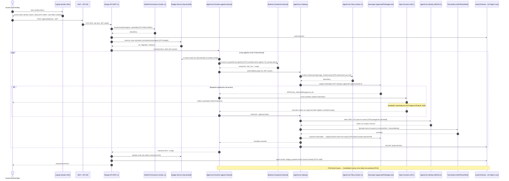
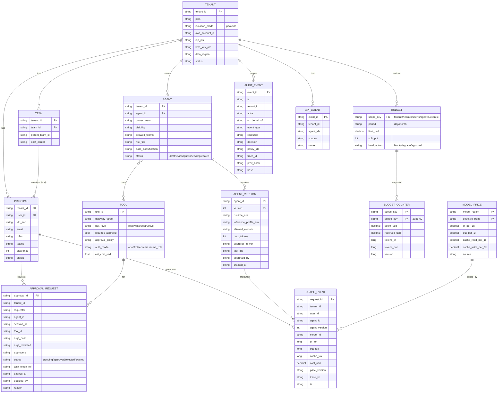

# Mango Hub — Capa de Gobernanza y Control sobre AWS

> Fecha: 2026-09-28 · Autor: investigación arquitectura (governance) · Base de código revisada: `aws-samples/bedrock-chat` @ `4419d62`
> Rutas de código relativas a `scratchpad/bedrock-chat/`. Todo el estado de servicios/precios fue verificado en la web en la fecha indicada (ver §13 Fuentes).

---

## 0. TL;DR

- **bedrock-chat trae gobernanza "de demo"**: 3 grupos Cognito fijos, compartir bots por grupo/usuario, reporte de costos *a posteriori* con Athena sobre un export horario de DynamoDB, API keys + usage plans para bots publicados y Guardrails por bot limitados. **No trae**: límites de gasto (solo reporte), autorización por tool, propagación de identidad a tools, HITL, audit trail inmutable, PII/prompt-attack, ni multi-tenancy.
- **Hallazgo crítico de estado actual**: **AWS CloudTrail Lake está cerrado a clientes nuevos desde el 31-may-2026** (solo recibe fixes críticos). No debe estar en la arquitectura de Mango; AWS recomienda CloudWatch (pipelines/unified data) como sucesor.
- **Piezas AWS maduras a sep-2026 que cubren lo que falta**: AgentCore **Policy** (Cedar, GA 3-mar-2026) para "quién puede llamar qué tool con qué argumentos" en el Gateway; AgentCore **Identity** con **On-Behalf-Of token exchange** (abr-2026) para propagar al usuario hasta SAP/Google/Entra; **Guardrails enforcements** a nivel cuenta/organización; **Verified Permissions** a $5/M requests (bajó 97% en jun-2025); **Bedrock cost allocation por IAM principal** en CUR 2.0 (abr-2026, pero con 24-48 h de latencia → no sirve para enforcement).
- **Enforcement de presupuesto en tiempo real no existe como servicio gestionado**: hay que construirlo (DynamoDB con reservas atómicas antes de cada llamada al modelo + reconciliación). Es la pieza propia más importante de Mango.

---

## 1. Qué trae bedrock-chat (revisión con código)

### 1.1 Identidad y RBAC

| Capacidad | Implementación | Archivo |
|---|---|---|
| User Pool Cognito, self sign-up opcional (se desactiva si hay IdP externo) | `selfSignUpEnabled: props.selfSignUpEnabled && !props.idp.isExist()` | `cdk/lib/constructs/auth.ts:52-53` |
| IdP federados: **solo Google y OIDC custom** (sin SAML) | `UserPoolIdentityProviderGoogle` / `UserPoolIdentityProviderOidc` | `cdk/lib/constructs/auth.ts:102-143` |
| Allowlist de dominios de email (Lambda pre-sign-up) | `checkEmailDomainFunction` | `cdk/lib/constructs/auth.ts:161-184` |
| 3 grupos fijos: `Admin`, `CreatingBotAllowed`, `PublishAllowed` | `CfnUserPoolGroup` | `cdk/lib/constructs/auth.ts:188-206` |
| Chequeo de rol = pertenencia a grupo | `is_admin()`, `is_creating_bot_allowed()`, `is_publish_allowed()` | `backend/app/user.py:28-35` |
| Dependencias FastAPI por rol | `check_admin`, `check_creating_bot_allowed` | `backend/app/dependencies.py:29-40` |
| Validación JWT: **ID token**, JWKS descargado **en cada request**, `verify_at_hash` desactivado | `verify_token()` | `backend/app/auth.py:11-29` |
| Acceso a bots: owner/admin, `shared_scope` = `private`/`partial`/`all`, listas `allowed_cognito_groups` / `allowed_cognito_users` | `is_accessible_by_user()` | `backend/app/repositories/models/custom_bot.py:368-377, 507-525`; `backend/app/usecases/bot.py:349-375` |

**Valoración**: el modelo "shared_scope + grupos/usuarios permitidos" es reutilizable conceptualmente para el marketplace (quién ve/usa qué agente), pero es RBAC grueso embebido en código. No hay atributos (departamento, tenant, clasificación de datos), no hay autorización por tool, y se usa el ID token (debería ser access token con scopes). El fetch de JWKS por request es un problema de latencia/rate-limit.

### 1.2 Uso y costos

| Capacidad | Implementación | Archivo |
|---|---|---|
| Precio calculado en backend con **tabla de precios hard-codeada** ("based on 2024-03-07") | `BEDROCK_PRICING`, `calculate_price()` | `backend/app/config.py:61-64`; `backend/app/bedrock.py:1326-1365` |
| Acumulación de tokens/precio por loop de tool-use | `price += result["price"]` | `backend/app/usecases/chat.py:423-464, 530` |
| `TotalPrice` persistido por conversación en DynamoDB | | `backend/app/repositories/conversation.py:52, 176` |
| Export **horario** de DynamoDB (PITR export) a S3 | Lambda `ExportHandler` + `events.Rule` cron `minute: 5` | `cdk/lib/constructs/usage-analysis.ts:241-260` |
| Glue table con partition projection por `datehour` + Athena workgroup | | `cdk/lib/constructs/usage-analysis.ts:65-78, 174-238` |
| Queries "bots/usuarios ordenados por costo" | `find_bots_sorted_by_price`, `find_users_sorted_by_price` | `backend/app/repositories/usage_analysis.py:107-145, 147-300` |
| Admin console: endpoints de uso | `/admin/public-bots`, `/admin/users`, `/admin/published-bots` | `backend/app/routes/admin.py:25-141` |

**Valoración**: es **solo reporting con ~1 h de retraso**. No hay límites de gasto (el único "budget" del repo es `budget_tokens` de *extended thinking*, `backend/app/config.py:31-32`, que no es un control de costo). La tabla de precios hard-codeada queda obsoleta. Para Mango: reutilizar la **idea** (costo por request calculado en backend y agregado por user/bot), pero reemplazar el pipeline por eventos de uso en streaming (ver §5) y precios versionados.

### 1.3 Bots publicados (API)

| Capacidad | Implementación | Archivo |
|---|---|---|
| Stack por bot publicado: API Gateway REST con `apiKeyRequired`, API key + usage plan (throttle/quota) | `addApiKey`, `addUsagePlan` | `cdk/lib/api-publishment-stack.ts:154-165` |
| Parámetros de throttle/quota pasados como env al CodeBuild que despliega el stack | | `backend/app/usecases/publication.py:74-90, 150-160` |
| WAF con allowlist IPv4/IPv6 para la API publicada | | `cdk/lib/constructs/webacl-for-published-api.ts:17-61` |
| Identidad del caller = pseudo-usuario `PUBLISHED_API#<bot_id>` | `User.from_published_api_id` | `backend/app/user.py:48`; `backend/app/main.py:32-34, 115-116` |

**Valoración**: los usage plans limitan **requests**, no tokens ni dinero; el API key no identifica al usuario final (todos los callers son el mismo principal) → no hay atribución ni autorización por usuario. Un stack CloudFormation por bot no escala a un marketplace. Para Mango: clientes M2M con **OAuth client credentials** (Cognito M2M) + budget por `client_id`.

### 1.4 Guardrails, observabilidad, logs

- Guardrail **por bot** creado como `CfnGuardrail` en un stack CDK por bot (vía CodeBuild): solo content filters `HATE/INSULTS/SEXUAL/VIOLENCE/MISCONDUCT` y contextual grounding (`GROUNDING/RELEVANCE`) — `cdk/lib/bedrock-custom-bot-stack.ts:220-330`. **No** configura `PROMPT_ATTACK`, PII (sensitive information), denied topics ni word filters. Se aplica en la llamada Converse con `guardrailConfig` — `backend/app/bedrock.py:679-688, 913-940`.
- Observabilidad: solo `logRetention: THREE_MONTHS` en Lambdas — `cdk/lib/constructs/api.ts:290`, `cdk/lib/constructs/websocket.ts:139`. Sin OTel/X-Ray.
- Tools (Strands) — `backend/app/strands_integration/tools/*` — se ejecutan con el **rol IAM de la Lambda**; no hay identidad de usuario hacia las tools.

### 1.5 Qué reutilizar / reemplazar

| Reutilizar | Reemplazar |
|---|---|
| Patrón de `User` + dependencias FastAPI (`dependencies.py`) como PEP (policy enforcement point) de la API | Grupos fijos → Cedar (AVP) con atributos |
| Modelo `shared_scope` + ACL por grupo/usuario como semántica inicial del marketplace | ID token → access token con claims custom (`tenant_id`, `team`, `roles`) |
| Cálculo de costo por request en backend y acumulación en el loop de tools | Precios hard-codeados → tabla `ModelPrice` versionada |
| Admin console (UI de uso por bot/usuario) | Export horario DDB→Athena → eventos de uso en streaming (Firehose→S3/Iceberg) + contadores en tiempo real |
| WAF para frontend y API | API key + usage plan por stack → OAuth M2M + budgets por `client_id` |
| | Guardrail por bot vía CodeBuild → guardrail base **enforced a nivel cuenta** + guardrails por agente vía API (sin CDK por agente) |

---

## 2. Identidad (AuthN)

### 2.1 Cognito vs IAM Identity Center

| | Amazon Cognito User Pools | AWS IAM Identity Center |
|---|---|---|
| Propósito | Identidad de **usuarios de aplicación** (CIAM/B2B SaaS) | Identidad de **workforce** para acceso a cuentas AWS y apps gestionadas por AWS |
| Federación Entra/Okta | SAML 2.0 y OIDC por user pool; un pool puede tener múltiples IdPs (uno por tenant) | Un único IdP externo por instancia (SCIM + SAML) |
| Tokens para nuestra app | JWT (ID/access) con customización de access token (Essentials+) vía pre-token-generation Lambda | Trusted identity propagation pensado para servicios AWS (Q Business, QuickSight, S3 Access Grants, Redshift…) |
| Multi-tenant SaaS | Sí (IdP por tenant, atributo `tenant_id`) | No es su caso de uso |
| Precio (verificado) | Essentials **$0.015/MAU** (10k gratis directos); **federados SAML/OIDC $0.015/MAU** tras 50 gratis; Plus $0.02/MAU (threat protection, sin free tier) | Sin costo adicional |

**Decisión**: **Cognito (Essentials) como broker de tokens de Mango** para usuarios finales; **IAM Identity Center solo para operadores de Mango** (acceso a consolas/cuentas AWS y a la admin console interna) y, en despliegues *single-enterprise* dentro de la cuenta del cliente, opcionalmente como IdP upstream de Cognito.

### 2.2 SSO con Entra ID / Okta (patrón)

1. Cada tenant registra su IdP (SAML o OIDC) en el user pool de Mango (`identifier` = dominio del tenant → *home realm discovery* por email).
2. **Pre-token-generation Lambda (V2)** enriquece el **access token** con `tenant_id`, `teams[]`, `roles[]`, `clearance`, `cost_center` (mapeo de grupos del IdP → roles Mango desde la tabla `Principal`). Evitar meter 200 grupos de Entra en el token: mapear a roles Mango.
3. Aprovisionamiento: JIT en el primer login + (opcional) SCIM desde Entra/Okta hacia una API propia de Mango para desprovisionamiento rápido (Cognito no expone SCIM nativo; revocar sesiones con `AdminUserGlobalSignOut` y access tokens cortos, 15-60 min).
4. El backend valida **access tokens** (JWKS cacheado), nunca el ID token (corrige `backend/app/auth.py:11-29`).
5. AgentCore Runtime/Gateway configurados con **inbound JWT authorizer** apuntando al discovery URL del user pool de Cognito (un solo issuer para todos los tenants, más simple que registrar N issuers de Entra/Okta).

Para clientes M2M (agentes publicados como API): Cognito **client credentials** (M2M) por integrador, con scopes `agent:<id>:invoke`, en lugar de API keys.

---

## 3. Autorización fina (RBAC + ABAC)

Se proponen **tres puntos de decisión (PDP)**, todos en Cedar para un único lenguaje de políticas:

| Nivel | Pregunta | PDP | PEP |
|---|---|---|---|
| **L1 – Plataforma / marketplace** | ¿Puede el usuario *ver/usar/crear/publicar/administrar* el agente X? ¿Puede usar el modelo Y? ¿Puede aprobar? | **Amazon Verified Permissions** (policy store por entorno; entidades con `tenant_id`) | API Mango (FastAPI middleware, como `dependencies.py`) |
| **L2 – Tools** | ¿Puede *este usuario vía este agente* llamar `SAP___create_po` con `amount=50000`? | **AgentCore Policy** (Cedar) adjunto al **AgentCore Gateway** | Gateway (fuera del código del agente; inmune a prompt injection) |
| **L3 – Recurso destino** | ¿El sistema downstream acepta la acción del usuario? | IAM (ABAC con session tags) / permisos nativos de SAP, Google, Entra | El propio servicio destino vía token OBO |

### 3.1 L1 — Verified Permissions (ejemplo de esquema Cedar)

```cedar
// Entidades: Mango::User (attrs: tenant, teams, roles, clearance), Mango::Team, Mango::Agent
// (attrs: tenant, owner_team, risk_tier, data_classification, visibility), Mango::Model
permit (principal, action == Mango::Action::"UseAgent", resource is Mango::Agent)
when {
  resource.tenant == principal.tenant &&
  resource.status == "published" &&
  ( resource.visibility == "tenant" ||
    principal.teams.containsAny(resource.allowed_teams) ) &&
  principal.clearance >= resource.data_classification_level
};

forbid (principal, action == Mango::Action::"UseAgent", resource)
when { resource.risk_tier == "high" && !principal.roles.contains("agent-power-user") };

permit (principal, action == Mango::Action::"ApproveToolCall", resource is Mango::ApprovalRequest)
when { resource.tenant == principal.tenant &&
       principal.roles.contains("approver") &&
       resource.requester != principal };            // separación de funciones
```

- Precio (verificado): **$5 por millón** de `IsAuthorized` simples (desde 12-jun-2025). Los batch se cobran por llamada con tarifa mayor (tiers desde $0.00015) → para **filtrar el catálogo del marketplace** conviene precomputar un índice de visibilidad en DynamoDB (recalculado al cambiar agente/equipo) o evaluar localmente con el SDK open-source de Cedar usando las mismas políticas, y usar AVP para decisiones puntuales (usar/publicar/aprobar).
- Las políticas se versionan en Git y se despliegan por pipeline (policy-as-code con tests de Cedar + análisis), no se editan a mano en consola.

### 3.2 L2 — AgentCore Policy en el Gateway (tools)

- GA desde 3-mar-2026. Políticas Cedar evaluadas por el Gateway antes de invocar el target; **default deny, forbid gana**; `tools/list` devuelve solo las tools permitidas al caller. Soporta autoría en lenguaje natural → Cedar.
- Acceso a claims del JWT como tags del principal (`principal.getTag("role")`) y a argumentos de la tool (`context.input.amount`). Ejemplo para Mango:

```cedar
permit (
  principal is AgentCore::OAuthUser,
  action == AgentCore::Action::"FinOps___get_cost_and_usage",
  resource == AgentCore::Gateway::"arn:aws:bedrock-agentcore:eu-west-1:111122223333:gateway/mango-tools"
) when { principal.hasTag("roles") && principal.getTag("roles") like "*finops-reader*" };

forbid (
  principal is AgentCore::OAuthUser,
  action == AgentCore::Action::"SAP___create_purchase_order",
  resource == AgentCore::Gateway::"arn:aws:bedrock-agentcore:eu-west-1:111122223333:gateway/mango-tools"
) unless { context.input has amount && context.input.amount < 10000 };
```

- **Limitaciones a tener en cuenta**: (a) Policy decide allow/deny, **no "requiere aprobación"** → la aprobación se modela con un *interceptor* (§6); (b) los tags vienen del JWT entrante → el token que llega al Gateway debe ser el del usuario (o uno derivado OBO), no uno de servicio; (c) cobra **$0.000025 por autorización** + $0.13/1k tokens si se usa la autoría en lenguaje natural (≈ $25 por millón de tool calls).
- **Gateway interceptors** (Lambda de request/response): para lógica que Cedar no expresa bien — chequeo de budget por tool costosa, validación de *approval token*, redacción de PII en respuestas de tools, filtrado adicional por tenant.

---

## 4. Propagación de identidad hasta las tools

Problema en bedrock-chat: las tools corren con el rol de la Lambda (§1.4) → cualquier usuario obtiene los permisos del servicio ("confused deputy").

**Diseño Mango**:

| Tipo de tool | Mecanismo | Resultado |
|---|---|---|
| SaaS con OAuth del usuario (Google Drive, M365/Entra, Salesforce, SAP BTP con OAuth) | **AgentCore Identity**: (a) **OBO token exchange** (RFC 8693-style) cuando el IdP del recurso confía en el token entrante — p. ej. Entra; (b) **3-legged OAuth con token vault** cuando el usuario debe consentir (Google Drive): el agente pide token, si no hay, se devuelve URL de consentimiento al chat | La tool actúa **como el usuario** con scopes mínimos; el SaaS aplica sus propios permisos (el usuario solo ve sus archivos) |
| AWS APIs (Cost Explorer, CloudWatch) en cuentas del cliente | `sts:AssumeRole` a un rol en la cuenta del cliente con **session tags** (`tenant_id`, `mango_user`, `agent_id`) + **`SourceIdentity`** = user id (inmutable en role chaining, aparece en CloudTrail) + ExternalId por tenant; ABAC con `aws:PrincipalTag` en las políticas del rol | CloudTrail del cliente muestra *qué usuario de Mango* hizo cada llamada; política del rol limita a read-only salvo aprobación |
| APIs internas sin OAuth (SAP on-prem vía RFC/OData con basic auth) | Credencial de servicio en AgentCore Identity (API key / Secrets Manager) + **contexto de usuario firmado** en header (JWT corto emitido por Mango) + autorización en L2 obligatoria | La autorización recae en Mango (L2); documentar como riesgo |

- Precio AgentCore Identity (verificado): $0.010 por 1.000 tokens/API keys solicitados, **sin cargo cuando se usa vía Runtime o Gateway**.
- Regla: **el LLM nunca ve tokens**; los inyecta el Gateway/Identity en la llamada saliente.

---

## 5. Budgets y cuotas con enforcement en tiempo real

### 5.1 Qué ofrece AWS y por qué no alcanza

| Servicio | Útil para | Por qué no es enforcement |
|---|---|---|
| Bedrock **cost allocation por IAM principal** (CUR 2.0, abr-2026) | Atribución real y reconciliación | Latencia 24-48 h |
| **Application inference profiles** con tags (bedrock-runtime) | Atribución por agente/tenant en Cost Explorer | Solo reporting |
| **Bedrock Projects** (bedrock-mantle, OpenAI-compatible) | Aislamiento/tagging por proyecto + AWS Budgets por proyecto | Solo endpoint mantle/APIs OpenAI-compatibles; alertas, no corte; en bedrock-runtime solo existe el proyecto default |
| **AWS Budgets actions** (aplicar SCP/IAM deny) | Backstop duro por cuenta (modelo silo) | Datos de billing con horas de retraso; granularidad de cuenta |
| **Service Quotas** Bedrock (TPM/RPM por cuenta/región) | Techo físico de throughput | No es por usuario ni en dinero |

### 5.2 Diseño: "Budget Service" propio (DynamoDB, reserva-y-liquidación)

Jerarquía de scopes: `tenant → team → user`, y ortogonalmente `agent` y `api_client`. Cada request debe tener saldo en **todos** los scopes aplicables.

1. **Pre-check / reserva** (antes de cada llamada al modelo, no solo al inicio del turno): estimar costo máximo = `input_tokens` (CountTokens o estimación) × precio_in + `max_tokens` × precio_out. `TransactWriteItems` con `ConditionExpression: spent + reserved + :est <= limit` sobre los contadores de todos los scopes del periodo (`BudgetCounter`). Si falla → aplicar `hard_action` (bloquear / degradar a modelo más barato / pedir aprobación de sobregiro).
2. **Clamp dinámico**: si el saldo restante < estimación, reducir `max_tokens` al saldo disponible en vez de rechazar.
3. **Durante el loop agéntico**: hook del framework (Strands `BeforeModelCallEvent` / `BeforeToolCallEvent`) repite el paso 1 en cada iteración; límite duro de iteraciones y de tool calls por turno (evita loops runaway). Tools costosas (p. ej. Athena, Code Interpreter) se contabilizan vía interceptor del Gateway con costo estimado por tool.
4. **Liquidación**: al recibir `usage` real (input/output/cache tokens) → `spent += real`, `reserved -= est` y emitir `UsageEvent` (Firehose → S3/Iceberg) con `price_version`.
5. **Reservas huérfanas**: TTL/barrido que libera reservas de requests que murieron.
6. **Reconciliación diaria** contra CUR 2.0 (IAM principal + tags de inference profile) → detectar drift entre costo estimado y facturado; alertar si > X%.
7. **Alertas soft** (50/80/100%) vía EventBridge → notificación al owner; **Cost Anomaly Detection** por cuenta como red de seguridad.

Cuotas de **tasa** (no dinero): token bucket por usuario/tenant en DynamoDB o ElastiCache para proteger la cuota TPM compartida de la cuenta (*noisy neighbor* en el modelo pool).

Guardrails de costo adicionales: allowlist de modelos por agente/tier (Cedar L1: `UseModel`), `max_tokens` máximo por agente, prompt caching obligatorio en system prompts largos, tamaño máximo de contexto RAG, timeouts de sesión en AgentCore Runtime.

---

## 6. Human-in-the-loop para acciones sensibles

Dos patrones complementarios, decididos por metadata de la tool (`risk_level`, `approval_policy`):

| Caso | Mecanismo | Por qué |
|---|---|---|
| **Auto-confirmación** (el propio usuario confirma "¿envío este correo?") — segundos/minutos | **Interrupts de Strands**: hook `BeforeToolCallEvent` levanta un interrupt; el agente termina con `stop_reason` de interrupción; la UI muestra la tarjeta; se reanuda con `interruptResponse`. Persistir sesión (session manager / AgentCore Memory) para que sea *restart-safe* | Nativo del loop, baja latencia, sin infraestructura extra |
| **Aprobación por terceros** (manager/FinOps aprueba una PO de 50k, cambio en prod) — horas/días | **Step Functions `.waitForTaskToken`** (espera hasta 1 año): se crea `ApprovalRequest`, se notifica (Slack/Teams/email), el aprobador decide en la consola Mango (autorizado por AVP `ApproveToolCall`, con separación de funciones), la API llama `SendTaskSuccess/Failure`, y el workflow reanuda la sesión del agente | Durable, auditable, con timeouts/escalado; no mantiene cómputo del agente vivo |

**Enforcement no evadible**: el agente no "decide" si pide aprobación. Un **request interceptor del Gateway** exige, para tools marcadas `requires_approval`, un **approval token** firmado (KMS), de un solo uso, con expiración, y **ligado al hash de `tool + args` canónicos**. Sin token válido → respuesta estructurada `APPROVAL_REQUIRED(approval_id)` que el orquestador convierte en interrupt/workflow. Esto evita TOCTOU (aprobar A y ejecutar B) y prompt injection que intente saltarse la aprobación.

Riesgo: hay bugs abiertos en el handler HITL de Strands (p. ej. re-pedir aprobación tras reanudar, issue del 27-sep-2026) → encapsular tras nuestra propia interfaz.

---

## 7. Audit trail inmutable

### 7.1 Decisión sobre CloudTrail Lake

**No usar CloudTrail Lake**: cerrado a clientes nuevos desde **31-may-2026**, solo fixes críticos; AWS recomienda migrar a CloudWatch (pipelines, OCSF/OTel, Iceberg). CloudTrail *trails* siguen plenamente soportados.

### 7.2 Arquitectura

```
Mango services ──(AuditEvent JSON, firmado/encadenado)──> Kinesis Data Firehose
   └─> S3 "audit" en cuenta Log Archive (Object Lock COMPLIANCE, versioning, SSE-KMS CMK,
       bucket policy deny-delete, replicación cross-region)  ──> Glue/Iceberg ──> Athena
CloudTrail organization trail (management + data events de Bedrock/AgentCore/S3 sensibles,
   log file validation) ──> mismo Log Archive (Object Lock)
Bedrock model invocation logging ──> S3 separado (prompts/respuestas completos; retención corta, acceso restringido)
CloudWatch Logs (operacional) ──> data protection policies (masking PII)
```

- **Tamper-evidence** adicional: cada `AuditEvent` lleva `prev_hash` y `hash` (cadena por sesión/tenant) + *digest* diario firmado con KMS y guardado también bajo Object Lock.
- **Retención**: audit de decisiones 7 años (o lo que pida el contrato); contenido de prompts 30-90 días (minimización de datos) — separado del audit de decisiones.

### 7.3 Qué eventos loguear (mínimo)

| Evento | Campos clave |
|---|---|
| `auth.login` / `auth.token_refresh` / `auth.logout` | tenant, user, idp, ip, mfa |
| `agent.invoke` | session, agent_id+version, model, trace_id, prompt_ref (hash + puntero a S3 de contenido) |
| `policy.decision` (L1 AVP y L2 AgentCore Policy) | principal, action, resource, decision, policy_ids determinantes, contexto relevante |
| `guardrail.intervention` | guardrail_id+version, filtro, acción (block/mask), dirección (input/output/tool_output) |
| `tool.call` / `tool.result` | tool, args redactados + args_hash, target, identidad downstream (OBO sub / SourceIdentity), latencia, status |
| `budget.check` / `budget.exceeded` / `budget.override` | scopes, estimado, saldo, acción |
| `approval.requested/decided/expired` | approval_id, requester, approvers, decisión, razón, args_hash |
| `admin.change` | cambios de políticas, agentes (publicación/versión), budgets, guardrails, roles (quién, antes/después) |
| `identity.token_exchange` | recurso, scopes, resultado (sin tokens) |

---

## 8. Bedrock Guardrails (PII, prompt attacks)

Capas:
1. **Guardrail base enforced a nivel cuenta** (o **organización** vía AWS Organizations *Bedrock policies*): se aplica automáticamente a todo `InvokeModel/Converse(Stream)` de la cuenta aunque el código olvide pasarlo. Incluir: content filters + **PROMPT_ATTACK**, sensitive information (PII: bloquear credenciales/tarjetas, *anonymize* emails/teléfonos según tenant), word filters. No incluir Automated Reasoning (no soportado en enforcement). Permite excluir modelos de embeddings.
2. **Guardrail por agente** (vía API, versionado, no un stack CDK por agente como en bedrock-chat): denied topics del dominio, contextual grounding para agentes RAG. El efecto neto es la **unión, prevaleciendo lo más restrictivo**.
3. **`ApplyGuardrail` sobre salidas de tools y chunks RAG** (documentos de Drive, tickets, emails) → mitigar **indirect prompt injection**, que es el vector principal en agentes con tools. Implementar en el response interceptor del Gateway o en el hook `AfterToolCall`.
4. Usar *input tagging* / controles `selective` vs `comprehensive` para no pagar evaluación del system prompt en cada llamada (ajustable en la policy de enforcement).

Costos (verificados): content filters $0.15/1k text units, denied topics $0.15, **sensitive info $0.10**, contextual grounding $0.10, regex y word filters gratis (text unit ≤ 1.000 caracteres). Ejemplo: 1M turnos/mes × ~4 text units (entrada+salida) × ($0.15 + $0.10) ≈ **$1.000/mes**, más la evaluación de tool outputs. Hay además la API `InvokeGuardrailChecks` con precios menores (prompt attack $0.08/1k) para checks puntuales.

---

## 9. Observabilidad

- **Instrumentación**: OpenTelemetry con **semantic conventions GenAI** (`invoke_agent` → `chat` → `execute_tool`), ADOT; en AgentCore Runtime la instrumentación es automática y exporta a CloudWatch (traces, métricas de sesión, logs).
- **CloudWatch Generative AI observability** (GA oct-2025): vistas de invocaciones de modelo y agentes AgentCore. **CloudWatch Omni** (lanzado 22-sep-2026): experiencia unificada con trazas de agentes y 17 evaluadores integrados — prometedor pero de **6 días de edad**; evaluar en piloto, no depender de él aún.
- **Propagación**: `trace_id` en cada `AuditEvent`, `UsageEvent` y `ApprovalRequest` para ir del costo/decisión al trace.
- **Captura de contenido** (prompts/completions en spans) **desactivada por defecto**; activarla por agente en entornos no productivos o con muestreo y retención corta.
- **Métricas de gobernanza** (EMF/CloudWatch): denegaciones de policy por agente/tool, intervenciones de guardrail, % budget consumido por scope, aprobaciones pendientes/tiempo de decisión, drift costo estimado vs CUR.
- Evaluaciones: AgentCore Evaluations ($0.0024/1k tokens in built-in) para regresión de calidad/seguridad en el pipeline de publicación de agentes.

---

## 10. Multi-tenancy

| Modelo | Cuándo | Pros | Contras |
|---|---|---|---|
| **Pool** (cuentas compartidas por Mango, `tenant_id` en todo) | Default, tenants pequeños/medianos | Coste y operación mínimos; onboarding en segundos | Cuotas Bedrock TPM compartidas (*noisy neighbor*); aislamiento lógico (IAM ABAC + leading key DynamoDB); atribución de costos vía tags/inference profiles |
| **Silo** (una cuenta AWS por cliente, account vending con Organizations/Control Tower) | Enterprise/regulado, residencia de datos, cliente quiere su CUR/KMS/CloudTrail | Aislamiento fuerte; cuotas y factura propias; AWS Budgets actions/SCP como corte duro; guardrail enforcement por OU | Más coste fijo y operación; despliegues multi-cuenta |
| **Bridge** (control plane pool, data plane silo) | Recomendado como evolución | El control plane de Mango (catálogo, políticas, budgets, audit) es único; el runtime/datos del cliente pueden estar en su cuenta | Complejidad de cross-account (roles, ExternalId) |

Controles en pool: `tenant_id` como claim del token → session tags → condiciones `aws:PrincipalTag/tenant_id` en políticas IAM sobre DynamoDB (`dynamodb:LeadingKeys`), S3 (prefijos) y KMS (clave por tenant opcional); Cedar L1/L2 siempre compara `resource.tenant == principal.tenant`; tests automáticos de aislamiento cross-tenant en CI.

---

## 11. Diagramas

### 11.1 Flujo de una request con puntos de control



### 11.2 Modelo de datos mínimo de governance



Almacenamiento: `TENANT/PRINCIPAL/TEAM/AGENT*/TOOL/BUDGET*/APPROVAL/API_CLIENT/MODEL_PRICE` en DynamoDB (tabla única o por agregado, PK con `tenant_id` como leading key); **políticas** en AVP (L1) y en el policy engine de AgentCore (L2), con su fuente en Git; `USAGE_EVENT` y `AUDIT_EVENT` *append-only* en S3 (Iceberg/Parquet, Object Lock) consultables con Athena, con los contadores agregados en `BUDGET_COUNTER`.

---

## 12. Recomendación para Mango

### Decisiones

1. **Identidad**: Cognito User Pool (Essentials) como broker único; un IdP SAML/OIDC por tenant (Entra/Okta); access tokens cortos enriquecidos por pre-token-generation V2 con `tenant_id/teams/roles`. IAM Identity Center solo para operadores de Mango. M2M con client credentials, **no** API keys.
2. **Autorización en 3 niveles, todo Cedar**: AVP para plataforma/marketplace/aprobaciones (L1); **AgentCore Gateway + AgentCore Policy** obligatorios para *toda* tool (L2), default-deny; permisos nativos del destino vía identidad propagada (L3). Políticas como código en Git con tests.
3. **Toda tool detrás de AgentCore Gateway** (incluidas MCP servers propios): es el único punto donde se pueden garantizar policy, OBO, approval token, guardrail de outputs y audit sin confiar en el código del agente.
4. **Identidad hasta la tool**: AgentCore Identity (OBO para Entra/Microsoft, 3LO+vault para Google/Salesforce); AWS tools con AssumeRole + session tags + `SourceIdentity`. Prohibido que las tools usen el rol del runtime para datos de usuario.
5. **Budget Service propio** (DynamoDB, reserva-y-liquidación por iteración del loop, jerarquía tenant/team/user + agent/client), precios versionados en `MODEL_PRICE`, reconciliación diaria contra CUR 2.0 con IAM principal + inference profiles etiquetados. AWS Budgets actions solo como backstop en cuentas silo.
6. **HITL**: interrupts de Strands para confirmación del propio usuario; Step Functions `waitForTaskToken` para aprobaciones de terceros; enforcement vía approval token ligado a `hash(tool,args)` validado por interceptor del Gateway.
7. **Audit**: Firehose → S3 Object Lock (compliance) en cuenta Log Archive + CloudTrail organization trail; eventos hash-encadenados; **no CloudTrail Lake**. Separar audit de decisiones (7 años) de contenido de prompts (30-90 días).
8. **Guardrails**: guardrail base **enforced a nivel cuenta/organización** (PROMPT_ATTACK + PII + content) + guardrail por agente vía API + `ApplyGuardrail` sobre outputs de tools/RAG.
9. **Observabilidad**: OTel GenAI semconv + AgentCore Observability → CloudWatch GenAI observability; `trace_id` en todo; contenido fuera de los spans por defecto. Pilotar CloudWatch Omni.
10. **Tenancy**: pool por defecto, silo por cuenta para enterprise/regulado, evolucionando a *bridge* (control plane Mango único).
11. **De bedrock-chat**: reutilizar semántica de `shared_scope`/ACL, dependencias FastAPI como PEP, cálculo de costo en backend y la admin console de uso; **descartar** grupos fijos, validación de ID token, export horario DDB→Athena como fuente de budget, stacks CDK por bot (publicación y guardrails) y API keys.

### Costos unitarios de control (verificados, orientativos)

| Control | Precio | Por 1M requests/tool calls |
|---|---|---|
| AVP IsAuthorized | $5 / 1M | ~$5 |
| AgentCore Policy | $0.000025 / autorización | ~$25 |
| AgentCore Gateway | $0.005 / 1.000 invocaciones | ~$5 |
| AgentCore Identity | gratis vía Runtime/Gateway | $0 |
| Guardrails (content+PII) | $0.25 / 1k text units | ~$1.000 por 1M turnos de ~4 TU |
| Cognito federado | $0.015 / MAU (50 gratis) | — |

Los Guardrails dominan el costo de gobernanza; el resto es marginal frente al gasto en tokens.

### Riesgos

| Riesgo | Mitigación |
|---|---|
| **Budget enforcement es código propio** (bugs = sobre-gasto o bloqueos); estimación de tokens imprecisa en streaming y loops | Reserva por iteración con clamp de `max_tokens`, límite duro de iteraciones, reconciliación con CUR, alertas de drift, kill-switch por tenant |
| Hot partitions en `BUDGET_COUNTER` de tenants grandes | Sharding de contadores por scope (N sub-contadores) o contadores en memoria con *lease* de saldo por instancia |
| AgentCore Policy no modela "requiere aprobación" y depende de claims del JWT | Interceptor + approval token; tokens con claims mínimos y estables (roles Mango, no grupos crudos del IdP) |
| Dependencia fuerte de AgentCore (lock-in, límites/regiones) | Contratos propios (Cedar es open-source; tools como MCP estándar); verificar disponibilidad regional de Policy/Identity OBO para la región de datos del cliente |
| OBO requiere que el IdP del recurso confíe en el token (no aplica a Google) | 3LO con consentimiento y token vault; UX de "conectar cuenta" en el marketplace |
| Indirect prompt injection vía documentos/RAG/tool outputs | ApplyGuardrail sobre outputs + L2 default-deny + HITL en acciones de escritura; nunca dar tools destructivas sin aprobación |
| PII en logs (invocation logging, traces, audit) | Referenciar contenido por hash/puntero, masking en CloudWatch Logs, retención corta, KMS por tenant, acceso break-glass auditado |
| Servicios muy nuevos (CloudWatch Omni 6 días; Strands HITL con bugs abiertos) | Piloto, abstracciones propias, no en ruta crítica en v1 |
| CloudTrail Lake cerrado a nuevos clientes | Diseño basado en S3 Object Lock + Athena y CloudWatch; no depender de Lake |
| Cuotas Bedrock por cuenta en modelo pool | Rate limiting por tenant, cross-region inference profiles, mover tenants grandes a silo |
| Cognito sin SCIM nativo → desprovisionamiento lento | Access tokens cortos, API SCIM propia o sync periódico, `AdminUserGlobalSignOut` en baja |

---

## 13. Fuentes (consultadas 2026-09-28)

- AgentCore Policy GA (3-mar-2026): https://aws.amazon.com/about-aws/whats-new/2026/03/policy-amazon-bedrock-agentcore-generally-available/
- AgentCore Policy docs y ejemplos Cedar: https://docs.aws.amazon.com/bedrock-agentcore/latest/devguide/policy.html · https://docs.aws.amazon.com/bedrock-agentcore/latest/devguide/example-policies.html
- Por qué Cedar en AgentCore Policy: https://aws.amazon.com/blogs/security/why-policy-in-amazon-bedrock-agentcore-chose-cedar-for-securing-agentic-workflows/
- AgentCore Identity OBO (abr-2026): https://aws.amazon.com/about-aws/whats-new/2026/04/amazon-bedrock-agentcore/ · https://docs.aws.amazon.com/bedrock-agentcore/latest/devguide/on-behalf-of-token-exchange.html
- OBO multi-tenant con Gateway: https://aws.amazon.com/blogs/machine-learning/implement-on-behalf-of-token-exchange-for-multi-tenant-agents-with-amazon-bedrock-agentcore-gateway/
- Gateway outbound auth: https://docs.aws.amazon.com/bedrock-agentcore/latest/devguide/gateway-outbound-auth.html
- Gateway interceptors: https://docs.aws.amazon.com/bedrock-agentcore/latest/devguide/gateway-interceptors.html · https://aws.amazon.com/blogs/machine-learning/apply-fine-grained-access-control-with-bedrock-agentcore-gateway-interceptors/
- AgentCore pricing: https://aws.amazon.com/bedrock/agentcore/pricing/
- Verified Permissions pricing / rebaja 97%: https://aws.amazon.com/verified-permissions/pricing/ · https://aws.amazon.com/about-aws/whats-new/2025/06/amazon-verified-permissions-reduces-price/
- Cognito pricing: https://aws.amazon.com/cognito/pricing/
- CloudTrail Lake availability change: https://docs.aws.amazon.com/awscloudtrail/latest/userguide/cloudtrail-lake-service-availability-change.html
- Bedrock pricing (Guardrails): https://aws.amazon.com/bedrock/pricing/
- Guardrails enforcements (cuenta/organización): https://docs.aws.amazon.com/bedrock/latest/userguide/guardrails-enforcements.html
- Guardrails sensitive info filters: https://docs.aws.amazon.com/bedrock/latest/userguide/guardrails-sensitive-filters.html
- Bedrock cost allocation por IAM principal (abr-2026): https://aws.amazon.com/about-aws/whats-new/2026/04/bedrock-iam-cost-allocation · https://docs.aws.amazon.com/awsaccountbilling/latest/aboutv2/iam-principal-cost-allocation.html · https://aws.amazon.com/blogs/aws-cloud-financial-management/track-amazon-bedrock-costs-by-caller-identity-with-iam-based-cost-allocation/
- Bedrock Projects: https://docs.aws.amazon.com/bedrock/latest/userguide/projects.html · https://aws.amazon.com/blogs/machine-learning/manage-ai-costs-with-amazon-bedrock-projects/
- Bedrock Service Quotas (mantle, may-2026): https://aws.amazon.com/about-aws/whats-new/2026/5/amazon-bedrock-service-quotas/
- CloudWatch GenAI observability GA: https://aws.amazon.com/about-aws/whats-new/2025/10/generative-ai-observability-amazon-cloudwatch
- CloudWatch Omni (22-sep-2026): https://aws.amazon.com/about-aws/whats-new/2026/09/amazon-cloudwatch-omni-ai/ · https://aws.amazon.com/blogs/aws/introducing-amazon-cloudwatch-omni-ai-powered-observability-for-generative-ai-and-agentic-workloads/
- Monitor AI agents (CloudWatch): https://docs.aws.amazon.com/AmazonCloudWatch/latest/monitoring/omni-monitor-ai-agents.html
- OTel GenAI observability: https://opentelemetry.io/blog/2026/genai-observability/
- Strands interrupts / HITL: https://strandsagents.com/docs/user-guide/concepts/interrupts/ · https://builder.aws.com/content/3J7ttgyiJmxlrMNSrx9HG4P9kn1/restart-safe-strands-interrupts-approving-an-agents-write-from-a-new-process-agents-for-humans · bug HITL: https://github.com/strands-agents/harness-sdk/issues/4634

> Nota de verificación: las páginas de Strands (docs) devolvieron 404 al hacer fetch directo; la mecánica de interrupts se tomó del índice de búsqueda y del artículo de AWS Builder Center. Los límites exactos de Cognito (IdPs por user pool, user pools por cuenta) y la cuota de application inference profiles por cuenta no se verificaron en esta sesión — confirmar en Service Quotas antes de dimensionar.
