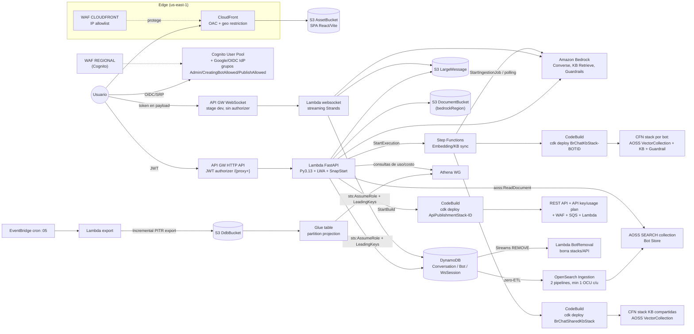
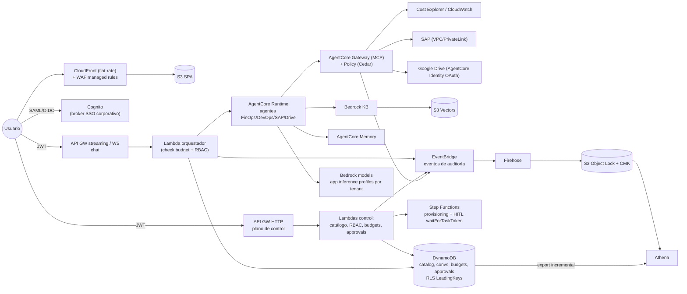

# Infraestructura de bedrock-chat, analizada para Mango Hub

> Alcance: carpeta `cdk/`, `deploy.yml` y `bin.sh`, más las piezas del backend que condicionan la infra. Repo `aws-samples/bedrock-chat` @ `4419d62` ("AWS CDK 2.269.0 (#1159)").
> Fecha del análisis: 2026-09-28. Los precios son de lista en us-east-1 y se verificaron en la web (URLs en §9).
> Las rutas son relativas a la raíz del repo clonado. `ruta:N` indica la línea N.

---

## 0. TL;DR

- **Arquitectura.** bedrock-chat es 100 % serverless y no usa VPC: CloudFront+S3, Cognito, API Gateway HTTP API y WebSocket, Lambda (Python con FastAPI vía Lambda Web Adapter), DynamoDB, Step Functions, CodeBuild y Bedrock KB sobre **OpenSearch Serverless (AOSS)**, además de OpenSearch Ingestion (OSIS) para el "bot store". No hay Fargate, KMS CMK, EventBridge Pipes ni VPC.
- **Costo en reposo con la config por defecto (`cdk/cdk.json`): unos 550 USD/mes con cero usuarios.** Casi todo viene del Bot Store: 1 OCU de AOSS más 2 pipelines OSIS con mínimo 1 OCU cada uno. Cada bot con KB "dedicada" crea **su propia colección AOSS** y suma unos 350 USD/mes más (réplicas activadas por defecto). Esto es exactamente lo que Mango quiere evitar.
- **Patrón más polémico: aprovisionamiento en runtime con `cdk deploy` dentro de CodeBuild**, lanzado desde la API. Hay un stack CloudFormation por bot, por KB compartida y por API publicada. Es lento y frágil, y equivale a un camino hacia administrador del account (§6).
- **Vale la pena copiar:**
  - Row-level security en DynamoDB con STS + session policy `dynamodb:LeadingKeys`.
  - Validación de parámetros con zod y multi-entorno con `envPrefix`.
  - Aspect de retención de logs.
  - Build del frontend en deploy-time con los outputs inyectados.
  - WAF en us-east-1 con `crossRegionReferences`.
  - Step Functions con locks y polling de ingestion jobs.
  - Export incremental de DynamoDB→S3→Athena para analítica barata.
- **Para Mango:** CDK en TypeScript, Bedrock AgentCore (Runtime/Gateway/Memory/Identity/Policy) como plano de ejecución de agentes, KB sobre **S3 Vectors**, sin AOSS ni OSIS, y aprovisionamiento por SDK desde Step Functions en lugar de CodeBuild. El costo en reposo estimado es de unos 30–60 USD/mes por entorno.

---

## 1. Inventario de stacks y constructs

### 1.1 Entry points (apps CDK)

| Entry point | Stacks que sintetiza | Quién lo ejecuta |
|---|---|---|
| `cdk/bin/bedrock-chat.ts` (app por defecto, `cdk/cdk.json:2`) | `FrontendWafStack` (us-east-1), `BedrockRegionResourcesStack` (en `bedrockRegion`), `BedrockChatStack` (región por defecto) | El operador, vía `bin.sh` → CodeBuild |
| `cdk/bin/bedrock-custom-bot.ts` | `BrChatKbStack<BotId>`: una colección AOSS + KB + Guardrail **por bot** | CodeBuild disparado por Step Functions en runtime |
| `cdk/bin/bedrock-shared-knowledge-bases.ts` | `BrChatSharedKbStack` (KB compartidas) | CodeBuild disparado por Step Functions |
| `cdk/bin/api-publish.ts` | `ApiPublishmentStack<Id>`: REST API + SQS + Lambda por bot publicado | CodeBuild disparado por la API (usuario admin) |

Truco usado para que CodeBuild solo sintetice un entry point: reescribe `cdk.json` con `sed` (`cdk/lib/constructs/bedrock-custom-bot-codebuild.ts:52`, `api-publish-codebuild.ts:54`, `bedrock-shared-knowledge-bases-codebuild.ts:49`).

### 1.2 Stack principal `BedrockChatStack` (`cdk/lib/bedrock-chat-stack.ts`)

| Construct | Archivo | Qué crea |
|---|---|---|
| Buckets base | `bedrock-chat-stack.ts:76-126` | AccessLogBucket, SourceBucketForCodeBuild (sube **todo el repo** vía `BucketDeployment`) |
| CodeBuild ×3 | `bedrock-chat-stack.ts:128-159`, `constructs/*-codebuild.ts` | Proyectos que ejecutan `cdk deploy` en runtime (imagen standard 7.0, `privileged: true`) |
| `Frontend` | `constructs/frontend.ts` | S3 AssetBucket + CloudFront (OAC, HTTPS_ONLY, SPA 403/404→`/`), geo restriction opcional, dominio propio + ACM + Route53 (`frontend.ts:71-140`), build de Vite en deploy-time (`frontend.ts:223-248`) |
| `WebAclForCognito` | `constructs/webacl-for-cognito.ts` | WAF REGIONAL asociado al User Pool (`auth.ts:292-302`) |
| `Auth` | `constructs/auth.ts` | Cognito User Pool + client, IdP Google/OIDC (`auth.ts:84-159`), grupos `Admin`, `CreatingBotAllowed`, `PublishAllowed` (`auth.ts:188-209`), Pre-signup por dominio de email (`auth.ts:161-186`), auto-join de grupos con custom resource (`auth.ts:211-290`) |
| `LargeMessageBucket` | `bedrock-chat-stack.ts:193-202` | Mensajes que superan el límite de un ítem DynamoDB |
| `Database` | `constructs/database.ts` | 3 tablas DynamoDB (§2) + `TableAccessRole` |
| `BotStore` (opcional, **on por defecto**) | `constructs/bot-store.ts` | Colección AOSS `SEARCH` + 2 pipelines OSIS (DynamoDB→AOSS) |
| `UsageAnalysis` | `constructs/usage-analysis.ts` | Export incremental horario DDB→S3, Glue DB/tabla con partition projection, Athena workgroup |
| `Embedding` | `constructs/embedding.ts` | Step Functions de sincronización de KB, 6 Lambdas en contenedor, removal handler vía DynamoDB Streams |
| `Api` | `constructs/api.ts` | HTTP API (`/{proxy+}`) + Cognito JWT authorizer + Lambda FastAPI (Python 3.13, 1024 MB, Lambda Web Adapter, SnapStart opcional) |
| `WebSocket` | `constructs/websocket.ts` | WebSocket API (stage `dev`) + Lambda de streaming |
| `WebAclForPublishedApi` | `constructs/webacl-for-published-api.ts` | WAF REGIONAL que luego usan los stacks de API publicada (vía `exportName`, `bedrock-chat-stack.ts:352-371`) |

### 1.3 Multi-región (`cdk/bin/bedrock-chat.ts`)

- `FrontendWafStack` va fijo en **us-east-1**, porque un WAF con scope CLOUDFRONT solo existe ahí (`bin/bedrock-chat.ts:34-52`).
- `BedrockRegionResourcesStack` va en `bedrockRegion` y contiene el `DocumentBucket`. Tiene que estar en la misma región que la KB y el modelo (`bin/bedrock-chat.ts:54-68`, `lib/bedrock-region-resources.ts:41-54`).
- El stack principal usa `crossRegionReferences: true` y `addDependency` (`bin/bedrock-chat.ts:80`, `:114-117`).
- La inferencia usa perfiles cross-region y global (`enableBedrockCrossRegionInference`, `enableBedrockGlobalInference`) como variables de entorno de las Lambdas (`api.ts:274-277`).

---

## 2. DynamoDB: tablas, llaves e índices (`cdk/lib/constructs/database.ts`)

| Tabla | PK / SK | Índices | Extras |
|---|---|---|---|
| `ConversationTableV3` (`:26-41`) | `PK`=UserId / `SK`=ConversationId (y otros tipos de ítem) | GSI `SKIndex` (PK=`SK`) para buscar por id | On-demand, Stream `NEW_IMAGE`, PITR (lo requiere el export), `AWS_MANAGED` SSE, **`RemovalPolicy.DESTROY`** |
| `BotTableV3` (`:44-89`) | `PK`=UserId / `SK`=ItemType | LSI `StarredIndex` (IsStarred), LSI `LastUsedTimeIndex` (LastUsedTime); GSI `BotIdIndex`, `SharedScopeIndex` (SharedScope/SharedStatus), `ItemTypeIndex`, `SyncStatusIndex` | Stream (el removal handler y OSIS lo consumen), PITR (lo requiere OSIS zero-ETL), **DESTROY** |
| `WebsocketSessionTable` (`:99-105`) | `ConnectionId` / `MessagePartId` (N) | — | TTL `expire`. Reensambla payloads mayores de 32 KB (límite de frame del WebSocket de API GW) |

**Row-level security (patrón recomendable):** `TableAccessRole` (`database.ts:91-95`) solo lo pueden asumir principals del account. El backend lo asume con una **session policy** que limita `dynamodb:LeadingKeys` a `"{user_id}*"` (`backend/app/repositories/common.py:123-134`). Así, aunque haya un bug en la app, un usuario no puede leer particiones ajenas. En Mango aplica directamente a aislamiento por **tenant/usuario**.

Los locks distribuidos de Step Functions se implementan con S3 (put condicional) en `backend/embedding_statemachine/bedrock_knowledge_base/lock.py:32-90`, no con DynamoDB.

---

## 3. Diagrama de arquitectura (tal como está en el repo)

---

## 4. Servicios: propósito, costo fijo en reposo y costo variable

Supuestos: us-east-1, **config por defecto** de `cdk/cdk.json:55-85` (Bot Store on, `enableRagReplicas: true`, SnapStart on; `bin.sh` lo pone en false, ver `bin.sh:43`), cero tráfico, ningún bot con KB salvo donde se indica. 730 h/mes.

| Servicio | Propósito en bedrock-chat | Fijo en reposo (USD/mes) | Variable (lista) |
|---|---|---|---|
| **OpenSearch Serverless (Bot Store)** | Búsqueda de bots públicos (`bot-store.ts:108-113`), colección `SEARCH` sin standby (`:61-62`) | **~175** (clásico, dev-test: 0.5+0.5 OCU × 0.24 USD) | 0.24 USD/OCU-h adicional + storage |
| **OpenSearch Ingestion ×2** | DynamoDB→AOSS para Bot y Conversation (`bot-store.ts:282-306`, `:319-342`, `minUnits: 1`) | **~350** (2 × 1 OCU × 0.24 × 730) | hasta 4 OCU cada uno |
| **AOSS por KB dedicada/compartida** | Una `VectorCollection` por stack de KB (`bedrock-custom-bot-stack.ts:90-95`, `bedrock-shared-knowledge-bases-stack.ts:87-91`), standby **ENABLED** si `enableRagReplicas` | **~350 a partir de la primera KB** (mín. 2 OCU); las colecciones que comparten KMS key comparten OCUs, pero crecen con los datos | OCU-h + storage |
| WAF ×3 web ACLs | CloudFront, Cognito, API publicada; 2 reglas IP cada uno | ~21 (3 × (5 + 2×1)) | 0.60 USD/M requests |
| Lambda (SnapStart) | API 1024 MB + WS 512 MB con snapshot en caché | ~6 (1.5 GB × 2.59 M s × 0.0000015046) por versión activa | 0.20 USD/M req + 0.0000166667 USD/GB-s; restore 0.00014 USD/GB |
| API GW HTTP | API REST principal | 0 | 1 USD/M req |
| API GW WebSocket | Streaming de respuestas | 0 | 1 USD/M mensajes (32 KB) + 0.25 USD/M min de conexión |
| API GW REST (publicada) | API por bot con API key + usage plan | 0 | 3.50 USD/M req |
| DynamoDB on-demand | Datos de app | ~0 (storage 0.25 USD/GB; PITR 0.20 USD/GB) | 0.625 USD/M WRU, 0.125 USD/M RRU, Streams 0.02 USD/100 k |
| DDB export incremental + Glue + Athena | Analítica de uso/costo | ~0–1 | Export 0.10 USD/GB procesado; Athena por TB escaneado |
| Step Functions (standard) | Sync de KB | 0 | por transición |
| CodeBuild | `cdk deploy` en runtime | 0 | por minuto de build (cada creación de bot tarda minutos) |
| Cognito Essentials | Auth + federación | 0 | 0.015 USD/MAU (10 k gratis directos; federados SAML/OIDC: 50 gratis y luego 0.015) |
| CloudFront + S3 | SPA | ~0 (pay-as-you-go) | Transferencia/requests |
| Secrets Manager | Credenciales de IdP y API key de Firecrawl | 0.40/secreto | — |
| CloudWatch Logs | Retención de 3 meses | ~1–5 | ingestión y almacenamiento |
| Bedrock | Modelos, KB, Guardrails | 0 | Tokens; Guardrails por unidad de texto |

**Totales aproximados en reposo:**

- Por defecto (Bot Store on, sin KBs): **~550 USD/mes**.
- Más la primera KB dedicada con réplicas: **~900 USD/mes**.
- Con `enableBotStore: false`, sin KBs ni SnapStart: **~25–30 USD/mes** (básicamente WAF).

Conclusión: el costo fijo lo concentran **AOSS y OSIS**, que son justo las piezas que Mango puede evitar.

**Novedad 2026 que conviene conocer:** desde el 2026-05-28 existe **OpenSearch Serverless NextGen**, con *scale-to-zero* dentro de "collection groups" (OCU a 0 tras 10 min de inactividad, arranque en frío de ~10 s, ~0.334 USD/OCU-h según un artículo de Classmethod). Cambia la ecuación si algún día hace falta búsqueda híbrida o léxica. No encontré confirmación explícita de que Bedrock KB lo soporte como vector store, así que para RAG sigo recomendando S3 Vectors (§8).

---

## 5. Prácticas de IaC

### 5.1 Buenas prácticas para copiar

1. **Parámetros tipados y validados con zod** (`cdk/lib/utils/parameter-models.ts:24-130`), con defaults y resolución en cascada `parameter.ts` → contexto de `cdk.json` → variables de entorno (`:297-330`, `cdk/parameter.ts:1-8`). Multi-entorno por `envName`/`envPrefix` en la misma cuenta (`bin/bedrock-chat.ts:17-29`).
2. **Aspects para gobernanza.** `LogRetentionChecker` avisa si algún log group queda sin retención (`cdk/rules/log-retention-checker.ts:7-29`, se aplica en `bin/bedrock-chat.ts:119`). Además hay `Tags.of(app)` global (`:120`). En Mango lo extenderíamos a tags obligatorios de costo (`tenant`, `agent`, `env`) y a cdk-nag.
3. **Constructs de una sola responsabilidad** que se pasan referencias tipadas (`Database`, `Auth`, etc.) y usan `grant*` de CDK en lugar de escribir ARNs a mano (`embedding.ts:87`, `api.ts:237-239`, `websocket.ts:102-105`).
4. **Build del frontend en deploy-time** con `@cdklabs/deploy-time-build` inyectando outputs (endpoints, UserPoolId) como `VITE_*` (`frontend.ts:196-248`). Evita el problema del huevo y la gallina.
5. **Stacks separados por región con `crossRegionReferences`** para WAF CLOUDFRONT y recursos atados a la región de Bedrock (`bin/bedrock-chat.ts:34-68`).
6. **Buckets endurecidos por defecto:** `BLOCK_ALL`, `enforceSSL`, server access logs, lifecycle para `.temp/` (`bedrock-region-resources.ts:41-54`).
7. **Step Functions robusto:** catch con compensación (liberar lock y marcar FAILED), polling con `RetryException` para ingestion jobs de hasta 12 h (`embedding.ts:700-748`), `Map` con `maxConcurrency: 1` para no saturar la KB (`embedding.ts:352-356`) y locks distribuidos (`embedding.ts:750-805`).
8. **Analítica de bajo costo:** export incremental PITR horario → S3 → Glue con **partition projection**, sin crawlers (`usage-analysis.ts:224-261`).
9. **Eventos por DynamoDB Streams con filtro** (`{"eventName":["REMOVE"]}`) para limpiar recursos al borrar un bot (`embedding.ts:685-696`).
10. **Tests de CDK con Jest** (`cdk/test/cdk.test.ts`, 16 casos: IdP, dominio propio, WAF on/off, KB) y CI que ejecuta `cdk synth` + tests en cada PR (`.github/workflows/cdk.yml`).
11. **Feature flags modernos de CDK** en `cdk.json:20-54` (p. ej. `minimizePolicies`, `restrictDefaultSecurityGroup`).

### 5.2 Malas prácticas que conviene evitar

1. **`cdk deploy` en runtime desde CodeBuild** (un stack por bot o API publicada), lanzado por la API y por Step Functions (`bedrock-custom-bot-codebuild.ts:47-54`). Problemas:
   - Latencia de minutos por cada creación de bot.
   - Cientos de stacks de CFN que gestionar.
   - Drift.
   - Depende del bucket con el código fuente completo (`bedrock-chat-stack.ts:86-126`).
   - Además es un riesgo de seguridad (§6).

   En Mango usaríamos **llamadas SDK** (`bedrock-agent:CreateKnowledgeBase`, `s3vectors:CreateIndex`, `bedrock-agentcore-control:*`) desde Step Functions (integraciones SDK) o Lambda.
2. **Reescribir `cdk.json` con `sed`/`jq`** para elegir la app o inyectar parámetros (`deploy.yml:163-169`, `*-codebuild.ts:49-54`). Es frágil. Mejor varias apps o `cdk --app`.
3. **`RemovalPolicy.DESTROY` en datos de producción:** tablas (`database.ts:32,50`), User Pool (`auth.ts:58`), buckets con `autoDeleteObjects`. Un `cdk destroy` o un cambio de ID lógico borra usuarios y conversaciones. En Mango: `RETAIN`/`SNAPSHOT` en prod y `deletionProtection` en DynamoDB.
4. **Secretos que acaban en el template:** `secretValueFromJson("clientId").unsafeUnwrap()` y el `clientSecret` del OIDC se resuelven en texto plano en CloudFormation (`auth.ts:95-98`, `:121-133`).
5. **cdk-nag decorativo:** hay `NagSuppressions` (`frontend.ts:142-147`, `*-codebuild.ts`), pero **ningún NagPack se aplica** en `bin/` (ningún `AwsSolutionsChecks`) y `cdk-nag` ni siquiera es dependencia directa en `cdk/package.json` (llega de forma transitiva).
6. **Defaults "abiertos" que parecen seguros:** allowlist `0.0.0.0/1` + `128.0.0.0/1` (= todo Internet) en `cdk.json:58-73`. Se crean y pagan 3 WAF que no filtran nada y no tienen reglas administradas ni rate limiting (`frontend-waf-stack.ts:27-91`).
7. **Timeouts incoherentes:** la Lambda de la HTTP API tiene 15 min (`api.ts:251`), pero la integración de HTTP API corta a 30 s.
8. **Construct deprecado:** `acm.DnsValidatedCertificate` (`frontend.ts:77`).
9. **Dependencia de una layer de otra cuenta** (Lambda Web Adapter `753240598075`, `api.ts:295-302`): riesgo de cadena de suministro, aunque la versión está fijada.
10. **`Stack.stackName.replace("-", "_")`** solo reemplaza la primera ocurrencia (`usage-analysis.ts:32-34`).
11. **Sin observabilidad declarada:** no hay alarmas, dashboards, X-Ray ni DLQ en la Lambda del removal handler (sí hay DLQ en SQS de la API publicada, `api-publishment-stack.ts:38-47`).
12. **Código de la imagen Docker duplicado** en 7 `DockerImageFunction` que construyen el mismo `backend/` con distinto `cmd` (`embedding.ts:89-244`). Funciona, pero alarga los deploys.

---

## 6. Seguridad

| Área | Qué hace bedrock-chat | Valoración |
|---|---|---|
| **IAM de las Lambdas** | `bedrock:*` sobre `*` en API, WebSocket, Embedding y API publicada (`api.ts:82-87`, `websocket.ts:73-78`, `embedding.ts:60-65`, `api-publishment-stack.ts:64-69`); `cloudformation:DeleteStack` sobre `*` (`api.ts:100-112`, `embedding.ts:615-626`); `aoss:APIAccessAll` sobre `*` (`api.ts:189-202`); `apigateway:*` sobre toda la región | ❌ Lejos de least privilege |
| **Escalada vía CodeBuild** | La Lambda API tiene `codebuild:StartBuild` (`api.ts:88-98`). El proyecto CodeBuild puede `sts:AssumeRole` sobre `arn:aws:iam::*:role/cdk-*` (`bedrock-custom-bot-codebuild.ts:61-67`), lo que incluye el rol `cfn-exec` del bootstrap, que por defecto es **AdministratorAccess**. Los parámetros del usuario (`KNOWLEDGE`, `GUARDRAILS`, etc.) viajan como variables de entorno al `cdk deploy` (`embedding.ts:399-437`) | ❌ Riesgo alto. Una inyección en la app puede acabar en un despliegue CFN con privilegios de admin |
| **Instalador** | `deploy.yml` crea un CodeBuild con **AdministratorAccess** (`deploy.yml:47-52`) que clona un repo de GitHub por URL parametrizable (`deploy.yml:161`) y hace `cdk bootstrap` + `deploy --all` (`:173-174`) | ⚠️ Cómodo para demos, inaceptable como estándar enterprise |
| **Row-level security** | Session policy con `dynamodb:LeadingKeys` (`common.py:123-134`) | ✅ Copiar |
| **AuthN** | Cognito con email+password (política de complejidad), SRP, federación Google/OIDC, pre-signup por dominio, grupos para RBAC grueso. Sin MFA ni *threat protection* configurados (`auth.ts:45-59`) | ⚠️ Mejorable (MFA/SAML) |
| **AuthZ API** | HTTP API con `HttpUserPoolAuthorizer` (`api.ts:333-351`); RBAC por grupo en código | ✅ Suficiente para empezar |
| **WebSocket** | Sin authorizer en `$connect` (`websocket.ts:142-149`); el JWT viaja en el cuerpo del mensaje y se valida en la Lambda (`backend/app/websocket.py:278-327`) | ⚠️ Permite abrir conexiones anónimas, que se cobran por minuto |
| **WAF** | Solo reglas de IP allowlist (CloudFront, Cognito y API publicada), default block. Sin managed rules, rate-based ni Bot Control | ⚠️ La idea de allowlist está bien para enterprise; faltan reglas |
| **CORS** | `allowOrigins: ["*"]` por defecto (`api.ts:61`); CORS del DocumentBucket incluye `"*"` y `localhost` (`bedrock-chat-stack.ts:319-328`) | ❌ |
| **AOSS** | Network policy `AllowFromPublic: true` (`bot-store.ts:82`), protegido solo por IAM y data policies | ⚠️ |
| **Cifrado** | S3 `S3_MANAGED`, DynamoDB `AWS_MANAGED`, CodeBuild `alias/aws/s3`. **No hay KMS CMK** ni cifrado a nivel de campo | ⚠️ Aceptable para PoC; enterprise suele pedir CMK en datos sensibles/auditoría |
| **Red** | Sin VPC; todo por endpoints públicos de AWS | ✅ Barato y simple; ❗ insuficiente si hay conectores privados (SAP on-prem) |
| **Publicación de API** | REST API con API key + usage plan (throttle/quota) + WAF (`api-publishment-stack.ts:147-175`) | ✅ Un patrón razonable para exponer agentes a terceros |

---

## 7. Cómo se despliega

1. **`bin.sh`** (`bin.sh:73-96`):
   - Valida y crea el stack `CodeBuildForDeploy` desde `deploy.yml`.
   - Lanza el build (`:124`), hace polling y saca `FrontendURL` de los logs (`:141-153`).
   - Así el usuario no necesita Node, Docker ni CDK en local, solo AWS CLI y `jq`.
2. **CodeBuild** (`deploy.yml:148-178`): `git clone --branch $VERSION` → parches de `cdk.json` → `npm ci` → `cdk bootstrap` → `cdk deploy --all --require-approval never`.
3. **Ruta alternativa para desarrolladores:** `cd cdk && npx cdk deploy --all` con `parameter.ts` o `-c envName=...`.
4. **En runtime:** los tres proyectos CodeBuild internos reciben el código desde `SourceBucketForCodeBuild` (subido en cada deploy) y ejecutan `cdk deploy` de un stack concreto.
5. **CI:** GitHub Actions solo hace synth y tests (`.github/workflows/cdk.yml`). No hay pipeline de despliegue continuo, promoción entre entornos ni cuentas separadas.

**Para Mango:** GitHub Actions con OIDC → roles de deploy por cuenta (dev/stg/prod en AWS Organizations), `cdk diff` en PR, aprobación manual para prod y CDK Pipelines u otro pipeline equivalente. Nunca `AdministratorAccess` en el runner: bootstrap con `--cloudformation-execution-policies` acotadas y permission boundary.

---

## 8. Qué adoptaríamos, qué cambiaríamos y por qué

### 8.1 Adoptar casi tal cual

- **Frontend S3 + CloudFront OAC + SPA fallback + dominio propio** (`frontend.ts`). Valorar el **plan flat-rate de CloudFront** (Pro, 15 USD/mes, incluye WAF, DDoS, Route53 y logs). Desde nov-2025 suele ser más barato que WAF a la carta para un solo dominio.
- **Cognito como IdP broker** con federación **SAML/OIDC corporativa** (Entra ID, Okta, Google Workspace), pre-signup por dominio, grupos → roles de Mango y tokens cortos (`tokenValidMinutes`). Costo: 0.015 USD/MAU federado.
- **HTTP API + JWT authorizer** para el plano de control (catálogo de agentes, admin, budgets, aprobaciones).
- **DynamoDB on-demand + RLS con `LeadingKeys`**, generalizado a `PK = TENANT#<id>#USER#<id>`.
- **Validación de parámetros con zod**, `envPrefix`, Aspects (retención de logs y tags), tests de CDK.
- **Step Functions con compensación y polling** para operaciones largas: ingesta de KB, aprovisionamiento de agentes y, sobre todo, **aprobaciones human-in-the-loop** con `waitForTaskToken`.
- **Pipeline de analítica** DDB export incremental → S3 → Glue (projection) → Athena para uso y costo por tenant y agente.
- **API publicada con API key + usage plan + WAF** para exponer agentes a sistemas externos.

### 8.2 Cambiar

| bedrock-chat | Mango | Motivo |
|---|---|---|
| Bot Store en AOSS + 2 OSIS (~525 USD/mes fijos) | **Catálogo del marketplace en DynamoDB** (GSI por categoría/estado/tenant) con filtrado en la app. Búsqueda semántica opcional con embeddings en **S3 Vectors** | El catálogo son decenas o cientos de agentes; no justifica un motor de búsqueda. Costo fijo ≈ 0 |
| Una colección AOSS por KB (≥350 USD/mes) | **Bedrock KB sobre S3 Vectors**: un vector bucket y un índice por agente/tenant. 0.06 USD/GB-mes, 2.50 USD/M queries, sin mínimos | Hasta ~90 % más barato y sin costo en reposo. Limitaciones: solo vectores float, metadata de 1 KB/35 claves por vector con KB, latencia sub-segundo sin búsqueda híbrida léxica. Si hiciera falta híbrida: AOSS **NextGen** con scale-to-zero o Aurora pgvector |
| `cdk deploy` en runtime vía CodeBuild | **Aprovisionamiento por API** (Step Functions SDK integrations o Lambda): KB, índices, Guardrails, AgentCore Runtime endpoints y Gateway targets | Segundos en vez de minutos, sin stacks por bot, sin camino a admin, el estado vive en DynamoDB |
| Lambdas Python con loop de agente propio (Strands) en Lambda + WebSocket | **Amazon Bedrock AgentCore**: Runtime (microVM aislada por sesión, streaming, sesiones largas), **Gateway** (MCP para Cost Explorer, CloudWatch, SAP/Drive vía OpenAPI/Lambda/MCP targets), **Memory**, **Identity** (OAuth saliente a Google Drive o SAP con token vault), **Policy** (Cedar para autorizar tool calls), Observability | Resuelve de forma gestionada MCP, tools, memoria, aislamiento y autorización de herramientas. Todo por consumo sin mínimos: Runtime 0.0895–0.1276 USD/vCPU-h, Gateway 0.005 USD/1 k invocaciones, Memory 0.25 USD/1 k eventos, Policy 0.000025 USD/solicitud |
| WebSocket sin authorizer | Streaming con **API GW REST response streaming** o **WebSocket con Lambda authorizer en `$connect`**. Para notificaciones HITL, WebSocket/AppSync Events | Cerrar conexiones anónimas y unificar authN |
| `bedrock:*` en `*` | Solo `bedrock:InvokeModel*`/`Converse*` sobre **application inference profiles** por tenant/agente, más `bedrock:Retrieve` sobre KBs concretas. Permission boundaries en todos los roles | Least privilege, y los *application inference profiles* etiquetados dan **atribución de costo de IA** por tenant/agente, que es la base de los budgets |
| Budgets inexistentes (solo analítica a posteriori) | **Contadores atómicos en DynamoDB** (tokens/USD por tenant/agente/usuario) comprobados antes de cada invocación, AWS Budgets y Cost Categories por tags de inference profile, y Bedrock model invocation logging → S3 | Gobernanza preventiva y no solo reactiva |
| Sin audit trail explícito | **Audit log inmutable**: eventos de dominio (prompt, tool call, aprobación, cambio de RBAC) → EventBridge → Firehose → S3 con Object Lock + KMS CMK → Athena. CloudTrail org trail para el plano AWS | Requisito enterprise (SOC 2/ISO) |
| Sin KMS CMK | CMK para el bucket de auditoría, la tabla de conversaciones y los secretos. AWS-managed para el resto | Equilibrio costo/compliance (1 USD/key-mes aprox. más requests) |
| Sin VPC | Seguir **sin VPC por defecto**. Añadir VPC solo para conectores privados (SAP on-prem): AgentCore Runtime/Lambda en VPC + VPN/Direct Connect, **evitando NAT** (0.045 USD/h ≈ 33 USD/mes por AZ + 0.045 USD/GB) con VPC endpoints | Evitar costo fijo innecesario |
| WAF solo IP allowlist | Managed rules (Common, KnownBadInputs, IP reputation), rate-based por IP/usuario, allowlist opcional por tenant | Protección real frente a abuso (el costo de LLM es el vector de ataque) |
| `DESTROY` en datos | `RETAIN` + `deletionProtection` + PITR en prod | Evitar pérdida de datos |
| Instalador con AdministratorAccess | Pipeline con OIDC, bootstrap con políticas acotadas | Seguridad del plano de despliegue |
| cdk-nag sin aplicar | `Aspects.of(app).add(new AwsSolutionsChecks())` en CI, con supresiones justificadas | Guardrails de IaC reales |

### 8.3 Arquitectura propuesta para Mango (resumen)

**Costo fijo estimado por entorno sin tráfico:**

| Componente | USD/mes |
|---|---|
| CloudFront Pro (incluye WAF) | 15, o ~10–15 con WAF regional a la carta |
| KMS | ~2–4 |
| Secrets | ~1–2 |
| Logs | ~2–5 |
| DynamoDB PITR | ~0 |
| AgentCore, S3 Vectors, Lambda, API GW y Step Functions | 0 en reposo |
| **Total** | **~30–60** |

Se añaden ~33 USD por AZ si se requiere NAT para SAP.

### 8.4 CDK vs Terraform para Mango

**Recomendación: AWS CDK en TypeScript** para toda la aplicación (Mango Hub y sus agentes).

**Por qué:**

1. **Reuso directo** de los constructs de bedrock-chat (Frontend, Auth, Database, UsageAnalysis, Step Functions) y de `@cdklabs/generative-ai-cdk-constructs`.
2. **Bedrock y AgentCore tienen L2** (`aws-bedrockagentcore`: Runtime, Gateway, GatewayTarget con MCP/OpenAPI/Lambda, Memory, PolicyEngine, Evaluator). Hay fuentes que indican que ya pasaron a `aws-cdk-lib` estable, pero la referencia oficial de Python todavía los expone como `_alpha`: **hay que confirmar la versión al adoptarlos**.
3. **Aspects y cdk-nag** para imponer tags de costo, retención y least privilege, que es un pilar del producto (gobernanza).
4. Mismo lenguaje que el frontend y el backend de control, con tests de aserción en Jest.
5. Los `grant*` reducen los errores de IAM.

**Cuándo Terraform:**

- Si el equipo o el cliente ya estandarizaron Terraform.
- Si la landing zone multi-cuenta (Organizations, SCPs, IAM Identity Center, networking compartido) ya vive en TF.
- Si Mango se vende *self-hosted* en cuentas de clientes que exigen TF.

El provider `hashicorp/aws` ya tiene ~21 recursos `aws_bedrockagentcore_*` y hay un módulo `aws-ia/agentcore`.

**Modelo híbrido razonable:** Terraform o Control Tower/AFT para la landing zone y la creación de cuentas, y CDK para la aplicación.

**Riesgos de CDK:**

- Límites de CloudFormation (500 recursos por stack): partir en stacks por dominio.
- Rollbacks lentos.
- Complejidad de `crossRegionReferences`.
- El bootstrap por defecto da admin al rol `cfn-exec`: acotarlo.
- **No usar CDK en runtime** (lección de bedrock-chat).

---

## Recomendación para Mango

### Decisiones

1. **IaC:** AWS CDK v2 en TypeScript con monorepo `infra/`. Una app por dominio de stacks: `edge` (us-east-1), `core` (auth, datos, API), `agents` (AgentCore), `analytics/audit`. Validación de parámetros con zod, Aspects (tags de costo obligatorios, retención de logs, `AwsSolutionsChecks`) y tests de Jest en CI.
2. **Despliegue:** GitHub Actions con OIDC → cuentas dev/stg/prod separadas (Organizations). `cdk diff` en PR y aprobación manual para prod. Bootstrap con políticas de ejecución acotadas. **Prohibido el `cdk deploy` en runtime.**
3. **Frontend/Auth:** S3 + CloudFront OAC (plan flat-rate Pro) + Cognito Essentials como broker de SSO corporativo SAML/OIDC. MFA para usuarios locales. Grupos/claims → RBAC de Mango. Autorización fina con Cedar (AgentCore Policy para tools y Verified Permissions u OPA en la app si hace falta).
4. **API:** HTTP API + JWT para el plano de control. Streaming de chat vía API GW (REST streaming o WebSocket con authorizer en `$connect`).
5. **Agentes:** Bedrock AgentCore Runtime por agente del marketplace. Gateway como punto único de tools MCP, Memory para memoria, Identity para OAuth saliente (Drive, SAP) y Observability. Cada agente del marketplace es un registro en DynamoDB que apunta a un runtime/endpoint y declara tools, permisos y budget.
6. **Datos:** DynamoDB on-demand con RLS por `LeadingKeys` (tenant/usuario), `RETAIN` + `deletionProtection` + PITR en prod.
7. **RAG:** Bedrock Knowledge Bases sobre **S3 Vectors**, sin OpenSearch. Si en el futuro se necesita búsqueda híbrida: evaluar **AOSS NextGen** (scale-to-zero) antes que el AOSS clásico.
8. **Marketplace:** catálogo en DynamoDB con GSIs. Nada de Bot Store en OpenSearch ni OSIS.
9. **Gobernanza de costo de IA:** application inference profiles por tenant/agente con tags, contadores de gasto en DynamoDB comprobados antes de invocar, AWS Budgets y Cost Categories, y model invocation logging.
10. **HITL y auditoría:** Step Functions `waitForTaskToken` para aprobaciones. Audit log inmutable EventBridge → Firehose → S3 Object Lock + KMS CMK → Athena, más CloudTrail de organización.
11. **Red:** sin VPC por defecto. VPC solo para conectores privados (SAP), con endpoints y evitando NAT.
12. **Seguridad IAM:** nada de `bedrock:*`/`*`. Recursos concretos, permission boundaries y WAF con managed rules + rate limiting.

### Riesgos

| Riesgo | Impacto | Mitigación |
|---|---|---|
| **Dependencia fuerte de AgentCore** (servicio joven, APIs y precios cambiantes: Runtime v1 vs v2 a precios distintos) | Lock-in y migraciones | Encapsular agentes tras una interfaz propia (registro en DynamoDB + adaptador). Mantener agentes en frameworks portables (Strands/LangGraph) desplegables también en Lambda/ECS |
| **S3 Vectors:** sin búsqueda híbrida, límites de metadata (1 KB/35 claves con KB), latencia algo mayor que AOSS | Calidad de RAG en algunos casos | Reranking con Bedrock, metadata mínima, plan B con AOSS NextGen por agente crítico |
| **L2 de AgentCore posiblemente todavía en alpha** | Breaking changes en IaC | Fijar versiones, envolver en constructs propios de Mango, usar L1 (`CfnRuntime`…) si hace falta |
| **Costos variables de LLM desbocados** (abuso, loops de agentes) | Factura | Budgets preventivos por tenant/agente, límites de pasos/tokens por sesión, WAF rate-based, alarmas de Cost Anomaly Detection |
| **Streaming + HITL** en API GW (límites de 29 s/10 MB en REST, 32 KB/frame en WS) | UX y complejidad | Probar pronto ambas opciones (REST streaming vs WS). Aprobaciones asíncronas vía Step Functions + notificación |
| **Límites de CloudFormation y rollbacks lentos en CDK** | Velocidad de entrega | Stacks por dominio, recursos por tenant creados por API (no por IaC) |
| **Federación Cognito con IdPs corporativos diversos** (claims y grupos heterogéneos) | Onboarding lento de clientes | Mapeo de atributos por tenant, trigger pre-token-generation para normalizar roles |
| **Precios citados**: verificados el 2026-09-28 en us-east-1 y sujetos a cambios; algunos (NextGen OCU, NAT) vienen de fuentes secundarias o de la página general | Desvío en estimaciones | Recalcular con AWS Pricing Calculator antes de comprometer precios a clientes |

---

## 9. Fuentes (consultadas el 2026-09-28)

- OpenSearch Service/Serverless pricing (mínimos de OCU, dev-test, NextGen sin mínimo): https://aws.amazon.com/opensearch-service/pricing/
- OCU clásico a 0.24 USD/h, mínimo ~350 USD/mes y trampa de colecciones huérfanas de KB: https://cloudburn.io/blog/amazon-opensearch-pricing · https://coralogix.com/guides/opensearch/opensearch-pricing/
- OpenSearch Serverless NextGen (GA 2026-05-28, scale-to-zero): https://aws.amazon.com/blogs/aws/introducing-the-next-generation-of-amazon-opensearch-serverless-for-building-your-agentic-ai-applications/ · https://docs.aws.amazon.com/opensearch-service/latest/developerguide/serverless-scale-to-zero.html · https://dev.classmethod.jp/en/articles/20260531-amazon-opensearch-service-nxgn-ga/ · https://www.infoq.com/news/2026/06/aws-opensearch-serverless/
- OpenSearch Ingestion 0.24 USD/OCU-h, mínimo 1 OCU, DynamoDB zero-ETL: https://www.usage.ai/blogs/aws/reserved-instances/dynamodb/zero-etl-integration/ · https://docs.aws.amazon.com/amazondynamodb/latest/developerguide/OpenSearchIngestionForDynamoDB.html
- S3 Vectors pricing: https://aws.amazon.com/s3/pricing/ · GA: https://aws.amazon.com/about-aws/whats-new/2025/12/amazon-s3-vectors-generally-available/ · expansión regional: https://aws.amazon.com/about-aws/whats-new/2026/03/s3-vectors-expands-17-regions
- Vector stores soportados por Bedrock KB (S3 Vectors, límites de metadata): https://docs.aws.amazon.com/bedrock/latest/userguide/knowledge-base-setup.html
- AgentCore pricing: https://aws.amazon.com/bedrock/agentcore/pricing/ · https://cloudburn.io/blog/amazon-bedrock-agentcore-pricing
- AWS WAF pricing: https://aws.amazon.com/waf/pricing/
- CloudFront flat-rate plans: https://aws.amazon.com/cloudfront/pricing/ · https://www.duckbillhq.com/blog/the-complete-guide-to-cloudfronts-flat-rate-pricing/
- API Gateway pricing (HTTP/REST/WebSocket, REST streaming): https://aws.amazon.com/api-gateway/pricing/
- Cognito pricing (Essentials/Plus, federación): https://aws.amazon.com/cognito/pricing/
- Lambda pricing (SnapStart Python): https://aws.amazon.com/lambda/pricing/
- DynamoDB on-demand (PITR, exports, streams): https://aws.amazon.com/dynamodb/pricing/on-demand/
- VPC/NAT pricing: https://aws.amazon.com/vpc/pricing/
- CDK AgentCore constructs: https://docs.aws.amazon.com/cdk/api/v2/python/aws_cdk.aws_bedrockagentcore/README.html · https://www.npmjs.com/package/@aws-cdk/aws-bedrock-agentcore-alpha
- Terraform AgentCore: https://registry.terraform.io/providers/hashicorp/aws/latest/docs/resources/bedrockagentcore_agent_runtime · https://registry.terraform.io/modules/aws-ia/agentcore/aws/latest
