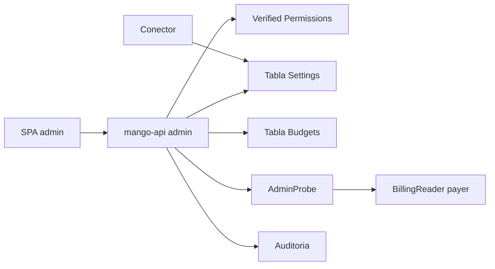

# Admin v0 (presupuestos, mapeo área↔OU, conectividad): modelo de amenazas (v0.1)

> Fecha: 2026-09-29 · Skill: `security-threat-model`. Spec: `docs/specs/mvp-finops.md` §7 (Admin v0).
> Contexto validado en `mango-architecture-threat-model.md`, `identity-propagation-threat-model.md` y `cost-explorer-connector-threat-model.md`.
> Alcance: API de administración en `mango-api`, tabla de configuración, lectura del mapeo en el conector, Lambda de chequeo de conectividad y pantallas de admin en `apps/web`.
> Son las **primeras operaciones de escritura** de Mango sobre su propia configuración.

## Executive summary

El riesgo dominante es de **integridad del aislamiento entre áreas**. El mapeo área↔OU decide qué cuentas ve cada líder de área (`connectors/cost-explorer/src/mango_cost_explorer/scope.py`, `resolve_scope`). Hoy solo se cambia por IaC (`infra/lib/constructs/tools.ts:108`, variable `BUSINESS_UNITS`). Al hacerlo editable, un admin comprometido o malicioso podría abrir a un área todas las OUs de la organización.

Controles acordados con el usuario:
- el mapeo exige **doble aprobación** (propone un admin y aprueba otro distinto);
- **nadie edita lo que le afecta**: ni su propio presupuesto ni el mapeo de su propia área;
- los límites de presupuesto los configuran los admins **directamente en la app**, sin techo en IaC (riesgo residual aceptado, ver TM-A3).

## Scope and assumptions

- **Admins:** usuarios del grupo de Cognito `mango-admin`. El claim `mango_admin` lo pone el pre-token (`functions/pre-token`) y solo IaC gestiona los grupos (D14).
- **Autorización L1:** Verified Permissions con deny por defecto (`policies/cedar/platform/`). Hoy existe `ViewAudit`; se agregan acciones de admin.
- **Exposición:** la API se consume desde la SPA por CloudFront + WAF con bearer token en memoria. No hay cookies de sesión, así que CSRF no aplica.
- **Diseño que asume este modelo (a implementar):**
  - Tabla DynamoDB `Mango-<ns>-Settings` (KMS, PITR, `RETAIN` fuera del laboratorio) con:
    - límites de presupuesto por usuario y por agente;
    - el mapeo vigente, versionado;
    - solicitudes de cambio del mapeo.
  - Semilla desde la configuración del IaC la primera vez (put-if-absent). Después manda la tabla.
  - **Excepción aceptada a "solo `mango-api` escribe en `Settings`"** (revisión ADM-07, 2026-09-29): los custom resources de semilla del IaC también escriben, con estas limitaciones:
    - solo `PutItem` sobre su propia partición (`BUDGETS` o `BU_MAPPING`, por `dynamodb:LeadingKeys`);
    - siempre con `attribute_not_exists(PK)`, así que nunca sobrescriben lo editado en la app. IAM no puede forzar esa condición: va en la llamada;
    - KMS solo vía DynamoDB (`kms:ViaService`);
    - el rol es el del proveedor singleton de CDK y solo lo invoca CloudFormation.
  - El conector lee el mapeo desde la tabla con caché corta (≤ 5 min) y **fail-closed**: sin mapeo válido, los `bu-lead` no ven cuentas.
  - Lambda `Mango-<ns>-AdminProbe`, de solo lectura, invocada por `mango-api` con IAM:
    - asume `BillingBroker → BillingReader` con `SourceIdentity = sub del admin`;
    - lista el árbol de OUs para validar el mapeo;
    - hace el chequeo de conectividad con APIs gratuitas.
- **Fuera de alcance:** alta y baja de usuarios o grupos (siguen en IaC), HITL de tools de escritura y catálogo de agentes.

## System model

### Primary components
- SPA admin (`apps/web`): páginas de Presupuestos y Configuración.
- `mango-api`: endpoints `/api/admin/*`.
- Verified Permissions.
- Tabla `Settings` y tabla `Budgets` (existente, `apps/api/src/mango_api/budget.py`).
- Conector Cost Explorer (lector del mapeo).
- Lambda AdminProbe.
- Rol `BillingReader` en la payer.
- Auditoría (Firehose → S3 con Object Lock).

### Data flows and trust boundaries
- **Navegador → mango-api:** access token validado (`mango_core.identity`), autorización AVP por acción, cuerpo validado con Pydantic (`extra="forbid"`).
- **mango-api → Settings/Budgets:** escrituras con condición de versión (bloqueo optimista). La transacción aplica el mapeo y cierra la solicitud juntos.
- **mango-api → AdminProbe (IAM `lambda:InvokeFunction`):** la payload lleva solo el `sub` del admin, tomado del token verificado.
- **AdminProbe → payer:** role chaining con `SourceIdentity` y session policy de solo lectura.
- **Conector → Settings:** solo lectura del ítem del mapeo (`GetItem` sobre una clave concreta).
- **mango-api → auditoría:** cada escritura emite un evento con antes, después, autor y aprobador.

#### Diagram

## Assets and security objectives

| Asset | Why it matters | Security objective (C/I/A) |
|---|---|---|
| Mapeo área↔OU | Define el aislamiento de datos entre áreas (TM-003) | I |
| Límites de presupuesto | Contienen el gasto en modelos y en Cost Explorer | I, A |
| Solicitudes de cambio y aprobaciones | Prueban quién propuso y quién aprobó | I (no repudio) |
| Estructura de la organización (OUs, cuentas) | Reconocimiento | C |
| Auditoría | Evidencia de cambios | I |

## Attacker model

### Capabilities
- Usuario autenticado sin rol de admin que llama `/api/admin/*` a mano.
- Admin malicioso o con sesión robada (un solo admin).
- Admin que también es líder de área e intenta ampliar su propia visibilidad.
- Condiciones de carrera: dos admins editando a la vez, o aprobaciones de propuestas ya obsoletas.

### Non-capabilities
- Modificar grupos de Cognito o el IaC (fuera de la app).
- Dos admins distintos coludidos: está fuera del modelo; la auditoría permite detectarlo después.

## Entry points and attack surfaces

| Surface | How reached | Trust boundary | Notes |
|---|---|---|---|
| `GET /api/admin/budgets` | SPA | Internet → API | Límites y gasto por usuario y por agente |
| `PUT /api/admin/budgets/{scope}` | SPA | Internet → API | Cambia un límite; aplica al instante |
| `GET /api/admin/business-units` | SPA | Internet → API | Mapeo vigente, versión y solicitudes pendientes |
| `POST /api/admin/business-units/changes` | SPA | Internet → API | Propone un cambio del mapeo |
| `POST /api/admin/business-units/changes/{id}/approve` · `/reject` | SPA | Internet → API | Aprueba o rechaza (otro admin) |
| `GET /api/admin/organization` | SPA | API → AdminProbe → payer | Árbol de OUs para validar |
| `POST /api/admin/connectivity-check` | SPA | API → AdminProbe → payer | Solo lectura |
| Lectura del mapeo en el conector | Invocación del Gateway | Conector → Settings | Caché ≤ 5 min |

## Top abuse paths

1. Un admin (o una sesión robada) propone y aprueba **él mismo** un mapeo que da a su área todas las OUs, y un `bu-lead` ve toda la organización.
2. Un usuario sin rol de admin llama los endpoints de admin directamente.
3. Un admin sube su propio presupuesto, o el del agente, para gastar sin límite.
4. Se aprueba una propuesta hecha sobre una versión vieja del mapeo y pisa un cambio posterior.
5. Un ítem del mapeo corrupto o manipulado hace que el conector abra alcance de más.
6. Se usa el chequeo de conectividad en bucle para generar costo o ruido en la payer.

## Threat model table

| Threat ID | Threat source | Prerequisites | Threat action | Impact | Impacted assets | Existing controls (evidence) | Gaps | Recommended mitigations | Detection ideas | Likelihood | Impact severity | Priority |
|---|---|---|---|---|---|---|---|---|---|---|---|---|
| TM-A1 | Admin malicioso o sesión robada | Rol `mango-admin` | Ampliar el mapeo de un área (incluida la propia) | Fuga de costos entre áreas | Mapeo | Hoy solo IaC (`tools.ts:108`) | La edición en app no existe | **Doble aprobación**: propuesta y aprobación en acciones AVP distintas (`ProposeBusinessUnits`, `ApproveBusinessUnits`), y el servidor exige `approver ≠ proposer`. Un admin no puede proponer ni aprobar cambios de un área a la que pertenece (`mango_business_unit`). Diff visible (antes/después). Expiración de propuestas: 7 días | Auditoría `settings.bu_mapping.proposed/approved/rejected` con los dos `sub`; alerta si se aprueba un cambio que agrega más de N OUs | medium | high | **high** |
| TM-A2 | Usuario autenticado no admin | Token válido | Llamar `/api/admin/*` | Escalada | Todos | AVP deny por defecto; `ViewAudit` requiere `isAdmin` (`view-audit.cedar`) | Acciones nuevas | Una acción Cedar por operación y dependencia de autorización declarada en **cada** endpoint (regla de AGENTS). Tests de 403 para cada endpoint con un usuario no admin | Métrica de 403 en `/api/admin/*` | medium | high | **high** |
| TM-A3 | Admin malicioso | Rol admin | Subir el presupuesto propio o del agente | Gasto no controlado | Presupuestos | Reserva preventiva (`budget.py`) | Sin techo (decisión del usuario) | Prohibido editar el propio presupuesto (`scope == USER#` → 403). El presupuesto del agente se trata como el de todos y queda auditado. Validación de rango (0 < límite ≤ 1 000 000, contra errores de tipeo). **Riesgo residual aceptado:** sin techo, un admin puede subir el límite de otro usuario, el del agente o el límite por defecto (que también le aplica a él si no tiene uno propio) | Auditoría con antes/después; alerta en CloudWatch si un límite crece más de 10× | medium | medium | **medium** |
| TM-A4 | Dos admins | Edición simultánea | Pérdida de actualización | Estado inconsistente | Presupuestos, mapeo | — | — | Bloqueo optimista con `version` en cada ítem (condición en DynamoDB). Si cambió, la API responde 409 y la UI recarga | 409 en logs | medium | low | low |
| TM-A5 | Admin | Propuesta vieja | Aprobar sobre una base obsoleta (TOCTOU) | Revertir un cambio sin querer | Mapeo | — | — | La propuesta guarda `base_version`. La aprobación aplica en una transacción con condición `version = base_version` y, si no coincide, se rechaza (409) | Auditoría | low | medium | low |
| TM-A6 | Dato corrupto o manipulado en la tabla | Escritura fuera de la API | El conector abre alcance | Fuga entre áreas | Mapeo | Validación de nombres de área y OUs en el IaC (`schema.ts`) | La tabla es un canal nuevo | El conector valida el esquema (regex de área y de OU, tamaños) y hace **fail-closed**. Solo el rol de `mango-api` escribe el mapeo y el resto de la configuración de administración; el conector solo tiene `GetItem` sobre la clave del mapeo. **Ajuste (2026-10-01, D43):** la tabla tiene un segundo escritor, el provisioner de packs, acotado por IAM a las particiones `MCP#*` (estado de la habilitación, lista cerrada de atributos) y `MCP_INSTALLED#*`; no puede escribir ni leer `BU_MAPPING` ni ninguna otra partición (test de infra `admin.test.ts` y comprobación en el laboratorio) | Error `mapping_invalid` en el conector | low | high | medium |
| TM-A7 | Admin o bucle de la UI | Rol admin | Llamar la conectividad o el árbol en bucle | Costo o ruido | Payer | — | — | AdminProbe solo usa APIs gratuitas (`sts:GetCallerIdentity`, `organizations:ListRoots`/`ListOrganizationalUnitsForParent`). Límite de 5 por minuto por admin en la API. Resultado cacheado 1 min | CloudTrail de la payer con `SourceIdentity` | low | low | low |
| TM-A8 | Contenido de la organización | Nombres de OU o de cuenta | Inyectar HTML o script en la UI de admin | XSS | Sesión de admin | La SPA renderiza como texto (revisión de seguridad del 2026-09-29) | Pantallas nuevas | Todo como texto React; sin `dangerouslySetInnerHTML`; tests con payloads | — | low | high | low |
| TM-A9 | Admin | Cambios sin rastro | Negar haber hecho un cambio | Repudio | Auditoría | Auditoría a S3 con Object Lock (`governance.ts`) | Eventos nuevos | Cada escritura emite un evento con antes/después, `sub` del autor, aprobador e ID de solicitud. **Auditoría fail-closed** (revisión ADM-01, 2026-09-29), en tres pasos: (1) evento `outcome: "requested"` **antes** de escribir; si no se puede registrar, no se escribe y la API responde 503 `audit_unavailable`; (2) si la escritura falla (409, etc.), evento `outcome: "rejected"` con el código de error; (3) si se aplica, evento `outcome: "applied"`. Un fallo en (2) o (3) solo se registra en logs: el `requested` inmutable ya existe. Se eligió esto frente a un outbox transaccional (DynamoDB Streams) por simplicidad en la PoC. El visor de auditoría lo muestra | Revisión periódica; `requested` sin `applied`/`rejected` indica un fallo a revisar | low | medium | low |

## Criticality calibration
- **High:** romper el aislamiento entre áreas (TM-A1) o usar la API de admin sin ser admin (TM-A2).
- **Medium:** gasto no contenido (TM-A3); apertura de alcance por datos corruptos (TM-A6).
- **Low:** carreras, costo de la conectividad, XSS en admin (mitigado por el render como texto) y repudio.

## Focus paths for security review

| Path | Why it matters | Related Threat IDs |
|---|---|---|
| `apps/api/src/mango_api/admin*.py` (nuevo) | Autorización por acción, propuesto ≠ aprobador, no auto-edición | TM-A1, TM-A2, TM-A3 |
| `policies/cedar/platform/*.cedar` | Acciones de admin nuevas | TM-A2 |
| `connectors/cost-explorer/src/mango_cost_explorer/handler.py` | Lectura del mapeo, fail-closed | TM-A6 |
| `infra/lib/constructs/governance.ts` / tabla `Settings` | IAM de escritura solo para mango-api; el provisioner de packs, solo `MCP#*` y `MCP_INSTALLED#*` (D43, `pack-provisioner.ts`) | TM-A6 |
| `functions/admin-probe/` (nuevo) | Solo lectura, `SourceIdentity` | TM-A7 |
| `apps/web/src/pages/Admin*` (nuevo) | Render como texto | TM-A8 |

## Supuestos validados con el usuario (2026-09-29)
- Mapeo área↔OU: **doble aprobación**.
- Límites de presupuesto: **configurables por admins en la app, sin techo en IaC**.
- **Nadie edita lo que le afecta:** ni su propio presupuesto ni el mapeo de su área.
