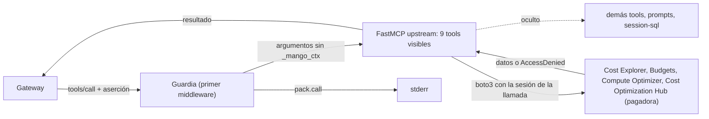

# Pack AWS Billing and Cost Management: modelo de amenazas (v0.2)

> Fecha: 2026-10-01 (v0.2 el mismo día, con C3b: más acciones de lectura en el rol detrás del broker y nueve tools) · Skill: `security-threat-model`; el diff de IAM de C3b se revisó con `security-audit` (modo guía). Plan: `docs/specs/marketplace-v1-plan.md` (C3, C3b). Decisiones: D10, D16, D19, D33, D35, D36, D37, D43, D47, D49.
> Amplía `pack-identity-threat-model.md` (que dejó fuera «el pack de Billing en sí: sus tools, sus argumentos y las acciones que necesita en la pagadora») y `mcp-pack-pipeline-threat-model.md`.
> Alcance: `packs/aws-billing/` (manifiesto, lock, punto de entrada y snapshot), `packages/py/mango-pack-runtime/src/mango_pack_runtime/fastmcp_server.py` (adaptador para servidores hechos con `fastmcp`) y el código upstream que el pack sirve (`awslabs.billing-cost-management-mcp-server` 0.0.38: `server.py`, `tools/cost_explorer_*`, `tools/cost_anomaly_tools.py`, `tools/sp_performance_tools.py`, `tools/ri_performance_tools.py`, `tools/cost_comparison_tools.py`, `tools/budget_tools.py`, `tools/compute_optimizer_tools.py`, `tools/cost_optimization_hub_*`, `utilities/`). Desde C3b también el permiso del rol `Mango-<ns>-BillingReader` (`infra/lib/stacks/payer-stack.ts`).
> Comprobado en local: tests con la librería `fastmcp` real y la firma real de botocore; el servidor upstream real, arrancado por el punto de entrada del pack contra un AWS falso; y el zip construido, en el contenedor sin red del pipeline. La revisión `0.0.38-2` (tres tools) está probada en el laboratorio de punta a punta. **La revisión `0.0.38-3` (C3b) no está desplegada**: lo que falta ver está en «Supuestos sin validar».
> Actualizado el 2026-10-02 (R6): los Runtimes de packs ya no usan la red `PUBLIC`. Corren en una VPC sin salida a internet y solo alcanzan los endpoints de VPC que declara su manifiesto firmado; el bloqueo de D49 (7) se retiró. Aplica a TM-BL9. Ver `pack-egress-threat-model.md`. Lo que este documento dice sobre la red `PUBLIC` describe el estado anterior.

## Executive summary

El pack sirve nueve tools de solo lectura sobre la cuenta pagadora a usuarios centrales: Cost Explorer (`cost-explorer`, `cost-anomaly`, `sp-performance`, `ri-performance`, `cost-comparison`), AWS Budgets (`budgets`, `budget-notifications`), Compute Optimizer (`compute-optimizer`) y Cost Optimization Hub (`cost-optimization`). La identidad, las tres capas de «solo centrales» y las credenciales por llamada son las de `pack-identity-threat-model.md`. Lo propio de este pack:

1. **El servidor upstream guarda datos entre llamadas.** Respuestas de más de 25 KB pasan a un SQLite del proceso, que la tool `session-sql` lee después. En un Runtime compartido, un usuario leería lo que consultó otro.
2. **El servidor upstream escribe lo que recibe en sus logs**: argumentos, errores de AWS y, en los tracebacks, los valores de las variables locales (D16). `fastmcp` además copia al log todo mensaje que una tool envía al cliente.
3. **Tools con operaciones que no son de lectura** o que salen de Cost Explorer (Athena, S3, generación de recomendaciones).
4. **Otra librería MCP** (`fastmcp`, no el SDK oficial): la guardia de C2 no aplicaba tal cual, y un servidor montado sobre otro podría saltársela.
5. **Costo:** cada petición a la API de Cost Explorer se cobra (USD 0,01), y la paginación la controla el modelo.
6. **El rol detrás del broker crece (C3b).** `Mango-<ns>-BillingReader` pasa de 6 a 37 acciones de datos, todas de lectura: 29 de facturación y 8 de **inventario de la cuenta pagadora** (EC2, Auto Scaling, RDS, ECS y la concurrencia aprovisionada de Lambda), que Compute Optimizer exige para devolver sus recomendaciones. `lambda:ListFunctions`, que también exige, se dejó fuera porque devuelve variables de entorno (TM-BL11). Ese rol lo comparten el pack, el conector de Cost Explorer (`per_user`) y la sonda de administración.
7. **Argumentos que eligen dónde se lee (C3b):** `compute-optimizer` acepta `region`, y las dos tools de Budgets aceptan `account_id`.
8. **Servicios con inscripción (C3b):** Compute Optimizer y Cost Optimization Hub solo responden si alguien los activó en la pagadora. Mango no los activa.

Controles construidos:

- **Lista cerrada de tools por visibilidad** (`restrict_tools`): todo lo que no está en el manifiesto queda oculto y no se puede llamar; prompts y recursos tampoco se sirven. El arranque falla si el resultado no es exactamente el manifiesto.
- **La guardia es el primer middleware** de `fastmcp`: corre antes que cualquier otro código del servidor, también para tools de servidores montados.
- **Sin base de datos de sesión:** el umbral se fija por encima de cualquier respuesta y el arranque falla si upstream deja de respetarlo. `session-sql` no se sirve.
- **Sin logs de upstream:** se quitan todos sus destinos de log y el logger de `fastmcp` que copia los mensajes al cliente. Solo queda el registro `pack.call` (quién, qué tool, resultado).
- **36 acciones exactas de lectura** como tope de cada sesión (15 `ce:Get*`, 8 `compute-optimizer:Get*`, 4 `cost-optimization-hub:List*`/`Get*`, `budgets:ViewBudget` y 8 de inventario que pide Compute Optimizer), todas concedidas al rol detrás del broker. Cada una existe en la referencia de servicios de IAM y ninguna es de escritura, de permisos ni de etiquetado. Sin comodines y sin cambios de trust.
- **El permiso de los demás usuarios del rol no crece:** el conector de Cost Explorer y la sonda asumen el rol con una session policy propia por llamada, que no cambia (TM-BL11).

## Scope and assumptions

- **Dentro:** qué tools se sirven y con qué argumentos; qué hace el servidor upstream con los datos dentro del proceso; el adaptador de `fastmcp`; qué acciones pide el manifiesto.
- **Fuera:** la identidad y el camino Gateway → interceptor → pack → broker (`pack-identity-threat-model.md`); el pipeline de build y firma (`mcp-pack-pipeline-threat-model.md`); el provisioner (`mcp-pack-provisioner-threat-model.md`); las cuentas miembro (C4).
- **Supuestos:**
  1. Valen los de `pack-identity-threat-model.md`. En particular: el código del pack es de confianza para la atribución, y el Runtime usa la red `PUBLIC`, admitida solo en instalaciones `lab` (D49).
  2. Un usuario central puede ver los costos de toda la organización (D35). Entre dos usuarios centrales no hay nada que aislar salvo la atribución.
  3. El entorno del Runtime es la lista cerrada del provisioner (`MANGO_PACK_*`). El punto de entrada borra además las variables que upstream y `fastmcp` leen (`FASTMCP_*`, `MCP_*`, `BCM_MCP_*`, `STORAGE_LENS_*`, `AWS_PROFILE`).
  4. Los nombres de etiquetas, categorías de costo, cuentas y monitores de anomalías los eligen personas de cualquier área de la organización.
- **Preguntas abiertas:**
  1. Resuelta (decisión del usuario, 2026-10-01): **sí**, con acciones de solo lectura y más tools (C3b). Las acciones de otros servicios que Compute Optimizer exige además de la suya se añadieron por una segunda decisión del mismo día (TM-BL11, TM-BL13).
  2. Resuelta en el laboratorio (2026-10-01): **no.** El Gateway valida los argumentos contra el esquema que listó el target, después del interceptor, y rechazaba `_mango_ctx` porque `fastmcp` lista esquemas cerrados (`additionalProperties: false`). Desde la revisión `0.0.38-2` el pack lista sus esquemas sin esa palabra clave (`open_schemas`); el servidor sigue validando los argumentos de la tool después de que la guardia quita `_mango_ctx` (ver TM-BL10).
  3. ¿Entra el costo de la API de Cost Explorer en algún presupuesto? Hoy no (igual que el costo del Runtime de un pack: observación O3 de B6).

## System model

### Primary components
- **`packs/aws-billing/entrypoint.py`**: limpia el entorno, carga `mango_pack_runtime` antes de importar upstream, quita los logs de upstream, comprueba que no hay base de datos de sesión, llama al `setup()` de upstream y sirve.
- **`mango_pack_runtime.fastmcp_server`**: `restrict_tools` (lista cerrada), `GuardMiddleware` (la guardia de C2 como primer middleware), `log_calls` y el arranque en HTTP sin estado (`0.0.0.0:8000/mcp`).
- **Servidor upstream**: un `FastMCP` principal con 28 servidores montados (uno por familia de tools), dos prompts y un middleware propio (`ErrorSignalingMiddleware`).
- **Manifiesto firmado**: nueve tools `read`, 36 acciones en cuatro sentencias (Cost Explorer, los dos servicios de recomendaciones y el inventario que pide Compute Optimizer sobre `*`; Budgets sobre `arn:aws:budgets::*:budget/*`), `account_data` / `central_only`.
- **`Mango-<ns>-BillingReader`** (stack de la pagadora): las mismas acciones más `ce:GetSavingsPlansPurchaseRecommendation` (del conector) y el inventario de Organizations. Desde C3b lee también inventario de la pagadora (TM-BL11). Budgets, limitado a los presupuestos de la propia pagadora.

### Data flows and trust boundaries
- **Gateway → Runtime:** `tools/call` con `_mango_ctx.identity` (aserción). SigV4 del rol del Gateway.
- **Guardia → resto del servidor:** argumentos sin `_mango_ctx`. Antes de la guardia no corre ningún middleware ni validación de upstream.
- **Tool → Cost Explorer, Budgets, Compute Optimizer y Cost Optimization Hub (pagadora):** boto3 firma con la sesión de la llamada (`SourceIdentity` = usuario, session policy = las 36 acciones). Ninguna tool llama a EC2, Lambda, RDS, ECS ni Auto Scaling: esas acciones solo las comprueba Compute Optimizer. Todo en `us-east-1`, salvo Compute Optimizer, que va a la región que pida el modelo. Las tools de Budgets llaman antes a `sts:GetCallerIdentity`, con la misma sesión, para saber la cuenta. Los argumentos del modelo (`filter`, `group_by`, `metrics`, fechas, `billing_view_arn`, `next_token`, `max_pages`) llegan a la API tras `json.loads` y la validación de botocore.
- **Tool → modelo:** la respuesta de Cost Explorer completa, o el error de AWS (`full_error`, `full_response`).
- **Proceso → stderr (CloudWatch Logs):** solo `pack.call` y los avisos de `fastmcp` y `uvicorn`, sin argumentos.

#### Diagram

## Assets and security objectives

| Activo | Por qué importa | Objetivo |
|---|---|---|
| Datos de costos de la organización | Solo centrales; nunca en logs ni en disco | C |
| Presupuestos de la pagadora y recomendaciones de optimización (ids y ARN de recursos de las cuentas, su configuración y su uso) | Solo centrales (C3b) | C |
| Atribución en CloudTrail de la pagadora | Quién leyó qué | I |
| Estado de la cuenta pagadora | El pack es de solo lectura (D43) | I |
| Logs operativos del Runtime | No deben llevar argumentos ni datos (D16) | C |
| Gasto en la API de Cost Explorer y en el Runtime | Sin presupuesto que lo limite | A |
| Contexto del modelo | Recibe texto que escriben otras áreas | I |

## Attacker model

### Capabilities
- **Modelo o contenido inyectado:** controla todos los argumentos de las nueve tools.
- **Persona de cualquier área:** pone texto en nombres de etiquetas, categorías de costo o cuentas que luego aparecen en las respuestas.
- **Usuario central curioso:** puede llamar las nueve tools con cualquier argumento, a través de un agente que las tenga.
- **Versión upstream nueva** que añade tools, cambia el almacenamiento o los logs.

### Non-capabilities
- Nadie llama una tool sin aserción firmada (`pack-identity-threat-model.md`).
- El modelo no elige perfil, endpoint ni rutas de archivos: ninguna de las nueve tools los acepta, y el entorno no los trae. Sí elige la **región** de `compute-optimizer` y el **`account_id`** de las tools de Budgets (TM-BL12).
- La sesión no puede hacer nada fuera de las 36 acciones del manifiesto, aunque el rol detrás del broker tenga más. Ninguna crea, cambia ni arranca nada.

## Entry points and attack surfaces

| Superficie | Cómo se llega | Frontera | Notas | Evidencia |
|---|---|---|---|---|
| `tools/call` de las nueve tools | Gateway | Gateway → guardia | Guardia antes que todo | `fastmcp_server.py` `GuardMiddleware`, `bind` |
| `tools/call` de una tool oculta | Invocación directa del Runtime | Runtime → upstream | Rechazada por la guardia y por la visibilidad | `restrict_tools`; `test_a_hidden_tool_cannot_be_called_even_without_the_guard` |
| `prompts/*`, `resources/*` | Invocación directa del Runtime | Runtime → upstream | Ocultos; el arranque falla si queda alguno | `restrict_tools`; `test_prompts_and_resources_are_not_served` |
| Argumentos `filter`, `group_by`, `metrics` (JSON en texto) | Modelo | Tool → Cost Explorer | `json.loads` y validación de la API | upstream `aws_service_base.parse_json` |
| `max_pages`, `next_token` | Modelo | Tool → Cost Explorer | Sin tope propio | upstream `cost_explorer_operations.py` |
| `billing_view_arn` (`cost-explorer`, `cost-comparison`) | Modelo | Tool → Cost Explorer | La sesión no tiene permisos sobre vistas de facturación | manifiesto |
| `region` (`compute-optimizer`) | Modelo | Tool → Compute Optimizer | botocore solo acepta un nombre de host válido y lo usa como parte de un dominio de AWS | upstream `create_aws_client`; TM-BL12 |
| `account_id` (`budgets`, `budget-notifications`) | Modelo | Tool → Budgets | El rol solo lee presupuestos de la pagadora | `payer-stack.ts` `BudgetsRead`; TM-BL12 |
| `account_ids`, `filters` (`compute-optimizer`, `cost-optimization`) | Modelo | Tool → servicio | Filtros dentro de la organización, que un central ya ve entera | — |
| Variables de entorno | Provisioner | Stack → pack | Lista cerrada, y limpieza en el punto de entrada | `entrypoint.py` |
| Respuestas de Cost Explorer | API | AWS → modelo | Texto de otras áreas (inyección indirecta) | — |
| Logs del proceso | Código upstream y `fastmcp` | Proceso → CloudWatch | Destinos de upstream quitados; `to_client` descartado | `entrypoint.py`, `log_calls` |

## Top abuse paths

1. **Un central lee lo que consultó otro.** Respuesta grande → upstream la guarda en SQLite → otro usuario la pide con `session-sql`. Cerrado: el umbral nunca se alcanza, `session-sql` está oculta y el arranque falla si upstream cambia el mecanismo.
2. **Los costos acaban en los logs.** Upstream registra argumentos y errores con valores de variables; `fastmcp` copia cada `ctx.info`. Cerrado: sin destinos de log de upstream y sin el logger `to_client`.
3. **El modelo arranca un trabajo en la pagadora.** `sp-recommendation` y `sp-purchase-analyzer` tienen operaciones `Start*`. Cerrado dos veces: las tools no se sirven y la sesión no tiene esas acciones.
4. **El modelo consulta S3 o Athena.** `storage-lens` ejecuta consultas y escribe resultados en un bucket. No se sirve y la sesión no tiene acciones de S3 ni Athena.
5. **Saltarse la guardia por un servidor montado.** Las tools viven en servidores montados sobre el principal. La guardia está en el principal, que es el único que atiende la red, y es el primer middleware: la tool montada corre dentro de ella (test con la librería real).
6. **Texto de otra área como instrucción.** Un nombre de etiqueta o de categoría de costo con instrucciones llega al modelo dentro de la respuesta. Lo acota que las tools del pack son de lectura y que el agente pasa por el guardrail base; un agente que además tenga tools de escritura pide aprobación por llamada (D27).
7. **Paginación sin fin.** El modelo pide `max_pages` alto en consultas grandes: cada página cuesta USD 0,01 y la respuesta entera va al contexto. Lo acotan el límite de iteraciones y de tiempo del agente; no hay tope propio.
8. **Un llamador del broker comprometido lee más que antes (C3b).** Quien controle el rol del conector, el de la sonda o el de un pack puede asumir `BillingReader` con una session policy amplia: ahora alcanza también presupuestos, reservas, costos por recurso y recomendaciones. Sigue siendo solo lectura, con `SourceIdentity` obligatorio y dentro de la organización (TM-BL11).
9. **El modelo apunta `compute-optimizer` a otra región.** La petición va firmada con la sesión de la llamada a `compute-optimizer.<región>.amazonaws.com`. No puede salir de un dominio de AWS ni usar otra credencial; lee las recomendaciones de esa región, que el usuario central ya puede ver (TM-BL12).
10. **Una versión nueva de upstream añade una tool o un prompt.** La visibilidad es una lista de permitidos: lo nuevo nace oculto. Si cambia una tool permitida, cambia el `tools_hash` y el build falla hasta revisarlo.

## Threat model table

| ID | Origen | Requisitos | Acción | Impacto | Activos | Controles existentes (evidencia) | Brechas | Mitigaciones recomendadas | Detección | Prob. | Impacto | Prioridad |
|---|---|---|---|---|---|---|---|---|---|---|---|---|
| TM-BL1 | Usuario central | Proceso compartido entre llamadas | Leer con `session-sql` lo que otro guardó | Datos de una consulta ajena; atribución perdida (se lee sin llamar a AWS) | Datos, atribución | `MCP_SQL_THRESHOLD` = máximo y comprobación al arrancar (`entrypoint.py`); `session-sql` oculta (`restrict_tools`); el manifiesto no la lista | Las respuestas grandes van enteras al modelo | Si molesta, limitar `max_pages` por defecto en el prompt del agente | Arranque fallido: «upstream no longer honours MCP_SQL_THRESHOLD» | low | medium | **low** |
| TM-BL2 | Código upstream y `fastmcp` | Cualquier llamada | Escribir argumentos, errores de AWS o variables locales en el log | Datos de costos y filtros en logs operativos (D16) | Logs | `upstream_logger.remove()`; `FASTMCP_LOG_FILE` a `os.devnull`; filtro que descarta el logger `fastmcp.server.context.to_client` (`log_calls`, test `test_what_a_tool_tells_the_client_is_not_written_to_the_server_log`); `fastmcp` resume los errores de validación sin los valores | Sin logs de upstream, un error de AWS solo se ve en la respuesta de la tool | Aceptado. Si hace falta diagnóstico, registrar solo el código de error | Revisar el log group del Runtime en la prueba de laboratorio | low | medium | **low** |
| TM-BL3 | Modelo o inyección | Argumentos de la tool | Arrancar una generación de recomendaciones o un análisis de compra; consultar Athena o S3 | Cambios o gasto en la pagadora | Estado de la pagadora | Tools fuera del manifiesto y ocultas; session policy de 36 acciones de lectura, ninguna `Start*`, `Create*`, `Update*`, `Delete*`, `Put*` ni `Export*` (test `test_billing_pack_reads_account_data_only_as_the_caller`); rol detrás del broker de solo lectura, con un test que solo admite `Get*`, `List*`, `Describe*` y `budgets:ViewBudget` (`infra/test/packs.test.ts`) | — | — | CloudTrail de la pagadora: `AccessDenied` con `SourceIdentity` | low | medium | **low** |
| TM-BL4 | Invocación directa del Runtime | `InvokeAgentRuntime` | Llamar una tool oculta, un prompt o un recurso, o una tool por un servidor montado | Ejecutar código de upstream sin identidad | Datos | Guardia como primer middleware; lista de permitidos; arranque que falla si queda algo fuera del manifiesto (tests con `fastmcp` real: tools montadas, 48 llamadas concurrentes, rechazos) | La visibilidad depende de la API `enable(only=True)` de `fastmcp` | El test fija la versión de `fastmcp` del lock; repetirlo al actualizar el pack | `pack.call` con `outcome: rejected` | low | high | **low** |
| TM-BL5 | Persona de otra área | Poner texto en etiquetas, categorías o nombres (desde C3b también nombres de presupuestos, de recursos y de funciones que aparecen en las recomendaciones) | Inyección indirecta en el agente de un central | Respuestas manipuladas; uso de otras tools del agente | Contexto del modelo | Tools del pack de solo lectura; guardrail base; aprobación por llamada para tools de escritura (D27) | Mango no limpia las respuestas de un pack | Evaluar el guardrail sobre resultados de tools (fase D) | Auditoría de la conversación | medium | low | **low** |
| TM-BL6 | Modelo, inyección o usuario | Agente con las tools | Muchas llamadas o paginación larga | Gasto en Cost Explorer (USD 0,01 por petición) y en el Runtime; contexto desbordado | Gasto | `max_iterations` y `timeout_seconds` del agente; por defecto upstream pide una sola página | El costo de la API no entra en ningún presupuesto | Contarlo cuando se mida el costo de los packs (O3 de B6) | CloudTrail de la pagadora por `SourceIdentity`; métricas de uso del Runtime | medium | low | **low** |
| TM-BL7 | Modelo | Operación fuera de las acciones del manifiesto | — | Resuelta en C3b para las operaciones de las tools servidas: cada una tiene su acción. Lo que queda es TM-BL13. El mensaje de `AccessDenied` lleva el ARN del rol asumido y el id de la pagadora | Disponibilidad; dato interno de baja sensibilidad | Falla cerrado. El usuario es central y ya ve los ids de cuenta | — | — | `AccessDenied` en CloudTrail de la pagadora | low | low | **low** |
| TM-BL8 | Versión upstream nueva | Actualizar el pack | Añadir una tool, cambiar el almacenamiento o los logs | Cualquiera de TM-BL1 a TM-BL4 | Todos | Lista de permitidos; `tools_hash`; comprobación del umbral al arrancar; snapshot en contenedor de solo lectura (un intento de escribir junto al código falla); cuarentena y revisión del diff | Un cambio en cómo upstream registra logs no lo detecta ningún test | Al actualizar: revisar `utilities/logging_utils.py` y `sql_utils.py` de la versión nueva (está en `packs/README.md`) | Diff de `tools.snapshot.json` | low | medium | **low** |
| TM-BL9 | Pack malicioso o vulnerable | 86 paquetes fijados en el lock (Pricing: 54) | Exfiltrar lo leído; asumir el broker con otra identidad | Igual que TM-I6 | Datos, atribución | Los de TM-I6: hashes, cuarentena, firma, solo lectura, D49 | `fastmcp` trae más dependencias que el SDK oficial (cliente HTTP, `authlib`, `keyring`) | R6 antes de la primera instalación de un cliente | Igual que TM-I6 | low | high | **medium** |
| TM-BL10 | Modelo o inyección | Esquema listado sin `additionalProperties: false` (necesario para que el Gateway deje pasar `_mango_ctx`) | Enviar argumentos que la tool no declara | Que lleguen al código de la tool | Estado de la pagadora, datos | El Gateway ya no los rechaza, pero el servidor valida la llamada con el esquema propio de la tool, que sigue cerrado, después de que la guardia quita `_mango_ctx` (test `test_the_server_still_refuses_arguments_the_tool_does_not_declare`); el interceptor borra cualquier `_mango_ctx` del modelo; el Gateway sigue validando tipos y campos obligatorios | La validación de argumentos extra pasa del Gateway al pack | El build falla si un pack de datos de cuentas lista un esquema cerrado (`check_tools`), para que el fallo no llegue a una instalación | Errores de validación en la respuesta de la tool | low | low | **low** |

| TM-BL11 | Llamador del broker comprometido (rol del conector de Cost Explorer, de la sonda o de un pack; o código malicioso dentro de un pack) o un error en su código | Poder asumir el broker | Asumir `BillingReader` con una session policy más amplia que la suya | Lectura de todo lo que el rol permite. Desde C3b: (a) presupuestos, reservas, costos por recurso, valores de etiquetas y recomendaciones con ids de recursos de toda la organización; (b) **inventario de la cuenta pagadora**: instancias y volúmenes de EC2, grupos de Auto Scaling, bases de datos y clústeres de RDS, clústeres y servicios de ECS, con su configuración y sus etiquetas | Datos, atribución, inventario y configuración de la pagadora | Todas las acciones son de lectura y exactas, comprobadas contra la referencia de servicios de IAM; ninguna lee contenido de datos (objetos, logs, eventos). **`lambda:ListFunctions` no está, por decisión del usuario (2026-10-01):** es una de las acciones que Compute Optimizer pide, pero devuelve las variables de entorno de todas las funciones de Lambda de la pagadora, donde a veces hay secretos; un test impide añadirla (`infra/test/packs.test.ts`, `test_pack.py`). Trust del rol con `PrincipalArn` del broker, `PrincipalOrgID` y `SourceIdentity` obligatorio. Cada llamador pasa su session policy: el conector, la acción de la tool (`connectors/cost-explorer` `handler.py`, sin cambios); la sonda, dos acciones de Organizations; el pack, las de su manifiesto firmado. **Ninguna tool del pack llama a EC2, Lambda, RDS, ECS ni Auto Scaling**, y upstream solo crea clientes de una lista cerrada de servicios que no los incluye (`create_aws_client`): el modelo no tiene cómo pedir ese inventario. Budgets, limitado a la pagadora | **Un líder de área no gana nada:** el conector sigue pidiendo solo las seis acciones de antes y filtra por sus cuentas. Lo que crece es el daño posible de TM-C4 (`cost-explorer-connector-threat-model.md`) y de TM-BL9, y el tope de lo que un pack `central_only` firmado puede pedir (`PACK_BROKERED_ACTIONS`). El inventario es de la pagadora, no de las cuentas miembro. Las acciones de inventario van sobre `*`: listan todos los recursos de un tipo. **Efecto de quitar `lambda:ListFunctions`:** las recomendaciones de Lambda de Compute Optimizer (`get_lambda_function_recommendations`) pueden responder `AccessDenied` (TM-BL13) | Si se quiere separar: un rol propio para packs detrás del mismo broker, y dejar `BillingReader` con las seis acciones del conector. Antes de volver a añadir `lambda:ListFunctions` hace falta otra decisión | CloudTrail de la pagadora: `AssumeRole` sobre `BillingReader` sin session policy; llamadas a EC2, RDS, ECS o Auto Scaling hechas **por la sesión** (las que hace Compute Optimizer por su cuenta no vienen de ella) | low | medium | **low** |
| TM-BL12 | Modelo o inyección | Argumentos `region` (`compute-optimizer`) y `account_id` (Budgets) | Dirigir la llamada a otra región, a un host ajeno o a otra cuenta | Enviar una petición firmada fuera de AWS; leer otra cuenta | Credenciales de la sesión, datos | `region`: botocore (1.43.101, la del lock) rechaza todo lo que no sea un nombre de host (`InvalidRegionError` con puntos, barras, `@`, `#` o espacios) y lo usa como parte de un dominio de AWS; la credencial y la session policy son las mismas en cualquier región. `account_id`: el rol solo permite `budgets:ViewBudget` sobre los presupuestos de la pagadora, así que otra cuenta responde `AccessDenied`. Un argumento no declarado (`profile`, `endpoint`) lo rechaza el servidor (TM-BL10). Probado con el servidor real contra un AWS falso | La comprobación de `region` es de botocore, no de Mango | Al actualizar el pack, repetir la prueba de regiones hostiles con el botocore del lock nuevo (`packs/README.md`) | Errores de validación en la respuesta; región de la llamada en CloudTrail | low | low | **low** |
| TM-BL13 | — (disponibilidad) | Pagadora sin inscribir en Compute Optimizer o en Cost Optimization Hub; o que a Compute Optimizer le falte alguna acción de otro servicio | Llamar `compute-optimizer` o `cost-optimization` | La tool responde un error (no inscrito, o `AccessDenied`) | Disponibilidad | Falla cerrado. Mango no inscribe nada (decisión del 2026-10-01): el rol no tiene `UpdateEnrollmentStatus` ni ninguna otra escritura. En el laboratorio (2026-10-01) Compute Optimizer está `Inactive` y Cost Optimization Hub sin inscribir. Para devolver las recomendaciones de un tipo de recurso, Compute Optimizer comprueba además al llamador contra la acción que lista ese tipo de recurso; por decisión del usuario (2026-10-01) el rol y el manifiesto llevan ocho de las nueve que la referencia de IAM asocia a las operaciones que usa la tool: `ec2:DescribeInstances`, `ec2:DescribeVolumes`, `autoscaling:DescribeAutoScalingGroups`, `lambda:ListProvisionedConcurrencyConfigs`, `rds:DescribeDBInstances`, `rds:DescribeDBClusters`, `ecs:ListClusters`, `ecs:ListServices` (test en `infra/test/packs.test.ts`) | **Falta `lambda:ListFunctions`, a propósito** (TM-BL11): `get_lambda_function_recommendations` puede responder `AccessDenied`. **Sin verificar en AWS** que las otras ocho basten ni que todas hagan falta: el servicio no está activo en el laboratorio. La política gestionada `ComputeOptimizerReadOnlyAccess` trae además `autoscaling:DescribeAutoScalingInstances`, `cloudwatch:GetMetricData` y lecturas de Organizations, que la referencia de IAM no asocia a estas operaciones y no se añadieron. El costo de las ocho está en TM-BL11 | Cuando el servicio esté activo: probar las siete operaciones y quitar las acciones que no hagan falta | Respuesta de la tool; `AccessDenied` en CloudTrail de la pagadora | medium | low | **low** |

## Criticality calibration

- **High:** nada con los controles construidos.
- **Medium:** TM-BL9, que es TM-I6 con una superficie de dependencias mayor. No cambia la decisión D49.
- **Low:** el resto. TM-BL11 estuvo en medio mientras el rol tuvo `lambda:ListFunctions` (variables de entorno de las Lambdas de la pagadora); al quitarla vuelve a bajo: queda inventario y configuración de la pagadora, sin secretos ni contenido de datos, y ningún usuario ni el modelo llegan a él por las tools.
- Lo que más pesa: el supuesto 2 (entre centrales no hay datos que aislar) baja TM-BL1 de alto a bajo; sin él, la base de datos de sesión sería una fuga entre áreas.

## Focus paths for security review

| Ruta | Qué mirar | Amenazas |
|---|---|---|
| `packs/aws-billing/entrypoint.py` | El orden: entorno, `load()`, import de upstream, logs, umbral, `setup()`, `serve` | TM-BL1, TM-BL2 |
| `packs/aws-billing/manifest.yaml` | Tools y acciones; lo que queda fuera y por qué | TM-BL3, TM-BL12, TM-BL13 |
| `infra/lib/stacks/payer-stack.ts` | Las acciones del rol detrás del broker: exactas, de lectura, y Budgets solo sobre la pagadora | TM-BL11 |
| `packages/py/mango-pack-runtime/src/mango_pack_runtime/fastmcp_server.py` | Guardia primero; lista de permitidos; qué se registra | TM-BL2, TM-BL4 |
| `packages/py/mango-pack-runtime/tests/test_fastmcp_server.py` | Que el servidor de prueba siga pareciéndose a upstream (tools montadas, middleware propio, `ctx.info`) | TM-BL4 |
| `packs/aws-billing/tools.snapshot.json` | Lo que lee el modelo, y qué argumentos acepta cada tool | TM-BL8, TM-BL12 |

## Supuestos sin validar con el usuario

La skill pide validar los supuestos antes de cerrar el modelo. Este encargo se ejecutó sin pausas, así que quedan como preguntas:

1. **Ampliar las acciones del rol detrás del broker** (pregunta 1): decidido el 2026-10-01 y hecho en C3b. Las acciones de inventario que pide Compute Optimizer se añadieron por decisión del usuario (2026-10-01), salvo `lambda:ListFunctions`; también decidió no inscribir los servicios. Queda por decidir si `budget-actions`, `rec-details` y `sp-explorer` se sirven (son de lectura, pero piden acciones que no estaban en la decisión).
2. **Sin verificar en AWS:** el camino completo con la aserción real del interceptor hasta Cost Explorer (lo comprobado con un target temporal es que el Gateway reenvía un argumento no declarado cuando el esquema es abierto, y que la guardia responde); que el Runtime acepte nombres de tools con guion (`cost-explorer`) de punta a punta (Gateway, Cedar y harness); que Cost Explorer deje en CloudTrail de la pagadora el `SourceIdentity` en la llamada de datos, además de en los `AssumeRole`.
   De C3b, sin desplegar: las seis tools nuevas contra la pagadora real; que `sts:GetCallerIdentity` y Budgets respondan con la session policy del pack; el tamaño empaquetado de la session policy con los tags de la sesión (medido solo el de la policy, con un `AssumeRole` de prueba: 36 % del límite con 37 acciones; hoy son 36 y 1 460 caracteres); y `compute-optimizer` y `cost-optimization` con el servicio inscrito.
3. **Sin logs de upstream** (TM-BL2): se prefirió no registrar nada a registrar errores que pueden repetir argumentos.
4. **Tools con una operación `Start*` quedan fuera enteras** (`sp-recommendation`, `sp-purchase-analyzer`), aunque la sesión no podría ejecutarla. Alternativa: servirlas y dejar que IAM deniegue esa operación.
