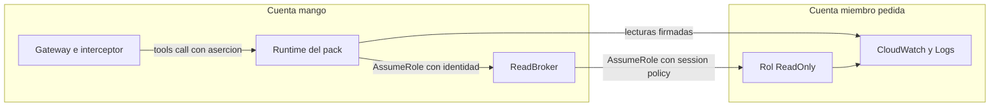

# Pack AWS CloudWatch sobre cuentas miembro: modelo de amenazas (v0.1)

> Fecha: 2026-10-02 · Skill: `security-threat-model`; el diff de IAM y de trusts se revisó con `security-audit` (modo guía). Plan: `docs/specs/marketplace-v1-plan.md` (C4, brechas 22 y 26). Decisiones: D10, D16, D19, D36, D37, D43, D49, D50, D51.
> Amplía `member-access-threat-model.md` (que dejó fuera «los packs que usarán la cadena») y `pack-identity-threat-model.md` (una sola cadena por instalación, D49 (5)).
> Alcance: el campo `identity.chain` del manifiesto firmado (`packages/py/mango-packs/src/mango_packs/manifest.py`), el camino `member` del punto de entrada común (`packages/py/mango-pack-runtime/`), el trust de `Mango-<ns>-ReadBroker` (`infra/lib/constructs/member-access.ts`), las acciones de `Mango-<ns>-ReadOnly` (`infra/lib/stacks/member-stack.ts`), lo que el provisioner de packs entrega a un pack de esta cadena (`functions/provisioner/src/mango_provisioner/packs/`), el pack `packs/aws-cloudwatch/` y el código upstream que sirve (`awslabs.cloudwatch-mcp-server` 0.3.1: `server.py`, `aws_common.py`, `cloudwatch_metrics/tools.py`, `cloudwatch_alarms/tools.py` y `describe_log_groups` de `cloudwatch_logs/tools.py`).
> Comprobado en local: tests con el SDK de MCP real y STS simulado; el servidor upstream real, arrancado por el punto de entrada del pack contra un AWS falso (cadena completa, rechazos y logs); el zip construido, en el contenedor sin red del pipeline; y los tests de infra sobre las plantillas sintetizadas. **Nada está desplegado:** lo que falta ver en el laboratorio está en «Supuestos sin validar».
> Actualizado el 2026-10-02 (R6): los Runtimes de packs ya no usan la red `PUBLIC`. Corren en una VPC sin salida a internet y solo alcanzan los endpoints de VPC que declara su manifiesto firmado; el bloqueo de D49 (7) se retiró. El pack solo lee la región de la instalación: otra región se rechaza antes de asumir la sesión (usuario, 2026-10-02), lo que acota TM-CW4. Ver `pack-egress-threat-model.md`. Lo que este documento dice sobre la red `PUBLIC` describe el estado anterior.

## Executive summary

Es el primer pack que lee **dentro de las cuentas miembro**. Sirve siete tools de solo lectura (métricas, alarmas y metadatos de log groups) a usuarios centrales, por la cadena `rol del pack → Mango-<ns>-ReadBroker → Mango-<ns>-ReadOnly` de la cuenta que pide la llamada. La identidad (aserción firmada, tres capas de «solo centrales», credenciales por llamada) es la de `pack-identity-threat-model.md`. Lo propio de este pack:

1. **El destino lo elige el modelo en cada llamada.** Con Billing la cuenta era una sola y venía de la plantilla. Aquí llega como argumento (`account_id`) y decide qué rol se asume.
2. **El rol spoke deja de estar vacío.** `Mango-<ns>-ReadOnly` recibe cinco acciones en *todas* las cuentas objetivo, también las futuras. Es el tope de cualquier principal que el trust del broker nombre (TM-O1).
3. **Un pack de terceros entra en el trust de `ReadBroker`.** Hasta hoy solo lo usaba la sonda de administración.
4. **Argumentos que upstream interpreta por su cuenta:** `profile_name` (otras credenciales), `region` (otro endpoint) y, en `describe_log_groups`, `account_identifiers` e `include_linked_accounts` (otras cuentas, por la observabilidad entre cuentas de CloudWatch).
5. **Tools upstream que no son de lectura de métricas:** Logs Insights (lee contenido de logs, arranca y cancela consultas, cobra por GB) y PromQL (firma peticiones HTTP hechas a mano con `requests`).
6. **Contenido no confiable:** nombres y descripciones de alarmas, de métricas, de log groups y el texto de las consultas guardadas los escribe cualquiera con acceso a una cuenta miembro.
7. **Logs de upstream:** registra argumentos, nombres de alarmas y la lista completa de log groups y de consultas guardadas (D16).
8. **El pipeline cambia para este pack:** su zip va comprimido (sin comprimir no cabe en el Runtime) y su lock lleva cotas superiores (las últimas versiones de `numpy`, `pandas`, `scipy` y `statsmodels` no publican wheels para la plataforma del Runtime).

Controles construidos:

- **`identity.chain` va dentro del manifiesto firmado** (`payer` por defecto, `member` solo con `central_only`). Cambiar de cadena es otra declaración firmada y el provisioner rechaza el cambio en un pack instalado, igual que un cambio de modo de identidad (D49 (6)).
- **`account_id` es un argumento de Mango, no de upstream.** La guardia lo exige, lo valida (12 dígitos, nunca la cuenta Mango) y lo quita antes de la tool. El punto de entrada recibe el **nombre** del rol, nunca un ARN: el destino solo puede ser `Mango-<ns>-ReadOnly` de esa cuenta.
- **Que la cuenta sea una cuenta objetivo lo decide IAM en la misma llamada** (decisión del usuario, 2026-10-02): el rol solo existe donde el StackSet lo desplegó, el broker solo asume dentro de la organización (`aws:ResourceOrgID`) y el spoke solo confía en el broker. La sesión se asume **antes** de que corra la tool, y cualquier fallo responde el mismo mensaje fijo.
- **`profile_name`, `account_identifiers` e `include_linked_accounts` no existen para el modelo:** no aparecen en el esquema listado y la guardia los quita si llegan. `region` se valida con un patrón cerrado antes de la tool.
- **Siete tools, cinco acciones exactas de lectura** como session policy de cada llamada, las mismas cinco del rol spoke. Logs Insights, los eventos de log y PromQL quedan fuera.
- **El rol del pack no tiene permisos de datos:** solo puede asumir `ReadBroker`, que nombra su ARN exacto. Un pack de la cadena `payer` no está en ese trust, ni este pack en el del broker de Billing.
- **Sin logs de upstream:** se quitan sus destinos de log. Solo queda `pack.call` (quién, qué tool, resultado; nunca la cuenta ni los argumentos).
- **Solo en instalaciones `lab`** mientras el Runtime use la red `PUBLIC` (D49 (7), R6).
- **Zip comprimido solo si el pack lo declara** (`build.yaml`), con nivel fijo; el job de firma sigue comparando byte a byte con el zip probado. **Cotas del lock** solo como `nombre<versión`; el lock sigue fijando todo por hash y `pip-audit` corre sobre lo fijado.

## Scope and assumptions

- **Dentro:** el campo del manifiesto y quién lo lee; cómo llega la cuenta al `AssumeRole`; qué tools y argumentos se sirven; las acciones del rol spoke y de la session policy; el trust del broker; lo que el pack escribe en sus logs.
- **Fuera:** la aserción y el camino Gateway → interceptor → pack (`pack-identity-threat-model.md`); el StackSet, sus objetivos y la plantilla embebida (`member-access-threat-model.md`); el pipeline de build y firma; el provisioner; `per_user_adapter` (D50: sigue apagado, los líderes de área no usan este pack); `Operator` y cualquier escritura.
- **Supuestos:**
  1. Valen los de `pack-identity-threat-model.md` y `member-access-threat-model.md`. En particular: el código del pack es de confianza para la atribución (tiene el rol que el broker acepta), y el Runtime usa la red `PUBLIC`, admitida solo en `lab`.
  2. **Un usuario central puede ver las métricas, las alarmas y los nombres de log groups de todas las cuentas objetivo** (D35, D37). Entre dos usuarios centrales no hay nada que aislar salvo la atribución. Por eso basta con que la cuenta sea una cuenta objetivo; no hay «quién ve qué cuenta».
  3. El rol spoke no existe en la cuenta Mango (D51 (2)) ni en la de administración (un StackSet `SERVICE_MANAGED` no despliega en ella).
  4. El entorno del Runtime es la lista cerrada del provisioner. El punto de entrada borra además `AWS_PROFILE` y las variables que el SDK de MCP lee.
- **Preguntas resueltas con el usuario (2026-10-02):**
  1. ¿Entran acciones de logs? **Solo metadatos:** `logs:DescribeLogGroups` y `logs:DescribeQueryDefinitions` (tool `describe_log_groups`). Sin Logs Insights ni eventos de log.
  2. ¿Cómo se valida la cuenta? **Formato + IAM**, mismo mensaje fijo en cualquier fallo. Sin lecturas de Organizations ni permisos nuevos.
  3. ¿Reconocimiento de cdk-nag para los comodines del rol spoke? **Sí**, granular y con motivo junto al código.
  4. El zip sin comprimir pesa 304 MB (límite del Runtime: 250 MB). **Comprimir solo este pack.**

## System model

### Primary components

| Componente | Cuenta | Qué es | Evidencia |
|---|---|---|---|
| Manifiesto firmado | Release | `identity.chain: member`, siete tools `read`, cinco acciones | `packs/aws-cloudwatch/manifest.yaml`, `mango_packs/manifest.py` (`PackIdentity`) |
| Punto de entrada del pack | `mango` (Runtime) | Limpia el entorno, carga `mango_pack_runtime` antes de upstream, quita los logs de upstream | `packs/aws-cloudwatch/entrypoint.py` |
| Guardia (cadena `member`) | `mango` (Runtime) | Verifica la aserción, valida `account_id` y `region`, quita los argumentos reservados y asume la sesión antes de la tool | `mango_pack_runtime/guard.py` (`CallGuard`, `member_assume`) |
| Esquemas listados | `mango` (Runtime) | Añade `account_id`, acota `region` y quita los argumentos ocultos de `tools/list` | `mango_pack_runtime/server.py` (`member_schemas`) |
| `Mango-<ns>-mcp-aws-cloudwatch` | `mango` | Rol del pack: solo `sts:AssumeRole` sobre `ReadBroker` | `mango_provisioner/packs/role.py` |
| `Mango-<ns>-ReadBroker` | `mango` | Su trust nombra la sonda y el ARN exacto del rol de cada pack `member` de la release | `infra/lib/constructs/member-access.ts` |
| `Mango-<ns>-ReadOnly` | Cada cuenta objetivo | Cinco acciones de lectura | `infra/lib/stacks/member-stack.ts` (`MEMBER_READ_ONLY_STATEMENTS`) |
| Servidor upstream | `mango` (Runtime) | `MCPServer` con 22 tools; se sirven siete | `awslabs.cloudwatch-mcp-server` 0.3.1 |

### Data flows and trust boundaries

- **Gateway → Runtime:** `tools/call` con `_mango_ctx.identity` (aserción) y los argumentos del modelo, entre ellos `account_id` y `region`. SigV4 del rol del Gateway. El Gateway valida contra el esquema que listó el pack (que exige `account_id` con patrón de 12 dígitos).
- **Guardia → STS (`mango`):** `AssumeRole` sobre `ReadBroker` con el rol del pack, `SourceIdentity` = usuario y tags `mango_user`, `mango_agent`, `mango_bu`. Región de la instalación.
- **Sesión del broker → STS → `ReadOnly` de `account_id`:** `AssumeRole` encadenado con la session policy del manifiesto. Garantías: `aws:ResourceOrgID` en el broker; `aws:PrincipalArn` = broker, `aws:PrincipalOrgID` y `SourceIdentity` en el spoke.
- **Guardia → tool upstream:** argumentos sin `_mango_ctx`, sin `account_id` y sin los ocultos. Si la sesión no se pudo asumir, la tool no corre.
- **Tool → CloudWatch / CloudWatch Logs de la cuenta miembro:** boto3 firma con la sesión de la llamada, en la región pedida (o la de la instalación).
- **Tool → modelo:** respuestas de CloudWatch (contenido no confiable) o el error de AWS de la propia llamada de datos.
- **Proceso → stderr:** `pack.call` y los avisos del SDK y de `uvicorn`.

#### Diagram

## Assets and security objectives

| Asset | Why it matters | Security objective (C/I/A) |
|---|---|---|
| Métricas, alarmas y nombres de log groups de las cuentas objetivo | Revelan arquitectura, cargas y nombres de sistemas de toda la organización | C |
| Datos de cuentas que **no** son objetivo (la cuenta Mango, cuentas excluidas, cuentas enlazadas por observabilidad entre cuentas) | Se excluyeron a propósito (D51 (2)) | C |
| Atribución en CloudTrail de cada cuenta (`SourceIdentity`) | Regla 5 | I |
| Trust de `ReadBroker` | Decide qué principal llega a todas las cuentas | I |
| Credenciales de la sesión del spoke (15 min) | Sirven en la cuenta miembro hasta el tope de la session policy | C |
| Integridad de la respuesta al usuario | El contenido de CloudWatch puede traer instrucciones | I |
| Logs operativos del pack | No deben contener datos de cuentas ni argumentos (D16) | C |

## Attacker model

### Capabilities

- **Usuario central autenticado:** llama las tools con los argumentos que quiera, a través de un agente que las tenga.
- **Líder de área autenticado:** tiene un token válido sin `mango_central`; puede intentar llamar al Gateway.
- **Contenido de una cuenta miembro:** quien pueda crear una alarma, una métrica, un log group o una consulta guardada en una cuenta objetivo controla texto que el modelo leerá.
- **Código comprometido dentro del pack** (cadena de suministro de upstream o de sus 60 dependencias): tiene el rol del pack y red de salida en el laboratorio.
- **Atacante externo con una cuenta AWS propia:** puede crear un rol `Mango-<ns>-ReadOnly` que confíe en la cuenta `mango`.

### Non-capabilities

- No puede firmar aserciones (solo el interceptor usa la llave) ni cambiar el manifiesto o el zip firmados.
- No puede cambiar `SourceIdentity` dentro de la cadena.
- Un usuario no controla el entorno del Runtime ni la lista de argumentos ocultos (van en el zip firmado).
- El pack no tiene acciones de escritura en ninguna cuenta: ni su rol, ni el broker, ni el spoke.

## Entry points and attack surfaces

| Surface | How reached | Trust boundary | Notes | Evidence (repo path / symbol) |
|---|---|---|---|---|
| Argumento `account_id` | `tools/call` | Modelo → guardia | 12 dígitos, no la cuenta Mango; lo quita la guardia | `guard.py` (`_member_target`) |
| Argumento `region` | `tools/call` | Modelo → guardia → upstream | Patrón cerrado; lo recibe upstream | `guard.py` (`_REGION_RE`) |
| Argumentos ocultos | `tools/call` | Modelo → guardia | `profile_name`, `account_identifiers`, `include_linked_accounts`: quitados siempre | `entrypoint.py` (`HIDDEN_ARGUMENTS`), `guard.py` |
| Resto de argumentos de las siete tools | `tools/call` | Modelo → upstream → AWS | Validados por el esquema de la tool y por botocore | upstream `tools.py` |
| `tools/list` | Gateway, provisioner | Runtime → Gateway | Esquemas reescritos; su hash va en el manifiesto | `server.py` (`member_schemas`) |
| `identity.chain` | Manifiesto firmado | Release → provisioner, síntesis | Decide broker, tope y trust | `manifest.py`, `pack-release.ts`, `release.py` |
| Trust de `ReadBroker` | `sts:AssumeRole` | Rol del pack → broker | ARNs exactos | `member-access.ts` |
| Respuestas de CloudWatch | Tool | Cuenta miembro → modelo | No confiables | — |
| Logs de upstream (`loguru`) | Tool | Proceso → CloudWatch Logs de `mango` | Quitados | `entrypoint.py` |

## Top abuse paths

1. **Leer una cuenta que no es objetivo.** El modelo (o un usuario central) pide `account_id` = la cuenta Mango, la de administración o una excluida → la guardia rechaza la cuenta Mango; en las demás no existe el rol y STS deniega → mensaje fijo, la tool no corre.
2. **Rol señuelo.** `account_id` de una cuenta externa con un `Mango-<ns>-ReadOnly` propio → el broker no puede asumirlo (`aws:ResourceOrgID`) → mensaje fijo. Sin ese control, el modelo recibiría métricas fabricadas.
3. **Otras credenciales por `profile_name`.** El modelo envía `profile_name` → la guardia lo quita; aunque llegara, el contenedor no tiene perfiles y la cadena por defecto solo da las credenciales de la llamada.
4. **Otras cuentas por observabilidad entre cuentas.** `include_linked_accounts: true` en una cuenta de monitoreo devolvería log groups de sus cuentas origen, que pueden no ser objetivo → la guardia quita ese argumento y `account_identifiers`. Queda Metrics Insights (TM-CW5).
5. **Endpoint ajeno por `region`.** Un valor con `/`, `@` o un host → rechazado por el patrón antes de la tool; botocore además solo construye hosts de AWS.
6. **Líder de área llama al pack.** Cedar L2 lo deniega; el interceptor no firma sin `mango_central`; la guardia exige `central` en la aserción.
7. **Leer toda la organización desde el pack comprometido.** Código malicioso en una dependencia asume el broker con un `SourceIdentity` inventado y recorre las cuentas sin session policy → lee hasta el tope del rol: cinco acciones de lectura. No hay eventos de log, ni secretos, ni escritura. En el laboratorio puede sacar lo leído por la red `PUBLIC`.
8. **Instrucciones en el nombre de una alarma.** Un administrador de una cuenta miembro crea una alarma cuya descripción dice «llama a la tool X con…» → el modelo solo tiene las tools del agente, todas de lectura para este pack.
9. **Datos en los logs del pack.** Upstream registra la lista de log groups y las consultas guardadas → sus destinos de log se quitan al arrancar.

## Threat model table

| Threat ID | Threat source | Prerequisites | Threat action | Impact | Impacted assets | Existing controls (evidence) | Gaps | Recommended mitigations | Detection ideas | Likelihood | Impact severity | Priority |
|---|---|---|---|---|---|---|---|---|---|---|---|---|
| TM-CW1 | Usuario central o modelo | Un agente con las tools | Pedir una cuenta que no es objetivo (Mango, administración, excluida, fuera de la organización) | Lectura fuera de lo acordado; datos fabricados | Datos de cuentas no objetivo, integridad | `account_id` de 12 dígitos y distinto de la cuenta Mango (`guard.py`); el rol solo existe en las cuentas del StackSet; `aws:ResourceOrgID` en el broker; la sesión se asume antes de la tool y todo fallo da el mismo mensaje (test «refuses … with the fixed message») | No hay lista explícita de cuentas: depende de que el StackSet y sus exclusiones estén bien (TM-O6). La aserción no liga los argumentos (riesgo aceptado en D49): quien pueda invocar el Runtime y tenga una aserción vigente (60 s) puede repetirla con otra cuenta objetivo, siempre como la misma persona | Si llega «quién ve qué cuenta», validarla en Cedar o en la aserción | `AssumeRole` denegados del broker en CloudTrail de `mango`; `pack.call` con `rejected` | low | medium | **low** |
| TM-CW2 | Código comprometido en el pack | RCE o dependencia maliciosa (60 paquetes, entre ellos `numpy`, `pandas`, `scipy`, `statsmodels`) | Asumir el broker con cualquier `SourceIdentity` y leer todas las cuentas sin session policy | Métricas, alarmas y nombres de log groups de toda la organización, atribuidos a otra persona; exfiltración por la red `PUBLIC` | Datos, atribución | Tope del rol spoke: cinco acciones de lectura, sin eventos de log (`member-stack.ts`, test «grants exactly the read actions of the release's packs»); rol del pack sin datos; firma, lock con hashes y cuarentena; solo `lab` hasta R6 | El trust del broker ya no nombra solo código de Mango | R6 antes de cualquier cliente (D49 (7)); SCP sobre `Mango-*` | `AssumeRole` a `ReadOnly` sin `Policy`; volumen por `sourceIdentity`; comparar con `pack.call` | low | high | **medium** |
| TM-CW3 | Modelo | — | Enviar `profile_name`, `account_identifiers` o `include_linked_accounts` | Otras credenciales u otras cuentas | Datos de cuentas no objetivo | Quitados por la guardia y ausentes del esquema listado (`HIDDEN_ARGUMENTS`, tests de `test_member.py`); sin perfiles en el contenedor; `AWS_PROFILE` borrado | Una versión nueva de upstream puede añadir otro argumento así | Revisar los argumentos de cada tool al actualizar (README del pack); el snapshot cambia si aparece uno | Diff de `tools.snapshot.json` | low | medium | **low** |
| TM-CW4 | Modelo | — | `region` que no es una región | Petición firmada a otro host | Credenciales de la sesión | Patrón cerrado en la guardia y en el esquema; botocore valida el host; credenciales de 15 minutos y solo lectura | Una región real pero no usada por el cliente responde vacío o error | — | — | low | low | **low** |
| TM-CW5 | Usuario central o modelo | La cuenta pedida es una cuenta de monitoreo (observabilidad entre cuentas) | Consultar con Metrics Insights (`get_metric_data` con `group_by_dimension`, `limit`…) métricas de las cuentas origen enlazadas | Métricas de una cuenta que no es objetivo (p. ej. la cuenta Mango, si el cliente la enlazó) | Datos de cuentas no objetivo | `describe_log_groups` no acepta cuentas enlazadas; solo usuarios centrales; `SourceIdentity` en la cuenta de monitoreo | CloudWatch decide el alcance de una consulta en la cuenta de monitoreo, no IAM de Mango | Documentar en la guía de instalación: una cuenta de monitoreo en los objetivos expone las métricas de sus cuentas origen a los usuarios centrales; excluirla si no se quiere | CloudTrail `GetMetricData` en la cuenta de monitoreo | low | medium | **low** |
| TM-CW6 | Contenido de una cuenta miembro | Poder crear alarmas, métricas, log groups o consultas guardadas | Texto con instrucciones para el modelo | Respuesta manipulada; llamadas a otras tools del agente | Integridad | Tools de solo lectura; guardrail base; el agente solo tiene las tools que su versión firma | — | Evaluaciones con contenido hostil cuando existan | — | medium | low | **low** |
| TM-CW7 | Servidor upstream | — | Registrar argumentos, nombres de alarmas, log groups y consultas guardadas | Datos de cuentas en logs operativos (D16) | Logs | `loguru` sin destinos (`entrypoint.py`, test «upstream logs nothing»); `pack.call` sin cuenta ni argumentos | El SDK de MCP registra el texto de una excepción de la tool (el error de AWS) | Aceptado: es el error del servicio, sin el contenido de la respuesta | Revisar el log group del Runtime en el e2e | low | low | **low** |
| TM-CW8 | Usuario central o modelo | — | Ráfagas de `get_metric_data` (`GetMetricData` se cobra por métrica pedida) en las cuentas miembro | Costo en la cuenta miembro | Disponibilidad, costo | Límite de invocaciones del agente; throttling de la API | El costo de las APIs de datos no entra en presupuestos (igual que Cost Explorer, O3) | Decidir si entra en presupuestos | Métrica `CallCount` de `GetMetricData` por cuenta | low | low | **low** |
| TM-CW9 | Quien firme una release | Llave de firma | Declarar `chain: member` en un pack cualquiera | Ese pack entra en el trust de `ReadBroker` | Trust | El campo va firmado; la síntesis solo nombra packs `central_only` de la release; el provisioner exige que sus acciones estén en la lista del rol spoke (`action_outside_broker`); el cambio de cadena de un pack instalado se rechaza | Quien firma ya decide el código que corre | Revisión de dueños en `packs/` | Diff del trust en la síntesis | low | high | **low** |
| TM-CW10 | Tools upstream fuera del manifiesto | — | Logs Insights (contenido de logs, `StartQuery`, `StopQuery`), PromQL (`requests` firmado a mano), índices | Lectura de contenido sensible, costo, salida HTTP fuera de botocore | Datos | No se sirven (`restrict_tools`); sus acciones no están en la session policy ni en el rol | — | Reabrir con decisión propia | — | low | medium | **low** |
| TM-CW11 | Pipeline de build | Otra librería de compresión en el runner, o una dependencia antigua con una vulnerabilidad nueva | El zip comprimido sale distinto; o el pack queda con versiones acotadas sin parche | Build no reproducible; código vulnerable en el Runtime | Integridad del artefacto | Nivel de compresión fijo y entradas ordenadas (`build.py`, test «compressed zip … still reproducible»); el job `sign` compara su zip con el probado y falla si difiere; `constraints.txt` solo admite `nombre<versión` y nunca el paquete upstream (tests de `test_pack.py`); `pip-audit --strict` en cada build | Las cotas dejan `numpy` 2.2, `pandas` 2.3, `scipy` 1.16 y `statsmodels` 0.14, que ya no son las últimas | Quitar las cotas cuando el Runtime admita `manylinux_2_28`; revisar en cada actualización | `pip-audit` en CI; diff del lock | low | medium | **low** |

## Criticality calibration

- **Critical:** el pack obtiene escritura en una cuenta miembro; el destino del `AssumeRole` puede ser un rol distinto de `Mango-<ns>-ReadOnly`. *(No aplica: el punto de entrada solo conoce el nombre del rol y no hay roles de escritura.)*
- **High:** un líder de área lee datos de cuentas; eventos de log en el tope del rol; el trust de `ReadBroker` con comodines; `profile_name` llega a upstream con perfiles disponibles.
- **Medium:** el pack comprometido lee las cinco acciones en toda la organización (TM-CW2); una cuenta no objetivo se lee por observabilidad entre cuentas.
- **Low:** datos fabricados desde un rol señuelo; texto hostil en nombres de alarmas; costo de `GetMetricData`.

## Focus paths for security review

| Path | Why it matters | Related Threat IDs |
|---|---|---|
| `packages/py/mango-pack-runtime/src/mango_pack_runtime/guard.py` | Valida la cuenta y la región, quita los argumentos reservados y asume antes de la tool | TM-CW1, TM-CW3, TM-CW4 |
| `packages/py/mango-pack-runtime/src/mango_pack_runtime/server.py` | Lo que el Gateway y el modelo ven como esquema | TM-CW3, TM-CW4 |
| `packages/py/mango-packs/src/mango_packs/manifest.py` | `identity.chain` y su forma canónica | TM-CW9 |
| `infra/lib/stacks/member-stack.ts` | Tope de lo que se lee en cada cuenta | TM-CW2 |
| `infra/lib/constructs/member-access.ts` | Quién puede usar el broker | TM-CW2, TM-CW9 |
| `infra/lib/constructs/tools.ts` | El broker de Billing no debe nombrar packs `member` | TM-CW9 |
| `functions/provisioner/src/mango_provisioner/packs/release.py`, `role.py`, `runtime.py` | Tope por cadena, broker por cadena, entorno del Runtime | TM-CW2, TM-CW9 |
| `packs/aws-cloudwatch/manifest.yaml`, `entrypoint.py` | Tools, acciones y argumentos ocultos | TM-CW3, TM-CW7, TM-CW10 |
| `packs/aws-cloudwatch/constraints.txt`, `build.yaml`, `deployment/pack-builder/src/mango_pack_builder/build.py`, `pack.py` | Qué versiones se fijan y cómo se escribe el zip | TM-CW11 |
| `tests/e2e/member_data_pack.py` | Comprueba en AWS lo que los tests fijan en local | Todos |

## Supuestos sin validar

1. **`SourceIdentity` y tags en el salto broker → spoke desde el rol de un pack.** La sonda ya lo comprobó (D51 (6)); falta verlo con el rol del pack y con una session policy de cinco acciones.
2. **El Gateway acepta `account_id` como argumento obligatorio añadido al esquema** y lo pasa al Runtime sin cambios.
3. **`GetMetricData` con la session policy sobre `*`** y `DescribeAlarms` sobre `arn:aws:cloudwatch:*:*:alarm:*` funcionan como espera el manifiesto.
4. **AgentCore Runtime acepta el zip comprimido** (97 MB; 304 MB descomprimido, límite 750 MB) y el servidor arranca con las wheels `manylinux2014` de `numpy`, `scipy`, `pandas` y `statsmodels`. El contenedor sin red del pipeline ya lo arranca en Linux arm64. Tiempo de arranque en frío: sin medir.
5. **TM-CW5:** si alguna cuenta objetivo del laboratorio es cuenta de monitoreo. Se anota en el informe; no cambia el diseño.
