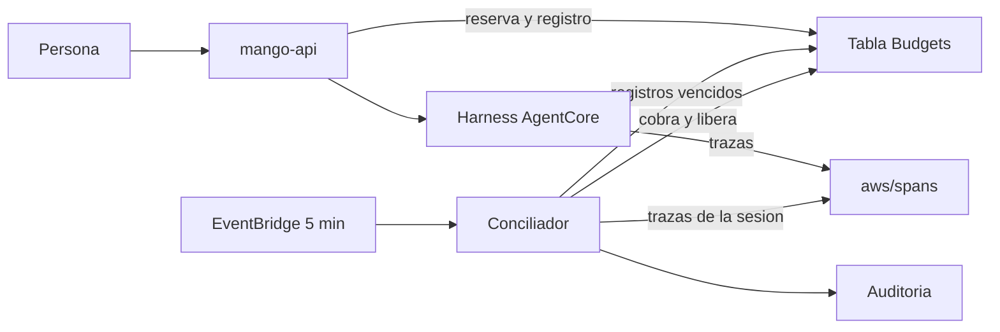

# Conciliación del presupuesto de un turno cortado: modelo de amenazas (v0.1)

> Fecha: 2026-10-06 · Skill: `security-threat-model`. Decisión que lo enmarca: D73 (propuesta). Amplía TM-006 (gasto descontrolado) de `mango-architecture-threat-model.md`.
> Alcance: `packages/py/mango-core/src/mango_core/budget_turns.py`, `apps/api/src/mango_api/budget.py`, el camino del turno en `apps/api/src/mango_api/app.py` (`chat`, `produce`, `_settle_turn`) y `harness.py`, `functions/budget-reconciler/` e `infra/lib/constructs/budget-reconciler.ts`.
> Comprobado con tests locales y, solo lectura, contra las trazas del laboratorio de una prueba de carga (76 invocaciones). **No está desplegado:** ningún turno cortado se ha conciliado todavía en una instalación.

## Executive summary

Hasta hoy, un turno que `mango-api` dejaba de leer por un error devolvía su reserva entera y anotaba costo cero, aunque el agente siguiera y Bedrock cobrara. Como la reserva volvía, el presupuesto dejaba de ser un tope y se podía provocar a propósito. Y un turno cuya tarea moría dejaba la reserva colgada hasta fin de mes.

Lo construido sigue una regla: **«no sé cuánto costó» nunca se anota como «costó cero».**

- Cada turno deja un **registro pendiente** en la tabla `Budgets`, escrito en la misma transacción que la reserva.
- Con final conocido, la liquidación cobra el uso real, libera el resto y borra el registro, todo en una transacción.
- Con final desconocido, se cobra lo conocido y **el resto queda retenido**.
- Una función programada cada 5 minutos (`Mango-<ns>-BudgetReconciler`) busca las trazas de AgentCore de la sesión del turno, cobra lo real y libera el resto. Sin traza 15 minutos después del límite de tiempo del turno, cobra la reserva entera y lo audita.

Los riesgos dominantes y sus controles:

- **Cobrar dos veces o liberar dos veces.** Toda liquidación es una transacción condicionada al registro pendiente: la segunda no encuentra el registro en el estado esperado y no hace nada.
- **Casar la traza de otro turno.** El id de sesión lo calcula el servidor (persona, acceso, agente, conversación, generación) y una sesión con un turno sin liquidar no se continúa: las trazas de esa sesión posteriores al inicio del turno son solo suyas.
- **El permiso de lectura de `aws/spans`,** que es de toda la cuenta: una sola acción (`logs:FilterLogEvents`) sobre un solo log group, y la función descarta todo lo que no sean seis números y un estado.
- **Cobrar de más cuando falla la telemetría.** Es el único caso: fallan a la vez el turno y la traza. Está acotado por la reserva, deja un evento de auditoría con su motivo y dispara una alarma.

No hay rutas HTTP nuevas ni parámetros de stack nuevos. La función no tiene `Scan`, no invoca modelos y no lee conversaciones.

## Scope and assumptions

- **Dentro:** el registro pendiente y sus transiciones, la liquidación en `mango-api`, la función conciliadora, sus permisos, su auditoría y sus alarmas.
- **Fuera:** la estimación de la reserva (`estimate_max_cost`, sin cambios); el título de una conversación nueva, que se sigue cobrando sin reserva; el costo del guardrail, que no entra en ningún presupuesto; la pantalla de presupuestos (`apps/web`, D24); parar la sesión del runtime tras un corte (ver «Supuestos sin validar»).
- **Supuestos:**
  1. El harness gestionado escribe una traza `invoke_agent` por invocación en `aws/spans` con `attributes.session.id`, los tokens y `status.code`. Comprobado en el laboratorio: 76 trazas de 75 sesiones, entre 0 y 5 s después de terminar.
  2. Un turno puede dejar **más de una** invocación en su sesión (se vio una vez en 75: dos invocaciones a 0,8 s, las dos pagadas). Por eso se suman todas las de la sesión desde el inicio del turno, y no se lee la traza hasta pasado el límite de tiempo del turno.
  3. Una invocación fallida deja traza con `status.code` `ERROR` y sin atributos de tokens (los 5 casos de la prueba).
  4. Las trazas son telemetría, no facturación: AWS no garantiza que llegue cada una.
  5. Los relojes de `mango-api` y de AgentCore difieren en menos de 2 s.
  6. El atacante relevante es una persona con sesión y permiso sobre un agente. No controla `mango-api`, AgentCore ni la cuenta de AWS.
- **Preguntas resueltas con el dueño (2026-10-06):** un error informado por el propio harness se trata como final desconocido; el plazo de 15 minutos se cuenta desde el límite de tiempo del turno; se aceptan dos reconocimientos de cdk-nag en el rol de la función (X-Ray y el ARN de `aws/spans`).

## System model

### Primary components

| Componente | Qué hace | Evidencia |
|---|---|---|
| Registro pendiente | Una fila por turno sin liquidar: `PK = TURN#<0-f>`, `SK = <turno>`. Guarda persona, agente, periodo, reserva, lo ya cobrado, lo retenido, el id de sesión, la hora, los plazos y el precio del modelo al reservar. Nunca contenido | `mango_core/budget_turns.py` |
| `BudgetService` | Reserva (con el registro), liquida con final conocido, retiene con final desconocido | `apps/api/src/mango_api/budget.py` |
| Camino del turno | Decide si el final es conocido (`InvocationResult.started`, `usage_final`) y liquida en el `finally` | `apps/api/src/mango_api/app.py`, `harness.py` |
| Función conciliadora | Cada 5 minutos: consulta los registros vencidos, lee las trazas de su sesión, liquida y audita | `functions/budget-reconciler/` |
| Trazas de AgentCore | `aws/spans` (Transaction Search, D16): telemetría de toda la cuenta | `infra/lib/constructs/observability.ts` |
| Auditoría | `budget.reconciled` por Firehose y el índice, igual que `mango-api` | `functions/budget-reconciler/src/mango_budget_reconciler/audit.py` |

### Data flows and trust boundaries

- **`mango-api` → tabla `Budgets`.** Reserva y registro en una transacción; liquidación o retención en otra. Rol de la tarea, sin cambios de permisos.
- **AgentCore → `aws/spans`.** El harness escribe sus trazas. Mango no controla ese contenido: se trata como no confiable (formas y rangos validados, nada se reenvía).
- **`aws/spans` → función.** `logs:FilterLogEvents` con un patrón por id de sesión (64 hexadecimales, validado antes de formar el patrón) y una ventana de tiempo que empieza en el inicio del turno.
- **Función → tabla `Budgets`.** `Query` sobre las 16 particiones `TURN#…` y transacciones por clave sobre el registro y las filas `USER#…` y `AGENT#…` que el propio registro nombra.
- **Función → auditoría.** `firehose:PutRecord` y `dynamodb:PutItem` en el índice.
- **EventBridge → función.** Invocación asíncrona; el evento no lleva datos que la función use.

#### Diagram

## Assets and security objectives

| Activo | Por qué importa | Objetivo |
|---|---|---|
| Contadores de presupuesto (`spent`, `reserved`, `committed`, `held`) | Son el tope de gasto por persona y por agente (regla 4) | Integridad |
| Registro pendiente | Decide qué se cobra y qué se libera; lleva el precio y las filas a tocar | Integridad |
| Trazas de `aws/spans` | Telemetría de toda la cuenta: nombres de servicios, rutas, modelos | Confidencialidad |
| Contenido de conversaciones | No debe llegar a logs ni a Auditoría (D16) | Confidencialidad |
| Audit trail | Un cobro sin evento, o un evento sin cobro, rompe la evidencia | Integridad |
| Presupuesto disponible de los demás | El del agente lo comparten todos sus usuarios | Disponibilidad |

## Attacker model

### Capabilities

- Tener sesión y permiso sobre un agente; lanzar turnos a la vez, cada uno en una conversación nueva; elegir el mensaje.
- Provocar que `mango-api` deje de leer (saturar la cuota de Bedrock de la cuenta con turnos propios).
- Repetir cualquier petición y cortar su propia conexión.

### Non-capabilities

- No elige el id de sesión ni el id del turno: los calcula el servidor.
- No escribe en `aws/spans` ni en la tabla `Budgets`, y no invoca la función.
- No toca la conexión entre `mango-api` y AgentCore.
- Cortar su conexión no corta el turno: sigue en el servidor y se cobra entero.

## Entry points and attack surfaces

| Superficie | Cómo se alcanza | Frontera | Notas | Evidencia |
|---|---|---|---|---|
| `POST /api/chat` | Persona con sesión | Navegador → `mango-api` | Única forma de crear un registro pendiente | `app.py` (`chat`) |
| Stream del harness | Respuesta de `InvokeHarness` | Harness → `mango-api` | De su forma sale si el final es conocido | `harness.run` |
| Trazas | Las escribe el harness | `aws/spans` → función | No confiables: solo números acotados y un estado | `traces.py` |
| Evento programado | EventBridge | EventBridge → función | Sin datos de entrada | `handler.py` |
| Fila del registro | La escribe `mango-api` | Tabla → función | La función valida su forma antes de usarla | `budget_turns.PendingTurn.from_item` |

## Top abuse paths

1. **Saltarse el tope repitiendo cortes** (el de la prueba de carga). Lanzar turnos hasta agotar la cuota de Bedrock → `mango-api` corta por silencio → antes, la reserva volvía y se repetía sin límite. Ahora la reserva queda retenida: con el presupuesto lleno de retenciones, el siguiente turno recibe 402.
2. **Cobrar a otra persona.** Conseguir que el conciliador case con el turno de la víctima una traza ajena → gasto de más en su fila.
3. **Bloquear el agente a los demás.** Provocar muchos cortes a la vez → sus retenciones ocupan el presupuesto del agente, que es compartido → turnos de otros rechazados durante unos minutos.
4. **Doble liquidación.** `mango-api` liquida tarde un turno que el conciliador ya cerró, o dos ejecuciones del conciliador coinciden → cobrar o liberar dos veces.
5. **Leer la cuenta con el rol del conciliador.** Un fallo en la función o en una dependencia usa `FilterLogEvents` para sacar trazas de otras cargas de la cuenta.
6. **Contenido en logs.** Una traza con texto en un atributo acaba en el log de la función o en Auditoría.

## Threat model table

| ID | Origen | Requisito | Acción | Impacto | Activos | Controles existentes | Huecos | Mitigación | Detección | Prob. | Impacto | Prioridad |
|---|---|---|---|---|---|---|---|---|---|---|---|---|
| TM-BR1 | Persona con sesión | Poca cuota de Bedrock o cualquier causa de corte | Cortar turnos a propósito para gastar sin que cuente | Gasto sin tope de presupuesto | Contadores | Final desconocido retiene la reserva (`BudgetService.hold`); el costo sale del uso ya sumado, nunca de cero; sin traza se cobra la reserva entera. Tests `test_turn_endings.py` | Mientras dura la retención la persona puede tener hasta `límite / reserva` turnos cortados a la vez (14 con USD 5); no más | — | `agent.completed` con `settlement: pending`; métrica `Held`; alarma `BudgetReconciler-reservation-charged` | low | medium | **low** |
| TM-BR2 | Persona con sesión | Sesión reutilizada o id de sesión conocido | Que una traza de otro turno se cobre a este | Cobro de más a sí misma o a otra persona | Contadores | El id de sesión incluye persona, acceso, agente, conversación y generación (`sessions.runtime_session_id`): dos personas nunca comparten sesión. Una sesión solo se marca reutilizable **después** de liquidar el turno (`_settle_turn`), así que un turno con registro pendiente es el último de su sesión. Solo cuentan las trazas que empiezan desde 2 s antes de la reserva | Un turno anterior de la misma sesión que empezó y terminó en esos 2 s se sumaría (la persona se cobra de más a sí misma, como mucho un turno) | — | `budget.reconciled` lleva cuántas invocaciones se sumaron | low | low | **low** |
| TM-BR3 | Fallo de telemetría | La traza no llega, llega tarde o con otros nombres de atributo | Cobrar de menos (leer cero) o de más (la reserva) | Presupuesto que no cuadra con la factura, o persona cobrada de más | Contadores | Una traza sin tokens solo vale cero si su estado es `ERROR`; una traza terminada sin atributos de tokens es «ilegible» y no liquida. No se lee antes del límite de tiempo del turno más 90 s. Plazo: 15 minutos después de ese límite; entonces se cobra la reserva, con `basis: reservation` y el motivo | Una traza que llegue después del plazo ya no corrige el cobro. Un cambio de nombres de atributo en una versión del harness convierte todo turno cortado en un cobro por la reserva | Si la alarma suena de forma sostenida, revisar los nombres de atributo (`traces.py`) contra una traza real | Alarma `BudgetReconciler-reservation-charged`; evento con `reason` | medium | medium | **medium** |
| TM-BR4 | Concurrencia | Dos ejecuciones del conciliador, o `mango-api` liquidando tarde | Liquidar dos veces | Cobro o liberación doble | Contadores | Cada liquidación es una `TransactWriteItems` condicionada al registro (existe, estado y cantidades leídas). El conciliador marca `settled`, audita y después borra; `mango-api` borra en la misma transacción. Tests de doble liquidación en `test_budget_turns.py` y `test_reconciler.py` | Ninguno conocido | — | Métrica `Conflicts` | low | high | **low** |
| TM-BR5 | Fallo a medias | La función muere entre cobrar y auditar | Cobro sin evento | Evidencia incompleta | Audit trail | El registro queda `settled` con el resultado; la siguiente pasada vuelve a emitir el evento y solo entonces lo borra (al menos una vez; un duplicado se reconoce por el turno) | Un evento puede salir dos veces | — | Dos `budget.reconciled` del mismo turno | low | low | **low** |
| TM-BR6 | Función o dependencia comprometida | Ejecutar código en la función | Leer trazas de otras cargas de la cuenta | Fuga de metadatos de la cuenta (servicios, rutas, modelos; no contenido de Mango, D16) | Trazas | Una acción (`logs:FilterLogEvents`) sobre un log group; sin `StartQuery`, sin `GetLogEvents`, sin X-Ray. La función no tiene salida a otros sistemas salvo Firehose y DynamoDB de Mango. Dependencias: `boto3` y `mango-core` | El permiso alcanza todo `aws/spans`: IAM no filtra por contenido. En una cuenta dedicada a Mango no hay nada más | Documentado en D73 y en el runbook: en una cuenta compartida, quien instala acepta ese alcance | CloudTrail (`FilterLogEvents` del rol) | low | medium | **low** |
| TM-BR7 | Función comprometida | Ejecutar código en la función | Reescribir contadores de presupuesto | Liberar gasto o bloquear personas | Contadores | Sin `Scan`, `PutItem` ni `BatchWriteItem`: solo `Query` sobre `TURN#…`, y `UpdateItem`/`DeleteItem` por clave limitadas por `dynamodb:LeadingKeys` a `TURN#…`, `USER#…` y `AGENT#…` | Con esas acciones puede cambiar cualquier fila de presupuesto: es lo que la función hace | Mantener la función sin entrada externa | `budget.reconciled`; reconciliación contra la factura | low | high | **medium** |
| TM-BR8 | Persona con sesión | Muchos cortes a la vez | Llenar de retenciones el presupuesto del agente | Turnos de otras personas rechazados (402) durante minutos | Disponibilidad | Cada persona retiene como mucho su propio límite; la retención dura hasta la siguiente pasada tras el límite del turno (entre 3,5 y 8,5 minutos con el límite por defecto) | Con un límite de agente bajo frente al de persona, pocas personas bastan | El límite del agente debe ser varias veces el de una persona (ya es así por defecto: 30 frente a 5) | `budget.exceeded`; métrica `Held` | low | medium | **low** |
| TM-BR9 | Traza no confiable | Atributo con texto o número absurdo | Meter contenido en logs o Auditoría, o un costo enorme | Fuga a logs; cobro desorbitado | Contenido, contadores | De cada traza se leen seis campos: cuatro contadores de tokens (enteros entre 0 y 10⁹), el inicio y `status.code`. Nada más se guarda ni se loguea; los logs de la función llevan el turno, el motivo y números | Un contador falso dentro del rango cobra hasta lo que diga. Solo AgentCore escribe ahí | — | `budget.reconciled` con los tokens | low | medium | **low** |
| TM-BR10 | Patrón de filtro | Id de sesión con comillas | Cambiar el patrón de `FilterLogEvents` | Leer trazas de otra sesión | Contadores | El id de sesión se valida (`^[0-9a-f]{64}$`) al leer el registro y antes de formar el patrón; lo escribe `mango-api`, no la persona | Ninguno | — | — | low | medium | **low** |
| TM-BR11 | Persona que mira su gasto | Turno por conciliar | Ver como disponible lo retenido | Decisiones con un dato falso | — | La lista de presupuestos suma lo retenido (`held`) al gasto mostrado hasta que se concilia | Se ve como gastado, no como «por conciliar»: falta ese estado en el diseño (D24). La reserva de un turno cuya tarea murió no se ve hasta que el conciliador lo cierra, igual que la de un turno en curso | Brief de diseño: texto y estado «por conciliar» | — | low | low | **low** |
| TM-BR12 | Catálogo de precios | Un administrador cambia el precio entre la reserva y la conciliación | Cobrar con otro precio | Costo distinto del reservado | Contadores | El registro guarda el precio del modelo al reservar; el conciliador no lee el catálogo | Ninguno | — | — | low | low | **low** |
| TM-BR13 | Operación | Transaction Search gestionado por fuera (`external`) o `aws/spans` inexistente | La consulta falla siempre | Todo turno cortado se cobra por la reserva | Contadores | Un fallo de consulta no liquida: se reintenta cada pasada hasta el plazo; entonces se cobra la reserva con `reason: trace_query_failed` | En esa instalación la conciliación degrada a «cobrar la reserva» hasta que alguien dé el acceso | Runbook: comprobar que las trazas llegan a `aws/spans` de la cuenta de Mango | Alarma; métrica `TraceQueryErrors` | medium | low | **low** |

## Criticality calibration

- **high:** gastar sin que cuente de forma repetible; cobrar a una persona el turno de otra; cobros o liberaciones dobles.
- **medium:** cobrar de más un turno aislado por un fallo de telemetría; un rol con escritura sobre los contadores sin entrada externa.
- **low:** retenciones de minutos, eventos duplicados reconocibles, datos de pantalla conservadores.

## Focus paths for security review

| Ruta | Por qué |
|---|---|
| `packages/py/mango-core/src/mango_core/budget_turns.py` | Las transacciones y sus condiciones: de ellas depende que nada se cobre ni se libere dos veces |
| `apps/api/src/mango_api/app.py` (`produce`, `_settle_turn`) | Decide final conocido o desconocido; el orden liquidar → marcar la sesión reutilizable sostiene TM-BR2 |
| `apps/api/src/mango_api/harness.py` (`started`, `usage_final`) | Cualquier forma nueva de terminar el stream debe decidir si el uso es final |
| `functions/budget-reconciler/src/mango_budget_reconciler/traces.py` | Único punto que lee contenido no confiable de toda la cuenta |
| `infra/lib/constructs/budget-reconciler.ts` | Permisos de la función; un test fija la política |

## Supuestos sin validar

- Que la condición `dynamodb:LeadingKeys` del rol deja pasar las transacciones de la función en AWS real: los tests locales no evalúan IAM. Es lo primero que hay que mirar en el laboratorio.
- Los tokens de caché en las trazas: los atributos existen y valían cero en todas las de la prueba (el agente no usa caché). Se suman con el precio de caché guardado.
- Qué pasa con la traza si el harness muere antes de cerrarla: no se pudo observar. El plazo lo cubre cobrando la reserva.
- `StopRuntimeSession` tras un corte queda **fuera**: no se pudo confirmar qué hace con un turno a medias, y parar la sesión podría impedir que el harness escriba la traza de la que depende la conciliación.
- La frecuencia real de turnos cortados: fuera de la prueba de carga, ninguno en 141.
