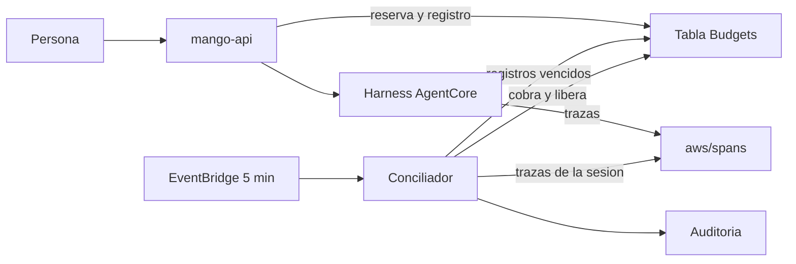

# Conciliación del presupuesto de un turno cortado: modelo de amenazas (v0.4)

> Fecha: 2026-10-06 · Skill: `security-threat-model`. Decisión que lo enmarca: D73. Amplía TM-006 (gasto descontrolado) de `mango-architecture-threat-model.md`.
> Alcance: `packages/py/mango-core/src/mango_core/budget_turns.py`, `apps/api/src/mango_api/budget.py`, el camino del turno en `apps/api/src/mango_api/app.py` (`chat`, `produce`, `_settle_turn`) y `harness.py`, `functions/budget-reconciler/` e `infra/lib/constructs/budget-reconciler.ts`.
> Comprobado con tests locales y, solo lectura, contra las trazas del laboratorio de una prueba de carga (76 invocaciones).
> **v0.2 (2026-10-06, misma skill):** la primera versión se validó ese día en una instalación de laboratorio y apareció un defecto: un turno que el harness corta por su límite de tiempo se conciliaba con costo cero (TM-BR14). Esta versión cubre la corrección (D73 (19)): el conciliador suma también las llamadas al modelo y espera a que terminen. La corrección se comprobó con tests y, solo lectura, con su lector nuevo sobre las 100 sesiones de esa validación y 4 turnos cortados más; **no está desplegada**.
> **v0.3 (2026-10-06, misma skill):** cubre D74, el tope de tokens en cada llamada al modelo. Alcance añadido: `AgentLimits` en `packages/py/mango-core/src/mango_core/agents.py`, `build_request` en `apps/api/src/mango_api/harness.py`, `harness_config` en `functions/provisioner/src/mango_provisioner/harness.py` y `estimate_max_cost` en `apps/api/src/mango_api/pricing.py`. Baja TM-BR16 y añade TM-BR17. Comprobado con tests y, solo lectura, con las trazas de tres días del laboratorio (753 llamadas) y tres turnos de comprobación; **no está desplegado** y ninguna llamada del laboratorio llegó a su tope.
> **v0.4 (2026-10-06, misma skill):** D74 se desplegó ese día en una instalación de laboratorio y una llamada llegó a su tope: el harness terminó el turno con un error después de entregar el mensaje y su uso, y `mango-api` lo trató como final desconocido (D74 (12)). Esta versión cubre el arreglo (D74 (13), propuesto): ese final, y solo ese, pasa a ser conocido. Alcance añadido: `_events` y `run` en `apps/api/src/mango_api/harness.py` y `can_continue` en `sessions.py`. Añade TM-BR18. Comprobado con tests; **el arreglo no está desplegado** y la secuencia de eventos se vio en un solo turno, sin tools.
> **Nota del 2026-10-06 (sin pasada de la skill: no cambia el código ni el modelo, solo se anota lo visto):** el arreglo y la corrección de D73 (19) se desplegaron ese día en una instalación de laboratorio. Lo que se vio y lo que sigue sin validar está en «Supuestos sin validar» (D73 (21) a (23), D74 (15) y (16)).

## Executive summary

Hasta hoy, un turno que `mango-api` dejaba de leer por un error devolvía su reserva entera y anotaba costo cero, aunque el agente siguiera y Bedrock cobrara. Como la reserva volvía, el presupuesto dejaba de ser un tope y se podía provocar a propósito. Y un turno cuya tarea moría dejaba la reserva colgada hasta fin de mes.

Lo construido sigue una regla: **«no sé cuánto costó» nunca se anota como «costó cero».**

- Cada turno deja un **registro pendiente** en la tabla `Budgets`, escrito en la misma transacción que la reserva.
- Con final conocido, la liquidación cobra el uso real, libera el resto y borra el registro, todo en una transacción.
- Con final desconocido, se cobra lo conocido y **el resto queda retenido**.
- Una función programada cada 5 minutos (`Mango-<ns>-BudgetReconciler`) busca las trazas de AgentCore de la sesión del turno, cobra lo real y libera el resto. Sin traza 15 minutos después del límite de tiempo del turno, cobra la reserva entera y lo audita.

Los riesgos dominantes y sus controles:

- **Cobrar dos veces o liberar dos veces.** Toda liquidación es una transacción condicionada al registro pendiente: la segunda no encuentra el registro en el estado esperado y no hace nada.
- **Casar la traza de otro turno.** El id de sesión lo calcula el servidor (persona, acceso, agente, conversación, generación) y una sesión con un turno sin liquidar no se continúa: las trazas de esa sesión posteriores al inicio del turno son solo suyas.
- **El permiso de lectura de `aws/spans`,** que es de toda la cuenta: una sola acción (`logs:FilterLogEvents`) sobre un solo log group, y la función descarta todo lo que no sean seis números y un estado.
- **Cobrar de más cuando falla la telemetría.** Es el único caso: fallan a la vez el turno y la traza. Está acotado por la reserva, deja un evento de auditoría con su motivo y dispara una alarma.
- **Leer «cero» donde todavía no hay respuesta (v0.2).** El harness cierra la invocación de un turno que corta por tiempo con cero tokens, y la llamada al modelo sigue y escribe su traza después. El conciliador suma el turno dos veces, por invocaciones y por llamadas al modelo, cobra la mayor, y no cierra mientras una llamada que el harness abrió no tenga su traza.

Dos límites que la validación dejó a la vista: **el costo real de un turno puede pasar de su reserva** y **parar la sesión del runtime no detiene el gasto y sí pierde la traza** (ver «Supuestos sin validar»).

**(v0.3) El primero se acota con D74.** Cada llamada al modelo lleva un tope de salida (el propio del agente, o su `max_tokens`) y la reserva cuenta como salida al menos una llamada entera: una sola llamada ya no puede generar varias veces lo reservado (TM-BR16). Lo que queda: un turno con tools hace varias llamadas y la reserva cuenta la salida una vez, y la entrada de cada llamada se estima, no se limita (TM-BR17). El exceso se sigue cobrando entero.

**(v0.4) Un final sale de «desconocido».** Una llamada que llega a su tope termina en el harness como error, pero después de informar su uso: `mango-api` liquida ese turno al momento por lo real (TM-BR18). Quien lo provoca no gana nada sobre un turno normal: paga todas sus llamadas y no hay ninguna en curso. Lo que se pierde es la retención de minutos que ese error traía, que no era un control sino un efecto del defecto.

No hay rutas HTTP nuevas ni parámetros de stack nuevos. La función no tiene `Scan`, no invoca modelos y no lee conversaciones.

## Scope and assumptions

- **Dentro:** el registro pendiente y sus transiciones, la liquidación en `mango-api`, la función conciliadora, sus permisos, su auditoría y sus alarmas.
- **Fuera:** la estimación de la entrada en la reserva (`estimate_max_cost`: 6.000 tokens más el historial por iteración, sin cambios; desde v0.3 su salida sí está dentro: TM-BR16 y TM-BR17); el título de una conversación nueva, que se sigue cobrando sin reserva; el costo del guardrail, que no entra en ningún presupuesto; la pantalla de presupuestos (`apps/web`, D24); parar la sesión del runtime tras un corte (ver «Supuestos sin validar»).
- **Supuestos:**
  1. El harness gestionado escribe una traza `invoke_agent` por invocación en `aws/spans` con `attributes.session.id`, los tokens y `status.code`. Comprobado en el laboratorio: 76 trazas de 75 sesiones, entre 0 y 5 s después de terminar.
     - **(v0.2)** Por cada llamada al modelo escribe además dos trazas: `chat`, su propio registro de la llamada, y `chat <id del modelo>`, hija de la anterior, que escribe el SDK cuando la llamada termina de verdad. En 100 sesiones: 256 pares, cada `chat <modelo>` con su `chat` como padre, todas en una sola traza por sesión.
     - **(v0.2)** En los 97 turnos que terminaron solos, la suma por llamadas es igual a la de `invoke_agent`. En un turno cortado por tiempo (6 vistos), `invoke_agent` y `chat` cierran en el límite con cero tokens y `chat <modelo>` llega cuando la llamada acaba: entre 69 y 140 s después del corte.
     - **(v0.2)** `chat <modelo>` omite un contador que vale cero y nunca trae los de caché; una llamada bien terminada tiene estado `UNSET`, una rechazada `ERROR` y sin tokens.
  2. Un turno puede dejar **más de una** invocación en su sesión (se vio una vez en 75: dos invocaciones a 0,8 s, las dos pagadas). Por eso se suman todas las de la sesión desde el inicio del turno, y no se lee la traza hasta pasado el límite de tiempo del turno.
  3. Una invocación fallida deja traza con `status.code` `ERROR` y sin atributos de tokens (los 5 casos de la prueba).
  4. Las trazas son telemetría, no facturación: AWS no garantiza que llegue cada una.
  5. Los relojes de `mango-api` y de AgentCore difieren en menos de 2 s.
  6. El atacante relevante es una persona con sesión y permiso sobre un agente. No controla `mango-api`, AgentCore ni la cuenta de AWS.
  7. **(v0.4)** Tras el error con el que el harness cierra un turno que llegó a su tope no hay más llamadas al modelo de esa invocación. Visto en un turno sin tools: una sola llamada, y la invocación y la llamada terminan en el mismo segundo.
- **Preguntas resueltas con el dueño (2026-10-06):** un error informado por el propio harness se trata como final desconocido (desde v0.4, salvo el que sigue al uso de un mensaje cortado en su tope: el dueño eligió ese día «arreglarlo ahora»); el plazo de 15 minutos se cuenta desde el límite de tiempo del turno; se aceptan dos reconocimientos de cdk-nag en el rol de la función (X-Ray y el ARN de `aws/spans`).

## System model

### Primary components

| Componente | Qué hace | Evidencia |
|---|---|---|
| Registro pendiente | Una fila por turno sin liquidar: `PK = TURN#<0-f>`, `SK = <turno>`. Guarda persona, agente, periodo, reserva, lo ya cobrado, lo retenido, el id de sesión, la hora, los plazos y el precio del modelo al reservar. Nunca contenido | `mango_core/budget_turns.py` |
| `BudgetService` | Reserva (con el registro), liquida con final conocido, retiene con final desconocido | `apps/api/src/mango_api/budget.py` |
| Camino del turno | Decide si el final es conocido (`InvocationResult.started`, `usage_final`) y liquida en el `finally` | `apps/api/src/mango_api/app.py`, `harness.py` |
| Función conciliadora | Cada 5 minutos: consulta los registros vencidos, lee las trazas de su sesión, liquida y audita | `functions/budget-reconciler/` |
| Trazas de AgentCore | `aws/spans` (Transaction Search, D16): telemetría de toda la cuenta | `infra/lib/constructs/observability.ts` |
| Auditoría | `budget.reconciled` por Firehose y el índice, igual que `mango-api` | `functions/budget-reconciler/src/mango_budget_reconciler/audit.py` |

### Data flows and trust boundaries

- **`mango-api` → tabla `Budgets`.** Reserva y registro en una transacción; liquidación o retención en otra. Rol de la tarea, sin cambios de permisos.
- **AgentCore → `aws/spans`.** El harness escribe sus trazas. Mango no controla ese contenido: se trata como no confiable (formas y rangos validados, nada se reenvía).
- **`aws/spans` → función.** `logs:FilterLogEvents` con un patrón por id de sesión (64 hexadecimales, validado antes de formar el patrón) y una ventana de tiempo que empieza en el inicio del turno. Desde v0.2 el patrón pide tres clases de traza de esa sesión (`invoke_agent*` y `chat*`), no una; el permiso es el mismo.
- **Función → tabla `Budgets`.** `Query` sobre las 16 particiones `TURN#…` y transacciones por clave sobre el registro y las filas `USER#…` y `AGENT#…` que el propio registro nombra.
- **Función → auditoría.** `firehose:PutRecord` y `dynamodb:PutItem` en el índice.
- **EventBridge → función.** Invocación asíncrona; el evento no lleva datos que la función use.

#### Diagram

## Assets and security objectives

| Activo | Por qué importa | Objetivo |
|---|---|---|
| Contadores de presupuesto (`spent`, `reserved`, `committed`, `held`) | Son el tope de gasto por persona y por agente (regla 4) | Integridad |
| Registro pendiente | Decide qué se cobra y qué se libera; lleva el precio y las filas a tocar | Integridad |
| Trazas de `aws/spans` | Telemetría de toda la cuenta: nombres de servicios, rutas, modelos | Confidencialidad |
| Contenido de conversaciones | No debe llegar a logs ni a Auditoría (D16) | Confidencialidad |
| Audit trail | Un cobro sin evento, o un evento sin cobro, rompe la evidencia | Integridad |
| Presupuesto disponible de los demás | El del agente lo comparten todos sus usuarios | Disponibilidad |

## Attacker model

### Capabilities

- Tener sesión y permiso sobre un agente; lanzar turnos a la vez, cada uno en una conversación nueva; elegir el mensaje.
- Provocar que `mango-api` deje de leer (saturar la cuota de Bedrock de la cuenta con turnos propios).
- **(v0.2)** Provocar que el harness corte el turno: pedir un texto largo a un agente con límite de tiempo corto. Es repetible a voluntad; quien crea agentes elige ese límite (10 a 600 s).
- Repetir cualquier petición y cortar su propia conexión.
- **(v0.4)** Provocar que una llamada llegue a su tope: pedir un texto más largo que el máximo del agente. Repetible a voluntad con cualquier agente que no se niegue; salió a la primera en el laboratorio.

### Non-capabilities

- No elige el id de sesión ni el id del turno: los calcula el servidor.
- No escribe en `aws/spans` ni en la tabla `Budgets`, y no invoca la función. Las trazas las escribe el harness; un agente no ejecuta código de la persona (las tools integradas de shell y archivos van desactivadas, `harness.build_request`).
- No toca la conexión entre `mango-api` y AgentCore.
- **(v0.4)** No escribe eventos del stream: el motivo de fin, el uso y el código del error los pone AgentCore. Lo que el modelo escribe llega solo como texto o como entrada de una tool.
- Cortar su conexión no corta el turno: sigue en el servidor y se cobra entero.

## Entry points and attack surfaces

| Superficie | Cómo se alcanza | Frontera | Notas | Evidencia |
|---|---|---|---|---|
| `POST /api/chat` | Persona con sesión | Navegador → `mango-api` | Única forma de crear un registro pendiente | `app.py` (`chat`) |
| Stream del harness | Respuesta de `InvokeHarness` | Harness → `mango-api` | De su forma sale si el final es conocido. Desde v0.4 también del código de un error (`runtimeClientError`), nunca de su texto | `harness.run`, `harness._events` |
| Trazas | Las escribe el harness | `aws/spans` → función | No confiables: de cada una, el nombre, sus ids, inicio y fin, el estado y cuatro contadores acotados | `traces.py` |
| Evento programado | EventBridge | EventBridge → función | Sin datos de entrada | `handler.py` |
| Fila del registro | La escribe `mango-api` | Tabla → función | La función valida su forma antes de usarla | `budget_turns.PendingTurn.from_item` |

## Top abuse paths

1. **Saltarse el tope repitiendo cortes** (el de la prueba de carga). Lanzar turnos hasta agotar la cuota de Bedrock → `mango-api` corta por silencio → antes, la reserva volvía y se repetía sin límite. Ahora la reserva queda retenida: con el presupuesto lleno de retenciones, el siguiente turno recibe 402.
2. **Cobrar a otra persona.** Conseguir que el conciliador case con el turno de la víctima una traza ajena → gasto de más en su fila.
3. **Bloquear el agente a los demás.** Provocar muchos cortes a la vez → sus retenciones ocupan el presupuesto del agente, que es compartido → turnos de otros rechazados durante unos minutos.
4. **Doble liquidación.** `mango-api` liquida tarde un turno que el conciliador ya cerró, o dos ejecuciones del conciliador coinciden → cobrar o liberar dos veces.
5. **Leer la cuenta con el rol del conciliador.** Un fallo en la función o en una dependencia usa `FilterLogEvents` para sacar trazas de otras cargas de la cuenta.
6. **Contenido en logs.** Una traza con texto en un atributo acaba en el log de la función o en Auditoría.
7. **(v0.2) Gastar sin que cuente cortando por tiempo.** Agente con límite corto → pedir un texto largo → el harness corta y anota cero → antes de la corrección, el conciliador cerraba con costo cero y liberaba todo (visto: 6 turnos, unos USD 0,77 de modelo anotados como cero). Ahora se cobra lo que diga la llamada al modelo.
8. **(v0.2) Escribir trazas falsas con la sesión de un turno retenido** (otra carga de la cuenta con `xray:PutTraceSegments`, no una persona de Mango) → inflar su costo o retrasar su cierre hasta el plazo.
9. **(v0.4) Provocar a voluntad el final «cortado en su tope»** para que un turno se liquide como final con gasto sin contar: pedir un texto largo → la llamada llega a su tope → el harness cierra con error → `mango-api` liquida al momento. Solo serviría si en ese momento quedara gasto sin informar, y la condición exige que no lo haya (TM-BR18).

## Threat model table

| ID | Origen | Requisito | Acción | Impacto | Activos | Controles existentes | Huecos | Mitigación | Detección | Prob. | Impacto | Prioridad |
|---|---|---|---|---|---|---|---|---|---|---|---|---|
| TM-BR1 | Persona con sesión | Poca cuota de Bedrock o cualquier causa de corte | Cortar turnos a propósito para gastar sin que cuente | Gasto sin tope de presupuesto | Contadores | Final desconocido retiene la reserva (`BudgetService.hold`); el costo sale del uso ya sumado, nunca de cero; sin traza se cobra la reserva entera. Tests `test_turn_endings.py` | Mientras dura la retención la persona puede tener hasta `límite / reserva` turnos cortados a la vez (14 con USD 5); no más | — | `agent.completed` con `settlement: pending`; métrica `Waiting`; alarma `BudgetReconciler-reservation-charged` | low | medium | **low** |
| TM-BR2 | Persona con sesión | Sesión reutilizada o id de sesión conocido | Que una traza de otro turno se cobre a este | Cobro de más a sí misma o a otra persona | Contadores | El id de sesión incluye persona, acceso, agente, conversación y generación (`sessions.runtime_session_id`): dos personas nunca comparten sesión. Una sesión solo se marca reutilizable **después** de liquidar el turno (`_settle_turn`), así que un turno con registro pendiente es el último de su sesión. Solo cuentan las trazas que empiezan desde 2 s antes de la reserva | Un turno anterior de la misma sesión que empezó y terminó en esos 2 s se sumaría (la persona se cobra de más a sí misma, como mucho un turno) | — | `budget.reconciled` lleva cuántas invocaciones se sumaron | low | low | **low** |
| TM-BR3 | Fallo de telemetría | La traza no llega, llega tarde o con otros nombres de atributo | Cobrar de menos (leer cero) o de más (la reserva) | Presupuesto que no cuadra con la factura, o persona cobrada de más | Contadores | Una traza sin tokens solo vale cero si su estado es `ERROR`; una traza terminada sin atributos de tokens es «ilegible» y no liquida. No se lee antes del límite de tiempo del turno más 90 s. Plazo: 15 minutos después de ese límite; entonces se cobra la reserva, con `basis: reservation` y el motivo. **(v0.2)** Una `chat <modelo>` sin tokens solo vale cero si falló o si su `chat` la esperó hasta el final (así se ve un bloqueo del guardrail); si el harness dejó de esperarla, es ilegible | Una traza que llegue después del plazo ya no corrige el cobro. Un cambio de nombres de atributo en una versión del harness convierte todo turno cortado en un cobro por la reserva. **(v0.2)** Si cambian los nombres `chat` o `chat <modelo>`, un turno cortado por tiempo vuelve a quedar como invocación con cero tokens y sin llamadas: se trata como sin terminar y se cobra por la reserva al plazo, no por cero | Si la alarma suena de forma sostenida, revisar los nombres de atributo (`traces.py`) contra una traza real | Alarma `BudgetReconciler-reservation-charged`; evento con `reason` | medium | medium | **medium** |
| TM-BR4 | Concurrencia | Dos ejecuciones del conciliador, o `mango-api` liquidando tarde | Liquidar dos veces | Cobro o liberación doble | Contadores | Cada liquidación es una `TransactWriteItems` condicionada al registro (existe, estado y cantidades leídas). El conciliador marca `settled`, audita y después borra; `mango-api` borra en la misma transacción. Tests de doble liquidación en `test_budget_turns.py` y `test_reconciler.py` | Ninguno conocido | — | Línea de resumen del log (`Conflicts`) | low | high | **low** |
| TM-BR5 | Fallo a medias | La función muere entre cobrar y auditar | Cobro sin evento | Evidencia incompleta | Audit trail | El registro queda `settled` con el resultado; la siguiente pasada vuelve a emitir el evento y solo entonces lo borra (al menos una vez; un duplicado se reconoce por el turno) | Un evento puede salir dos veces | — | Dos `budget.reconciled` del mismo turno | low | low | **low** |
| TM-BR6 | Función o dependencia comprometida | Ejecutar código en la función | Leer trazas de otras cargas de la cuenta | Fuga de metadatos de la cuenta (servicios, rutas, modelos; no contenido de Mango, D16) | Trazas | Una acción (`logs:FilterLogEvents`) sobre un log group; sin `StartQuery`, sin `GetLogEvents`, sin X-Ray. La función no tiene salida a otros sistemas salvo Firehose y DynamoDB de Mango. Dependencias: `boto3` y `mango-core` | El permiso alcanza todo `aws/spans`: IAM no filtra por contenido. En una cuenta dedicada a Mango no hay nada más | Documentado en D73 y en el runbook: en una cuenta compartida, quien instala acepta ese alcance | CloudTrail (`FilterLogEvents` del rol) | low | medium | **low** |
| TM-BR7 | Función comprometida | Ejecutar código en la función | Reescribir contadores de presupuesto | Liberar gasto o bloquear personas | Contadores | Sin `Scan`, `PutItem` ni `BatchWriteItem`: solo `Query` sobre `TURN#…`, y `UpdateItem`/`DeleteItem` por clave limitadas por `dynamodb:LeadingKeys` a `TURN#…`, `USER#…` y `AGENT#…` | Con esas acciones puede cambiar cualquier fila de presupuesto: es lo que la función hace | Mantener la función sin entrada externa | `budget.reconciled`; reconciliación contra la factura | low | high | **medium** |
| TM-BR8 | Persona con sesión | Muchos cortes a la vez | Llenar de retenciones el presupuesto del agente | Turnos de otras personas rechazados (402) durante minutos | Disponibilidad | Cada persona retiene como mucho su propio límite; la retención dura hasta la siguiente pasada tras el límite del turno (entre 3,5 y 8,5 minutos con el límite por defecto). **(v0.2)** Un turno cortado por tiempo espera además a que su llamada al modelo termine: como mucho hasta el plazo (17 minutos desde el inicio con el límite por defecto) | Con un límite de agente bajo frente al de persona, pocas personas bastan | El límite del agente debe ser varias veces el de una persona (ya es así por defecto: 30 frente a 5) | `budget.exceeded`; métrica `Waiting` | low | medium | **low** |
| TM-BR9 | Traza no confiable | Atributo con texto o número absurdo | Meter contenido en logs o Auditoría, o un costo enorme | Fuga a logs; cobro desorbitado | Contenido, contadores | De cada traza se leen cuatro contadores de tokens (enteros entre 0 y 10⁹), el inicio, `status.code` y, desde v0.2, el nombre, el fin y los ids de la traza y de su padre (el id, hexadecimal validado). Los ids y el nombre solo sirven para emparejar y clasificar: no se guardan. Nada más se guarda ni se loguea; los logs de la función llevan el turno, el motivo y números | Un contador falso dentro del rango cobra hasta lo que diga. Solo AgentCore escribe ahí | — | `budget.reconciled` con los tokens | low | medium | **low** |
| TM-BR10 | Patrón de filtro | Id de sesión con comillas | Cambiar el patrón de `FilterLogEvents` | Leer trazas de otra sesión | Contadores | El id de sesión se valida (`^[0-9a-f]{64}$`) al leer el registro y antes de formar el patrón; lo escribe `mango-api`, no la persona | Ninguno | — | — | low | medium | **low** |
| TM-BR11 | Persona que mira su gasto | Turno por conciliar | Ver como disponible lo retenido | Decisiones con un dato falso | — | La lista de presupuestos suma lo retenido (`held`) al gasto mostrado hasta que se concilia | Se ve como gastado, no como «por conciliar»: falta ese estado en el diseño (D24). La reserva de un turno cuya tarea murió no se ve hasta que el conciliador lo cierra, igual que la de un turno en curso | Brief de diseño: texto y estado «por conciliar» | — | low | low | **low** |
| TM-BR12 | Catálogo de precios | Un administrador cambia el precio entre la reserva y la conciliación | Cobrar con otro precio | Costo distinto del reservado | Contadores | El registro guarda el precio del modelo al reservar; el conciliador no lee el catálogo | Ninguno | — | — | low | low | **low** |
| TM-BR13 | Operación | Transaction Search gestionado por fuera (`external`) o `aws/spans` inexistente | La consulta falla siempre | Todo turno cortado se cobra por la reserva | Contadores | Un fallo de consulta no liquida: se reintenta cada pasada hasta el plazo; entonces se cobra la reserva con `reason: trace_query_failed` | En esa instalación la conciliación degrada a «cobrar la reserva» hasta que alguien dé el acceso | Runbook: comprobar que las trazas llegan a `aws/spans` de la cuenta de Mango | Alarma; métrica `TraceQueryErrors` | medium | low | **low** |
| TM-BR14 | Persona con sesión | Un agente con límite de tiempo corto, o cualquier turno que pase de su límite | Pedir un texto largo: el harness corta el turno y la llamada al modelo sigue | Gasto de modelo anotado como cero, repetible (el defecto de la validación: 6 turnos, hasta 10.033 tokens de salida cada uno) | Contadores | **(v0.2)** El turno se suma por invocaciones y por llamadas al modelo y se cobra la mayor. Una invocación `OK` con cero tokens no cierra el turno mientras una llamada que el harness abrió (`chat`) no tenga su traza `chat <modelo>`, ni cuando no muestra ninguna llamada. Al plazo sin esa traza: la reserva, o lo ya escrito si es más (`reason: model_call_unfinished`). Tests con la forma real de las trazas (`test_traces.py`, `test_reconciler.py`) | El turno queda retenido hasta que la llamada termina. Los tokens de caché de una llamada cortada no se ven (las trazas de llamada no los traen; Mango no usa caché hoy) | — | `budget.reconciled` con `usage_source: model_calls` y `model_calls`; alarma `BudgetReconciler-reservation-charged` | medium | medium | **low** (con la corrección) |
| TM-BR15 | Otra carga de la cuenta con `xray:PutTraceSegments` (no una persona de Mango) | Conocer el id de sesión de un turno retenido (64 hexadecimales; se lee en `aws/spans`) y escribir trazas mientras está retenido | Trazas falsas `chat` o `chat <modelo>` con esa sesión | Inflar el costo del turno, o dejarlo retenido hasta el plazo y que se cobre la reserva | Contadores, disponibilidad | La fuente nueva no añade una forma de **bajar** un costo: se cobra la mayor de las dos sumas y nunca menos de lo que `mango-api` ya contó, y una traza añadida no borra una real. Solo cuentan trazas de esa sesión que empiezan después de la reserva. Una `chat` sin hija retrasa, como mucho, hasta el plazo, y entonces el cobro es la reserva. Ya era posible con una `invoke_agent` falsa (TM-BR9) | Un contador falso dentro del rango cobra lo que diga. IAM no deja limitar quién escribe trazas por sesión | Cuenta dedicada a Mango (D73 (8)) | `budget.reconciled` con los tokens, `model_calls` y `usage_source`; reconciliación contra la factura | low | medium | **low** |
| TM-BR16 | Persona con sesión | Cualquier agente | Pedir una respuesta más larga que la salida reservada | Una sola llamada cuesta más de lo reservado (visto antes de D74: 10.033 tokens con `max_tokens` 4.096, USD 0,151 con USD 0,134 reservados; y 5.765 tokens en un turno que terminó solo) | Contadores | **(v0.3, D74)** Cada llamada lleva `maxTokens`: el `max_tokens_per_call` de la versión o, si no lo tiene, su `max_tokens` (`AgentLimits.call_max_tokens`). Lo fija el servidor desde la versión publicada, en cada invocación (vale para los agentes ya publicados) y en la configuración del harness de las publicaciones nuevas. La reserva cuenta como salida el mayor entre `max_tokens` y ese tope: la salida de una llamada nunca pasa de la salida reservada. Tests: `test_chat_agents.py`, `test_harness.py` del provisioner, `test_budget_rls.py` (con números) | El límite de tiempo sigue sin detener una llamada en curso: tras un corte, la llamada sigue hasta su tope (4.096 tokens, poco más de un minuto). Que la invocación gana a la configuración guardada del harness es lo que dice la API; no se vio con valores distintos. El límite `maxTokens` del harness no corta nada (visto) | Tras actualizar una instalación: comprobar en la traza `chat <modelo>` de un agente del Builder que trae `gen_ai.request.max_tokens` | Traza `chat <modelo>` con `gen_ai.request.max_tokens` y `finish_reasons: max_tokens`; `agent.completed` con `stop_reason` | low | medium | **low** |
| TM-BR17 | Persona con sesión | Un agente con tools (varias llamadas por turno) o con resultados de tool grandes | Provocar muchas iteraciones largas, o tools que devuelven mucho texto | Un turno cuesta más que su reserva: la salida se reserva una vez y puede darse hasta `max_iterations` veces (por defecto, USD 0,49 de salida posible con USD 0,205 reservados en total); la entrada por llamada se estima en 6.000 tokens más el historial y se vieron 14.525 | Contadores | La reserva es una estimación. Lo gastado **se cobra entero** (`settle` y `close` admiten más que la reserva), así que el exceso cuenta para el turno siguiente. El número de llamadas está acotado por `max_iterations`, y cada una por su tope de salida (D74). En el laboratorio, el turno con más salida de un agente con tools sumó 1.930 tokens en tres días | El exceso de un turno no se impide. Reservar la salida de todas las iteraciones triplica la reserva (USD 0,64 por defecto): el dueño lo descartó el 2026-10-06 | Reconciliación contra la factura (CUR); revisar si el uso real se acerca al peor caso | `agent.completed` y `budget.reconciled` con `cost_usd` mayor que la reserva | low | medium | **low** |
| TM-BR18 | Persona con sesión | Cualquier agente que acepte escribir un texto largo | Pedir una respuesta más larga que el tope: la llamada termina en `max_tokens` y el harness cierra la invocación con un error | Que el turno se liquide como final (reserva liberada al momento) con gasto que todavía no se contó, o que el final se pueda fingir | Contadores | **(v0.4, D74 (13))** El final solo es conocido si lo último que entregó el stream es el uso de un mensaje cuyo motivo de fin es `max_tokens`, y el error que sigue tiene el código `runtimeClientError`. Cualquier evento entre ese uso y el error, un tope sin su uso, otro código de error u otro motivo de fin dejan el turno como antes: retenido y conciliado (fila 6 de D73). Se cobran todas las llamadas del turno, cada una informada por el harness; la salida de la que se cortó no pasa de su tope (TM-BR16). El motivo, el uso y el código los pone AgentCore: ni la persona ni el texto del modelo los escriben, y no se lee el mensaje del error. La sesión de ese turno no se continúa: el siguiente abre una nueva y reenvía el historial guardado. Tests con la forma real del error (`test_harness.py`, `test_turn_endings.py`) | Se apoya en que el harness no hace otra llamada después de ese error sin anunciarla en el stream (supuesto 7: visto en un turno, sin tools). Si lo hiciera, ese gasto no se contaría: la fila del turno ya está cerrada. La retención de 3,5 a 8,5 minutos que este final tenía antes desaparece: frenaba a quien repitiera el turno, pero por un defecto. «Reintentar» repite la pregunta y vuelve a cobrarla | Al desplegarlo: comparar `agent.completed` con las trazas `chat <modelo>` de la sesión en un turno cortado, con y sin tools (D74 (14)) | `agent.completed` con `stop_reason: max_tokens` y `settlement: final`; reconciliación contra la factura | low | medium | **low** |

## Criticality calibration

- **high:** gastar sin que cuente de forma repetible; cobrar a una persona el turno de otra; cobros o liberaciones dobles.
- **medium:** cobrar de más un turno aislado por un fallo de telemetría; un rol con escritura sobre los contadores sin entrada externa.
- **low:** retenciones de minutos, eventos duplicados reconocibles, datos de pantalla conservadores.

## Focus paths for security review

| Ruta | Por qué |
|---|---|
| `packages/py/mango-core/src/mango_core/budget_turns.py` | Las transacciones y sus condiciones: de ellas depende que nada se cobre ni se libere dos veces |
| `apps/api/src/mango_api/app.py` (`produce`, `_settle_turn`) | Decide final conocido o desconocido; el orden liquidar → marcar la sesión reutilizable sostiene TM-BR2 |
| `apps/api/src/mango_api/harness.py` (`started`, `usage_final`, `_events`) | Cualquier forma nueva de terminar el stream debe decidir si el uso es final. Desde v0.4 hay un error que no es un fallo: ampliar esa excepción a otro código, a otro motivo de fin o al texto del error reabre la fila 6 de D73 |
| `functions/budget-reconciler/src/mango_budget_reconciler/traces.py` | Único punto que lee contenido no confiable de toda la cuenta. Desde v0.2 empareja cada llamada con su registro: de ese emparejamiento depende no leer «cero» antes de tiempo |
| `functions/budget-reconciler/src/mango_budget_reconciler/handler.py` (`_traced`) | Decide entre cobrar, esperar y cobrar la reserva: una rama nueva que cierre con lo escrito hasta ahora reabre TM-BR14 |
| `infra/lib/constructs/budget-reconciler.ts` | Permisos de la función; un test fija la política |

## Supuestos sin validar

- ~~Que la condición `dynamodb:LeadingKeys` del rol deja pasar las transacciones de la función en AWS real.~~ **Visto el 2026-10-06** en el laboratorio: 16 consultas por pasada sin `AccessDenied` y 6 turnos cerrados con su transacción.
- Los tokens de caché en las trazas: los atributos existen y valían cero en todas las de la prueba (el agente no usa caché). Se suman con el precio de caché guardado.
- Qué pasa con la traza si el harness muere antes de cerrarla: no se pudo observar. El plazo lo cubre cobrando la reserva.
- `StopRuntimeSession` tras un corte queda **fuera**. **(v0.2) Probado en el laboratorio el 2026-10-06 con 3 turnos:** responde 200, **no detiene la llamada al modelo** (Bedrock midió 9.895, 9.465 y 10.512 tokens de salida, como el turno sin parar: 10.033) y **la traza `chat <modelo>` no se escribe nunca**. Con la corrección, un turno así se cobraría por la reserva al plazo. Si algún día se para la sesión, hay que hacerlo después de conciliar, no antes.
- **(v0.2)** Que un turno cortado **durante una tool** (no durante una llamada al modelo) no siga con más llamadas después del corte: en los 6 turnos cortados el bucle del agente terminó en el corte y solo siguió la llamada en curso. No se probó con una tool en curso. Si siguiera, sus llamadas llegarían como pares `chat` y `chat <modelo>` y se sumarían, pero una que empezara después de cerrar el turno no se vería.
- **(v0.2)** Cuánto puede durar una llamada tras el corte: se vieron 140 s. Sin tope por llamada depende del máximo de salida del modelo; una llamada más larga que el plazo se cobra por la reserva. **(v0.3)** Con D74 la llamada termina en su tope: 4.096 tokens tardaron poco más de un minuto en las llamadas vistas.
- **(v0.4) Visto el 2026-10-06** lo que el punto siguiente daba por no visto: llega el mensaje con `max_tokens`, después su uso y después un error `runtimeClientError`, que botocore lanza como excepción al leer el stream. Un turno, de un agente sin tools.
- **(v0.4)** Sin ver: el arreglo en una instalación; el tope en la segunda o tercera llamada de un turno con tools; una llamada a una tool cortada a medias por el tope; que el error llegue alguna vez antes que el uso (se trata como final desconocido).
- **Visto en una instalación de laboratorio el 2026-10-06, con el arreglo desplegado** (D74 (15)): la misma secuencia, sin nada entre el uso y el error, en un turno de **una** llamada y **sin tools**. El turno se liquidó como final: `agent.completed` con los mismos tokens que la traza `chat <modelo>` de la sesión (10.169 de entrada y 4.096 de salida), nada retenido y ningún `budget.reconciled`. La respuesta quedó guardada y el turno siguiente abrió una sesión nueva. La traza `invoke_agent` de ese turno sigue saliendo con error y sin tokens.
- **Visto ese día, de la corrección de D73 (19)** (D73 (21)): un turno cortado por su límite de tiempo, de un agente sin tools, se concilió por su llamada al modelo con el costo de su traza, 3 min 24 s después de empezar; la llamada que siguió tras el corte paró en su tope 48 segundos después. Otro turno retenido esperó dos pasadas: 8 min 27 s, dentro del plazo (D73 (22)).
- **Sigue sin validar tras esas dos instalaciones:** el supuesto 7 en un turno con tools (el tope en una llamada posterior a la primera, o una llamada a una tool cortada a medias); que el error llegue alguna vez antes que el uso; una llamada cuya traza no llega (`model_call_unfinished`) y el cobro por la reserva; las dos alarmas; y que un harness creado ya con el tope pase una reconciliación diaria. La primera reconciliación diaria posterior a esos despliegues no marcó desvíos (2026-10-07, D74 (17)).
- **(v0.3)** Qué recibe `mango-api` cuando una llamada llega a su tope: **no se vio.** En tres días del laboratorio ninguna de las 633 llamadas con tope (4.000) pasó de 1.360 tokens, y dos turnos hechos para provocarlo no lo lograron (el agente de la release se negó a escribir un texto largo). Según la API del harness llega el motivo de fin `max_tokens`; el código lo trata como un final conocido si llega el uso de la llamada, y como final desconocido (reserva retenida y conciliación) si no llega o si el harness informa un error.
- **(v0.3)** Que el `maxTokens` de la invocación sustituye al de la configuración guardada del harness: lo dice la API (`model`: «overrides the harness default») y es como ya viaja el modelo elegido. No se vio con dos valores distintos.
- **(v0.3)** Que un agente sin tools hace una sola llamada por turno también cuando esa llamada termina en `max_tokens` (que el harness no la repite ni la continúa): visto solo con finales `end_turn`.
- La frecuencia real de turnos cortados: fuera de la prueba de carga, ninguno en 141. En la validación, 2 de 100, los dos provocados.
