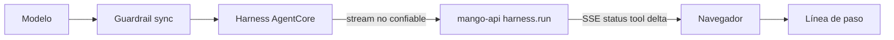

# Progreso en vivo del chat (evento SSE `status`): modelo de amenazas (v0.1)

> Fecha: 2026-10-02 · Skill: `security-threat-model`. Decisión que lo enmarca: D39 (guardrail síncrono). Amplía TM-012 (contenido no confiable del modelo) de `mango-architecture-threat-model.md`.
> Alcance: `apps/api/src/mango_api/harness.py` (`run`, `Phase`), el stream de `POST /api/chat` en `apps/api/src/mango_api/app.py`, `apps/web/src/api/chatEvents.ts`, `apps/web/src/hooks/chatState.ts`, `apps/web/src/components/chat/ChatMessage.tsx` y el contrato (`docs/specs/poc-api-contract.md`).
> Comprobado con tests locales y con una medición en el laboratorio (ConverseStream con el guardrail `Mango-poc-base` v1 en modo `sync`). **El evento `status` no está desplegado.**

## Executive summary

El usuario quiere ver qué hace el agente mientras espera. Con el guardrail síncrono (D39) Bedrock retiene **todo** lo que produce el modelo hasta que un bloque de la respuesta está revisado. El riesgo dominante de cualquier «razonamiento en vivo» es abrir un camino por el que texto del modelo llegue al navegador **sin pasar por el guardrail**.

Evidencia del laboratorio (2026-10-02, Sonnet 4.6, guardrail en `sync`):

- Sin razonamiento: `messageStart` y el primer texto llegan juntos a los 7,2 s; después, bloques de unos 1.000 caracteres.
- Con razonamiento extendido: 2.730 caracteres de `reasoningContent` llegaron **de golpe** a los 16,0 s, en la misma ráfaga que el primer bloque de 987 caracteres de respuesta. El razonamiento no cuenta para el bloque ni se entrega antes: no es «en vivo», y retrasa el primer bloque.
- `GuardrailStreamConfiguration` solo tiene identificador, versión, modo y trace: el tamaño del bloque no se puede configurar.
- La documentación de Bedrock lista qué evalúa el guardrail en Converse: `text` y `guardContent`. Los argumentos y resultados de tools no se evalúan. `reasoningContent` no aparece como evaluado.

Por eso lo construido es **progreso estructurado**: `mango-api` calcula una fase (`thinking`, `tool`, `tool_result`, `writing`) a partir de la forma del stream y la envía en un evento `status`. Controles:

- El evento no lleva texto del modelo. Su único campo libre es el nombre de la tool, y solo se envía si es una tool de la versión publicada del agente.
- `reasoningContent` no se reenvía nunca; un test lo fija.
- La fase es transitoria: no se guarda, no se audita y no entra en los logs.
- El cliente valida el evento con un esquema acotado, lo muestra como texto y trata una fase desconocida como «pensando».

D39 no cambia. No hay permisos, recursos ni costo nuevos.

## Scope and assumptions

- **Dentro:** el cálculo de la fase en `harness.run`, su envío por SSE y su presentación en el chat.
- **Fuera:** mostrar razonamiento del modelo o texto en bloques más pequeños (exigen cambiar D39; opciones evaluadas y descartadas por el usuario el 2026-10-02); el evento `tool` y el guardado de las tools del mensaje, que ya existían (ver TM-LP1, riesgo residual); la autorización del turno, el budget y la sesión del runtime (sin cambios).
- **Supuestos:**
  1. El harness de AgentCore reenvía los eventos del modelo con la forma de Converse (`contentBlockStart`, `contentBlockDelta`, `messageStop`). Comprobado contra el modelo de servicio de botocore (`HarnessContentBlockDelta` incluye `reasoningContent`) y con el laboratorio.
  2. El nombre de una tool en `toolUse.name` lo escribe el modelo. El harness solo ejecuta las de `allowedTools`, pero el evento de inicio puede traer un nombre inventado.
  3. El atacante relevante es quien controla contenido que el modelo lee (documentos, resultados de tools, el propio mensaje): inyección de prompt indirecta. No controla `mango-api` ni el harness.
  4. El navegador del usuario es de confianza para sus propios datos; lo que se protege es que el contenido no revisado no se muestre ni se ejecute.
- **Preguntas abiertas:** ninguna que cambie prioridades. Si más adelante se activa razonamiento extendido en algún agente, este modelo se revisa (TM-LP2).

## System model

### Primary components

| Componente | Qué hace | Evidencia |
|---|---|---|
| `harness.run` | Traduce el stream de `InvokeHarness` a eventos `delta`, `tool`, `status` y `error` | `apps/api/src/mango_api/harness.py` |
| `POST /api/chat` | Autoriza, reserva budget y reenvía los eventos como SSE | `apps/api/src/mango_api/app.py` (`chat`, `produce`, `sse`) |
| Guardrail base (modo síncrono) | Revisa la entrada y la salida de texto del modelo | `infra/lib/constructs/agent-platform.ts`, D39 |
| Cliente SSE y reducer | Valida cada evento (`zod`) y guarda la última fase del turno | `apps/web/src/api/chatEvents.ts`, `apps/web/src/hooks/chatState.ts` |
| Línea de paso del chat | Muestra la fase como texto mientras no hay respuesta | `apps/web/src/components/chat/ChatMessage.tsx` |

### Data flows and trust boundaries

- **Modelo → guardrail → harness.** Cruza texto, razonamiento y llamadas a tools. El guardrail revisa el texto; no revisa nombres ni argumentos de tools ni (según la evidencia) el razonamiento. Canal interno de AWS.
- **Harness → `mango-api`.** Cruza el stream de eventos. Canal: `InvokeHarness` (SigV4, rol de la tarea). `mango-api` trata el contenido como no confiable: del texto reenvía solo `delta.text`; del resto, solo la forma (qué bloque empezó).
- **`mango-api` → navegador.** Cruzan `status`, `tool`, `delta`, `done`, `error`. Canal: SSE sobre TLS detrás de CloudFront, con el access token verificado. El stream empieza después de autorizar (`UseAgent`) y reservar budget.
- **Evento → DOM.** El reducer guarda `{phase, tool?}`; React lo pinta como nodo de texto.

#### Diagram

## Assets and security objectives

| Activo | Por qué importa | Objetivo |
|---|---|---|
| Garantía de D39: nada sin revisar llega al usuario | Es la decisión que justifica la latencia actual | Integridad del control |
| Secretos y datos que el modelo ve (resultados de tools, historial) | Un canal lateral los sacaría sin pasar por el filtro de credenciales | Confidencialidad |
| Sesión del usuario en la SPA | Texto del modelo interpretado como marcado sería XSS | Integridad |
| Disponibilidad del stream | Un turno no debe poder inundar al cliente | Disponibilidad |
| Audit trail | Lo que se audita es lo que el agente hizo, no estados transitorios | Integridad |

## Attacker model

### Capabilities

- Inyectar instrucciones en contenido que el modelo lee (un resultado de tool, un documento, el mensaje del propio usuario).
- Hacer que el modelo emita llamadas a tools con nombres arbitrarios, o mucho texto de razonamiento si estuviera activado.
- Un usuario autenticado puede enviar turnos propios y observar su stream.

### Non-capabilities

- No controla `mango-api`, el harness ni la versión publicada del agente (la definición la fija el servidor, TM-I2).
- No puede hacer que el harness ejecute una tool fuera de `allowedTools`.
- No ve el stream de otro usuario (un `runtimeSessionId` por usuario y conversación, D39).

## Entry points and attack surfaces

| Superficie | Cómo se alcanza | Frontera | Notas | Evidencia |
|---|---|---|---|---|
| Stream del harness | Salida del modelo | Harness → `mango-api` | No confiable; solo se usa su forma | `harness.run` |
| `toolUse.name` | Lo escribe el modelo | Harness → `mango-api` → navegador | Hasta 64 caracteres sin revisar | `_display_tool_name` |
| `reasoningContent` | Solo si un agente activa razonamiento (hoy ninguno) | Harness → `mango-api` | Se descarta | `harness.run` |
| Evento `status` | Respuesta de `POST /api/chat` | `mango-api` → navegador | Esquema acotado en el cliente | `chatEvents.ts` |

## Top abuse paths

1. **Canal lateral por el nombre de la tool.** Una inyección pide al modelo «llamar» a una tool cuyo nombre es un secreto (una access key cabe en 64 caracteres) → el nombre viaja en el progreso sin pasar por el filtro de credenciales → el usuario (o quien mire su pantalla) lo ve.
2. **Razonamiento reenviado por descuido.** Alguien activa razonamiento extendido en un agente → un cambio futuro reenvía `reasoningContent` para «mostrar el pensamiento» → texto no revisado en pantalla, contra D39.
3. **Marcado en la línea de paso.** El modelo emite un nombre de tool con HTML → si la UI lo interpretara, XSS en el origen de la SPA.
4. **Inundación de eventos.** Un bucle del agente genera miles de cambios de fase → el cliente gasta memoria y CPU.
5. **Estado engañoso.** La fase dice «escribiendo» y el guardrail corta el turno → el usuario cree que hubo respuesta.

## Threat model table

| ID | Origen | Requisito | Acción | Impacto | Activos | Controles existentes | Huecos | Mitigación | Detección | Prob. | Impacto | Prioridad |
|---|---|---|---|---|---|---|---|---|---|---|---|---|
| TM-LP1 | Inyección de prompt | El modelo emite un `toolUse` con nombre inventado | Usar el nombre de la tool como canal de texto sin revisar | Hasta 64 caracteres fuera del guardrail (p. ej. una credencial) | D39, secretos | `status` solo nombra tools de la versión publicada (`known_tools` en `harness.run`); si no, la fase va sin nombre. Test `test_progress_only_names_tools_of_the_published_version` | El evento `tool`, anterior a este cambio, sí envía, guarda y audita el nombre tal cual | **Recomendado (fuera de este PR):** aplicar el mismo filtro al evento `tool` y al nombre guardado | `agent.completed` lista las tools: un nombre fuera del catálogo del agente es una señal | low | medium | **low** (residual en `tool`: **medium**) |
| TM-LP2 | Cambio futuro o configuración de un agente | Razonamiento extendido activado | Reenviar `reasoningContent` al cliente | Texto del modelo sin revisar en pantalla | D39 | `harness.run` solo lee `delta.text`; test `test_reasoning_of_the_model_is_never_forwarded`; el contrato lo prohíbe; `build_request` no activa razonamiento | Nada impide que una versión de agente lo active por `additionalParams` en el futuro | Si se quiere razonamiento visible: decisión nueva en §8 y pasar el texto por `ApplyGuardrail` antes de enviarlo | Test en CI | low | high | **medium** |
| TM-LP3 | Modelo o API comprometida | Campo `tool` con marcado | XSS por la línea de paso | Ejecución en el origen de la SPA | Sesión | React escapa el texto; sin `dangerouslySetInnerHTML`; `zod` limita `phase` (32) y `tool` (128); CSP `script-src 'self'` y Trusted Types; test con `<b>` en `ChatPage.test.tsx` | Ninguno conocido | Mantener la línea de paso como texto plano; no pasarla por el render de Markdown | Reportes de CSP | low | high | **low** |
| TM-LP4 | Agente en bucle | Muchos cambios de fase | Inundar el stream | Consumo de memoria y CPU del cliente | Disponibilidad | Se emite solo cuando la fase cambia; el turno está acotado por `maxIterations` y `timeoutSeconds`; el cliente guarda una sola fase y limita cada evento a 1 MB | Ninguno conocido | — | — | low | low | **low** |
| TM-LP5 | — | El guardrail corta tras `writing` | El usuario interpreta mal el estado | Confusión, sin fuga | — | La fase solo se muestra mientras no hay texto; el turno termina con `done` o `error`, que mandan | La UI no distingue «cortado por el guardrail» (ya era así) | — | — | low | low | **low** |
| TM-LP6 | Usuario sin acceso | Llamar a `POST /api/chat` | Aprender algo del agente por el progreso | Fuga de nombres de tools | Configuración del agente | El stream empieza después de `require(UseAgent)` y de reservar budget; sin acceso no hay ningún evento | Ninguno | — | `policy.decision` denegada | low | low | **low** |

## Criticality calibration

- **high:** texto del modelo sin revisar mostrado de forma sistemática (reenviar razonamiento o texto antes del guardrail).
- **medium:** un canal acotado de texto sin revisar (el nombre de una tool), o un control que depende de que nadie cambie una línea.
- **low:** confusión de estado, ruido en el stream, fugas de información que el usuario autorizado ya ve por otro evento.

## Focus paths for security review

| Ruta | Por qué |
|---|---|
| `apps/api/src/mango_api/harness.py` (`run`) | Único punto que decide qué sale del stream no confiable; cualquier campo nuevo reenviado se revisa contra D39 |
| `apps/api/tests/test_harness.py` | Tests que fijan TM-LP1 y TM-LP2 |
| `apps/web/src/components/chat/ChatMessage.tsx` | La línea de paso debe seguir siendo texto plano |
| `apps/web/src/api/chatEvents.ts` | Límites del evento y compatibilidad hacia delante |

## Supuestos sin validar con el usuario

- El evento `status` no se ha visto todavía contra el harness real: `tests/e2e/chat_latency.py` lo comprueba tras el despliegue (tiempos de la primera fase, de la primera tool y del primer bloque).
- Que el guardrail no evalúa `reasoningContent` se infiere de la tabla de contenido evaluado de la documentación y de la medición (el razonamiento no cuenta para el bloque). No hay una frase de AWS que lo diga de forma explícita; el diseño no depende de ello porque el razonamiento no se reenvía.
