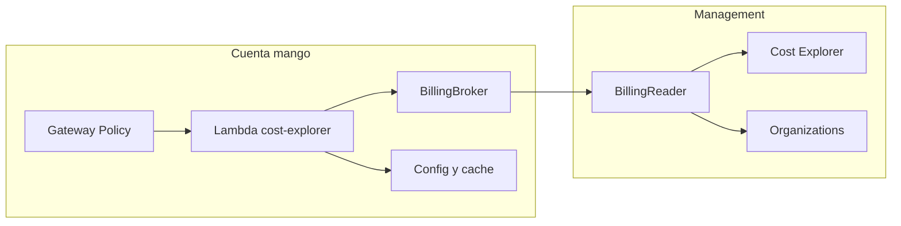

# Conector Cost Explorer + `mango-aws` (broker): modelo de amenazas (v0.1)

> Fecha: 2026-09-28 · Skill: `security-threat-model`.
> El contexto de servicio (exposición a internet, datos sensibles, multi-cuenta) quedó validado con el usuario en `mango-architecture-threat-model.md` (2026-09-28). Aquí se reutiliza y se acota a este componente.
> Alcance: `connectors/cost-explorer/` (Lambda target del AgentCore Gateway), `packages/py/mango-aws/` (broker, session policies, `SourceIdentity`) y los roles `Mango-<ns>-BillingBroker` (cuenta mango) y `Mango-<ns>-BillingReader` (management).

## Executive summary

El conector es el único componente del MVP que toca datos de facturación de toda la organización. El riesgo central es que un usuario obtenga costos de cuentas fuera de su área (TM-003 de la arquitectura), ya sea porque el LLM elige las cuentas, porque la identidad del usuario llega por un canal no confiable, o porque una API de Cost Explorer devuelve datos de toda la organización cuando no se filtra.

Controles clave:
- identidad del usuario tomada **solo** de un canal verificado (nunca de los argumentos de la tool);
- filtro `LINKED_ACCOUNT` **impuesto** por el conector sobre toda consulta;
- tools de compra/cobertura restringidas a `finops-central`;
- session policy por llamada y `SourceIdentity` en el `AssumeRole`.

## Scope and assumptions

- **En alcance:** entrada del Gateway a la Lambda, cálculo del alcance de cuentas, construcción de consultas de Cost Explorer/Organizations, cadena `AssumeRole` y respuesta al agente.
- **Fuera de alcance:** autenticación del usuario en Cognito y la Policy L2 del Gateway (tienen sus propios modelos). Aquí se asumen como controles previos, no como sustitutos.
- **Supuestos:**
  - El Gateway entrega a la Lambda una identidad de usuario verificable. El mecanismo exacto se está verificando en la investigación de AgentCore; ver TM-C1.
  - La Lambda no tiene acceso a internet más allá de las APIs de AWS.

## System model

### Primary components

- **Lambda `cost-explorer`:** recibe `tool name + arguments` del Gateway. Rol `Mango-<ns>-CostExplorerConnector`.
- **`mango-aws`:** `AssumeRole` al broker con `SourceIdentity=<user>` y session tags; el broker asume `BillingReader` con una session policy mínima.
- **`BillingReader` (management):** lista exacta de acciones de lectura (`BILLING_READER_DATA_ACTIONS` en `infra/lib/stacks/payer-stack.ts`) más el inventario de Organizations. Desde el 2026-10-01 (C3b) la lista incluye lo que lee el pack `aws-billing`: más `ce:Get*`, `budgets:ViewBudget` (solo presupuestos de la pagadora) lecturas de Compute Optimizer y Cost Optimization Hub y, por decisión del usuario del 2026-10-01, ocho acciones de **inventario de la cuenta pagadora** que Compute Optimizer exige (de EC2, Auto Scaling, RDS, ECS y la concurrencia aprovisionada de Lambda, con nombres exactos). `lambda:ListFunctions` quedó fuera a propósito: devuelve las variables de entorno de las funciones. **El conector no cambia:** cada llamada suya sigue asumiendo el rol con una session policy de una sola acción (las seis de siempre), así que un usuario del conector, central o de área, no alcanza nada nuevo. Lo que crece es TM-C4. Detalle en `aws-billing-pack-threat-model.md` (TM-BL11).
- **Tabla de configuración (DynamoDB):** mapeo `business_unit → OUs` y cache de consultas.

### Data flows and trust boundaries

- **Gateway → Lambda.**
  - Datos: nombre de tool, argumentos (**generados por el LLM, no confiables**) e identidad del usuario (**debe venir de un canal verificado**).
  - Canal: invocación Lambda del servicio AgentCore.
  - Garantías: la resource policy de la Lambda solo permite al Gateway de la instalación (`aws:SourceArn`).
- **Lambda → broker → BillingReader.**
  - Datos: credenciales STS.
  - Garantías: trust `PrincipalArn` + `PrincipalOrgID` + `SourceIdentity` obligatorio; session policy por llamada.
- **Lambda → Cost Explorer / Organizations.**
  - Datos: costos por cuenta y estructura de la organización.
  - Garantías: el filtro de cuentas se impone en el código del conector.
- **Lambda → agente (respuesta).**
  - Datos: cifras y nombres de cuentas y servicios.
  - Garantías: la respuesta se trata como no confiable aguas abajo (guardrail sobre la salida de tools).

#### Diagram

## Assets and security objectives

| Asset | Why it matters | Security objective (C/I/A) |
|---|---|---|
| Costos por cuenta, servicio y tag | Información financiera sensible y reveladora de la actividad por área | C |
| Estructura de la organización (cuentas, OUs, nombres) | Reconocimiento para un atacante | C |
| Credenciales STS de `BillingReader` | Lectura de facturación de toda la organización | C |
| Mapeo área → OUs | Define el alcance de cada usuario | I |
| Presupuesto de API de Cost Explorer (≈ USD 0,01/request) | Costo y throttling | A |

## Attacker model

### Capabilities
- Usuario autenticado con rol `bu-lead` que intenta ver otras áreas.
- Contenido que el agente leyó y que intenta inyectar argumentos (cuentas, rangos enormes, `group_by` masivos).
- Un LLM que alucina IDs de cuenta.

### Non-capabilities
- Invocar la Lambda directamente: la resource policy la limita al Gateway.
- Modificar el mapeo área → OUs: solo `mango-admin` vía la API con AVP.

## Entry points and attack surfaces

| Surface | How reached | Trust boundary | Notes | Evidence (repo path / symbol) |
|---|---|---|---|---|
| Handler de la Lambda | Gateway → Lambda | Agente → conector | Argumentos del LLM | `connectors/cost-explorer/` |
| Identidad del usuario | Gateway (claims) → Lambda | Identidad → autorización | Debe ser verificable | Pendiente de la investigación de AgentCore |
| `AssumeRole` del broker | Lambda → STS | Cuenta mango → management | Session policy + `SourceIdentity` | `packages/py/mango-aws/` |

## Top abuse paths

1. **Cuentas elegidas por el LLM.** Un `bu-lead` pide la cuenta X de otra área, el LLM la pasa en `account_ids` y el conector no la intersecta con el alcance. Impacto: fuga entre áreas.
2. **Consulta sin filtro.** Sin `account_ids`, el conector llama `GetCostAndUsage` sin filtro, y la payer devuelve toda la organización. Impacto: fuga entre áreas.
3. **Identidad suplantada.** El conector lee el usuario o rol desde los argumentos (p. ej. `user_role="finops-central"`). Impacto: escalada a visibilidad total.
4. **`GROUP_BY` de otra dimensión que revela cuentas.** Si el filtro no se aplica, agrupar por `LINKED_ACCOUNT` lista todas las cuentas. Si el filtro se aplica, solo se ven las permitidas.
5. **Abuso de costo o throttling.** Muchas consultas con granularidad `DAILY` sobre 13 meses. Impacto: costo de API y throttling de Cost Explorer.

## Threat model table

| Threat ID | Threat source | Prerequisites | Threat action | Impact | Impacted assets | Existing controls (evidence) | Gaps | Recommended mitigations | Detection ideas | Likelihood | Impact severity | Priority |
|---|---|---|---|---|---|---|---|---|---|---|---|---|
| TM-C1 | Usuario o LLM | Canal de identidad no verificado | Suplantar identidad o rol en los argumentos | Visibilidad total | Costos | Policy L2 en el Gateway | Mecanismo de claims por verificar | La identidad sale **solo** del contexto verificado del Gateway (claims del JWT validado o inyectados por un interceptor). Los argumentos jamás llevan identidad; si traen campos de identidad, se rechazan. Fail-closed si falta la identidad | Evento `tool.call` con usuario y alcance; alerta si falta la identidad | medium | high | high |
| TM-C2 | Usuario bu-lead / injection | Tool con `account_ids` | Pedir cuentas fuera del alcance | Fuga entre áreas | Costos | Diseño D10/TM-003 | — | `effective = requested ∩ allowed`. Si la intersección está vacía se rechaza con un error explícito, sin consultar. Filtro `LINKED_ACCOUNT` **siempre** presente, incluso si no se pide nada. Tests de propiedad | Auditoría del alcance aplicado frente al pedido | medium | high | high |
| TM-C3 | Usuario bu-lead | Tools org-wide (Savings Plans purchase/coverage) | Obtener datos agregados de toda la organización | Fuga parcial | Costos | Policy L2 | La API no filtra por cuenta en todos los casos | Solo `finops-central`, verificado en el conector además de en la Policy (defensa en profundidad) | — | low | medium | medium |
| TM-C4 | Conector comprometido | Credenciales del rol del conector | Asumir `BillingReader` sin límites | Lectura de facturación total; desde C3b también presupuestos, reservas, costos por recurso y recomendaciones de optimización, e inventario de la pagadora, sin las variables de entorno de sus funciones de Lambda (TM-BL11) | Credenciales | Trust `PrincipalArn` + `PrincipalOrgID` | — | Session policy por llamada, limitada a la acción concreta. `BillingReader` solo con lectura. Duración de sesión de 15 min | CloudTrail de la management: `AssumeRole` con `SourceIdentity` | low | high | medium |
| TM-C5 | Usuario / injection | Rangos o granularidad sin límite | Consultas costosas o masivas | Costo y throttling | Presupuesto de API | Cache de 1 h (spec §5) | — | Validación estricta de argumentos (Pydantic): rango ≤ 13 meses, `DAILY` ≤ 92 días, máximo 2 `group_by`, enumeraciones cerradas. Límite de llamadas por sesión | Métrica de requests a Cost Explorer por usuario | medium | low | medium |
| TM-C6 | Contenido o LLM | Respuesta del conector | Nombres de cuentas y tags con texto de injection vuelven al agente | Injection indirecta | — | Guardrail sobre la salida de tools | — | Devolver datos estructurados (JSON). Truncar y normalizar nombres. Nunca devolver texto libre de fuentes externas | — | low | medium | low |
| TM-C7 | Usuario bu-lead | `list_accounts_in_scope` con área y OUs (2026-09-29) | Conocer la estructura de la organización más allá de su área | Reconocimiento | Estructura de la organización | Alcance por cuentas (TM-C2) | — | Solo se devuelven cuentas del alcance del usuario, con los nombres de **sus** OUs (la ruta desde la raíz) y las áreas que las contienen; nunca OUs o cuentas ajenas. Nombres truncados a 64 caracteres y tratados como contenido no confiable por el agente | `tool.call` auditado | low | low | low |

## Criticality calibration

- **Critical:** credenciales de `BillingReader` expuestas fuera de la cuenta mango.
- **High:** un `bu-lead` ve costos de otra área (TM-C1, TM-C2).
- **Medium:** datos agregados de la organización visibles a no-central (TM-C3); abuso de costo de la API (TM-C5).
- **Low:** metadata de cuentas propias en errores.

## Focus paths for security review

| Path | Why it matters | Related Threat IDs |
|---|---|---|
| `connectors/cost-explorer/src/**/scope.py` | Cálculo del alcance e intersección | TM-C1, TM-C2 |
| `connectors/cost-explorer/src/**/handler.py` | Extracción de identidad y validación de argumentos | TM-C1, TM-C5 |
| `packages/py/mango-aws/` | Session policy y `SourceIdentity` | TM-C4 |
| `infra/lib/stacks/payer-stack.ts` | Permisos y trust de `BillingReader` | TM-C4 |

## Quality check

- [x] Entry points cubiertos (handler, identidad, AssumeRole).
- [x] Cada trust boundary aparece en al menos una amenaza.
- [x] Supuestos explícitos (canal de identidad por verificar).
