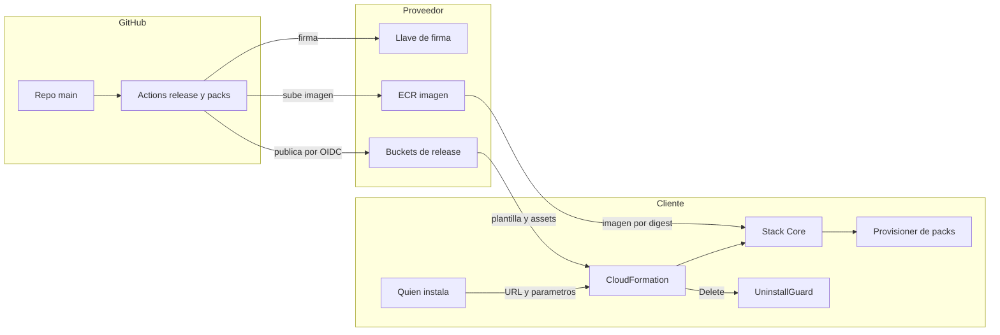

# Distribución para clientes (release, instalación y desinstalación): modelo de amenazas (v0.1)

> Fecha: 2026-10-03 · Skill: `security-threat-model`. Diseño: `docs/specs/customer-distribution.md`. Decisiones: D3, D8, D9, D25, D36, D43, D48; D69 (2026-10-05: assets compartidos entre releases, TM-D20 a TM-D22).
> **Escrito antes de construir; el componente ya existe (D58).** Están construidos la cuenta del proveedor (`infra/lib/stacks/provider-stack.ts`), la publicación (`deployment/dist.py`, `.github/workflows/release.yml`) y `UninstallGuard` (`infra/lib/constructs/uninstall-guard.ts`). En las tablas, «controles existentes» son los que había en el repo al escribir el modelo, y los del diseño van como mitigaciones recomendadas; cuáles se construyeron está en «Cuenta del proveedor: construida y revisada», al final.
> Alcance: `infra/` (synthesizer, plantillas con parámetros), `deployment/` (`dist`, `provider/`, scripts), `.github/workflows/` (`release.yml`, `packs.yml`), verificación de firmas (`packages/py/mango-packs`, `functions/provisioner`, `apps/api`), `UninstallGuard`.
> Decidido por el usuario el 2026-10-03: distribución como Innovation Sandbox (buckets y ECR en una cuenta de AWS del proveedor, fuera de la organización del cliente); firma de packs y del manifiesto con una llave KMS en la cuenta del proveedor (se descarta la firma sin llave); lectura por organización del cliente; red de packs en un stack propio; instalaciones solo de tipo `customer`; parámetros mínimos y el resto en la aplicación.

## Executive summary

Este componente decide **qué código corre en la cuenta de cada cliente**. Una release comprometida llega a todos a la vez, con los permisos de quien instala (`CAPABILITY_NAMED_IAM`, roles en la cuenta de gestión). Es el riesgo más alto del producto.

Temas dominantes:

1. **Compromiso de la cadena de publicación:** quien controle el workflow de release, el rol de publicación o los buckets del proveedor entrega plantillas o código alterados.
2. **Sustitución de artefactos ya publicados:** cambiar una plantilla, un zip o la imagen de una versión que los clientes ya usan o van a reinstalar.
3. **Llave de firma en la cuenta del proveedor:** quien pueda asumir el rol de firma (el workflow de este repo con su entorno) firma packs y manifiestos. La llave pública viaja en la release.
4. **Parámetros de instalación:** un valor mal puesto (cuenta de gestión, organización, primer admin, dominios de registro) abre confianza a quien no debe.
5. **`UninstallGuard`:** un recurso del stack con permiso para borrar todos los agentes y packs. Si se dispara fuera de una desinstalación, destruye la instalación.
6. **Dependencia del proveedor en runtime:** la imagen de `mango-api` se descarga del ECR del proveedor cada vez que arranca una tarea.

## Scope and assumptions

**En alcance:** construcción y publicación de la release, cuenta del proveedor, lectura desde las cuentas del cliente, instalación y actualización por CloudFormation, firma y verificación de packs y del manifiesto, desinstalación y purga.

**Fuera de alcance:** el comportamiento de Mango ya instalado (`mango-architecture-threat-model.md`), el contenido de los packs (`mcp-pack-pipeline-threat-model.md`, que habrá que actualizar por el cambio de firma), el acceso de soporte (§4.11).

**Supuestos:**

- El repo es privado, de una cuenta personal de GitHub, con pocos colaboradores. `main` está protegida y los entornos `release` y `pack-signing` exigen aprobación. **No comprobado**: la configuración de GitHub no está en el repo.
- Los clientes son pocos y conocidos; cada uno entrega el id de su organización.
- La cuenta del proveedor solo tiene esto y la administra una persona, con MFA.
- Quien instala en el cliente tiene permisos de administrador en la cuenta donde lanza cada stack.
- El laboratorio se comporta como un cliente: nada del proveedor vive en su organización.

**Respuestas del usuario (2026-10-03):** lectura por organización del cliente; **sin** firma sin llave (nada en registros públicos): llave KMS en la cuenta del proveedor; un único aprobador de los entornos por ahora (el usuario). TM-D7 y TM-D9 dejan de aplicar y se conservan como registro de por qué se descartó Sigstore.

## System model

### Primary components

- **Repositorio de GitHub** (privado): código, `release.yaml`, `packs/signing-key.pub` (llave pública de firma).
- **GitHub Actions:** `packs.yml` (construye y firma packs), `release.yml` (construye, firma el manifiesto y publica).
- **Cuenta del proveedor:** bucket global de plantillas, buckets regionales de assets, ECR de la imagen, llave KMS de firma, roles `Mango-provider-release-publisher` y `Mango-provider-pack-signing` (OIDC), alarmas.
- **Cuentas del cliente:** gestión (`Payer`, `OrgAccess`), Mango (`Core`), miembros (`Member` por StackSet).
- **Verificadores:** `verify-release.sh` (quien instala), provisioner de packs y `mango-api` (firma de packs, sin red).
- **`UninstallGuard`:** Lambda de `Core` invocada por CloudFormation al borrar el stack.

### Data flows and trust boundaries

- Desarrollador → GitHub (`main`): código y definición de la release. HTTPS, autenticación de GitHub, revisión de PR. Sin validación automática del contenido más allá del CI.
- GitHub Actions → KMS del proveedor: hash de la declaración o del manifiesto a cambio de una firma. OIDC, rol limitado a `kms:Sign` sobre una llave.
- GitHub Actions → cuenta del proveedor: plantillas, zips, imagen. OIDC → `AssumeRoleWithWebIdentity`, limitado a repo, rama y entorno. Escritura condicional (`If-None-Match`).
- Cuenta del proveedor → principal del cliente: plantillas y assets por HTTPS de S3; imagen por ECR. Autorización por `aws:PrincipalOrgID`. Sin listado.
- Persona que instala → CloudFormation del cliente: URL de plantilla y parámetros. IAM del cliente. Validación por `AllowedPattern` y `Rules`.
- CloudFormation → recursos del cliente: crea IAM, red, datos. Con las credenciales de quien instala.
- CloudFormation → `UninstallGuard`: evento `Delete`. Solo CloudFormation puede invocarla.
- Release (dentro de la cuenta del cliente) → provisioner de packs: zip, declaración, bundle de firma, raíz de confianza. Verificación sin red.

#### Diagram

## Assets and security objectives

| Asset | Why it matters | Security objective (C/I/A) |
|---|---|---|
| Plantillas de la release | Definen IAM, trusts y red en las cuentas del cliente, incluida la de gestión | I |
| Assets (Lambdas, SPA, packs) e imagen | Código que corre con los roles de Mango | I, C (repo privado) |
| Rol `Mango-provider-release-publisher` y workflow `release.yml` | Quien los controla publica para todos los clientes | I |
| Llave KMS de firma, sus roles y `packs/signing-key.pub` | Raíz de confianza de packs y manifiesto | I |
| Lista de organizaciones cliente | Decide quién lee el producto; es además un dato comercial | C, I |
| Parámetros de instalación | Fijan en quién confía cada trust y quién es el primer admin | I |
| Agentes, packs y datos de la instalación | Lo que `UninstallGuard` y la purga pueden borrar | A, I |
| Evidencia de auditoría (bucket con Object Lock) | No debe poder borrarse con la desinstalación sin un acto explícito | I, A |
| Disponibilidad del ECR y los buckets del proveedor | Sin ellos no se instala ni arrancan tareas nuevas | A |

## Attacker model

### Capabilities

- **Colaborador malicioso o cuenta de GitHub comprometida** con permiso de escritura en el repo: abre PR, y quizá ejecuta workflows en ramas.
- **Dependencia comprometida** (npm, PyPI, una action de GitHub) que corre dentro del build.
- **Atacante con credenciales de la cuenta del proveedor** (el administrador víctima de phishing, o el rol de publicación robado durante una ejecución).
- **Cliente o ex cliente** con lectura legítima de los buckets, o un principal cualquiera de su organización.
- **Persona de la cuenta del cliente** con permiso para actualizar o borrar stacks, pero no administradora de Mango.
- **Quien instala, por error:** parámetros equivocados.

### Non-capabilities

- No extrae la llave privada de KMS ni rompe ECDSA P-256.
- No controla AWS ni GitHub como plataformas.
- Un usuario de la aplicación (sin acceso a la consola de AWS del cliente) no alcanza nada de este componente: no hay ningún endpoint de `mango-api` que instale, actualice o desinstale (D21).
- Internet anónimo no lee los buckets ni el ECR (con lectura por organización).

## Entry points and attack surfaces

| Surface | How reached | Trust boundary | Notes | Evidence (repo path / symbol) |
|---|---|---|---|---|
| Workflow `release.yml` | Tag en `main` | GitHub → proveedor | Por construir. Modelo: job `sign` de `packs.yml` | `.github/workflows/packs.yml` |
| Workflow `packs.yml`, job `sign` | Merge a `main` | GitHub → KMS del proveedor | Firma con KMS por OIDC; la llave y el rol se mudan a la cuenta del proveedor | `.github/workflows/packs.yml`, `deployment/pack-builder/src/mango_pack_builder/kms.py` |
| Dependencias del build | `pnpm install`, `uv sync`, `docker build` | Internet → CI | Lockfiles con hashes; actions fijadas por SHA | `uv.lock`, `pnpm-lock.yaml`, `apps/api/Dockerfile` |
| Buckets y ECR del proveedor | API de S3 y ECR | Proveedor → cliente | Por construir | `deployment/provider/` (nuevo) |
| `TemplateURL` y parámetros de stack | Consola o CLI del cliente | Persona → CloudFormation | Hoy no hay parámetros: todo se hornea | `infra/bin/mango.ts`, `infra/lib/config/schema.ts` |
| Custom resources de siembra | CloudFormation | CloudFormation → DynamoDB | Put-if-absent, rol limitado por partición | `infra/lib/constructs/governance.ts` (`seedSettings`), `release-agents.ts` |
| Verificación de packs | Provisioner, `mango-api`, `dist` | Release → runtime | Hoy ECDSA con llave pública en la plantilla | `infra/lib/config/pack-release.ts`, `packages/py/mango-packs/src/mango_packs/signing.py` |
| `UninstallGuard` | Evento `Delete` de CloudFormation | CloudFormation → Lambda | Por construir; reutiliza el deprovisioner | `infra/lib/constructs/deprovisioner.ts`, `functions/provisioner/src/mango_provisioner/deprovision` |
| `purge-retained.sh` | Persona con credenciales de la cuenta | Persona → datos retenidos | Por construir | `deployment/` |

## Top abuse paths

1. **Release maliciosa por el workflow.** Atacante con escritura en el repo → logra un merge a `main` o un tag que dispara `release.yml` → el job publica plantillas con un trust de más en `Payer` → cada cliente que instala o actualiza le da acceso a su cuenta de gestión.
2. **Dependencia envenenada en el build.** Una action o un paquete comprometido corre en el job que construye → altera un zip de Lambda antes de calcular el manifiesto → el manifiesto firmado «certifica» código alterado.
3. **Sustitución en el bucket.** Atacante con credenciales de la cuenta del proveedor → sobrescribe `Core.template.json` de una versión publicada → el próximo `CreateStack` o `UpdateStack` de esa versión instala su plantilla.
4. **Imagen retirada o cambiada.** El mismo atacante borra la imagen o cambia la política del repositorio → las tareas de `mango-api` de todos los clientes no pueden reemplazarse → caída escalonada.
5. **Firma cruzada.** Quien controla el rol de firma de packs firma un manifiesto de release (o al revés) → si el verificador no distingue el tipo de lo firmado, un rol con menos controles vale para publicar.
6. **Parámetro de confianza equivocado.** Quien instala pone en `Payer` un `MangoAccountId` que no es el suyo → `Mango-<ns>-BillingReader` confía en otra cuenta (acotado por `aws:PrincipalOrgID` y `aws:PrincipalArn`).
7. **Primer admin ajeno.** `FirstAdminEmail` mal escrito → Cognito envía la contraseña temporal a un tercero, que entra como admin único.
8. **Borrado por reemplazo.** Una release cambia una propiedad o el id lógico de `UninstallGuard` → `UpdateStack` lo reemplaza → el `Delete` del recurso viejo borra todos los agentes y packs de una instalación en producción.
9. **Desinstalación como ataque.** Persona del cliente con `cloudformation:DeleteStack` pero sin rol en Mango → borra `Core` → agentes y packs desaparecen; con la purga, también los datos y la evidencia.
10. **Llave pública cambiada.** `packs/signing-key.pub` se cambia en un PR poco revisado por la llave del atacante → todo lo que él firme verifica.

## Threat model table

| Threat ID | Threat source | Prerequisites | Threat action | Impact | Impacted assets | Existing controls (evidence) | Gaps | Recommended mitigations | Detection ideas | Likelihood | Impact severity | Priority |
|---|---|---|---|---|---|---|---|---|---|---|---|---|
| TM-D1 | Colaborador o cuenta de GitHub comprometida | Escritura en el repo o capacidad de crear tags | Dispara `release.yml` con contenido alterado | Código o IAM maliciosos en todos los clientes | Plantillas, assets, rol de publicación | Actions por SHA; entorno `pack-signing` para el job de firma (`packs.yml`) | No hay workflow de release ni reglas escritas para `main` y tags | Entorno `release` con aprobación manual; el rol confía solo en `repo:…:environment:release`; tags protegidos; el job que publica no ejecuta código del PR; `CODEOWNERS` sobre `.github/`, `deployment/provider/`, `packs/signing-key.pub` | Aviso por cada ejecución de `release.yml`; CloudTrail del proveedor: `AssumeRoleWithWebIdentity` fuera de una release | Media | Alta | **critical** |
| TM-D2 | Dependencia o action comprometida | Corre en el job de build | Altera un asset antes del manifiesto | El manifiesto firmado cubre código alterado | Assets, imagen | Lockfiles con hashes (`uv.lock`, `pnpm-lock.yaml`), wheels binarios (`bundle-python.sh`), `mise run audit` | El build no es verificable por un tercero; imagen base por tag (`python:3.13-slim`) | Build sin credenciales y job de publicación aparte que solo recibe artefactos; imágenes base por digest; builds deterministas (zips con orden y fechas fijas) para poder reconstruir y comparar; SBOM de la imagen | Reconstrucción periódica y comparación de hashes con el manifiesto | Baja | Alta | high |
| TM-D3 | Atacante con credenciales del proveedor | Administrador comprometido o rol robado | Sobrescribe o borra una clave publicada | Instalación de contenido alterado; reinstalaciones rotas | Plantillas, assets | Ninguno (no existe) | Todo | Política de bucket: `PutObject` solo con `s3:if-none-match`; versionado + Object Lock; el rol de publicación sin `DeleteObject*` ni `PutBucketPolicy`; manifiesto firmado y `verify-release.sh` antes de `CreateStack`; MFA y sin llaves de acceso en la cuenta | EventBridge sobre `PutBucketPolicy`, `DeleteObjectVersion`, `PutObjectRetention`; inventario diario comparado con los manifiestos | Baja | Alta | high |
| TM-D4 | El mismo | Ídem | Borra la imagen o cambia la política del repositorio | `mango-api` no reemplaza tareas en ningún cliente | Disponibilidad | Ninguno | Dependencia en runtime del proveedor | Tags inmutables; el rol de publicación no borra; parámetro `ApiImageRepository` para copiar la imagen a un ECR del cliente; documentarlo como dependencia | Alarma del cliente sobre tareas que no arrancan (`CannotPullContainerError`) al topic `Mango-<ns>-Alerts` | Baja | Media | medium |
| TM-D5 | Atacante con acceso a un rol de firma | Puede ejecutar el workflow con el entorno, o robar la sesión del rol | Firma un pack o un manifiesto ajeno; o usa la firma de un tipo como si fuera del otro | Pack o release ajenos aceptados | Llave de firma | Rol con trust por repo y entorno, solo `kms:Sign`; el job de firma no ejecuta código del pack; llave pública fija y catálogo por digest en la plantilla (`packs.yml`, `pack-release.ts`, D43); reglas de alerta de uso indebido | La llave vive hoy en la cuenta de gestión del cliente simulado; el manifiesto no se firma | Mudar llave, roles y alertas a la plantilla del proveedor; `payload_type` distinto para packs y manifiesto, comprobado por cada verificador; roles separados (el de packs no publica); política de la llave sin `kms:*` para administradores salvo gestión | Alertas de `kms:Sign` fuera de una ejecución de workflow; CloudTrail del proveedor | Baja | Alta | high |
| TM-D6 | PR malicioso o descuidado | Revisión débil | Cambia `packs/signing-key.pub` | Todo lo que firme el atacante verifica | Raíz de confianza | Revisión de PR | Sin protección específica | `CODEOWNERS` sobre `packs/signing-key.pub`; test que compara su huella con la de la llave del proveedor publicada en el runbook; `dist` falla si los packs no verifican con ella | Diff de la llave marcado en CI | Baja | Alta | medium |
| TM-D7 | (No aplica: firma sin llave descartada) | n/a | Dependencia de Sigstore para firmar y envejecimiento de su raíz | n/a | n/a | n/a | n/a | Motivo adicional del descarte | n/a | n/a | n/a | low |
| TM-D8 | Cliente, ex cliente o principal de su organización | Estar en la lista de lectura | Descarga el producto completo; un ex cliente sigue leyendo | Fuga del código (repo privado) | Assets, imagen, lista de clientes | Ninguno | Baja de clientes no definida | Lectura por `aws:PrincipalOrgID`; sin `ListBucket`; procedimiento de baja (quitar de la lista); aceptar que un cliente legítimo tiene el código que instala | Access logs del bucket: lecturas de organizaciones dadas de baja (denegadas) | Media | Baja | low |
| TM-D9 | (No aplica: firma sin llave descartada) | n/a | El registro público de Sigstore guardaría repo, workflow, rama y SHA para siempre | Divulgación permanente de metadatos | Confidencialidad del repo | n/a | n/a | Motivo del descarte (usuario, 2026-10-03) | n/a | n/a | n/a | low |
| TM-D10 | Quien instala (error) o atacante que le pasa valores | Parámetros de `Payer`, `OrgAccess` o `Core` | `MangoAccountId`, `OrganizationId` o `ManagementAccountId` equivocados | Trust hacia otra cuenta, o instalación que no funciona | Trusts cross-account | Trust con `AccountPrincipal` + `aws:PrincipalArn` + `aws:PrincipalOrgID` + `SourceIdentity` (`payer-stack.ts`, `member-stack.ts`) | Hoy los valores se validan al sintetizar (zod), no al instalar | `AllowedPattern` en cada parámetro; `Rules`: cuenta de gestión ≠ cuenta Mango, la cuenta Mango nunca es objetivo; `OrganizationId` siempre en la condición del trust; prueba de conectividad tras instalar | Ajustes › Conectividad muestra la cadena rota | Media | Media | medium |
| TM-D11 | Quien instala (error) | `FirstAdminEmail` o `SecondAdminEmail` ajeno | Un tercero recibe la contraseña temporal | Admin único de la instalación en manos ajenas | Primer admin | MFA obligatorio; contraseña temporal de 3 días (`identity.ts`) | El primer admin registra su TOTP sin segundo control | `AllowedPattern`; runbook: confirmar el correo antes de lanzar; el correo debe ser de `SignUpDomains` (`Rules` no puede comparar: lo comprueba un custom resource o el runbook); auditar el primer ingreso | Evento de primer ingreso de admin al topic de alertas | Baja | Alta | medium |
| TM-D12 | Quien instala | `SignUpDomains` con un dominio público | Cualquiera se registra | Cuentas sin rol (deny por defecto), ruido, costo de Cognito Plus | Directorio | Lista de dominios públicos en zod (`schema.ts`); sin grupo no hay acceso (D20) | La lista se aplica al sintetizar: con parámetros deja de aplicarse | Llevar la lista a la Lambda *pre sign-up* (rechaza aunque el parámetro lo permita) y a un custom resource que falle el stack | Métrica de registros por dominio | Media | Baja | low |
| TM-D18 | AgentCore retiene ENI | Packs habilitados poco antes de desinstalar | El borrado de la red de packs falla durante horas | Stack `PackNetwork` en `DELETE_FAILED`; reinstalación con el mismo namespace bloqueada | Disponibilidad de la reinstalación | Red de packs estática y aislada (`pack-network.ts`, D54) | Hoy bloquea el borrado de `Core` entero | Stack propio `Mango-<ns>-PackNetwork` importado por `Core`; runbook: repetir el borrado | Estado del stack | Media | Baja | low |
| TM-D13 | Release con un cambio en `UninstallGuard` | `UpdateStack` que reemplaza el recurso | CloudFormation envía `Delete` al recurso viejo | Se borran todos los agentes y packs de una instalación viva | Agentes, packs | Ninguno | El recurso no existe | El handler solo actúa si `DescribeStacks` dice `DELETE_IN_PROGRESS`; id físico fijo; sin propiedades que cambien; test de snapshot que falla si cambian su id lógico o sus propiedades; prueba e2e de actualización | Auditoría: evento por cada borrado del guard; alarma si ocurre con el stack en `UPDATE_*` | Baja | Alta | high |
| TM-D14 | Principal de la cuenta del cliente | `lambda:InvokeFunction` o poder pasar el rol del guard | Invoca el guard a mano o asume su rol | Borrado de agentes y packs sin desinstalar | Agentes, packs | Patrón del deprovisioner: rol propio que solo borra, por prefijo (`deprovisioner.ts`) | Por construir | Política de recurso: solo CloudFormation, con `aws:SourceArn` del stack; rol que solo confía en Lambda; permisos por prefijo `Mango-<ns>` y sin acceso a datos; la comprobación de TM-D13 también cubre este caso | CloudTrail: `Invoke` del guard fuera de un `DeleteStack` | Baja | Media | medium |
| TM-D15 | Principal del cliente con `DeleteStack`, sin rol en Mango | Permisos de CloudFormation | Borra `Core` y ejecuta la purga | Pérdida de la instalación y de la evidencia | Datos, auditoría | `RETAIN` + `deletionProtection` + PITR (AGENTS.md); Object Lock en auditoría (`governance.ts`) | La purga es un script: nada la frena salvo IAM | `EnableTerminationProtection` en `Core` (runbook); la purga exige `--confirm` y el namespace, y nunca fuerza `COMPLIANCE`; recomendar una SCP o permiso separado para borrar stacks `Mango-*` | CloudTrail: `DeleteStack` sobre `Mango-*` al topic de alertas | Baja | Alta | medium |
| TM-D16 | Atacante en la red de quien instala o enlace falso | La persona sigue un «Launch stack» que no es el de las notas | `TemplateURL` de un bucket del atacante con nombre parecido | Instalación de una plantilla maliciosa | Plantillas | Ninguno | Enlaces por definir | URL solo en las notas del release del repo; `verify-release.sh`; nombre de bucket publicado en el runbook; `Rules` no puede evitarlo: es educación y verificación | Revisión del `TemplateURL` en el evento `CreateStack` | Baja | Alta | medium |
| TM-D17 | Secreto en la release | Un valor sensible acaba en plantilla, asset o imagen | Lo leen todos los clientes | Fuga | Secretos | gitleaks en CI; regla «secretos solo en Secrets Manager»; `config.json` de la SPA con esquema estricto (`edge.ts`) | Las plantillas publicadas no se escanean | gitleaks sobre `dist/release/`; test: ninguna plantilla contiene ids de cuenta de 12 dígitos salvo el del proveedor, ni correos | Fallo del job de release | Baja | Media | low |
| TM-D19 | Cualquiera con cuenta de GitHub | El repositorio es público (D59): los logs de `release.yml` y de `packs.yml` se pueden leer | Lee el id de la cuenta del proveedor, el ARN del rol de publicación o el nombre del bucket de releases | Reconocimiento de la cuenta que distribuye a todos los clientes. No da acceso por sí solo (trust por `sub` y entorno; lectura del bucket por organización) | Identificadores de la cuenta del proveedor | Desde el 2026-10-05 (D59 (6)): rol, bucket y cuenta son secretos del entorno `release`; Actions enmascara cada aparición exacta, también dentro de una URL, del nombre del bucket regional o del registro de ECR; `mask-aws-account-id` en la action de credenciales; test que impide leerlos de `vars` (`test_workflows.py`) | Una forma transformada del valor (base64, otra codificación) no se enmascara. El manifiesto publicado nombra la cuenta y el bucket: lo leen los clientes, es necesario para instalar | No imprimir valores codificados en pasos nuevos; revisar los logs de la primera ejecución real de `release.yml` | Buscar el id de la cuenta y el nombre del bucket en los logs tras cada cambio del workflow | Baja | Baja | low |
| TM-D20 | Release anterior (fallida, de laboratorio o publicada con el rol robado) | Los assets de todas las releases comparten el prefijo `mango/assets/` y una clave no se sobrescribe (D69) | Deja bajo el nombre de un asset bytes que no son los que la release siguiente construye; la siguiente da la clave por buena | Una release con manifiesto firmado instalaría código que no construyó | Assets | El nombre sale del contenido (`assetHashType: OUTPUT`, bundle igual en todo checkout); `dist.py` sube con `If-None-Match` y, si la clave existe, compara su sha256 con el construido y **termina la release** si difiere, antes de subir plantillas o manifiesto (`put_asset`, tests en `deployment/tests/test_dist.py`); S3 comprueba el cuerpo contra el sha256 declarado al subir; el manifiesto firmado sigue nombrando el sha256 de cada asset | Quien tenga el rol de publicación puede ocupar el nombre de un asset futuro que conozca (el repositorio es público: los nombres se pueden calcular) y bloquear esa release. No instala nada: la release falla. `verify-release.py --bucket` no descarga los assets | Si una clave queda ocupada con otros bytes: publicar con otra sal de nombres (`-c @aws-cdk/core:assetHashSalt=<valor>` al sintetizar), que cambia todos los nombres una vez. Verificación de los assets publicados contra el manifiesto, desde el cliente | El mensaje de `dist.py` nombra la clave y los dos sha256; inventario del bucket de assets comparado con los manifiestos | Baja | Media (disponibilidad de la publicación; la integridad no baja) | medium |
| TM-D21 | Sesión robada del rol de publicación | El rol lee `mango/assets/*` del bucket regional (`s3:GetObject`, D69) | Descarga assets publicados | Ninguno nuevo: son los archivos que el propio rol sube y que leen las organizaciones cliente | Assets | Solo ese prefijo de ese bucket; sin listado; sin lectura de plantillas ni manifiestos, que se escriben una vez y no se comparan (`provider-stack.ts`, test en `provider.test.ts`) | Ninguno relevante | Ninguna | Access logs del bucket | Baja | Baja | low |
| TM-D22 | Quien opera una instalación (error) | La descripción de los stacks ya no nombra la release (D69) | Cree que `Payer` u `OrgAccess` corren una versión que no es | Una actualización de permisos que no se aplica, o una que se aplica sin hacer falta | Trusts entre cuentas | El manifiesto firmado da el sha256 de cada plantilla: dos releases con el mismo sha256 de `Payer` no necesitan actualizarlo; `Core` muestra la etiqueta en Ajustes › Instalación (`MANGO_RELEASE`); `MemberTemplateSha256` en `OrgAccess` | No hay un dato en el stack de la cuenta de gestión que diga su release | Runbook: comparar los sha256 de las plantillas entre el manifiesto instalado y el nuevo. Antes la descripción mentía (mostraba etiquetas viejas porque CloudFormation no acepta un cambio solo de descripción): no se pierde un control | Change set vacío al actualizar | Baja | Baja | low |

## Criticality calibration

- **Critical:** un tercero consigue que una release oficial lleve código o IAM suyos (TM-D1); o lee o escribe en la cuenta de gestión de un cliente a través de un trust mal puesto por la plantilla.
- **High:** alterar artefactos ya publicados (TM-D3), aceptar firmas de otra identidad (TM-D5), borrar una instalación en producción por una actualización (TM-D13), build envenenado (TM-D2).
- **Medium:** una clave de asset ocupada que bloquea una publicación (TM-D20); errores de parámetros que abren confianza acotada por otras condiciones (TM-D10, TM-D11), caída por dependencia del proveedor (TM-D4), borrado por alguien del cliente con permisos de CloudFormation (TM-D15).
- **Low:** lectura de assets por el rol que los publica (TM-D21), stacks sin etiqueta en la descripción (TM-D22), metadatos públicos del repo (TM-D9), identificadores del proveedor en logs públicos (TM-D19), lectura del código por clientes legítimos (TM-D8), registro abierto sin rol (TM-D12).

## Focus paths for security review

| Path | Why it matters | Related Threat IDs |
|---|---|---|
| `.github/workflows/release.yml` (nuevo) | Único camino de publicación; separación entre build y job con credenciales | TM-D1, TM-D2 |
| `.github/workflows/packs.yml` | Firma con el rol y la llave de la cuenta del proveedor | TM-D5 |
| `deployment/provider/` (nuevo) | Políticas de bucket y repositorio, trust del rol OIDC | TM-D1, TM-D3, TM-D4, TM-D8 |
| `packs/signing-key.pub` | Raíz de confianza de packs y manifiesto | TM-D5, TM-D6 |
| `packages/py/mango-packs/src/mango_packs/signing.py` | Verificación de firmas y del `payload_type` | TM-D5 |
| `infra/lib/config/pack-release.ts` | Catálogo por digest que fija la plantilla | TM-D5 |
| `infra/lib/params.ts` (nuevo) y `infra/lib/config/schema.ts` | Validaciones que pasan de zod a `AllowedPattern` y `Rules` | TM-D10, TM-D11, TM-D12 |
| `infra/lib/stacks/payer-stack.ts`, `member-stack.ts`, `org-access-stack.ts` | Trusts que pasan a depender de parámetros | TM-D10 |
| `functions/pre-sign-up` | Debe rechazar dominios públicos por sí misma | TM-D12 |
| `infra/lib/constructs/deprovisioner.ts` y el nuevo `UninstallGuard` | Permisos de borrado y condición de `DELETE_IN_PROGRESS` | TM-D13, TM-D14 |
| `deployment/purge-retained.sh` (nuevo) | Borra datos y evidencia | TM-D15 |
| `apps/api/Dockerfile` | Imágenes base por digest y fecha fija de los archivos | TM-D2 |
| `deployment/dist.py` (`put_asset`, `zip_directory`) y `deployment/bundle-python.sh` | Una clave de asset que ya existe se compara, no se supone; el bundle y el zip no dependen del checkout | TM-D20 |
| `infra/lib/release-target.ts`, `infra/lib/constructs/python-function.ts` | Prefijo de los assets y de qué sale su nombre | TM-D20 |

## Cuenta del proveedor: construida y revisada (2026-10-03)

Stack `Mango-provider` (`infra/lib/stacks/provider-stack.ts`), desplegado en una cuenta temporal de otra organización. Controles construidos, por amenaza:

- **TM-D1:** cada rol confía en un único `sub` exacto (repo por id y entorno) y `aud`; sin patrones. El rol de publicación solo tiene `s3:PutObject` en `mango/*`, subir la imagen y firmar. En GitHub, los entornos `pack-signing` y `release` están limitados por rama y exigen un revisor, y `main` está protegida (D59 (5); comprobado el 2026-10-05).
- **TM-D3:** deny de `PutObject` a todo principal que no sea el rol de publicación, y a toda escritura sin `If-None-Match`; versionado; en cuenta definitiva, Object Lock y deny de borrado. Alertas sobre cambios de política.
- **TM-D4:** tags inmutables; el rol de publicación no borra imágenes; alerta sobre `BatchDeleteImage` y cambios de política del repositorio.
- **TM-D5:** la política de la llave es toda la autorización: solo los dos roles firman, con `ECDSA_SHA_256` sobre un digest; `kms:Sign` y `kms:CreateGrant` negados al resto, administradores incluidos. Alerta de firma por otro principal. **Pendiente:** `payload_type` distinto para el manifiesto (al construir la firma del manifiesto).
- **TM-D8:** lectura solo por `aws:PrincipalOrgID`, sin listado; baja de un cliente con un `UpdateStack`.

Revisión del diff (`security-audit`, modo guía), dos ajustes aplicados: deny de borrado de objetos publicados (cuenta definitiva) y alerta de firma que también cubre principales que no son sesiones de rol.

Riesgos que quedan:

- Un administrador de la cuenta del proveedor puede cambiar la política de la llave o de los buckets. No se puede impedir desde el stack; se detecta (alertas), y exige que la cuenta tenga un trail de CloudTrail y que alguien lea el topic.
- `LocalPublisherArn` (opcional) deja que un rol humano de la cuenta publique. Solo para releases de laboratorio: vacío en la cuenta definitiva.
- En la cuenta temporal no hay Object Lock ni deny de borrado: un administrador puede borrar versiones.
- Reconocimiento de cdk-nag `AwsSolutions-ECR1` en el repositorio (principal `*` con condición de organización): **aprobado por el usuario el 2026-10-03** y registrado en la tabla de excepciones de `AGENTS.md`.

Comprobado con lecturas y escrituras reales: `deployment/provider/README.md` › «Comprobado».

## Assets compartidos entre releases e imagen reproducible: construido y revisado (2026-10-05)

D69. Los assets de todas las releases viven en `mango/assets/<hash>.zip` del bucket regional; las plantillas, el manifiesto y su firma siguen en `mango/<etiqueta>/` del bucket de plantillas.

**Qué cambia al compartir el prefijo, y qué no:**

- **No cambia quién lee ni quién escribe.** Las políticas de los buckets ya cubrían `mango/*`: no se tocaron. Ninguna etiqueta puede llamarse `assets` (las etiquetas empiezan por `v`).
- **No cambia la garantía del manifiesto:** sigue firmado y sigue nombrando clave, sha256 y tamaño de cada asset; `verify-release.py` falla igual ante cualquier diferencia.
- **Cambia que una clave ya publicada se reutiliza** (TM-D20). Antes cada release escribía todas sus claves; ahora la mayoría ya existen. Por eso `dist.py` dejó de omitir en silencio (`aws s3 cp --no-overwrite`): compara el sha256 y falla. El nombre de un asset garantiza su contenido solo desde D69; antes salía del directorio fuente y cinco assets conservaron el nombre con otros bytes entre dos releases.
- **Cambia el permiso del rol de publicación:** `s3:GetObject` sobre `mango/assets/*` del bucket regional (TM-D21). **Aprobado por el usuario el 2026-10-05.** Es más estrecho que lo aprobado (`mango/*` de los dos buckets): las plantillas y el manifiesto no se comparan, se escriben una vez.
- **Retirar una release ya no es borrar su prefijo:** sus assets pueden ser los de otras. En la cuenta definitiva nadie borra (Object Lock y deny); en una temporal, borrar por etiqueta solo quita plantillas y manifiesto.
- **El zip depende de la herramienta que comprime.** El mismo bundle comprimido con otra versión de zlib daría otros bytes bajo el mismo nombre: la release fallaría (TM-D20, disponibilidad). Las versiones de Python y uv están fijadas en `mise.toml`.

**TM-D2, imagen:** las imágenes base van por digest (`apps/api/Dockerfile`) y la imagen se construye con una fecha fija: las mismas fuentes dan el mismo digest (tres builds sin caché en dos checkouts, 2026-10-05). Un tercero puede reconstruirla y comparar. **No se reutiliza una imagen del registro por un tag derivado de sus entradas:** quien tuviera el rol de publicación una vez podría dejar una imagen bajo el tag de unas entradas futuras, y una release posterior, firmada, la nombraría. Se construye siempre; si nada cambió, el digest es el mismo y el push solo añade el tag de la etiqueta.

Revisión del diff (`security-audit`, modo guía, 2026-10-05): sin hallazgos confirmados. Se siguieron cuatro caminos: una clave ocupada con otros bytes (termina la release antes de subir plantillas y manifiesto), un sha256 de S3 que no sea el del objeto entero (solo se cree el de tipo `FULL_OBJECT`; si no, se descarga y se calcula), un fallo de subida que no sea «la clave existe» (termina la release) y el alcance del permiso nuevo (un prefijo de un bucket, sin listado ni versiones). Queda anotado, sin cambio: `verify-release.py --bucket` sigue sin descargar los assets (ya era así), y quien tenga el rol de publicación puede bloquear una release ocupando un nombre (TM-D20).

## Desinstalación: construida y revisada (2026-10-03)

`UninstallGuard` (`infra/lib/constructs/uninstall-guard.ts`, `functions/provisioner/src/mango_provisioner/uninstall.py`) y el stack `Mango-<ns>-PackNetwork`.

- **TM-D13:** el recurso no tiene propiedades propias y la función solo actúa si `DescribeStacks` dice `DELETE_IN_PROGRESS`; en cualquier otro estado responde `SUCCESS` sin tocar nada (tests con cuatro estados de actualización). Un test falla si el recurso gana propiedades.
- **TM-D14:** sin `AWS::Lambda::Permission`: solo la invocan CloudFormation y ella misma. Su rol solo borra, por los prefijos de nombre de la instalación; los roles, además, solo si llevan uno de los dos boundaries de Mango. Sin `GetHarness` (un harness guarda el prompt), sin DynamoDB, S3 ni secretos. No toca los targets ni las políticas del Gateway que declara el stack, ni nada de otra instalación de la misma cuenta.
- **TM-D18:** la red de packs está en su propio stack; `Core` la importa y CloudFormation impide borrarla antes.
- Revisión del diff (`security-audit`, modo guía): un error que no sea «ya no existe» u «ocupado» hace fallar el borrado (fail-closed) y solo se registra el código, nunca el mensaje de AWS.

**Sin probar en AWS:** que cuatro invocaciones encadenadas quepan en la hora de CloudFormation. La desinstalación con agentes y packs vivos se vio el 2026-10-07 (abajo): terminó en unos 9 minutos, menos de lo que dura una invocación.

### El almacén de políticas sin protección de borrado (2026-10-07)

El almacén de Verified Permissions deja de nacer con protección de borrado (D58, punto 14; decidido por el dueño): con ella, `Core` fallaba siempre su primer borrado.

- **Qué guarda.** El esquema y las políticas estáticas de la plantilla. Ningún rol del stack puede escribir en él: la única acción de Verified Permissions de la plantilla es `IsAuthorized`, y un test lo fija.
- **Qué cambia para un atacante.** Nada para quien usa la aplicación: no hay camino desde `mango-api` para borrar o cambiar el almacén. Una persona de la cuenta con `verifiedpermissions:DeletePolicyStore` puede ahora borrarlo en un paso en vez de dos (antes: quitar la protección y borrar). El efecto es disponibilidad, no acceso: sin almacén, `mango-api` deniega todo (falla cerrado). Es la persona de TM-D14 y de «Desinstalación como ataque»: quien puede eso puede borrar el stack.
- **Qué no cambia.** Los datos (tablas, directorio, auditoría, llaves) siguen con `RETAIN` y su protección; el almacén no se añade a la purga porque no queda nada que purgar.
- **Sin permisos nuevos.** Se descartó que el guard quitara la protección al desinstalar: le habría dado `UpdatePolicyStore`, una escritura sobre el almacén de autorización.
- Revisión del diff (`security-audit`, modo guía, 2026-10-07): sin hallazgos confirmados. Se miró si algún principal de menor confianza gana algo: ningún rol de la instalación (ni `mango-api`, ni los provisioners, ni el guard, ni los roles de agentes y packs con sus boundaries) tiene acciones de escritura o borrado sobre Verified Permissions, así que la protección no era lo que los frenaba. Quitarla no abre ninguna frontera: cambia un paso para quien ya administra la cuenta.

### El guard y las políticas de packs (2026-10-07)

La primera desinstalación con agentes y un pack vivos (instalación de laboratorio, `v0.1.0-g5bf4346`) mostró que el guard no podía borrar la política Cedar de un pack: AgentCore autoriza ese borrado también contra el Gateway al que la política está ligada. `Core` quedó a medio borrar (D58, punto 13).

- **Qué gana el rol.** Una sentencia: `bedrock-agentcore:ManageResourceScopedPolicy` sobre el ARN del Gateway de la instalación. Sobre el Gateway tiene ahora tres acciones: `ListGatewayTargets`, `DeleteGatewayTarget` y esa.
- **Por qué no sirve para más (TM-D14).** No es una llamada de API: es la autorización que acompaña a crear, cambiar o borrar una política ligada a ese Gateway. El rol no tiene `CreatePolicy` ni `UpdatePolicy`, así que no puede escribir ninguna política, ni abrir ni cerrar el acceso a una tool. Su `DeletePolicy` sigue limitado a las políticas `Mango_<ns>_mcp_*` y al motor de la instalación: las de los conectores, que declara el stack, quedan fuera, igual que las de otra instalación de la misma cuenta. Sin `ManageAdminPolicy` (políticas sin ligar a un Gateway), sin `GetGateway` ni `InvokeGateway`: no lee la configuración del Gateway ni llama tools. Borrar la política de un pack quita un permiso, no lo da: Cedar deniega por defecto.
- **Qué queda igual.** Quien pudiera invocar el guard o asumir su rol ya podía borrar los targets de los packs y sus Runtimes; ahora también sus políticas, que es lo que el guard debía hacer desde el principio. Los controles de TM-D13 y TM-D14 no cambian. Un test fija la sentencia exacta y que el rol no gana otra acción sobre el Gateway (`infra/test/release.test.ts`).
- **Un fallo deja la instalación a medias.** El stack no espera al guard para borrar lo que no depende de él: tras el fallo ya no había aplicación desde la que deshabilitar el pack. Es disponibilidad de la desinstalación, no exposición de datos: lo retenido sigue retenido. El runbook dice cómo salir. (Corregido el 2026-10-08: abajo.)
- **Qué registra.** Ante un fallo, el nombre de la operación de la API y el código del error (`DeletePolicy`, `AccessDeniedException`), en el log y en la respuesta a CloudFormation. Nunca argumentos, identificadores ni el mensaje de AWS, que puede citar ARNs (test en `functions/provisioner/tests/test_uninstall.py`).
- **Con qué se ha comprobado.** El permiso, puesto a mano en el rol con la aprobación del dueño, en esa instalación: el barrido terminó sin que faltara otro. La plantilla corregida, con tests y síntesis; sin ver todavía en una instalación.
- Revisión del diff (`security-audit`, modo guía, 2026-10-07): sin hallazgos confirmados. La pregunta era si el permiso sirve para algo más que borrar políticas de packs de esta instalación: no. Se siguieron tres caminos: escribir o cambiar una política con el rol (no tiene `CreatePolicy` ni `UpdatePolicy`, y la acción nueva no es una operación de la API); borrar una política que no sea de un pack (el `DeletePolicy` del rol solo alcanza `Mango_<ns>_mcp_*` en el motor de la instalación); y que el nombre de la operación registrado lleve datos (lo da el SDK, se comprueba su forma y no incluye argumentos). Queda anotado, sin cambio: la guía de AWS dice que en estas acciones de solo permiso el campo `Resource` cuenta poco y que lo que limitan es la capacidad. La sentencia nombra el Gateway de la instalación y así funcionó en el laboratorio, pero lo que acota al rol no es ese ARN: es que su única operación sobre políticas es borrar las de packs.

### Un fallo del guard deja la instalación en pie (2026-10-08)

El guard pasa a depender de todos los demás recursos de `Core` (D58, punto 16; decidido por el dueño). CloudFormation no borra aquello de lo que depende un recurso que falló al borrarse: si el guard falla, no se borra nada más.

- **Qué amenaza reduce.** La de disponibilidad del apartado anterior: un fallo del guard (un permiso que falta, un límite de tasa, un cambio de AgentCore) dejaba la instalación sin aplicación, sin provisioners y sin alarmas, y sin forma de deshacer desde la aplicación lo que el guard había empezado. Ahora el stack queda en `DELETE_FAILED` con todo funcionando y las alarmas vivas, entre ellas `UninstallGuard-failed`.
- **Qué no gana el guard.** Nada: `DependsOn` ordena, no autoriza. Su rol, su política y su entorno son los mismos, byte a byte, en la plantilla sintetizada; el recurso sigue sin propiedades propias (TM-D13) y sin `AWS::Lambda::Permission` (TM-D14). Sin permisos nuevos ni supresiones nuevas.
- **Qué podría quedar sin borrar que antes se borraba.** En una desinstalación que termina, nada: el conjunto de recursos y sus políticas de borrado no cambian, solo el orden. En una que falla en el guard queda todo, a propósito, también lo que guarda credenciales o da acceso (el secreto de invocación, los roles, el dominio del directorio, la distribución): es una instalación viva, con sus controles de siempre, no restos. Quien desinstala lo ve en el estado del stack y en el mensaje del guard, y puede repetir.
- **Una ventana nueva, acotada.** Mientras el guard barre (unos 9 minutos vistos), la aplicación sigue respondiendo: antes se borraba a la vez. Una persona con permiso podría publicar un agente o habilitar un pack durante el barrido. No da acceso a nada: el guard vuelve a listar en cada pasada hasta no encontrar nada, y lo que se creara después de su última pasada haría fallar el borrado de un boundary (el stack queda en `DELETE_FAILED`, se repite y el guard lo barre). Antes existía la misma carrera durante los segundos que tardaba en borrarse el servicio.
- **Los cinco recursos con condición quedan fuera** (segundo administrador, Transaction Search): un `DependsOn` hacia un recurso que su condición deja sin crear hace que CloudFormation rechace la plantilla (visto el 2026-10-08 con un stack de prueba). Si el guard falla, se borran: el segundo administrador pierde el acceso, que es el lado seguro, y las trazas dejan de indexarse. La alternativa con `Fn::If` en una propiedad se descartó: daría al guard una propiedad que cambia, contra TM-D13. (Cubiertos el mismo día con un ancla: abajo.)
- **Qué dice al fallar.** La operación y el código, como antes, y además que el resto del stack no se borró, el nombre de su propio rol cuando una operación se le deniega (`Mango-<ns>-UninstallGuard`, que ya es público en la plantilla) y si repetir el borrado puede servir. Sigue sin argumentos, identificadores ni el mensaje de AWS (tests).
- **Con qué se ha comprobado.** Tests sobre la plantilla sintetizada (la dependencia exacta, que nada depende del guard, la lista de condicionales) y sobre los mensajes. Sin ver en una instalación.
- **Visto en una instalación (2026-10-08, más tarde; D58, punto 18).** Con el guard fallando a propósito, dos veces (un `Deny` puesto a mano en su rol): `DELETE_FAILED` a los 11 s y a los 317 s, con un solo recurso fallido y nada más del stack borrado. La instalación siguió con sus controles: la aplicación respondiendo, los roles y las 31 alarmas. El mensaje llevó la operación, el código y el nombre del rol, y nada más. Arreglada la causa, el borrado terminó sin recursos fallidos y nada empezó a borrarse antes de que el guard acabara. En la actualización de una instalación con datos a esa versión, CloudFormation guardó el `DependsOn` nuevo con un único evento `UPDATE_COMPLETE` en el recurso y **no invocó la función** (0 líneas en su log, ninguna invocación en su métrica): TM-D13 se sostuvo también ahí.
- **Dos hechos de esa prueba que tocan a este apartado, anotados sin decidir nada.** La frase de arriba «con todo funcionando y las alarmas vivas, entre ellas `UninstallGuard-failed`» necesita un matiz: las alarmas siguieron vivas, pero **ninguna saltó** con los dos fallos, porque el guard responde a CloudFormation y no deja nada en su cola de errores; quien desinstala lo ve en el stack, el correo de alertas no (decidido después, ese mismo día: el apartado «Un borrado que el guard detiene avisa al buzón de alertas», abajo). Y tras el fallo a medio barrido la aplicación siguió listando un agente cuyo harness ya no existía, sin que la comprobación de solo lectura lo notara (D75, punto 9): es disponibilidad de ese agente, no acceso a nada.
- Revisión del diff (`security-audit`, modo guía, 2026-10-08): sin hallazgos confirmados. La pregunta era si el cambio deja sin borrar algo que antes se borraba o da al guard algo que no tenía. Se comparó la plantilla sintetizada antes y después: solo cambian el `DependsOn` del guard y el código de las cuatro funciones del paquete del provisioner; ningún rol, política, permiso de invocación ni variable de entorno. Se siguieron tres caminos: que alguien con menos confianza pueda hacer fallar el guard para conservar la instalación (hacerlo fallar exige escribir en IAM o en AgentCore de la cuenta, que ya es poder administrarla; y un fallo deja una instalación con sus controles, no un resto sin dueño); que el mensaje nuevo lleve datos (añade texto fijo y el nombre del rol, que sale del namespace ya validado); y que la aplicación viva durante el barrido abra algo (no: lo que se cree en esa ventana lo borra la pasada siguiente o hace fallar el stack). Queda anotado, sin cambio y de antes: un rol de agente o de pack al que alguien adjunte a mano una política administrada no se puede borrar (`DeleteConflict` se trata como «ocupado»), y el guard espera su hora entera antes de fallar.

### El ancla de los recursos condicionales (2026-10-08)

Los cinco recursos con condición dejan de borrarse cuando el guard falla (D58, punto 17; decidido por el dueño). Los sujeta un recurso nuevo, el ancla: un `AWS::CloudFormation::WaitConditionHandle` sin condición ni propiedades, cuyo `Metadata` nombra cada uno dentro de `Fn::If` bajo su condición. El guard depende del ancla.

- **Qué amenaza reduce.** El resto de disponibilidad del apartado anterior: tras un fallo del guard, el segundo administrador perdía el acceso (y con él la doble aprobación, hasta invitarlo de nuevo) y las trazas dejaban de indexarse.
- **TM-D13 queda intacto.** La referencia condicional vive en el ancla, no en el guard: el recurso `Custom::MangoUninstallGuard` sigue con sus dos propiedades de CloudFormation y ninguna propia, y un cambio de condición no lo toca ni invoca su función. Por eso se descartó poner el `Fn::If` en el guard. Los tests de TM-D13 no cambian.
- **Qué es el ancla para un atacante.** Nada que usar: no crea ningún recurso en AWS, no tiene rol ni código, y nadie lee su valor (una URL prefirmada de CloudFormation para señalar una espera que no existe en la plantilla; un test fija que ningún otro recurso la referencia).
- **Qué expone.** Su `Metadata` resuelto, legible para quien puede describir el stack, trae el nombre de usuario del segundo administrador y nombres de recursos. El correo del segundo administrador ya es un parámetro del stack, visible para esas mismas personas: no hay lector nuevo ni dato nuevo.
- **Sin permisos nuevos ni supresiones nuevas.** Ningún rol ni política cambia en la plantilla.
- **Con qué se ha comprobado.** El mecanismo, en AWS con stacks de relleno (2026-10-08): con el guard fallando, el condicional anclado sobrevivió, y con la condición en falso la plantilla se crea; repetido con cinco condicionales bajo dos condiciones, con el mismo resultado. El cambio en `Core`, con tests sobre la plantilla sintetizada. Sin ver en una instalación de Mango.
- **Visto en una instalación de Mango (2026-10-08, más tarde; D58, punto 18).** Con el guard fallando, dos veces, los cinco recursos condicionales sobrevivieron: el segundo administrador siguió entrando y Transaction Search siguió encendido. `Core` se instaló sin segundo administrador (el ancla con una condición en falso). Nombrarlo después con una actualización trajo el `Modify` del ancla (`Metadata`, sin reemplazo, un único evento `UPDATE_COMPLETE`) y **no tocó el recurso del guard.** Ese mismo cambio de parámetro redespliega `mango-api`, que lee el correo en una variable de entorno: no es efecto del ancla ni cambia quién ve ese dato. Sin ver: el `Modify` del ancla al cambiar Transaction Search o al quitar al segundo administrador.
- Revisión del diff (`security-audit`, modo guía, 2026-10-08): sin hallazgos confirmados. La pregunta era si el guard gana alguna propiedad, permiso o forma de ser invocado. Se comparó la plantilla sintetizada antes y después: se añade el ancla y el `DependsOn` del guard gana esa entrada; las propiedades del guard, su función, su rol, su política y la ausencia de `AWS::Lambda::Permission` son idénticas. Se siguieron dos caminos: que cambiar una condición llegue a invocar la función del guard (no: el cambio actualiza el ancla, que no tiene proveedor; el guard no tiene propiedad que cambie) y que el `Metadata` muestre algo a quien no lo veía (no: mismo público que los parámetros del stack).

### Un borrado que el guard detiene avisa al buzón de alertas (2026-10-08)

Cuando el guard responde `FAILED` a CloudFormation, su función escribe además una línea en su propio log con una métrica (`Mango/UninstallGuard`, `DeletionFailed`), y una alarma nueva, `UninstallGuard-deletion-failed`, la lleva al topic de alertas (D58, punto 19; elegido por el dueño entre cuatro opciones).

- **Qué amenaza reduce.** Una instalación viva con su stack en `DELETE_FAILED` de la que solo sabe quien lanzó el borrado. Si ese borrado no lo esperaba nadie («Desinstalación como ataque», TM-D14), el buzón de alertas se entera ahora del intento que el guard detuvo. No avisa de un borrado que sale bien: la alarma se borra con el stack.
- **Qué no gana el guard.** Nada: no publica en el topic ni llama a CloudWatch. Escribe en su log, que ya podía. Su rol y su política son los mismos, byte a byte, en la plantilla sintetizada; un test fija que no tiene ninguna acción de `sns`, `cloudwatch` ni `events`. El recurso sigue sin propiedades propias (TM-D13) y sin `AWS::Lambda::Permission` (TM-D14). La opción descartada de publicar desde el guard pedía `sns:Publish` sobre el topic y el uso de su llave: quien usara ese rol habría podido escribir cualquier texto al buzón de quienes operan.
- **Qué viaja.** En la línea de la métrica: el namespace de la instalación (ya está en el nombre de la función), la hora y un 1. En el correo de la alarma: su nombre, la métrica, el umbral y una descripción fija que nombra el stack. Nunca la operación, el código, argumentos, identificadores ni el mensaje de AWS: lo que falló sigue solo en los eventos del stack y en el log (tests).
- **Si el aviso falla.** La respuesta a CloudFormation va primero; un error al escribir la línea se atrapa y no cambia la respuesta ni hace que Lambda repita el evento (test).
- **Quién más puede escribir esa métrica.** Cualquier principal de la cuenta con `cloudwatch:PutMetricData` o que pueda escribir en un log group: es igual para toda métrica propia (las de la función conciliadora, D73). Con eso puede provocar un aviso falso, que no borra ni abre nada. Para que no pueda tapar uno verdadero, la alarma lee el máximo y no la suma: un valor negativo escrito por otro no cancela el del guard. Quien puede cambiar o desactivar la alarma es la persona de TM-D14, que también puede borrar el stack.
- **Sin permisos nuevos ni supresiones nuevas** de cdk-nag, cfn-guard ni Checkov.
- **Con qué se ha comprobado.** Tests del guard (cada respuesta `FAILED` cuenta una vez; nada en un borrado que sale bien, en un relevo ni fuera de un borrado) y de la plantilla, y la comparación de las plantillas sintetizadas. **Sin ver en una instalación:** ni la métrica llegando a CloudWatch ni el correo.
- Revisión del diff (`security-audit`, modo guía, 2026-10-08): sin hallazgos confirmados. Las preguntas eran si el guard puede hacer algo más que avisar de su propio fallo (no: ni llamadas ni permisos nuevos) y si viaja algo que no deba (no). De la revisión salió leer el máximo en vez de la suma.

## Supuestos sin validar

- La protección de `main`, de los tags y de los entornos de GitHub.
- El pull de la imagen desde ECS Fargate en otra organización (la autorización del repositorio sí está comprobada).
- Que el handler del guard pueda distinguir siempre un borrado de stack de un reemplazo (estado del stack en el momento del evento).

Las prioridades reflejan las respuestas del usuario del 2026-10-03 (ver «Scope and assumptions»).

## Quality check

- Puntos de entrada cubiertos: workflows (TM-D1, D2, D5), buckets y ECR (D3, D4, D8), parámetros (D10–D12), enlace de instalación (D16), verificación (D5–D7), guard y purga (D13–D15), contenido publicado (D17), assets compartidos entre releases (D20–D22).
- Cada frontera aparece en al menos una amenaza: GitHub → proveedor (publicación y firma), proveedor → cliente, persona → CloudFormation, CloudFormation → guard, release → provisioner.
- CI y publicación separados del runtime: ningún endpoint de la aplicación participa.
- Supuestos explícitos; las preguntas abiertas las respondió el usuario el 2026-10-03.
