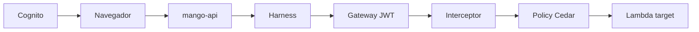

# Propagación de identidad (Cognito → mango-api → harness → Gateway → Lambda): modelo de amenazas (v0.1)

> Fecha: 2026-09-28 · Skill: `security-threat-model`. Diseño: D13, D14, D15.
> Contexto de servicio validado en `mango-architecture-threat-model.md`. Base técnica: investigación de AgentCore del 2026-09-28 (harness, Gateway, interceptors, Policy).
> Alcance: pre-token Lambda de Cognito, validación del JWT en `mango-api`, invocación del harness con la tool `remote_mcp` y el header `Authorization`, Gateway `CUSTOM_JWT` + Policy, REQUEST interceptor y revalidación en el Lambda target.

## Executive summary

El token de acceso del usuario viaja desde el navegador hasta el conector pasando por cuatro componentes. Los riesgos principales son cuatro:

1. **Suplantación de identidad** si algún salto confía en datos controlados por el modelo o por el cliente.
2. **Fuga del token** en logs o trazas: headers de la tool, eventos Lambda, observabilidad.
3. **Tokens que expiran a mitad del loop** o reutilizados fuera de su propósito.
4. **Claims de rol manipulables** desde la propia cuenta del usuario, si el pre-token confía en atributos editables.

## Scope and assumptions

- Cognito con usuarios nativos (D14) creados por IaC; `AllowAdminCreateUserOnly` activo, así que no hay auto-registro.
- El access token incluye `sub`, `client_id` y `token_use`, más los claims `mango_role` y `mango_business_unit` que agrega el pre-token V2 a partir de **grupos de Cognito** (solo los administra IaC o un admin).
- Pendiente de verificar en la PoC:
  - Si la observabilidad de AgentCore registra los headers de `remote_mcp`.
  - Si el Gateway acepta el argumento `_mango_ctx` no declarado.
  - Si un fallo del interceptor bloquea la request (fail-closed).

## System model

### Primary components
Pre-token Lambda · `mango-api` (validación JWT, AVP, budget, `InvokeHarness`) · harness (IAM inbound) · Gateway (`CUSTOM_JWT`, Policy, interceptor) · Lambda target.

### Data flows and trust boundaries
- **Navegador → CloudFront → mango-api:** access token en `Authorization`. mango-api valida firma (JWKS cacheado), `iss`, `client_id`, `token_use=access` y `exp`.
- **mango-api → harness (SigV4):** el token va dentro de la configuración de tools **de esa invocación**, no en el prompt ni en el contexto del modelo.
- **Harness → Gateway (MCP/HTTPS):** header `Authorization: Bearer <token>`. El Gateway lo valida contra el discovery URL de Cognito (`AllowedClients`).
- **Gateway → interceptor:** headers crudos más el JSON-RPC. El interceptor sobrescribe `_mango_ctx`.
- **Gateway → Lambda target:** argumentos más `_mango_ctx`. El Lambda revalida el JWT.

#### Diagram

## Assets and security objectives

| Asset | Why it matters | Security objective (C/I/A) |
|---|---|---|
| Access token del usuario | Permite actuar como el usuario ante mango-api y el Gateway durante su vigencia | C, I |
| Claims `mango_role` / `mango_business_unit` | Determinan el alcance de datos y las tools permitidas | I |
| Grupos de Cognito | Fuente de los roles | I |

## Attacker model

### Capabilities
- Usuario autenticado que manipula el cliente (headers, body).
- Contenido o modelo que intenta inyectar `_mango_ctx` o campos de identidad en los argumentos.
- Lector de logs con acceso a CloudWatch.

### Non-capabilities
- Modificar grupos de Cognito: requiere `cognito-idp:AdminAddUserToGroup`, reservado a IaC o admin.
- Invocar el harness directamente: el inbound es IAM y solo el rol de mango-api tiene `InvokeHarness`.

## Entry points and attack surfaces

| Surface | How reached | Trust boundary | Notes | Evidence |
|---|---|---|---|---|
| `POST /api/chat` | Navegador | Internet → API | Token y mensaje | `apps/api` |
| `tools` override de `InvokeHarness` | mango-api | API → harness | Lleva el token en el header | `apps/api` (cliente AgentCore) |
| MCP `tools/call` | Harness → Gateway | Harness → tools | Header `Authorization` | CFN Gateway |
| Evento del interceptor | Gateway | Tools → interceptor | Headers crudos | `functions/gateway-interceptor` |
| Evento del Lambda target | Gateway | Tools → conector | `_mango_ctx` | `connectors/cost-explorer` |
| Pre-token trigger | Cognito | Identidad → claims | Grupos a claims | `functions/pre-token` |

## Top abuse paths

1. **El modelo pone `_mango_ctx`** con un token robado o claims falsos. El interceptor no lo sobrescribe y el conector confía en él. Impacto: suplantación.
2. **El cliente envía `tools` o `model` en el body de `/api/chat`** y mango-api los reenvía al harness. Impacto: redirigir tools, exfiltrar el token a una URL externa.
3. **El token aparece en logs** (evento del Lambda, headers del interceptor, trazas del harness). Impacto: reutilización durante su vigencia.
4. **Atributo editable por el usuario** (p. ej. `custom:role`) usado por el pre-token. Impacto: el usuario se asigna `finops-central`.
5. **Token cerca de expirar:** el loop falla a mitad de camino o se intenta reutilizar un refresh token desde el backend.

## Threat model table

| Threat ID | Threat source | Prerequisites | Threat action | Impact | Impacted assets | Existing controls (evidence) | Gaps | Recommended mitigations | Detection ideas | Likelihood | Impact severity | Priority |
|---|---|---|---|---|---|---|---|---|---|---|---|---|
| TM-I1 | Modelo / contenido | `_mango_ctx` en argumentos | Inyectar identidad falsa | Suplantación | Claims | Interceptor sobrescribe (D13) | Fallo o bypass del interceptor | El interceptor **siempre** elimina y reescribe `_mango_ctx`; si falta `Authorization`, responde error (short-circuit). El conector **revalida la firma del JWT** (no confía en el interceptor). Tests de "argumento con `_mango_ctx` falso" | Métrica de rechazos de firma en el conector | medium | high | high |
| TM-I2 | Usuario autenticado | Body de `/api/chat` | Enviar `tools`/`model`/`skills`/`allowedTools` | Exfiltración del token, tools arbitrarias | Token | Regla de AGENTS | — | Modelo Pydantic de request con `extra="forbid"` y solo `message` + `conversation_id`. La request al harness se construye 100 % en el servidor, con la URL del Gateway desde la configuración | Tests de contrato | medium | high | high |
| TM-I3 | Lector de logs | Logs con eventos crudos | Leer tokens | Suplantación temporal | Token | Regla "no loguear tokens" | Observabilidad de AgentCore sin verificar | Nunca loguear `event` crudo en interceptor ni conector. `_mango_ctx` se extrae antes de cualquier log. Validar en la PoC que las trazas del harness no contienen el header (checklist de verificación) | Búsqueda periódica de `eyJ` en log groups | medium | medium | medium |
| TM-I4 | Usuario | Atributos editables | Autoasignarse un rol | Escalada | Claims | — | — | El pre-token deriva roles **solo de grupos de Cognito** (no de atributos). Los custom attributes de rol no existen o no son escribibles por el cliente (`WriteAttributes` del app client restringido) | Evento `admin.change` al cambiar grupos | low | high | medium |
| TM-I5 | Usuario / tiempo | Token con poca vigencia | Fallo o reutilización | Disponibilidad | Token | — | — | mango-api rechaza con 401 "reautentica" si `exp - now < timeoutSeconds + 60 s`. El harness usa `timeoutSeconds` ≤ 300. El backend nunca usa refresh tokens | Métrica de 401 por expiración | medium | low | low |
| TM-I6 | Usuario | Token de otro app client o de ID | Confusión de tokens | Bypass | Token | Validación estricta | — | mango-api, Gateway (`AllowedClients`) y conector exigen `token_use=access` y el `client_id` del web client | Rechazos por `client_id` | low | medium | low |

## Criticality calibration
- **High:** suplantación de rol o usuario (TM-I1, TM-I2).
- **Medium:** fuga de tokens a logs (TM-I3); roles derivados de atributos editables (TM-I4).
- **Low:** errores por expiración (TM-I5); confusión de tokens rechazada (TM-I6).

## Focus paths for security review

| Path | Why it matters | Related Threat IDs |
|---|---|---|
| `functions/gateway-interceptor/` | Reescritura de `_mango_ctx` | TM-I1, TM-I3 |
| `connectors/cost-explorer/src/**/auth.py` | Revalidación del JWT | TM-I1, TM-I6 |
| `apps/api/**/chat*` | Construcción de la request al harness | TM-I2, TM-I5 |
| `functions/pre-token/` | Derivación de roles | TM-I4 |

## Checklist de verificación de la PoC (resultados en vivo en el laboratorio, 2026-09-29)
- [x] Trazas y logs del harness, Gateway, interceptor, conector y API **no** contienen el access token: 0 coincidencias `eyJ…` en todos los log groups de la instalación.
- [x] Un `_mango_ctx` inyectado por el modelo lo sobrescribe el interceptor; el conector conserva la identidad real (`tests/e2e/gateway_probe.py`).
- [x] Policy L2 filtra `tools/list` por rol y niega las tools de toda la organización a `bu-lead` (`denied by default`).
- [x] El conector rechaza cuentas fuera del alcance (`outside the user's scope`).
- [x] `SourceIdentity` = `sub` de Cognito llega al CloudTrail de la payer a través del chaining conector → broker → `BillingReader`.
- [x] El contenido de las conversaciones (prompts, respuestas, resultados de tools) no queda en los logs del runtime del harness: captura GenAI apagada por variables de entorno (D16). Verificado en vivo con un marcador en la pregunta: 0 coincidencias de contenido en el log group del runtime y en `aws/spans`.
- [ ] Fallo del interceptor (timeout o excepción) → fail-closed: no probado en vivo.

## Hallazgos de la auditoría (security-audit, modo guía, 2026-09-29)

| ID | Severidad | Hallazgo | Estado |
|---|---|---|---|
| F1 | media | Con su propio access token, un usuario podía llamar al Gateway directamente y saltarse la autorización L1, la reserva de budget y la auditoría de mango-api (los datos seguían limitados a su alcance por la Policy y el conector) | **Corregido.** mango-api firma cada invocación (`X-Mango-Invocation`, HMAC sobre `sub` + expiración, llave en Secrets Manager) y el interceptor rechaza toda request sin firma válida. Verificado en vivo: las llamadas directas devuelven 401 |
| F3 | media | El log group del runtime del harness guardaba completos el system prompt, los mensajes de los usuarios y los resultados de las tools (instrumentación de Strands, botocore y MCP de ADOT; esta última también en los spans), sin retención ni KMS | **Corregido (D16):** captura de contenido GenAI apagada, log group gobernado por IaC con KMS y 30 días |
| F2 | baja | Si fallaba la escritura de la conversación después de reservar budget, la reserva no se liberaba | **Corregido:** la reserva se libera en ese camino, con test |
