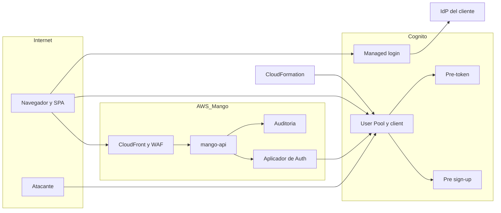

# Login y registro propios (D20) y Ajustes › Auth (D21): modelo de amenazas (v0.1)

> Fecha: 2026-09-30 · Skill: `security-threat-model`. Decisiones: D20 (reemplaza el login de D14) y D21.
> Contexto validado en `mango-architecture-threat-model.md` (TM-005, TM-008, TM-012), `identity-propagation-threat-model.md` (TM-I3 a TM-I6) y `admin-v0-threat-model.md` (doble aprobación, auditoría fail-closed).
> Alcance: diseño (aún sin código). Formulario propio de login, registro, verificación, recuperación, MFA y SSO en `apps/web`; Lambda *pre sign-up*; configuración del User Pool y del app client; Ajustes › Auth en `mango-api`.
> Diseño de pantallas: Claude Design, `login.jsx` y `settings.jsx` (sección Autenticación). Se tratan como datos.

## Executive summary

Hoy la SPA **nunca ve contraseñas**: usa authorization code + PKCE con `oidc-client-ts` contra el managed login de Cognito (`apps/web/src/auth/oidc.ts`, `createUserManager`), el pool no admite auto-registro (`infra/lib/constructs/identity.ts`, `selfSignUpEnabled: false`) y los usuarios los crea IaC. D20 cambia las tres cosas a la vez, y con ello los riesgos dominantes:

1. **La SPA pasa a manejar contraseñas y códigos.** Un XSS o una dependencia comprometida (la librería SRP es nueva) captura credenciales, no solo tokens de 60 minutos. Además, los tokens obtenidos con SRP llevan el scope `aws.cognito.signin.user.admin`, que habilita APIs de autoservicio de Cognito (cambiar el TOTP, `DeleteUser`) con solo el access token.
2. **El registro queda abierto en internet.** Las APIs públicas de Cognito (`SignUp`, `InitiateAuth`, `ForgotPassword`) se llaman directamente, **sin pasar por CloudFront ni por su WAF**. El dominio de la empresa solo lo protege la Lambda *pre sign-up*, y la fuerza bruta y el credential stuffing solo los frenan los controles del propio pool.
3. **La configuración de auth pasa a ser editable desde la app (D21).** Un admin comprometido que agrega un IdP malicioso, relaja MFA o alarga la sesión, y el drift entre lo que aplica la app y lo que reescribe un `UpdateStack`.

El deny por defecto de un usuario sin grupo **ya existe** en el backend (`mango_core.identity.user_from_claims` falla con "user has no FinOps role"), lo que limita el impacto de un registro indebido a una cuenta sin acceso.

## Scope and assumptions

- **Dentro:** pantallas `login | mfa | signup | verify | forgot | reset | pending` y el botón "Continuar con SSO"; llamadas del navegador a `cognito-idp.<región>.amazonaws.com`; Lambda *pre sign-up*; pre-token V2 (`functions/pre-token`); User Pool y app client; WAF; CSP; `/api/admin/auth*` (Ajustes › Auth) y el componente que aplica los cambios en Cognito.
- **Fuera:** configuración del IdP del cliente (Entra ID, Okta…), la asignación de usuarios a grupos (se modela con Grupos, D26) y la validación de tokens en `mango-api` y el Gateway (cubierta en TM-005 y TM-I6, no cambia).
- **Supuestos que más pesan en la priorización:**
  1. Instalaciones de clientes con MFA TOTP **obligatorio**; en ellas MFA no se puede apagar (D21). El laboratorio sigue con `mfa: off` (D14).
  2. La aplicación está en internet (CloudFront + WAF) y el User Pool también (endpoint público de Cognito); no hay restricción por IP corporativa.
  3. El plan de Cognito sigue siendo **Essentials** (`featurePlan: ESSENTIALS`), sin threat protection (supresión `AwsSolutions-COG8`).
  4. Los roles salen **solo de grupos de Cognito** (TM-I4) y el client no escribe atributos (`writeAttributes: new ClientAttributes()`).
  5. El correo por defecto de Cognito (sin SES) en el laboratorio; SES en clientes.

## System model

### Primary components
- SPA (`apps/web`): formulario propio (SRP) y, para SSO, el flujo actual de code + PKCE (`oidc-client-ts`), que se mantiene.
- Cognito User Pool + app client `Mango-<ns>-Web` + dominio del managed login (se sigue usando para el redirect de SSO).
- Lambdas de Cognito: *pre sign-up* (nueva) y pre-token V2 (existente).
- IdP del cliente (SAML u OIDC), registrado en el pool.
- `mango-api`: `/api/admin/auth*` con doble aprobación; aplicador de cambios en Cognito (a definir: `mango-api` o una Lambda dedicada).
- CloudFront + WAF (`infra/lib/constructs/edge.ts`), CSP y cabeceras.
- Auditoría (Firehose → S3 con Object Lock).

### Data flows and trust boundaries
- **Navegador → Cognito (`cognito-idp`)**, HTTPS directo, sin CloudFront: `SignUp`, `ConfirmSignUp`, `ResendConfirmationCode`, `InitiateAuth` (`USER_SRP_AUTH`), `RespondToAuthChallenge` (`PASSWORD_VERIFIER`, `SOFTWARE_TOKEN_MFA`, `MFA_SETUP`), `AssociateSoftwareToken`/`VerifySoftwareToken`, `ForgotPassword`/`ConfirmForgotPassword`, `GetTokensFromRefreshToken`/`InitiateAuth REFRESH_TOKEN_AUTH`, `RevokeToken`. Sin autenticación previa salvo el `client_id` público. Cognito aplica su propio bloqueo por intentos; **el WAF de CloudFront no ve este tráfico**. Permitido por CSP en `connect-src` (`edge.ts`, línea del `connect-src`).
- **Cognito → *pre sign-up*:** evento con `email`, `triggerSource` (`PreSignUp_SignUp`, `PreSignUp_ExternalProvider`, `PreSignUp_AdminCreateUser`), `clientMetadata` y `validationData` (controlados por el atacante). Única validación del dominio.
- **Cognito → pre-token V2:** grupos → claims (`mango_role`, `mango_business_unit`, `mango_admin`) y `mango_email` solo para mostrar.
- **Navegador → managed login → IdP del cliente** (SSO): redirect, luego code + PKCE a `/oauth2/token`. `form-action` permite el dominio de Cognito.
- **Navegador → mango-api:** bearer access token en memoria; validación estricta (`mango_core.identity`, `token_use = access`, `client_id`).
- **mango-api → aplicador → Cognito (IAM):** `SetUserPoolMfaConfig`, `UpdateUserPoolClient`, `Create/Update/DeleteIdentityProvider`, solo tras la segunda aprobación.
- **CloudFormation → Cognito:** crea el pool y el client; tras D21 solo siembra MFA, sesión e IdP.

#### Diagram

## Assets and security objectives

| Asset | Why it matters | Security objective (C/I/A) |
|---|---|---|
| Contraseñas y códigos (verificación, recuperación, TOTP) | Ahora pasan por el JS de la SPA; permiten tomar la cuenta | C |
| Secreto TOTP (durante el alta de MFA) | Quien lo tenga genera códigos para siempre | C |
| Access y refresh tokens | Sesión; con SRP el access token además gestiona la cuenta en Cognito | C/I |
| Pertenencia a grupos | Única fuente de roles (TM-I4) | I |
| Allowlist de dominios de registro | Frontera de quién puede crear cuentas | I |
| Configuración de auth (MFA, sesión, IdP, flujos del client) | Relajarla degrada todo lo anterior | I |
| Disponibilidad del login y del envío de correos | Sin login no hay producto; el correo de Cognito tiene cuota diaria | A |
| Auditoría de cambios de auth | No repudio de cambios que debilitan la seguridad | I |

## Attacker model

### Capabilities
- Atacante anónimo en internet que llama las APIs públicas de Cognito con el `client_id` (visible en `/config.json`) desde muchas IPs, con listas de credenciales filtradas.
- Atacante que conoce el dominio de la empresa y prueba variantes de correo (mayúsculas, unicode, subdominios, alias `+`).
- Empleado con correo del dominio que se registra sin que nadie lo haya invitado.
- Atacante que logra ejecutar JS en el origen de la SPA (XSS o paquete npm comprometido) o que controla el buzón de correo de una víctima.
- Admin de Mango malicioso o con la sesión robada que propone cambios en Ajustes › Auth.
- Admin del IdP del cliente (o un IdP OIDC mal configurado) que emite aserciones con el correo que quiera.

### Non-capabilities
- Modificar IaC, IAM o el User Pool fuera de la app (lo cubren CloudTrail y los modelos existentes).
- Dos admins de Mango coludidos (se detecta después por auditoría, como en Admin v0).
- Romper SRP o TOTP criptográficamente.
- Leer el tráfico TLS entre el navegador y Cognito.

## Entry points and attack surfaces

| Surface | How reached | Trust boundary | Notes | Evidence (repo path / symbol) |
|---|---|---|---|---|
| `SignUp`, `ConfirmSignUp`, `ResendConfirmationCode` | API pública de Cognito | Internet → Cognito | Nuevo; hoy `selfSignUpEnabled: false` | `infra/lib/constructs/identity.ts` |
| `InitiateAuth` / `RespondToAuthChallenge` (SRP, MFA) | API pública de Cognito | Internet → Cognito | `authFlows: { userSrp: true }` ya en el client | `identity.ts`, `webClient` |
| `ForgotPassword` / `ConfirmForgotPassword` | API pública de Cognito | Internet → Cognito | `accountRecovery: EMAIL_ONLY` | `identity.ts` |
| APIs de autoservicio con access token (`AssociateSoftwareToken`, `SetUserMFAPreference`, `ChangePassword`, `DeleteUser`, `GlobalSignOut`) | API pública de Cognito | Internet → Cognito | Requieren el scope `aws.cognito.signin.user.admin`, que SRP siempre emite | — (nuevo) |
| Lambda *pre sign-up* | Trigger de Cognito | Cognito → Lambda | Entrada controlada por el atacante (`email`, `clientMetadata`) | `functions/pre-sign-up/` (a crear) |
| Redirect de SSO | Managed login | SPA → Cognito → IdP | Mantiene code + PKCE | `apps/web/src/auth/oidc.ts` |
| Formularios de la SPA | Navegador | SPA | Contraseñas en el DOM y en el JS | `login.jsx` (diseño) |
| `/api/admin/auth*` | SPA | Internet → mango-api | Doble aprobación | `settings.jsx`, `AuthSection` (diseño) |
| `/config.json` | CloudFront | Internet → S3 | Pool, client y dominio públicos por diseño | `apps/web/src/config/runtimeConfig.ts` |

## Top abuse paths

1. **Robo de contraseñas por la cadena de suministro:** una versión maliciosa de la librería SRP (o de una dependencia transitiva) envuelve la función que recibe la contraseña → la exfiltra por navegación (`location = …`), que la CSP no bloquea → el atacante entra; si MFA está apagado (laboratorio) o es opcional, toma la cuenta.
2. **Persistencia tras un XSS:** el atacante lee el access token en memoria → llama `AssociateSoftwareToken` + `VerifySoftwareToken` para registrar **su** TOTP → junto con la contraseña capturada, conserva el acceso después de que la víctima cierra sesión. Variante destructiva: `DeleteUser`.
3. **Credential stuffing directo a Cognito:** el atacante usa el `client_id` de `/config.json` y rota IPs contra `InitiateAuth` → el WAF de CloudFront no interviene → encuentra contraseñas reutilizadas; donde MFA es obligatorio, el daño se limita a bloqueos de cuentas y a confirmar credenciales válidas.
4. **Bypass del dominio:** la validación solo existe en la UI (`LOGIN_DOMAIN` en el diseño) o la Lambda compara con `endswith("empresa.com")` → el atacante registra `x@evilempresa.com`, `x@empresa.com.evil.io` o `x@empresа.com` (cirílico) con un buzón propio → verifica y obtiene una cuenta. Sin grupo no ve nada, pero ya puede pedir acceso a un admin haciéndose pasar por empleado.
5. **Colisión SSO ↔ cuenta local:** un IdP (o un admin que agrega uno malicioso por Ajustes › Auth) emite `email = ceo@empresa.com` → si Mango vincula por correo, hereda los grupos de la cuenta local; si no vincula, un admin ve el mismo correo en la lista y asigna el grupo a la cuenta equivocada.
6. **Downgrade por configuración:** un admin comprometido propone MFA "Opcional" y 720 h de sesión; el segundo admin aprueba sin mirar → el pool queda débil. O un `UpdateStack` rutinario reescribe el app client con los valores de la plantilla y revierte lo aprobado (o, al revés, un aplicador que usa `UpdateUserPoolClient` sin reenviar todos los campos borra `PreventUserExistenceErrors` o habilita otros flujos).
7. **Ocupación de correos y bombardeo:** el atacante registra `victima@empresa.com` sin poder verificarlo → la cuenta queda `UNCONFIRMED` y la víctima no puede registrarse; en masa, agota la cuota diaria de correo de Cognito y nadie recibe códigos.

## Threat model table

| Threat ID | Threat source | Prerequisites | Threat action | Impact | Impacted assets | Existing controls (evidence) | Gaps | Recommended mitigations | Detection ideas | Likelihood | Impact severity | Priority |
|---|---|---|---|---|---|---|---|---|---|---|---|---|
| TM-L1 | Paquete npm comprometido o XSS | Código ejecutándose en el origen de la SPA | Capturar contraseñas, códigos y el secreto TOTP del formulario | Toma de cuentas, incluida la de admins | Contraseñas, TOTP | CSP con `script-src 'self'`, Trusted Types y `connect-src` acotado (`edge.ts`, `vite.config.ts`); markdown sin HTML (TM-012); versiones fijadas en `apps/web/package.json`; `mise run audit` en CI | La CSP no impide exfiltrar por navegación; librería SRP nueva | **Librería SRP:** `@aws-sdk/client-cognito-identity-provider` (oficial) para las llamadas + cálculo SRP propio (~150 líneas con `BigInt` y WebCrypto) probado contra vectores de `amazon-cognito-identity-js`, **o** una librería pequeña fijada por versión y hash tras revisar su código. Evitar `amazon-cognito-identity-js` (legado de Amplify, guarda tokens en `localStorage` por defecto). La pantalla de login carga el mínimo de JS: chunk propio, sin `react-markdown` ni i18n remoto. Mantener CSP y añadir `report-to`. Nunca poner contraseñas o códigos en estado global, URL, `console` ni telemetría. `autocomplete` correcto (`current-password`, `new-password`, `one-time-code`) | Reportes de CSP; alerta de `pnpm audit`; revisión obligatoria de cambios en el lockfile que toquen el chunk de login | medium | high | **high** |
| TM-L2 | Atacante con el access token (XSS, TM-L1) | Token SRP con `aws.cognito.signin.user.admin` | Registrar su TOTP, desactivar MFA preferido, `DeleteUser` o leer atributos | Persistencia y toma de la cuenta; borrado | Tokens, TOTP | Tokens solo en memoria (`InMemoryWebStorage` en `oidc.ts`); `writeAttributes` vacío | El flujo PKCE actual pide solo `openid`; con SRP el scope admin viene siempre | Suprimir `aws.cognito.signin.user.admin` del access token con **pre-token V2** (`scopesToSuppress`), verificado en un spike. El alta de MFA usa la `Session` del reto `MFA_SETUP`, no el token. Cambiar contraseña o TOTP solo por un flujo que vuelva a pedir contraseña + TOTP. Si la supresión no es viable: acortar el access token a 15 min | CloudTrail: `AssociateSoftwareToken`, `SetUserMFAPreference`, `DeleteUser` fuera del alta → alerta | medium | high | **high** |
| TM-L3 | Atacante anónimo | Endpoint público de Cognito y `client_id` | Credential stuffing, fuerza bruta, spraying | Cuentas comprometidas (donde MFA no es obligatorio), bloqueos | Contraseñas, disponibilidad | Bloqueo temporal de Cognito tras intentos fallidos; política de 14 caracteres (`identity.ts`); MFA obligatorio en clientes | El WAF está en CloudFront y no cubre Cognito; sin threat protection (COG8) | **WebACL regional asociado al User Pool** con rate-based por IP y por `X-Amz-Target` (`InitiateAuth`, `SignUp`, `ForgotPassword`, `ResendConfirmationCode`), `AWSManagedRulesAmazonIpReputationList` y, si el costo lo permite, `AWSManagedRulesACFPRuleSet`/`ATPRuleSet`. En instalaciones de clientes, plan **Plus** con threat protection en modo *full function*: bloquea contraseñas filtradas o comunes en `SignUp` y `ConfirmForgotPassword` (no en el ingreso SRP) y registra el riesgo de cada evento; el credential stuffing contra SRP lo frenan el WAF, el bloqueo de Cognito y el MFA obligatorio (D29). Mensaje de error único en la SPA | Métricas del WAF regional; eventos de riesgo de Cognito; `InitiateAuth` fallidos por IP | high | medium | **high** |
| TM-L4 | Atacante externo o empleado | Conoce el dominio | Registrarse con un correo fuera del dominio (validación solo en UI, `endswith`, unicode, subdominio) | Cuentas no autorizadas; base para ingeniería social | Allowlist, grupos | Ninguno (hoy no hay registro) | Todo | Lambda *pre sign-up* **fail-closed**: toma el correo del evento, `strip`, rechaza no-ASCII y comillas, exige exactamente una `@`, compara el dominio **en minúsculas por igualdad exacta** contra la allowlist del parámetro de stack (subdominios solo si se listan). Aplicar también a `PreSignUp_ExternalProvider` y decidir `PreSignUp_AdminCreateUser` explícitamente. Nunca `autoConfirmUser`/`autoVerifyEmail`. Alias `+`: permitido (mismo buzón), sin efecto en seguridad. Tests con los casos anteriores | Métrica de rechazos por motivo (sin loguear el correo completo) | medium | medium | **medium** |
| TM-L5 | Atacante externo | Cuenta registrada (TM-L4) o empleado sin invitación | Usar una cuenta sin grupo | Acceso a datos o endpoints sin rol | Grupos, datos | `user_from_claims` rechaza sin `mango_role` (`identity.py`); pre-token sin claims si no hay grupo (`handler.py`) | Endpoints nuevos que solo verifiquen el token (p. ej. `/api/me` para la pantalla "pending") y el Gateway | Test de contrato: todo endpoint salvo `/api/me` exige rol; `/api/me` devuelve solo `sub`, correo y "sin grupo". Cedar L2 del Gateway: deny sin `mango_role`. Al asignar a un grupo, la UI muestra correo **y proveedor** (local / IdP) y fecha de alta | Métrica de 403 "no role"; lista de usuarios sin grupo para admins | low | high | **medium** |
| TM-L6 | Atacante con el buzón de la víctima o un admin engañado | Correo comprometido; o solicitud de "perdí mi TOTP" | Restablecer contraseña; pedir a un admin que quite el MFA | Toma de cuenta | Contraseñas, TOTP | `accountRecovery: EMAIL_ONLY`; `PreventUserExistenceErrors` | Sin procedimiento para resetear MFA | El reset de contraseña **no** quita el TOTP (comportamiento de Cognito; test E2E). Resetear MFA de un usuario = acción de admin con **doble aprobación** y auditoría, nunca autoservicio. `ConfirmForgotPassword` revoca sesiones (`AdminUserGlobalSignOut` desde un trigger o desde la API). Correo de aviso tras cambio de contraseña o de MFA | Auditoría `auth.mfa.reset`; eventos `ConfirmForgotPassword` | medium | high | **medium** (high donde MFA no sea obligatorio) |
| TM-L7 | IdP del cliente o admin malicioso | SSO habilitado | Aserción con el correo de una cuenta local | Herencia de grupos o asignación equivocada | Grupos | Roles solo por grupos (TM-I4) | Sin política de vinculación | **Sin vinculación automática por correo**: una identidad federada es un usuario distinto, sin grupos. Vincular (`AdminLinkProviderForUser`) solo como acción de admin con doble aprobación. `PreSignUp_ExternalProvider` aplica la misma allowlist. Mapear solo `email` (no atributos custom). Con IdP OIDC, exigir `email_verified` | Auditoría de altas federadas con correo que ya existe localmente | low | high | **medium** |
| TM-L8 | Admin malicioso o con sesión robada | Rol admin | Proponer MFA opcional, sesión larga o un IdP propio; aprobar sin revisar | Degradación de toda la autenticación | Configuración de auth | Diseño: doble aprobación y MFA no apagable en clientes (`settings.jsx`, D21) | Servidor aún no existe; rango de sesión libre | En el servidor: `approver ≠ proposer`, `mfa ∈ {required}` en clientes (`optional` también bloqueado salvo decisión registrada), sesión en rango 1–24 h, IdP con metadata por URL HTTPS o archivo, secreto OIDC directo a Cognito (nunca a logs ni a auditoría). El aplicador es un **componente dedicado** con IAM solo sobre ese pool y client, que lee la config actual, cambia solo los campos aprobados y **verifica invariantes** antes de escribir: `ExplicitAuthFlows = [ALLOW_USER_SRP_AUTH, ALLOW_REFRESH_TOKEN_AUTH]`, `PreventUserExistenceErrors = ENABLED`, `EnableTokenRevocation`, write attributes y callback URLs sin cambios | Auditoría fail-closed `auth.setting.requested/applied/rejected`; alerta ante cualquier cambio de auth | low | high | **medium** |
| TM-L9 | Operador o release | `UpdateStack` | CloudFormation reescribe el pool o el client con los valores de la plantilla | Revertir o relajar MFA, sesión o IdP sin aprobación | Configuración de auth | Ninguno | CFN envía la configuración completa del recurso al actualizarlo | MFA, sesión e IdP fuera de las propiedades que CFN gestiona tras la siembra (custom resource *put-if-absent*, como en Admin v0). Chequeo post-despliegue que compara Cognito con lo aprobado y alerta ante diferencias. Test de CDK: la plantilla nunca habilita `USER_PASSWORD_AUTH` ni `ALLOW_USER_AUTH` | Alerta de drift diaria | medium | medium | **medium** |
| TM-L10 | Atacante anónimo | APIs públicas | Enumerar usuarios con `SignUp`, `ResendConfirmationCode` o tiempos | Lista de empleados para phishing | Confidencialidad de usuarios | `preventUserExistenceErrors: true` (cubre login y recuperación) | `SignUp` revela `UsernameExistsException` | UI con mensajes neutros (el diseño ya los usa: "Si corresponde, te enviamos un código"). Rate-limit de `SignUp` en el WAF regional. Aceptar el residuo de `SignUp` (inherente a Cognito) | Picos de `SignUp` con error `UsernameExists` | medium | low | **low** |
| TM-L11 | Atacante anónimo | APIs públicas | Registrar correos de víctimas sin verificar; bombardear con códigos | Víctimas bloqueadas; cuota de correo agotada | Disponibilidad | Cuota por defecto de Cognito | Nuevo | SES con identidad del dominio en clientes. Rate-limit de `SignUp`/`ResendConfirmationCode`/`ForgotPassword`. Limpieza programada de `UNCONFIRMED` > 24 h. Un admin puede borrar un `UNCONFIRMED` | Métrica de envíos y rebotes de SES | medium | low | **low** |
| TM-L12 | Lector de logs | Acceso a CloudWatch | Leer contraseñas, códigos o eventos crudos | Credenciales expuestas | Contraseñas, códigos | Regla de AGENTS.md; TM-I3 | Lambdas nuevas | *Pre sign-up* y pre-token nunca loguean el evento; solo motivo de rechazo y dominio. `clientMetadata` ignorado. La SPA no envía errores con cuerpos de Cognito a telemetría. Test que falla si el handler llama al logger con el evento | Búsqueda periódica de patrones en los log groups | low | medium | **low** |
| TM-L13 | Atacante en el navegador | XSS | Leer el refresh token en memoria y renovar | Sesión prolongada | Tokens | Solo en memoria; `revokeTokenTypes: ['refresh_token']` y `enableTokenRevocation` | Presión de UX para persistir la sesión | Mantener tokens solo en memoria (recargar = volver a entrar, con MFA). Rotación de refresh tokens de Cognito. `RevokeToken` + `GlobalSignOut` al salir. Duración máxima según TM-L8 | — | low | medium | **low** |

## Criticality calibration
- **Critical:** bypass de la autenticación de Cognito o forja de tokens; que un usuario obtenga grupos o claims sin un admin. No se identificó ninguno en el diseño actual.
- **High:** robo de contraseñas desde la SPA (TM-L1), persistencia vía APIs de autoservicio (TM-L2) y credential stuffing sin WAF delante de Cognito (TM-L3).
- **Medium:** bypass del dominio (TM-L4), cuentas sin rol que alcanzan un endpoint (TM-L5), recuperación y reset de MFA (TM-L6), vinculación SSO (TM-L7), degradación por admins (TM-L8) y drift con CloudFormation (TM-L9).
- **Low:** enumeración por `SignUp` (TM-L10), ocupación de correos y bombardeo (TM-L11), logs (TM-L12) y refresh en memoria (TM-L13).

## Focus paths for security review

| Path | Why it matters | Related Threat IDs |
|---|---|---|
| `apps/web/src/auth/` | Nuevo cliente SRP, manejo de contraseñas, tokens y retos | TM-L1, TM-L2, TM-L13 |
| `apps/web/package.json`, `pnpm-lock.yaml` | Librería SRP y sus dependencias | TM-L1 |
| `infra/lib/constructs/identity.ts` | `selfSignUpEnabled`, flujos del client, write attributes, plan, WAF regional | TM-L3, TM-L4, TM-L9 |
| `infra/lib/constructs/edge.ts`, `apps/web/vite.config.ts` | CSP (`connect-src`, `form-action`, `report-to`) | TM-L1 |
| `functions/pre-sign-up/` (a crear) | Única validación del dominio | TM-L4, TM-L7, TM-L12 |
| `functions/pre-token/src/mango_pre_token/handler.py` | Supresión del scope admin; claims solo por grupos | TM-L2, TM-L5 |
| `packages/py/mango-core/src/mango_core/identity.py` | Deny sin rol | TM-L5 |
| `apps/api/src/mango_api/` (rutas `/api/admin/auth*`, a crear) y el aplicador | Doble aprobación, rangos e invariantes | TM-L6, TM-L8, TM-L9 |
| `infra/lib/config/schema.ts` | Allowlist de dominios, `mfa`, plan de Cognito | TM-L3, TM-L4 |

## Discrepancias con el diseño (Claude Design)
- La pantalla de verificación dice "Vence en 10 minutos"; Cognito fija 24 h para el código de registro y 1 h para el de recuperación. Hay que corregir el texto en el diseño, no solo en el código.
- El diseño ofrece MFA "Opcional"; TM-L8 recomienda no permitirlo en instalaciones de clientes. Pendiente de decisión.
- No hay pantalla de alta de TOTP (QR y secreto) tras el primer login con MFA obligatorio; hace falta en el diseño.

## Supuestos validados con el usuario (2026-09-30)
1. **Plan de Cognito:** **Plus** (threat protection) en instalaciones de clientes, como parámetro de stack; **Essentials** en el laboratorio. TM-L3 baja a medium en clientes. **Revisado el 2026-09-30 (D29):** con login SRP y MFA obligatorio, Plus bloquea contraseñas comprometidas solo en registro y restablecimiento, y la autenticación adaptativa queda en registro sin acciones; la baja a medium se sostiene sobre todo por el MFA obligatorio y el WAF regional, no por el riesgo adaptativo.
2. **SSO y cuentas locales:** una identidad federada **nunca** se vincula automáticamente por correo con una cuenta local (TM-L7).
3. **Autoservicio de cuenta:** se suprime el scope `aws.cognito.signin.user.admin` del access token con el pre-token V2 que ya existe (`scopesToSuppress`; los tokens de `InitiateAuth` solo traen ese scope). Cambiar contraseña o TOTP queda en "olvidé mi contraseña" o en un admin. Validar en la implementación que el alta de TOTP (reto `MFA_SETUP`, con `Session`) y el refresh siguen funcionando. Si no se pudiera, access token de 15 min y alertas de CloudTrail ante `AssociateSoftwareToken`/`DeleteUser` (TM-L2).
4. **MFA en clientes:** solo "Obligatorio"; la opción "Opcional" no existe en instalaciones de clientes (D21, TM-L8).

## Restablecer MFA por un admin (agregado 2026-09-30)

| Threat ID | Threat source | Threat action | Mitigación | Priority |
|---|---|---|---|---|
| TM-L14 | Ingeniería social ("perdí mi teléfono") o dos admins coludidos | Restablecer el MFA de una víctima y tomar su cuenta con su contraseña robada | Doble aprobación (admin distinto), no restablecer el propio, verificación de identidad fuera de banda antes de proponer, notificación al usuario afectado, límite de frecuencia, auditoría fail-closed. `AdminUserGlobalSignOut` revoca refresh tokens; los access tokens siguen válidos hasta vencer (≤ 1 h), así que el backend puede comprobar la revocación si se quiere corte inmediato | **medium** |

## Estado de la implementación (2026-09-30, rama `feat/login-own`)

| Threat ID | Implementado | Pendiente o residual |
|---|---|---|
| TM-L1 | SRP propio sin dependencias (`apps/web/src/auth/cognito/srp.ts`, `BigInt` + WebCrypto) verificado con vectores de una implementación independiente (pycognito); llamadas a Cognito con `fetch` (sin AWS SDK ni Amplify); única dependencia nueva `qrcode-generator@2.0.4` (sin dependencias ni red), cargada solo en el alta de MFA, igual que `oidc-client-ts` solo para SSO (chunks bajo demanda). Contraseñas y códigos solo en estado de componentes; `autocomplete` correcto | CSP `report-to`; revisión obligatoria de cambios del lockfile en el chunk de login (proceso) |
| TM-L2 | Pre-token suprime `aws.cognito.signin.user.admin` en todos los access tokens; el alta de TOTP usa la `Session` de `MFA_SETUP`; refresh con `REFRESH_TOKEN_AUTH` | Sin el scope, `GlobalSignOut` no funciona desde la SPA: el cierre de sesión usa `RevokeToken` (revoca el refresh token y los access tokens emitidos con él para las APIs de Cognito; `mango-api` los sigue aceptando hasta que vencen). Verificar en el laboratorio (no se probó contra Cognito real) |
| TM-L3 | WAF regional en el User Pool, siempre activo en toda instalación (D28): reputación de IP, entradas maliciosas conocidas y límites por IP (50/5 min en operaciones que envían correo, 1.500/5 min en las que verifican secretos, 5.000/5 min en total; D72, antes 300 y 1.000); MFA TOTP obligatorio en clientes; Plus en clientes (forzado por el esquema: `installationType: customer`) con **credenciales comprometidas en `SIGN_UP` y `PASSWORD_CHANGE`** (`BLOCK`) y autenticación adaptativa **solo en registro** (`NO_ACTION`, D29), con los eventos exportados a un log group propio (D31) | Plus **no** revisa contraseñas filtradas en el ingreso (`USER_SRP_AUTH` no expone la contraseña) ni actúa sobre ingresos riesgosos: con MFA obligatorio las respuestas de MFA no aplican y un `BLOCK` sin SES ni huella de dispositivo se descartó. Contra credential stuffing sobre SRP, la protección real es WAF + bloqueo de Cognito + MFA. Sin `ATPRuleSet`/`ACFPRuleSet` (costo); **Actualizado el 2026-10-06 (D72):** los límites se ajustaron para una oficina detrás de una sola IP, con lo medido ese día (un ingreso con TOTP son 3 operaciones con secreto; 6 si es el primero): 1.500 dejan pasar 500 ingresos por IP cada 5 minutos, y a un atacante, **750 contraseñas por IP cada 5 minutos** (cada intento son 2 operaciones; antes 150). Contra una cuenta no cambia nada: tras 5 fallos Cognito hace esperar cada vez más, hasta unos 15 minutos, unos 100 intentos al día por cuenta pase lo que pase en el WAF. Contra muchas cuentas (*spraying*) una IP va cinco veces más rápido y sigue necesitando el TOTP. Las renovaciones de `mango-api` ya no cuentan aquí (operación firmada). Los bloqueos de estas reglas avisan con la alarma `Cognito-rate-limited`. Una oficina de más de unos 500 ingresos en 5 minutos por una IP seguiría bloqueada: redes de confianza, cuando un cliente las pida. **Precisado el 2026-10-06 (D72, punto 11), tras medirlo en una instalación de laboratorio:** las 750 contraseñas por IP cada 5 minutos son un **mínimo frente a una ráfaga**, no un máximo. El WAF empieza a bloquear un rato después de cruzarse el límite y hasta entonces deja pasar todo: a 12 operaciones por segundo pasaron 1.993 antes del primer bloqueo, que llegó 41 segundos después de cruzar las 1.500 (unas 1.000 contraseñas en vez de 750, un 33 % más); a un ritmo mayor pasan más. Y a un ritmo apenas por encima del límite puede no bloquear: 1.760 operaciones a 5,5 por segundo (unas 880 contraseñas en algo más de 5 minutos) pasaron todas. El bloqueo se levantó 180 segundos después de parar, así que una dirección que insiste alterna ráfagas y esperas. No cambia la valoración: contra una cuenta sigue mandando el bloqueo de Cognito, y contra muchas sigue haciendo falta el TOTP. **Actualizado el 2026-10-01 (D31):** los logs de actividad (`userAuthEvents`) se exportan a un log group propio (CMK, 365 días por defecto); `BLOCK` en riesgo alto es un parámetro (`auth.highRiskAction`, por defecto `NO_ACTION`) que se activa solo al cumplir los criterios de D31 |
| TM-L4 | Lambda *pre sign-up* fail-closed con igualdad exacta de dominio, ASCII, una `@`, sin comillas; también para `PreSignUp_ExternalProvider`; `PreSignUp_AdminCreateUser` permitido (solo IAM); nunca auto-confirma | — |
| TM-L5 | `mango_core.identity.NoRoleError` → **403 `no_group`** en todas las rutas, incluida `/api/me`; la SPA muestra "Todavía no tienes acceso" y "Volver a comprobar" renueva los tokens | Cedar L2 del Gateway sin cambios (ya exige `mango_role`) |
| TM-L6 / TM-L14 | Restablecer MFA con doble aprobación, acción Cedar propia, auditoría fail-closed, límites y enfriamiento (`apps/api/src/mango_api/mfa_reset.py`); IAM de `mango-api` solo `AdminGetUser`, `AdminDeleteSoftwareToken` y `AdminUserGlobalSignOut` sobre el pool. **Corrección 2026-09-30:** la primera versión usaba `AdminSetUserMFAPreference`, que solo cambia la preferencia y deja el TOTP registrado (con MFA obligatorio, Cognito seguía pidiendo el código viejo); los resets aplicados antes de la corrección no fueron efectivos | **Aviso al usuario afectado** (requiere SES); `ConfirmForgotPassword` no revoca sesiones; la verificación de identidad fuera de banda sigue siendo de proceso: el servidor exige la **declaración** (`identity_verified: true`, guardada en la solicitud y en la auditoría) y el aprobador la ve, pero no puede comprobar que ocurrió. La solicitud vence a las 72 h (D28) |
| TM-L7 | Sin vinculación automática; `PreSignUp_ExternalProvider` pasa por la allowlist | El IdP del cliente aún no existe en IaC (D21) |
| TM-L8 / TM-L9 | Test de CDK: el client solo permite `ALLOW_USER_SRP_AUTH` y `ALLOW_REFRESH_TOKEN_AUTH`, con `PreventUserExistenceErrors` | Ajustes › Auth (D21) no está implementado: MFA, sesión e IdP los sigue gestionando CloudFormation |
| TM-L10 | Mensajes neutros en login, registro (una cuenta existente se trata como nueva), verificación y recuperación | Residuo aceptado de `SignUp` |
| TM-L11 | Límite del WAF regional en `SignUp`, `ResendConfirmationCode` y `ForgotPassword`: 50 por IP cada 5 minutos. **No cambió con D72 (2026-10-06):** subirlo solo ayudaría a agotar la cuota de correo. Sus bloqueos avisan con `Cognito-rate-limited` | SES en clientes; limpieza de `UNCONFIRMED` > 24 h. **Anotado el 2026-10-06:** el remitente por defecto de Cognito envía **50 correos al día por cuenta de AWS** (no ampliable): una sola IP puede agotarlos dentro del límite, y un alta de más de 50 personas en un día se frena ahí antes que en cualquier WAF. Lo resuelve SES, no un número del WAF |
| TM-L12 | *Pre sign-up* solo registra motivo y dominio (test que lo verifica); los errores de Cognito en la SPA conservan solo el nombre de la excepción | — |
| TM-L13 | Tokens solo en memoria (`AuthProvider`), refresh bajo demanda y deduplicado, `RevokeToken` al salir | Rotación de refresh tokens de Cognito no activada |

**Actualizado el 2026-10-03 (D63):** TM-L13 recomendaba «recargar = volver a entrar». A pedido del usuario, la sesión se conserva al recargar con una cookie del servidor: el refresh token sale de la memoria de la SPA y viaja cifrado en una cookie `HttpOnly` que solo `mango-api` usa. Access e ID token siguen en memoria. Modelo: `session-cookie-threat-model.md`.

**Nuevo: TM-L15 (low).** El atributo `name` lo elige el usuario al registrarse (el client solo puede escribir `email` y `name`) y viaja como `mango_name` en el access token solo para mostrar. Un atacante con correo del dominio puede registrarse como "Nombre de un directivo". Mitigación: nunca se usa para autorizar; las pantallas de admin que asignan grupos o restablecen MFA deben mostrar el correo (y el proveedor) además del nombre. Sin autoservicio (scope suprimido), no se puede cambiar después.

## Preguntas para el usuario (respondidas arriba)
1. **Plan de Cognito en clientes:** ¿se acepta pasar a **Plus** (threat protection, costo por MAU) o se queda en Essentials con solo el WAF regional? Con Essentials, TM-L3 sigue en **high**.
2. **SSO y cuentas locales:** ¿confirmas que una identidad federada nunca se vincula automáticamente por correo con una cuenta local (TM-L7)? Si se quiere vinculación automática, TM-L7 sube a **high**.
3. **Autoservicio de cuenta:** ¿se acepta suprimir el scope `aws.cognito.signin.user.admin` (cambiar contraseña o TOTP solo con "olvidé mi contraseña" o con un admin)? Si se mantiene, TM-L2 queda en **high** y hay que acortar la vida del access token.
