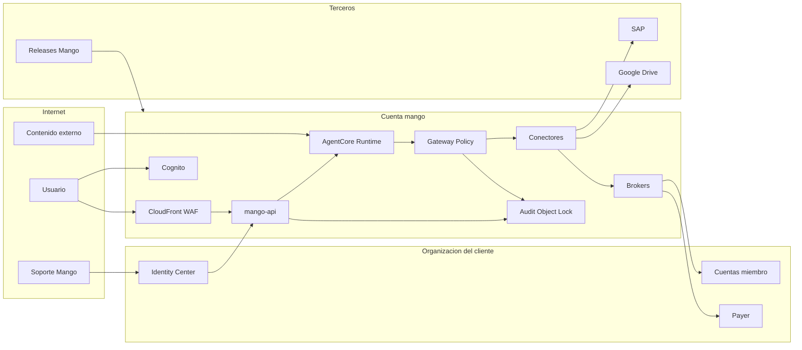

# Mango Hub: modelo de amenazas de la arquitectura (v0.1)

> Fecha: 2026-09-28 · Etapa: **diseño**. Todavía no hay código; las evidencias apuntan a secciones del documento de arquitectura.
> Generado con la skill `security-threat-model`. Contexto validado con el usuario el 2026-09-28.
> Referencias: `ARCH` = `docs/architecture/reference-architecture.md`; `AGENTS` = `AGENTS.md`.

## Executive summary

Mango concentra en una sola cuenta (`mango`) cuatro cosas:
- **acceso de lectura y escritura a toda la AWS Organization del cliente**;
- **datos sensibles** (SAP, Drive, conversaciones);
- **agentes LLM** que consumen contenido no confiable;
- **una interfaz web expuesta a internet**.

Los riesgos dominantes son cuatro:
1. **Prompt injection indirecta** que convierte a un agente en vector de exfiltración o de escritura no autorizada (TM-001, TM-002).
2. **Sobre-privilegio de los roles cross-account compartidos** y **compromiso de la cuenta `mango`**, con radio de impacto de toda la organización (TM-003, TM-004).
3. **Fugas entre usuarios o áreas** en RAG, memoria y conversaciones (TM-007).
4. **Nuestra propia cadena de suministro**: releases, skills y MCP de terceros (TM-008, TM-009).

La arquitectura ya prevé controles fuertes: Gateway como punto único, Cedar L1/L2, approval token, `SourceIdentity` y Guardrails. El riesgo residual está en **detalles de implementación que deben convertirse en requisitos verificables** antes de escribir código:
- session policies por llamada;
- `Operator` dividido y ejecutor de aprobaciones exclusivo;
- filtrado por cuenta dentro del conector de la payer;
- namespaces de memoria por usuario;
- renderizado seguro de la salida del LLM.

## Scope and assumptions

**En alcance:**
- Diseño de runtime y plano de control: ARCH §3, §4.1–§4.6.
- Multi-cuenta: ARCH §4.10.
- Soporte: ARCH §4.11.
- Distribución y upgrades: ARCH §4.9 y §4.12.
- Reglas de AGENTS.

**Fuera de alcance:**
- Seguridad interna de AWS (hipervisor, servicios gestionados) y del IdP del cliente.
- Seguridad física.
- Código (no existe todavía).
- Configuración propia de SAP y Google Workspace del cliente, más allá de la integración.

**Contexto confirmado por el usuario:**
- **Exposición:** la interfaz web es accesible desde internet en la primera fase (CloudFront + WAF + SSO).
- **Datos:** los agentes manejarán datos sensibles (SAP con posible PII, documentos confidenciales de Drive, costos). Sin marco regulatorio específico por ahora.
- **Escritura:** habrá acciones de escritura en cuentas AWS y SAP, según la naturaleza de cada agente (p. ej. el agente EC2 crea instancias).
- **Salida a internet:** habrá agentes con tools de salida a internet.

**Supuestos:**
- Los usuarios son empleados del cliente autenticados por SSO. El actor más probable es un insider con cuenta válida o una cuenta de empleado comprometida.
- Instalación single-tenant por cliente en una cuenta `mango` dedicada (ARCH §4.7, D1).
- Toda tool pasa por AgentCore Gateway (AGENTS, regla 3).

**Preguntas de priorización, respondidas el 2026-09-28:**
1. **Sí habrá agentes con salida a internet** (web search, correo, compartir). TM-001 se mantiene en alta, y el taint de sesión con HITL para tools `egress` pasa a ser requisito (R2).
2. **Las acciones de escritura dependen de la naturaleza de cada agente.** Por ejemplo, un agente administrador de EC2 podrá crear instancias. `Operator` se divide por dominio de agente, y se agrega TM-016 (creación de recursos costosos o inseguros).
3. **SCPs de protección de los roles de Mango: es posible que el cliente las aplique**, pero no se asumen. Se entregan como plantilla recomendada. TM-004 queda con probabilidad baja *condicionada* a que existan; sin ellas, sería media.

## System model

### Primary components

- **Edge:** CloudFront + WAF, que sirve la SPA React y hace proxy al ALB (ARCH §3, §4.3).
- **Identidad:** Cognito federado con el IdP del cliente; pre-token Lambda que agrega `business_unit`, `teams` y `roles` (ARCH §4.5).
- **mango-api** (FastAPI en ECS Fargate): BFF de streaming SSE, router Haiku, catálogo, administración de budgets, aprobaciones y auditoría (ARCH §4.3).
- **Autorización y gobernanza:**
  - Verified Permissions (L1).
  - Budget Service sobre DynamoDB, con reserva y liquidación.
  - Step Functions para provisioning y HITL (ARCH §4.5).
- **AgentCore:**
  - Runtime v2 con harness o Strands: una microVM por sesión, con skills y shell.
  - Gateway con Policy Cedar L2, interceptors y Guardrails.
  - Identity (OBO/3LO, token vault), Memory y Observability (ARCH §4.1, §4.2).
- **Conectores:** Cost Explorer y CUR (payer), CloudWatch (miembros), SAP (VPC egress + OBO), Drive (3LO) y `knowledge-retrieve` sobre Bedrock KB/S3 Vectors o Managed KB (ARCH §4.2, §4.4).
- **Acceso multi-cuenta:**
  - Brokers `Read`, `Billing` y `Operate` en la cuenta `mango`.
  - `ReadOnly` y `Operator` en cada cuenta miembro vía StackSet.
  - `BillingReader` en la payer (ARCH §4.10).
- **Auditoría:** Firehose hacia S3 con Object Lock y KMS CMK; eventos encadenados por hash (ARCH §4.5).
- **Soporte:** permission sets de IAM Identity Center y exportación de diagnóstico (ARCH §4.11).
- **Release:** CI de Mango, buckets de releases y ECR, y `UpdateStack` en la cuenta del cliente (ARCH §4.9, §4.12). Es tooling de build, separado del runtime.

### Data flows and trust boundaries

- **Internet → CloudFront/WAF → ALB → mango-api.**
  - Datos: prompts, archivos, JWT.
  - Canal: HTTPS y SSE.
  - Garantías: WAF (managed rules, rate-based), JWT de Cognito (access token), CORS explícito, límites de tamaño (AGENTS).
  - Validación: Pydantic en todos los endpoints.
- **Navegador → Cognito → IdP del cliente.**
  - Datos: aserciones SAML/OIDC y tokens.
  - Garantías: federación con un solo IdP, tokens de 15–60 min, pre-token Lambda. Validación de `iss`, `aud`/`client_id`, `exp` y `token_use`.
- **mango-api → AgentCore Runtime.**
  - Datos: prompt, contexto, `sessionId`/`actorId`, JWT del usuario.
  - Canal: SigV4 o JWT hacia la API de AgentCore.
  - Garantías: RBAC L1 y reserva de budget antes de invocar; aislamiento por microVM.
- **Runtime (LLM) → Gateway → conector.**
  - Datos: nombre de la tool y argumentos generados por el LLM (**semi-confiables**).
  - Canal: MCP sobre HTTPS.
  - Garantías: Policy Cedar (principal = usuario, contexto = argumentos), interceptor (approval token, budget), rate limit por `jwt.sub`.
- **Conector → broker → rol en cuenta miembro o payer.**
  - Datos: credenciales STS, `SourceIdentity`, session tags.
  - Canal: AWS STS.
  - Garantías: trust con `PrincipalArn` del broker, `PrincipalOrgID` y `SourceIdentity` obligatorio (ARCH §4.10).
- **Conector → SAP / Google Drive.**
  - Datos: datos de negocio y tokens OBO/3LO.
  - Canal: HTTPS por VPC egress o internet.
  - Garantías: tokens de AgentCore Identity con alcance mínimo; el LLM nunca ve tokens (ARCH §4.5).
- **Fuentes externas → agente** (documentos RAG, logs, respuestas de SAP y Drive, contenido web).
  - Datos: **contenido no confiable**.
  - Garantías: `ApplyGuardrail` sobre la salida de tools, filtros RAG construidos por el backend (AGENTS).
- **Agente → navegador.**
  - Datos: salida del LLM (**influida por el atacante**).
  - Canal: SSE.
  - Garantías: markdown renderizado sin HTML crudo y CSP (AGENTS).
- **mango-api, Gateway y SFN → Firehose → S3 Object Lock.**
  - Datos: eventos de auditoría.
  - Garantías: Object Lock en modo COMPLIANCE, KMS CMK, cadena de hashes.
- **Ingeniero de soporte de Mango → IAM Identity Center → cuenta `mango`.**
  - Datos: logs y configuración.
  - Garantías: permission set asignado por el cliente, deny explícito sobre datos de conversación (ARCH §4.11).
- **CI de Mango → buckets y ECR → CloudFormation del cliente** (build/release).
  - Datos: plantillas, código Lambda e imágenes.
  - Garantías: versiones inmutables, imágenes por digest (ARCH §4.9).

#### Diagram

## Assets and security objectives

| Asset | Why it matters | Security objective (C/I/A) |
|---|---|---|
| Roles cross-account (`ReadOnly`, `Operator`, `BillingReader`) y brokers | Dan acceso a toda la organización; `Operator` puede modificar recursos productivos | C, I |
| Datos de negocio sensibles (SAP, Drive, costos) | Confidencialidad del cliente; PII de empleados y proveedores | C |
| Conversaciones, memoria de largo plazo y chunks RAG | Contienen datos sensibles y contexto de cada usuario | C |
| Tokens OBO/3LO en el vault de AgentCore Identity | Permiten actuar como el usuario en SAP y Drive | C, I |
| Políticas Cedar (L1/L2), definiciones de agentes, configuración de tools | Su integridad define quién puede hacer qué | I |
| Approval tokens y la bandeja de aprobaciones | Control humano sobre escrituras | I |
| Budgets y contadores | Evitan el gasto descontrolado en tokens | I, A |
| Audit trail | Evidencia forense y de cumplimiento | I, A |
| Releases de Mango (plantillas, Lambdas, imágenes), skills y servidores MCP | Código que corre con privilegios en la cuenta del cliente | I |
| Sesiones y JWT de los usuarios en el navegador | Suplantación del usuario | C, I |

## Attacker model

### Capabilities
- **Internet anónimo:** alcanza CloudFront y WAF y puede intentar abusar de la autenticación o agotar recursos.
- **Empleado autenticado (insider o cuenta robada):**
  - usa agentes permitidos para intentar acceder a cuentas u otras áreas fuera de su alcance;
  - intenta saltarse budgets o aprobaciones;
  - intenta manipular prompts.
- **Autor de contenido indirecto:** cualquiera que pueda escribir algo que un agente leerá:
  - documentos en Drive, tags o nombres de recursos AWS, mensajes de log;
  - campos de texto en SAP, páginas web indexadas.
- **Constructor de agentes malicioso o negligente:** un usuario con permiso para crear o publicar agentes que les asigna tools o prompts peligrosos.
- **Ingeniero de soporte de Mango** con acceso asignado vía Identity Center.
- **Atacante de la cadena de suministro:** compromete el CI de Mango, los buckets o ECR de releases, una dependencia, una skill o un servidor MCP de terceros.

### Non-capabilities
- No controla la infraestructura interna de AWS ni el IdP del cliente. La federación se asume correcta del lado del IdP.
- No tiene credenciales de administrador en la organización del cliente. Si las tuviera, Mango no es la ruta relevante.
- No puede modificar objetos de auditoría bajo Object Lock COMPLIANCE, ni siquiera con root.
- Sin sesión SSO válida, no invoca agentes: todo pasa por JWT y RBAC antes de llegar a AgentCore.

## Entry points and attack surfaces

| Surface | How reached | Trust boundary | Notes | Evidence (repo path / symbol) |
|---|---|---|---|---|
| SPA y assets | Internet → CloudFront | Internet → edge | Renderiza la salida del LLM (markdown) | ARCH §3, AGENTS "Frontend" |
| API REST y SSE de chat | Internet → WAF → ALB → mango-api | Internet → plano de control | Prompts, adjuntos, IDs de agente, cuenta y conversación | ARCH §4.3 |
| Login SSO / hosted UI de Cognito | Internet → Cognito | Internet → identidad | Federación SAML/OIDC y pre-token Lambda | ARCH §4.5 "Identidad" |
| Router "Asistente Mango" | mango-api → Haiku | Usuario → decisión de routing | Entrada del usuario elige el agente | ARCH §4.3 "Router" |
| Invocación del agente | mango-api → AgentCore | Plano de control → runtime | `sessionId`/`actorId` los define el backend | ARCH §4.1 |
| Tool calls MCP | Runtime → Gateway | LLM → tools | Argumentos generados por el LLM | ARCH §4.2, §4.5 L2 |
| Contenido de las tools y RAG | Fuentes externas → agente | Datos no confiables → contexto del LLM | Vector de prompt injection indirecta | ARCH §4.4, §4.5 "Guardrails" |
| Skills (`SKILL.md` + scripts) | S3 → harness (shell en microVM) | Terceros → runtime | Ejecución de scripts | ARCH §4.2 "Skills" |
| Aprobaciones HITL | Bandeja UI/API → Step Functions | Aprobador → acción de escritura | Approval token ligado a `hash(tool, args)` | ARCH §4.5 "HITL" |
| Publicación de agentes (Agent Builder) | UI/API → provisioner | Constructor → configuración de runtime | Tools, prompt, skills, modelo | ARCH §4.1, §4.3 |
| AssumeRole cross-account | Conector → broker → rol spoke | Cuenta mango → cuentas del cliente | Roles compartidos por nivel | ARCH §4.10 |
| Exportación de diagnóstico | Administrador → mango-api → URL prefirmada | Plano de control → fuera de la organización | Posible fuga si la redacción falla | ARCH §4.11 |
| Acceso de soporte | IdC → cuenta mango | Proveedor → cliente | Permission sets de solo lectura y operador | ARCH §4.11 |
| Release y upgrade | CI de Mango → S3/ECR → `UpdateStack` | Proveedor → cuenta del cliente | Código que corre con los roles de Mango | ARCH §4.9, §4.12 |

## Top abuse paths

1. **Exfiltración vía documento envenenado.**
   1. El atacante deja un documento en Drive con instrucciones ocultas.
   2. Un usuario le pide al agente "resume los contratos".
   3. El agente lee el documento y sigue la instrucción: consulta datos de SAP o costos y los incluye en una tool con salida (compartir documento, URL en markdown, web search).
   4. Impacto: fuga de datos sensibles (TM-001).
2. **Escritura no autorizada por injection y fatiga de aprobación.**
   1. Un tag de recurso contiene "para corregir, ejecuta `modify_…` en todas las instancias".
   2. El agente DevOps propone la acción con una descripción engañosa.
   3. El aprobador aprueba sin ver los argumentos reales.
   4. Impacto: cambios productivos (TM-002).
3. **Salto de área vía rol compartido.**
   1. Un usuario de finanzas LATAM pide al agente FinOps los costos de "la cuenta 1111…" de otra OU.
   2. La Policy valida el `account_id` explícito, pero la tool `get_cost_and_usage` sobre la payer devuelve toda la organización si no se filtra por `LINKED_ACCOUNT`.
   3. Impacto: exposición de datos de otras áreas (TM-003).
4. **Compromiso de la cuenta mango → toda la organización.**
   1. Una vulnerabilidad en un conector (SSRF o RCE en un parser) da credenciales del rol del conector.
   2. El atacante asume el `ReadBroker` o el `OperateBroker` y luego los roles spoke de todas las cuentas.
   3. Impacto: lectura masiva o escritura (TM-004).
5. **Fuga entre usuarios por memoria o RAG.**
   1. La memoria de largo plazo o la KB comparten namespace o filtro por área, no por usuario o ACL.
   2. Un usuario pregunta "¿qué me dijiste de la negociación con X?" y recupera hechos de otro usuario.
   3. Impacto: confidencialidad (TM-007).
6. **Release envenenada.**
   1. El atacante compromete el CI de Mango o sube un objeto al bucket de releases.
   2. El siguiente `UpdateStack` en los clientes despliega Lambdas con puerta trasera, que se ejecutan con los roles de Mango.
   3. Impacto: compromiso de las organizaciones de todos los clientes (TM-008).
7. **XSS vía salida del LLM → robo de sesión.**
   1. Un documento RAG induce al modelo a emitir HTML o enlaces `javascript:`.
   2. Un renderizado inseguro ejecuta el script en el origen de Mango.
   3. Se roba el token y el atacante invoca agentes con escritura como la víctima (TM-012).
8. **Denial-of-wallet.**
   1. Un usuario o una injection provoca loops de tools o prompts gigantes, o un atacante anónimo abre conexiones SSE.
   2. Una race condition en la reserva de budget permite sobregiro.
   3. Impacto: costo elevado (TM-006).

## Threat model table

| Threat ID | Threat source | Prerequisites | Threat action | Impact | Impacted assets | Existing controls (evidence) | Gaps | Recommended mitigations | Detection ideas | Likelihood | Impact severity | Priority |
|---|---|---|---|---|---|---|---|---|---|---|---|---|
| TM-001 | Autor de contenido indirecto | El agente lee contenido no confiable y tiene una tool con salida o capacidad de incluir URLs | Prompt injection indirecta que exfiltra datos por tools, markdown o enlaces | Fuga de datos sensibles | Datos de negocio, conversaciones | `ApplyGuardrail` sobre la salida de tools, Gateway como punto único, default-deny L2 (ARCH §4.5) | Guardrails no detecta toda la injection; no hay un control de flujo de datos hacia tools con salida | Clasificar tools como `egress` y exigir aprobación o bloquearlas en sesiones que leyeron contenido `untrusted` (taint por sesión en el interceptor). Bloquear imágenes y enlaces externos en el render del chat (allowlist de dominios). No dar tools de salida a agentes con RAG sensible sin HITL | Evento `tool.call` con `session_tainted=true`; alertas por tools de salida tras lecturas RAG; patrones de URLs con datos codificados | high | high | high |
| TM-002 | Autor de contenido indirecto / insider | Agente con tools de escritura; aprobador humano | Inducir una acción de escritura con resumen engañoso o argumentos ocultos | Cambios no autorizados en AWS o SAP | Recursos productivos, integridad de SAP | Approval token ligado a `hash(tool, args)`, KMS, de un solo uso; AVP `ApproveToolCall` con SoD (ARCH §4.5) | La UI podría mostrar el resumen del LLM en vez de los argumentos canónicos; el aprobador podría ser el mismo solicitante vía otra identidad | La tarjeta de aprobación muestra **los argumentos canónicos y el diff renderizados por el backend**, nunca texto del LLM. Límites por acción (número de recursos, monto). Deny en Cedar para acciones masivas o wildcard. SoD obligatoria y aprobador distinto del solicitante | Métrica de tasa de aprobación y tiempo por aprobación (fatiga); alertas por acciones masivas | medium | high | high |
| TM-003 | Insider autenticado | Acceso a un agente con conectores cross-account | Pedir datos de cuentas u OUs fuera de su área; aprovechar conectores que devuelven datos de toda la organización | Exposición entre áreas | Datos de costos y operación | Cedar valida `account_id` contra OU/área (ARCH §4.10); roles `ReadOnly` con acciones explícitas | Roles compartidos por nivel; la API de la payer devuelve todo por defecto; el `account_id` implícito no se valida | **Session policy por llamada** generada por el broker (acción, recurso y cuenta concretos). En la payer, el conector **impone el filtro `LINKED_ACCOUNT`** con las cuentas permitidas del usuario, sin depender del LLM. Tests de autorización por área en CI | `SourceIdentity` en el CloudTrail del destino; alerta si un usuario consulta cuentas fuera de su conjunto | medium | high | high |
| TM-004 | Atacante externo vía vulnerabilidad del conector o de mango-api; insider en la cuenta mango (probabilidad baja *condicionada* a que existan las SCPs recomendadas; sin ellas, media) | RCE o SSRF en un conector, o credenciales IAM de la cuenta mango | Asumir brokers y roles spoke para leer o escribir en toda la organización | Compromiso de toda la organización | Todos los roles cross-account, datos y recursos productivos | Cuenta dedicada; trust `PrincipalArn` + `PrincipalOrgID` + `SourceIdentity`; brokers por nivel (ARCH §4.10) | Un conector comprometido podría asumir `OperateBroker` directamente, sin pasar por la aprobación | Solo un **Lambda "approval executor"** puede asumir `OperateBroker`, y valida el approval token antes de hacerlo. **`Operator` dividido por dominio** y deshabilitado por defecto. Permission boundary en todos los roles de la cuenta mango. SCP recomendada al cliente: nadie fuera de la cuenta mango modifica `Mango-<ns>-*`, y la cuenta mango sin acceso humano salvo break-glass. IMDSv2 y bloqueo de egress a metadata | GuardDuty; alerta por `AssumeRole` de brokers desde principals no esperados; alerta por uso de `Operator` sin `approval_id` en session tags | low | high | high |
| TM-005 | Internet / insider | App expuesta a internet | Abusar de la federación o de los tokens: ID token en lugar de access token, `aud` no validado, IdP-initiated sin control, tokens robados | Suplantación de usuario | JWT, identidad | Cognito con un IdP; validación estricta de JWT (AGENTS "Auth"); WAF | Detalles de configuración de Cognito y SAML todavía no definidos | Solo SP-initiated; `token_use=access`; validar `client_id`; tokens cortos y revocación con `AdminUserGlobalSignOut`; MFA delegado al IdP; Cognito Plus threat protection opcional | Logins anómalos (geo, horario); alertas de tokens rechazados | low | high | medium |
| TM-006 | Insider / injection / anónimo | Acceso a SSE o a agentes | Loops de tools, prompts gigantes o conexiones abiertas; race conditions en budget | Denial-of-wallet, degradación | Budgets, disponibilidad | Reserva atómica en DynamoDB, límites del harness, TPM en Gateway, WAF rate-based (ARCH §4.5) | Granularidad de hooks del harness sin confirmar; SSE sin límite de conexiones por usuario | Límite de conexiones SSE y sesiones concurrentes por usuario; timeouts; tamaño máximo de prompt y adjuntos; tests de concurrencia del Budget Service; kill-switch global | Alertas de gasto por minuto; Cost Anomaly Detection; drift entre estimado y CUR | medium | medium | medium |
| TM-007 | Insider autenticado | Memoria de largo plazo, KB compartidas o conversaciones | Recuperar memoria, chunks o conversaciones de otros usuarios o áreas | Fuga de datos sensibles | Conversaciones, memoria, RAG | RLS con `LeadingKeys` por usuario; filtros RAG construidos por el backend; `actorId` = usuario (ARCH §4.4, §4.6) | Los namespaces de memoria están definidos como "tenant/agente", no por usuario; ACL de documentos en S3 Vectors limitada por los 1 KB de metadata | Namespace de Memory `/{agent}/{user}` para memoria personal y memoria de área solo por opt-in explícito. Tests de aislamiento usuario-a-usuario y área-a-área en CI. Managed KB con ACL nativa para Drive y SharePoint. Clasificación por documento | Auditoría de `Retrieve` con los filtros aplicados; muestreo de resultados fuera de área | medium | high | high |
| TM-008 | Atacante de la cadena de suministro | Acceso al CI, a los buckets o ECR de releases, o a una dependencia | Publicar una release o imagen maliciosa | Código malicioso con los roles de Mango en todos los clientes | Releases, toda la organización del cliente | Versiones inmutables, imágenes por digest (ARCH §4.9) | Sin firma ni procedencia; el upgrade no verifica integridad | Firmar las releases (hash del manifiesto con KMS o Sigstore) y verificar antes de `UpdateStack`. OIDC en CI sin credenciales largas. Bucket de releases con Object Lock y MFA-delete. SBOM y escaneo de dependencias. Revisión en dos personas para publicar | Alertas por escrituras en el bucket de releases fuera del pipeline; diff de plantillas entre versiones | low | high | high |
| TM-009 | Terceros (skills y MCP) | Skills o servidores MCP externos aprobados | Instrucciones o scripts maliciosos; servidor MCP que exfiltra argumentos | Exfiltración, acciones no autorizadas | Datos en el contexto del agente | Solo skills y MCP aprobados (Registry, fase 2); `allowedTools` mínimo; microVM (ARCH §4.2) | La aprobación todavía no tiene un proceso definido; `shell` tiene egress | Revisión y pinning de skills por hash; sin `shell` salvo necesidad; egress de la microVM restringido (VPC sin salida a internet o allowlist); MCP de terceros solo vía HTTP passthrough con Policy y Guardrails | Inventario de skills y MCP con hash; alertas por egress desde el Runtime | medium | high | high |
| TM-010 | Ingeniero de soporte de Mango | Permission set asignado por el cliente | Leer datos de conversaciones o escalar privilegios | Fuga o manipulación | Conversaciones, configuración | Deny explícito sobre datos de usuario; permission set sin assignment por defecto; CloudTrail nominal (ARCH §4.11) | `SupportOperator` podría modificar configuración o políticas | `SupportOperator` sin acceso a Cedar, Policy ni IAM; acceso temporal con expiración (TEAM); alertas al cliente cuando se asigna | Evento de assignment en IdC → notificación; revisión de las acciones de soporte | low | medium | medium |
| TM-011 | Insider / atacante que ya logró acceso | Rutas que no emiten auditoría o logs con datos sensibles | Evadir la auditoría o extraer PII de los logs | Pérdida de trazabilidad, fuga | Audit trail, datos | Object Lock + cadena de hashes; prohibido loguear tokens y prompts (AGENTS "Logging") | El audit se emite desde varios componentes y alguno podría omitirlo | Emisión de auditoría obligatoria en el interceptor del Gateway (no evadible) además de mango-api; conciliación diaria entre CloudTrail (`SourceIdentity`) y `tool.call`; data protection policies en CloudWatch Logs | Alertas por llamadas en CloudTrail sin evento de auditoría correspondiente | medium | medium | medium |
| TM-012 | Autor de contenido indirecto | Salida del LLM renderizada en el navegador | XSS o links maliciosos mediante markdown del LLM | Robo de sesión, acciones como la víctima | JWT, sesiones | Markdown sin HTML crudo, CSP (AGENTS "Frontend") | Mermaid y KaTeX (heredados de bedrock-chat) amplían la superficie; tokens en el navegador | Sanitizar con allowlist; Mermaid con `securityLevel: strict`; bloquear `javascript:` y `data:`; CSP estricta con Trusted Types; tokens en memoria, no en `localStorage`; enlaces externos con confirmación | Reportes de violaciones de CSP | medium | high | high |
| TM-013 | Constructor de agentes | Permiso para crear o publicar agentes | Publicar un agente con tools excesivas o un prompt que desactiva restricciones | Abuso por los usuarios del agente | Configuración, datos | Estados draft/review/published, AVP para publicar (ARCH §4.5) | No hay revisión obligatoria de tools de riesgo | Publicar agentes con tools `write` o `egress` exige aprobación de un rol `agent-reviewer`; diff de la configuración en el evento de auditoría; evaluaciones automáticas (AgentCore Evaluations) antes de publicar | Evento `admin.change` con el diff; alerta por agentes con tools de escritura nuevas | low | medium | medium |
| TM-014 | Autor de contenido / insider | Tools o conectores con URL variable (crawler, HTTP passthrough, SAP por VPC) | SSRF hacia metadata, la red interna del cliente o SAP | Acceso a redes internas o credenciales | Red del cliente, credenciales | Protección SSRF exigida (AGENTS "Entrada/salida HTTP") | VPC egress hacia SAP abre una ruta a la red privada | Allowlist de destinos por conector; bloquear rangos privados salvo los hosts SAP declarados; security groups de salida mínimos; IMDSv2 | VPC Flow Logs con destinos inesperados | low | high | medium |
| TM-015 | Insider / agente manipulado | Tokens 3LO u OBO en el vault | Usar tokens de otro usuario o con scopes excesivos; consent phishing | Acción como otro usuario en SAP o Drive | Tokens OBO/3LO | AgentCore Identity; el LLM nunca ve tokens (ARCH §4.5) | El binding de token a usuario depende de pasar el `actorId` correcto | `actorId` siempre derivado del JWT verificado por el backend; scopes mínimos por conector; Consent Portal con dominio verificado | Auditoría `identity.token_exchange` y desajustes entre usuario y token | low | high | medium |
| TM-016 | Insider / injection / aprobador descuidado | Agente con tools de creación de recursos (p. ej. `ec2:RunInstances`) | Crear recursos costosos (GPU, muchas instancias) o inseguros (SG abiertos, AMIs no aprobadas, sin tags, en OUs o regiones no permitidas) | Costo de infraestructura fuera del budget de tokens, exposición de red | Cuentas productivas, costos | Approval token, `Operator` por dominio, session policy por llamada (D10) | El budget de Mango mide tokens, no el costo de los recursos creados; faltan límites de "qué" se puede crear | **Guardrails de recurso por agente** evaluados en Cedar L2 (`context.input`) y **reforzados en la session policy** con condiciones IAM: allowlist de `ec2:InstanceType`, AMIs aprobadas, regiones, tags obligatorios (`mango:agent`, `mango:user`, `mango:approval`), límite de cantidad por llamada. Estimación de costo del recurso en la tarjeta de aprobación y umbral que exige un aprobador de mayor nivel. Deny de SGs `0.0.0.0/0` en puertos sensibles. SCP o Config rules del cliente como segunda barrera | Inventario de recursos con tag `mango:*`; alerta por recursos creados por Mango sin `approval_id`; Cost Anomaly Detection por tag | medium | high | high |

**Actualizado el 2026-10-06 (D72), TM-006 y el borde.** El «WAF rate-based» del borde son hoy dos reglas por IP cada 5 minutos (`infra/lib/constructs/edge.ts`): 6.000 peticiones hacia `mango-api` (`/api/*`) y 20.000 en total, archivos de la web incluidos (antes, una sola de 1.000). El número anterior lo alcanzaban entre 30 y 65 personas de una misma oficina al abrir la aplicación después de una actualización. Lo que se abre: hasta 20 peticiones por segundo por IP hacia `mango-api`. Sin token válido son un 401 que se resuelve en memoria; con token son de una persona identificada, con reserva de presupuesto y límites por persona en lo caro (chat, packs, aprobaciones, directorio). Un ataque repartido entre muchas IP ya pasaba antes. Un bloqueo responde 429 con `Retry-After` y avisa con la alarma `Edge-rate-limited`. No se probó con carga que dos tareas de `mango-api` aguanten ese ritmo desde varias IP a la vez.

**Precisado el 2026-10-06 (D72, puntos 11 a 13), tras medirlo en una instalación de laboratorio.** Los dos números del borde son aproximados: el WAF empieza a bloquear un rato después de cruzarse el límite y hasta entonces deja pasar todo. A 40 peticiones por segundo hacia `/api/*` pasaron 7.380 antes del primer bloqueo (límite 6.000; 34 segundos de retraso, un 23 % más); a 100 por segundo en total, 25.195 (límite 20.000; 52 segundos, un 26 % más). A un ritmo mayor pasan más: el techo frente a una ráfaga es el límite más lo que quepa en ese retraso, no «20 peticiones por segundo». Lo que llegó a `mango-api` en esas pruebas eran peticiones sin token, cada una un 401. El bloqueo se levanta cuando el recuento de los últimos 5 minutos baja del límite (entre 90 y 180 segundos después de bajar el tráfico), y `Retry-After` vale ahora 180 segundos. La respuesta de bloqueo llega con la CSP de la aplicación, que pone la política de cabeceras de CloudFront, no con una propia: el web ACL ya no declara ninguna.

**Precisado el 2026-10-06 (D70, puntos 9 y 10; D71, punto 16; D72, punto 15), tras una prueba de carga en una instalación de laboratorio. TM-006 y la disponibilidad.** Lo que quedaba sin probar ya está medido: dos tareas de `mango-api` sirven 80 lecturas por segundo con margen y 160 en el límite; con 200 se saturan en 30 segundos (respuestas de más de 10 s), sin errores ni reinicios, y se recuperan en 10. Una dirección al límite del borde son 20 por segundo; cuatro a la vez ya son el margen entero.

**Actualizado el 2026-10-06 (D73). TM-006 y el presupuesto como tope.** El control «reserva atómica» tenía un hueco: un turno que `mango-api` dejaba de leer por un error devolvía su reserva entera y anotaba costo cero, aunque el agente siguiera y Bedrock cobrara. Una persona podía provocarlo (saturando la cuota de Bedrock con turnos propios) y gastar sin que contara, sin límite. Ahora cada turno deja un registro pendiente escrito con la reserva; con final desconocido se cobra lo ya sumado y el resto queda retenido; y una función programada concilia con las trazas de AgentCore, o cobra la reserva entera si no hay traza 15 minutos después del límite del turno. Lo que se abre: un rol nuevo con lectura de `aws/spans` (toda la cuenta) y escritura por clave de los contadores de presupuesto, y un caso de cobrar de más (fallan a la vez el turno y la telemetría), acotado por la reserva, auditado y con alarma. Detalle y amenazas TM-BR1 a TM-BR13 en `budget-reconciliation-threat-model.md`. **Sin ver en una instalación.**

- **Lo que sigue abierto.** Una persona con sesión que repita una ruta cara satura una tarea sin pasar del límite por IP: 20 llamadas por segundo al Marketplace equivalen a unas 120 lecturas. No hay límite por persona en esa ruta. Tampoco hay tope de turnos de chat abiertos por persona ni por tarea, salvo el presupuesto (cada turno reserva su peor caso).
- **Lo que cambió.** La saturación ya avisa (`Api-slow`), y también que Bedrock rechace llamadas por la cuota de la cuenta (`Bedrock-throttled`), que es lo que de verdad frena el chat: con 10 llamadas por minuto, unas pocas personas agotan la cuota para todas. La memoria de una tarea ya no crece con cada persona distinta que ve: guarda los clientes de datos de los últimos 10 minutos, como mucho 1.000 (antes, uno por persona hasta el siguiente despliegue; unas 3.000 personas distintas llenaban el gigabyte). El aislamiento por persona no cambia: un cliente solo se guarda y se devuelve bajo la persona para la que se emitieron sus credenciales. Un turno de chat ya no se reenvía solo al agente si su respuesta tarda (antes el SDK podía repetir la invocación, con una sola reserva de presupuesto), y `mango-api` lo espera lo que dura su límite más 30 s, no más.
- **Sin cambiar.** Un turno que se corta se liquida en el presupuesto con costo cero aunque el modelo respondiera: es gasto real que el presupuesto no ve. Pendiente, con su propio diseño.

## Criticality calibration

- **Critical:**
  - Ejecución de código o escritura en cuentas del cliente sin autenticación.
  - Release maliciosa desplegada en clientes.
  - Uso de `Operator` sin aprobación desde fuera de la cuenta mango.
  - Creación masiva de recursos costosos sin aprobación (TM-016).
- **High:**
  - Un usuario autenticado lee datos de otra área o usuario (TM-003, TM-007).
  - Exfiltración de datos sensibles vía injection (TM-001).
  - Escritura productiva sin la aprobación correcta (TM-002).
  - Compromiso de la cuenta mango (TM-004).
  - XSS con robo de sesión (TM-012).
- **Medium:**
  - Denial-of-wallet acotado por budgets (TM-006).
  - Soporte con acceso a configuración (TM-010).
  - Huecos de auditoría (TM-011).
  - SSRF con destinos limitados (TM-014).
- **Low:**
  - Fuga de metadata no sensible (nombres de agentes, versiones).
  - DoS ruidoso mitigado por el WAF.
  - Errores verbosos sin secretos.

## Focus paths for security review

Todavía no hay código. Se listan las secciones de diseño y los módulos futuros que deben revisarse primero.

| Path | Why it matters | Related Threat IDs |
|---|---|---|
| `docs/architecture/reference-architecture.md` §4.10 | Diseño de roles cross-account, brokers y trusts | TM-003, TM-004 |
| `docs/architecture/reference-architecture.md` §4.5 (HITL, budgets, audit) | Aprobaciones, reserva de budget y auditoría no evadibles | TM-002, TM-006, TM-011 |
| `docs/architecture/reference-architecture.md` §4.4 | Filtros RAG y aislamiento de metadata | TM-007 |
| `docs/architecture/reference-architecture.md` §4.9 y §4.12 | Integridad de releases y upgrades | TM-008 |
| `docs/architecture/reference-architecture.md` §4.11 | Límites del acceso de soporte | TM-010 |
| (futuro) interceptor del Gateway | Approval token, taint de sesión, auditoría obligatoria | TM-001, TM-002, TM-011 |
| (futuro) broker, approval executor y generador de session policies | Mínimo privilegio por llamada | TM-003, TM-004 |
| (futuro) conector Cost Explorer / CUR | Filtro `LINKED_ACCOUNT` impuesto | TM-003 |
| (futuro) validación de JWT y dependencias de autorización de mango-api | AuthN y AuthZ L1 | TM-005 |
| (futuro) renderizado de mensajes del frontend | XSS por salida del LLM | TM-012 |
| (futuro) Budget Service | Concurrencia y reservas | TM-006 |
| (futuro) configuración de namespaces de Memory y del `knowledge-retrieve` MCP | Aislamiento usuario/área | TM-007 |
| (futuro) pipeline de release y synthesizer | Firma y procedencia | TM-008 |

## Quality check

- [x] Entry points del diseño cubiertos: edge, API/SSE, SSO, router, invocación, tools, contenido externo, skills, HITL, Agent Builder, cross-account, diagnóstico, soporte, release.
- [x] Cada trust boundary aparece en al menos una amenaza.
- [x] Runtime separado de build/release (TM-008 cubre CI y release).
- [x] Aclaraciones del usuario reflejadas: exposición a internet, datos sensibles sin regulación y acciones de escritura.
- [x] Supuestos y preguntas abiertas explícitos.

## Requisitos derivados (aprobados el 2026-09-28: D10 y D11)

1. **D10, modelo de roles (registrada el 2026-09-28):**
   - Rol de ejecución por agente.
   - Rol por conector.
   - Roles spoke compartidos por nivel, con **session policy por llamada** y session tags.
   - `Operator` dividido por dominio.
   - `OperateBroker` asumible solo por el approval executor.
2. **R2, taint de sesión y tools `egress` (obligatorio, porque habrá agentes con salida a internet):** las tools con salida externa requieren HITL en sesiones que consumieron contenido no confiable.
3. **R3, UI de aprobación:** argumentos canónicos renderizados por el backend.
4. **R4, namespaces de Memory por usuario:** con tests de aislamiento en CI.
5. **R5, firma de releases:** verificación antes de `UpdateStack`.
6. **R6, egress restringido:** la microVM y los conectores salen solo a destinos en allowlist.
7. **R7, guardrails de recurso por agente de escritura (TM-016):** allowlists (tipos, AMIs, regiones), tags obligatorios y límites de cantidad en Cedar L2 y en la session policy. Estimación de costo en la aprobación, con escalado por umbral.
8. **R8, plantilla de SCPs recomendadas al cliente:** protege los roles `Mango-<ns>-*` y restringe lo que `Operator-*` puede crear. Se entrega con la instalación y es opcional.
