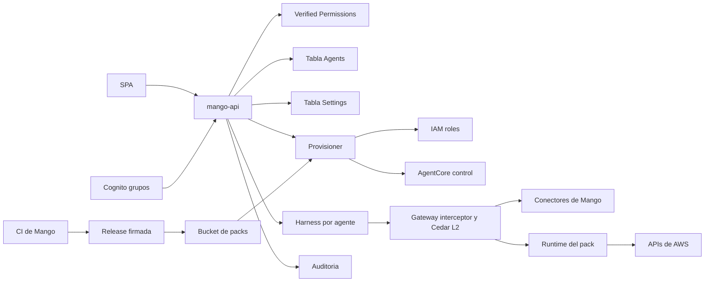

# Marketplace v1 (creación de agentes y catálogo de MCP): modelo de amenazas (v0.2)

> Fecha: 2026-10-01 · Skill: `security-threat-model`. Spec: `docs/specs/marketplace-v1.md` v0.2. Plan: `docs/specs/marketplace-v1-plan.md`. Decisiones: D18, D19, D30 y D32–D38.
> Contexto validado en `mango-architecture-threat-model.md`, `identity-propagation-threat-model.md`, `cost-explorer-connector-threat-model.md` y `admin-v0-threat-model.md`.
> Alcance: diseño (aún sin código del marketplace). API de agentes y de catálogo en `mango-api`, provisioner (Step Functions), pipeline de MCP packs en el CI de Mango, packs en AgentCore Runtime y pantallas de Builder, revisión, Org Chart y catálogo.
> Cambios frente a v0.1 (2026-09-29): amenazas nuevas TM-M11 a TM-M17 (sobrescritura en `InvokeHarness`, tools por agente con firma v2, grupos de acceso, punto de entrada de los packs, artefacto zip, agentes preaprobados de la release y Org Chart). TM-M1 a TM-M6 y TM-M9 se ajustan a D32–D38. Los ids de v0.1 no cambian.
> Añadido el 2026-10-01 (PR A11, reconciliación diaria, D41): TM-M18 a TM-M20 (rol de lectura del reconciliador, exención «en curso» y topic de alertas). El resto no cambia.
> Actualizado el 2026-10-01 (PR A5, chat con varios agentes y migración de FinOps, D42): TM-M16 pasa de diseño a implementación, con un riesgo residual aceptado por el usuario (la siembra de los agentes de la release). El resto no cambia.
> Actualizado el 2026-10-01 (PR C2, identidad en packs de datos de cuentas, D37): TM-M3 y TM-M14 pasan de diseño a implementación para packs `central_only`. El detalle y las amenazas nuevas (TM-I1 a TM-I10) están en `pack-identity-threat-model.md`.
> Añadido el 2026-10-01 (desaprovisionamiento al retirar, D48): TM-M21 a TM-M23 (retiro que ahora borra recursos, rol del deprovisioner y restos de un borrado fallido). TM-M6 y TM-M18 no cambian; el reconciliador sigue sin reparar nada.
> Actualizado el 2026-10-07 (D40 (5), primera instalación en una cuenta nueva): el rol del provisioner de agentes gana `iam:CreateServiceLinkedRole` sobre el rol vinculado de identidad de AgentCore, y solo sobre él. TM-M1 lo recoge; su prioridad no cambia. Comprobado con tests de la plantilla, sin ver en una instalación.
> Actualizado el 2026-10-09 (D58 (22)): una política administrada que alguien adjunta al rol de un agente o de un pack, fuera del provisioner, no viene de la plantilla fija de TM-M1; el boundary la sigue limitando. Al desinstalar, el `UninstallGuard` la quita antes de borrar el rol; no puede adjuntar ninguna. El análisis está en `customer-distribution-threat-model.md`. La prioridad de TM-M1 no cambia.
> Añadido el 2026-10-02 (TM-M23, aviso de limpieza en el Marketplace): `mango-api` gana `states:ListExecutions` sobre la máquina `Mango-<ns>-AgentDeprovisioner`, y solo sobre ella, para decir a los administradores si el borrado de un agente retirado está en curso o falló. Lee nombres y estados de ejecuciones (`<id>-retire-…`); no puede describirlas (entrada, salida, error), leer su historial ni detenerlas. El dato solo llega a administradores y es informativo: quien tenga `states:StartExecution` sobre esa máquina puede crear una ejecución con ese nombre y cambiar el aviso, pero no lo que el reconciliador reporta (`deprovision_incomplete`).
> Actualizado el 2026-10-01 (PR C1, Ajustes › Grupos): TM-M13 pasa de diseño a implementación (doble aprobación de cambios de grupos, claim `mango_central` calculado por el pre-token y permisos acotados). Riesgos residuales anotados en la fila. El resto no cambia.
> Añadido el 2026-10-02 («Personas» por correo en el Agent Builder): TM-M24 (consulta del directorio por creadores y admins). Es una excepción acordada por el usuario a la regla «Sin revelar si un usuario existe», registrada en `AGENTS.md`; la regla no cambia en login, registro y recuperación (`login-threat-model.md`). El resto no cambia.

## Executive summary

El marketplace convierte a Mango en una plataforma que **crea recursos con privilegios en tiempo de ejecución**: roles IAM, harness, Runtimes, targets del Gateway y políticas Cedar. También **ejecuta código de terceros** (servidores MCP de awslabs) dentro de la cuenta del cliente. Los riesgos dominantes son cinco:

1. **Escalada de privilegios a través del provisioner.** Si el contenido de una definición o de un manifiesto controla qué IAM se crea, un creador podría fabricarse un rol amplio.
2. **Publicar sin revisión real.** Autoaprobarse, cambiar el contenido después de aprobado o, desde v0.2, invocar el harness con un prompt y unas tools distintos de los aprobados: `InvokeHarness` permite sobrescribirlos en cada llamada.
3. **Tools fuera de lo aprobado.** El Gateway solo ve al usuario, no al agente. Sin un control propio, un agente podría llamar cualquier tool que el usuario tenga permitida.
4. **Cadena de suministro de los packs.** Una versión comprometida de un paquete, o un zip cambiado en la instalación, corre con el rol del pack.
5. **Fugas entre áreas.** Por packs que no filtran por usuario, o por un grupo marcado como central sin serlo.

Controles de diseño acordados (D18, D19, D32–D38):
- aprobación por un admin distinto del creador en cada versión, con despliegue por hash;
- solo `mango-api` invoca el harness, y arma la invocación desde la versión publicada;
- firma `X-Mango-Invocation` v2 con agente y tools, verificada por el interceptor del Gateway;
- doble aprobación para habilitar packs y para crear grupos o cambiarles el tipo;
- solo packs curados y firmados, nunca paquetes arbitrarios;
- packs de datos de cuentas restringidos a usuarios centrales, con la identidad de la persona en cada llamada;
- tools denegadas por defecto.

## Scope and assumptions

- **Dentro:** `/api/agents*`, `/api/mcp*`, `/api/models`, `/api/groups`, el chat con varios agentes, el provisioner, el pipeline de packs, los Runtimes de packs y su punto de entrada, las políticas Cedar L1 y L2, la firma de invocación y las pantallas nuevas.
- **Fuera:** MCP remotos del cliente (v1.x, con su propio modelo de amenazas), skills y evals (D38), bases de conocimiento, multi-agente y delegación A2A (D30).
- **Supuestos que más pesan en la priorización:**
  1. Los creadores (`CreateAgent`) son empleados internos de confianza media: pueden equivocarse o actuar con malicia, pero no controlan IAM ni Cognito. Validado el 2026-09-29.
  2. Los packs solo los construye el CI de Mango. La instalación verifica la firma y el hash y nunca descarga paquetes. Validado (D19, D36).
  3. Las instalaciones siguen siendo single-tenant, así que un agente mal diseñado afecta solo a su organización.
  4. El provisioner y los roles que crea viven en la cuenta `mango` del cliente, con permissions boundary.
  5. La pertenencia a grupos de Cognito la cambian solo los operadores con IAM sobre el User Pool, hasta que exista la pantalla de grupos (fase C). **Sin validar** (ver preguntas abiertas).
  6. La llave de firma de packs vive por ahora en la cuenta de management del laboratorio (D36). Vale solo para el laboratorio.
- **Preguntas abiertas** (cambiarían la prioridad):
  1. ¿Quién puede hoy añadir usuarios a grupos de Cognito en una instalación de cliente? Si no son solo operadores de la plataforma, TM-M13 sube a alta.
  2. ¿Se acepta que el Runtime de un pack `public` salga a internet (modo de red público) mientras no exista la allowlist de egress (R6)? Si no, B2 debe incluir red privada con endpoints.
  3. Antes de la primera instalación de un cliente, ¿la llave de firma pasa a una cuenta de proveedor dedicada? Se asume que sí.

## System model

### Primary components
- SPA: Marketplace, Agent Builder, Revisión, Org Chart y Catálogo de MCP (`apps/web`, hoy `SoonView`).
- `mango-api`: rutas de agentes y catálogo, L1 con Verified Permissions (`apps/api/src/mango_api/authz.py`) y armado de la invocación (`harness.py`).
- Tabla `Agents` (nueva) y tabla `Settings`: grupos, modelos y habilitaciones de packs (`infra/lib/constructs/governance.ts`).
- Provisioner (Step Functions + Lambdas, `functions/provisioner/`, nuevo), que usa IAM, AgentCore (harness, Runtime, Gateway, Policy) y CloudWatch Logs.
- Deprovisioner de agentes (D48): otra máquina de Step Functions y otra Lambda del mismo paquete (`functions/provisioner/src/mango_provisioner/deprovision/`), con rol propio que solo borra (`infra/lib/constructs/deprovisioner.ts`). Borra el harness y el rol de un agente retirado.
- Catálogo de packs firmado, en los artefactos de la release, y sus zips en un bucket de la instalación.
- Pack en AgentCore Runtime: punto de entrada de Mango más el servidor awslabs, con su rol.
- Gateway: interceptor (`functions/gateway-interceptor/`) y Cedar L2 (`infra/lib/constructs/tools.ts`).
- Cognito: grupos y pre-token (`functions/pre-token/`).
- Auditoría (Firehose → S3 con Object Lock).

### Data flows and trust boundaries
- **Navegador → mango-api:** access token, L1 por acción, Pydantic `extra="forbid"`. El cliente elige agente y modelo; nunca prompt ni tools.
- **mango-api → Agents/Settings:** escrituras con versión, sin sobrescribir versiones enviadas a revisión.
- **mango-api → provisioner:** solo tras la aprobación. Recibe `(agent_id, version, content_hash)` o `(pack_id, pack_version, enablement_id)`, nunca IAM ni ARNs libres.
- **mango-api → deprovisioner:** solo tras un retiro confirmado en la tabla. Recibe `{agent_id}` y nada más. El deprovisioner vuelve a leer que el agente está `retired` y deriva del id qué borra.
- **Deprovisioner → IAM/AgentCore:** solo borra, por prefijo de nombre (`Mango_<ns>_a_*`, `Mango-<ns>-agent-*`). No lee el harness ni la definición.
- **mango-api → harness:** `InvokeHarness` con SigV4 del rol de `mango-api`. La petición lleva prompt, tools, `allowedTools`, límites, modelo, el token del usuario y la firma v2.
- **Harness → Gateway:** MCP con el JWT del usuario y la firma v2. El interceptor valida la firma y la lista de tools; Cedar L2 decide por tool y tipo de usuario.
- **Provisioner → IAM/AgentCore:** crea recursos con prefijo y boundary. Las políticas IAM de un pack salen **solo del manifiesto firmado**.
- **CI de Mango → artefactos de la release → bucket de la instalación:** paquetes fijados por hash, escaneo y firma KMS. La copia la hace CloudFormation al instalar o actualizar.
- **Gateway → Runtime del pack:** MCP por HTTP con SigV4 del rol del Gateway. El pack sale a las APIs de AWS con su rol.
- **Salida del pack → LLM:** dato no confiable (inyección indirecta).
- **Cognito → mango-api y Gateway:** grupos y claims del access token.

#### Diagram

## Assets and security objectives

| Asset | Why it matters | Security objective (C/I/A) |
|---|---|---|
| Permisos IAM creados en runtime | Un rol amplio es control de la cuenta | I |
| `AgentDefinition` aprobada y su `content_hash` | Decide prompt, tools y quién la usa | I |
| Permiso `InvokeHarness` | Permite ejecutar un agente con prompt y tools arbitrarios | I |
| Llave de invocación (firma v2) | Liga cada llamada al Gateway con un agente y sus tools | C, I |
| Políticas Cedar L1/L2 y registro de grupos | Deciden qué tool usa quién y quién es central | I |
| Zips y manifiestos de packs, y la llave de firma | Código que corre con un rol en la cuenta del cliente | I |
| Datos de cuentas (métricas, costos) | Aislamiento entre áreas (TM-003) | C |
| Auditoría de aprobaciones | No repudio | I |

## Attacker model

### Capabilities
- Creador con `CreateAgent`, malicioso o con la sesión robada.
- Admin único malicioso que intenta aprobarse a sí mismo.
- Usuario de área que intenta, vía prompt, que un agente consulte cuentas de otra área o use tools que su agente no tiene aprobadas.
- Contenido no confiable en salidas o descripciones de tools, que busca inyectar instrucciones.
- Compromiso de un paquete upstream (awslabs o una dependencia transitiva) antes de que Mango lo fije.
- Principal de la cuenta `mango` con permisos amplios de AgentCore o S3, pero sin ser el rol de `mango-api` ni el del provisioner (operador con exceso de permisos, credencial filtrada).

### Non-capabilities
- Modificar IaC o los roles `Mango-<ns>-*` fuera de la app.
- Dos admins coludidos (se detecta después por auditoría).
- Comprometer el CI o la llave de firma de Mango: queda fuera de este modelo y lo cubre R5 (firma de releases).
- Leer los headers de la invocación desde el navegador: la firma v2 nunca llega al cliente.

## Entry points and attack surfaces

| Surface | How reached | Trust boundary | Notes | Evidence (repo path / symbol) |
|---|---|---|---|---|
| `POST/PUT /api/agents…` | SPA | Internet → API | Prompt, tools, grupos, límites, «Reporta a» y rol controlados por el creador | Nuevo: `apps/api/src/mango_api/agents.py` |
| `POST …/approve`, `…/retry` | SPA | Internet → API | Dispara el provisioner | Patrón: `admin.py` (`approve`) |
| `POST /api/chat` | SPA | Internet → API | El cliente elige `agent_id` y `model` | `app.py` (`ChatRequest`, `chat`) |
| `InvokeHarness` | SigV4 | Cuenta → AgentCore | Acepta prompt, tools y modelo por invocación | `harness.py` (`build_request`); `core-stack.ts` (`InvokeFinOpsHarness`) |
| Gateway MCP | Harness | Agente → tools | JWT del usuario y firma | `functions/gateway-interceptor/handler.py`; `mango_core/invocation.py` |
| `POST /api/mcp/{pack}/enablements…` | SPA | Internet → API | Configuración acotada por el manifiesto | Nuevo: `mcp_catalog.py` |
| Entrada del provisioner | Step Functions | API → provisioner | Debe aceptar solo ids y hashes | Nuevo: `functions/provisioner/` |
| `POST /api/agents/{id}/retire` | SPA | Internet → API | Un solo administrador, con motivo. Desde D48 inicia además el borrado del harness y del rol | `agents.py` (`retire`, `_start_deprovisioner`) |
| Entrada del deprovisioner | Step Functions | API → deprovisioner | Acepta solo `{agent_id}`; el nombre de la ejecución sale del contexto | `deprovision/steps.py` (`parse_input`, `_retired`) |
| Manifiesto y zip del pack | Release y bucket | CI de Mango → cuenta del cliente | Firma KMS y hash | Nuevo: `packs/`, `deployment/` |
| Runtime del pack | SigV4 | Gateway → pack | Cualquier principal con `InvokeAgentRuntime` podría llamarlo sin pasar por el Gateway | Nuevo: `provisioner.ts` |
| `tools/list` y resultados del pack | Gateway | Pack → LLM | Descripciones y salidas no confiables | — |
| Grupos de Cognito | Token | Cognito → API y Gateway | `cognito:groups` y registro de tipos | `functions/pre-token/handler.py` (`claims_for_groups`); `mango_core/identity.py` |
| Siembra de agentes de la release | Despliegue del stack | IaC → tabla `Agents` | Crea versiones aprobadas sin aprobador humano | Patrón: `governance.ts` (`seedSettings`) |
| `POST /api/directory/users/resolve` | SPA (Builder y Revisión) | Internet → API → Cognito | Correos e identificadores de usuario escritos por un creador o admin; responde quién está en el directorio | `apps/api/src/mango_api/directory.py` (`resolve`, `CognitoDirectory`) |
| Render de definiciones en revisión, marketplace y Org Chart | SPA | Datos → navegador | Texto libre de creadores | `apps/web/src/pages/` |

## Top abuse paths

1. Un creador incluye en su definición algo que el provisioner traduce en IAM amplio (p. ej. un ARN o acción en un campo de configuración). Obtiene un rol con más poder y lo usa vía una tool.
2. Un admin crea un agente y lo aprueba él mismo, o edita la versión después de aprobada y el provisioner publica el contenido editado.
3. Un principal con `bedrock-agentcore:InvokeHarness` llama al harness de un agente con su propio prompt y sus propias tools. Ejecuta un agente que nadie aprobó, con el rol y el presupuesto de uno aprobado y sin auditoría.
4. Un usuario con acceso a un agente de pocas tools logra, por inyección en el prompt o en un documento, que el agente llame una tool que no está en su versión aprobada pero que el rol del usuario sí permite en Cedar L2.
5. Un creador publica un agente para un grupo de área que incluye tools de un pack de datos de cuentas. Un líder de área pide métricas de cuentas de otra área y el pack las devuelve.
6. Alguien añade a un usuario a un grupo central de Cognito, o cambia el tipo de un grupo a central. Ese usuario pasa a usar tools de datos de cuentas de toda la organización.
7. Una versión nueva de un servidor awslabs, o una dependencia, trae código malicioso que exfiltra con el rol del pack. O alguien con escritura en el bucket de packs cambia el zip después de verificado.
8. Un principal de la cuenta llama directo al Runtime de un pack con SigV4 y se salta el interceptor y Cedar L2.
9. El modelo pasa `profile_name` o `region` a una tool de CloudWatch, o llama una tool del servidor que no está en el manifiesto y lee archivos del contenedor o sale a la web.
10. Alguien modifica un harness, target o política directamente en AgentCore y Mango sigue mostrando la definición aprobada.
11. Quien puede escribir la tabla `Agents` o iniciar el deprovisioner marca como retirado un agente en uso para que se borren su harness y su rol; o usa el rol del deprovisioner para borrar los de todos los agentes.

## Threat model table

| Threat ID | Threat source | Prerequisites | Threat action | Impact | Impacted assets | Existing controls (evidence) | Gaps | Recommended mitigations | Detection ideas | Likelihood | Impact severity | Priority |
|---|---|---|---|---|---|---|---|---|---|---|---|---|
| TM-M1 | Creador malicioso | `CreateAgent` | Hacer que el provisioner cree IAM amplio desde campos de la definición o de la configuración del pack | Escalada en la cuenta `mango` | IAM | Ninguno (diseño) | Todo | El provisioner **no acepta IAM del usuario**. El rol del agente sale de una plantilla fija: los modelos permitidos (validados contra el catálogo de modelos, no texto libre), la invocación del Gateway y sus logs. El rol del pack sale **solo** del manifiesto firmado. Permissions boundary obligatorio (condición `iam:PermissionsBoundary`); prefijos `Mango-<ns>-agent-*` y `mcp-*`; `iam:PassRole` acotado a AgentCore. La configuración de un pack solo admite valores de un enum del manifiesto. Test de IaC: el rol del provisioner no puede crear roles sin boundary ni fuera del prefijo. **Única excepción al prefijo (D40 (5), 2026-10-07):** puede crear `AWSServiceRoleForBedrockAgentCoreRuntimeIdentity` (`iam:CreateServiceLinkedRole` sobre el ARN exacto de ese rol, con `iam:AWSServiceName` = `runtime-identity.bedrock-agentcore.amazonaws.com`), que AgentCore necesita desde el primer Runtime de la cuenta. No sirve para escalar: el nombre, la confianza y la política de ese rol los fija AWS (solo lo asume ese servicio de AgentCore y solo pide tokens de workload identity); el provisioner no elige nada, no puede asumirlo, pasarlo, cambiarlo ni borrarlo, y un comodín en la acción o en el recurso rompe el test. Otro test fija que en `Core` solo los dos provisioners pueden crear un rol vinculado a un servicio | Alerta de CloudTrail ante `CreateRole`/`PutRolePolicy` fuera del provisioner o sin boundary | medium | high | **high** |
| TM-M2 | Admin único o creador | Rol admin o `CreateAgent` | Autoaprobarse, o cambiar el contenido tras la aprobación (TOCTOU) | Agente malicioso publicado sin revisión | `AgentDefinition` | Patrón de Admin v0: `approver ≠ proposer` y versión (`admin.py`, `settings_store.py`) | Nuevo | Versión **inmutable** al enviarla a revisión, con `content_hash`. La aprobación guarda el hash; el provisioner despliega **por hash** y falla si no coincide. `approver ≠ creador de la versión`, verificado en el servidor. Diff calculado por el backend. «Reintentar» solo republica el mismo hash. `mango-api` invoca con la versión publicada leída por hash | Auditoría `agent.version.submitted/approved/published` con los dos `sub` y el hash | medium | high | **high** |
| TM-M3 | Usuario de área | Agente con tools de datos de cuentas visible para su grupo | Pedir datos de cuentas fuera de su área | Fuga entre áreas | Datos de cuentas | Conector Cost Explorer con `LINKED_ACCOUNT` impuesto (TM-003); Cedar L2 por `mango_role` (`tools.ts`) | Los packs awslabs no filtran | Regla por modo de identidad y por tool (D35): `central_only` y tools de alcance `org` solo para usuarios centrales. **Cedar L2** lo aplica sin importar cómo esté configurado el agente. El servidor rechaza enviar a revisión un agente que la incumpla. En `central_only`, `SourceIdentity` = usuario (D37). `per_user_adapter` solo si S-M1 se valida. **Desde C2 (construido):** el provisioner genera para un pack `central_only` un `permit` por `mango_central` y el mismo límite como `forbid … unless`; el interceptor no firma la identidad de quien no es central; el punto de entrada del pack rechaza una llamada sin esa identidad; el rol del pack no tiene acciones de datos y cada llamada asume el broker con `SourceIdentity` = usuario (`pack-identity-threat-model.md`, TM-I1) | Métrica de denegaciones L2 por tool y tipo de usuario | medium | high | **high** |
| TM-M4 | Upstream comprometido | Nueva versión del paquete | Código malicioso en el pack | Exfiltración con el rol del pack | Datos, IAM | Gitleaks, `pip-audit` en CI (`.github/workflows/ci.yml`) | Pipeline de packs | Versión y hash fijos con lock (`--require-hashes`). Cuarentena de 7 días. SBOM y `pip-audit` sobre el zip (no hay imagen que escanear). Firma KMS verificada por el provisioner. Rol mínimo del manifiesto con boundary. **Egress en allowlist** (R6): solo endpoints de AWS; mientras no exista, solo packs `public`. Actualizar un pack exige reaprobación | GuardDuty y CloudTrail sobre el rol del pack; alertas de egress bloqueado | low | high | **medium** |
| TM-M5 | Contenido del pack | Descripciones o salidas de tools | Inyección indirecta (tool poisoning) | El agente llama otras tools o filtra contexto | Integridad del agente | Guardrail base; salidas de tools tratadas como no confiables (AGENTS.md) | Descripciones que cambian | `tools_hash` fijado en CI y verificado al habilitar y en la reconciliación. El Gateway guarda el catálogo de tools al crear el target y no lo refresca solo. Las tools de escritura siempre con approval token ligado a `hash(tool, args)`. TM-M12 limita qué otras tools puede llamar | Diferencias de `tools_hash` en la reconciliación | medium | medium | **medium** |
| TM-M6 | Cambio fuera de banda | Acceso a la consola o a IAM | Modificar un harness, endpoint, target o política directamente | La app muestra algo distinto de lo que corre | Todos | CloudTrail | Sin comparación | Reconciliación diaria entre lo definido y lo que existe (versión del harness a la que apunta `live`, rol con boundary, targets), con alerta. Solo el rol del provisioner escribe en AgentCore. Como `mango-api` arma la invocación desde la versión publicada, un harness alterado no cambia prompt ni tools | Alerta de drift | low | high | **medium** |
| TM-M7 | Creador | Texto libre | Poner secretos en el prompt o la configuración | Secretos en el contexto del LLM y en la auditoría | Secretos | Regla de AGENTS.md | Nuevo | Escaneo de patrones de secretos al enviar a revisión, con rechazo. La configuración de packs no admite secretos. Los secretos solo en AgentCore Identity o Secrets Manager (v1.x) | Rechazos `secret_detected` | high | medium | **medium** |
| TM-M8 | Creador | Texto libre en nombre, descripción o rol | XSS en el marketplace, la revisión o el Org Chart | Robo de sesión de un admin | Sesión | Render como texto en la SPA (revisión del 2026-09-29); CSP con Trusted Types | Pantallas nuevas | Todo como texto React; markdown sin HTML; el ícono y el color salen de una lista cerrada, no de texto libre; tests con payloads | — | low | high | **low** |
| TM-M9 | Creador o bucle de la UI | `CreateAgent` | Crear muchas versiones, agentes o habilitaciones | Costo y cuotas de AgentCore | Disponibilidad | — | Nuevo | Límites por creador (20 borradores y 5 envíos por día). Máximo de packs habilitados. Una ejecución del provisioner por agente a la vez. Un harness por agente, no por versión (D32) | Métrica de ejecuciones del provisioner | low | low | **low** |
| TM-M10 | Admin o creador | Cambios sin rastro | Negar haber aprobado o publicado | Repudio | Auditoría | Auditoría fail-closed de Admin v0 (`audit.py`) | Eventos nuevos | Los mismos 3 pasos (`requested`/`applied`/`rejected`) para agentes y packs, con `content_hash` y los dos `sub` | Revisión periódica | low | medium | **low** |
| TM-M11 | Principal de la cuenta o defecto en `mango-api` | `bedrock-agentcore:InvokeHarness` sobre un harness de Mango, o un campo del cliente que llegue a la invocación | Invocar el harness con prompt, tools o modelo propios | Agente no aprobado con el rol y el presupuesto de uno aprobado; sin L1, presupuesto ni auditoría | `AgentDefinition`, permiso `InvokeHarness` | Solo el rol de `mango-api` tiene el permiso (`core-stack.ts`, `InvokeFinOpsHarness`); la petición se arma en el servidor (`harness.py`, `build_request`); `ChatRequest` con `extra="forbid"` (`app.py`) | El permiso pasará a un prefijo; el cliente elegirá agente y modelo | Permiso solo para el rol de `mango-api`, sobre `harness/Mango_<ns>_a_*`; el provisioner **no** lo tiene. `agent_id` y `model` validados contra la versión publicada; nada más del cliente entra en la invocación. Sin firma v2 válida el Gateway rechaza las tools, así que una invocación ajena no llega a datos. Test: la invocación coincide con la versión publicada | CloudTrail: `InvokeHarness` por un principal distinto de `mango-api` | low | high | **medium** |
| TM-M12 | Usuario o contenido inyectado | Acceso a un agente; tool permitida al usuario en Cedar L2 pero no aprobada en ese agente | Hacer que el agente llame una tool fuera de su versión aprobada, o reusar la firma contra el Gateway | Se salta la revisión del agente; acceso a datos que ese agente no debía tocar | Integridad del agente, datos | Firma v1 liga usuario y vencimiento (`mango_core/invocation.py`); `allowedTools` fijado por el servidor (`harness.py`) | La firma v1 no incluye agente ni tools | Firma v2 con usuario, agente, versión, lista de tools y vencimiento corto. El interceptor rechaza `tools/call` fuera de la lista y firmas v1. `allowedTools` con la misma lista. Cedar L2 sigue aplicando. Comparación en tiempo constante. Rotación de la llave con ventana de dos llaves (pendiente SMG4) | Métrica de rechazos del interceptor por motivo | medium | high | **high** |
| TM-M13 | Operador o admin | Poder cambiar la pertenencia a un grupo de Cognito, o el tipo de un grupo | Añadirse a un grupo central o de creadores; marcar un grupo como central | Acceso a datos de cuentas de toda la organización; creación de agentes | Datos de cuentas, registro de grupos | Sin grupo no hay acceso (`identity.py`); el pre-token deriva los claims de los grupos (`pre-token/handler.py`); el registro se siembra por IaC (D35). **Desde C1:** crear, cambiar tipo o área y eliminar exigen dos administradores distintos, con bloqueo optimista y auditoría fail-closed (`group_admin.py`); nadie propone ni decide sobre un grupo al que pertenece; un grupo central en uso con datos de cuentas no cambia de tipo; `mango-*` y los grupos de rol están reservados; `mango_central` lo calcula el pre-token desde el registro en cada token y, si no puede leerlo, no lo emite; el pre-token solo lee la partición `GROUPS`; `mango-api` solo puede crear y borrar grupos de su User Pool, nunca cambiar la pertenencia (`identity.ts`) | Quién gestiona la pertenencia (pregunta abierta 1). **Residual:** un token ya emitido conserva `cognito:groups` y `mango_central` hasta que vence (≤ 60 min); IAM no puede limitar `CreateGroup`/`DeleteGroup` por nombre de grupo, así que la reserva de nombres la aplica el código de `mango-api`; un grupo creado fuera de Mango con el nombre de uno eliminado recupera los agentes que aún lo nombran | Solo cuentan los grupos del registro; los demás se ignoran (también los que Cognito crea para un IdP federado). Crear un grupo o cambiar su tipo: doble aprobación (D26). Un grupo no deja de ser central si lo usa un agente con datos de cuentas. El claim de «central» lo calcula el pre-token desde el registro, fail-closed. Cambios de pertenencia en Cognito auditados | CloudTrail: `AdminAddUserToGroup` y `CreateGroup`; evento de auditoría por cambio de tipo | medium | high | **high** |
| TM-M14 | Modelo, contenido inyectado o principal de la cuenta | Pack habilitado | Llamar tools del servidor fuera del manifiesto, pasar `profile_name` o `region`, o invocar el Runtime sin pasar por el Gateway | Lectura de archivos del contenedor, salida a la web, consultas fuera de la región aprobada; se saltan interceptor y Cedar L2 | Datos, integridad del pack | Tools denegadas por defecto en Cedar L2 (`tools.ts`) | El punto de entrada es nuevo; los servidores awslabs exponen tools y argumentos que Mango no quiere | El punto de entrada registra **solo** las tools del manifiesto y fija o descarta `profile_name` y `region` según la configuración aprobada. Solo el rol del Gateway puede invocar el Runtime (`InvokeAgentRuntime` acotado; sin otros principales). Sin estado entre peticiones. Sin secretos en variables de entorno. Entorno de D16 para no registrar contenido. Para el adaptador por usuario (fase C): prueba de aislamiento con identidades concurrentes antes de habilitarlo. **Desde C2 (construido):** un `tools/call` a un pack de datos de cuentas exige una aserción de identidad firmada por el interceptor con una llave de KMS que solo él puede usar, así que invocar el Runtime sin pasar por el Gateway (el provisioner de packs puede) no sirve para llamar tools; el aislamiento con identidades concurrentes está probado con el SDK real de MCP (`pack-identity-threat-model.md`, TM-I3 y TM-I4) | CloudTrail: `InvokeAgentRuntime` por un principal distinto del Gateway; métrica de tools rechazadas | medium | medium | **medium** |
| TM-M15 | Principal con escritura en S3 | `s3:PutObject` en el bucket de packs | Cambiar el zip entre la verificación y la creación del Runtime, o después | Código arbitrario con el rol del pack | Zips de packs | Ninguno (diseño) | Nuevo | Bucket con versionado, sin escritura fuera del despliegue del stack. El provisioner verifica firma y hash de una **versión concreta** del objeto y crea el Runtime con ese `versionId`. La firma cubre el manifiesto completo (hash del zip, `tools_hash`, IAM). La reconciliación compara el `versionId` en uso. Antes de clientes, la llave de firma pasa a una cuenta de proveedor dedicada | CloudTrail de datos de S3 sobre el bucket; alerta de drift | low | high | **medium** |
| TM-M16 | Quien controle la siembra | Poder escribir versiones `approved` en `Agents` fuera de `mango-api` | Publicar un agente sin aprobador humano haciéndolo pasar por agente de la release | Se salta D18 | `AgentDefinition` | Excepción acotada de siembra en `Settings` (`governance.ts`, `seedSettings`; TM-A6). Desde A5, siembra de agentes en `release-agents.ts` | **Riesgo residual aceptado (D42):** la siembra la hace la Lambda proveedora de CDK, cuyo rol puede escribir la partición `AGENT#<id de la release>` e iniciar el provisioner. IAM no puede exigir put-if-absent ni limitar el contenido: quien pueda invocar esa Lambda podría escribir una versión con contenido propio, marcada como aprobada por una persona, y publicarla bajo el id de un agente de la release. Solo CloudFormation la invoca | La siembra solo ocurre en el despliegue del stack, put-if-absent (dos `Put` con `attribute_not_exists`). El rol de la proveedora solo puede escribir `AGENT#<id>` de los agentes de la release (`dynamodb:LeadingKeys`) e iniciar la máquina del provisioner (ARN concreto). **El provisioner solo publica una aprobación `release@<versión>` si el id y el hash son los que el stack trae** (`RELEASE_AGENTS`). Los agentes creados en la app usan ids aleatorios de 16 caracteres; los slugs quedan reservados. Las personas aprueban por `mango-api`, cuyos ids de usuario no pueden parecer un aprobador de la release. Sin evento propio de la siembra: los eventos `agent.version.published` del provisioner llevan `approved_by: release@<versión>` | Reconciliación diaria (alarma): `release_agent_content_changed` si un agente de la release sirve un hash distinto del de la release. El reconciliador no lee quién aprobó (TM-M18): una aprobación `release` de algo que la release no trae la frena el provisioner. CloudTrail: `Invoke` de la Lambda proveedora fuera de un despliegue | low | high | **medium** |
| TM-M17 | Usuario sin acceso a un agente | Acceso al Org Chart o al marketplace | Ver nombres, roles y jerarquía de agentes que no puede usar | Fuga menor de información interna | Metadatos de agentes | Filtro por `UseAgent` en el marketplace (spec §7) | Org Chart nuevo | `GET /api/agents/org` filtra por `UseAgent`; solo admins y creadores ven el árbol completo (D38). «Reporta a» no da permisos ni comparte presupuesto (D30). Desde D65 el nodo trae `can_use` y, solo si quien llama lo ve y no puede usarlo (admins y creadores), los ids de los grupos que lo usan; nunca las personas. El nodo trae también `can_edit` (D65 (5)): el resultado de `EditAgent` para quien llama (quien lo creó o un administrador), solo para mostrar; no dice quién creó un agente ajeno y la API sigue rechazando (403) a quien abre una versión que no puede editar. Un test fija que quien no ve el árbol completo no recibe el nodo, que no se nombra a ninguna persona y que `can_edit` coincide con lo que responde abrir la versión | — | low | low | **low** |
| TM-M18 | Código o dependencia comprometida en la función del reconciliador, o quien pueda invocarla | Ejecutar con el rol `Mango-<ns>-Reconciler`, o `lambda:InvokeFunction` sobre la función | Usar el rol para leer definiciones (prompts), enumerar roles de la cuenta o cambiar recursos; o invocarla para obtener el inventario de agentes | Fuga de prompts o de metadatos de IAM; un rol «de lectura» que en la práctica escribe | `AgentDefinition`, IAM, metadatos de agentes | Rol solo con `Get*`/`List*`/`Scan` sobre los prefijos `Mango_<ns>_a_*` y `Mango-<ns>-agent-*`; `Scan` limitado a 13 atributos sin `definition` (`dynamodb:Attributes` + `Select`); sin `InvokeHarness`, `PassRole`, `GetRolePolicy` ni escrituras; llaves solo vía DynamoDB y SQS (`reconciler.ts`; `reconciler.test.ts` fija la lista exacta de acciones). Permiso de invocación solo para la regla diaria. La salida lleva ids y códigos, nunca contenido (`handler.py`, test con marcador) | `iam:ListRoles` y `ListHarnesses` sobre `*` (la API no admite recurso): el rol ve los nombres de todos los roles de la cuenta. La condición de atributos no se ha probado contra AWS real | Probar en el laboratorio que un `Scan` sin proyección o con `definition` se deniega. Mantener el test que compara la lista de IAM con la del código. No añadir permisos de escritura a este rol: una reparación automática iría en otro componente | CloudTrail: cualquier llamada de este rol que no sea `Get*`, `List*`, `Scan`, `SendMessage` o logs | low | medium | **low** |
| TM-M19 | Quien pueda escribir la tabla `Agents` (`mango-api` comprometido u operador) | `dynamodb:UpdateItem` sobre `META` o una versión | Marcar un agente como «en curso» (bloqueo del provisioner o versión `approved` reciente) para que la reconciliación no lo compare y un cambio fuera de banda pase sin alerta | El drift de TM-M6 queda oculto para ese agente | Detección de drift | La exención solo vale dentro de la ventana que produce una ejecución real: bloqueo a ≤ 35 min vista y aprobación de ≤ 45 min, nunca con fecha futura; fuera de eso el agente se compara y se reporta `provision_lock_invalid` o `version_stuck_approved` (`checks.py`, tests). Lo publicado se decide por el puntero `PUBLISHED#`, que `mango-api` no puede escribir | Quien reescriba el bloqueo cada 30 minutos mantiene la exención; exige escritura sostenida en la tabla y no le da permisos sobre harness ni roles | Contar los días seguidos que un agente aparece «en curso» y alertar si supera uno. A futuro, leer el estado de las ejecuciones en Step Functions en vez de confiar en la tabla | Métrica `AgentsInProgress` distinta de cero en ejecuciones consecutivas; CloudTrail de datos sobre `META` | low | medium | **low** |
| TM-M20 | Principal de la cuenta, otra cuenta o suscriptor | `sns:Publish` o `sns:Subscribe` sobre el topic de alertas, o uso de su llave KMS | Publicar alertas falsas (fatiga o phishing del operador), suscribirse para leer qué falla, o quitar suscripciones para silenciar las alertas | Alertas ignoradas o perdidas; fuga de nombres de alarmas y recursos | Canal de alertas, detección | Topic cifrado con llave propia y solo TLS; la política del topic solo permite publicar a CloudWatch, para alarmas de esta cuenta (`aws:SourceAccount`, `aws:SourceArn`); el stack no crea suscripciones; los mensajes llevan nombres de alarmas y métricas, nunca contenido de agentes (`alerts.ts`, `reconciler.test.ts`) | La llave permite a `cloudwatch.amazonaws.com` sin condición de cuenta (sentencia documentada por AWS, pendiente de endurecer). Quien tenga `sns:*` por IAM en la cuenta puede suscribirse o desuscribir. Sin suscripciones no llega ninguna alerta (D41: por parámetro de instalación, pendiente). Nada avisa si se deshabilita la regla diaria | Suscripciones solo desde la configuración de la instalación (D41). Probar en el laboratorio la condición `aws:SourceAccount` en la llave y añadirla. Alarma si el reconciliador no reporta `Runs` en 48 h | CloudTrail: `Subscribe`, `Unsubscribe`, `SetTopicAttributes` y `DisableRule`; métrica `NumberOfNotificationsFailed` del topic | low | medium | **low** |
| TM-M21 | Administrador único, `mango-api` comprometido u operador con `states:StartExecution` | `RetireAgent`, escritura en `Agents`, o permiso de inicio sobre la máquina del deprovisioner | Retirar un agente en uso, o marcarlo `retired` en la tabla e iniciar el deprovisioner, para que se borren su harness y su rol | El agente deja de existir en AWS. Ya dejaba de atender turnos al retirarse y el retiro no se deshace en la app, así que lo que se añade es perder el harness y el rol; las versiones y el historial siguen en la tabla (D22) | Harness y roles de agentes (disponibilidad) | La entrada es solo `{agent_id}`, revalidada en `mango-api` y en el deprovisioner (`provisioner.py` `DeprovisionerClient`, `deprovision/steps.py` `parse_input`). **Cada paso** vuelve a leer que el agente está `retired` y que la versión del puntero `PUBLISHED#` también lo está (`_retired`); si no, no borra y audita `rejected`. Los agentes de la release no se borran nunca: su lista viene del stack (`RELEASE_AGENTS`), no de la tabla. Solo se borran los nombres derivados del id; no se sigue ninguna referencia guardada. Un bloqueo por agente compartido con el provisioner. Solo `mango-api` puede iniciar la máquina (`deprovisioner.test.ts`). Auditoría fail-closed `agent.deprovision` (`requested`, `applied`, `rejected`) además de `agent.retired` y `agent.deprovisioner.started` | «Retirado» lo dice la tabla, que `mango-api` escribe: IAM no puede distinguir un agente retirado de uno publicado, y el puntero del provisioner no guarda el retiro. El retiro lo hace un solo administrador (spec §3), ahora con efecto en AWS. No hay volumen máximo de retiros por hora | Si el retiro llega a necesitar más control, exigir doble aprobación (como D44) o que el provisioner sea quien marque el retiro en su puntero. Alarma de volumen sobre `ExecutionsStarted` del deprovisioner, como la del provisioner (TM-M9) | Alarma `AgentDeprovisioner-failed` (un intento sobre un agente no retirado falla y avisa). Eventos `agent.retired` y `agent.deprovision` en Auditoría; CloudTrail: `StartExecution` sobre la máquina por un principal que no sea `mango-api` | low | medium | **low** |
| TM-M22 | Código o dependencia comprometida en la función del deprovisioner | Ejecutar con el rol `Mango-<ns>-Deprovisioner` | Borrar el harness y el rol de **todos** los agentes de la instalación, incluidos los publicados (los controles de TM-M21 están en el código, no en IAM; los de la release sí están protegidos por IAM); o intentar leer prompts o escalar | Todos los agentes quedan fuera de servicio hasta volver a publicarlos. Sin escalada ni fuga: el rol no crea, no pasa roles y no lee contenido | Harness y roles de agentes (disponibilidad) | Rol propio, separado del provisioner, **solo con borrado**: `Delete*` y los `Get`/`List` que AgentCore exige, sobre `Mango_<ns>_a_*`, su Runtime y su workload identity, y `role/Mango-<ns>-agent-*`. `DeleteRolePolicy` exige el permissions boundary de agentes. **`Deny` explícito sobre el harness, el Runtime y el rol de los agentes de la release**, así que para ellos no depende del código. Sin `Create*`, `Update*`, `PassRole`, `Invoke*`, `Attach`/`Detach`, `GetHarness` ni nada de packs o del Gateway. En `Agents` lee seis atributos (sin `definition`) y escribe solo el bloqueo (`deprovisioner.ts`; `deprovisioner.test.ts` fija la lista exacta de acciones). La función solo la invoca su máquina de estados | `DeleteHarness` devuelve el harness completo en la respuesta (incluye el prompt): el código no lo lee ni lo registra, pero pasa por la memoria de la función. La condición `dynamodb:Attributes` sobre `GetItem` no se ha probado contra AWS real. `iam:DeleteRole` no admite la condición del boundary: la comprueba el código | Probar en el laboratorio que un `GetItem` sin proyección se deniega. Mantener el test que compara la lista de IAM con la del código. No añadir a este rol permisos de creación ni de lectura de harness | CloudTrail: `DeleteHarness` o `DeleteRole` de este rol sin un `agent.retired` previo del mismo agente; el reconciliador reporta `harness_missing` y `role_missing` de agentes publicados (alarma) | low | medium | **low** |
| TM-M23 | Fallo del borrado, o quien pueda escribir `META` | Un borrado que falla o no arranca; o `dynamodb:UpdateItem` sobre `META` | Dejar el rol o el harness de un agente retirado sin que nadie lo note: por un fallo (rol cambiado a mano, permisos, AgentCore), o reescribiendo el bloqueo para que el agente parezca «en curso» | Queda un rol asumible por AgentCore y un harness invocable por `mango-api` de un agente que ya no existe en la app; costo y superficie sin dueño | Roles y harness de agentes retirados, detección de drift | `mango-api` no atiende turnos de un agente retirado (D42), así que el harness que quede no se invoca desde la app. El rol que quede sigue acotado por el boundary y su trust solo acepta al harness de ese agente. El reconciliador reporta `deprovision_incomplete` (alarma) si pasados 45 minutos del retiro queda algo y nadie tiene el bloqueo; una fecha de retiro futura no extiende ese plazo (`checks.py`, tests). Alarma inmediata `AgentDeprovisioner-failed`. Un rol sin el boundary o con políticas gestionadas no se borra: se deja para una persona y se reporta | Misma exención «en curso» que TM-M19: quien reescriba el bloqueo cada 30 minutos oculta el resto. Si el inicio falla, nadie reintenta solo: lo hace un operador (runbook). Los log groups del Runtime no se borran (retención de 30 días, D16) | Las de TM-M19. A futuro, una acción de administrador para reintentar el borrado desde la app | Hallazgo `deprovision_incomplete`; métrica `AgentsInProgress`; evento `agent.deprovisioner.start_failed` | low | low | **low** |
| TM-M24 | Creador de agentes malicioso o con la sesión robada | `CreateAgent` (grupo `mango-agent-creator`) o admin | Usar la consulta de «Personas» para enumerar el directorio (qué correos tienen cuenta) o para saber de quién es un identificador de usuario; preparar phishing dirigido | Fuga de la lista de empleados con cuenta y de su correo; no da acceso a datos ni a agentes | Directorio de usuarios (correos, `sub`) | Solo creadores y admins: la ruta declara `CreateAgent` (Cedar L1, decisión auditada) y se vuelve a comprobar el grupo en el proceso (`directory.py`, `can_create_agents`). Cuerpo estricto: como máximo 20 correos y 50 identificadores por llamada, validados y normalizados antes de llegar a Cognito; el identificador se valida otra vez junto al filtro de `ListUsers` (`CognitoDirectory.email_of`). Límite por usuario: 30 correos por minuto y 300 identificadores por minuto (contados en la tabla `RateLimits`, una vez para todas las tareas, D70) y **200 correos por día** (contador en la tabla `Settings`, también compartido; `LookupQuota`). Si la tabla de límites no responde, la consulta se rechaza. Auditoría fail-closed: sin evento `directory.lookup` no hay respuesta; el evento lleva quién, cuántos correos e identificadores, cuántos se encontraron y los `sub` encontrados por correo, **nunca los correos consultados**; una consulta frenada por el límite también se audita (`outcome: rejected`). Respuesta mínima (`id` + correo, y lo no encontrado). Un usuario sin confirmar o deshabilitado responde como inexistente. Va por `POST` para que los correos no queden en URLs ni en access logs. IAM: `AdminGetUser` y `ListUsers` solo sobre el User Pool de la instalación (`identity.ts`, `grantDirectoryLookup`; test en `identity.test.ts`) | **Residual aceptado (excepción del 2026-10-02):** un creador puede confirmar hasta 200 correos por día. Cualquier creador puede pasar de un identificador a su correo: los identificadores son aleatorios y solo aparecen en versiones que ya puede leer. IAM no puede limitar `ListUsers` a un filtro ni a un atributo: el rol de `mango-api` puede listar el directorio completo; lo acota el código. Los usuarios federados (SSO) no se encuentran por correo (`AdminGetUser` busca por el alias de correo de los usuarios nativos) | Mantener el tope diario persistido y la auditoría fail-closed. Alertar cuando un mismo usuario acumule rechazos por límite o muchos correos no encontrados. Si se habilita SSO, decidir cómo se resuelven los usuarios federados antes de ofrecerlo | Eventos `directory.lookup` con `outcome: rejected`, o con `emails` alto y `emails_found` bajo, por usuario y día; CloudTrail: `ListUsers` o `AdminGetUser` del rol de `mango-api` fuera del patrón de la app | medium | low | **low** |

## Criticality calibration
- **High:** escalada IAM vía provisioner (TM-M1), publicación sin revisión real (TM-M2), fuga entre áreas por packs (TM-M3), tools fuera de la versión aprobada (TM-M12) y escalada por grupos (TM-M13).
- **Medium:** cadena de suministro (TM-M4, probabilidad baja por fijar y firmar), tool poisoning (TM-M5), drift (TM-M6), secretos en definiciones (TM-M7), invocación ajena del harness (TM-M11, exige un permiso que solo tiene `mango-api`), superficie del punto de entrada (TM-M14), zip cambiado (TM-M15) y siembra de la release (TM-M16).
- **Low:** XSS con render de texto, abuso de cuotas, repudio, metadatos del Org Chart, la consulta del directorio por creadores (TM-M24: solo confirma correos, con tope diario y auditoría), los tres del reconciliador (TM-M18 a TM-M20): el rol solo lee, la exención está acotada y el topic solo acepta alarmas de la cuenta; y los tres del desaprovisionamiento (TM-M21 a TM-M23): el retiro ya dejaba al agente fuera de servicio y no se deshace, el rol solo borra bajo los prefijos de agentes, y lo que quede sin borrar se alerta.
- **Critical:** ninguna con los controles de diseño. Lo sería una ruta sin autenticación a `InvokeHarness` o al provisioner, o un rol creado sin boundary.

## Focus paths for security review

| Path (a crear o cambiar) | Why it matters | Related Threat IDs |
|---|---|---|
| `functions/provisioner/` | Construcción de IAM, despliegue por hash, verificación de firma, compensación | TM-M1, TM-M2, TM-M6, TM-M15 |
| `infra/lib/constructs/provisioner.ts`, `agent-platform.ts` | Boundary, prefijos, `PassRole`, quién invoca harness y Runtimes | TM-M1, TM-M11, TM-M14 |
| `apps/api/src/mango_api/agents*.py`, `mcp_catalog*.py` | L1, `approver ≠ creador`, inmutabilidad y validaciones | TM-M2, TM-M3, TM-M7 |
| `apps/api/src/mango_api/harness.py`, `app.py` (chat) | La invocación sale solo de la versión publicada | TM-M11, TM-M12 |
| `packages/py/mango-core/src/mango_core/invocation.py`, `functions/gateway-interceptor/` | Firma v2 y lista de tools | TM-M12 |
| `packages/py/mango-core/src/mango_core/identity.py`, `functions/pre-token/` | Grupos, registro y claim de central | TM-M13, TM-M3 |
| `policies/cedar/platform/`, políticas L2 generadas | Acciones nuevas; `central_only` y alcance `org` en L2 | TM-M3, TM-M13 |
| `packs/` (manifiestos y punto de entrada) y el workflow de packs | Hash, escaneo, firma, `tools_hash`, tools expuestas | TM-M4, TM-M5, TM-M14 |
| Siembra de agentes de la release (`governance.ts` o migración) | Versiones aprobadas sin persona | TM-M16 |
| `apps/web/src/pages/` (Marketplace, Builder, Revisión, Org Chart, Catálogo) | Render como texto | TM-M8, TM-M17 |
| `apps/api/src/mango_api/directory.py`, `infra/lib/constructs/identity.ts` (`grantDirectoryLookup`) | Quién puede consultar el directorio, límites, auditoría sin correos y alcance de IAM | TM-M24 |
| `functions/provisioner/src/mango_provisioner/deprovision/`, `infra/lib/constructs/deprovisioner.ts` | Qué se niega a borrar, orden del borrado, rol que solo borra y sin lectura de contenido | TM-M21, TM-M22, TM-M23 |
| `functions/reconciler/`, `infra/lib/constructs/reconciler.ts`, `alerts.ts` | Rol de solo lectura sin `definition`, exención «en curso» acotada, política del topic y de su llave | TM-M6, TM-M9, TM-M18, TM-M19, TM-M20 |

## Supuestos validados con el usuario

**2026-09-29:**
- **Creadores:** personal técnico **y** usuarios de negocio. Sube la probabilidad de errores en las definiciones: secretos pegados en el prompt (TM-M7 pasa a likelihood **high**) y tools de más. La aprobación por un admin distinto (TM-M2) y las validaciones del servidor son el control principal.
- **Cuarentena de 7 días** antes de adoptar una versión nueva de un paquete upstream en un pack, con la excepción para parches de seguridad (CVE).
- **Límites por creador** de TM-M9 (20 borradores, 5 envíos a revisión por día), como punto de partida.

**2026-10-01 (D32–D38):**
- Un harness por agente, con versiones y endpoint `live`; `mango-api` arma la invocación desde la versión publicada (TM-M6, TM-M11).
- `UseAgent` por atributos; tools por agente con firma v2 e interceptor, no con Cedar por agente (TM-M12).
- Guardrail base compartido; agentes de la release preaprobados (TM-M16).
- Grupos de Cognito con registro de tipos; regla de datos de cuentas por modo de identidad y por tool (TM-M3, TM-M13).
- Packs como zip firmado con KMS; la cuenta de management del laboratorio hace de proveedor por ahora (TM-M4, TM-M15).
- `SourceIdentity` = usuario en packs `central_only`; Billing como primer pack de datos de cuentas (TM-M3).

**2026-10-01 (D42, PR A5):**
- **Riesgo aceptado:** la siembra de los agentes de la release la hace la Lambda proveedora de CDK, que podría escribir otro contenido bajo el id de un agente de la release (TM-M16). Se acepta con la alerta diaria del reconciliador como control de detección.
- Esa alerta (`release_agent_content_changed`) también salta cuando un admin aprueba en la instalación un cambio a un agente de la release (D18): la tabla no distingue ese caso de una fila escrita fuera de `mango-api`, así que una persona lo confirma. Mientras el agente sirva contenido distinto del de la release, la alarma sigue activa.
- Un agente retirado no recibe turnos, tampoco en conversaciones que ya existían.

**2026-10-01 (D41, PR A11):**
- Toda alarma notifica a un topic SNS cifrado; las suscripciones llegarán por parámetro de instalación (TM-M20).
- Umbrales fijos: 30 publicaciones por hora, 45 minutos para una versión atascada y reconciliación diaria a las 07:00 UTC (TM-M9, TM-M19).
- El reconciliador solo detecta y avisa; no repara (TM-M18).

**2026-10-01 (D48, desaprovisionamiento al retirar):**
- Decisión del usuario: la limpieza se hace por SDK con el patrón del provisioner (Step Functions + Lambda), sin CodeBuild; D25 y la regla 2 no cambian.
- Se borran los endpoints del harness (menos `DEFAULT`), el harness y el rol del agente. Nunca los agentes de la release ni un id que siga publicado. Las versiones quedan `retired` y el historial se conserva.
- Aceptado por el usuario tras revisar la PR: (1) el retiro sigue siendo de un solo administrador aunque ahora borre recursos (TM-M21); (2) los log groups del Runtime no se borran y vencen por retención; (3) 45 minutos de gracia antes de alertar por restos (TM-M23); (4) rol y función propios del deprovisioner; (5) retirar un agente de la release no borra nada ni alarma; (6) un borrado fallido lo reinicia un operador, sin acción en la app.

**Sin validar:** las tres preguntas abiertas de «Scope and assumptions».

**2026-10-02 («Personas» por correo, TM-M24):**
- Decisión del usuario: se acepta una excepción a «Sin revelar si un usuario existe» para creadores de agentes y admins, con límite de tasa por usuario y auditoría de cada consulta. Queda en la tabla de excepciones de `AGENTS.md`. La regla sigue vigente en login, registro y recuperación.
- Límites elegidos como punto de partida: 20 correos y 50 identificadores por llamada; 30 correos por minuto y 200 por día por usuario; 300 identificadores por minuto.
- La auditoría guarda conteos y los identificadores encontrados por correo, nunca los correos consultados.
