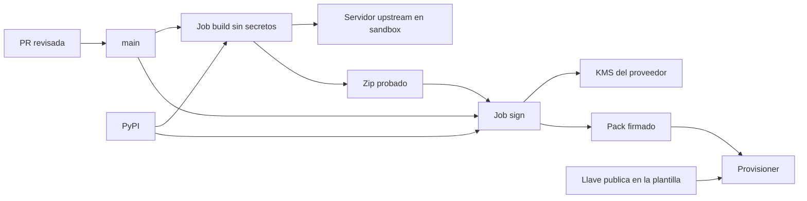

# Pipeline de MCP packs: modelo de amenazas (v0.1)

> Fecha: 2026-10-01 · TM-P13 (qué dispara la firma) del 2026-10-09 · Skill: `security-threat-model`. Plan: `docs/specs/marketplace-v1-plan.md` (B1). Decisiones: D19, D25, U9, U10.
> Amplía TM-M4 y TM-M5 de `marketplace-v1-threat-model.md`, que dejó fuera el compromiso del CI y de la llave de firma.
> Alcance: `packs/`, `packages/py/mango-packs/`, `deployment/pack-builder/`, `deployment/build-pack.sh` y `.github/workflows/packs.yml`. El provisioner que instala el pack (B2) tiene su propio modelo.

## Executive summary

El pipeline toma código de terceros (un servidor MCP de awslabs y unas 50 dependencias), lo empaqueta y lo firma. Lo firmado corre después con un rol IAM en la cuenta de cada cliente. Por eso los riesgos dominantes son de **integridad**:

1. **Que se firme algo distinto de lo revisado**: un lock sin hashes, un zip alterado entre la prueba y la firma, o un manifiesto con más IAM o más tools que el de la PR.
2. **Que el código de terceros alcance la llave de firma** o los secretos del CI al ejecutarse en el snapshot de `tools/list`.
3. **Que una versión upstream maliciosa o con tools nuevas entre sin que nadie lo vea.**

Controles construidos en B1: lock con hashes y corte de fecha, cuarentena de 7 días, solo wheels, zip reproducible, snapshot de tools con hash, lista cerrada de tools aplicada por el punto de entrada, firma con KMS en un job separado que no ejecuta código del pack y reconstruye lo que firma, y verificación offline con una llave pública fija.

## Scope and assumptions

- **Dentro:** el formato del pack, el CLI de construcción, el workflow de GitHub Actions y la verificación de firma que usará el provisioner.
- **Fuera:** crear el rol, el Runtime y el target (B2); la doble aprobación (B3); la publicación en el bucket de la release (R5, sin construir); el egress del Runtime (R6).
- **Supuestos:**
  1. El repositorio protege `main` con revisión obligatoria y CI en verde. Quien puede hacer merge sin revisión ya puede cambiar cualquier parte de Mango.
  2. La llave de firma vive en la cuenta del proveedor (U10) y solo la usa un rol que confía en el OIDC de GitHub, limitado a este repositorio y al environment `pack-signing`.
  3. La llave pública llega a la instalación en la plantilla de la release, no junto al pack.
  4. Los runners son los hospedados por GitHub: efímeros y sin estado entre jobs.

## System model

### Primary components
- **Pack** (`packs/aws-pricing/`): `manifest.yaml`, `requirements.in`, `requirements.lock`, `entrypoint.py`, `tools.snapshot.json`.
- **Formato** (`mango_packs`): `PackManifest` (Pydantic, `extra="forbid"`), `tools_hash`, `PackStatement`, `verify_envelope`.
- **Builder** (`mango_pack_builder`): `check`, `lock`, `check-lock`, `build`, `snapshot`, `statement`, `sign`, `verify`.
- **Workflow** (`packs.yml`): job `build` (arm64, sin secretos) y job `sign` (OIDC, environment protegido).
- **Externos:** PyPI, GitHub Actions y KMS en la cuenta del proveedor.

### Data flows and trust boundaries
- **PyPI → job `build` y job `sign`:** wheels por HTTPS. Cada archivo se comprueba contra el hash del lock (`--require-hashes`, `--no-deps`, `--only-binary :all:`); instalar no ejecuta código.
- **PR → `main`:** manifiesto, lock, punto de entrada y snapshot entran por revisión humana.
- **Job `build` → servidor upstream:** el builder arranca el zip dentro de un contenedor sin red, de solo lectura y con entorno vacío. `probe.py` le pide `tools/list` por HTTP en loopback e imprime el resultado. Esa salida es un dato no confiable: se limita a 4 MB y 100 tools, y solo se compara.
- **Job `build` → job `sign`:** un artefacto de Actions. El job `sign` solo usa de ahí el zip, y solo para compararlo byte a byte con el que reconstruye.
- **Job `sign` → KMS:** `kms:Sign` sobre un digest SHA-256, con credenciales OIDC de 15 minutos. La llave privada no sale de KMS.
- **Release → provisioner (B2):** zip, SBOM y sobre firmado. El provisioner verifica con la llave pública configurada, sin red.
- **Runtime → `entrypoint.py`:** el entorno lo fija el provisioner. El punto de entrada descarta `AWS_PROFILE` y `PRICING_ENDPOINT`.

#### Diagram

## Assets and security objectives

| Asset | Why it matters | Security objective (C/I/A) |
|---|---|---|
| Llave de firma (KMS) | Quien firma decide qué código y qué IAM aceptan todas las instalaciones | I |
| Manifiesto firmado | Fuente única del rol IAM, las tools y los parámetros del pack (TM-M1) | I |
| Zip del pack | Código que corre con un rol en la cuenta del cliente | I |
| `tools_hash` y snapshot | Lo que lee el modelo: base de la reaprobación (TM-M5) | I |
| Llave pública de verificación | Si se cambia, se acepta cualquier firma | I |
| Credenciales del CI (token de Actions, OIDC) | Permiten firmar o alterar el repositorio | C, I |
| Lock con hashes | Fija la cadena de suministro | I |

## Attacker model

### Capabilities
- Publicar una versión maliciosa de un paquete upstream o de una dependencia transitiva en PyPI.
- Controlar lo que el servidor upstream responde y hace mientras corre en el CI.
- Abrir una PR (colaborador o cuenta comprometida) que cambia manifiesto, lock, punto de entrada o workflow.
- Alterar un pack en tránsito o en reposo entre el CI y la instalación.

### Non-capabilities
- Hacer merge a `main` sin revisión (supuesto 1).
- Usar la llave de KMS fuera del rol de firma, o extraerla.
- Comprometer PyPI de forma que un archivo cambie sin cambiar su hash.
- Modificar la plantilla de la release en la cuenta del cliente (la protege R5).

## Entry points and attack surfaces

| Surface | How reached | Trust boundary | Notes | Evidence |
|---|---|---|---|---|
| `requirements.lock` | PR | Colaborador → `main` | Debe fijar todo por hash | `pack.py` `parse_lock` |
| `manifest.yaml` | PR | Colaborador → `main` | IAM, tools, parámetros | `manifest.py` `PackManifest` |
| `entrypoint.py` | PR | Colaborador → `main` | Corre en el Runtime con el rol del pack | `packs/aws-pricing/entrypoint.py` |
| Wheels de PyPI | `uv pip install` | Internet → CI | Hash obligatorio | `build.py` `install_dependencies` |
| Respuesta de `tools/list` | HTTP en loopback | Código de terceros → builder | JSON no confiable | `snapshot.py` `_rpc`, `tools.py` `normalize_tools` |
| Artefacto entre jobs | Actions | Job con código de terceros → job con llave | Solo se compara | `packs.yml` job `sign`, `build-pack.sh` |
| Sobre firmado | Release | CI → instalación | DSSE, verificación offline | `signing.py` `verify_envelope` |
| Zip al extraerlo | `snapshot --artifact` | Archivo → sistema de archivos | Rutas `..` | `snapshot.py` `extract` |

## Top abuse paths

1. Un mantenedor upstream comprometido publica `1.1.2` con una puerta trasera. Alguien sube la versión el mismo día y el pack firmado exfiltra con el rol del conector.
2. Una PR añade al lock una línea sin hash, una URL o un `--extra-index-url`. El build instala un paquete del atacante que pasa la revisión como "regenerar el lock".
3. El servidor upstream, al arrancar en el CI para el snapshot, lee variables de entorno o credenciales del runner y firma su propio pack, o las envía fuera.
4. El servidor upstream, ya en ejecución, reescribe el zip o la declaración en el workspace antes de que se suban. Lo firmado tiene más acciones IAM que el manifiesto revisado.
5. Una versión nueva cambia la descripción de una tool para inyectar instrucciones, o añade una tool que lee archivos. Entra porque nadie compara `tools/list`.
6. Alguien sustituye el zip en el bucket de la release por otro y deja el sobre firmado original. O firma un sobre con su propia llave y pone su ARN en `key_id`.
7. Una PR cambia `packs/signing-key.pub` por una llave del atacante junto con un pack firmado por ella.
8. Un manifiesto pide `iam:*`, `Resource: "*"` sin motivo, o un parámetro `api_key`, y la revisión no lo nota.
9. Un zip con rutas `../` escribe fuera del directorio temporal al extraerlo en el CI.

## Threat model table

| Threat ID | Threat source | Prerequisites | Threat action | Impact | Impacted assets | Existing controls (evidence) | Gaps | Recommended mitigations | Detection ideas | Likelihood | Impact severity | Priority |
|---|---|---|---|---|---|---|---|---|---|---|---|---|
| TM-P1 | Upstream comprometido | Versión nueva en PyPI | Publicar código malicioso que Mango adopta | Exfiltración con el rol del pack en cada cliente | Zip | Cuarentena de 7 días sobre el corte de resolución, que cubre transitivas (`manifest.py` `quarantine_error`, `lock.py`); `pip-audit --strict`; SBOM; rol mínimo del manifiesto | La cuarentena no detecta nada por sí sola; `quarantine_exception` la salta | Revisar el diff upstream al subir de versión (README). Egress en allowlist en el Runtime (R6, B2). Revisión obligatoria de toda `quarantine_exception` | Alertas de avisos de seguridad sobre los paquetes del SBOM | low | high | **medium** |
| TM-P2 | Colaborador o cuenta comprometida | PR aceptada sin leer el lock | Introducir una dependencia sin hash, por URL o de otro índice | Código del atacante en el zip | Lock, zip | `parse_lock` rechaza todo lo que no sea `nombre==versión` con hash; `check-lock` vuelve a resolver y exige igualdad; `--require-hashes --no-deps --only-binary :all:` e índice fijo; `.github/CODEOWNERS` | Un lock coherente pero con una versión upstream maliciosa es TM-P1. CODEOWNERS solo obliga con la protección de `main` activa | Activar en `main` la revisión obligatoria de los dueños | Fallo de `check-lock` en CI | low | high | **medium** |
| TM-P3 | Código de terceros en el CI | Snapshot de `tools/list` | Leer secretos o credenciales del runner, o enviarlos fuera | Robo de la capacidad de firmar | Llave, credenciales | El servidor corre en un contenedor **sin red** (`--network none`), de solo lectura, sin capabilities y como `nobody`, con la imagen fijada por digest (`snapshot.py` `list_tools_in_container`, test `test_container_has_no_network_and_a_pinned_image`); su salida se trata como dato no confiable; entorno vacío (`probe.py` `running_server`); el job `build` no tiene secretos ni `id-token`; `permissions: contents: read`; `persist-credentials: false`; la firma va en otro job | En una máquina de desarrollo el snapshot corre por defecto en un venv local, con red | Usar `MANGO_PACK_SNAPSHOT=container` también en local al subir de versión | Fallo del snapshot en CI | low | high | **low** |
| TM-P4 | Código de terceros en el CI | Snapshot en el job `build` | Alterar el zip o la declaración antes de la firma | Se firma IAM o código distinto del revisado | Manifiesto, zip | El job `sign` no confía en la salida de `build`: reconstruye zip y declaración desde el commit y compara el zip byte a byte (`build-pack.sh` con `<tested-zip>`); build reproducible (test `test_zip_is_byte_identical_across_builds`) | — | Mantener el job `sign` sin ejecutar código del pack | Fallo de `cmp` en el job `sign` | low | high | **low** |
| TM-P5 | Upstream | Versión nueva o respuesta distinta | Cambiar descripciones o esquemas, o añadir tools | Inyección indirecta; tools con más alcance | `tools_hash` | Hash sobre nombre, título, descripción, esquemas y anotaciones (`tools.py`); el CI falla si cambia o si hay tools de más o de menos; el punto de entrada quita toda tool fuera del manifiesto y no arranca si falta una; snapshot legible en el repositorio para revisar el diff | `instructions` del servidor, prompts y resources no entran en el hash (el Gateway solo expone tools) | B2: comparar `tools/list` del Runtime con `tools_hash` al habilitar y en la reconciliación | Diferencias de hash en la reconciliación | medium | medium | **medium** |
| TM-P6 | Atacante con acceso a la release o al tránsito | Escritura en el bucket o MITM | Sustituir el zip, el SBOM o el sobre | Código no revisado en el cliente | Zip, manifiesto | Firma ECDSA P-256 sobre la declaración (DSSE); la declaración lleva el sha256 y el tamaño de zip y SBOM (`verify_file`); la firma se comprueba antes de interpretar el contenido; `key_id` del sobre no se usa para elegir llave; solo se aceptan llaves P-256; forma canónica obligatoria; límite de tamaño | No hay protección contra **rollback** a un pack antiguo firmado y válido | B2: el provisioner instala solo la versión que nombra el catálogo de la release y rechaza versiones menores a la habilitada | Auditoría de la versión instalada | low | high | **medium** |
| TM-P7 | Colaborador o cuenta comprometida | PR aceptada | Cambiar la llave pública de confianza | Se aceptan firmas del atacante | Llave pública | La instalación toma la llave de la plantilla de la release, no del pack; el job `sign` verifica con la llave del repositorio antes de publicar | La llave aún no existe (U10) | CODEOWNERS sobre `packs/signing-key.pub`; rotación documentada; firma de la release (R5) | Diff de la llave en la PR | low | high | **medium** |
| TM-P8 | Colaborador | PR con un manifiesto amplio | Pedir IAM de más, comodines o secretos en parámetros | Rol del pack con más poder | Manifiesto | Acciones exactas sin comodines; `*` en recursos exige motivo; parámetros solo de un enum y sin nombres de secreto; `service` solo con datos públicos; tools `write` solo en nivel `write`; `extra="forbid"` (tests en `test_manifest.py`) | El validador no sabe si una acción es excesiva | Permissions boundary de packs (B2); el aprobador ve las acciones (B3) | — | medium | medium | **medium** |
| TM-P9 | Uso indebido de la llave | Rol de firma asumible | Firmar un pack fuera del pipeline | Pack arbitrario aceptado | Llave | OIDC sin llaves de larga duración; sesión de 15 minutos; environment protegido; solo `push` a `main` | Sin revisores obligatorios en el environment (el plan de GitHub no los ofrece): firma todo `push` a `main` | Hecho el 2026-10-01: trust del rol limitado al `sub` inmutable del repositorio con `:environment:pack-signing`; política de la llave con `kms:Sign` y `kms:GetPublicKey` solo para ese rol y `kms:Sign` denegado al resto; regla de EventBridge ante `kms:Sign` de otro principal o cambios de política y grants. Pendiente: revisor obligatorio y protección de `main` | CloudTrail de `kms:Sign` | low | high | **medium** |
| TM-P10 | Archivo malicioso | Zip alterado | Rutas `../` al extraer | Escritura fuera del directorio temporal en el CI | Runner | `extract` valida cada ruta antes de extraer (test `test_extract_rejects_paths_outside_the_target`) | — | — | — | low | low | **low** |
| TM-P11 | Entorno del Runtime | Variable de entorno inesperada | `AWS_PROFILE` o `PRICING_ENDPOINT` desvían las llamadas firmadas | Peticiones firmadas hacia otro destino | Credenciales del rol | El punto de entrada borra ambas antes de importar el servidor | Otras variables de boto3 (`AWS_ENDPOINT_URL`) | B2: el provisioner fija el entorno desde una lista cerrada | — | low | medium | **low** |
| TM-P12 | Cualquiera con cuenta de GitHub | El repositorio es público (D59): los logs y los artefactos de Actions se pueden leer | Lee el id de la cuenta del proveedor en el ARN del rol de firma o en el de la llave | Reconocimiento: sabe qué cuenta y qué rol atacar. No da acceso por sí solo (el trust exige el `sub` del repositorio y el entorno) | Identificadores de la cuenta del proveedor | Desde el 2026-10-05: el ARN del rol es un secreto del entorno `pack-signing` (Actions lo enmascara; las variables del repositorio se imprimen); el id de cuenta se enmascara aparte (`::add-mask::` y `mask-aws-account-id`); la llave se nombra por su alias, así el sobre que se sube como artefacto no lleva la cuenta; un test impide volver a leer de `vars` un nombre terminado en `_ARN`, `_BUCKET` o `_ACCOUNT_ID` (`test_workflows.py`) | Actions solo enmascara el valor exacto: una forma transformada (base64, otra codificación) no se tapa. Los logs y los artefactos anteriores al cambio hay que borrarlos a mano | No imprimir ni codificar esos valores en pasos nuevos; revisar los logs tras cambiar el workflow | Buscar el id de la cuenta en los logs y artefactos de la primera ejecución tras cada cambio del workflow | low | low | **low** |
| TM-P13 | Cambio en el repositorio | Un cambio que altera el zip o la declaración de un pack y que el filtro de rutas del workflow no ve | El pack de `main` queda sin construir, comparar ni firmar; la release sigue llevando el pack firmado antes | Una instalación recibe un pack anterior al de `main` (firmado y válido para su commit, pero sin un arreglo que `main` ya tiene) | Zip, declaración | Desde el 2026-10-09 (D36): la lista de rutas de `push` cubre `packs/`, el script, el builder, los tres paquetes que el builder usa y el workflow, y un test la fija y la compara con las fuentes del builder (`test_workflows.py`); `mise.toml` y `uv.lock` salieron de la lista, y lo que de ellos llega a un pack (Python, uv, `pydantic`, `pydantic-core`, `pyyaml`) está en `deployment/pack-builder/toolchain.toml`, que un test mantiene igual a ambos (`test_toolchain.py`); cada ejecución construye y firma los tres packs, sin estado entre ejecuciones; un pull request sigue construyendo con las dos rutas | El testigo nombra cinco versiones: otra dependencia del builder (`cryptography`, `boto3`) no escribe el zip ni la declaración, pero una futura que sí lo haga habría que añadirla a mano. GitHub evalúa el filtro sobre los primeros 300 archivos de un diff. Sin ver en el runner | Al añadir una dependencia al builder, decidir si escribe bytes de un pack y anotarla en el testigo | Tras un cambio de versión de Python, de uv o de una dependencia del builder, comprobar que hubo una ejecución de `packs` en `main` para ese commit | low | medium | **low** |

## Criticality calibration
- **High:** no queda ninguna amenaza en alto con los controles actuales. Lo sería firmar código o IAM no revisados (TM-P3 y TM-P4 sin la separación de jobs).
- **Medium:** cadena de suministro (TM-P1, TM-P2), cambios de tools (TM-P5), sustitución y rollback (TM-P6), llave pública y uso de la llave (TM-P7, TM-P9), manifiestos amplios (TM-P8).
- **Low:** código de terceros en el CI (TM-P3, TM-P4), extracción de zips, variables de entorno del Runtime, identificadores de la cuenta del proveedor en logs y artefactos públicos (TM-P12) y un cambio de un pack que el filtro de rutas no vea (TM-P13).

## Focus paths for security review

| Path | Why it matters | Related Threat IDs |
|---|---|---|
| `packages/py/mango-packs/src/mango_packs/signing.py` | Verificación de firma que decide qué código acepta una instalación | TM-P6, TM-P7 |
| `packages/py/mango-packs/src/mango_packs/manifest.py` | Reglas de IAM, tools y parámetros | TM-P8 |
| `.github/workflows/packs.yml` | Separación entre el job con código de terceros y el job con la llave; qué rutas arrancan la firma | TM-P3, TM-P4, TM-P9, TM-P13 |
| `deployment/pack-builder/toolchain.toml` | Lo que de `mise.toml` y `uv.lock` llega a un pack; cambiarlo arranca la firma | TM-P13 |
| `deployment/build-pack.sh` | Orden de los pasos y comparación con el zip probado | TM-P4 |
| `deployment/pack-builder/src/mango_pack_builder/snapshot.py` y `probe.py` | Ejecutan código de terceros (contenedor sin red) | TM-P3, TM-P10 |
| `deployment/pack-builder/src/mango_pack_builder/pack.py` | Lectura estricta del lock | TM-P2 |
| `packs/*/entrypoint.py` | Lista cerrada de tools y entorno en el Runtime | TM-P5, TM-P11 |

## Supuestos validados con el usuario (2026-10-01)
- **Snapshot sin red:** el servidor upstream corre en un contenedor `--network none` en el workflow (TM-P3 baja a prioridad baja).
- **CODEOWNERS:** `.github/CODEOWNERS` cubre `packs/`, `packages/py/mango-packs/`, `deployment/` y `.github/workflows/`. La protección de `main` (revisión obligatoria de los dueños) la configura el usuario en GitHub; hasta entonces el archivo no obliga a nada.
- **Tools de Pricing:** `generate_cost_report` sigue excluida y `get_price_list_urls` se mantiene.

## Preguntas abiertas
1. ~~La llave de firma y su rol (U10) se crean después.~~ **Resuelta el 2026-10-01:** existen la llave, el rol, el trust por environment, la política de la llave y la alerta (TM-P9; detalle en `packs/README.md`, «Infraestructura de firma»). Queda abierto hasta que se activen en GitHub: el revisor obligatorio del environment y la protección de `main`. Con el repositorio público (D59) ya están disponibles; mientras no estén activos, la firma no tiene aprobación manual y CODEOWNERS no obliga (TM-P7, TM-P9).
