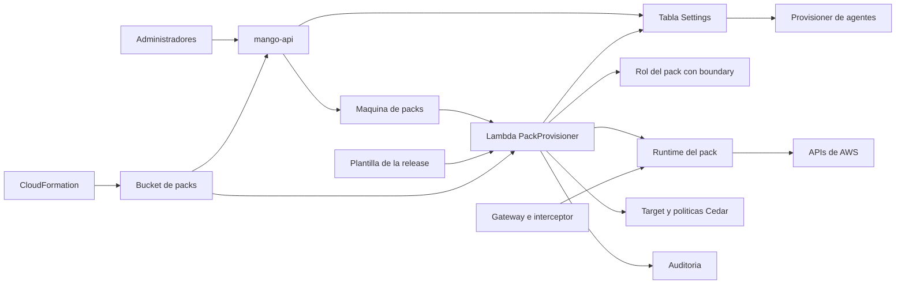

# Provisioner y habilitación de MCP packs: modelo de amenazas (v0.2)

> Fecha: 2026-10-01 · Skill: `security-threat-model`. Plan: `docs/specs/marketplace-v1-plan.md` (B2 y B3). Decisiones: D19, D25, D26, D32, D33, D36, D40, D43, D46.
> Cambios frente a v0.1 (B3): entra la API de habilitación de `mango-api` (doble aprobación) y `mango-api` como segundo lector del bucket de packs. Amenazas nuevas TM-B14 a TM-B20; TM-B10 y TM-B12 se actualizan. Los ids de v0.1 no cambian.
> Actualizado el 2026-10-01 (D47): el Runtime de cada pack se detiene a los 60 s sin uso y el Gateway mantiene sesiones MCP. Amenaza nueva TM-B21.
> Actualizado el 2026-10-01 (PR C2, D37): el provisioner ya instala packs de datos de cuentas en modo `central_only`. Esos packs reciben una aserción de identidad firmada (nunca el token: TM-B9 no cambia) y su rol solo puede asumir el broker. Ver `pack-identity-threat-model.md`; el supuesto 4 de este documento solo vale ya para la red (R6).
> Amplía TM-M1, TM-M5, TM-M14 y TM-M15 de `marketplace-v1-threat-model.md` y recoge lo que `mcp-pack-pipeline-threat-model.md` dejó para B2 (TM-P5, TM-P6, TM-P8 y TM-P11).
> Alcance: `apps/api/src/mango_api/mcp.py`, `mcp_store.py`, `mcp_catalog.py`, `pack_release.py` y `published.py` (B3), `functions/provisioner/src/mango_provisioner/harness.py` (tools de packs en agentes), `functions/provisioner/src/mango_provisioner/packs/`, `packages/py/mango-packs/src/mango_packs/enablement.py`, `infra/lib/config/pack-release.ts`, `infra/lib/constructs/pack-platform.ts`, `infra/lib/constructs/pack-provisioner.ts`, el permiso del Gateway sobre los Runtimes de packs (`tools.ts`) y el cambio del interceptor (`functions/gateway-interceptor/`).
> Los permisos de IAM y el comportamiento de AgentCore descritos aquí se comprobaron en el laboratorio el 2026-10-01 con las políticas que sintetiza CDK (recursos temporales, ya borrados).
> Actualizado el 2026-10-07 (D43 (4)): el rol del provisioner de packs gana `iam:CreateServiceLinkedRole` sobre el rol vinculado de identidad de AgentCore, y solo sobre él (ver «Provisioner → IAM»). No añade amenazas. Comprobado con tests de la plantilla, sin ver en una instalación.
> Actualizado el 2026-10-08 (D43 (6)): una respuesta de `tools/list` con el error JSON-RPC `-32010` de AgentCore (el servidor del pack aún no está listo) se vuelve a pedir en vez de fallar a la primera. No añade amenazas ni permisos; TM-B7 dice por qué no relaja la comparación. Comprobado con tests, sin ver en una instalación.
> Actualizado el 2026-10-02 (R6): los Runtimes de packs ya no usan la red `PUBLIC`. Corren en una VPC sin salida a internet y solo alcanzan los endpoints de VPC que declara su manifiesto firmado; el bloqueo de D49 (7) se retiró. Cierra TM-B13 y la pregunta abierta 1. Ver `pack-egress-threat-model.md`. Lo que este documento dice sobre la red `PUBLIC` describe el estado anterior.

## Executive summary

El provisioner de packs instala **código de terceros** (un servidor MCP de awslabs) en la cuenta del cliente y le crea un rol IAM, un Runtime, un target del Gateway y políticas Cedar. Los riesgos dominantes son de **integridad**:

1. **Instalar algo distinto de lo que firmó el proveedor y nombra la release**: un zip cambiado en el bucket, un pack antiguo con firma válida (rollback) o una llave pública sustituida.
2. **Que el rol del provisioner sirva para escalar**: crea roles IAM, escribe políticas Cedar del Gateway y puede crear y borrar targets.
3. **Que el pack se salga de lo aprobado**: tools distintas de las revisadas, variables de entorno que desvían sus llamadas firmadas, o recibir el token del usuario.
4. **Saltarse el Gateway**: llamar al Runtime del pack directamente, sin interceptor ni Cedar L2.

5. **Saltarse la doble aprobación o aprobar algo distinto de lo pedido** (B3): un solo administrador que instala un pack, una solicitud con parámetros fuera del manifiesto, o una release que cambia entre la solicitud y la aprobación.

Controles construidos en B2: verificación de firma offline y fail-closed, catálogo de la release que fija **una declaración exacta por pack** (anti-rollback), hash del zip sobre una versión concreta del objeto de S3, rol del pack solo desde el manifiesto firmado con permissions boundary propio y lista cerrada de acciones, entorno del Runtime de una lista cerrada, comparación de `tools/list` con `tools_hash` antes de exponer el pack, políticas Cedar generadas (nunca texto libre), un rol separado para el provisioner de packs y el interceptor que no entrega el token del usuario a los packs.

Controles construidos en B3: acciones Cedar `EnableMcp` y `ApproveMcp` solo para administradores; quien pide no aprueba (en el caso de uso y como condición de DynamoDB); una solicitud pendiente por pack; la solicitud guarda el sha256 de la declaración y la aprobación se rechaza si la release ya nombra otra; cuerpos estrictos que solo llevan parámetros del manifiesto; bloqueo optimista más estado esperado y «sin ejecución en curso» como condiciones; auditoría fail-closed; límite de escrituras y de packs habilitados; y `mango-api` lee del bucket solo las declaraciones firmadas exactas de la release, verificadas como las verifica el provisioner.

## Scope and assumptions

- **Dentro (B3):** las rutas `/api/mcp/*` de `mango-api`, sus ítems en `Settings` (`MCP#`, `MCP_CHANGE#`), la lectura de las declaraciones firmadas del bucket y el uso de tools de packs por los agentes (reglas de envío, chat y provisioner de agentes).
- **Dentro (B2):** la segunda máquina de estados del provisioner (habilitar, actualizar y deshabilitar un pack), su rol, el bucket de packs, el boundary de los roles de pack, el permiso `InvokeAgentRuntime` del rol del Gateway y la inyección de `_mango_ctx` en el interceptor.
- **Fuera:** el pipeline que construye y firma (B1, su propio modelo); la pantalla del catálogo (B4); packs de datos de cuentas y la identidad por llamada (C2); la firma de la release (R5) y la red privada con allowlist de egress (R6).
- **Supuestos:**
  1. Solo `mango-api` inicia la máquina y solo después de la doble aprobación (`mcp.py` `approve`). Reintentar una instalación fallida y deshabilitar los hace un solo administrador (spec §4.4): no cambian lo aprobado. Un `mango-api` comprometido puede pedir que se instale un pack, pero solo uno de la release y con parámetros del manifiesto.
  2. La plantilla de CloudFormation de la release es íntegra (R5): de ella salen la llave pública, el catálogo de packs y la lista de acciones del boundary.
  3. El bucket de packs solo lo escribe el despliegue del stack: ningún otro rol del stack tiene escritura (test de infra). No hay una política de bucket que se lo niegue a otros principales de la cuenta: frente a ellos el control es criptográfico (firma, hash y `versionId`).
  4. Mientras no exista la allowlist de egress (R6), solo se instalan packs `public`. El provisioner rechaza los demás.
  5. La llave de firma existe desde el 2026-10-01 (`packs/signing-key.pub`, U10), en la cuenta de management del laboratorio. Sin packs firmados en la release, el catálogo queda vacío y no se instala nada.
  6. Los administradores de Mango son de confianza de uno en uno solo hasta donde dice el spec: reintentar y deshabilitar. Dos administradores coludidos quedan fuera (auditoría posterior).
  7. El limitador de escrituras de `mango-api` se cuenta una sola vez entre todas sus tareas, en la tabla `RateLimits` (D70, 2026-10-06). Antes era por tarea y con varias el límite se multiplicaba. Si la tabla no responde, la escritura se rechaza.
- **Preguntas abiertas** (cambiarían la prioridad):
  1. ¿Se acepta que el Runtime de un pack `public` use el modo de red `PUBLIC` (sale a internet) hasta que exista R6? Es la pregunta 2 de `marketplace-v1-threat-model.md`, sin validar. B2 lo asume.
  2. ¿Se acepta que el provisioner de packs pueda invocar los Runtimes de packs (`InvokeAgentRuntime`) para comparar `tools/list`? TM-M14 pedía que solo el rol del Gateway pudiera.
  3. ¿Hace falta una política basada en recurso en cada Runtime que niegue la invocación a todo principal que no sea el Gateway o el provisioner (TM-B8)?

## System model

### Primary components
- **Lambda `Mango-<ns>-PackProvisioner`** (`mango_provisioner.packs.handler`) y su máquina de estados `Mango-<ns>-PackProvisioner`. Rol propio, distinto del provisioner de agentes.
- **Bucket de packs**: `packs/<id>/<versión>/` con el zip, el SBOM y el sobre firmado. Lo llena CloudFormation al instalar o actualizar el stack (D36).
- **Catálogo de la release** (`PACK_CATALOG`) y **llave pública** (`PACK_SIGNING_PUBLIC_KEY`): variables de entorno de la Lambda que salen de la plantilla.
- **Tabla `Settings`**: `MCP#<pack>` / `ENABLEMENT` (lo escribe `mango-api`; el provisioner solo el estado y su bloqueo), `MCP_INSTALLED#<pack>` / `CURRENT` (solo el provisioner) y `MCP_CHANGE#<pack>` (solicitudes y el marcador de la pendiente; solo `mango-api`, el provisioner no puede leerla).
- **`mango-api`** (B3): router `/api/mcp/*`, catálogo de packs (`CatalogSource`) y cliente que inicia la máquina. Recibe la misma llave pública y el mismo catálogo que la Lambda.
- **Provisioner de agentes**: lee `MCP_INSTALLED#<pack>` para saber qué tools sirve un pack instalado.
- **Por pack:** rol `Mango-<ns>-mcp-<id>` con boundary `Mango-<ns>-mcp-boundary`, Runtime `Mango_<ns>_mcp_<id>` con endpoint `live`, sus log groups, target `<id>` del Gateway y políticas Cedar `Mango_<ns>_mcp_<id>_<n>`.
- **Interceptor del Gateway** y **rol del Gateway**.

### Data flows and trust boundaries
- **Administrador → `mango-api`:** JWT de Cognito, Cedar L1 (`ViewMcpCatalog`, `EnableMcp`, `ApproveMcp`) y cuerpos Pydantic estrictos. El cuerpo lleva `version` (bloqueo optimista), `config` y un motivo; nunca versión del pack, IAM ni ARNs.
- **Bucket → `mango-api`:** solo `s3:GetObject` sobre las declaraciones firmadas exactas de la release (sin comodín, sin zips, sin listar). Datos no confiables hasta verificar firma y digest; lo que no verifica queda fuera del catálogo.
- **`mango-api` → `Settings`:** aprobar es una transacción (cerrar la solicitud, borrar el marcador y escribir la habilitación) con condiciones: solicitud pendiente, sin vencer y de otra persona; habilitación en la versión y el estado esperados y sin bloqueo del provisioner.
- **`Settings` → agentes:** las reglas de envío, el chat y el provisioner de agentes aceptan `<pack>.<tool>` solo si el puntero `MCP_INSTALLED#` la lista.
- **mango-api → máquina de estados:** `{pack_id, pack_version, enablement_id}`. Nada más: una clave extra se rechaza.
- **Provisioner → `Settings`:** lee la habilitación y escribe solo estado, fallo y bloqueo (IAM por atributo). El puntero `MCP_INSTALLED#` solo lo escribe él; `mango-api` lo tiene denegado. Es un segundo escritor de `Settings` (hasta ahora solo `mango-api`, TM-A6 de Admin v0; aceptado por el usuario el 2026-10-01, D43), limitado por IAM a las particiones `MCP#` y `MCP_INSTALLED#`: no alcanza el mapeo de áreas, los grupos, los modelos ni los presupuestos.
- **Bucket → provisioner:** sobre y zip, datos no confiables hasta verificar. La firma se comprueba con la llave de la plantilla antes de interpretar el contenido; el zip se lee por `versionId` y se compara con el hash firmado.
- **Provisioner → IAM:** crea el rol solo bajo `Mango-<ns>-mcp-*` y con el boundary. Las acciones salen del manifiesto firmado y deben estar en la lista cerrada del boundary. Fuera de ese prefijo solo puede **crear** dos roles vinculados a servicios de AgentCore, cada uno por su ARN exacto y con `iam:AWSServiceName`: el de red (R6, `pack-egress-threat-model.md`) y, desde el 2026-10-07 (D43 (4)), el de identidad de Runtimes (`AWSServiceRoleForBedrockAgentCoreRuntimeIdentity`), que AgentCore crea con el primer Runtime de la cuenta. Ninguno sirve para escalar: su nombre, su confianza y su política los fija AWS, solo los asume AgentCore, y el provisioner no puede asumirlos, pasarlos, cambiarlos ni borrarlos.
- **Provisioner → AgentCore:** Runtime (código desde S3 con `versionId`), endpoint `live`, target `mcpServer` con SigV4 y políticas Cedar.
- **Provisioner → Runtime del pack:** `tools/list` por SigV4. La respuesta es un dato no confiable: tamaño acotado y solo se compara. Una respuesta que no es la lista se descarta entera; si es el error `-32010` de AgentCore se vuelve a pedir (D43 (6)), y de ella solo llegan al log su forma y, como mucho, un estado HTTP de tres dígitos.
- **Gateway → Runtime del pack:** MCP con SigV4 del rol del Gateway, endpoint `live`.
- **Interceptor → pack:** la petición pasa **sin** `_mango_ctx`. El token del usuario solo se inyecta en los targets de conectores de Mango.
- **Pack → APIs de AWS:** con su rol; red en modo `PUBLIC`.

#### Diagram

## Assets and security objectives

| Asset | Why it matters | Security objective (C/I/A) |
|---|---|---|
| Rol del provisioner de packs | Crea roles IAM, políticas Cedar y targets del Gateway | I |
| Llave pública y catálogo de la release | Deciden qué código acepta la instalación | I |
| Zip del pack en el bucket | Código que corre con un rol en la cuenta del cliente | I |
| Rol del pack y su boundary | Lo máximo que puede hacer un pack | I |
| Políticas Cedar L2 del Gateway | Deciden qué tool usa quién, también las de los conectores | I |
| Target `finops` y los de otros packs | Disponibilidad e integridad de las tools ya aprobadas | I, A |
| Token de acceso del usuario | Con él se actúa como la persona ante los conectores | C |
| Puntero `MCP_INSTALLED#` y estado de la habilitación | Lo que la app dice que está instalado | I |
| Auditoría de habilitaciones | No repudio | I |
| Decisión de habilitar (solicitud y aprobación) | Es el control humano sobre qué código de terceros entra | I |
| Lo que ve quien aprueba (IAM, tools, nivel de datos del manifiesto) | Si no es lo que se instala, la aprobación no vale | I |
| Quién pidió, motivos y códigos de fallo | Información de administración | C |

## Attacker model

### Capabilities
- Un administrador de Mango, o quien tenga su sesión: puede pedir, reintentar y deshabilitar; para instalar necesita a otro administrador.
- Un creador de agentes: lee el catálogo y arma agentes con tools de packs.
- `mango-api` comprometido o con un defecto: escribe cualquier ítem `MCP#…` de `Settings` e inicia la máquina con la entrada que quiera.
- Principal de la cuenta con `s3:PutObject` en el bucket de packs.
- Principal de la cuenta con permisos amplios de AgentCore (`InvokeAgentRuntime`), sin ser el Gateway.
- Servidor upstream malicioso o con un fallo: controla lo que responde `tools/list` y lo que hace con su rol y con lo que reciba en cada llamada.
- Quien conserve un pack antiguo, firmado y válido, de una release anterior.

### Non-capabilities
- Modificar la plantilla de la release o el entorno de la Lambda (R5, IaC).
- Usar la llave privada de firma (KMS del proveedor).
- Asumir el rol del provisioner fuera de la Lambda.
- Dos admins coludidos (auditoría posterior).

## Entry points and attack surfaces

| Surface | How reached | Trust boundary | Notes | Evidence |
|---|---|---|---|---|
| `GET /api/mcp/catalog` | HTTPS, JWT | Usuario → mango-api | `ViewMcpCatalog`; campos de administración solo para admins | `mcp.py` `catalog_view`, `_pack_out` |
| `POST /api/mcp/{pack}/enablements`, `params`, `update` | HTTPS, JWT | Admin → mango-api | `EnableMcp`; solo parámetros del manifiesto | `mcp.py` `request_change`, `resolve_config` |
| `POST …/enablements/{id}/approve`, `reject`, `withdraw` | HTTPS, JWT | Admin → mango-api | `ApproveMcp` (≠ quien pidió); `withdraw` solo quien pidió | `mcp.py` `approve`, `mcp_store.py` `approve_change` |
| `POST …/retry`, `DELETE /api/mcp/{pack}` | HTTPS, JWT | Admin → mango-api | `EnableMcp`; un admin | `mcp.py` `retry`, `disable` |
| Declaración firmada (lectura de `mango-api`) | S3, objeto exacto | Bucket → mango-api | Firma y digest antes de mostrarla | `pack_release.py` `ReleasePacks` |
| Puntero `MCP_INSTALLED#` (lectura) | DynamoDB | Provisioner de packs → mango-api y provisioner de agentes | Decide qué tools de packs existen para los agentes | `mcp_catalog.py` `PackState`, `mango_provisioner/store.py` `installed_pack_tools` |
| Entrada de la máquina | `states:StartExecution` | mango-api → provisioner | Solo ids | `packs/steps.py` `parse_input` |
| Ítem `MCP#<pack>` / `ENABLEMENT` | DynamoDB | mango-api → provisioner | Estado, versión y parámetros | `packs/store.py` |
| Sobre firmado | S3 | Bucket → provisioner | DSSE, llave de la plantilla | `packs/release.py` `PackRelease.verified` |
| Zip | S3 por `versionId` | Bucket → Runtime | Hash firmado | `packs/release.py` `verified_artifact` |
| Manifiesto firmado | Dentro del sobre | Proveedor → IAM | Acciones y recursos | `packs/role.py` `role_policy` |
| Respuesta de `tools/list` | `InvokeAgentRuntime` | Código de terceros → provisioner | JSON no confiable | `packs/runtime.py` `PackRuntimes.tools` |
| Variables de entorno del Runtime | `CreateAgentRuntime` | Provisioner → pack | Lista cerrada | `packs/runtime.py` `runtime_environment` |
| Políticas Cedar | `CreatePolicy` | Provisioner → Gateway | Generadas desde el manifiesto | `packs/gateway.py` `policy_statements` |
| Runtime del pack | SigV4 | Cuenta → pack | Sin autorizador JWT: IAM | `packs/runtime.py` |
| `tools/call` a un pack | Gateway | Interceptor → pack | Sin token del usuario | `gateway-interceptor/handler.py` |

## Top abuse paths

1. Alguien con escritura en el bucket sustituye el zip entre la verificación y la creación del Runtime. El pack corre código no revisado con su rol.
2. Un atacante coloca en el bucket el sobre y el zip de una versión antigua, firmados y válidos, con una vulnerabilidad conocida o con más IAM. El provisioner la instala porque la firma es correcta.
3. `mango-api` comprometido pide instalar un pack con parámetros que acaban como variables de entorno arbitrarias (`AWS_ENDPOINT_URL`, `HTTPS_PROXY`) y desvían las peticiones firmadas del pack.
4. Un manifiesto firmado por error pide `iam:PassRole` o `s3:GetObject` sobre `*`. El rol del pack sirve para leer datos de la cuenta.
5. El provisioner, con sus permisos sobre el motor de políticas, escribe un `permit` sin condiciones para todas las tools, o borra el target `finops`.
6. El servidor upstream sirve en la instalación tools distintas de las del snapshot (descripciones que inyectan instrucciones). El modelo las lee.
7. Un principal de la cuenta llama al Runtime del pack con SigV4 y se salta el interceptor, la firma de invocación y Cedar L2.
8. El interceptor inyecta `_mango_ctx` con el token del usuario en la llamada a un pack. El servidor de terceros lo recibe y puede usarlo contra los conectores.
9. Dos ejecuciones simultáneas sobre el mismo pack (habilitar y deshabilitar) dejan recursos huérfanos o un rol sin Runtime.
10. Una instalación falla a medias y deja un rol, un Runtime o una política activa que nadie ve.
11. Un administrador (o quien robe su sesión) pide un pack y lo aprueba él mismo, o aprovecha una carrera entre dos peticiones para que su solicitud se aplique sin otra persona.
12. Un administrador pide un pack; antes de que otro lo apruebe, una actualización del stack cambia la declaración de ese pack (más IAM, otras tools). Quien aprueba cree aprobar lo que vio el primero.
13. Alguien con escritura en el bucket cambia la declaración que lee `mango-api` para que quien aprueba vea menos permisos de los que se instalarán, o la borra para que el pack desaparezca del catálogo y sus agentes dejen de servir.
14. Un creador arma un agente con una tool de un pack que no está instalado, o `mango-api` comprometido marca un pack como instalado para que un agente reciba tools que nadie aprobó.

## Threat model table

| Threat ID | Threat source | Prerequisites | Threat action | Impact | Impacted assets | Existing controls (evidence) | Gaps | Recommended mitigations | Detection ideas | Likelihood | Impact severity | Priority |
|---|---|---|---|---|---|---|---|---|---|---|---|---|
| TM-B1 | Principal con escritura en S3 | `s3:PutObject` en el bucket de packs | Sustituir el zip o el sobre (TOCTOU incluido) | Código arbitrario con el rol del pack | Zip | Firma DSSE verificada con la llave de la plantilla antes de interpretar nada (`mango_packs.signing.verify_envelope`); el zip se lee por `versionId`, se compara con el sha256 y el tamaño firmados, y el Runtime se crea con ese mismo `versionId` (`release.py` `verified_artifact`, `runtime.py`); bucket versionado, sin acceso público y con TLS obligatorio (`pack-platform.ts`) | No hay política de bucket que niegue escrituras ajenas al despliegue. En el laboratorio, con una versión posterior distinta en la misma clave, el Runtime siguió sirviendo el zip verificado; no se probó qué pasa si se borra esa versión | Política de bucket con `Deny` de escritura salvo el rol del despliegue; la reconciliación (A11) compara el `versionId` y el hash en uso | CloudTrail de datos de S3 sobre el bucket | low | high | **medium** |
| TM-B2 | Quien conserve un pack antiguo firmado | Escritura en el bucket | Rollback a una versión antigua con firma válida | Código vulnerable o con más IAM | Zip, rol | El catálogo de la release fija por pack la versión **y el sha256 de la declaración firmada**; el provisioner exige que la entrada, la habilitación, el manifiesto firmado y el catálogo coincidan (`release.py` `PackRelease.verified`, test `test_old_signed_pack_is_refused`); un pack fuera del catálogo no se instala | El catálogo protege tanto como la plantilla (R5) | Firma de la release (R5) | Auditoría con `statement_sha256` de cada instalación | low | high | **low** |
| TM-B3 | Colaborador o cuenta comprometida del proveedor | Cambiar la llave pública de la plantilla | Aceptar firmas del atacante | Pack arbitrario | Llave pública | La llave llega solo por la plantilla; solo P-256; sin llave configurada no se instala nada (`config.py`, `release.py`: `signing_key_missing`); `key_id` del sobre no elige llave | La llave aún no existe (U10) | CODEOWNERS sobre `packs/signing-key.pub`; R5 | Diff de la llave en la PR | low | high | **medium** |
| TM-B4 | Manifiesto firmado con IAM de más | Error o abuso en el proveedor | Rol del pack con acciones amplias | Lectura o cambios en la cuenta | Rol del pack | Boundary `Mango-<ns>-mcp-boundary` con una **lista cerrada de acciones** (`pack-platform.ts` `PACK_DATA_ACTIONS`); el provisioner rechaza un manifiesto con una acción fuera de la lista (`action_outside_boundary`) en vez de crear un rol con permisos sin efecto; el rol del provisioner solo crea roles `Mango-<ns>-mcp-*` con ese boundary y solo los pasa a AgentCore (test de infra); un rol existente sin boundary o con otro trust no se repara: falla (`role.py` `_verify`) | Cada pack nuevo amplía la lista en una release | Revisar la lista en cada PR que la toque (CODEOWNERS de `infra/`) | CloudTrail: `CreateRole` sin boundary | low | high | **medium** |
| TM-B5 | mango-api comprometido | Escribir la habilitación | Parámetros que se vuelven variables de entorno o configuración arbitraria | Peticiones firmadas hacia otro destino; lectura de otra región | Rol del pack | El entorno del Runtime sale de una lista cerrada: las tres variables de D16, las de identificación del pack y `MANGO_PACK_CONFIG_<CLAVE>` solo para claves del manifiesto con un valor de su enum (`runtime.py` `runtime_environment`, test `test_environment_is_a_closed_list`); una clave desconocida o un valor fuera del enum falla (`invalid_config`) | — | — | Auditoría con el hash de la configuración | low | medium | **low** |
| TM-B6 | Provisioner comprometido o con un defecto | Ejecutar código en la Lambda | Escribir una política Cedar permisiva, o borrar o alterar el target `finops` y sus políticas | Tools de conectores abiertas a quien no debe; caída del agente FinOps | Políticas L2, targets | Rol separado del provisioner de agentes; las políticas se generan desde el manifiesto, sin texto libre, con los nombres de tools validados, y solo `permit` de las tools de ese pack sobre este Gateway (`gateway.py` `policy_statements`); IAM solo deja leer, cambiar y borrar políticas `policy/Mango_<ns>_mcp_*` (AgentCore exige permiso sobre el motor y sobre la política: comprobado); sin `ManageAdminPolicy`, así que no puede crear políticas de alcance comodín; el provisioner solo toca el target cuyo nombre es el id del pack, nunca uno con el nombre de un conector (`reserved_target`) ni uno que no apunte a un Runtime de ese pack (`foreign_target`), y no adopta un Runtime con autorizador de tokens (`runtime_not_ours`) | IAM no puede acotar por nombre `CreatePolicy` (se autoriza sobre el motor) ni los targets (su id es aleatorio): un provisioner comprometido podría crear una política `permit` propia sobre tools de conectores, o borrar el target `finops`. `CreatePolicy` exige además `InvokeGateway` sobre el Gateway (validación de acciones); el Gateway solo acepta JWT de Cognito, así que ese permiso no sirve para llamar tools | Reconciliación (A11): políticas y targets que no corresponden a un pack instalado ni a CDK. Valorar que las restricciones de los conectores (tools de toda la organización) sean políticas `forbid`, que un `permit` añadido no puede anular | CloudTrail: `CreatePolicy`, `DeleteGatewayTarget` | low | high | **medium** |
| TM-B7 | Upstream | Servidor que responde distinto en la instalación | Servir tools o descripciones distintas de las revisadas | Inyección indirecta | `tools_hash` | El provisioner pide `tools/list` al Runtime **antes** de crear el endpoint `live` y el target, y exige las mismas tools y el mismo `tools_hash` (`mango_packs.tools.check_tools`, test `test_different_tools_fail_and_compensate`); respuesta acotada a 4 MB y sin paginación; una respuesta con el error JSON-RPC `-32010` (AgentCore: el servidor aún no está listo) no se acepta ni se compara, se vuelve a pedir con el tope de reintentos del paso y, agotado, falla y compensa como cualquier otra respuesta inválida (D43 (6), tests `test_tools_served_after_a_runtime_client_error_are_still_compared` y `test_a_runtime_that_never_gets_ready_fails_as_before_and_compensates`): el servidor del pack puede provocar ese código, y con él solo retrasa su propio fallo unos minutos; el punto de entrada ya quita toda tool fuera del manifiesto; el Gateway guarda el catálogo al crear o sincronizar el target | Un servidor que cambie de respuesta después (no determinista) no se detecta hasta la reconciliación | A11: repetir la comparación a diario | Diferencias de hash en la reconciliación | low | medium | **low** |
| TM-B8 | Principal de la cuenta | `bedrock-agentcore:InvokeAgentRuntime` amplio | Llamar al Runtime del pack sin pasar por el Gateway | Se saltan interceptor, firma v2 y Cedar L2 | Datos del pack | El Runtime usa autorización IAM (sin autorizador JWT): una llamada sin SigV4 devuelve 403 (comprobado); en la instalación solo el rol del Gateway y el del provisioner de packs tienen el permiso sobre `runtime/Mango_<ns>_mcp_*` (test de infra) | Un principal con permisos amplios en la cuenta puede invocar; en v1 solo hay packs `public`, cuyo dato no es sensible | Antes de packs de datos de cuentas (C2): política basada en recurso en el Runtime con `Deny` a todo principal distinto del Gateway y del provisioner | CloudTrail: `InvokeAgentRuntime` por otro principal | low | medium | **low** |
| TM-B9 | Pack malicioso o con un fallo | Recibir el token del usuario | Usar el token contra los conectores o registrarlo | Suplantación del usuario ante Cost Explorer | Token | El interceptor inyecta `_mango_ctx` **solo** en los targets de la lista de conectores de Mango (`CONTEXT_TARGETS`, de los manifiestos de la release) y lo quita de cualquier otra llamada (`handler.py`, test `test_pack_tools_never_get_the_caller_token`); el target usa SigV4, no `JWT_PASSTHROUGH` | — | — | — | low | high | **low** |
| TM-B10 | mango-api o un bucle de la UI | Iniciar ejecuciones | Ejecuciones simultáneas o repetidas sobre un pack | Recursos huérfanos; costo | Disponibilidad | Bloqueo por pack en el ítem de habilitación, con vencimiento mayor que el de la máquina; quien no lo tiene no toca nada (`busy`); recursos encontrados por nombre, pasos idempotentes; repetir una instalación terminada no hace nada | B3: máximo de 10 packs habilitados o instalándose y 10 escrituras por minuto por admin (`mcp.py`). Si la ejecución no arranca tras una aprobación, la decisión queda escrita y el pack se muestra como error para reintentar; una ejecución repetida no toma el bloqueo | — | Métrica de ejecuciones | low | low | **low** |
| TM-B11 | Fallo a medias | Error en cualquier paso | Dejar un rol, un Runtime, un target o una política activos sin que la app lo sepa | Recursos fuera de la vista; tools expuestas | Todos | Compensación que converge a lo que dice el puntero: sin instalación previa borra políticas, target, Runtime, log groups y rol, en ese orden (primero lo que expone); con instalación previa devuelve `live`, el rol y las políticas a lo instalado; el estado queda `failed` con paso y código; auditoría `rejected` | Una ejecución que agota el tiempo no compensa (igual que en A4) | A11: recursos `Mango_<ns>_mcp_*` sin puntero | Alarma de ejecuciones fallidas | medium | medium | **medium** |
| TM-B12 | Admin | Negar haber habilitado un pack | Repudio | Auditoría | Auditoría | Eventos `mcp.pack.enabled` y `mcp.pack.disabled` con `requested` → `applied` o `rejected`, quién lo pidió y quién lo aprobó, la versión y el sha256 de la declaración; fail-closed: sin auditar `requested` no se crea nada (`steps.py` `load`). B3: cada decisión de la API (`mcp.pack.request.proposed`, `.approved`, `.rejected`, `.withdrawn`, `mcp.pack.retried`, `mcp.pack.disable.requested`) con los `sub` implicados, el motivo, los parámetros y el sha256 de la declaración; sin `requested` no se escribe (`mcp.py` `_audited`) | — | — | — | low | medium | **low** |
| TM-B13 | Pack con código malicioso | Red del Runtime en modo `PUBLIC` | Exfiltrar lo que el pack ve (argumentos de las tools, respuestas de la API) | Fuga de contexto de las conversaciones | Datos | Solo packs `public` (los demás se rechazan: `data_tier_unsupported`); rol mínimo; sin token del usuario (TM-B9); sin secretos en el entorno | No hay allowlist de egress (R6) | Red privada con endpoints y allowlist antes de packs de datos de cuentas | GuardDuty | low | medium | **low** |
| TM-B14 | Administrador, o quien robe su sesión | `EnableMcp` y `ApproveMcp` (los tiene todo admin) | Instalar un pack sin una segunda persona: aprobar la propia solicitud, o ganar una carrera entre dos peticiones | Código de terceros con un rol en la cuenta sin el control de cuatro ojos | Decisión de habilitar | Cedar L1 solo admins y `is_admin` comprobado otra vez (`mcp.py` `mcp_router`); `same_approver` en el caso de uso y `requested_by <> :by` como condición de la transacción (`mcp_store.py` `approve_change`, test `test_store_refuses_self_approval_expired_requests_and_stale_enablements`); una sola solicitud pendiente por pack (marcador `PENDING` en la misma transacción); vencimiento a los 7 días; solo quien pidió retira. Reintentar y deshabilitar no instalan nada nuevo | Dos admins coludidos, o una persona con dos cuentas de administrador. El `sub` es la identidad: un admin con dos sesiones sigue siendo uno | Alarma sobre `mcp.pack.request.approved` (pocas al año); revisar quién es `mango-admin` | Auditoría: solicitud y aprobación muy seguidas desde el mismo origen | low | high | **medium** |
| TM-B15 | Administrador o cliente manipulado | `EnableMcp` | Enviar en la solicitud algo más que parámetros: otra versión, IAM, un valor fuera de la lista | Instalar algo que el manifiesto firmado no permite | Rol del pack, configuración | Cuerpos `extra="forbid"` con patrones y tamaños; `config` solo con claves del manifiesto y valores de su lista (`mcp.py` `resolve_config`, 422 `invalid_config`); la versión y la declaración son las de la release, nunca del cuerpo; el id del pack se valida en la ruta; el provisioner vuelve a validar todo (TM-B5); `mango-api` solo pasa ids a la máquina (`provisioner.py` `PackProvisionerClient`) | — | — | 422 repetidos de un mismo admin | low | medium | **low** |
| TM-B16 | Actualización del stack, u otro administrador | Una solicitud pendiente | Que cambie lo pedido entre la solicitud y la aprobación: otra declaración en la release, o un pack que cambió de estado | Quien aprueba aprueba algo distinto de lo que se pidió | Decisión de habilitar | La solicitud guarda versión y sha256 de la declaración; al aprobar deben ser los de la release (409 `release_changed`); la habilitación debe seguir en la `version` de la solicitud, en un estado asentado y sin ejecución en curso, también como condición de la transacción (`mango_packs.enablement.approve_item`); se vuelven a aplicar todas las reglas de la solicitud; deshabilitar cancela la solicitud pendiente | Tareas de `mango-api` de la release anterior pueden convivir unos minutos con las nuevas durante el despliegue: cada una decide con su catálogo, y el provisioner (ya actualizado) rechaza lo que no sea de la release | — | 409 `release_changed` | low | medium | **low** |
| TM-B17 | Principal con escritura en S3 | `s3:PutObject` o `DeleteObject` en el bucket de packs | Cambiar o borrar la declaración que lee `mango-api` | Quien aprueba ve IAM o tools que no son los que se instalan; o el pack desaparece del catálogo y sus agentes dejan de servir | Lo que ve quien aprueba; disponibilidad | `mango-api` verifica la firma con la llave de la plantilla antes de interpretar y exige el digest del catálogo de la release (`pack_release.py` `_verify`): una declaración alterada, de otra llave o antigua no se muestra; el provisioner verifica por su cuenta antes de instalar. El permiso de `mango-api` es `GetObject` sobre los objetos exactos (test de infra), así que un `mango-api` comprometido no gana nada en el bucket | Borrar o dañar la declaración quita el pack del catálogo: los agentes que usan sus tools quedan no disponibles hasta que vuelva (se relee a los 60 s). Es la misma falta de política de bucket de TM-B1 | La de TM-B1 (política de bucket con `Deny` de escritura salvo el despliegue) | Log `pack statement …` en `mango-api`; CloudTrail de datos de S3 | low | medium | **low** |
| TM-B18 | Creador de agentes | `ViewMcpCatalog` | Leer quién pidió un pack, los motivos o los códigos de fallo | Información de administración a quien no la necesita | Quién pidió, motivos | La respuesta deja en `null` `pending`, `last_rejected`, los `sub`, correos, motivos y `failure` para quien no es admin (`mcp.py` `_pack_out`, test `test_creators_see_the_catalog_without_who_asked_or_why`); modelos de respuesta explícitos | Los creadores ven qué agentes publicados usan cada servidor (nombre y categoría), igual que en el Org Chart (D38) | — | — | low | low | **low** |
| TM-B19 | Creador, o `mango-api` comprometido | Un agente con tools `<pack>.<tool>` | Dar a un agente tools de un pack que no está instalado, o de una versión que nadie aprobó | Tools fuera de lo aprobado | Tools por agente | Lo que cuenta es el puntero `MCP_INSTALLED#`, que solo escribe el provisioner de packs (`Deny` explícito para `mango-api` sobre todas sus acciones de escritura, incluida `BatchWriteItem`: auditoría de B6); las reglas de envío y de aprobación exigen la tool instalada (`tool_not_enabled`); el provisioner de agentes lee el puntero él mismo y rechaza lo demás (`harness.py` `allowed_tools`, `unknown_tool`); el Gateway solo tiene target y políticas Cedar mientras el pack está instalado; al deshabilitar, la invocación deja fuera esas tools (`published.py` `_tools`: siempre menos de lo aprobado, nunca más) y un estado ilegible deja al agente no disponible en vez de sin tools | Si un pack se vuelve a habilitar, los agentes que ya tenían sus tools aprobadas las recuperan sin nueva revisión del agente (el pack sí pasa otra vez por doble aprobación, y una versión con otras tools exige `update`) | Mostrar `unavailable_tools` en el Marketplace (el dato ya está en la API) | Auditoría: `mcp.pack.enabled` de un pack con agentes que lo referencian | low | medium | **low** |
| TM-B20 | Administrador o bucle de la UI | `EnableMcp` | Muchas solicitudes, reintentos o ejecuciones | Costo; ruido en la auditoría; ejecuciones en cola | Disponibilidad | 10 escrituras por minuto por admin (429 con `Retry-After`); una solicitud pendiente por pack; máximo de 10 packs habilitados; reintento solo de lo fallido o lo que no arrancó; bloqueo del provisioner (TM-B10) | El limitador es compartido entre las tareas de `mango-api` desde D70; no queda residual por el número de tareas | WAF (rate limit) ya delante; alarma de ejecuciones (A11) | Métrica de ejecuciones del provisioner | low | low | **low** |
| TM-B21 | Usuario con un token válido, o un pack malicioso | Sesiones MCP en el Gateway (D47) | Usar la sesión de otro usuario, o que un pack guarde en memoria lo que ve entre llamadas | Llamadas con el estado de otro; más contexto retenido por código de terceros | Datos de las conversaciones | El Gateway liga la sesión al `sub` del token y responde 404 a cualquier otro usuario; cada petición sigue pasando por la autenticación, el interceptor (firma v2 por petición, con las tools de esa versión del agente) y Cedar. La sesión dura 900 s y `mango-api` abre una por invocación. La microVM de un pack se detiene a los 60 s sin uso. Un target no puede propagar `Mcp-Session-Id` (AgentCore lo rechaza con sesiones activas) | Dentro de una sesión, la microVM de un pack atiende varias llamadas del mismo usuario; antes era una por llamada. El comportamiento del harness con sesiones no está documentado | Comprobar en el laboratorio tras desplegar (runbook); `gateway.mcpSessions: false` para volver atrás | Respuestas 400 y 404 del Gateway; errores de tools en el chat | low | low | **low** |

## Criticality calibration
- **High:** ninguna con los controles construidos. Lo sería instalar código sin verificar la firma, o que un parámetro del usuario llegara a IAM.
- **Medium:** zip cambiado (TM-B1), llave pública (TM-B3), manifiesto con IAM de más (TM-B4), alcance del rol del provisioner sobre políticas y targets (TM-B6), recursos a medias (TM-B11) y saltarse la doble aprobación (TM-B14: probabilidad baja por la condición en la transacción, impacto alto).
- **Low:** rollback (cerrado por el catálogo), entorno del Runtime, cambios de tools, invocación directa de un pack `public`, token del usuario, concurrencia, repudio, egress de un pack `public`, y de B3: solicitud con algo más que parámetros, cambio entre solicitud y aprobación, declaración alterada o borrada para `mango-api`, lectura del catálogo por creadores, tools de packs en agentes y abuso de solicitudes.

## Focus paths for security review

| Path | Why it matters | Related Threat IDs |
|---|---|---|
| `functions/provisioner/src/mango_provisioner/packs/release.py` | Firma, catálogo, hash y `versionId` | TM-B1, TM-B2, TM-B3 |
| `functions/provisioner/src/mango_provisioner/packs/role.py` | Rol del pack desde el manifiesto y lista cerrada | TM-B4 |
| `functions/provisioner/src/mango_provisioner/packs/runtime.py` | Entorno cerrado, artefacto por versión, `tools/list` | TM-B5, TM-B7 |
| `functions/provisioner/src/mango_provisioner/packs/gateway.py` | Target y políticas Cedar generadas | TM-B6 |
| `functions/provisioner/src/mango_provisioner/packs/steps.py` | Orden, bloqueo, compensación y auditoría | TM-B10, TM-B11, TM-B12 |
| `infra/lib/constructs/pack-provisioner.ts`, `pack-platform.ts` | Permisos del provisioner, boundary y bucket | TM-B1, TM-B4, TM-B6, TM-B8 |
| `functions/gateway-interceptor/src/mango_gateway_interceptor/handler.py` | A quién se entrega el token del usuario | TM-B9 |
| `apps/api/src/mango_api/mcp.py` | Autorización por ruta, quien pide no aprueba, validación de parámetros, revalidación al aprobar, auditoría, límites | TM-B12, TM-B14, TM-B15, TM-B16, TM-B18, TM-B20 |
| `apps/api/src/mango_api/mcp_store.py`, `packages/py/mango-packs/src/mango_packs/enablement.py` | Condiciones de las transacciones: las carreras que los chequeos no ven | TM-B14, TM-B16 |
| `apps/api/src/mango_api/pack_release.py` | Firma y digest de lo que se muestra a quien aprueba | TM-B17 |
| `apps/api/src/mango_api/mcp_catalog.py`, `published.py`, `functions/provisioner/src/mango_provisioner/harness.py` | Qué tools de packs existen para los agentes | TM-B19 |

## Supuestos sin validar con el usuario

La skill pide validar los supuestos antes de cerrar. El encargo de B2 se ejecuta sin pausas, así que quedan como preguntas abiertas (arriba) y en el informe de la PR: red `PUBLIC` para packs `public`, `InvokeAgentRuntime` para el provisioner de packs y la política basada en recurso del Runtime.

De B3, el usuario aceptó el 2026-10-01 (D46): que `mango-api` lea las declaraciones del bucket, que un agente siga sirviendo sin las tools de un pack deshabilitado, las rutas, el layout de `MCP_CHANGE#` y los límites (10 packs, 10 escrituras por minuto, 7 días). Quedan sin validar los supuestos 6 y 7 de arriba (un solo administrador para reintentar y deshabilitar ya está en el spec §4.4; el limitador por tarea) y la brecha de TM-B19 (un pack rehabilitado devuelve sus tools a los agentes que ya las tenían aprobadas).
