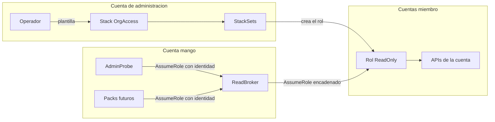

# Acceso a cuentas miembro (`OrgAccess`, `Member`, `ReadBroker`): modelo de amenazas (v0.1)

> Fecha: 2026-10-01 · Skill: `security-threat-model`. Plan: `docs/specs/marketplace-v1-plan.md` (C4). Arquitectura: §4.10. Decisiones: D5, D10, D25, D37, D49 (5).
> Amplía TM-003 y TM-004 de `mango-architecture-threat-model.md` y TM-A7 de `admin-v0-threat-model.md`.
> Alcance: `infra/lib/stacks/org-access-stack.ts`, `infra/lib/stacks/member-stack.ts`, `infra/lib/constructs/member-access.ts`, `infra/lib/config/schema.ts` (`orgAccess`), `infra/bin/mango.ts`, `functions/admin-probe/` (operación `member_access`), `deployment/deploy-org-access.sh` y `tests/e2e/member_access.py`.
> Comprobado en local (tests de infra sobre las plantillas sintetizadas y tests del probe con STS simulado). **Nada está desplegado:** lo que falta ver en el laboratorio está en «Supuestos sin validar».

## Executive summary

C4 abre un camino nuevo desde la cuenta `mango` hacia **todas las cuentas miembro** de la organización del cliente. Es el cambio de confianza entre cuentas con más alcance de la plataforma. Los riesgos dominantes:

1. **Compromiso de la cuenta `mango`** (TM-004): quien controle un principal que el broker acepta llega a un rol en cada cuenta.
2. **Perder a la persona** (regla 5): una sesión en una cuenta miembro sin `SourceIdentity`.
3. **El canal de distribución:** un StackSet `SERVICE_MANAGED` crea IAM en cada cuenta de las OUs objetivo, incluidas las que se creen después. Una plantilla alterada o un objetivo demasiado amplio se propagan solos.
4. **Sobre-privilegio del rol compartido:** `Mango-<ns>-ReadOnly` es uno por cuenta para todos los packs. La session policy por llamada la pone quien llama, no el rol.
5. **Roles con el mismo nombre fuera de la organización**, o en una cuenta que salió de ella.

Controles construidos:

- **Dos saltos con trust cerrado.** El spoke confía en la cuenta `mango` solo si el principal es exactamente `Mango-<ns>-ReadBroker`, pertenece a la organización y trae `SourceIdentity`. El broker solo acepta los ARNs exactos que nombra su trust (hoy, solo el rol del AdminProbe), también con `SourceIdentity` obligatorio.
- **El rol spoke no tiene acciones de datos todavía.** C4 construye la cadena, no lo que se lee con ella. La lista de acciones llega con el primer pack sobre cuentas miembro y será su tope (igual que `BILLING_READER_DATA_ACTIONS`).
- **El broker solo puede asumir `Mango-<ns>-ReadOnly`**, y solo en cuentas de la organización (`aws:ResourceOrgID`).
- **La plantilla del spoke viaja dentro de la plantilla de `OrgAccess`** (`TemplateBody`), no en un bucket: no hay un objeto que alguien pueda cambiar entre la revisión y el despliegue. Su `sha256` es un output del stack.
- **Objetivos por configuración validada** (`orgAccess.targets`): raíz u OUs, nunca implícitos. Al sacar una cuenta de las OUs objetivo, el StackSet borra el rol.
- **`OrgAccess` no crea ningún rol en la cuenta de administración.** Usa los roles de servicio de StackSets.

## Scope and assumptions

- **Dentro:** el stack `Mango-<ns>-OrgAccess` y su StackSet; la plantilla `Mango-<ns>-Member` y el rol `Mango-<ns>-ReadOnly`; el rol `Mango-<ns>-ReadBroker` de Core; la operación `member_access` del AdminProbe; la configuración `orgAccess`; el script de despliegue y la comprobación e2e.
- **Fuera:** los packs que usarán la cadena (CloudWatch: su propio modelo, con la lista de acciones y el campo nuevo del manifiesto, D49 (5)); `Operator` y `OperateBroker` (escritura: llegan con el approval executor, D10 y D27); el stack `Payer` (ya existe); la validación en Cedar de qué cuenta puede ver cada usuario (§4.10, «quién ve qué cuenta»); el endpoint de `mango-api` que exponga el connectivity check de spokes.
- **Supuestos:**
  1. La organización tiene todas las funciones activadas y el acceso de confianza de StackSets activado desde CloudFormation (`ActivateOrganizationsAccess`). Lo activa el cliente; Mango no cambia ajustes de Organizations (§4.10).
  2. `OrgAccess` se instala con credenciales de la cuenta de administración o de un administrador delegado de StackSets. Quien tiene esas credenciales ya puede crear IAM en cualquier cuenta: Mango no añade ese poder, lo usa.
  3. Un administrador de una cuenta miembro controla su cuenta, incluido el rol `Mango-<ns>-ReadOnly` que vive en ella. No es un atacante contra su propia cuenta; sí puede serlo contra Mango (datos que Mango lee de ahí).
  4. Los principales que el trust del broker nombra **son parte de la base de confianza para la atribución**: pueden poner el `SourceIdentity` que quieran (igual que el supuesto 3 de `pack-identity-threat-model.md`).
  5. El cliente puede aplicar SCPs que protejan los roles `Mango-*`, pero no se asume (supuesto 3 del modelo de arquitectura). Sin ellas, TM-O1 y TM-O7 suben un nivel.
  6. `aws:ResourceOrgID` está presente en la autorización de `sts:AssumeRole` sobre un rol de otra cuenta de la organización. **Sin comprobar en el laboratorio.**
- **Preguntas abiertas** (cambian prioridades; ver «Supuestos sin validar»):
  1. ¿La cuenta `mango` recibe también el rol spoke? En el laboratorio está dentro de una OU objetivo. Con el rol sin acciones no cambia nada hoy; cambia cuando haya packs.
  2. ¿Qué acciones tendrá `ReadOnly`? Las de logs (`logs:StartQuery`, `logs:GetQueryResults`) leen contenido que puede ser sensible.
  3. ¿El cliente desplegará la plantilla con CfCT o AFT en vez del StackSet? El trust es el mismo; cambia quién vigila las instancias.

## System model

### Primary components

| Componente | Cuenta | Qué es | Evidencia |
|---|---|---|---|
| `Mango-<ns>-ReadBroker` | `mango` | Rol sin datos; solo asume el spoke | `infra/lib/constructs/member-access.ts` |
| AdminProbe (operación `member_access`) | `mango` | Lambda de solo lectura; único principal en el trust del broker hoy | `functions/admin-probe/src/mango_admin_probe/handler.py` |
| `Mango-<ns>-OrgAccess` | Administración o administrador delegado | Un `AWS::CloudFormation::StackSet` `SERVICE_MANAGED` con auto-deployment | `infra/lib/stacks/org-access-stack.ts` |
| `Mango-<ns>-Member` | Cada cuenta miembro objetivo | Rol `Mango-<ns>-ReadOnly` | `infra/lib/stacks/member-stack.ts` |
| Configuración `orgAccess` | Repositorio / release | Objetivos, cuentas excluidas y cuenta que administra el StackSet | `infra/lib/config/schema.ts` |

### Data flows and trust boundaries

- **Operador → CloudFormation (cuenta de administración).** Cruza la plantilla de `OrgAccess` con la del spoke dentro. Canal: API de CloudFormation con credenciales del operador. Garantías: IAM del cliente; la plantilla es pre-sintetizada (regla 1), sin CodeBuild ni `cdk deploy`. Validación: `zod` sobre `orgAccess` al sintetizar; cdk-nag, cfn-guard y Checkov sobre ambas plantillas.
- **StackSets (servicio) → cuentas miembro.** Cruza la plantilla del spoke. Canal: roles de servicio de StackSets (`AWSServiceRoleForCloudFormationStackSetsOrgMember` y el rol de ejecución que crea el servicio). Garantías: acceso de confianza de Organizations; objetivos por OU; auto-deployment. Mango no crea ni modifica esos roles.
- **Principal permitido (cuenta `mango`) → `ReadBroker`.** Cruza `SourceIdentity` (usuario) y session tags. Canal: `sts:AssumeRole`. Garantías: trust con `aws:PrincipalArn` exacto, `aws:PrincipalOrgID` y `SourceIdentity` no nulo; tags limitados a `SESSION_TAG_KEYS`.
- **`ReadBroker` → `Mango-<ns>-ReadOnly` (otra cuenta).** Cruza `SourceIdentity` (heredado, no se puede cambiar), tags transitivos y la session policy de la llamada. Canal: `sts:AssumeRole` encadenado (sesión de 1 h como máximo). Garantías: trust del spoke con `AccountPrincipal` + `aws:PrincipalArn` = broker + `aws:PrincipalOrgID` + `SourceIdentity` no nulo; política del broker limitada a ese nombre de rol y a la organización.
- **Sesión del spoke → APIs de la cuenta miembro.** Hoy no cruza nada: el rol no tiene acciones. Las respuestas futuras son contenido no confiable (prompt injection indirecta).
- **`mango-api` (o un operador del laboratorio) → AdminProbe.** Cruza la operación, el `sub` del administrador y un id de cuenta. Canal: `lambda:InvokeFunction` por IAM. Validación: id de 12 dígitos; el resultado solo lleva textos fijos.

#### Diagram

## Assets and security objectives

| Asset | Why it matters | Security objective (C/I/A) |
|---|---|---|
| Datos operativos de las cuentas miembro (métricas, alarmas y, si se decide, logs) | Son de toda la organización; un área no debe ver los de otra | C |
| Atribución en CloudTrail de cada cuenta (`SourceIdentity`) | Regla 5: saber qué persona leyó qué | I |
| Trust de `ReadBroker` y de `ReadOnly` | Deciden quién llega a cada cuenta | I |
| Plantilla del spoke y objetivos del StackSet | Crean IAM en cada cuenta, también en las futuras | I |
| Estado de las instancias del StackSet | Cobertura: una instancia fallida es una cuenta sin datos | A |
| Credenciales temporales del broker y del spoke | Sirven 15 minutos (1 h como máximo) en otra cuenta | C |

## Attacker model

### Capabilities

- **Usuario autenticado de Mango** (de área o central): solo llega a la cadena a través de una tool del Gateway. Hoy ninguna tool la usa.
- **Código comprometido dentro de un principal permitido** (el AdminProbe hoy; un pack de terceros después): tiene las credenciales de ese rol y puede asumir el broker con el `SourceIdentity` que quiera.
- **Otro principal de la cuenta `mango`** (un conector, el rol de un agente, el provisioner): puede intentar asumir el broker o el spoke directamente.
- **Administrador de una cuenta miembro:** puede leer, cambiar o borrar el rol de Mango en su cuenta, y decide qué datos hay en ella.
- **Atacante externo con una cuenta AWS propia:** puede crear un rol llamado `Mango-<ns>-ReadOnly` que confíe en la cuenta `mango`.

### Non-capabilities

- No controla la cuenta de administración ni el administrador delegado de StackSets (quien los controla ya controla la organización).
- No puede cambiar una plantilla ya revisada: va dentro de la de `OrgAccess`, no en un bucket.
- No puede cambiar `SourceIdentity` dentro de una cadena ya iniciada (lo impide STS).
- Un administrador de una cuenta miembro no puede asumir roles de la cuenta `mango`: la confianza va en un solo sentido.

## Entry points and attack surfaces

| Surface | How reached | Trust boundary | Notes | Evidence (repo path / symbol) |
|---|---|---|---|---|
| Trust de `ReadBroker` | `sts:AssumeRole` desde la cuenta `mango` | Principal → broker | ARNs exactos, `SourceIdentity` obligatorio | `infra/lib/constructs/member-access.ts` (`MemberAccess`) |
| Trust de `Mango-<ns>-ReadOnly` | `sts:AssumeRole` desde cualquier cuenta | Broker → spoke | Solo el broker, de la organización, con `SourceIdentity` | `infra/lib/stacks/member-stack.ts` (`MemberStack`) |
| Política de identidad del broker | Sesión del broker | Broker → spoke | Solo `Mango-<ns>-ReadOnly`; `aws:ResourceOrgID` | `member-access.ts` (`AssumeMemberReadOnly`) |
| StackSet `Mango-<ns>-Member` | `CreateStack`/`UpdateStack` de `OrgAccess` | Operador → cuentas miembro | `SERVICE_MANAGED`, auto-deployment, plantilla embebida | `infra/lib/stacks/org-access-stack.ts` |
| Configuración `orgAccess` | Archivo de instalación | Operador → síntesis | Raíz u OUs, cuentas excluidas, cuenta administradora | `infra/lib/config/schema.ts` |
| Operación `member_access` | `lambda:InvokeFunction` | `mango-api` → probe | Id de cuenta validado; sin texto de excepciones | `functions/admin-probe/.../handler.py` (`member_access`) |
| `deployment/deploy-org-access.sh` | Operador | Operador → CloudFormation | Solo `aws cloudformation deploy` de la plantilla sintetizada | `deployment/deploy-org-access.sh` |

## Top abuse paths

1. **Leer toda la organización desde un principal comprometido.** RCE en un pack futuro nombrado en el trust → asume `ReadBroker` con un `SourceIdentity` inventado → asume `ReadOnly` en cada cuenta sin session policy → lee todo lo que el rol permita. Impacto: exposición de datos operativos de toda la organización, atribuida a otra persona.
2. **Saltarse el broker.** Un conector comprometido de la cuenta `mango` intenta asumir `Mango-<ns>-ReadOnly` directamente → el trust del spoke lo rechaza (`aws:PrincipalArn`). Intenta asumir el broker → no está en su trust.
3. **Sesión sin persona.** Un principal permitido asume el broker sin `SourceIdentity` → rechazado por `Null: sts:SourceIdentity`. Sin ese control, CloudTrail de la cuenta miembro solo mostraría el rol.
4. **Rol señuelo.** Un atacante crea `Mango-<ns>-ReadOnly` en su cuenta, fuera de la organización, y consigue que una tool reciba ese id de cuenta → el broker no puede asumirlo (`aws:ResourceOrgID`). Sin ese control, Mango leería datos fabricados por el atacante (prompt injection indirecta).
5. **Objetivo demasiado amplio.** El operador apunta a la raíz → cada cuenta nueva, también las de cargas sensibles, recibe el rol sin que nadie lo decida. Impacto: más superficie de la acordada.
6. **Plantilla cambiada.** Alguien con acceso de escritura al origen de la plantilla del spoke la cambia por una con un rol de administrador → se propaga a todas las cuentas. Con la plantilla embebida no existe ese origen: habría que cambiar el propio stack `OrgAccess`.
7. **Cuenta que sale de la organización.** La cuenta conserva el rol → el trust exige `aws:PrincipalOrgID`, que sigue cumpliéndose para el broker; lo que corta el acceso es `aws:ResourceOrgID` en el broker y el borrado de la instancia por el auto-deployment.
8. **Administrador de cuenta miembro amplía el rol.** Añade `AdministratorAccess` a `Mango-<ns>-ReadOnly` en su cuenta → un principal comprometido de Mango tendría más alcance en *esa* cuenta. La session policy por llamada lo acota; el StackSet lo marca como desviado (drift).

## Threat model table

| Threat ID | Threat source | Prerequisites | Threat action | Impact | Impacted assets | Existing controls (evidence) | Gaps | Recommended mitigations | Detection ideas | Likelihood | Impact severity | Priority |
|---|---|---|---|---|---|---|---|---|---|---|---|---|
| TM-O1 | Código comprometido en un principal del trust del broker | Ejecución de código con el rol del AdminProbe (hoy) o de un pack (después) | Asumir el broker y el spoke de cualquier cuenta, sin session policy | Lectura de toda la organización hasta el tope del rol | Datos, atribución | Trust con ARNs exactos (`member-access.ts`); el rol spoke no tiene acciones de datos (`member-stack.ts`, test «grants no data action yet»); el broker solo asume `Mango-<ns>-ReadOnly` | La session policy la pone quien llama; con acciones en el rol, el tope es el rol | Lista de acciones explícita y corta al añadir packs; sin `logs:*` salvo decisión; SCP recomendada que proteja los roles `Mango-*` | Alarma sobre `AssumeRole` a `ReadOnly` sin `Policy` en CloudTrail; volumen de `AssumeRole` por `sourceIdentity` | low (hoy) / medium (con packs) | high | **medium** |
| TM-O2 | Otro principal de la cuenta `mango` | Credenciales de un conector, un agente o el provisioner | Asumir el broker o el spoke directamente | Acceso sin pasar por los controles | Trust | `aws:PrincipalArn` exacto en ambos trusts; ninguna política de identidad fuera del probe nombra el broker (test «is named in the identity policy of the AdminProbe and of nobody else») | Quien pueda cambiar el trust del broker (administrador de la cuenta, rol de ejecución de CloudFormation) | SCP que proteja `Mango-*`; el provisioner no tiene `iam:UpdateAssumeRolePolicy` (test existente) | CloudTrail: `UpdateAssumeRolePolicy` sobre `Mango-<ns>-ReadBroker` | low | high | **medium** |
| TM-O3 | Principal permitido | Ninguno | Asumir sin `SourceIdentity` | Sesión sin persona | Atribución | `Null: sts:SourceIdentity = false` en el broker y en el spoke; `mango_aws.CrossAccountSessions` siempre lo envía; el probe comprueba que sin él se rechaza (`source_identity_required`) | — | — | La comprobación e2e y el connectivity check | low | medium | **low** |
| TM-O4 | Principal permitido | Código de confianza para la atribución | Poner el `SourceIdentity` de otra persona | Atribución falsa | Atribución | El probe toma el actor del token verificado por `mango-api`; los packs, de la aserción firmada (D49) | El código dentro del principal puede mentir | Cadena de suministro de packs (firma, cuarentena, `tools_hash`); egress allowlist (R6) | Comparar `sourceIdentity` de CloudTrail con el audit de Mango | low | medium | **low** |
| TM-O5 | Atacante externo | Que una tool acepte un id de cuenta arbitrario | Rol señuelo con el mismo nombre fuera de la organización | Datos fabricados en el contexto del LLM | Integridad de respuestas | `aws:ResourceOrgID` en la política del broker; el probe valida el id y comprueba que la sesión está en esa cuenta | Sin comprobar en el laboratorio que la llave está presente (supuesto 6) | Cedar valida `account_id` contra el inventario de la organización cuando existan las tools (§4.10) | Denegaciones de `AssumeRole` del broker | low | medium | **low** |
| TM-O6 | Operador | Configuración de `orgAccess` | Apuntar a la raíz o a OUs de más | El rol aparece en cuentas no acordadas, también futuras | Trust, datos | Objetivos explícitos y validados (`schema.ts`); cuentas excluidas; `RetainStacksOnAccountRemoval: false` | Auto-deployment es silencioso para cuentas nuevas | Preferir OUs a la raíz; revisar los objetivos en la guía de instalación | El e2e lista las instancias y las compara con las cuentas de las OUs | medium | medium | **medium** |
| TM-O7 | Quien pueda actualizar `OrgAccess` | Credenciales de la cuenta de administración o del administrador delegado | Cambiar la plantilla del spoke | IAM arbitrario en todas las cuentas | Plantilla | Plantilla embebida y con `sha256` como output; cdk-nag, cfn-guard y Checkov sobre ella; `OrgAccess` no crea roles propios | Ese principal ya administra la organización | SCP o control de cambios del cliente sobre los stacks `Mango-*` | Output `MemberTemplateSha256` distinto del de la release; drift del StackSet | low | high | **medium** |
| TM-O8 | Administrador de una cuenta miembro | Control de su cuenta | Ampliar los permisos o el trust del rol de Mango en su cuenta | Más alcance de Mango en esa cuenta; o terceros que entran por ese rol a su propia cuenta | Datos de esa cuenta | Session policy por llamada; el rol no da acceso a la cuenta `mango` | El StackSet no corrige el drift solo | Detección de drift periódica; SCP que impida modificar `Mango-*` salvo a StackSets | Drift del StackSet; CloudTrail `PutRolePolicy`/`AttachRolePolicy` sobre el rol | low | low | **low** |
| TM-O9 | Fallo operativo | SCP del cliente, cuota o cuenta suspendida | Instancias del StackSet fallidas en silencio | Cuentas sin cobertura | Disponibilidad | Tolerancia a fallos acotada (10 %); el e2e comprueba cada instancia; el probe comprueba una cuenta | `mango-api` aún no expone el connectivity check de spokes | Endpoint del connectivity check con el estado de las instancias (§4.10) | Estado `OUTDATED`/`FAILED` de las instancias | medium | low | **low** |
| TM-O10 | Dos instalaciones en la misma organización | Mismo namespace por error | Un spoke confía en el broker de otra instalación | Acceso cruzado | Trust | El trust nombra la cuenta `mango` y el namespace; el nombre del StackSet lleva el namespace (regla 6) | Dos instalaciones en la misma cuenta con el mismo namespace no pueden coexistir (colisión de nombres en CloudFormation) | — | — | low | medium | **low** |
| TM-O11 | Contenido de una cuenta miembro | Packs futuros | Nombres de alarmas o logs con instrucciones para el modelo | Prompt injection indirecta | Integridad de respuestas | Fuera de C4: el rol no lee nada todavía | — | Tratar las salidas como no confiables (regla LLM); guardrail | — | low | medium | **low** |

## Criticality calibration

- **Critical:** un principal no previsto obtiene escritura en cuentas miembro; la plantilla del spoke se puede cambiar sin tocar `OrgAccess`. *(No aplica a C4: no hay roles de escritura.)*
- **High:** leer datos de toda la organización sin identidad de persona; trust del spoke con comodines o sin `aws:PrincipalArn`; `ReadOnlyAccess` en el rol.
- **Medium:** objetivos del StackSet más amplios que lo acordado; un principal permitido comprometido que lee hasta el tope del rol; cambio del trust del broker por un administrador de la cuenta `mango`.
- **Low:** instancias fallidas; drift en una cuenta por su propio administrador; datos fabricados desde un rol señuelo.

## Focus paths for security review

| Path | Why it matters | Related Threat IDs |
|---|---|---|
| `infra/lib/stacks/member-stack.ts` | Trust y permisos del rol que existe en cada cuenta | TM-O1, TM-O2, TM-O3, TM-O10 |
| `infra/lib/constructs/member-access.ts` | Trust del broker y a qué puede asumir | TM-O1, TM-O2, TM-O5 |
| `infra/lib/stacks/org-access-stack.ts` | Objetivos, auto-deployment y plantilla embebida | TM-O6, TM-O7, TM-O9 |
| `infra/lib/config/schema.ts` (`orgAccess`) | Qué objetivos acepta la síntesis | TM-O6 |
| `functions/admin-probe/src/mango_admin_probe/handler.py` | Único principal que usa el broker hoy | TM-O1, TM-O3, TM-O4 |
| `packages/py/mango-aws/src/mango_aws/broker.py` | `SourceIdentity`, tags y session policy de cada salto | TM-O1, TM-O3 |
| `infra/test/member-access.test.ts` | Fija los trusts y la ausencia de permisos de datos | Todos |
| `tests/e2e/member_access.py` | Comprueba en AWS lo que los tests fijan en la plantilla | TM-O3, TM-O6, TM-O9 |

## Pack sobre cuentas miembro: lo que falta (D49 (5), sin construir)

> **Construido el 2026-10-02** con el pack `aws-cloudwatch`: ver `aws-cloudwatch-pack-threat-model.md`. Desde entonces el rol spoke tiene cinco acciones de lectura (métricas, alarmas y metadatos de log groups; ninguna lee eventos de log) y el trust de `ReadBroker` nombra, además de la sonda, el rol de cada pack `member` de la release. Lo que sigue es el diseño tal como se dejó descrito.

Hoy hay una sola cadena por instalación (broker de Billing → `BillingReader`) y el manifiesto no la nombra. Un pack sobre cuentas miembro necesita:

- **Un campo nuevo en el manifiesto firmado** que diga qué cadena usa, por ejemplo `identity.chain: "payer" | "member"` (por defecto `payer`, para no cambiar el significado de los manifiestos ya firmados). Va dentro de lo que se firma: cambiarlo es otra versión del pack.
- **El trust de `ReadBroker`** nombra el ARN exacto del rol de cada pack `central_only` con `chain: member` de la release, igual que hace el broker de Billing.
- **El tope de acciones** pasa a ser la lista del rol spoke (hoy vacía), no `BILLING_READER_DATA_ACTIONS`.
- **El destino cambia en cada llamada:** el punto de entrada común recibe el nombre del rol (`Mango-<ns>-ReadOnly`), no un ARN, y lo combina con el id de cuenta de la llamada. Ese id tiene que venir validado (12 dígitos, cuenta de la organización, permitida para el usuario por Cedar) y nunca de un argumento que el servidor upstream interprete por su cuenta (`profile_name` de CloudWatch, brecha 22 del plan).
- **La región** es un argumento más de la llamada: los roles son globales, CloudWatch no.

## Supuestos sin validar con el usuario

La skill pide confirmar los supuestos antes del informe final. Quedan abiertos, con su efecto:

1. **La cuenta `mango` dentro de los objetivos.** Si recibe el rol, un pack futuro leería también los datos operativos de Mango. Hoy no cambia nada (rol sin acciones). Se puede excluir con `orgAccess.excludedAccountIds`.
2. **Acciones de `ReadOnly`.** Decidirlas con el primer pack. Las de logs suben TM-O1 a high.
3. **SCPs del cliente sobre `Mango-*`.** Sin ellas, TM-O2 y TM-O7 dependen solo de quién administra las cuentas.
4. **`aws:ResourceOrgID` en `sts:AssumeRole`** (supuesto 6). Si en el laboratorio la llave no está presente, el broker no podrá asumir el spoke y habrá que quitar la condición o sustituirla (TM-O5 pasaría a depender solo de Cedar).
5. **Propagación de `SourceIdentity` y de los tags transitivos** en el salto broker → spoke entre cuentas (§4.10 lo marca «verificar en PoC»). La cadena de Billing ya lo comprobó contra la pagadora.
