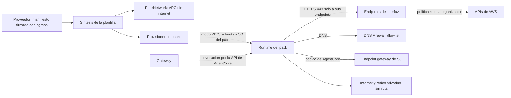

# Egress restringido de los Runtimes de packs (R6): modelo de amenazas (v0.1)

> Fecha: 2026-10-02 · Skill: `security-threat-model`. Requisito: R6 (`reference-architecture.md` §5). Decisiones: D15, D19, D25, D36, D37, D43, D49 (7).
> Cierra el riesgo residual principal de TM-I6 (`pack-identity-threat-model.md`), TM-B13 (`mcp-pack-provisioner-threat-model.md`) y TM-BL9 (`aws-billing-pack-threat-model.md`), y la parte de packs de TM-009 y TM-014 (`mango-architecture-threat-model.md`).
> Alcance: `infra/lib/constructs/pack-network.ts` (red de packs), `infra/lib/config/pack-release.ts` y `pack-platform.ts` (qué declara cada pack de la release), `infra/lib/constructs/pack-provisioner.ts` (permisos y entorno), `packages/py/mango-packs/src/mango_packs/manifest.py` (campo `egress`), `functions/provisioner/src/mango_provisioner/packs/` (`config.py`, `release.py`, `runtime.py`, `steps.py`) y `packs/*/manifest.yaml`.
> Skills: `security-threat-model` (este documento, antes de construir) y `security-audit` en modo guía sobre el diff (IAM, red, fronteras de confianza); su resultado está en «Revisión del diff».
> Decidido por el usuario el 2026-10-02: (1) el control son **endpoints de VPC** en una VPC de packs sin internet gateway ni NAT, con un security group por pack, políticas de endpoint limitadas a la organización y DNS Firewall con allowlist; un pack que declare hosts externos se rechaza por ahora; (2) **dos zonas de disponibilidad** también en el laboratorio, configurables por instalación; (3) el pack `aws-cloudwatch` (PR #70, fusionada mientras se construía esto) **solo lee la región de la instalación**: un endpoint de interfaz no sirve APIs de otras regiones.
> Comprobado en el laboratorio el 2026-10-02 con recursos temporales (`tests/e2e/pack_egress.py`, red `temp`): ver «Comprobado en el laboratorio». La red de la instalación no está desplegada: lo que falta ver está en «Supuestos sin validar».

## Executive summary

Un pack es **código de terceros** (un servidor MCP de `awslabs` y decenas de dependencias) que corre en una microVM de AgentCore Runtime. Hasta hoy esa microVM usaba el modo de red `PUBLIC`: salía a internet sin límite. Por eso D49 (7) solo dejaba instalar packs de datos de cuentas en el laboratorio.

Riesgos dominantes:

1. **Exfiltración a internet**: un pack comprometido envía fuera lo que lee (costos de toda la organización) o lo que ve pasar (argumentos y respuestas de las tools).
2. **Exfiltración por AWS con credenciales ajenas**: aunque solo alcance APIs de AWS, el pack trae credenciales de la cuenta del atacante y escribe los datos allí (un bucket, un log group, el nombre de un budget).
3. **Exfiltración por DNS**: sin ruta a internet, el resolver de la VPC sigue resolviendo nombres públicos; los datos viajan en las consultas.
4. **Movimiento lateral**: desde la red del Runtime, alcanzar `mango-api`, el ALB interno u otros recursos privados (SSRF, TM-014).
5. **Ampliar la allowlist sin revisión**: que quien no firma la release consiga que un pack alcance más destinos.

Controles construidos:

- **VPC propia de packs, sin internet gateway ni NAT.** No hay ruta por defecto: lo único enrutable son los endpoints de la VPC. Está separada de la VPC de `mango-api` (D15), sin peering.
- **Runtimes en modo `VPC`**, en subnets de esa VPC. El provisioner ya no sabe crear un Runtime en modo `PUBLIC` y comprueba, antes de exponer una versión, que su red es la esperada. Además **IAM se lo impide**: su rol solo puede crear o actualizar un Runtime con subnets y security groups de la red de packs (`bedrock-agentcore:subnets`, `bedrock-agentcore:securityGroups`); una petición sin ellos (modo `PUBLIC`) se deniega.
- **Allowlist firmada.** El manifiesto lleva un campo `egress` (servicios de AWS de una lista cerrada y hosts externos) dentro de lo que firma el proveedor. La plantilla se sintetiza a partir de esas declaraciones firmadas.
- **Un security group por pack**, estático en la plantilla (D25): solo deja salir por HTTPS hacia los endpoints de los servicios que ese pack declara, el de CloudWatch Logs y S3 (código del Runtime). Cada endpoint solo acepta a los packs que lo declaran.
- **Políticas de endpoint limitadas a la organización** (`aws:PrincipalOrgID`): una credencial de fuera de la organización se rechaza en el endpoint. El endpoint de S3 solo deja a AgentCore leer sus buckets de código.
- **DNS Firewall** con allowlist de los nombres de esos endpoints y bloqueo del resto, en modo *fail closed*.
- **Hosts externos: rechazo.** Un pack que declare alguno no se sintetiza en una release ni se instala (`external_egress_unsupported`).
- **Una sola región.** Los endpoints son los de la región de la instalación. El punto de entrada común rechaza, antes de asumir la sesión, una llamada de la cadena `member` que nombre otra región, con un mensaje que dice cuál se puede leer.

Con esto se retira el bloqueo de D49 (7): la síntesis de `customer` ya admite packs de datos de cuentas y el provisioner ya no responde `egress_allowlist_required`.

## Scope and assumptions

- **Dentro:** la red de los Runtimes de packs y lo que decide a qué pueden salir (manifiesto firmado, plantilla, provisioner).
- **Fuera:**
  - **Conectores** (Lambdas detrás del Gateway). Evaluados: son código de Mango, no de terceros; solo llaman APIs de AWS con roles de mínimo privilegio y no están en una VPC por una excepción acordada (`LAMBDA_INSIDE_VPC`, 2026-09-29). R6 para conectores queda abierto como requisito de diseño cuando exista uno con URL variable o hacia la red del cliente (SAP).
  - **Harness de los agentes** (microVM de AgentCore que corre el agente): sigue en modo `PUBLIC`. No ejecuta código de terceros y su único destino de tools es el Gateway (regla 3). Es la otra mitad de R6 y no se construye aquí.
  - `mango-api` en Fargate con IP pública (D15).
  - El control para hosts externos (proxy o Network Firewall): se decide cuando un pack lo necesite.
- **Supuestos:**
  1. El código dentro del proceso del pack no es de confianza para la red: puede abrir cualquier socket, resolver cualquier nombre y traer credenciales propias.
  2. La red de la microVM es la interfaz que AgentCore crea en las subnets indicadas con el security group indicado; no hay otra salida. AgentCore lo documenta («does not have internet access by default») y se comprobó en el laboratorio.
  3. La release (manifiestos firmados y plantilla) la produce el proveedor. Quien puede cambiar la plantilla o firmar un pack ya puede cambiar todo: es la raíz de confianza (modelo del pipeline, R5).
  4. La región es `us-east-1` (la única que admite `installationSchema`): allí existen endpoints de interfaz para todos los servicios que usan los packs de hoy, incluidos Cost Explorer, Budgets y Price List.
  5. Las cuentas de la organización del cliente son de confianza relativa: la política de los endpoints deja pasar a cualquier principal de la organización.
- **Preguntas abiertas:**
  1. Resuelta (usuario, 2026-10-02): endpoints de VPC; hosts externos rechazados.
  2. Resuelta (usuario, 2026-10-02): dos zonas también en el laboratorio.
  3. ¿Debe la política de los endpoints nombrar cuentas concretas (Mango y pagadora) en lugar de la organización? Hoy: organización, como se decidió. Ver TM-E3.
  4. Resuelta (usuario, 2026-10-02): CloudWatch solo en la región de la instalación. Otras regiones exigirían una red de packs por región o salida filtrada por dominio, que no tendría políticas de endpoint.
  5. ¿Quedan registradas en el CloudTrail de **otra** cuenta las llamadas que el pack firme con credenciales ajenas (denegadas por el endpoint, o `sts:GetCallerIdentity`, que no se puede denegar)? Ver TM-E11.

## System model

### Primary components
- **Manifiesto del pack** (`packs/<id>/manifest.yaml`, `mango_packs.manifest.PackEgress`): `egress.aws` (ids de una lista cerrada) y `egress.hosts` (FQDN). Va dentro de la declaración firmada (`PackStatement.manifest`).
- **Catálogo de endpoints** (`infra/lib/constructs/pack-network.ts`, `PACK_EGRESS_SERVICES`): qué id corresponde a qué servicio de endpoint y qué nombres DNS. Un id fuera de la lista no sintetiza.
- **`PackNetwork`** (construct nuevo): VPC `Mango-<ns>-PackVpc`, dos subnets aisladas por id de zona, endpoint gateway de S3, endpoints de interfaz, un security group por pack y por endpoint, DNS Firewall, flow logs de tráfico rechazado y registro de consultas DNS. Solo existe si la release trae packs.
- **Provisioner de packs**: recibe por entorno (`PACK_NETWORK`) las subnets y el security group de cada pack; crea el Runtime con `networkMode: VPC`.
- **AgentCore Runtime**: crea las interfaces de red (`AWSServiceRoleForBedrockAgentCoreNetwork`) y trae el código del pack desde su bucket de servicio por el endpoint de S3.

### Data flows and trust boundaries
- **Proveedor → release:** manifiesto firmado (ECDSA P-256, KMS). `egress` forma parte del payload: cambiarlo invalida la firma y el digest del catálogo.
- **Release → plantilla (síntesis):** `loadReleasePacks` verifica la firma y lee `manifest.egress`. Hosts externos o un servicio desconocido hacen fallar la síntesis.
- **Plantilla → provisioner:** `PACK_NETWORK` (ids de subnets y de security groups). Valores de la pila, nunca de la solicitud ni del pack.
- **Provisioner → AgentCore:** `CreateAgentRuntime`/`UpdateAgentRuntime` con `networkModeConfig`. El pack no elige su red.
- **Runtime → endpoint de interfaz:** HTTPS (TLS de AWS, SigV4). Filtros: security group del pack (destino), security group del endpoint (origen), política del endpoint (principal de la organización) e IAM del rol.
- **Runtime → resolver de la VPC:** DNS. Filtro: DNS Firewall (allowlist; el resto, `NXDOMAIN`).
- **Runtime → S3 (gateway):** solo `s3:GetObject` de AgentCore sobre sus buckets de código (`aws:PrincipalServiceName`). El pack no puede usar S3.
- **Runtime → cualquier otro destino:** sin ruta (no hay internet gateway, NAT ni peering) y sin regla de salida.

#### Diagram

## Assets and security objectives

| Activo | Por qué importa | Objetivo |
|---|---|---|
| Datos que lee un pack (costos y uso de la organización, inventario de la pagadora) | Información financiera de toda la empresa | C |
| Argumentos y respuestas de las tools | Contexto de conversaciones | C |
| Credenciales de la sesión por llamada (broker) y del rol del pack | Permiten leer durante 15 minutos | C |
| Red privada de la instalación (`mango-api`, ALB) y del cliente | Movimiento lateral, SSRF | C/I |
| Allowlist de egress (manifiesto firmado, plantilla) | Define el perímetro | I |
| Disponibilidad de los packs | Las tools dejan de responder | A |

## Attacker model

### Capabilities
- **Pack comprometido** (upstream o dependencia transitiva maliciosa, TM-P1): ejecuta código arbitrario en la microVM con el rol del pack; puede traer credenciales de otra cuenta en su código.
- **Modelo manipulado** (prompt injection): controla los argumentos de las tools; puede intentar que una tool pida una URL (SSRF) si el servidor upstream tuviera esa función.
- **Administrador de la instalación**: habilita packs de la release con doble aprobación; no puede cambiar la plantilla ni firmar.

### Non-capabilities
- No puede cambiar el manifiesto firmado ni la plantilla (raíz de confianza del proveedor).
- No puede elegir subnets ni security groups: no hay parámetro de habilitación que llegue a la red.
- El pack no tiene permisos de EC2, Route 53 Resolver ni IAM (permissions boundary `Mango-<ns>-mcp-boundary`).

## Entry points and attack surfaces

| Superficie | Cómo se alcanza | Frontera | Notas | Evidencia |
|---|---|---|---|---|
| Campo `egress` del manifiesto | Build y firma del pack | Proveedor → release | Lista cerrada de servicios; hosts sin comodines ni IP | `mango_packs/manifest.py` (`PackEgress`) |
| Síntesis de la red | `cdk synth` de la release | Release → plantilla | Falla con hosts externos o servicio desconocido | `pack-platform.ts` (`assertPackEgress`), `pack-network.ts` |
| `PACK_NETWORK` | Entorno de la Lambda | Plantilla → provisioner | Ids validados por patrón | `packs/config.py` (`PackNetwork`) |
| `networkConfiguration` del Runtime | `CreateAgentRuntime`/`UpdateAgentRuntime` | Provisioner → AgentCore | Siempre `VPC`; se verifica en la versión creada | `packs/runtime.py` (`runtime_config`, `ready`) |
| Sockets de la microVM | Código del pack | Runtime → red | Security group, rutas | `pack-network.ts` |
| Resolver DNS de la VPC | Código del pack | Runtime → DNS | DNS Firewall | `pack-network.ts` |
| Endpoints de interfaz | HTTPS desde el Runtime | Runtime → AWS | Política de endpoint + IAM | `pack-network.ts` (`organizationOnly`) |

## Top abuse paths

1. **Exfiltrar a un servidor del atacante.** El pack abre una conexión a `attacker.example:443`. → El nombre no resuelve (DNS Firewall) y, aun con la IP, no hay ruta ni regla de salida. Bloqueado y comprobado.
2. **Exfiltrar por DNS.** El pack resuelve `<datos>.attacker.example`. → `NXDOMAIN` por el DNS Firewall, que falla cerrado. Los nombres permitidos son de AWS: sus consultas no llegan a un servidor del atacante.
3. **Exfiltrar con credenciales ajenas por un endpoint permitido.** El pack de Billing llama `budgets:CreateBudget` en la cuenta del atacante con credenciales embebidas, con datos en el nombre. → La política del endpoint exige `aws:PrincipalOrgID`: rechazado. Comprobado con Price List.
4. **Exfiltrar con credenciales ajenas a S3.** → El endpoint de S3 solo permite `GetObject` a AgentCore sobre `acr-code-*`: el pack no puede usar S3 con ninguna credencial.
5. **Exfiltrar por un servicio que el pack no declara.** El pack de Pricing intenta STS o Logs de otro pack. → Su security group no tiene regla hacia ese endpoint, y el del endpoint no lo acepta. Comprobado quitando la regla.
6. **Exfiltrar dentro de la organización.** El pack trae credenciales de otra cuenta **de la misma organización** y escribe allí por un endpoint que declara. → No lo bloquea la política de endpoint. Exige comprometer además una cuenta del cliente. Riesgo residual (TM-E3).
7. **Exfiltrar por el canal legítimo.** El pack devuelve los datos en la respuesta de la tool, o los escribe en sus propios logs. → No es egress: es el camino previsto, con Cedar, auditoría y D16. Fuera de este control.
8. **Movimiento lateral.** El pack escanea `10.0.0.0/8` o llama al ALB de `mango-api`. → Otra VPC, sin peering; sin regla de salida a rangos privados. Comprobado.
9. **Ampliar la allowlist.** Un administrador intenta instalar un pack con más destinos. → Los destinos salen del manifiesto firmado y de la plantilla; la habilitación no lleva ningún parámetro de red. Un pack que no está en `PACK_NETWORK` no se instala (`egress_unavailable`).
10. **Runtime que queda en `PUBLIC`.** Un Runtime instalado antes de esta versión, o un fallo del provisioner. → `runtime_config` solo sabe pedir `VPC`, IAM deniega al provisioner cualquier otra red y `ready` rechaza una versión cuya red no sea la esperada (`runtime_network_mismatch`). Un pack instalado antes sigue en `PUBLIC` hasta que se actualiza, y la reconciliación diaria lo reporta mientras tanto (`pack_runtime_not_in_vpc`): ver TM-E7.
11. **Canal encubierto con credenciales ajenas.** El pack firma con credenciales de la cuenta del atacante una llamada por un endpoint permitido y pone datos en un campo que el servicio registra (el `User-Agent`, un parámetro). La política del endpoint la deniega, pero `sts:GetCallerIdentity` no se puede denegar y una llamada denegada podría quedar en el CloudTrail de la cuenta del atacante. → Canal de bajo ancho de banda, sin validar. Ver TM-E11.
12. **Otra región.** El modelo (o un pack) pide CloudWatch de `eu-west-1`. → No hay endpoint ni ruta; el punto de entrada lo rechaza antes de STS. No es una fuga: es una función que se pierde (decisión 3).

## Threat model table

| ID | Origen | Precondición | Acción | Impacto | Activos | Controles existentes | Brechas | Mitigación | Detección | Prob. | Impacto | Prioridad |
|---|---|---|---|---|---|---|---|---|---|---|---|---|
| TM-E1 | Pack comprometido | Código malicioso en el zip firmado | Conexión saliente a internet | Fuga de datos de costos | Datos | VPC sin IGW ni NAT; security group por pack sin `0.0.0.0/0`; hash, cuarentena y firma (pipeline) | — | Construido | Flow logs de tráfico rechazado de la VPC de packs | low | high | medium |
| TM-E2 | Pack comprometido | Igual | Túnel DNS | Fuga lenta de datos | Datos | DNS Firewall: allowlist + bloqueo de `*`, *fail closed*. Lo que pide la máquina de AgentCore por su cuenta (`time.aws.com`, nombre exacto) se rechaza igual, en una lista aparte | Falta ver desplegado que el nivel normal de la lista que bloquea todo es cero (en una instalación de laboratorio, 2026-10-06, el único nombre rechazado con el uso normal fue ese, visto con un solo pack). Si AWS cambia lo que pide su máquina, la alarma saltará hasta revisar el nombre | Hecho (D71): alarma `Mango-<ns>-PackDns-blocked` sobre las consultas que rechaza la regla que bloquea todo, al topic de alertas. Con la lista aparte, el umbral de una consulta en 5 minutos significa lo que dice: un nombre que nadie esperaba | Alarma `Mango-<ns>-PackDns-blocked` (`FirewallRuleQueryVolume` de la lista que bloquea todo); **registro de consultas DNS** de la VPC de packs (`Mango-<ns>-PackNetwork-dns-queries`): qué nombre se pidió y qué regla lo rechazó | low | medium | low |
| TM-E3 | Pack comprometido + credenciales de otra cuenta | Credenciales embebidas | Escribir datos en otra cuenta por un endpoint permitido | Fuga de datos | Datos | Política de endpoint `aws:PrincipalOrgID`; endpoint de S3 solo para AgentCore | Cuentas de la misma organización pasan | Si se quiere cerrar: política por cuentas (Mango y pagadora) según la cadena de identidad del pack | CloudTrail de la cuenta destino | low | high | low |
| TM-E4 | Pack comprometido | Igual | Usar un endpoint que no declara | Más superficie de fuga | Datos | Security group por pack y por endpoint; IAM del rol; boundary | — | Construido | Flow logs (rechazos) | low | low | low |
| TM-E5 | Pack comprometido / modelo | Tool con URL variable | Alcanzar `mango-api`, el ALB o la red del cliente | SSRF, movimiento lateral | Red | VPC separada sin peering; sin reglas a rangos privados | — | Construido | Flow logs | low | high | low |
| TM-E6 | Administrador / insider | Doble aprobación | Instalar un pack con hosts externos o más destinos | Perímetro ampliado sin revisión del proveedor | Allowlist | `egress` firmado; red estática en la plantilla; `installable` es falso con hosts; síntesis falla | — | Construido | Auditoría de habilitaciones | low | high | low |
| TM-E7 | Operación | Actualización desde una versión anterior | Un pack instalado sigue en modo `PUBLIC` | El control no aplica a ese pack | Datos | El manifiesto cambia (campo nuevo), así que la versión instalada ya no está en la release y el catálogo ofrece la actualización | Hasta actualizar, el Runtime viejo sigue con internet | Runbook: actualizar o deshabilitar los packs tras el despliegue; `tests/e2e/pack_egress.py --network stack` | Reconciliación diaria: hallazgo `pack_runtime_not_in_vpc` por cada versión de un Runtime `Mango_<ns>_mcp_*` que sirve un endpoint (`DEFAULT` o `live`) con `networkMode` distinto de `VPC`; dispara la alarma `Mango-<ns>-Reconciler-findings` | medium | medium | medium |
| TM-E8 | Operación | Zona sin soporte de AgentCore, endpoint caído | Los packs no arrancan o no alcanzan AWS | Tools no disponibles | Disponibilidad | Zonas por id validadas contra la lista de AgentCore; dos zonas; el agente sigue sin esas tools (D46) | Una región sin endpoint para un servicio deja al pack sin ese servicio | Catálogo cerrado de servicios por región | Fallos de `tools/call`, alarma de publicación | low | medium | low |
| TM-E9 | Provisioner comprometido | Código del provisioner | Crear un Runtime en `PUBLIC` o con otro security group | Evade el control | Datos | Rol propio; solo pasa roles de packs; red verificada por versión; **IAM**: `CreateAgentRuntime` y `UpdateAgentRuntime` solo con subnets y security groups de la red de packs (`Null: false` + `ForAllValues:StringEquals`) | Puede poner a un pack el security group de otro pack (no el de un endpoint) | Construido | CloudTrail (`AccessDenied` del rol del provisioner) | low | medium | low |
| TM-E10 | Pack comprometido | — | Agotar direcciones o saturar endpoints | Otros packs sin red | Disponibilidad | Subnets `/24`; un security group por pack (interfaces propias) | — | — | Métricas de endpoints | low | low | low |
| TM-E11 | Pack comprometido + credenciales de una cuenta del atacante | Credenciales embebidas; el pack declara un endpoint (todos los `central_only` declaran `sts`) | Llamadas firmadas con esas credenciales, con datos en campos que el servicio registra | Fuga lenta de datos al CloudTrail del atacante | Datos | Política de endpoint (la llamada no se ejecuta, salvo `sts:GetCallerIdentity`); cadena de suministro | No se sabe si la llamada denegada queda registrada en la cuenta del llamador; `GetCallerIdentity` pasa siempre | Activar los eventos de actividad de red de CloudTrail para los endpoints de la VPC de packs y alertar sobre principals de otra organización (pendiente) | Esos mismos eventos | low | medium | low |
| TM-E12 | Operación | Quitar un pack de la release con su Runtime recién borrado | CloudFormation no puede borrar el security group (interfaces de AgentCore hasta 8 h) | Actualización del stack fallida y revertida | Disponibilidad | Runbook: deshabilitar y esperar | — | — | Evento del stack | low | low | low |
| TM-E13 | Persona con lectura de CloudWatch Logs en la cuenta de Mango | Un pack comprometido intentó sacar datos por DNS | Leer el registro de consultas de la red de packs | Los datos que el firewall no dejó salir quedan escritos en los nombres registrados | Datos | Log group propio, cifrado con la llave de logs de `PackNetwork`, 30 días. Ningún rol de Mango lo lee: ni `mango-api` ni los packs (el rol de lectura de cuentas miembro no lee eventos de logs). La política de recursos solo deja escribir al servicio de entrega de registros, desde esta cuenta | Lo lee quien tenga `logs:GetLogEvents` o `logs:StartQuery` en la cuenta de Mango, igual que los demás log groups | Acceso de operación restringido a la cuenta de Mango; retención corta | CloudTrail de la cuenta (`StartQuery`, `GetLogEvents` sobre ese log group) | low | medium | low |

## Criticality calibration

- **Critical:** ninguna con los controles construidos.
- **High:** ninguna.
- **Medium:** TM-E1 (el impacto sigue siendo alto si un control falla; la probabilidad depende de la cadena de suministro) y TM-E7 (transición de los packs ya instalados).
- **Low:** el resto. TM-E3 baja de medium a low porque exige, además del pack comprometido, credenciales de una cuenta de la organización del cliente. TM-E11 es low por ancho de banda y por no estar validado; subiría a medium si se confirma que las llamadas denegadas se registran en la cuenta del llamador.
- Lo que más pesa: el supuesto 2 (la única red de la microVM es la interfaz de la VPC) y que `us-east-1` tenga endpoint para cada servicio.

## Focus paths for security review

| Ruta | Por qué | Amenazas |
|---|---|---|
| `infra/lib/constructs/pack-network.ts` | Rutas, security groups, políticas de endpoint, DNS Firewall | TM-E1 a TM-E5, TM-E8 |
| `infra/lib/constructs/pack-platform.ts` (`assertPackEgress`) | Qué release se admite | TM-E6 |
| `infra/lib/config/pack-release.ts` | Lectura de `egress` del manifiesto firmado | TM-E6 |
| `packages/py/mango-packs/src/mango_packs/manifest.py` | Esquema de `egress`, `installable` | TM-E6 |
| `functions/provisioner/src/mango_provisioner/packs/runtime.py` | Modo `VPC` y verificación de la red de cada versión | TM-E7, TM-E9 |
| `functions/provisioner/src/mango_provisioner/packs/config.py` | `PACK_NETWORK` | TM-E9 |
| `functions/reconciler/src/mango_reconciler/inventory.py` (`PackRuntimes`), `checks.py` (`pack_runtimes`) | Detección de un Runtime de pack fuera de la red de packs | TM-E7 |
| `infra/lib/constructs/reconciler.ts` (`ReadPackRuntimeNetwork`) | Permiso de solo lectura del reconciliador sobre `runtime/Mango_<ns>_mcp_*` | TM-E7 |
| `infra/lib/constructs/pack-provisioner.ts` | `iam:CreateServiceLinkedRole` acotado al rol de red (y, desde D43 (4), al de identidad de Runtimes); condiciones de red en `CreatePackRuntime` y `UpdatePackRuntime` | TM-E9 |
| `packages/py/mango-pack-runtime/src/mango_pack_runtime/guard.py` (`RegionError`) | Región única, solo dicha a un llamador verificado | Decisión 3 |

## Comprobado en el laboratorio (2026-10-02)

Con `tests/e2e/pack_egress.py --network temp` en la cuenta `mango-sandbox`: una VPC temporal sin internet gateway, dos subnets (`use1-az1`, `use1-az2`), endpoint gateway de S3, endpoints de `logs`, `sts` y `pricing.api`, DNS Firewall y un Runtime de prueba creado con un rol que solo tiene los permisos del provisioner.

1. El Runtime (zip, `PYTHON_3_13`) se crea en modo `VPC` y arranca en 2,7 s sin ruta a internet, con la política estricta del endpoint de S3.
2. `example.com` no resuelve; `1.1.1.1:443` y `10.0.0.10:443` no conectan.
3. `api.pricing.us-east-1.amazonaws.com` resuelve a las IP privadas del endpoint; `pricing:DescribeServices` y `sts:GetCallerIdentity` responden con el rol del Runtime.
4. Con una política de endpoint para otra organización, `pricing:DescribeServices` responde `AccessDeniedException`; al restaurarla vuelve a responder. Un cambio de política tardó entre 1 y 6 minutos en aplicarse.
5. Sin la regla del security group hacia los endpoints, el endpoint deja de ser alcanzable.
6. Hallazgos que cambiaron el diseño:
   - AgentCore resuelve su bucket de código por el nombre global (`<bucket>.s3.amazonaws.com`) y S3 responde con cadenas CNAME: la allowlist de DNS necesita `*.s3.amazonaws.com` y la regla `ALLOW` debe confiar en la redirección (`TRUST_REDIRECTION_DOMAIN`). Sin eso el Runtime no arranca («Runtime initialization time exceeded»).
   - Quien crea el primer Runtime en modo `VPC` de la cuenta crea el rol vinculado al servicio `AWSServiceRoleForBedrockAgentCoreNetwork`: el provisioner necesita `iam:CreateServiceLinkedRole` sobre ese rol y nada más. No necesita permisos de EC2.
   - AgentCore conserva las interfaces de red de un Runtime borrado hasta 8 horas: mientras tanto no se pueden borrar su security group ni sus subnets.
   - `sts:GetCallerIdentity` no se puede denegar con una política de endpoint (no sirve como prueba).
   - La microVM consulta `time.aws.com`, que queda bloqueado; no impidió ninguna llamada firmada.

7. Los **tres packs reales** (los zips de `aws-pricing 1.1.1-1`, `aws-billing 0.0.38-4` y `aws-cloudwatch 0.3.1-1`, sin sus datos de identidad) arrancan en esa red sin internet y responden `tools/list` con exactamente las tools de su manifiesto (6, 9 y 7) en 5 a 9 s. `aws-pricing` respondió además una llamada real (`get_pricing_service_codes`) por el endpoint de Price List.
8. Lo que imprime el Runtime llega a su log group por el endpoint de Logs con la política de la organización, y el DNS Firewall de una VPC nueva falla cerrado sin configurarlo.
9. Con los permisos del provisioner (un rol de prueba con la misma política), crear o actualizar un Runtime en la red `PUBLIC` o con otro security group responde `AccessDeniedException`; con la red del pack, funciona.

## Revisión del diff (`security-audit`, modo guía, 2026-10-02)

Revisión enfocada del diff: red, IAM, fronteras de confianza y fallo cerrado. Sin hallazgos confirmados que queden abiertos.

- **Corregido en esta PR:** nada en IAM impedía que el rol del provisioner creara un Runtime en la red `PUBLIC` (dependía solo de su código). Ahora las acciones `CreateAgentRuntime` y `UpdateAgentRuntime` llevan condiciones de red (TM-E9).
- **Corregido en esta PR:** las políticas de endpoint usaban `Principal: {"AWS": "*"}`; el lector del código en S3 es el servicio de AgentCore, que ese principal puede no cubrir. Ahora es `Principal: "*"`, como en la prueba de laboratorio.
- **Necesita validación (sin severidad):** TM-E11, el canal encubierto con credenciales ajenas. El hecho decisivo (qué registra CloudTrail en la cuenta del llamador) no está en el repositorio.
- **Aceptado y documentado:** principals de otras cuentas de la misma organización pasan la política de endpoint (TM-E3); los packs instalados antes siguen en `PUBLIC` hasta actualizarse (TM-E7).
- **Fallo cerrado comprobado:** manifiesto sin `egress`, servicio fuera del catálogo, hosts externos, pack sin security group, `PACK_NETWORK` mal formado, versión de Runtime con otra red, release sin packs (sin permiso para crear Runtimes).

## Detección de TM-E7: revisión del diff (`security-audit`, modo guía, 2026-10-02)

La reconciliación diaria lista los Runtimes `Mango_<ns>_mcp_*` y lee la red de la versión más reciente (la que sirve `DEFAULT`) y de la que sirve `live` (la que llama el Gateway). Cualquier red que no sea `VPC` es un hallazgo que alarma; no hay ventana en la que `PUBLIC` sea esperado, porque el provisioner solo pide `VPC`. No compara subnets ni security group: eso lo verifica el provisioner antes de exponer una versión (`runtime_network_mismatch`) e IAM se lo impide cambiar (TM-E9).

Revisión enfocada del diff de IAM del rol `Mango-<ns>-Reconciler`. Sin hallazgos.

- **Solo lectura y acotado:** `bedrock-agentcore:GetAgentRuntime` y `GetAgentRuntimeEndpoint` sobre `runtime/Mango_<ns>_mcp_*` y sus endpoints. `bedrock-agentcore:ListAgentRuntimes` va sobre `*` porque la API no admite recurso (igual que en el provisioner de packs). El rol sigue sin poder invocar, cambiar ni borrar nada.
- **Qué puede leer de más:** la configuración de un Runtime de pack, que incluye sus variables de entorno. Es una lista cerrada sin secretos (TM-P11: identificadores, hashes, ARN de roles y la llave pública). El hallazgo solo lleva el id del Runtime, la versión, el modo de red y los endpoints, acotados a 200 caracteres.
- **Fallo cerrado:** un error al listar o leer falla la ejecución (reintentos, cola de mensajes fallidos y alarma `Mango-<ns>-Reconciler-failed`); nunca reporta «sin hallazgos» con una lectura parcial.
- **cdk-nag:** los dos ARN nuevos terminan en comodín por prefijo (los Runtimes se crean en runtime, uno por pack), así que llevan el mismo reconocimiento `AwsSolutions-IAM5` que los harness y roles de agente. Sin supresiones nuevas de cfn-guard ni de Checkov.

## Supuestos sin validar

1. **Los packs reales con identidad en la red desplegada.** Falta ver, con la instalación desplegada, las llamadas de `aws-billing` y `aws-cloudwatch` de punta a punta (STS → broker → rol destino → API por su endpoint; `tests/e2e/account_data_pack.py`, `member_data_pack.py`) y que `UpdateAgentRuntime` mueve un Runtime existente de `PUBLIC` a `VPC`.
2. **`budgets.amazonaws.com`** (endpoint global) resuelve al endpoint de interfaz con DNS privado, y los endpoints de `ce`, `compute-optimizer`, `cost-optimization-hub` y `monitoring` responden (solo se probaron `logs`, `sts` y `pricing.api`).
3. **TM-E11:** qué queda en el CloudTrail de la cuenta del llamador.
4. **`compute-optimizer` del pack de Billing acepta `region`:** otra región no tiene endpoint y la llamada fallará por red (no es de seguridad; es un límite que conviene decir en la descripción de la tool o validar en el punto de entrada).

## Quality check

- Entradas cubiertas: manifiesto, síntesis, entorno del provisioner, configuración del Runtime, sockets, DNS, endpoints.
- Fronteras cubiertas: proveedor → release → plantilla → provisioner → AgentCore → red.
- Runtime frente a build: el manifiesto y la plantilla son de build; la red y el provisioner, de runtime.
- Decisiones del usuario reflejadas (2026-10-02). Supuestos y pendientes explícitos.
