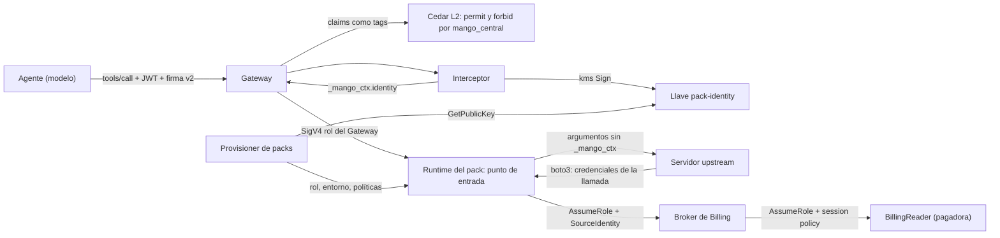

# Identidad en packs de datos de cuentas: modelo de amenazas (v0.1)

> Fecha: 2026-10-01 · Skill: `security-threat-model`. Plan: `docs/specs/marketplace-v1-plan.md` (C2). Decisiones: D10, D13, D33, D35, D36, D37, D43, D44, D49.
> Amplía TM-M3 y TM-M14 de `marketplace-v1-threat-model.md` y TM-B8 y TM-B9 de `mcp-pack-provisioner-threat-model.md`. Cierra el spike S-M1 (aislamiento de credenciales por llamada).
> Alcance: `packages/py/mango-pack-runtime/` (punto de entrada común), `packages/py/mango-core/src/mango_core/pack_identity.py`, `functions/gateway-interceptor/`, `functions/provisioner/src/mango_provisioner/packs/` (`identity.py`, `role.py`, `runtime.py`, `gateway.py`, `release.py`, `steps.py`), `deployment/pack-builder/` (qué entra al zip), `apps/api/src/mango_api/mcp*.py` (qué packs se piden y quién recibe sus tools) e `infra/lib/constructs/tools.ts`, `pack-platform.ts`, `pack-provisioner.ts`.
> Comprobado en local (tests con el SDK real de MCP y la firma real de botocore, sin red) y, el 2026-10-01, en el laboratorio con recursos temporales ya borrados: un Runtime de AgentCore con el punto de entrada común, un broker y un rol de lectura de prueba. El interceptor, la llave de KMS y el trust del broker real no están desplegados: lo que falta ver está en «Supuestos sin validar».
> Actualizado el 2026-10-02 (R6): los Runtimes de packs ya no usan la red `PUBLIC`. Corren en una VPC sin salida a internet y solo alcanzan los endpoints de VPC que declara su manifiesto firmado; el bloqueo de D49 (7) se retiró. Cierra el riesgo residual de red de TM-I6; sigue en pie que el código del pack es de confianza para la atribución. Ver `pack-egress-threat-model.md`. Lo que este documento dice sobre la red `PUBLIC` describe el estado anterior.

## Executive summary

Un pack de datos de cuentas (`central_only`) es **código de terceros** que lee datos de toda la organización. Los riesgos dominantes:

1. **Fuga entre áreas** (TM-M3): el servidor no filtra por área, así que solo un usuario central puede llamarlo, sea cual sea la configuración del agente.
2. **Perder a la persona** (regla 5): si el pack lee con su propio rol, CloudTrail de la cuenta pagadora no dice quién preguntó.
3. **Suplantar a la persona**: que el modelo, otro principal de la cuenta que puede invocar el Runtime (el provisioner de packs) o el propio pack fabriquen la identidad con la que se lee.
4. **Cruzar identidades**: dos llamadas simultáneas de usuarios distintos que terminan firmando con las credenciales de la otra (S-M1).
5. **Entregar al pack una credencial que sirva en otro sitio** (TM-B9): el token del usuario abre `mango-api`.

Controles construidos:

- **Tres capas para «solo centrales»:** Cedar L2 generado (un `permit` con el claim `mango_central` y el mismo límite como `forbid … unless`), el interceptor (no firma para quien no trae el claim) y el punto de entrada del pack (rechaza una llamada sin identidad de un central).
- **Identidad firmada, nunca el token:** el interceptor firma con una llave asimétrica de KMS una aserción de un solo uso (usuario, pack, tool, agente, 60 s). El pack solo tiene la llave pública.
- **El rol del pack no tiene permisos de datos.** Solo puede asumir el broker de la instalación, que exige `SourceIdentity`. Los permisos de datos viven detrás del broker, en la cuenta pagadora, y cada sesión se recorta con una session policy igual a las acciones del manifiesto firmado.
- **Credenciales ligadas a la llamada:** dentro del proceso del pack, la cadena por defecto de credenciales de boto3 resuelve siempre a la sesión asumida para la llamada en curso. Fuera de una llamada con identidad verificada, firmar falla.
- **Trust del broker sin comodines:** nombra el ARN exacto del rol de cada pack `central_only` de la release.

## Scope and assumptions

- **Dentro:** el camino Gateway → interceptor → Runtime del pack → broker → rol de lectura de la pagadora; las políticas Cedar L2 de packs `central_only`; lo que el provisioner da a esos packs (rol, entorno); qué acepta `mango-api` (packs que se pueden pedir, agentes que pueden recibir sus tools); qué mete el build en el zip.
- **Fuera:** el pack de Billing en sí (C3: sus tools, sus argumentos y las acciones que necesita en la pagadora), los roles de cuentas miembro (C4), `per_user_adapter` (C5), tools de escritura (D27), la allowlist de egress (R6) y el pipeline de firma (su propio modelo).
- **Supuestos:**
  1. El Gateway valida el JWT antes de llamar al interceptor y entrega sus claims a Cedar como tags del principal (así funcionan ya las políticas de FinOps con `mango_role`).
  2. El claim `mango_central` lo calcula el pre-token desde el registro de grupos, con doble aprobación para cambiar el tipo de un grupo (D44, TM-M13). Un token ya emitido lo conserva hasta 60 minutos.
  3. El código dentro del proceso del pack (el servidor upstream y sus dependencias) **es parte de la base de confianza para la atribución**: tiene las credenciales del rol del pack y puede asumir el broker con el `SourceIdentity` que quiera. Lo que lo acota es la cadena de suministro (hash, cuarentena, firma, `tools_hash`: modelo del pipeline) y que la sesión solo puede leer las acciones del manifiesto.
  4. Solo el rol del Gateway y el del provisioner de packs pueden invocar el Runtime (test de infra). No hay política basada en recurso en el Runtime.
  5. El Runtime sigue en modo de red `PUBLIC` hasta que exista R6. Decidido el 2026-10-01 (D49): un pack de datos de cuentas en esa red solo se admite en una instalación `lab`. Con `installationType: customer` la síntesis falla si la release trae uno y el provisioner lo rechaza (`egress_allowlist_required`).
  6. La cadena es una sola por instalación: broker de Billing → `Mango-<ns>-BillingReader` en la pagadora. Un pack que lea cuentas miembro necesita otra (C4) y un campo nuevo en el manifiesto.
- **Preguntas abiertas** (cambian prioridades; ver «Supuestos sin validar»):
  1. Resuelta (D49): red `PUBLIC` solo en laboratorio; R6 obligatoria antes de la primera instalación de un cliente, con bloqueo en la síntesis y en el provisioner.
  2. ¿El Gateway entrega al target `mcpServer` los argumentos que el interceptor cambió, sin validarlos contra el esquema de la tool? Con el target Lambda sí.
  3. ¿Hace falta revocar el acceso de un usuario central antes de los 60 minutos del token?

## System model

### Primary components
- **Interceptor del Gateway** (`mango_gateway_interceptor`): ya valida la firma `X-Mango-Invocation` v2 (usuario, agente y tools). Nuevo: para las tools de los targets de `IDENTITY_TARGETS` emite la aserción de identidad con `kms:Sign`.
- **Llave `alias/Mango-<ns>-pack-identity`**: KMS, `ECC_NIST_P256`, `SIGN_VERIFY`. `kms:Sign` solo para el rol del interceptor; `kms:GetPublicKey` para el provisioner de packs.
- **Punto de entrada común** (`mango_pack_runtime`, dentro del zip firmado del pack): verifica la aserción, quita `_mango_ctx`, deja solo las tools del manifiesto y liga las credenciales a la llamada.
- **Rol del pack** `Mango-<ns>-mcp-<id>`: sin acciones de datos; `sts:AssumeRole`, `SetSourceIdentity` y `TagSession` sobre el broker.
- **Broker de Billing** `Mango-<ns>-BillingBroker` y **`Mango-<ns>-BillingReader`** en la pagadora (D10): ya existen para el conector de Cost Explorer.
- **Provisioner de packs**: decide el rol, el entorno y las políticas Cedar desde el manifiesto firmado; lee la llave pública.
- **`mango-api`**: qué packs se pueden pedir y qué agentes pueden llevar sus tools.

### Data flows and trust boundaries
- **Modelo → Gateway:** `tools/call` con argumentos que controla el modelo. JWT del usuario en `Authorization` y firma de `mango-api` en `X-Mango-Invocation`.
- **Gateway → Cedar L2:** decide por tool y por claims del usuario. Para un pack `central_only`: `permit` solo con `mango_central == "true"` y `forbid` para el resto.
- **Gateway → interceptor:** cabeceras y cuerpo. El interceptor borra cualquier `_mango_ctx` del modelo, exige que la tool esté en la firma de la invocación y, para un target de `IDENTITY_TARGETS`, que el token traiga `mango_central`. Entonces firma `{sub, aud: pack, tool, agent, central, exp}`.
- **Interceptor → KMS:** `Sign` de un digest SHA-256 con contexto fijo (`mango-pack-identity.v1.`). Si KMS falla, la llamada se rechaza (503).
- **Gateway → Runtime del pack:** MCP con SigV4 del rol del Gateway. `_mango_ctx` lleva `{"identity": <aserción>}`. Nunca el token.
- **Punto de entrada → tool upstream:** verifica firma, pack, tool, vencimiento (máx. 60 s) y que sea central; entrega los argumentos sin `_mango_ctx`.
- **Pack → STS → broker → pagadora:** dos saltos por llamada. `SourceIdentity` = `sub` del usuario, tags `mango_user`, `mango_agent`, `mango_bu=central`, sesión de 15 minutos, session policy = sentencias del manifiesto firmado.
- **Provisioner → Runtime:** `tools/list` sin identidad (no usa credenciales de AWS). Un `tools/call` suyo se rechaza: no puede firmar una aserción.

#### Diagram

## Assets and security objectives

| Activo | Por qué importa | Objetivo |
|---|---|---|
| Datos de costos de toda la organización | Un líder de área no debe ver los de otra | C |
| Atribución en CloudTrail de la pagadora | Regla 5: quién leyó qué | I |
| Token de acceso del usuario | Abre `mango-api` como ese usuario | C |
| Llave de identidad de packs | Quien firma nombra a cualquier usuario ante un pack | I |
| Rol del pack y trust del broker | Único camino a los datos | I |
| Políticas Cedar L2 del pack | Deciden quién llama | I |
| Disponibilidad de las tools | Una firma por llamada y dos `AssumeRole` | A |

## Attacker model

### Capabilities
- **Usuario de área** con un agente (mal configurado o antiguo) que tiene tools de un pack `central_only`.
- **Modelo o contenido inyectado**: controla los argumentos de `tools/call`, incluido un `_mango_ctx` falso.
- **Pack con un fallo o malicioso**: ejecuta código en el Runtime, con el rol del pack y la red `PUBLIC`.
- **Principal de la cuenta con `InvokeAgentRuntime`** sobre los Runtimes de packs: el provisioner de packs comprometido.
- **Administrador de Mango** que cambia grupos o habilita packs (un solo admin no basta: doble aprobación).

### Non-capabilities
- No puede firmar con la llave de identidad quien no sea el interceptor (política de IAM; la llave privada no sale de KMS).
- Un usuario no llama al Gateway sin la firma de `mango-api` (TM-M12).
- El pack no recibe el token del usuario ni la llave de `X-Mango-Invocation`.
- El provisioner de packs no puede asumir el broker (sin `sts:*`) ni cambiar su trust.

## Entry points and attack surfaces

| Superficie | Cómo se llega | Frontera | Notas | Evidencia |
|---|---|---|---|---|
| Argumento `_mango_ctx` de un `tools/call` | Modelo | Modelo → interceptor | Se borra siempre; solo el interceptor lo pone | `handler.py` `handle` |
| Claim `mango_central` del token | Token validado por el Gateway | Gateway → interceptor y Cedar | Comparación exacta con `"true"` | `handler.py` `_context`, `gateway.py` `policy_statements` |
| Aserción de identidad | Interceptor → Runtime | Gateway → pack | Firma ECDSA P-256, contexto fijo, 60 s | `pack_identity.py`, `identity.py` |
| `MCPServer.call_tool` del pack | Cualquier invocación del Runtime | Runtime → upstream | Envuelto por la guardia | `server.py` `bind` |
| Cadena de credenciales de boto3 | Código upstream | Proceso del pack | Reemplazada; sin llamada no hay credenciales | `credentials.py` `install` |
| `pack.json` del zip | Build | Pipeline → Runtime | Dentro del zip firmado | `build.py` `pack_json` |
| Entorno del Runtime | Provisioner | Stack → pack | Lista cerrada; ARN del broker, región y llave pública | `runtime.py` `runtime_environment` |
| Trust del broker | CDK | Stack | ARNs exactos de los packs `central_only` de la release | `tools.ts` |
| `POST /api/mcp/{pack}/enablements`, `…/update` | Admin | Admin → `mango-api` | Doble aprobación; una actualización no cambia el modo de identidad | `mcp.py` `_check_request` |
| Envío de un agente a revisión | Creador | Creador → `mango-api` | Tools `central_only` solo con grupos centrales | `agent_rules.py` `_access` |

## Top abuse paths

1. **Líder de área usa un agente con tools de Billing.** El agente llama `aws-billing___cost_explorer` → Cedar L2 `forbid` → denegado. Si alguien añadiera un `permit` más amplio al motor, el `forbid` gana. Si L2 fallara, el interceptor no firma (403). Si el interceptor fallara, el pack rechaza la llamada sin aserción.
2. **El modelo inventa la identidad.** Pone `_mango_ctx: {"identity": …}` en los argumentos → el interceptor lo borra y pone la suya, o no pone nada si el target no es de identidad → el pack verifica la firma.
3. **El provisioner de packs comprometido lee costos.** Tiene `InvokeAgentRuntime` → llama `tools/call` directo al Runtime con un `sub` de su elección → no puede firmar (`kms:Sign` solo el interceptor) → el pack rechaza. `tools/list` sí responde.
4. **Reutilizar una aserción.** Capturada de una llamada, se reenvía con otros argumentos → vale 60 s, solo para ese pack, esa tool y ese usuario, y solo por quien pueda invocar el Runtime. Riesgo residual aceptado (TM-I3).
5. **Dos usuarios a la vez.** Las llamadas A y B corren en el mismo proceso → cada una tiene su sesión en un `ContextVar`; un cliente de boto3 en caché firma con la sesión de la llamada en curso, no con la que lo creó.
6. **El servidor upstream crea un cliente al importarse o en un hilo propio.** Sin llamada en curso → `NoCallerError`. Nunca usa el rol del pack, que de todos modos no tiene permisos de datos.
7. **El pack usa el token contra `mango-api`.** No lo recibe: la aserción no es un JWT de Cognito ni sirve fuera de ese pack.
8. **Pack malicioso exfiltra.** Con red `PUBLIC` puede enviar a internet lo que lea en llamadas legítimas, y asumir el broker por su cuenta con un `SourceIdentity` inventado. Lo limita: solo acciones de lectura del manifiesto, sesiones de 15 minutos, y la cadena de suministro. **Riesgo residual principal** (TM-I6).
9. **Una actualización convierte un pack público en uno de datos de cuentas** bajo agentes de grupos de área → `mango-api` rechaza la solicitud (`identity_mode_changed`); si aun así llegara al provisioner, borra las políticas antes de mover `live` y escribe las de centrales.

## Threat model table

| ID | Origen | Requisitos | Acción | Impacto | Activos | Controles existentes (evidencia) | Brechas | Mitigaciones recomendadas | Detección | Prob. | Impacto | Prioridad |
|---|---|---|---|---|---|---|---|---|---|---|---|---|
| TM-I1 | Usuario de área | Agente con tools de un pack `central_only` | Pedir costos de toda la organización | Fuga entre áreas | Datos | Cedar L2 `permit` + `forbid … unless` por `mango_central` (`gateway.py`, test `test_no_other_policy_can_open_account_data_to_area_users`); el interceptor no firma sin el claim (`test_account_data_pack_is_refused_to_users_who_are_not_central`); el pack exige `central` (`guard.py`); reglas de envío (`agent_rules.py`) | Token vigente hasta 60 min tras dejar de ser central | Sesiones más cortas o revocación para grupos centrales, si se pide | Métrica de rechazos `account_data_for_non_central_user` del interceptor; denegaciones L2 | medium | high | **medium** |
| TM-I2 | Modelo o inyección | Controla argumentos | Poner `_mango_ctx` propio | Suplantar a otro usuario | Atribución, datos | El interceptor borra `_mango_ctx` de toda llamada; el pack verifica la firma (`identity.py`); el esquema upstream no cambia | — | — | Log `pack.call` con `outcome: rejected` | low | high | **low** |
| TM-I3 | Provisioner de packs comprometido u otro principal con `InvokeAgentRuntime` | Permiso sobre el Runtime | Llamar tools sin pasar por el Gateway, con identidad inventada o una aserción capturada | Lectura fuera de L2 y del interceptor | Datos, atribución | Sin aserción firmada no hay llamada; `kms:Sign` solo para el interceptor (test de infra); aserción ligada a pack y tool, 60 s | La aserción no liga los argumentos; no hay política de recurso en el Runtime | Ligar un hash de los argumentos si el Gateway los entrega sin reescribir (verificar en C3); política de recurso en el Runtime cuando AgentCore la soporte | CloudTrail: `InvokeAgentRuntime` de un principal que no es el Gateway | low | high | **low** |
| TM-I4 | Dos usuarios centrales | Llamadas simultáneas | Ninguna: fallo del adaptador | Un usuario lee con la sesión del otro; CloudTrail atribuye mal | Atribución | Credenciales resueltas al firmar desde un `ContextVar` por llamada; una sesión por llamada, sin caché entre llamadas (`credentials.py`); tests con el SDK real de MCP y firma real de botocore, 48 y 60 llamadas concurrentes (`test_server.py`, `test_credentials.py`) | Un servidor que ejecute tools con `loop.run_in_executor` sin copiar el contexto fallaría (cerrado: `NoCallerError`) | Repetir el test de aislamiento con cada servidor nuevo. Hecho para Billing en C3, con la librería `fastmcp` real (`test_fastmcp_server.py`) | Errores `NoCallerError` en los logs del Runtime | low | medium | **low** |
| TM-I5 | Pack | Recibir una credencial reutilizable | Usarla contra `mango-api` o los conectores | Suplantación del usuario | Token | El pack recibe una aserción, nunca el token (`test_account_data_pack_gets_a_signed_caller_and_never_the_token`); solo tiene la llave pública; `aud` = pack | — | — | — | low | high | **low** |
| TM-I6 | Pack malicioso o vulnerable | Código en el Runtime | Asumir el broker con un `SourceIdentity` inventado; enviar datos a internet | Lectura de costos de la organización sin persona real; exfiltración | Datos, atribución | Paquete fijado por hash, cuarentena, firma y `tools_hash` (pipeline); session policy = acciones de lectura del manifiesto; el rol detrás del broker es de solo lectura; sesiones de 15 min; el build solo copia `mango_pack_runtime` y `mango_aws` al zip | Red `PUBLIC` sin allowlist (R6), admitida solo en instalaciones `lab` (D49): fuera de ellas la síntesis y el provisioner rechazan el pack (`assertEgressForAccountData`, `check_manifest`; tests); el broker no puede distinguir una llamada legítima de una del propio pack | **Construir R6 y retirar el bloqueo en la misma PR.** Alarma: sesiones del broker desde un rol de pack sin un `pack.call` correlacionado | CloudTrail de la pagadora por `SourceIdentity`; logs `pack.call` | low | high | **medium** |
| TM-I7 | Provisioner de packs comprometido | Su rol | Dar el permiso del broker al rol de un pack público | Un pack público lee datos de cuentas | Datos | El trust del broker nombra solo los roles de los packs `central_only` de la release (test de infra); el provisioner no puede cambiar el trust ni asumir el broker | — | — | Reconciliación: rol de pack con `AssumeBroker` cuyo puntero no es `central_only` (A11) | low | high | **low** |
| TM-I8 | Release o admin | Actualización que cambia el modo de identidad | Convertir un pack público en uno de datos de cuentas bajo agentes existentes | Agentes de grupos de área con tools de datos de cuentas | Datos | `mango-api` rechaza (`identity_mode_changed`); el provisioner borra las políticas antes de mover `live` (test `test_update_from_public_to_account_data…`); L2 de centrales | — | — | Auditoría de la solicitud | low | medium | **low** |
| TM-I9 | KMS o STS caídos, o ráfaga de llamadas | — | — | Las tools de datos de cuentas dejan de responder | Disponibilidad | Falla cerrado: 503 del interceptor; error de la tool en el pack. Timeouts cortos | Tres llamadas a AWS por tool (`Sign` y dos `AssumeRole`) | Medir la latencia añadida en C3 | Métrica de `pack_identity_unavailable` | medium | low | **low** |
| TM-I10 | Operador | Rotar o recrear la llave de identidad | Los packs instalados guardan la llave pública anterior | Todas las llamadas rechazadas hasta reinstalar | Disponibilidad | La llave no rota sola (asimétrica); el entorno del Runtime lleva la llave pública y su huella | No hay paso automático que actualice los packs tras cambiar la llave | Runbook: tras cambiar la llave, reintentar la habilitación de cada pack `central_only` | Rechazos masivos en `pack.call` | low | medium | **low** |

## Criticality calibration

- **High:** nada con los controles construidos.
- **Medium:** fuga entre áreas por token vigente (TM-I1) y pack malicioso con red `PUBLIC` (TM-I6).
- **Low:** el resto.
- Lo que más pesa en la calibración: el supuesto 3 (el código del pack es de confianza para la atribución) y la pregunta abierta 1 (R6).

## Focus paths for security review

| Ruta | Qué mirar | Amenazas |
|---|---|---|
| `functions/gateway-interceptor/src/mango_gateway_interceptor/handler.py` | Cuándo se firma, con qué claims y que nunca viaje el token | TM-I1, TM-I2, TM-I5 |
| `packages/py/mango-core/src/mango_core/pack_identity.py` y `packages/py/mango-pack-runtime/src/mango_pack_runtime/identity.py` | Que las dos mitades del formato coincidan; nada se interpreta antes de verificar | TM-I2, TM-I3 |
| `packages/py/mango-pack-runtime/src/mango_pack_runtime/credentials.py` | El parche de la cadena de credenciales y el `ContextVar` | TM-I4 |
| `packages/py/mango-pack-runtime/src/mango_pack_runtime/guard.py`, `server.py` | Orden: tool permitida, identidad, central, credenciales; instalar antes de importar el servidor | TM-I1, TM-I4 |
| `functions/provisioner/src/mango_provisioner/packs/role.py`, `release.py`, `gateway.py` | El rol sin acciones de datos; la lista de acciones del broker; el `forbid` | TM-I1, TM-I7 |
| `infra/lib/constructs/tools.ts` | Trust del broker, llave de identidad y quién firma | TM-I3, TM-I7 |
| `deployment/pack-builder/src/mango_pack_builder/build.py` | Qué código de Mango entra al zip firmado | TM-I6 |

## Supuestos sin validar con el usuario

La skill pide validar los supuestos antes de cerrar el modelo. Este encargo se ejecutó sin pausas, así que quedan como preguntas:

1. **Red `PUBLIC` en packs de datos de cuentas** (supuesto 5). Validado el 2026-10-01 (D49): solo en laboratorio, con bloqueo para instalaciones de cliente hasta que exista R6.
2. **El provisioner de packs puede invocar los Runtimes** (supuesto 4). Con la aserción firmada ya no puede llamar tools de datos de cuentas; sigue pudiendo listar tools.
3. **El código del pack es de confianza para la atribución** (supuesto 3). No hay forma de que el broker distinga una llamada legítima de una fabricada por el propio pack.
4. **Comprobado en C3 (laboratorio, 2026-10-01):** el interceptor firma con la llave real de KMS y añade `_mango_ctx`. El Gateway **valida después** los argumentos contra el esquema que listó el target `mcpServer`: con un esquema cerrado (`additionalProperties: false`) rechaza la llamada; con uno abierto la reenvía. Por eso un pack de datos de cuentas lista esquemas abiertos (`mango_pack_runtime.fastmcp_server.open_schemas`) y el build lo exige (`mango_packs.tools.check_tools`). El canal de la aserción no cambia.

## Comprobado en el laboratorio (2026-10-01)

Recursos temporales en la cuenta del laboratorio, creados y borrados por SDK: un bucket, tres roles (`Mango-c2tmp-mcp-c2tmp-probe`, `Mango-c2tmp-Broker`, `Mango-c2tmp-Reader`) y un Runtime con el servidor de Pricing servido por el punto de entrada común en modo `central_only`. Las aserciones se firmaron con una llave de prueba local; el Runtime se invocó directo, sin Gateway.

- El Runtime arranca desde el zip con `mango_pack_runtime` y `mango_aws` dentro, lista solo las tools del manifiesto y tiene salida a STS.
- Sin aserción, con una firmada por otra llave, para otro pack, para otra tool o de un usuario no central: la llamada se rechaza y **no hay ningún `AssumeRole`** en CloudTrail.
- Ocho llamadas simultáneas de dos usuarios: todas devuelven datos. CloudTrail muestra cuatro `AssumeRole` por usuario en cada salto, con `sourceIdentity` = usuario, los tags `mango_user`, `mango_agent` y `mango_bu`, y session policy en el segundo salto. Ninguna con la identidad del otro.
- Cada llamada tardó entre 4,6 y 6,2 s, lo mismo que Pricing sin identidad en B2: los dos saltos de STS no cambian la latencia de forma visible.
- Los eventos de lectura de la API de precios no aparecen en CloudTrail (no son eventos de administración); la atribución se ve en los `AssumeRole`. Con Cost Explorer (C3) se verá también en la llamada de datos.
