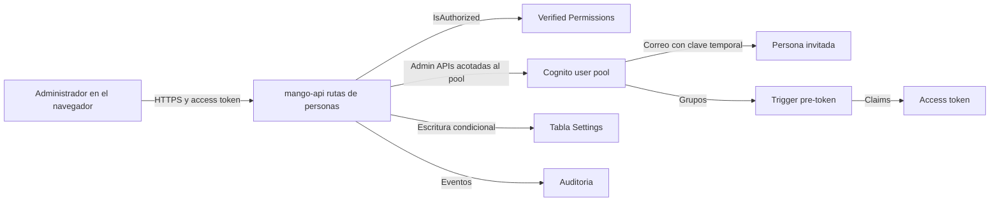

# Gestión de personas (Ajustes › Personas): modelo de amenazas (v0.4)

> Fecha: 2026-10-03 · Skill: `security-threat-model`. Decisiones que lo enmarcan: D14 (claims desde grupos de Cognito), D20 (login propio y restablecer MFA), D26 (grupos con doble aprobación), D28 (doble aprobación de 72 h), D58 (instalación como cliente). Amplía TM-L6 y TM-L14 de `login-threat-model.md` y TM-M24 de `marketplace-v1-threat-model.md`.
> Alcance: el backend nuevo de `apps/api/src/mango_api/people.py` (rutas `/api/admin/people*` y `/api/admin/installation`), sus permisos sobre el user pool (`infra/lib/constructs/identity.ts`), las acciones de Cedar nuevas (`policies/cedar/platform/people.cedar`) y la pantalla `apps/web/src/pages/settingsPeople/`. Diseño de referencia: `docs/design/mango-hub/src/people.jsx`.
> v0.1 se escribió **antes** de construir; v0.2 recoge las decisiones del usuario del 2026-10-03 (D60) y lo construido. v0.3 (2026-10-03, D61) recoge la primera comprobación en una instalación: las invitaciones aceptan cualquier dominio no público, las invitaciones rechazadas se auditan y `mango-api` suma `AdminSetUserMFAPreference` para saber quién tiene MFA. v0.4 (2026-10-03, D62) recoge la prueba en un navegador real: la lista de proveedores públicos pasa a ser una sola, con variantes por país y correos desechables (TM-P19), el rechazo por correo público lo decide y audita siempre el servidor, y las lecturas del directorio se ocultan en Auditoría junto con las demás lecturas (TM-P20).

## Executive summary

Hasta hoy `mango-api` no podía cambiar quién pertenece a un grupo: los miembros se asignaban en la consola de AWS. La pantalla nueva le da a la aplicación, y por tanto a un administrador de Mango, la capacidad de **decidir quién es administrador y quién ve los datos de toda la organización**. Es el cambio de privilegio más grande desde el login propio. Los tres riesgos que mandan:

1. **Escalada a administrador o a datos centrales** por una sola persona (un administrador malicioso, o una sesión de administrador robada). Control: doble aprobación para los grupos sensibles, nadie decide sobre sí mismo, y la invariante de dos administradores.
2. **El rol de `mango-api` pasa a poder agregar a cualquiera a cualquier grupo del pool.** Cognito no permite acotar `AdminAddUserToGroup` a un nombre de grupo: la regla vive en el código. Un fallo de autorización o de validación en estas rutas vale tanto como ser administrador.
3. **El directorio completo se vuelve visible para los administradores** (correos, estado, grupos). Es una excepción nueva a «sin revelar si un usuario existe», que hoy solo cubre búsquedas por correo exacto.

Además hay un caso de arranque delicado: con un solo administrador nadie puede aprobar, y el diseño propone que nombrar al segundo se aplique sin segundo aprobador.

## Scope and assumptions

- **Dentro:** listar el directorio (búsqueda por prefijo, filtros, paginación), agregar y quitar grupos a una persona, cambios con doble aprobación (`member`), invitar, deshabilitar y rehabilitar, estado de primer día, datos de la instalación (solo lectura), y la reubicación de restablecer MFA (sin cambios de backend).
- **Fuera:** crear y eliminar grupos (D26, ya modelado en `marketplace-v1-threat-model.md`); el restablecimiento de MFA en sí (TM-L14); el login y el registro (sin cambios); federación con un IdP (no hay ninguno configurado).
- **Supuestos:**
  1. El atacante relevante es **un administrador de Mango malicioso o con la sesión robada** (XSS, equipo desatendido, token robado) y, en segundo lugar, un usuario sin privilegios que intenta llegar a estas rutas.
  2. Quien tiene acceso de administrador de IAM a la cuenta de AWS ya puede todo sobre el user pool: está fuera del modelo.
  3. El access token dura como máximo 60 minutos y sus claims (`cognito:groups`, `mango_admin`, `mango_central`) no cambian hasta que se renueva (D14). Quitar un grupo no tiene efecto inmediato sobre un token ya emitido.
  4. `PreSignUp_AdminCreateUser` no valida el dominio (`functions/pre-sign-up`): lo que invite `mango-api` solo lo valida `mango-api`.
  6. Con MFA obligatorio en el pool (toda instalación de cliente), la preferencia de MFA de un usuario no decide si se le pide el TOTP: Cognito lo pide siempre que haya uno registrado (comprobado en el laboratorio el 2026-09-30 y el 2026-10-03).
  5. Una instalación de cliente tiene decenas o cientos de personas, no decenas de miles.
- **Decisiones del usuario (2026-10-03, registradas en D60):**
  1. **Doble aprobación tal cual el diseño:** `mango-admin`, `finops-central` y deshabilitar a un administrador. Los grupos propios de tipo `central` se asignan al momento: **riesgo aceptado** (TM-P2).
  2. **Arranque aceptado:** el único administrador nombra al segundo sin aprobador, marcado en auditoría (TM-P3).
  3. **Listar el directorio a administradores es una excepción registrada** en `AGENTS.md` (TM-P6).
  4. **«Persona registrada» queda pendiente** (TM-P12).
  5. **Rehabilitar a quien tiene un grupo sensible exige doble aprobación** (TM-P16; diferencia con el diseño).
  6. **Las invitaciones aceptan cualquier dominio que no sea de un proveedor de correo público** (D61): un administrador puede traer a alguien de fuera de la empresa. El registro abierto sigue limitado a `SignUpDomains`. **Riesgo aceptado** con los controles de TM-P17. Qué es «público» lo dice una lista cerrada (D62, TM-P19).

## System model

### Primary components

| Componente | Qué hace | Evidencia |
|---|---|---|
| `people_router` (nuevo) | Rutas `/api/admin/people*`; cada una declara su acción de Cedar y vuelve a comprobar `is_admin` | `apps/api/src/mango_api/people.py` (`people_router`) |
| `CognitoPeople` (nuevo) | Las operaciones sobre usuarios del pool: listar, leer, grupos de un usuario, agregar y quitar de un grupo, crear (invitar), deshabilitar, rehabilitar, cerrar sesiones | `apps/api/src/mango_api/people.py` |
| `MemberChangeStore` (nuevo) | Cambios con doble aprobación en la tabla Settings (`MEMBER_CHANGE`, `MEMBER_LOCK`) | `apps/api/src/mango_api/people.py` |
| Registro de grupos | Qué grupos existen y su tipo (`central`, `area`, `general`) | `apps/api/src/mango_api/groups.py`, `packages/py/mango-core/src/mango_core/groups.py` |
| Trigger pre-token | Convierte grupos en claims en cada token | `functions/pre-token/src/mango_pre_token/handler.py` |
| Trigger pre-sign-up | Dominio del correo en el registro propio; no valida `AdminCreateUser` | `functions/pre-sign-up/src/mango_pre_sign_up/handler.py` |
| Verified Permissions | Decisión L1 por acción | `policies/cedar/platform/*.cedar`, `apps/api/src/mango_api/authz.py` |
| Auditoría | Registro inmutable de cada decisión y cambio | `apps/api/src/mango_api/audit.py` |
| Pantalla Personas | Lista, panel de la persona, invitar, primer día | `apps/web/src/pages/settingsPeople/` |

### Data flows and trust boundaries

- **Navegador → `mango-api`.** Cruzan correos, identificadores de usuario (`sub`), nombres de grupo, motivos y un cursor de paginación. Canal: HTTPS con access token verificado (bearer, sin cookies: no aplica CSRF). Validación por esquema estricto; autorización Cedar + `is_admin`; límites de tasa por administrador.
- **`mango-api` → Cognito (user pool).** Cruzan nombres de usuario, filtros de `ListUsers`, nombres de grupo y el correo de la invitación. Canal: SigV4 con el rol de la tarea, permisos acotados al ARN del pool. **Cognito no acota por grupo ni por usuario:** el rol puede tocar a cualquiera.
- **`mango-api` → tabla Settings.** Cambios pendientes y bloqueos, con escrituras condicionales (bloqueo optimista).
- **Cognito → correo de la persona invitada.** Contraseña temporal enviada por Cognito. `mango-api` nunca la ve.
- **Cognito → trigger pre-token → access token.** Los grupos se vuelven claims en la siguiente emisión del token.

#### Diagram

## Assets and security objectives

| Activo | Objetivo |
|---|---|
| Pertenencia a `mango-admin` | Integridad: nadie llega a administrador por decisión de una sola persona (salvo la excepción de arranque, si se acepta) |
| Pertenencia a `finops-central` y a grupos de tipo `central` | Integridad: dan acceso a datos de toda la organización (`mango_central`, D35) |
| Existencia de al menos dos administradores | Disponibilidad: sin dos, ninguna doble aprobación se puede cerrar |
| Directorio (correos, estado, grupos) | Confidencialidad: solo administradores; sin enumeración por otros |
| Cuentas de las personas | Integridad y disponibilidad: no se deshabilitan ni se crean sin rastro |
| Auditoría | Integridad: cada cambio con quién lo pidió y quién lo aprobó |
| Datos de la instalación (organización, cuenta de gestión, correos) | Confidencialidad: no públicos |

## Attacker model

### Capabilities

- Administrador de Mango malicioso, o atacante con su sesión (token válido hasta 60 minutos).
- Dos administradores coludidos (residual: ningún control de la aplicación lo evita).
- Usuario autenticado sin privilegios que llama a las rutas directamente.
- Persona invitada que controla el buzón al que llega la contraseña temporal.

### Non-capabilities

- No controla IAM de la cuenta ni el rol de `mango-api`.
- No puede falsificar un access token ni sus claims.
- No lee la contraseña temporal de otra persona (va por correo desde Cognito).

## Entry points and attack surfaces

| Ruta (todas exigen administrador) | Acción de Cedar | Efecto |
|---|---|---|
| `POST /api/admin/people/search` | `ViewPeople` | Lista del directorio: correo, estado, MFA, grupos, alta. Para saber el MFA de quien Cognito no lo lista, fija la preferencia de TOTP de esa persona (TM-P18) |
| `POST /api/admin/people/{user_id}/groups` | `ManagePeople` | Agrega a un grupo, o crea un cambio pendiente si el grupo es sensible |
| `POST /api/admin/people/{user_id}/groups/remove` | `ManagePeople` | Quita de un grupo, o crea un cambio pendiente |
| `POST /api/admin/people/invitations` | `ManagePeople` | `AdminCreateUser` + grupos no sensibles, a cualquier dominio no público |
| `POST /api/admin/people/{user_id}/disable` · `/enable` | `ManagePeople` | Deshabilita (o propone, si es administrador) y cierra sesiones; rehabilita (o propone, si tiene un grupo sensible) |
| `GET /api/admin/people/changes` | `ViewPeople` | Cambios con doble aprobación |
| `POST /api/admin/people/changes/{id}/approve` · `/reject` | `ApprovePeopleChange` | Decide un cambio de otro administrador |
| `POST /api/admin/people/changes/{id}/withdraw` | `ManagePeople` | Retira el propio |
| `GET /api/admin/installation` | `ViewAdmin` | Versión y datos de la instalación |

## Top abuse paths

1. **Administrador único de facto.** Un administrador se agrega a sí mismo (o a un cómplice recién invitado) a `mango-admin` o `finops-central` → controla la plataforma o ve los costos de toda la organización.
2. **Quedarse solo para usar el arranque.** Un administrador deshabilita o le quita el grupo al otro, queda como único administrador y nombra a quien quiera sin segundo aprobador.
3. **Escalada lateral por un grupo «no sensible».** Agregarse a un grupo propio de tipo `central` da el claim `mango_central` igual que `finops-central`, sin aprobación.
4. **Invitación como puerta trasera.** Invitar un correo que el atacante controla, ya con grupos, salta el registro (y su verificación de dominio). Desde D61 basta un dominio propio cualquiera: un administrador malicioso, o quien robó su sesión, crea una cuenta que controla y le da grupos de acceso; para `mango-admin` o `finops-central` sigue necesitando a otro administrador.
5. **Bloqueo.** Deshabilitar a los demás administradores, o a muchas personas, deja la instalación sin gobierno o sin servicio.
6. **Aprobación obsoleta.** Un cambio aprobado días después se aplica sobre un estado distinto: el grupo cambió de tipo, la persona fue deshabilitada o solo queda un administrador.
7. **Enumeración.** Recorrer la lista o el buscador por prefijo para sacar todos los correos de la empresa.

## Threat model table

| ID | Amenaza | Activo | Controles a construir | Prob. | Impacto | Prioridad |
|---|---|---|---|---|---|---|
| TM-P1 | Un administrador se da a sí mismo o a otro `mango-admin` o `finops-central` | Administración, datos centrales | Doble aprobación (otro administrador, 72 h); **el servidor decide qué grupos son sensibles**, no el cliente; nadie aprueba un cambio sobre su propia cuenta ni se quita él solo un grupo sensible (pedirlo para sí mismo es una propuesta que aprueba otro: con dos administradores no hay un tercero); motivo obligatorio; auditoría fail-closed con quién pidió y quién aprobó; al aplicar se vuelve a validar todo | Media | Alto | **Alta** |
| TM-P2 | Escalada por grupos no sensibles: grupo propio de tipo `central` (mismo alcance que `finops-central`), `mango-agent-creator`, `bu-lead` + `bu-<área>` | Datos centrales y de área | Se aplican sin aprobación, como el diseño (**decisión del usuario; riesgo aceptado**). Controles que quedan: auditoría de cada cambio con quién lo hizo; crear un grupo `central` o cambiarle el tipo sí exige doble aprobación (D26); `mango-agent-creator` tiene control compensatorio (publicar exige aprobación de otra persona). Recomendación que sigue en pie: tratar como sensible todo grupo de tipo `central` | Media | Alto (central) / Medio | **Media** (aceptado) |
| TM-P3 | Arranque: con un solo administrador, nombrar al segundo sin aprobador; o forzar ese estado (ruta 2) | Administración | La invariante «no menos de dos administradores habilitados» impide llegar a uno desde la aplicación (quitar `mango-admin` o deshabilitar a un administrador se rechaza si quedaría uno). La excepción solo aplica si el recuento **en el servidor**, en el momento de aplicar, es exactamente uno; el evento lleva `bootstrap: true`. Además exige que **quien llama sea ese único administrador** según el directorio (no según su token) y un reclamo breve en la tabla Settings para que dos arranques simultáneos no se apliquen ambos. **Aceptado por el usuario** | Baja | Alto | **Media** |
| TM-P4 | Usuario sin privilegios llama a las rutas (IDOR sobre `user_id`, o falta de autorización en una ruta) | Todo | Cada ruta declara su dependencia (Cedar + `is_admin`); deny por defecto; test que recorre todas las rutas del router sin ser administrador; `user_id` validado como UUID y resuelto contra el pool, nunca usado como filtro sin validar | Baja | Alto | **Alta** (control obligatorio) |
| TM-P5 | Inyección en el filtro de `ListUsers` (`email ^= "…"`) o en el cursor | Directorio | Prefijo con patrón estricto (sin comillas, barras invertidas ni espacios), longitud máxima; cursor opaco con longitud y alfabeto acotados; nombre de grupo validado contra el registro y los cuatro de sistema, nunca pasado tal cual | Baja | Medio | Media |
| TM-P6 | Enumeración del directorio por un administrador o por su sesión robada | Directorio | **Excepción nueva** a «sin revelar si un usuario existe», solo para administradores (como restablecer MFA): se registra en `AGENTS.md`. Límite de tasa por administrador en lecturas; auditoría de cada lectura con cuántas filas, **nunca** los correos ni el prefijo buscado; página máxima de 20; sin exportar | Media | Medio | Media |
| TM-P7 | Invitación abusiva: bombardeo de correos, correo mal formado o de un proveedor público, o cuenta con grupos sensibles desde el alta | Cuentas, reputación del remitente | `mango-api` aplica las reglas de forma del registro (solo ASCII, un `@`, dominio bien formado) y rechaza siempre los proveedores públicos; límite por administrador (20 por hora); los grupos sensibles no se aceptan en la invitación (salvo el arranque); la contraseña temporal caduca según el pool; MFA se configura en el primer ingreso. **Cada invitación rechazada queda en auditoría** con su código; si el correo no pasó la validación se registra solo el dominio, nunca lo escrito | Media | Medio | Media |
| TM-P17 | Persona de fuera de la empresa invitada por un administrador (D61): una cuenta en un dominio que la empresa no controla, que puede recibir grupos de acceso (áreas, `mango-agent-creator`, grupos `central` propios, TM-P2) por decisión de una sola persona | Datos de área y centrales, cuentas | **Decisión del usuario; riesgo aceptado.** Controles: solo administradores, con `_require_current_admin` y límite de tasa; el evento `directory.invite` lleva `external_domain: true` (pedido, aplicado o rechazado) para poder filtrarlo; la persona aparece en Personas con su correo completo, a la vista de todos los administradores; `mango-admin` y `finops-central` nunca viajan en la invitación y después exigen doble aprobación; sin grupos no ve nada; MFA obligatorio; se deshabilita desde Personas. En el arranque (un solo administrador) puede nombrar segundo administrador a alguien externo: es el mismo riesgo ya aceptado en TM-P3, y el evento lleva `bootstrap` y `external_domain`. El registro abierto no cambia: nadie de otro dominio entra sin que un administrador lo invite. Residual: quien pierde el control de su dominio o deja la otra empresa conserva la cuenta hasta que se la deshabilite. **Recomendado (no se construye ahora):** insignia «externa» en la lista y revisión periódica de cuentas externas | Media | Medio (alto si recibe un grupo `central` propio, TM-P2) | **Media** (aceptado) |
| TM-P8 | Bloqueo: deshabilitar a otros administradores o a muchas personas; deshabilitarse a sí mismo | Disponibilidad | Nadie se deshabilita a sí mismo; deshabilitar a un administrador exige doble aprobación y respeta la invariante; límite de tasa; todo es reversible (rehabilitar) y queda en auditoría | Baja | Medio | Media |
| TM-P9 | Aprobación obsoleta o carrera entre dos aprobaciones | Integridad | Reclamo condicional (`pending → applying`) antes de tocar Cognito; los cambios que tocan quién es administrador se aplican de uno en uno (`MEMBER_LOCK`/`admins`) y el recuento se vuelve a leer con el reclamo tomado; al aplicar se vuelve a comprobar que la persona existe y está habilitada, que el grupo existe y sigue siendo asignable, y la invariante de administradores; un solo cambio abierto por persona y grupo; vence a las 72 h | Baja | Medio | Media |
| TM-P10 | El privilegio quitado sigue vivo en el token ya emitido (hasta 60 min) | Administración, datos | Al deshabilitar y al quitar un grupo sensible se revocan los refresh tokens (`AdminUserGlobalSignOut`). El access token vigente no se puede revocar, así que **las rutas que cambian personas comprueban en el directorio que quien llama sigue siendo un administrador habilitado** (`_require_current_admin`): un administrador recién retirado no puede aprobar, invitar ni cambiar grupos con su token viejo. Residual: hasta 60 minutos en el resto de la aplicación | Media | Medio | Media |
| TM-P11 | Rol de `mango-api` más poderoso: `AdminAddUserToGroup`, `AdminCreateUser`, `AdminDisableUser` sobre todo el pool | Todo | Solo las acciones necesarias y solo el ARN del pool; `mango-api` rechaza grupos que no estén en el registro o no sean de sistema (los grupos que Cognito crea para un IdP nunca son asignables); CloudTrail registra cada llamada. **Recomendado (no se construye ahora):** alarma sobre `AdminAddUserToGroup` a `mango-admin` en CloudTrail | Baja | Alto | Media |
| TM-P12 | Altas sin rastro: una persona se registra y nadie lo ve | Auditoría | La lista muestra «Sin acceso» primero. El evento `directory.signup` del diseño exige un trigger *post confirmation* nuevo que escriba en auditoría. **Pendiente por decisión del usuario** | Baja | Bajo | Baja |
| TM-P13 | Datos de la instalación expuestos (organización, cuenta de gestión, correos) | Confidencialidad | Se sirven por `GET /api/admin/installation` (solo administradores), **no** en el `config.json` público de la SPA | Baja | Bajo | Baja |
| TM-P14 | Contenido del directorio pintado como HTML (correo o descripción de grupo maliciosos) | Sesión del administrador | React como texto, sin `dangerouslySetInnerHTML`; respuestas validadas con `zod`; CSP vigente | Baja | Alto | Media |
| TM-P16 | Un administrador rehabilita él solo a un administrador (o central) deshabilitado: le devuelve un privilegio que quitar exigió dos personas | Administración, datos centrales | Rehabilitar a quien pertenece a `mango-admin` o `finops-central` es un cambio con doble aprobación (`kind: enable`), con motivo. El resto se rehabilita al momento. **Decisión del usuario; difiere del diseño** | Baja | Alto | Media |
| TM-P18 | `mango-api` puede fijar la preferencia de MFA de cualquier usuario del pool (`AdminSetUserMFAPreference`), y lo hace dentro de una lectura (`ViewPeople`) | MFA de las cuentas, integridad del directorio | La acción solo se usa para **activar** TOTP cuando `AdminGetUser` no lista ninguno: Cognito la rechaza si la persona no tiene un TOTP verificado, así que no crea un factor ni cambia cómo entra nadie. El código nunca envía `Enabled: false`. Con MFA obligatorio, una preferencia desactivada no apaga el reto (supuesto 6), y el rol ya podía borrar un TOTP (`AdminDeleteSoftwareToken`, D20): la acción no añade poder real. Recurso: solo el ARN del pool. La escritura es idempotente y no depende de datos del cliente (el nombre de usuario sale de `ListUsers`). Residual: en una instalación con MFA opcional (solo pruebas) el rol comprometido podría desactivar la preferencia de alguien | Baja | Bajo | Baja |
| TM-P19 | La regla «no proveedores de correo público» depende de una **lista cerrada** (D62): un proveedor que nadie listó, uno nuevo o un dominio propio de una persona (`ana@apellido.dev`) pasa como si fuera de una empresa | Cuentas, datos de área | Una sola lista para el registro y las invitaciones (`mango_core.mail_domains`, datos en `public_mail_domains.json`; también la lee el esquema de infra): familias de proveedores con sus variantes por país (`<marca>.<tld>` y `<marca>.<com\|co\|net\|org…>.<país>`), dominios exactos (proveedores, buzones de operadoras, correos desechables y relevos de alias) y sus subdominios. La decide el servidor: la pantalla no guarda copia y cada rechazo queda auditado con el dominio. Tests de las variantes en los tres consumidores. **Residual:** la lista no puede ser completa (hay miles de dominios desechables y cualquiera registra un dominio propio por pocos dólares), así que la regla baja la probabilidad de dar acceso a una cuenta personal por descuido; **no** prueba que el correo sea de una empresa ni frena a un administrador decidido. Lo que sí acota el daño no cambia: solo invita un administrador, el evento lleva `external_domain`, la persona se ve en Personas, sin grupos no ve nada y los grupos sensibles piden doble aprobación (TM-P17). Falsos positivos posibles: una empresa cuyo dominio sea exactamente una marca de la lista bajo otro país (p. ej. `live.<tld>`) no puede invitarse; se resuelve quitando la marca de la lista en una versión. **Recomendado (no se construye ahora):** lista de dominios permitidos o bloqueados por instalación, e insignia «externa» | Media | Medio | **Media** (residual aceptado con la regla de D61) |
| TM-P20 | Las lecturas del directorio (`directory.list`) dejan de verse en Auditoría con «Mostrar lecturas» apagado: alguien que recorre el directorio pasa inadvertido en la vista por defecto | Rastro de auditoría | El evento se sigue registrando igual (fail-closed: sin auditoría no hay lectura) y aparece con «Mostrar lecturas», en el CSV de lo cargado y en el almacenamiento de auditoría. Solo cambia la vista por defecto, como ya pasaba con las decisiones de lectura permitidas (`ViewPeople`, `ViewAudit`). Antes ocupaban la mitad de la primera página y escondían los cambios, que son lo que la vista por defecto debe mostrar | Baja | Bajo | **Baja** |
| TM-P21 | La lista de cambios dice si la persona de cada cambio sigue en el directorio (D66): un administrador, o su sesión robada, confirma si una cuenta existe sin pasar por la búsqueda; o usa la ruta para gastar la cuota de lecturas del pool | Directorio, disponibilidad del pool | Misma excepción y mismo público que TM-P6 (solo `ViewPeople`; ampliada el 2026-10-04 en `AGENTS.md`). El dato solo existe para personas que ya tuvieron un cambio propuesto por un administrador, cuyo correo la lista ya mostraba. El GET comparte el límite de lecturas por administrador y deja `directory.list` con conteos, sin correos (fail-closed). Se responde con la copia en memoria del directorio (30 s, una por tarea; un cambio aplicado por cualquier tarea las vence todas, D70); solo un directorio que no cabe en una lectura provoca consultas, como mucho 20 por lectura, y su resultado se conserva esos 30 s (añadido en la revisión `security-audit` del 2026-10-04: sin eso, releer la lista repetía las consultas contra la cuota del pool). Si no se sabe, la respuesta es `null` y la pantalla no afirma nada. La lista con la que responde una decisión no audita ni limita aparte: aprobar, rechazar y retirar ya están auditados y acotados por los 20 cambios pendientes | Baja | Bajo | **Baja** |
| TM-P15 | Costo y cuota: cada fila exige leer grupos y MFA; el filtro «Sin acceso» recorre el pool | Disponibilidad del pool (cuota compartida con el login) | Pocas llamadas en paralelo; recorrido acotado y con resultado en caché breve por proceso; contador «al menos N» si el recorrido se corta. Quien no tiene MFA cuesta una llamada más por fila (`AdminSetUserMFAPreference`, rechazada) | Media | Bajo | Baja |

## Criticality calibration

- **Alta:** cualquier camino por el que una sola persona obtenga `mango-admin` o `finops-central` (TM-P1), o por el que alguien sin ser administrador llegue a estas rutas (TM-P4).
- **Media:** grupos centrales propios sin aprobación (TM-P2, aceptado), personas de fuera invitadas (TM-P17, aceptado), lista cerrada de proveedores públicos (TM-P19), rehabilitar (TM-P16), arranque (TM-P3), invitaciones (TM-P7), bloqueo (TM-P8), aprobaciones obsoletas (TM-P9), tokens vigentes (TM-P10), poder del rol (TM-P11), enumeración por administradores (TM-P6).
- **Baja:** rastro del registro (TM-P12), datos de la instalación (TM-P13), cuota (TM-P15), preferencia de MFA (TM-P18), lecturas del directorio fuera de la vista por defecto (TM-P20).

## Focus paths for security review

| Ruta | Por qué | Amenazas |
|---|---|---|
| `apps/api/src/mango_api/people.py` (clasificación de grupo sensible, `_apply`) | Es la única barrera entre un administrador y `mango-admin` | TM-P1, TM-P2, TM-P3, TM-P9 |
| `apps/api/src/mango_api/people.py` (router) | Autorización declarada en cada ruta | TM-P4 |
| `apps/api/src/mango_api/people.py` (`CognitoPeople.list`) | Filtro de `ListUsers` y cursor | TM-P5, TM-P15 |
| `apps/api/src/mango_api/people.py` (`invitation_domain`, `invite`) | Qué correo se acepta y qué queda en auditoría de un rechazo | TM-P7, TM-P17 |
| `packages/py/mango-core/src/mango_core/mail_domains.py` y `public_mail_domains.json` | Qué dominio es de un proveedor público, para el registro, las invitaciones y los parámetros de la instalación | TM-P19 |
| `apps/api/src/mango_api/people.py` (`CognitoPeople.mfa_registered`) | Única llamada a `AdminSetUserMFAPreference`: solo activa | TM-P18 |
| `infra/lib/constructs/identity.ts` (`grantPeopleManagement`) | Acciones y recurso exactos | TM-P11 |
| `policies/cedar/platform/people.cedar` | Solo administradores | TM-P4 |
| `apps/web/src/pages/settingsPeople/` | Texto, no HTML; la UI no decide qué es sensible | TM-P1, TM-P14 |

## Supuestos sin validar

- La cuota de `AdminListGroupsForUser` y `AdminGetUser` del pool de un cliente alcanza para 20 filas por página (40 lecturas). No se midió en el laboratorio.
- La caducidad de la contraseña temporal del pool (`temporaryPasswordValidity`) es la de la plantilla de la versión.

## Revisión `security-audit` del diff (2026-10-03, modo guía)

Revisión enfocada de `apps/api/src/mango_api/people.py`, `infra/lib/constructs/identity.ts` (`grantPeopleManagement`), `infra/lib/stacks/core-stack.ts` y `policies/cedar/platform/people.cedar`. Solo lectura de fuente y tests locales; nada desplegado.

| Hallazgo | Estado |
|---|---|
| Un administrador retirado o deshabilitado conservaba hasta 60 minutos un token con `mango_admin` y podía aprobar un cambio pendiente o invitar | **Corregido:** `_require_current_admin` en cambios, invitaciones, aprobar y rechazar; tests `test_a_token_that_outlived_its_administrator_changes_nothing` y `test_a_removed_administrator_cannot_approve` |
| Dos aprobaciones simultáneas podían contar los administradores antes de que la otra aplicara y dejar uno solo; dos arranques simultáneos, tres administradores nombrados por uno | **Corregido:** reclamo `admins` con recuento dentro del reclamo (`_apply`) |
| Una invitación cuyo grupo falla después de crear la cuenta deja a la persona invitada sin ese grupo | Aceptado: queda auditado como rechazado y la persona aparece en la lista para agregarle el grupo |
| `AdminCreateUser`, `AdminAddUserToGroup` y `AdminDisableUser` no se pueden acotar por grupo ni por usuario en IAM | Residual documentado (TM-P11): el recurso es solo el ARN del pool; la validación de grupo vive en `_assignable` |
| Límites de tasa en memoria por tarea de `mango-api` | **Corregido (D70, 2026-10-06):** lecturas, cambios, propuestas e invitaciones se cuentan en la tabla `RateLimits`, una vez para todas las tareas, y también el de restablecer MFA. Si la tabla no responde, la operación se rechaza. Un test (`apps/api/tests/test_limits.py`) falla si alguno vuelve a memoria |

Sin `Resource: "*"`, sin acciones con comodín y sin supresiones nuevas de cdk-nag, cfn-guard ni Checkov.

## Revisión `security-audit` del diff de D61 (2026-10-03, modo guía)

Revisión enfocada de `invitation_domain`, `invite` y `CognitoPeople.mfa_registered` (`apps/api/src/mango_api/people.py`), `grantPeopleManagement` (`infra/lib/constructs/identity.ts`) y la variable `MANGO_RELEASE` (`infra/lib/stacks/core-stack.ts`). Lectura de fuente y tests locales; el comportamiento de Cognito se comprobó en el laboratorio con una cuenta desechable.

| Punto revisado | Resultado |
|---|---|
| Qué correo se acepta | Solo ASCII, un `@`, dominio con el mismo patrón anclado del trigger; los proveedores públicos se comparan por igualdad exacta sobre el valor ya en minúsculas. Lo decide el servidor; la validación del cliente solo ahorra un viaje |
| Qué se registra de un rechazo | El límite de tasa y `_require_current_admin` van antes: los rechazos auditados están acotados por administrador. De un correo que no pasó la validación solo se guarda el dominio (ya validado por patrón), nunca el texto escrito |
| Grupos sensibles en una invitación externa | Se rechazan igual que antes; test `test_an_outsider_never_gets_a_sensitive_group_with_the_invitation` |
| `AdminSetUserMFAPreference` | Una sola llamada en el código, siempre con `Enabled: true`; el nombre de usuario sale de `ListUsers`, no del cliente; `InvalidParameterException` se trata como «sin MFA» (falla hacia el valor seguro). Recurso: el ARN del pool |
| `MANGO_RELEASE` | La etiqueta se valida con patrón al sintetizar y se sirve solo a administradores, como texto |

Sin hallazgos. Sin `Resource: "*"`, sin acciones con comodín y sin supresiones nuevas de cdk-nag, cfn-guard ni Checkov.

## Revisión `security-audit` del diff de D62 (2026-10-03, modo guía)

Revisión enfocada de `mango_core.mail_domains` y su archivo de datos, `allowed_domains` del trigger *pre sign-up*, `invitation_domain`, `search` y `CognitoPeople.mfa_registered` (`apps/api/src/mango_api/people.py`), `is_read` (`apps/api/src/mango_api/audit.py`), `isPublicMailDomain` (`infra/lib/config/schema.ts`) y el modal de invitar. Lectura de fuente, tests locales y el paquete de la Lambda ya sintetizado; nada desplegado.

| Punto revisado | Resultado |
|---|---|
| Qué recibe la regla | El dominio llega ya validado (solo ASCII, patrón anclado, en minúsculas). La comparación es por etiquetas completas: `notgmail.com`, `gmail.com.empresa.io` y `outlook.empresa.com` no coinciden; `mail.yahoo.co.uk` y `x.mailinator.com` sí |
| Fallo de la lista | Si el archivo de datos faltara, el módulo no carga: el trigger falla y Cognito rechaza el registro, y `mango-api` no arranca. Falla cerrado. El paquete sintetizado de la Lambda lleva el archivo y se importó en un intérprete aislado |
| Dependencias del trigger | Ahora empaqueta `mango-core` con sus dependencias (`pyjwt`, `cryptography`), que el trigger no importa (comprobado: no se cargan). Más superficie de cadena de suministro en el paquete, sin código nuevo en ejecución. Mejora posible: separar esas dependencias en un extra de `mango-core` |
| Quién decide | El servidor. La pantalla ya no rechaza correos públicos por su cuenta; el límite de tasa de invitaciones (20 por hora y administrador) y `_require_current_admin` siguen yendo antes de la validación, así que los rechazos auditados están acotados |
| Persona borrada por fuera | Solo `UserNotFoundException` se trata como «ya no está»; cualquier otro error de Cognito sigue siendo 502. Nada del cliente decide a quién se omite: el nombre de usuario sale de la copia del directorio |
| Lecturas ocultas | `is_read` solo oculta eventos cuyo nombre fija el servidor (`directory.list`); un cambio o una denegación nunca coinciden. Se siguen registrando (TM-P20) |

Sin hallazgos. Sin cambios de IAM ni de trusts, sin `Resource: "*"`, sin acciones con comodín y sin supresiones nuevas de cdk-nag, cfn-guard ni Checkov.

## Dos tareas de `mango-api` (D70, 2026-10-06)

`mango-api` pasa a correr con dos tareas. Lo que cambia para este modelo:

| Punto | Estado |
|---|---|
| Límites que sostienen la excepción de TM-P6 y TM-P21 (120 lecturas por minuto, 20 invitaciones por hora) | Se cuentan en DynamoDB (`RateLimits`), no en cada tarea: el número documentado es el real con cualquier número de tareas y tras un reinicio. La ventana es deslizante, sin ráfaga en su borde |
| La tabla no responde | La lectura o el cambio se rechazan (429). No hay modo abierto. **Lo que eso costaba (2026-10-09, D71 punto 18):** el rechazo solo dejaba una línea de error, así que una tabla sin permisos, sin llave o borrada dejaba la gestión de personas sin servicio y nadie lo sabía hasta que alguien se quejaba. Ahora un filtro de métricas cuenta esas líneas y la alarma `Api-rate-limit-store-unavailable` avisa desde el segundo rechazo en 5 minutos. Hecho en el código. Comprobado el 2026-10-09 con `aws logs test-metric-filter` en una cuenta de ensayo: CloudWatch Logs acepta el patrón y cuenta la línea de rechazo. **Sin ver en una instalación:** la línea entregada por un contenedor real, la métrica y la alarma saltando |
| La señal de ese rechazo (2026-10-09) | La línea sigue llevando el nombre del límite y nada de la persona ni de la clave; un test lo fija. El filtro lee el nivel, el logger y el comienzo del mensaje por su lugar en la línea, no una frase suelta: un texto que mande un cliente y acabe dentro de otra línea del log no cuenta como rechazo (comprobado el 2026-10-09 con líneas de muestra: la frase citada dentro de la línea de otro logger, la frase sola, otro nivel y otro logger no cuentan). **Resquicio, aceptado como ruido:** `awslogs` guarda cada línea como un evento, así que un mensaje de varias líneas (el texto de un error, una traza) con esas palabras al comienzo de una de ellas sí contaría; lo más que consigue es una alarma falsa. La métrica no lleva dimensiones ni datos de nadie. `mango-api` no gana ningún permiso: el filtro es un recurso del stack. **Riesgo que queda, aceptado como ruido:** una persona con sesión y permiso sobre una de esas rutas que lance muchas llamadas a la vez contra su propio límite puede provocar choques de escritura y hacer saltar la alarma; no abre nada, cada llamada admitida queda en auditoría y la alarma avisa una vez por episodio |
| Nueva superficie | La tabla guarda, por límite y por `sub`, los momentos de las llamadas de la ventana; caduca sola. `mango-api` solo tiene `GetItem` y `PutItem` sobre sus claves `LIMIT#…`. Quien pueda escribir en la tabla (un administrador de la cuenta) puede vaciar un contador: es el mismo actor que ya puede leer el directorio en Cognito |
| Copia del directorio (30 s) | Una por tarea. La lista que se lee tras un cambio ya no muestra el estado anterior: cada cambio aplicado avanza una generación en `Settings` que todas las tareas leen. Las decisiones (quién es administrador, el mínimo de dos) nunca usaron la copia |
| Reclamo `admins` y transiciones de cambios | Ya eran escrituras condicionales en DynamoDB: no dependen del número de tareas |

