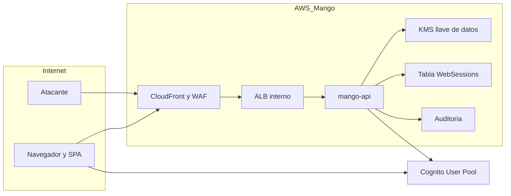

# Sesión web con cookie del servidor: modelo de amenazas (v0.1)

> Fecha: 2026-10-03 · Skill: `security-threat-model`. Decisión: D63 (revisa D20 y TM-L13).
> Diseño: `docs/specs/session-cookie.md`. Contexto ya modelado: `login-threat-model.md` (TM-L1, TM-L2, TM-L13, TM-L14), `identity-propagation-threat-model.md` (TM-I5, TM-I6) y `people-management-threat-model.md`.
> Alcance: diseño (aún sin código). Endpoints `/api/session*` de `mango-api`, la cookie de sesión, la tabla de sesiones, el cambio en `AuthProvider` y el paso de la cookie por CloudFront y el ALB.

## Executive summary

Hoy el refresh token vive en la memoria de la SPA y solo viaja entre el navegador y Cognito. El diseño lo mueve a una cookie `HttpOnly` cifrada con KMS que solo `mango-api` puede usar, con un registro de sesión en el servidor. Los riesgos dominantes cambian así:

1. **`mango-api` pasa a manejar refresh tokens.** Antes nunca los veía. Ahora los recibe una vez por ingreso, los descifra en cada renovación y llama a Cognito con ellos. Un fallo que los escriba en logs, en auditoría o en una respuesta cacheada expone sesiones de 12 horas.
2. **Aparece autenticación por cookie**, y con ella CSRF, fijación de sesión y robo de la cookie, que con Bearer en memoria no existían (`apps/web/src/api/client.ts` usa `credentials: 'omit'`).
3. **Mejora frente a XSS:** el refresh token deja de ser legible por JavaScript (TM-L13). Un XSS aún puede pedir access tokens mientras corre en la página.

No se identificó ninguna amenaza crítica. Las altas son el robo de la cookie con repetición desde otro equipo y la fuga del refresh token por logs o por el tramo HTTP de la PoC.

## Scope and assumptions

- **Dentro:** `POST /api/session`, `POST /api/session/refresh`, `DELETE /api/session` (a crear en `apps/api/src/mango_api/`); cookie `__Host-mango_session`; tabla `Mango-<ns>-WebSessions`; uso de la llave de datos de KMS; `apps/web/src/auth/AuthProvider.tsx`; comportamiento `/api/*` de CloudFront y origen ALB (`infra/lib/constructs/edge.ts`); ganchos de revocación en `people.py` y `mfa_reset.py`.
- **Fuera:** el login SRP, el registro y la recuperación (`login-threat-model.md`); la validación de access tokens en `mango-api` y el Gateway (no cambia); el IdP del cliente.
- **Supuestos que más pesan:**
  1. Opción C del diseño: la cookie lleva id de sesión y refresh token cifrado; el servidor no guarda secretos.
  2. MFA TOTP obligatorio en toda instalación (D58: solo `installationType: customer`).
  3. La aplicación está en internet detrás de CloudFront + WAF; SPA y API comparten origen, sin CORS (`app.py`, cabecera del módulo).
  4. CSP estricta vigente (`script-src 'self'`, Trusted Types, `connect-src` acotado; `edge.ts`).
  5. En la PoC el tramo CloudFront → ALB va en HTTP por un VPC origin interno (D15).
  6. Sesión de 8 h como máximo (`SESSION_HOURS`, `infra/lib/constructs/identity.ts`; 12 h antes de este diseño), sin rotación de refresh tokens.

## System model

### Primary components
- SPA (`apps/web`): obtiene tokens de Cognito al ingresar; pide access tokens a `mango-api` después.
- CloudFront + WAF: `/api/*` con `CACHING_DISABLED` y `ALL_VIEWER_EXCEPT_HOST_HEADER` (reenvía cookies).
- ALB interno → `mango-api` (Fargate).
- Cognito User Pool (API pública `InitiateAuth`, `RevokeToken`; WAF regional).
- KMS (llave de datos) y DynamoDB (`WebSessions`).
- Auditoría (Firehose → S3).

### Data flows and trust boundaries
- **Navegador → CloudFront → ALB → mango-api, `POST /api/session`:** Bearer access token y refresh token en el cuerpo JSON. TLS hasta CloudFront; HTTP en el tramo interno de la PoC. Validación: token verificado, esquema Pydantic, cabecera propia, `Origin`. Respuesta con `Set-Cookie`.
- **Navegador → mango-api, `POST /api/session/refresh` y `DELETE /api/session`:** solo la cookie. Mismas comprobaciones de origen. La respuesta de renovación lleva access e ID token en el cuerpo.
- **mango-api → KMS:** `Encrypt`/`Decrypt` con contexto de cifrado (hash del id de sesión, `sub`). IAM del rol de la tarea.
- **mango-api → DynamoDB:** registro por hash del id y marca de revocación por usuario.
- **mango-api → Cognito (API pública):** `InitiateAuth REFRESH_TOKEN_AUTH` y `RevokeToken` con el refresh token. Sale de las IP de la tarea; pasa por el WAF regional del pool.
- **mango-api → auditoría:** eventos de sesión, sin tokens ni ids de sesión.
- **Navegador → resto de `/api/*` y S3:** la cookie viaja en toda petición al origen (por `Path=/`), pero ningún otro endpoint la lee; CloudFront no la reenvía a S3.

#### Diagram

## Assets and security objectives

| Asset | Why it matters | Security objective (C/I/A) |
|---|---|---|
| Refresh token de Cognito | Da access tokens durante toda la sesión (12 h) | C |
| Cookie de sesión (id + texto cifrado) | Quien la presente a `mango-api` obtiene access tokens | C |
| Access e ID token en la respuesta de renovación | Acceso a la API por hasta 60 min | C |
| Registro de sesión y marca de revocación | Deciden si una sesión sigue viva | I |
| Llave de KMS y su contexto | Sin ella la cookie es inútil fuera de `mango-api` | C/I |
| Garantía de MFA | La sesión recuperada debe venir de un ingreso con segundo factor | I |
| Disponibilidad de la renovación | Sin ella nadie mantiene la sesión | A |
| Auditoría de sesiones | Investigar un robo de sesión | I |

## Attacker model

### Capabilities
- Atacante anónimo en internet que llama `/api/session*` con cookies o cuerpos fabricados.
- Sitio ajeno que la víctima visita con la sesión abierta (CSRF, navegación cruzada).
- Atacante con JavaScript en el origen de la SPA (XSS o dependencia comprometida).
- Atacante que controla otro subdominio del dominio del cliente (plantar cookies).
- Persona con acceso al equipo de la víctima (equipo compartido, perfil del navegador, malware que lee el almacén de cookies).
- Lector de logs (CloudWatch, logs de CloudFront/ALB) o de la tabla de sesiones.
- Persona recién deshabilitada o a la que se quitó un grupo, que intenta conservar el acceso.

### Non-capabilities
- Romper TLS entre el navegador y CloudFront, o KMS.
- Usar la llave de KMS sin el rol de `mango-api`.
- Modificar IaC o IAM (cubierto por otros modelos).
- Observar el tráfico interno de la VPC sin haber comprometido antes la cuenta o la red (se trata aparte en TM-S6).

## Entry points and attack surfaces

| Surface | How reached | Trust boundary | Notes | Evidence (repo path / symbol) |
|---|---|---|---|---|
| `POST /api/session` | SPA tras el ingreso | Internet → mango-api | Recibe el refresh token; pone la cookie | A crear; hoy la SPA no envía el refresh token a la API (`AuthProvider.tsx`) |
| `POST /api/session/refresh` | SPA al cargar y al renovar | Internet → mango-api | Autenticado solo por cookie; devuelve tokens | A crear |
| `DELETE /api/session` | SPA al cerrar sesión | Internet → mango-api | Autenticado solo por cookie | A crear |
| Cabecera `Cookie` en todo `/api/*` | Navegador | Internet → CloudFront → ALB | `ALL_VIEWER_EXCEPT_HOST_HEADER` la reenvía | `infra/lib/constructs/edge.ts`, `additionalBehaviors` |
| Tramo CloudFront → ALB | VPC origin | CloudFront → VPC | HTTP en la PoC | `edge.ts`, `OriginProtocolPolicy.HTTP_ONLY` |
| Logs de acceso | CloudFront, ALB, uvicorn | AWS | Sin cookies por defecto | `edge.ts`, `enableLogging`; `apps/api/Dockerfile` |
| Tabla `WebSessions` | IAM | mango-api → DynamoDB | Sin secretos (opción C) | A crear en `infra/lib/constructs/governance.ts` |
| Ganchos de revocación | Ajustes › Personas, reset de MFA | mango-api | Ya llaman a `AdminUserGlobalSignOut` | `apps/api/src/mango_api/people.py`, `mfa_reset.py` |

## Top abuse paths

1. **Robo y repetición de la cookie:** malware o alguien con acceso al perfil del navegador copia `__Host-mango_session` → llama a `POST /api/session/refresh` desde su equipo con la cabecera propia → recibe access tokens de la víctima durante el resto de la sesión, sin contraseña ni MFA.
2. **XSS que cabalga la sesión:** JavaScript del atacante en la página llama a `/api/session/refresh` (mismo origen, puede poner la cabecera) → obtiene un access token → lo exfiltra por navegación y lo usa 60 minutos; repite mientras la pestaña siga abierta.
3. **CSRF de cierre o de renovación:** un sitio ajeno envía un formulario a `DELETE /api/session` o a `/api/session/refresh` → sin defensas, cierra la sesión de la víctima o gasta su cuota de renovaciones.
4. **Fijación de sesión:** el atacante consigue que el navegador de la víctima guarde una cookie de una sesión **del atacante** (subdominio hermano, o CSRF contra `POST /api/session`) → la víctima recarga y trabaja dentro de la cuenta del atacante, que luego lee lo que ella escribió (conversaciones).
5. **Persona deshabilitada que conserva el acceso:** un admin deshabilita a alguien, pero su cookie sigue renovando porque el servidor no consulta la revocación → acceso indebido más allá de los 60 minutos del access token.
6. **Fuga por logs o caché:** una excepción registra el cuerpo de `POST /api/session`, o una respuesta de renovación queda cacheada en CloudFront o en el navegador → refresh o access tokens al alcance de quien lee logs o de otro usuario.
7. **Saltarse el MFA:** el atacante con la contraseña (sin TOTP) intenta crear una sesión con tokens parciales o con el refresh token de otra persona junto a su propio access token.
8. **Equipo compartido:** la persona cierra la pestaña sin cerrar sesión; la siguiente abre la aplicación antes de 12 horas y entra con su cuenta.

## Threat model table

| Threat ID | Threat source | Prerequisites | Threat action | Impact | Impacted assets | Existing controls (evidence) | Gaps | Recommended mitigations | Detection ideas | Likelihood | Impact severity | Priority |
|---|---|---|---|---|---|---|---|---|---|---|---|---|
| TM-S1 | Malware o acceso al equipo | Leer el almacén de cookies del navegador | Repetir la cookie contra `/api/session/refresh` desde otro equipo | Acceso como la víctima hasta 12 h, sin MFA | Cookie, access tokens | MFA en el ingreso; sesión de 12 h (`identity.ts`, `SESSION_HOURS`); `enableTokenRevocation` | La sesión no se ata a equipo ni a IP; hoy no hay cookie que robar | `HttpOnly` + `Secure` + `__Host-`. Límite absoluto de sesión en el registro, no solo en Cognito. «Cerrar sesión» revoca en Cognito y borra el registro. Los admins cierran todas las sesiones de una persona (marca `revoked_before`). Límite de tasa por sesión. No atar a IP (rompe redes móviles y VPN). Evaluar después: guardar un hash del `User-Agent` y auditar si cambia | Auditoría `session.renewed` con ritmo anómalo; renovaciones tras `session.ended`; eventos de riesgo de Cognito | medium | high | **high** |
| TM-S2 | XSS o dependencia comprometida | JavaScript en el origen | Pedir access tokens a `/api/session/refresh` y exfiltrarlos | Uso de la API como la víctima mientras la pestaña viva y 60 min más | Access tokens | CSP `script-src 'self'`, Trusted Types (`edge.ts`); markdown sin HTML; refresh token ya no legible por JS | El XSS puede poner la cabecera propia (mismo origen) | Mantener la CSP. La respuesta de renovación nunca incluye el refresh token. La SPA descarta el refresh token justo después de crear la sesión. Límite de tasa por sesión | Reportes de CSP; ritmo de renovaciones por sesión | low | high | **medium** |
| TM-S3 | Sitio ajeno | Víctima con sesión abierta | CSRF contra `DELETE /api/session` o `/api/session/refresh` | Cierre de sesión forzado; gasto de cuota | Disponibilidad | Sin CORS (`app.py`); `frame-ancestors 'none'` | Los endpoints de cookie son nuevos | `SameSite=Strict`. Cabecera propia obligatoria (`X-Mango-Session`), que un formulario no puede enviar y que sin CORS no pasa el preflight. Comprobar `Origin` contra `allowed_hosts` y `Sec-Fetch-Site` si viene. Solo `POST`/`DELETE`, nunca `GET`. Ningún otro endpoint acepta la cookie como autenticación (test de contrato) | Métrica de rechazos por origen | low | low | **low** |
| TM-S4 | Subdominio hermano o sitio ajeno | Controlar otro subdominio del dominio del cliente, o lograr un `POST /api/session` con tokens del atacante | Fijar en el navegador de la víctima una sesión del atacante | La víctima trabaja en la cuenta del atacante y le entrega lo que escriba | Integridad de la sesión | En `*.cloudfront.net` no hay subdominios hermanos (lista de sufijos públicos) | Con dominio propio del cliente sí los hay | Prefijo `__Host-` (el navegador rechaza la cookie si trae `Domain` o no es `Secure`). El id de sesión lo genera siempre el servidor. `POST /api/session` exige Bearer + cabecera propia + `Origin`. La SPA compara el `sub` de cada renovación con el de la pestaña y, si cambia, descarta su estado | Auditoría `session.started` seguida de un cambio de `sub` en la misma pestaña (lado cliente) | low | medium | **low** |
| TM-S5 | Persona deshabilitada, sin grupo sensible o con MFA restablecido | Tener una cookie vigente | Seguir renovando | Acceso tras la baja | Registro de sesión | `AdminUserGlobalSignOut` en `people.py` y `mfa_reset.py`; Cognito rechaza renovar a un usuario deshabilitado; el pre-token recalcula los grupos en cada renovación | El servidor no tiene aún su propia marca de revocación | Cada renovación va a Cognito (no se cachea el resultado). Además, esos flujos escriben `revoked_before` del usuario y el servidor la comprueba antes de descifrar. Si Cognito rechaza, se borra el registro y la cookie. Test por cada flujo | Auditoría `session.ended` con motivo `revoked` | low | high | **medium** |
| TM-S6 | Lector de logs; observador del tramo interno | Acceso a CloudWatch, a los logs de CloudFront o al tráfico de la VPC (PoC) | Leer el refresh token del cuerpo, o la cookie, y repetirla | Sesiones de 12 h | Refresh token, cookie | CloudFront no registra cookies por defecto (`edge.ts`, sin `logIncludesCookies`); el ALB no registra cabeceras; uvicorn solo la línea de petición; el manejador de validación solo devuelve nombres de campos (`app.py`, `validation_error`); regla de logging de `AGENTS.md` | El refresh token nunca había pasado por `mango-api` ni por el tramo HTTP de la PoC | Nunca registrar cuerpo ni `Cookie` en los endpoints de sesión; test que falla si el logger recibe el token. Test de CDK: logs de CloudFront sin cookies; si se activa el log del WAF, redactar `cookie` y `authorization`. El refresh token no va a auditoría ni al registro. **PoC:** el tramo HTTP es una excepción ya registrada que se amplía; en producción, HTTPS hasta el ALB (D15) | Búsqueda periódica de patrones de token en los log groups | low | high | **medium** |
| TM-S7 | Usuario del mismo CloudFront o del mismo navegador | Respuesta cacheada | Recibir tokens de otra persona desde una caché | Suplantación | Access tokens | `CACHING_DISABLED` en `/api/*` (`edge.ts`); la SPA usa `cache: 'no-store'` (`client.ts`) | Depende de que nadie cambie la política | `Cache-Control: no-store` en las tres respuestas. Solo `POST`/`DELETE`. Test de CDK que fija `CACHING_DISABLED` en `/api/*` y que el comportamiento por defecto no reenvía cookies | — | low | high | **low** |
| TM-S8 | Atacante con contraseña pero sin TOTP; usuario malicioso | Un access token propio válido | Crear una sesión con el refresh token de otra persona, o sin haber pasado MFA | Suplantar a otra persona; saltarse el segundo factor | Garantía de MFA | Cognito solo emite tokens tras el reto completo (`flows.ts`, `step`); verificación estricta del access token (`mango_core.identity.AccessTokenVerifier`) | Endpoint nuevo | `POST /api/session` renueva una vez contra Cognito y exige que el `sub` del token resultante sea el del Bearer. El contexto de cifrado ata el texto cifrado a ese `sub` y a ese id. En la renovación se vuelve a comprobar el `sub` contra el registro. No existe endpoint que cree sesión sin tokens de Cognito | Auditoría de rechazos `sub_mismatch` | low | high | **medium** |
| TM-S9 | Persona siguiente en un equipo compartido | La anterior no cerró sesión | Abrir la aplicación y entrar con la sesión ajena | Acceso como otra persona | Cookie | Hoy cerrar la pestaña termina la sesión | La cookie sobrevive a la pestaña (y al navegador, si es persistente) | Decisión del usuario: cookie persistente o de navegador. «Cerrar sesión» visible y efectivo en todas las pestañas (`BroadcastChannel`). Límite de 12 h. Opción futura con diseño: casilla «Mantener la sesión en este equipo» | — | medium | medium | **medium** |
| TM-S10 | Atacante anónimo o cliente defectuoso | Ninguno | Inundar `/api/session/refresh` | Agotar el límite del WAF del user pool (300 `InitiateAuth` por IP de `mango-api` cada 5 min, `identity.ts`, `SECRET_RATE_LIMIT`) y dejar a todos sin renovar | Disponibilidad | WAF de CloudFront 1000/5 min por IP (`edge.ts`) | Las renovaciones de todos salen ahora de las IP de la tarea | Rechazar antes de llamar a Cognito toda cookie sin registro válido (una lectura de DynamoDB). Límite de tasa por sesión y por usuario. Medir el margen del límite del WAF con tráfico real; evaluar `AdminInitiateAuth` | Métrica de renovaciones y de 429 de Cognito | low | medium | **low** |
| TM-S11 | Dos pestañas, dos personas | Segundo ingreso en el mismo navegador | La pestaña vieja renueva con la cookie nueva | Datos de una persona mostrados con la sesión de otra | Integridad de la sesión | — | Nuevo | La respuesta de renovación trae el `sub` (en el token); la SPA lo compara con el suyo y, si difiere, descarta todo el estado. `POST /api/session` cierra la sesión anterior de la cookie | — | low | medium | **low** |

## Criticality calibration
- **Critical:** crear una sesión sin un ingreso completo con MFA, o para otra persona; tokens servidos desde una caché a otro usuario. No se identificó ninguno con los controles del diseño.
- **High:** robo y repetición de la cookie (TM-S1).
- **Medium:** XSS que pide access tokens (TM-S2), persona dada de baja que conserva la sesión (TM-S5), fuga por logs o por el tramo HTTP de la PoC (TM-S6), mezcla de identidades al crear la sesión (TM-S8), equipo compartido (TM-S9).
- **Low:** CSRF (TM-S3), fijación (TM-S4), caché (TM-S7), agotar el límite de renovación (TM-S10), dos personas en dos pestañas (TM-S11).

## Focus paths for security review

| Path | Why it matters | Related Threat IDs |
|---|---|---|
| `apps/api/src/mango_api/` (módulo de sesión web, a crear) | Cookie, cifrado, comprobación de `sub`, origen y cabecera, límites, auditoría | TM-S1, TM-S3, TM-S4, TM-S8, TM-S10 |
| `apps/api/src/mango_api/app.py` | Que ningún otro endpoint acepte la cookie; manejadores de error sin eco de valores | TM-S3, TM-S6 |
| `apps/api/src/mango_api/people.py`, `mfa_reset.py` | Marca de revocación junto a `AdminUserGlobalSignOut` | TM-S5 |
| `apps/web/src/auth/AuthProvider.tsx` | Descartar el refresh token, recuperar al cargar, comparar `sub`, cierre entre pestañas | TM-S2, TM-S9, TM-S11 |
| `apps/web/src/api/client.ts` | `credentials` solo en las llamadas de sesión; el resto sigue en `omit` | TM-S3 |
| `infra/lib/constructs/edge.ts` | Caché y reenvío de cookies; logs sin cookies; tramo HTTP | TM-S6, TM-S7 |
| `infra/lib/constructs/governance.ts` | Tabla de sesiones, permisos, llave | TM-S5, TM-S6 |
| `infra/lib/constructs/identity.ts` | `SESSION_HOURS`, límites del WAF del pool | TM-S1, TM-S10 |

## Supuestos validados con el usuario (2026-10-03)
1. **Duración:** 8 h como límite absoluto (antes 12 h). Reduce la ventana de TM-S1 y TM-S9.
2. **Persistencia:** la cookie sobrevive al cierre del navegador hasta que venza la sesión. TM-S9 queda en medium: en un equipo compartido hay que cerrar sesión.
3. **SSO:** las sesiones federadas usan el mismo mecanismo.
4. **Tramo HTTP de la PoC:** aceptado que el refresh token y la cookie pasen por él mientras dure la PoC (TM-S6); la excepción de `AGENTS.md` se amplió.
