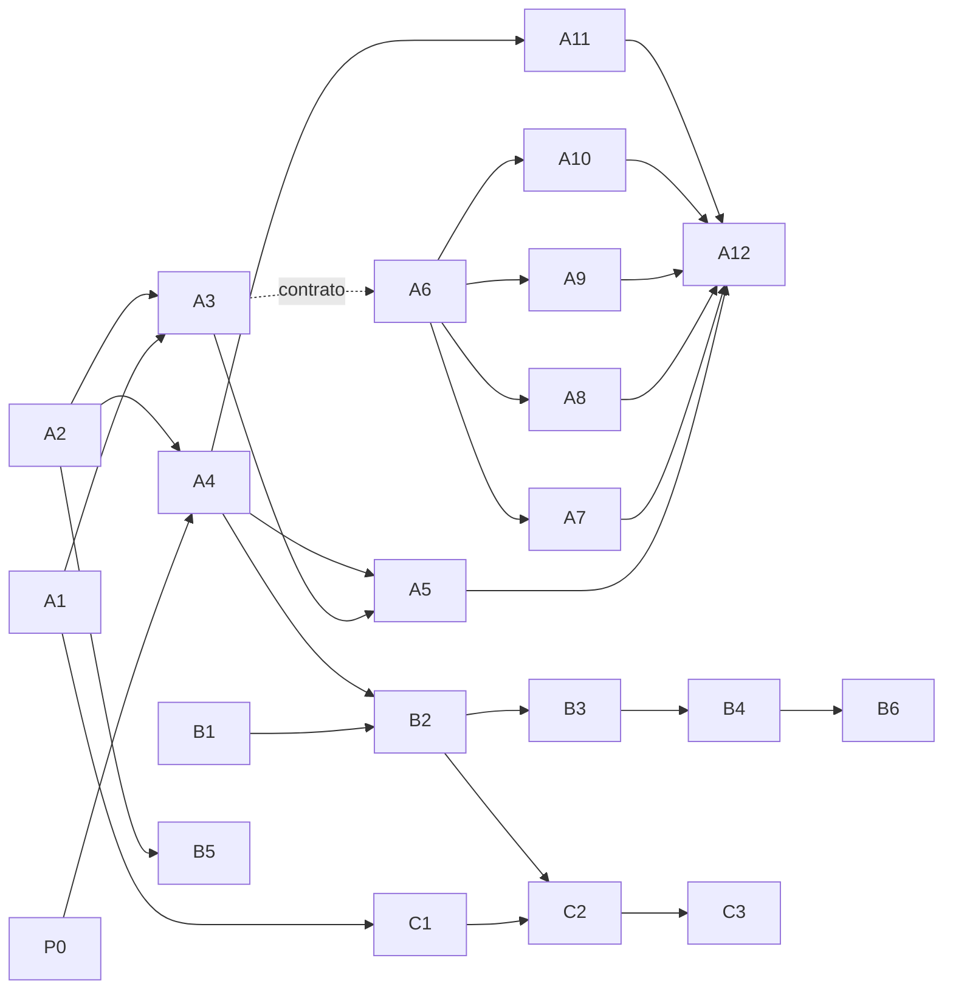

# Marketplace v1: plan de implementación (v0.2)

> Fecha: 2026-10-01 · Estado: **decisiones aprobadas (D32–D38); listo para construir** · Spec: `docs/specs/marketplace-v1.md` v0.2.
> Modelo de amenazas: `docs/security/threat-models/marketplace-v1-threat-model.md` v0.2. Decisiones: D10, D13, D17–D26, D30, D32–D38.
> Diseño: proyecto de Claude Design (`marketplace.jsx`, `admin.jsx`, `agent-review.jsx`, `mcp-catalog.jsx`, `models-view.jsx`, `other-views.jsx`, `lifecycle.js`, `store.js`, `HANDOFF.md`), leído el 2026-10-01.
> El usuario aprobó las 18 recomendaciones de §4 el 2026-10-01. Están registradas en §8 de la arquitectura como D32–D38; D33 ajusta D18 y D36 ajusta D19.

## 1. Punto de partida

Lo que existe hoy en `main`:

| Área | Estado |
|---|---|
| Agente | Un solo agente (FinOps). El harness, su rol y el guardrail base los crea CDK (`infra/lib/constructs/agent.ts`). `mango-api` recibe el agente por variables de entorno (`HARNESS_ARN`, `AGENT_ID`, prompt y límites) |
| Invocación | `mango-api` arma cada `InvokeHarness` en el servidor: prompt, tools, `allowedTools`, límites y modelo con guardrail (`harness.py`). El token del usuario viaja como header del tool `remote_mcp` (D13) |
| Gateway | Un target Lambda (`finops`), interceptor REQUEST con firma `X-Mango-Invocation` y dos políticas Cedar L2 por `mango_role` (`tools.ts`) |
| L1 | Verified Permissions con políticas estáticas. `UseAgent` solo sobre `Mango::Agent::"finops"` y por rol |
| Identidad | `mango_core.identity` solo acepta los roles `finops-central` y `bu-lead`. No hay grupos de acceso ni grupo de creadores |
| Datos | Tablas `Conversations`, `Budgets`, `AuditIndex` y `Settings`. No hay tabla `Agents` |
| Doble aprobación | Patrón probado en `admin.py`, `settings_store.py` y `mfa_reset.py`: bloqueo optimista, `approver ≠ proposer`, auditoría `requested` → `applied`/`rejected` |
| Provisioner | No existe (`functions/provisioner/` no está creado). Tampoco Step Functions |
| Web | Marketplace, Revisión, Catálogo de MCP, Brains y Org Chart son `SoonView`. El cliente de API es zod escrito a mano. El mock es un solo archivo (`mock/mockBackend.ts`, 1 442 líneas) |
| Release | La PoC despliega con `cdk deploy` en modo dev. No hay pipeline de release, firma (R5) ni bucket de artefactos |
| Diseño en el repo | `docs/design/mango-hub/` sincronizado con Claude Design el 2026-10-01 (P0) |

## 2. Spikes (§10 del spec): resultados

Método: documentación oficial de AWS, ayuda de AWS CLI 2.36.47, modelo de botocore 1.43.104, código de `awslabs/mcp` (rama `main`) y llamadas **de solo lectura** al laboratorio. No se creó ningún recurso. Todo consultado el 2026-10-01.

| ID | Resultado | Estado |
|---|---|---|
| S-M1 | Pricing y CloudWatch **no cachean clientes boto3**: crean una sesión nueva en cada llamada. Pero toman las credenciales del proceso; no hay parámetro para pasarlas por llamada. Un adaptador sin fork solo es posible reemplazando funciones internas | **Resuelto** (C2, 2026-10-01): no hace falta tocar funciones internas. El punto de entrada reemplaza la cadena por defecto de credenciales de boto3 por las de la llamada en curso; prueba local de aislamiento con identidades concurrentes en verde |
| S-M2 | El Runtime **no exige** ECR de la misma cuenta. Además acepta un zip en S3, sin contenedor | **Resuelto y probado** en el laboratorio (B2, 2026-10-01): el pack Pricing corre desde el zip |
| S-M3 | Pricing, CloudWatch y Billing son **solo stdio**. No hace falta un puente stdio→HTTP: basta un punto de entrada propio | **Resuelto** |
| S-M4 | `UpdateHarness` crea una **versión inmutable**. Los endpoints con nombre apuntan a una versión. Un harness por agente y mover el endpoint | **Resuelto y medido** en el laboratorio (A4, 2026-10-01): mover el endpoint no corta las sesiones en curso |
| S-M5 | Sin costo fijo por Runtime. Cada llamada por el Gateway arranca una microVM: 4 a 6 s y del orden de USD 0,004 (diez veces la estimación) | **Medido** en el laboratorio (B6, 2026-10-01). Quedan dos ajustes por decidir: sesiones MCP del Gateway y el tiempo de inactividad del Runtime |

### S-M1. Credenciales por llamada en servidores awslabs

- **Pricing** (`awslabs.aws-pricing-mcp-server` 1.1.1): cada tool llama a `create_pricing_client()`, que crea un `boto3.Session` nuevo. No guarda clientes.
- **CloudWatch** (`awslabs.cloudwatch-mcp-server` 0.3.1): cada tool llama a `get_aws_client(service, region, profile_name)`, que también crea un `Session` nuevo. No guarda clientes.
- En ambos, las credenciales salen de la cadena por defecto del proceso, es decir, del rol del Runtime. No aceptan credenciales por llamada.
- Las tools de CloudWatch exponen `profile_name` y `region` como argumentos que controla el modelo. En un contenedor sin perfiles, `profile_name` falla. `region` permite consultar otra región.
- **Adaptador sin fork:** nuestro punto de entrada puede reemplazar `get_aws_client` (importada por nombre en tres módulos) o `create_pricing_client` por una función que use credenciales del usuario de esa petición. No es API pública: puede romperse con cada versión. El pipeline tendría que comprobar en cada build que esas funciones existen y conservan su firma.
- **Billing and Cost Management** (0.0.38, revisado en C3): `create_aws_client` crea un `boto3.Session` nuevo en cada llamada, con las credenciales del proceso; no guarda clientes. Las tools son `async` y llaman a boto3 en el bucle de eventos; algunas usan `asyncio.to_thread`. El mismo reemplazo de la cadena de credenciales sirve.
- **Hecho en C2:** prueba local (sin AWS) con identidades concurrentes, con el SDK real de MCP y la firma real de botocore: no se cruzan credenciales, tampoco con un cliente guardado entre llamadas (`packages/py/mango-pack-runtime/tests/`).
- Fuentes: [`pricing_client.py`](https://github.com/awslabs/mcp/blob/main/src/aws-pricing-mcp-server/awslabs/aws_pricing_mcp_server/pricing_client.py), [`aws_common.py`](https://github.com/awslabs/mcp/blob/main/src/cloudwatch-mcp-server/awslabs/cloudwatch_mcp_server/aws_common.py) y los `tools.py` de `cloudwatch_logs`, `cloudwatch_metrics` y `cloudwatch_alarms`.

### S-M2. Origen del artefacto del Runtime

- `CreateAgentRuntime` acepta dos tipos de artefacto: `containerConfiguration` o `codeConfiguration`.
- **Contenedor:** el patrón de `containerUri` admite un ECR privado de cualquier cuenta (`<12 dígitos>.dkr.ecr.<región>.amazonaws.com/...`) y `public.ecr.aws/...`, con tag o con `@digest`.
  - El propio harness gestionado corre una imagen de **ECR Public** (visto en el laboratorio: `public.ecr.aws/<alias de AWS>/harness-us-east-1:latest`).
  - El rol de ejecución necesita `ecr:BatchGetImage`, `ecr:GetDownloadUrlForLayer` y `ecr:GetAuthorizationToken`.
  - Para otra cuenta, el repositorio necesita una política que dé lectura a ese rol. Esto último sale del README del construct de CDK, no de una prueba.
- **Código:** un zip en S3 (`bucket`, `prefix`, `versionId`) con runtime `PYTHON_3_13` y un punto de entrada. Máximo 250 MB comprimido y 750 MB descomprimido. Dependencias en wheels `aarch64-manylinux2014`. No usa ECR.
  - La guía de MCP en Runtime despliega el servidor MCP así.
  - Los ejemplos usan un bucket de la misma cuenta con `ExpectedBucketOwner`. No está documentado un bucket de otra cuenta.
- El Runtime solo corre **arm64**.
- **Probado en B2 (laboratorio, 2026-10-01, recursos temporales ya borrados):**
  - Un Runtime MCP creado desde el zip de Pricing (60 MB, sin comprimir) queda `READY` en ~15 s. No hizo falta la alternativa de imagen por digest.
  - El rol de ejecución **no** necesita permisos de S3. Quien llamó a `CreateAgentRuntime` sí podía leer el objeto; no se probó sin ese permiso.
  - El Runtime guarda el `versionId` del objeto. Con una versión posterior distinta en la misma clave, siguió sirviendo el zip verificado.
  - `tools/list` del Runtime da el mismo `tools_hash` que el snapshot del CI.
  - Sin autorizador JWT, el Runtime solo acepta SigV4: una llamada sin firma devuelve `403 Missing Authentication Token`.
  - El Gateway llega al Runtime con un target `mcpServer` y `GATEWAY_IAM_ROLE` (servicio `bedrock-agentcore`); su rol necesita `InvokeAgentRuntime`. Una llamada real `tools/call` de un usuario del laboratorio devolvió datos de la API de precios.
  - Crear un Runtime crea también su endpoint `DEFAULT` y su workload identity con los permisos de quien llama (como en los harness, D40).
  - Instalar el pack completo tarda ~70 s; deshabilitarlo, ~45 s.
- Fuentes: [permisos del Runtime](https://docs.aws.amazon.com/bedrock-agentcore/latest/devguide/runtime-permissions.html), [despliegue directo de código](https://docs.aws.amazon.com/bedrock-agentcore/latest/devguide/runtime-get-started-code-deploy-python.html), [README del construct de CDK](https://docs.aws.amazon.com/cdk/api/v2/python/aws_cdk.aws_bedrockagentcore/README.html), `aws bedrock-agentcore-control create-agent-runtime help`.

### S-M3. Streamable HTTP en servidores awslabs

- El README de `awslabs/mcp` dice: "The MCP servers in this repository are designed to support stdio only". Pricing, CloudWatch y Billing terminan en `mcp.run()` sin transporte.
- La excepción es `aws-api-mcp-server`, que sí soporta `streamable-http`.
- Pricing y CloudWatch exportan un objeto `mcp` del SDK oficial (`mcp>=2,<3`), y ese SDK ya trae el transporte: `run(transport="streamable-http", host, port, stateless_http)`.
- Billing usa otra librería (`fastmcp>=4`) y necesita un paso `setup()` antes de arrancar. **Comprobado en C3 (2026-10-01):** `fastmcp` 4.0.8 sirve streamable HTTP sin estado y con respuesta JSON (`run(transport="streamable-http", stateless_http=True, json_response=True)`), y el zip arranca y responde `tools/list` en el contenedor sin red y de solo lectura del pipeline. Falta verlo en un Runtime real (laboratorio).
- **Conclusión:** el pack lleva un punto de entrada propio de pocas líneas que importa el `mcp` del paquete y lo arranca en `0.0.0.0:8000/mcp`, sin estado. No hace falta fork ni puente stdio→HTTP.
- El contrato del Runtime para MCP es ese mismo: `0.0.0.0:8000/mcp`, y recomienda `stateless_http=True`.
- El Gateway soporta las versiones de MCP `2026-07-28`, `2025-11-25`, `2025-06-18` y `2025-03-26`.
- Fuentes: [README de awslabs/mcp](https://github.com/awslabs/mcp#supported-transport-mechanisms), [MCP en AgentCore Runtime](https://docs.aws.amazon.com/bedrock-agentcore/latest/devguide/runtime-mcp.html), [targets MCP del Gateway](https://docs.aws.amazon.com/bedrock-agentcore/latest/devguide/gateway-target-MCPservers.html), [`server.py` del SDK de MCP](https://github.com/modelcontextprotocol/python-sdk/blob/main/src/mcp/server/mcpserver/server.py).

### S-M4. Versiones del harness

- Crear un harness crea la versión 1. Cada `UpdateHarness` crea una versión nueva, completa e inmutable (modelo, prompt, tools, memoria, límites y entorno).
- El endpoint `DEFAULT` pasa solo a la última versión en cada update. Los endpoints con nombre se mueven con `UpdateHarnessEndpoint(targetVersion)`. Estados: `CREATING`, `READY`, `UPDATING`, `UPDATE_FAILED`.
- `InvokeHarness` recibe `qualifier` (nombre del endpoint; por defecto `DEFAULT`).
- `InvokeHarness` permite **sobrescribir por invocación** modelo, prompt, tools, skills, `allowedTools` y límites. Es lo que hace hoy `mango-api`.
- En el laboratorio: el harness de FinOps va por la versión 7 y `DEFAULT` apunta a la 7. Cada harness crea su propio Runtime (`harness_<nombre>`).
- **Conclusión:** un harness por agente (necesario para el rol por agente, D10). Cada versión aprobada es un `UpdateHarness`. `mango-api` invoca un endpoint con nombre (`live`) que el provisioner mueve solo cuando la versión nueva está `READY`. No hace falta un harness por versión.
- **Límites de nombre:** harness `[a-zA-Z][a-zA-Z0-9_]{0,39}` y Runtime `[a-zA-Z][a-zA-Z0-9_]{0,47}`. Sin guiones (ver §7, punto 1).
- **Medido en A4 (laboratorio, 2026-10-01, recursos temporales ya borrados):**
  - Mover `live` con `UpdateHarnessEndpoint` tarda 2 a 4 s (`UPDATING` → `READY`).
  - Una respuesta en streaming que empezó en la versión anterior **termina completa y sin error** aunque el endpoint cambie a mitad (dos pruebas: 27 s y 28 s de stream después del cambio).
  - Una invocación posterior con el **mismo** `runtimeSessionId` ya usa la versión nueva: la configuración se resuelve en cada invocación, no queda fijada a la sesión.
  - `UpdateHarness` es parcial: los campos que no se envían conservan el valor de la versión anterior. El provisioner envía siempre la configuración completa.
  - Crear un harness tarda ~13 s en quedar `READY`; una versión nueva, ~12 s. Borrarlo es asíncrono (hasta ~2 min) y exige borrar antes sus endpoints.
  - AgentCore crea por su cuenta un log group por endpoint del runtime (`…-DEFAULT`, `…-live`), sin KMS ni retención: el provisioner los adopta antes de publicar.
  - **Arranque en frío:** la primera invocación de una versión recién puesta en `live` tardó 35 a 47 s hasta el primer token; con una instancia caliente, una sesión nueva tarda 1,4 a 2,3 s. Tras publicar una versión, el primer turno paga ese arranque (ver A5).
- **Sigue sin dato:** la cuota de harness por cuenta no aparece en Service Quotas.
- Fuentes: [versiones y endpoints del harness](https://docs.aws.amazon.com/bedrock-agentcore/latest/devguide/harness-versioning.html), [versiones del Runtime](https://docs.aws.amazon.com/bedrock-agentcore/latest/devguide/agent-runtime-versioning.html), modelo de `InvokeHarness` en botocore.

### S-M5. Costo y cold start de un Runtime por pack

- Runtime v2: USD 0,1276 por vCPU-hora y USD 0,0169 por GB-hora, por segundo de consumo real. La CPU no se cobra en espera de I/O. La memoria ociosa se libera a los 120 s. Mínimo de 128 MB.
- **Sin tráfico el costo es cero.** No hay costo fijo por Runtime.
- Estimación de una llamada aislada (2 s de CPU, 0,5 GB durante ~125 s): ≈ USD 0,0004. Mil llamadas al mes: ≈ USD 0,40 por pack.
- Gateway: USD 0,005 por 1 000 invocaciones. Policy: USD 0,000025 por decisión.
- El cold start no está publicado. Para bajarlo, la documentación recomienda sesiones MCP en el Gateway o permitir el header `Mcp-Session-Id` en el target.
- **Medido en B2:** cada llamada a una tool de Pricing tardó entre 4 y 6 s, tanto a través del Gateway como directa al Runtime, y también al reutilizar la sesión del Runtime. No se investigó la causa.
- Fuente: [precios de AgentCore](https://aws.amazon.com/bedrock/agentcore/pricing/).

**Medido en B6** (laboratorio, 2026-10-01, pack Pricing 1.1.1-1; `tests/e2e/packs.py`, paso `measure`):

| Medida | Resultado |
|---|---|
| Llamada directa al Runtime, sin sesión MCP (arranque en frío) | `tools/list`: 4,2 a 5,8 s (mediana 5,0). Tool: 4,3 a 5,5 s (mediana 4,6) |
| Llamada directa repitiendo el `Mcp-Session-Id` de una respuesta anterior (en caliente) | `tools/list`: 0,46 a 0,50 s. Tool (`get_pricing`, `get_pricing_service_codes`): 0,54 a 0,68 s |
| La misma sesión tras 4 minutos sin uso | 0,84 s: sigue caliente |
| Repetir solo el `runtimeSessionId` | 3,8 a 5,4 s: no reutiliza la microVM. En un Runtime MCP la sesión es el `Mcp-Session-Id` |
| Tool desde el chat (harness → Gateway → Runtime) | 4,0 a 6,7 s por llamada (medianas de 5,2 y 5,4 s en dos series de 12 llamadas) |
| Habilitar el pack / deshabilitarlo | 73 s / 86 a 94 s |

- **Causa de los 4 a 6 s de B2:** el Gateway no mantiene una sesión MCP con el target, así que **cada `tools/call` arranca una microVM nueva**. El servidor en sí responde en medio segundo.
- **Costo real por llamada: del orden de USD 0,004**, diez veces la estimación.
  - Cada microVM queda viva, con su memoria facturada, hasta el tiempo de inactividad del Runtime (900 s por defecto).
  - Consumo por sesión, de las métricas de uso de CloudWatch (`CPUUsed-vCPUHours`, `MemoryUsed-GBHours`) de los Runtimes de Pricing del laboratorio: 0,004 a 0,009 vCPU-hora y 0,23 a 0,44 GB-hora (0,9 a 1,7 GB durante 15 minutos). El Runtime de B6, con 30 sesiones que vencieron solas: 0,0044 vCPU-hora y 0,23 GB-hora por sesión.
  - Esas métricas coinciden con lo facturado: el 2026-09-29, CloudWatch y Cost Explorer dan los mismos 97,46 GB-hora y 1,02 vCPU-hora.
  - La cuenta del laboratorio se factura con la tarifa v1 (USD 0,0895 por vCPU-hora y USD 0,00945 por GB-hora): USD 0,0026 a 0,0049 por sesión. Con la tarifa v2 serían USD 0,004 a 0,009.
  - Gateway y Policy suman USD 0,00003 por llamada. Mil llamadas al mes: USD 3 a 5 por pack. Sigue sin haber costo fijo.
- **Permitir `Mcp-Session-Id` en el target no sirve con el harness.** Se probó a mano en el laboratorio (`metadataConfiguration` del target, revertido después): las tools tardaron lo mismo (4,5 a 5,6 s). El Gateway no entrega un id de sesión al inicializar, así que el cliente MCP del harness no envía ninguno. No se cambió el provisioner.
- **Quedan por decidir** (cambian configuración desplegada; ver §7):
  - **Sesiones MCP del Gateway** (`protocolConfiguration.mcp.sessionConfiguration`, en `infra/lib/constructs/tools.ts`). El Gateway guardaría la sesión del target y la segunda llamada de un turno al mismo pack iría en caliente. Afecta a todas las tools de la instalación: con sesiones, toda petición sin `Mcp-Session-Id` recibe un 400. Hay que probarlo desplegado con el harness.
  - **Tiempo de inactividad del Runtime del pack** (`lifecycleConfiguration.idleRuntimeSessionTimeout`, en `runtime_config` del provisioner). Mientras el Gateway no reutilice sesiones, bajarlo de 900 s al mínimo (60 s) reduce el costo por llamada unas diez veces sin cambiar la latencia. Si se activan las sesiones del Gateway conviene un valor mayor.
- Fuentes: [sesiones MCP del Gateway](https://docs.aws.amazon.com/bedrock-agentcore/latest/devguide/gateway-sessions.html), [targets de servidores MCP](https://docs.aws.amazon.com/bedrock-agentcore/latest/devguide/gateway-target-MCPservers.html).

### Otros hallazgos útiles

- **Target MCP del Gateway:** tipo `mcpServer` con la URL del Runtime (`https://bedrock-agentcore.<región>.amazonaws.com/runtimes/<ARN codificado>/invocations?qualifier=<endpoint>`). Autorización de salida: OAuth, API key o **IAM (SigV4)** con el rol del Gateway y servicio `bedrock-agentcore`. El Runtime está en la lista de servicios compatibles con SigV4.
- En el laboratorio hay un target MCP anterior a esta PoC que apunta a un Runtime con OAuth de cliente. No se tocó; confirma que el patrón Gateway → Runtime MCP funciona.
- **Catálogo de tools:** en modo `DEFAULT`, el Gateway lee `tools/list` al crear o actualizar el target y lo guarda. Si el servidor cambia sus tools, no se ven hasta llamar a `SynchronizeGatewayTargets`. Ayuda contra TM-M5.
- La API tiene el tipo de credencial `JWT_PASSTHROUGH`, pero la guía de targets MCP no lo lista. Sin verificar.
- **Políticas Cedar por SDK (B2):** `CreatePolicy` se autoriza sobre el motor y exige además, sobre el Gateway, `ManageResourceScopedPolicy`, `GetGateway` e `InvokeGateway` (el motor valida cada acción contra las tools del Gateway; sin `InvokeGateway` la política queda en `CREATE_FAILED`). `GetPolicy`, `UpdatePolicy` y `DeletePolicy` exigen permiso sobre el motor **y** sobre la política, así que IAM sí puede acotarlas por nombre. Una política que nombra una tool que el Gateway no sirve falla al validarse.

## 3. Ajustes de diseño que salen de los spikes

Aprobados con las decisiones de §4.

1. **Publicar un agente** = rol `Mango-<ns>-agent-<id>` + harness `Mango_<ns>_a_<id>` + versión nueva + mover el endpoint `live`. Rollback = versión nueva aprobada con el contenido anterior (D18), que termina en otro `UpdateHarness`.
2. **`mango-api` sigue armando cada invocación** desde la versión publicada (leída por `content_hash`), como hoy. El harness guarda la misma configuración para el rol, el entorno (D16) y la reconciliación.
3. **Quien puede llamar a `InvokeHarness` controla el agente**, porque puede sobrescribir prompt y tools. Solo el rol de `mango-api` tiene ese permiso, acotado a `harness/Mango_<ns>_a_*`.
4. **`UseAgent` por datos:** `mango-api` pasa a Verified Permissions la entidad `Agent` con sus grupos y usuarios, y una política estática decide. No se escriben políticas L1 en runtime.
5. **Tools por agente:** el Gateway solo ve al usuario (su JWT), no al agente. La lista de tools de la versión aprobada se aplica en `allowedTools` y en el interceptor, con una firma `X-Mango-Invocation` v2 que incluye agente y tools. Cedar L2 queda por tool y por tipo de usuario.
6. **Pack** = paquete upstream fijado por hash + punto de entrada propio. Rol desde el manifiesto, Runtime MCP y target `mcpServer` con SigV4.
7. **El interceptor no inyecta `_mango_ctx` en packs:** el esquema de tools de awslabs no lo conoce. Solo lo hace para los conectores de Mango.

## 4. Decisiones aprobadas

El usuario aprobó todas las recomendaciones el 2026-10-01. La columna «Registro» indica la decisión de §8 de la arquitectura que la recoge.

| # | Pregunta | Decisión aprobada | Registro | PR afectadas |
|---|---|---|---|---|
| U1 | Modelo de harness: uno por agente con versiones y endpoint `live`, o uno por versión | **Uno por agente** con endpoint `live` (S-M4) | D32 | A4, A5 |
| U2 | Formato del id del agente. Un ULID (26) no cabe en el nombre del harness (40) junto a `Mango_<ns>_a_` | Id aleatorio de **16 caracteres** base32 (80 bits). Los agentes de la release conservan su slug (`finops`) | D32 | A2, A4 |
| U3 | `UseAgent`: atributos de la entidad o una política por agente en Verified Permissions | **Atributos** construidos por el backend. El provisioner no toca el policy store | D33 | A3 |
| U4 | Tools por agente: Cedar L2 por agente (D18) no es posible, porque el Gateway no ve al agente | **Firma v2 + interceptor + `allowedTools`**; Cedar L2 por tool y tipo de usuario. Ajusta el texto de D18 | D33 | A4, A5 |
| U5 | Guardrail por agente (spec §5) o guardrail base compartido | **Base compartido** en la fase A. El Builder del diseño no tiene sección de guardrail | D34 | A4 |
| U6 | FinOps viene en la release. ¿Pasa por aprobación (D18)? | **Preaprobado por la release**: se siembra como `approved` con `approved_by: release@<versión>` y evento de auditoría. Los cambios posteriores siguen D18 | D34 | A5 |
| U7 | Regla "Datos de cuentas solo para grupos centrales". El diseño la aplica a Cost Explorer; hoy los líderes de área usan FinOps con ese conector | Decidir por **modo de identidad y por tool**: `per_user` (Cost Explorer filtra por usuario) se permite a áreas; las tools de toda la organización, solo a centrales. Corregir primero en Claude Design (D24) | D35 | A2, A8 |
| U8 | Grupos: hoy solo hay roles FinOps. Hacen falta grupos de acceso y el de creadores | Usar `cognito:groups` más un registro de grupos con tipo en `Settings`, sembrado por IaC. La pantalla Ajustes › Grupos (D26) va en C1 | D35 | A1 |
| U9 | Artefacto del pack: imagen (texto de D19) o zip con despliegue directo | **Zip**, copiado por CloudFormation a un bucket de la instalación al instalar o actualizar. Sin ECR ni descargas en runtime. Imagen por digest como alternativa si el laboratorio lo descarta. Cambia el texto de D19 | D36 | B1, B2 |
| U10 | Dónde se publican y cómo se firman los artefactos (R5 no está construido) | Firma con **llave asimétrica de KMS** en la cuenta del proveedor; la llave pública va en la plantilla y el provisioner verifica sin salir a internet. Por ahora la cuenta del proveedor es la de management del laboratorio | D36 | B1, B2 |
| U11 | Compartir: el diseño lo trata como un cambio aparte con doble aprobación; D22 dice que pasa por revisión de versión | Backend según **D22**: compartir crea una versión con solo el acceso cambiado. En la fase A el modal «Compartir» queda Próximamente y los grupos se editan en el Builder | D38 | A7 |
| U12 | Brains: ¿en qué fase? | Catálogo mínimo de **solo lectura en A2** (lo necesita el Builder). Pantalla completa en B5 | D38 | A2, B5 |
| U13 | Primer pack `account_data` de la fase C. CloudWatch necesita roles en las cuentas miembro (`OrgAccess`, `Member`, `ReadBroker`), que no existen | Empezar por **Billing** con el broker de la payer que ya existe. CloudWatch después de construir `OrgAccess` | D37 | C3, C4 |
| U14 | Identidad en `central_only`. Con el rol del pack, CloudTrail no muestra a la persona (regla 5) | El punto de entrada asume el broker con **`SourceIdentity` = usuario** en cada llamada, aunque no filtre por área | D37 | C2 |
| U15 | Cliente TS: seguir a mano o generarlo desde OpenAPI (AGENTS.md lo pide; está pendiente) | **Generarlo ahora** (A6): los endpoints se triplican. Requiere una dependencia de desarrollo nueva | D38 | A6 |
| U16 | Evals obligatorias y skills (D26) aparecen en el spec §3, pero no en las fases | **Fuera de A–C**. La revisión no muestra el bloque de evals hasta que exista | D38 | A9 |
| U17 | Crear recursos temporales en el laboratorio para cerrar S-M2, S-M4 y S-M5 | Autorizado dentro de A4 y B2, con limpieza al terminar | D32 | A4, B2 |
| U18 | Org Chart: ¿quién ve el árbol completo? | Admins y creadores ven todo. El resto, solo los agentes que puede usar | D38 | A3, A10 |

## 5. Plan por PR

Tamaños: **S** hasta ~300 líneas, **M** hasta ~1 000, **L** más de 1 000 (con tests).
Todas las PR pasan `mise run lint|typecheck|test`; las de infra, además `synth`, `guard` y `checkov`. "Laboratorio" es la instalación `poc` (runbook `docs/runbooks/poc-deploy.md`) con los usuarios E2E.

### Fase 0

#### P0 · Documentos y diseño al día (S) — hecho el 2026-10-01
- **Objetivo:** dejar por escrito lo acordado antes de construir.
- **Áreas:**
  - `docs/design/mango-hub/` sincronizado con Claude Design;
  - `docs/specs/marketplace-v1.md` v0.2 (spikes, nombres y API completa);
  - modelo de amenazas v0.2 con la skill `security-threat-model` (sobrescritura en `InvokeHarness`, grupos, firma v2, punto de entrada de los packs);
  - decisiones nuevas en §8.
- **Dependía de:** PR #16 (D30, ya en `main`) y las respuestas de §4.

### Fase A: agentes como datos

#### A1 · Grupos en la identidad (M)
- **Objetivo:** un usuario puede tener grupos de Mango sin rol FinOps. Aparece el grupo de creadores. Sin grupo sigue sin acceso.
- **Áreas:**
  - `packages/py/mango-core/identity.py`: `groups` desde `cognito:groups`; rol opcional. El conector de Cost Explorer sigue exigiendo rol;
  - `infra/lib/config/schema.ts` y `constructs/identity.ts`: grupos nuevos;
  - `policies/cedar/platform/schema.cedarschema.json`: `User.groups`;
  - `apps/api`: `authz.py` y `/api/me`;
  - `apps/web`: esquema `Me` y `canView`.
- **API:** `GET /api/me` añade `groups` y `can` (solo para la UI). `GET /api/groups` lista el registro.
- **Datos:** `Settings`, partición `GROUPS`: id, tipo (`central`, `area`, `general`), área y descripción. Siembra put-if-absent, como en D17.
- **IAM:** sin cambios.
- **Tests:** identidad (con grupo y sin rol entra; sin grupo → 403 `no_group`), pre-token, infra `identity.test.ts`, navegación web.
- **Laboratorio:** un usuario en `mango-agent-creator` ve `can.create_agent`; uno sin grupo sigue en "Todavía no tienes acceso"; FinOps funciona igual.
- **Depende de:** nada. **Decisiones:** U8.

#### A2 · Dominio y tabla `Agents` (M)
- **Objetivo:** modelo de datos, hash de contenido y reglas del servidor, sin rutas.
- **Áreas:**
  - `infra/lib/constructs/governance.ts`: tabla;
  - `packages/py/mango-core/agents.py`: `AgentDefinition` (Pydantic `extra="forbid"`), `content_hash` (JSON canónico, SHA-256), generador de ids;
  - `apps/api/src/mango_api/agents_store.py` y `agent_rules.py`;
  - `connectors/cost-explorer/manifest.json` y `mcp_catalog.py`: catálogo de conectores como datos de la release;
  - catálogo mínimo de modelos en `Settings`, sembrado desde `models` y `modelPrices`.
- **Datos (`Mango-<ns>-Agents`):**
  - `AGENT#<id>` / `META`: estado, versión publicada, harness y su versión, creador, retiro, `version` de bloqueo;
  - `AGENT#<id>` / `VERSION#<n>`: definición (incluye `reports_to` y `role`, D30), `content_hash`, estado, creador, aprobador, motivo, paso fallido y versión base;
  - `CREATOR#` / `DAY#<fecha>`: contador de envíos con TTL;
  - índices dispersos por estado y por creador.
- **Reglas al enviar:** tamaños; secretos en el prompt; `reports_to` y `role` obligatorios y sin ciclos; tools existentes y habilitadas; regla de datos de cuentas (U7); tools de escritura marcadas; modelo habilitado y con soporte de tools; grupos existentes; 20 borradores y 5 envíos por día.
- **IAM:** `mango-api` lee y escribe `Agents`.
- **Tests:** moto (inmutabilidad tras enviar, conflicto de versión, límites, hash estable, ciclos); infra (KMS, PITR, `RETAIN`, namespace).
- **Laboratorio:** la tabla existe tras desplegar. Sin cambios visibles.
- **Depende de:** nada (usa A1 por interfaz). **Decisiones:** U2, U7, U12.

#### A3 · Cedar L1 y API de agentes (L)
- **Objetivo:** ciclo completo hasta `Aprobada`, con auditoría fail-closed.
- **Áreas:** `policies/cedar/platform/agents.cedar` y esquema; `apps/api/src/mango_api/agents.py` (router con el patrón de `admin.py`); `provisioner.py` (inicia la ejecución); `docs/specs/poc-api-contract.md`.
- **Cedar:** `CreateAgent`, `EditAgent`, `ApproveAgent`, `RetireAgent`, `ViewMcpCatalog`. `UseAgent` pasa a decidirse por atributos (U3). `approver ≠ creador de la versión` lo verifica `mango-api`.
- **API:**

  | Método y ruta | Acción |
  |---|---|
  | `GET /api/agents` · `GET /api/agents/{id}` | `UseAgent` (filtrado) |
  | `GET /api/agents/mine` | `CreateAgent` |
  | `POST /api/agents` | `CreateAgent` |
  | `POST /api/agents/{id}/versions` | `EditAgent` |
  | `GET` · `PUT /api/agents/{id}/versions/{v}` | `EditAgent` (lectura también con `ApproveAgent`) |
  | `POST …/versions/{v}/submit` | `EditAgent` |
  | `GET /api/agents/reviews` | `ApproveAgent` |
  | `POST …/approve` · `…/reject` · `…/retry` | `ApproveAgent` |
  | `POST /api/agents/{id}/retire` | `RetireAgent` |
  | `GET /api/agents/org` | según U18 |
  | `GET /api/mcp/catalog` · `GET /api/models` | `ViewMcpCatalog` · `CreateAgent` |

- **IAM:** `states:StartExecution` sobre la máquina del provisioner (ARN concreto).
- **Tests:** matriz de autorización por endpoint; mismo aprobador → 403; editar tras enviar → 409; hash distinto → 409; payloads de XSS devueltos como texto; límites → 429; auditoría con los dos `sub` y el hash. Tests de políticas Cedar (hoy no existen).
- **Laboratorio:** un creador crea y envía; él mismo no puede aprobar; otro admin rechaza con motivo y vuelve a borrador; Auditoría muestra los eventos.
- **Depende de:** A1, A2. **Decisiones:** U3, U18.

#### A4 · Provisioner de agentes (L)
- **Objetivo:** publicar una versión aprobada por SDK, de forma idempotente y con compensación.
- **Áreas:**
  - `functions/provisioner/`;
  - `infra/lib/constructs/provisioner.ts`;
  - `infra/lib/constructs/agent-platform.ts`: permissions boundary, llave KMS de logs de runtimes y guardrail base (sale de `agent.ts`);
  - `names.ts`, `core-stack.ts`, `nag`, `guard`, `checkov`.
- **Entrada:** solo `{agent_id, version, content_hash}` (TM-M1, TM-M2).
- **Pasos:** cargar la versión y comparar el hash → rol con boundary y política de plantilla fija → log group con KMS y retención (D16) → `CreateHarness` o `UpdateHarness` con el entorno de D16 → esperar `READY` → mover el endpoint `live` → marcar `Publicada` → auditar. Si falla: compensar y marcar `Fallida` con el paso.
- **IAM del provisioner:**
  - `iam:CreateRole`, `PutRolePolicy`, `DeleteRolePolicy`, `DeleteRole` y `TagRole` solo sobre `role/Mango-<ns>-agent-*`, con la condición `iam:PermissionsBoundary`;
  - `iam:PassRole` sobre ese prefijo y solo hacia `bedrock-agentcore.amazonaws.com`;
  - harness: crear, actualizar, leer y endpoints sobre `harness/Mango_<ns>_a_*`;
  - logs sobre el prefijo de runtimes de esos harness;
  - escritura en `Agents` limitada a estado y referencias del harness.
- **IAM de `mango-api`:** `InvokeHarness` pasa del ARN de FinOps al prefijo `Mango_<ns>_a_*` (comodín a documentar en cdk-nag).
- **Tests:** moto para IAM (boundary, repetición sin efectos, compensación); Stubber para AgentCore; infra: el rol no puede crear roles sin boundary ni fuera del prefijo, `PassRole` acotado, sin `Resource: "*"` no documentado.
- **Laboratorio:** ejecutar con una definición de prueba → rol, harness y endpoint `live`; repetir → sin cambios; forzar un error → compensación y `Fallida`; CloudTrail muestra `CreateRole` con boundary. Medir la sesión en curso al mover el endpoint (S-M4).
- **Depende de:** A2. En paralelo con A3. **Decisiones:** U1, U2, U4, U5, U17. El modelo de amenazas v0.2 ya está (P0).

#### A5 · Chat con varios agentes y migración de FinOps (L)
- **Objetivo:** el chat usa cualquier agente publicado y FinOps deja de ser un recurso de CDK.
- **Áreas:**
  - `apps/api`: `app.py`, `harness.py`, `settings.py`, `conversations.py`, `budget.py`;
  - `mango_core/invocation.py` y `functions/gateway-interceptor`: firma v2;
  - `agents/finops/agent.json` como definición completa;
  - siembra en el despliegue;
  - retiro de `CfnHarness` de `agent.ts`.
- **API:** `POST /api/chat` acepta `agent_id` y `model` (uno de los permitidos, D22). La conversación guarda su agente.
- **Comportamiento:** versión publicada con caché corta y fail-closed; reserva de presupuesto con el precio del modelo elegido; ámbito `AGENT#<id>`; un agente retirado no abre conversaciones.
- **Migración en dos despliegues:** primero conviven el harness de CDK y el del provisioner; después se elimina el de CDK.
- **IAM:** se quitan las variables de entorno del agente. El interceptor conserva solo la lectura del secreto.
- **Tests:** chat con agente inexistente, retirado o sin `UseAgent`; modelo fuera de la lista → 422; firma v1 rechazada; tool fuera de la lista → denegada; presupuesto por agente.
- **Laboratorio:** set de evaluación de FinOps (Q1–Q12) sin regresiones; `tests/e2e/smoke.py` y `gateway_probe.py`; el stack ya no tiene `AWS::BedrockAgentCore::Harness`.
- **Depende de:** A3, A4. **Decisiones:** U4, U6.

#### A6 · Web: base del marketplace (M)
- **Objetivo:** que las cuatro pantallas se construyan en paralelo sin tocar los mismos archivos.
- **Áreas:**
  - cliente de API generado desde OpenAPI (U15) o esquemas zod en `api/agents.ts`;
  - `mock/` partido por dominio (`mock/agents.ts`);
  - rutas y páginas vacías en `App.tsx`;
  - `navigation.ts`;
  - i18n por vista;
  - componentes comunes del diseño (panel lateral, pestañas, insignias, alertas) y su CSS.
- **Tests:** rutas, mock y esquemas.
- **Depende de:** contrato de A3 (borrador). **Decisiones:** U15.

#### A7 · Web: Marketplace (M)
- **Diseño:** `marketplace.jsx`. Pestañas Activos y Retirados, filtros, tarjetas y lista, panel de detalle, «Tus agentes en curso», Duplicar y Retirar con motivo.
- **Próximamente o sin dato:** estado en línea, tickets, orden por uso y Owner (§7, punto 9). «Compartir» según U11.
- **Tests:** solo se muestran los agentes devueltos por la API; texto de creadores como texto; retirar exige motivo.
- **Laboratorio:** un líder de área ve solo los agentes de sus grupos.
- **Depende de:** A6.

#### A8 · Web: Agent Builder (L)
- **Diseño:** `AgentAdmin` en `admin.jsx`, seis secciones: Información básica, Organización («Reporta a» y «Rol», D30), Modelo e instrucciones, Tools, Límites y presupuesto (solo lectura), Acceso. Vista previa, lista de comprobación y cuotas.
- **Reglas:** los errores del servidor mandan; las validaciones del cliente son solo ayuda. «Enviar a aprobación», nunca «Publicar». Lo enviado queda bloqueado.
- **Tests:** borrador, envío, errores por sección, bloqueo en revisión, aviso de secreto, selector de supervisor sin el propio agente ni subordinados.
- **Laboratorio:** crear un agente con tools de Cost Explorer y enviarlo.
- **Depende de:** A6. **Decisiones:** U7.

#### A9 · Web: Revisión de agentes (M)
- **Diseño:** `agent-review.jsx`. Cola «En revisión», detalle con diff (organización, información, prompt por líneas, tools, grupos, límites), aprobar o rechazar con motivo, Historial con «Reintentar».
- **Reglas:** el diff lo calcula el backend contra la versión publicada (R3). El botón de aprobar se deshabilita para el creador, pero quien decide es la API.
- **Tests:** diff con agregados y quitados; creador no aprueba; rechazo sin motivo.
- **Laboratorio:** flujo completo con dos admins hasta `Publicada`.
- **Depende de:** A6. **Decisiones:** U16.

#### A10 · Web: Org Chart de solo lectura (M)
- **Diseño:** `OrgChart` en `other-views.jsx`. Árbol por «Reporta a», búsqueda, zoom, colapsar y panel del agente. Delegación A2A, sus KPIs y «Delegaciones recientes» quedan Próximamente (D30).
- **Tests:** árbol desde `GET /api/agents/org`, teclado, raíz «Platform Admin».
- **Depende de:** A6. **Decisiones:** U18.

#### A11 · Reconciliación diaria (M)
- **Objetivo:** detectar recursos huérfanos o cambiados fuera de Mango (TM-M6) y el abuso de cuotas (TM-M9).
- **Áreas:** `functions/reconciler/`, regla de EventBridge, métricas y alarmas.
- **IAM:** solo lectura de AgentCore, IAM (roles `Mango-<ns>-agent-*`) y `Agents`. Lambda asíncrona: **lleva DLQ**.
- **Tests:** harness sin definición, versión distinta de la publicada y rol sin boundary producen hallazgo.
- **Laboratorio:** cambiar un harness por CLI y ver la alerta.
- **Depende de:** A4.

#### A12 · Cierre de la fase A (S)
- `tests/e2e/marketplace.py`, Playwright del flujo crear → revisar → usar, `security-audit` del diff, runbook y aviso a Claude Design para actualizar las vistas disponibles (D24).
- **Depende de:** A5, A7–A11.

### Fase B: MCP packs

#### B1 · Formato y pipeline de packs (L)
- **Objetivo:** construir un pack reproducible, escaneado y firmado.
- **Áreas:**
  - `packs/aws-pricing/`: `manifest.yaml`, lock con hashes y punto de entrada;
  - `packs/README.md`;
  - `.github/workflows/packs.yml` (acciones fijadas por SHA);
  - `deployment/`: empaquetado y firma.
- **Pasos:**
  - `uv` con `--require-hashes` y `--exclude-newer` (cuarentena de 7 días);
  - wheels arm64;
  - `pip-audit` y SBOM;
  - arrancar el servidor en CI y guardar `tools_hash` de `tools/list`;
  - comprobar que el manifiesto lista solo las tools permitidas;
  - firma.
- **Manifiesto de Pricing:** `data_tier: public`, `identity_mode: service`, acciones `pricing:*` exactas. Sin `analyze_cdk_project`, `analyze_terraform_project` ni las tools que salen a la web (R6).
- **Tests:** validador del manifiesto, hash estable y fallo si cambia `tools/list`.
- **Depende de:** nada; puede empezar junto con la fase A. **Decisiones:** U9, U10 (publicar).

#### B2 · Provisioner de packs (L)
- **Objetivo:** habilitar y deshabilitar un pack por SDK.
- **Áreas:** `functions/provisioner/` (segunda máquina de estados), `provisioner.ts`, boundary de packs, bucket de artefactos, interceptor.
- **Pasos:** verificar firma y hash → rol `Mango-<ns>-mcp-<id>` solo con las acciones del manifiesto → Runtime MCP → target `mcpServer` con SigV4 → comparar `tools/list` con `tools_hash` → políticas Cedar L2 → `Habilitado`. Deshabilitar borra políticas, target, Runtime y rol.
- **IAM:**
  - roles `Mango-<ns>-mcp-*` con boundary propio;
  - Runtime `Mango_<ns>_mcp_*`;
  - targets y políticas del Gateway de la instalación;
  - `InvokeAgentRuntime` para el rol del Gateway sobre ese prefijo.
- **Tests:** un manifiesto con acción fuera del boundary no se instala; hash distinto → error y compensación; configuración solo con valores del enum.
- **Laboratorio:** habilitar Pricing por ejecución manual; una llamada directa al Runtime sin SigV4 falla. Cierra S-M2.
- **Depende de:** A4, B1. **Decisiones:** U9, U10, U17.

#### B3 · API del catálogo de MCP (M) — hecho el 2026-10-01
- **Áreas:** `apps/api/src/mango_api/mcp_catalog.py`, Cedar (`EnableMcp`, `ApproveMcp`), `Settings`.
- **API:**
  - `GET /api/mcp/catalog`;
  - `POST /api/mcp/{pack}/enablements`, `…/approve`, `…/reject`;
  - `POST …/params` y `…/update`, con su aprobación (D26);
  - `POST …/retry`;
  - `DELETE` con motivo.
- **Datos:** `MCP#<pack>` / `ENABLEMENT` y `MCP_CHANGE#<pack>` (`CHANGE#<id>` y `PENDING`).
- **Tests:** doble aprobación, configuración fuera del enum → 422, deshabilitar lista los agentes afectados, auditoría.
- **Depende de:** A3 (patrón), B2 (contrato).
- **Como quedó:**
  - `mango-api` lista los packs desde las declaraciones firmadas del bucket de packs, con la misma llave y el mismo catálogo que el provisioner. Solo puede leer esas declaraciones, no los zips;
  - los agentes pueden usar tools de un pack instalado: las reglas de envío, el chat y el provisioner de agentes las aceptan con el target igual al id del pack. Lo que cuenta es el puntero `MCP_INSTALLED#`;
  - al deshabilitar un pack, sus agentes siguen sirviendo sin esas tools, y la API de agentes las lista en `unavailable_tools` (D46);
  - se añadió `…/enablements/{id}/withdraw`, como en Admin v0. El contrato está en `docs/specs/poc-api-contract.md`.

#### B4 · Web: Catálogo de MCP (M) — hecho el 2026-10-01
- **Diseño:** `mcp-catalog.jsx`. Pestañas Catálogo, Tools y Solicitudes pendientes; panel con parámetros, tools, permisos de AWS, agentes que lo usan e historial. «Conectar MCP por URL» queda Próximamente.
- **Salud:** «Sin datos» hasta tener métricas reales.
- **Depende de:** A6, B3.
- **Como quedó:**
  - pantalla en `apps/web/src/pages/mcpCatalog/`, ruta `/mcp`, con el cliente generado. Mientras un pack se instala o se deshabilita, la página vuelve a leer el catálogo cada 5 s;
  - la pantalla solo muestra lo que el diseño tiene. Sin control en el diseño, y por tanto sin botón: **pedir una actualización** (`POST …/update`) y **retirar una solicitud propia** (`…/withdraw`). Se reportan a Claude Design (D24);
  - sin dato en la API, y por tanto sin mostrar: los tres pasos de «Instalando», la descripción de las tools de un pack, la versión de un conector, el estado «Próximamente» de un conector y la separación entre permisos de lectura y de escritura;
  - el estado `disabling` de la API se muestra como «Deshabilitando» (no está en el diseño);
  - el Agent Builder decide por `tools[].enabled`: solo ofrece las tools que su servidor sirve ahora;
  - el Marketplace no marca los agentes con tools no disponibles: el diseño no tiene dónde. Se ve en el panel del pack («Agentes que lo usan»).

#### B5 · Brains (M)
- **Objetivo:** catálogo de modelos administrable (spec §4.5).
- **Áreas:** `apps/api/src/mango_api/models.py`; web según `models-view.jsx`.
- **API:** `GET /api/admin/models`, `PUT …/{id}` (habilitar, deshabilitar, precios) y `POST …/refresh`, con la acción `ManageModels`. Un solo admin, con auditoría.
- **IAM:** `bedrock:ListFoundationModels` y `bedrock:ListInferenceProfiles` (sin ARN: documentar).
- **Efecto:** los modelos permitidos de un agente entran en la política de su rol al publicar.
- **Tests:** precios mayores que cero, deshabilitar muestra los agentes afectados, «Sin acceso».
- **Depende de:** A2, A6. En paralelo con B1–B4.

#### B6 · Pack Pricing en el laboratorio (S) — hecho el 2026-10-01
- Habilitar con dos admins, crear un agente con sus tools, medir cold start y costo (S-M5), `security-audit` de la fase.
- **Depende de:** B2, B3, B4.
- **Como quedó:**
  - `tests/e2e/packs.py` recorre la fase contra una instalación: solicitud, 403 para quien pidió, aprobación de otro admin, instalación, comprobación en AWS (Runtime, target, políticas, rol con boundary, `tools/list`), agente con las tools del pack, chat, medidas, deshabilitar (el agente sigue sin esas tools, D46) y rehabilitar. Uso en `docs/runbooks/poc-deploy.md`;
  - las medidas están en S-M5 (§2);
  - la auditoría encontró que el `Deny` de `mango-api` sobre `MCP_INSTALLED#` no cubría `dynamodb:BatchWriteItem`. Corregido en `infra/lib/stacks/core-stack.ts`, con un test que compara el `Deny` con todas las acciones de escritura concedidas sobre la tabla.

### Fase C: `account_data` en modo `central_only`

#### C1 · Grupos de acceso con tipo (M)
- **Objetivo:** D26: crear un grupo o cambiarle el tipo con doble aprobación, y que el Gateway sepa si el usuario es central.
- **Áreas:** API de grupos, Ajustes › Grupos (`groups-admin.jsx`), pre-token (claim `mango_central`, fail-closed).
- **IAM:** el pre-token lee solo la partición `GROUPS` de `Settings`.
- **Depende de:** A1.

#### C2 · Identidad en packs de datos de cuentas (L) — hecho el 2026-10-01
- **Objetivo:** Cedar L2 permite esas tools solo a usuarios centrales, y cada llamada lleva la identidad de la persona.
- **Áreas:** punto de entrada común de packs, `mango-aws` (broker), políticas L2 generadas, validación al enviar.
- **Tests:** un usuario de área recibe denegación L2 aunque el agente tenga la tool; `SourceIdentity` presente; aislamiento con dos identidades concurrentes (cierra S-M1).
- **Depende de:** B2, C1. **Decisiones:** U14. Antes: modelo de amenazas del adaptador.
- **Como quedó:**
  - **Identidad:** el interceptor firma, con una llave asimétrica de KMS que solo él usa, quién llama a qué tool de qué pack (60 s). El pack nunca recibe el token. Solo se firma para usuarios con `mango_central`;
  - **punto de entrada común** `mango_pack_runtime` (paquete nuevo, copiado al zip de los packs que no son `service`): verifica la aserción, quita `_mango_ctx` y hace que boto3 firme con una sesión asumida para esa llamada (rol del pack → broker de Billing → `BillingReader`, `SourceIdentity` = usuario, session policy = acciones del manifiesto);
  - **rol del pack:** sin acciones de datos; solo puede asumir el broker. El trust del broker nombra el ARN exacto del rol de cada pack `central_only` de la release;
  - **Cedar L2:** `permit` por `mango_central` y el mismo límite como `forbid … unless`;
  - **provisioner y `mango-api`:** aceptan packs de lectura `central_only`; el puntero `MCP_INSTALLED#` guarda nivel de datos y modo de identidad, y el catálogo decide con el de la versión instalada. Una actualización no puede cambiar el modo de identidad (409 `identity_mode_changed`);
  - **validación al enviar:** la regla ya existía (`account_data_for_non_central_group`); ahora cubre packs reales;
  - **red `PUBLIC` solo en laboratorio (D49):** una instalación de cliente no sintetiza ni instala un pack de datos de cuentas hasta que exista R6;
  - el zip de Pricing no cambia (mismo sha256 que el firmado). El interceptor ya no entregaba `_mango_ctx` a los packs desde B2;
  - **laboratorio (recursos temporales, ya borrados):** un Runtime con el punto de entrada común y un broker de prueba. Sin identidad firmada no hay llamada ni `AssumeRole`; con ella, CloudTrail muestra `sourceIdentity` = usuario en los dos saltos y ocho llamadas simultáneas de dos usuarios no se cruzan. El camino completo (interceptor con la llave de KMS, trust del broker real, Cedar L2) necesita desplegar y un pack real: C3. Modelo de amenazas: `pack-identity-threat-model.md`.

#### C3 · Primer pack de datos de cuentas (M) — implementado el 2026-10-01, pendiente de laboratorio
- Billing con el broker de la payer (U13).
- **Laboratorio:** central ve datos; líder de área, denegado; CloudTrail de la payer muestra al usuario.
- **Depende de:** C2.
- **Como quedó:**
  - **pack `aws-billing`** (`packs/aws-billing/`): `awslabs.billing-cost-management-mcp-server` 0.0.38 (la 0.0.39 es del 2026-09-30, dentro de la cuarentena), `account_data` / `central_only`, zip de 83 MB;
  - **tres tools de lectura:** `cost-explorer`, `cost-anomaly` y `sp-performance`. Tope de cada sesión: cinco acciones `ce:Get*`, todas ya en `BILLING_READER_DATA_ACTIONS`. **Sin cambios de IAM ni de trust**, ni despliegue del stack de la pagadora;
  - **lo que queda fuera:** `session-sql` (base de datos compartida entre llamadas), `storage-lens` (Athena y S3), `sp-recommendation` y `sp-purchase-analyzer` (tienen una operación que arranca un trabajo) y las demás tools, que solo usan acciones que el rol detrás del broker no tiene. Con la lista actual, cinco operaciones de `cost-explorer` y una de `sp-performance` responden `AccessDenied`: ampliar la lista es una decisión pendiente;
  - **adaptador para `fastmcp`** en el punto de entrada común (`mango_pack_runtime.fastmcp_server`): lista de permitidos por visibilidad, la guardia como primer middleware y sin copia de los mensajes de las tools al log. Prueba de aislamiento repetida con la librería real (tools montadas, 48 llamadas concurrentes) y con el servidor upstream real contra un AWS falso;
  - **el punto de entrada del pack** desactiva la base de datos de sesión de upstream y sus logs (D16);
  - **corrección tras la primera prueba de laboratorio (2026-10-01, revisión `0.0.38-2`):** el Gateway valida los argumentos contra el esquema del target después del interceptor, y rechazaba `_mango_ctx` porque `fastmcp` lista esquemas cerrados. El pack lista ahora esquemas abiertos y el build falla si un pack de datos de cuentas lista uno cerrado. El canal de la aserción (D49) no cambia;
  - **prueba de laboratorio:** `tests/e2e/account_data_pack.py` (habilitar, comprobar en AWS, agente, usuario central, líder de área, CloudTrail de la pagadora, limpieza). Pasos en `docs/runbooks/poc-deploy.md`. Modelo de amenazas: `aws-billing-pack-threat-model.md`.

#### C3b · Ampliar el pack de Billing (S) — implementado el 2026-10-01, pendiente de laboratorio
- Decisión del usuario del 2026-10-01 tras C3: ampliar las acciones de solo lectura del rol detrás del broker y sumar tools.
- **Como quedó:**
  - **`BILLING_READER_DATA_ACTIONS`** pasa de 6 a 37 acciones exactas, todas de lectura y comprobadas contra la referencia de servicios de IAM: 16 `ce:Get*`, 8 `compute-optimizer:Get*`, 4 de `cost-optimization-hub`, `budgets:ViewBudget` (este, solo sobre los presupuestos de la pagadora) y 8 de inventario de la pagadora que Compute Optimizer exige (EC2, Auto Scaling, RDS, ECS y la concurrencia aprovisionada de Lambda; segunda decisión del usuario del 2026-10-01). **Hay que desplegar el stack de la pagadora.** El trust no cambia;
  - **el conector de Cost Explorer usa el mismo rol y no cambia:** sigue asumiéndolo con una session policy de una acción por llamada. Lo que crece es lo que podría leer un llamador del broker comprometido (TM-BL11);
  - **pack `aws-billing` `0.0.38-3`** (misma versión upstream; la 0.0.39 sigue en cuarentena): nueve tools de lectura. A las tres de C3 se suman `ri-performance`, `cost-comparison`, `budgets`, `budget-notifications`, `compute-optimizer` y `cost-optimization`. Las tres de C3 ya no tienen operaciones que respondan `AccessDenied`;
  - **lo que sigue fuera:** `session-sql`, `storage-lens`, `sp-recommendation` y `sp-purchase-analyzer` (estado compartido, escritura o trabajos); y, por pedir acciones fuera de la decisión, `budget-actions`, `rec-details`, `sp-explorer` y el resto;
  - **inventario de la pagadora:** para devolver recomendaciones, Compute Optimizer comprueba al llamador contra la acción que lista cada tipo de recurso. El rol las tiene ahora; ninguna tool del pack las llama. **`lambda:ListFunctions` se dejó fuera** (tercera decisión del mismo día): devuelve las variables de entorno de las funciones de la pagadora. Por eso las recomendaciones de Lambda pueden responder `AccessDenied` (TM-BL11). Sin verificar que las demás basten: el servicio no está activo en el laboratorio (TM-BL13);
  - **inscripción:** Compute Optimizer y Cost Optimization Hub no están activos en la pagadora del laboratorio y se decidió no inscribirlos (2026-10-01). Mango no los activa; sus tools responden ese error;
  - **prueba de laboratorio:** `tests/e2e/account_data_pack.py --families` hace un turno por tool. Modelo de amenazas: `aws-billing-pack-threat-model.md` (v0.2).

#### C4 · Acceso a cuentas miembro (L) — implementado el 2026-10-01, pendiente de laboratorio
- Stacks `OrgAccess` y `Member` y `ReadBroker` (§4.10). Prerrequisito de CloudWatch. Es un frente propio, fuera del marketplace.
- **Como quedó:**
  - **`Mango-<ns>-OrgAccess`** (cuenta de administración o administrador delegado de StackSets, sin bootstrap): solo un StackSet `SERVICE_MANAGED` con auto-deployment sobre la raíz o las OUs de `orgAccess.targets`, una región. No crea roles en esa cuenta ni cambia la organización. La plantilla del spoke va **dentro** de la suya (`TemplateBody`) y su `sha256` es un output;
  - **`Mango-<ns>-Member`** (plantilla del spoke, también en `cdk.out` para CfCT o AFT): solo `Mango-<ns>-ReadOnly`. Trust: la cuenta Mango, con `aws:PrincipalArn` = `ReadBroker`, `aws:PrincipalOrgID` y `SourceIdentity` obligatorio. **Sin acciones de datos todavía:** la lista llega con el primer pack sobre cuentas miembro y será su tope;
  - **`Mango-<ns>-ReadBroker`** (Core): sin permisos de datos; solo asume `Mango-<ns>-ReadOnly`, en cuentas de la organización (`aws:ResourceOrgID`). Su trust nombra ARNs exactos: hoy solo el rol del AdminProbe;
  - **AdminProbe, operación `member_access`:** comprueba la cadena hasta una cuenta con el `SourceIdentity` del administrador y que el broker rechaza una sesión sin él. `mango-api` aún no la expone;
  - **lo que queda fuera:** `Operator` y `OperateBroker` (llegan con el approval executor), el pack de CloudWatch y su campo nuevo del manifiesto (D49 (5), descrito en el modelo de amenazas), y el connectivity check de spokes en la consola;
  - **un reconocimiento de cdk-nag acordado (2026-10-01):** el recurso `arn:aws:iam::*:role/Mango-<ns>-ReadOnly` de la política del broker (la cuenta es comodín porque las cuentas entran y salen de las OUs). Sin supresiones nuevas de cfn-guard ni de Checkov;
  - **prueba de laboratorio:** `deployment/deploy-org-access.sh` y `tests/e2e/member_access.py` (solo lectura). Pasos en `docs/runbooks/poc-deploy.md`. Modelo de amenazas: `member-access-threat-model.md`.

#### C5 · Evaluación de `per_user_adapter` (S)
- Con S-M1 cerrado en C2, decidir si se habilita en algún pack.
- **Hecho (2026-10-01):** no se habilita en v1 (D50). Se reevalúa con el pack de CloudWatch, después de C4.

## 6. Orden y trabajo en paralelo

| Ola | En paralelo, cada una en su worktree |
|---|---|
| 0 | P0 · A1 · A2 · B1 |
| 1 | A3 · A4 · A6 |
| 2 | A5 · A7 · A8 · A9 · A10 · A11 · B5 |
| 3 | A12 · B2 → B3 → B4 → B6 |
| 4 | C1 → C2 → C3 (C4 aparte) |

Archivos donde chocan las PR y cómo evitarlo:

| Archivo | Regla |
|---|---|
| `infra/lib/stacks/core-stack.ts` | En cada ola lo toca una sola PR (A2, luego A4). Las demás trabajan en su construct |
| `apps/api/src/mango_api/app.py` | Cada PR añade solo la línea que registra su router |
| `apps/web/mock/mockBackend.ts`, `navigation.ts`, `App.tsx`, i18n | A6 los parte por dominio. A7–A10 no los tocan |
| `policies/cedar/platform/schema.cedarschema.json` | A1 y A3 en orden; B3 después |
| `docs/specs/poc-api-contract.md` | Una sección por PR |
| `uv.lock`, `pnpm-lock.yaml` | Regenerar al hacer rebase |

## 7. Brechas y contradicciones

Estado tras las decisiones del 2026-10-01:
- **Resueltas por D32–D38:** 1, 2, 3, 4, 5 (se siguen usando los perfiles del sistema), 8, 15, 19, 23 y 27.
- **Cubiertas por el modelo de amenazas v0.2:** 20, 21 y 22.
- **Siguen abiertas:** el resto. Las de diseño (6, 7 y 9 a 18) se reportan a Claude Design; las de código y plataforma (24, 25, 26, 28 y 29) se cierran en las PR indicadas.

**Entre el spec y AWS:**
1. Los nombres `Mango-<ns>-agent-<id>` y `Mango-<ns>-mcp-<id>` (spec §5, regla 6) no valen para harness ni Runtime: no admiten guiones y tienen 40 y 48 caracteres. Un ULID no cabe (U2).
2. D18 y el spec §5 piden políticas Cedar L2 por agente. El Gateway solo ve al usuario (U4).
3. D19 y el spec §4.2 hablan de imagen y de adaptador stdio→HTTP. No hace falta el adaptador y hay alternativa a la imagen (U9).
4. El provisioner debe crear también el log group del Runtime con KMS y retención, y fijar el entorno de D16. El spec §5 no lo lista.
5. TM-M1 dice "inference profile propio". Hoy se usan perfiles del sistema. Crear uno por agente y modelo suma permisos al provisioner: decidir si entra.

**Entre el spec y el diseño:**
6. El spec §6 describe un Builder de 10 secciones, `skills-mcp.jsx` y una Revisión inexistente. El diseño tiene 6 secciones, `mcp-catalog.jsx` y `agent-review.jsx`.
7. El diseño incluye el presupuesto en el contenido de la versión y en el diff, y las plantillas traen presupuesto. D22: no es parte de la versión.
8. Compartir: cambio aparte en el diseño, revisión de versión en D22 (U11).
9. El Marketplace del diseño muestra estado en línea, tickets, gasto, orden por uso y Owner. El spec pide no inventar métricas, y el gasto por agente hoy solo lo ven los admins.
10. Niveles de datos: el diseño tiene «Datos internos» y trata «Escritura» como nivel. El spec define `public`, `account_data` y `write`, y el acceso por tool.
11. Estados de un pack: el diseño añade Instalando, Deshabilitado y Próximamente, y acciones «Reintentar instalación», «Cambiar parámetros» y «Aprobar actualización». La API del spec §7 no las tiene.
12. Pestañas del catálogo: Catálogo, Tools y Solicitudes pendientes en el diseño; Catálogo y Pendientes en el spec.
13. El diseño usa ids secuenciales (`REV-41`, `fin-01`). La regla es ids aleatorios.
14. El diseño ofrece «Reintentar» una publicación fallida. El spec solo tiene `Fallida → Borrador`.
15. El diseño bloquea la aprobación si hay evals obligatorias fallidas. No hay fase para evals (U16).
16. Límites: el diseño ofrece 1 024–8 192 tokens, hasta 25 iteraciones y hasta 600 s. FinOps usa 8 000 tokens, además de `maxTokensPerCall` y temperatura, que el Builder no tiene.
17. Modelos: el diseño usa nombres cortos y un modelo «por defecto» de la instalación. El backend usa ids de inference profile.
18. La lista de vistas disponibles del diseño (`AVAILABLE`) no incluye las pantallas nuevas.

**Entre el diseño y lo que ya funciona:**
19. El diseño marca Cost Explorer como «Datos de cuentas» y rechaza un agente con ese conector visible para un grupo de área. Hoy los líderes de área usan FinOps, porque el conector filtra por usuario (U7).

**En el modelo de amenazas:**
20. No cubre que `InvokeHarness` permite sobrescribir prompt y tools.
21. No cubre el modelo de grupos ni el claim que indica si un usuario es central.
22. No cubre el punto de entrada de los packs ni las tools de awslabs que leen el sistema de archivos o salen a la web (R6), ni los argumentos `profile_name` y `region` de CloudWatch.
23. `central_only` con el rol del pack no lleva la identidad del usuario al destino (regla 5, U14).

**En el código y la plataforma:**
24. `mango_core.identity` rechaza a quien no tenga rol FinOps, y el esquema de configuración no admite `mango-agent-creator` (A1).
25. El catálogo de packs "firmado en el S3 de la release" presupone un pipeline de release que no existe (U10).
26. CloudWatch en `central_only` necesita roles en las cuentas miembro, que no existen (U13, C4).
27. D30 está en PR #16, sin mezclar: el spec de `main` aún deja «Reporta a» fuera de v1.
28. No hay tests de políticas Cedar ni tests Playwright, aunque AGENTS.md los pide.
29. La cuota de harness por cuenta no aparece en Service Quotas.
30. Cada llamada a una tool de un pack arranca una microVM (4 a 6 s) porque el Gateway no mantiene sesión MCP con el target. Las sesiones MCP del Gateway lo evitarían dentro de un turno, pero cambian el contrato de todas las tools: sin decidir ni probar (S-M5).
31. El Runtime de un pack usa el tiempo de inactividad por defecto (900 s): cada llamada deja una microVM facturando memoria 15 minutos. Bajarlo es un cambio del provisioner, sin decidir (S-M5).

Los puntos 6 a 19 se reportan a Claude Design antes de implementar la pantalla afectada (D24).

## 8. Seguridad por PR

| Skill | Cuándo |
|---|---|
| `security-threat-model` | P0 (v0.2), antes de A4. Antes de B1 y B2 (pipeline y Runtime de packs). Antes de C2 (identidad en packs) |
| `security-best-practices` | Toda PR con FastAPI o React: A1, A3, A5–A10, B3–B5, C1 |
| `security-audit` (diff) | PR con IAM, Gateway o auth: A1, A4, A5, B2, C1, C2. Cierre de fase: A12 y B6 |

Cualquier excepción a una regla de estas skills se consulta antes, como indica AGENTS.md.
