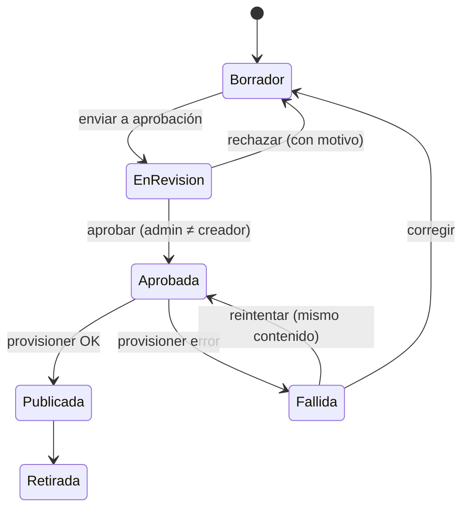

# Marketplace v1: creación de agentes y catálogo de MCP (especificación v0.2)

> Fecha: 2026-10-01 · Estado: **aprobada para construir** · Decisiones: D18, D19, D22, D26, D30 y D32–D38 (y P3, D10, D13, D17) en `docs/architecture/reference-architecture.md` §8.
> Modelo de amenazas: `docs/security/threat-models/marketplace-v1-threat-model.md` (v0.2).
> Plan por PR y resultado de los spikes: `docs/specs/marketplace-v1-plan.md`.
> Cambios frente a v0.1: resultados de los spikes (§10), nombres válidos para AgentCore (§5.2), tools por agente sin Cedar por agente (§5.3), packs como zip (§4.2), grupos de acceso (§2.1) y API completa (§7).

## 1. Objetivo

Que una instalación de Mango pase de "un agente fijo desplegado por IaC" (PoC FinOps) a un **marketplace gobernado**:
- personas autorizadas crean agentes desde la app;
- otro admin los aprueba;
- los agentes usan MCP **aprobados** del catálogo.

Todo sin IaC en runtime (P3) y sin CodeBuild en la cuenta del cliente (regla 2).

**Criterio de éxito:**
- Un creador arma un agente con tools de un conector habilitado, y un admin distinto lo aprueba.
- El agente aparece en el marketplace **solo** para los grupos asignados.
- Cada llamada a una tool pasa por Cedar L2 con la identidad del usuario.
- Todo el ciclo queda auditado.

## 2. Actores y permisos (Cedar L1, Verified Permissions)

| Acción | Quién (por defecto) | Nota |
|---|---|---|
| `UseAgent` | Grupos y usuarios asignados en la versión publicada | Se decide con los atributos del agente que `mango-api` pasa a Verified Permissions (D33) |
| `CreateAgent` | `mango-admin` y el grupo `mango-agent-creator`: personal técnico y usuarios de negocio | Crea borradores y versiones nuevas (D18). Límite: 20 borradores y 5 envíos a revisión por día por creador |
| `EditAgent` | El creador del agente y `mango-admin` | Solo sobre borradores; publicar exige aprobación |
| `ApproveAgent` | `mango-admin` | **Distinto del creador de esa versión** (D18). También rechaza y reintenta una publicación fallida |
| `RetireAgent` | `mango-admin` | Lo saca del marketplace; conserva historial. El agente no se borra de Mango; su harness y su rol en AWS sí (§5.5, D48) |
| `ShareAgentOrgWide` | `mango-admin` | Compartir con toda la organización (con aprobación de otro admin; nunca con tools de toda la organización, §4.3) |
| `ViewConversations` | Grupo designado, solo si la instalación lo activa (D23, desactivado por defecto) | Cada lectura se audita, fail-closed |
| `ViewMcpCatalog` | `mango-admin`, creadores | Ver packs, conectores y sus tools |
| `EnableMcp` / `ApproveMcp` | `mango-admin` | **Doble aprobación**: habilita uno y aprueba otro distinto (D19) |
| `ManageModels` | `mango-admin` | Un solo admin, con auditoría (§4.5) |

Reglas transversales, las mismas de D17:
- Quien propone no aprueba.
- Toda escritura usa bloqueo optimista (`version`).
- La auditoría es fail-closed (`requested` → `applied` o `rejected`).

### 2.1 Grupos de acceso (D35)

- Los grupos de acceso son grupos de Cognito. `mango-api` los lee del claim `cognito:groups` del access token verificado.
- Un registro en `Settings` guarda el tipo de cada grupo: **central**, **de área** (con su área) o **general** (D26). El IaC lo siembra; no se edita desde la app hasta la fase C.
- Un usuario puede tener grupos sin rol FinOps. Sin ningún grupo sigue sin acceso (`no_group`).
- Crear un grupo, cambiarle el tipo o el área, o eliminarlo requiere doble aprobación (D26), desde Ajustes › Grupos (fase C, PR C1). Al aplicarse una creación o una eliminación, el grupo se crea o se borra también en Cognito; la pertenencia se gestiona en el directorio.
- El pre-token añade el claim `mango_central` a quien pertenece a un grupo central del registro; si no puede leer el registro, no lo añade.
- Los grupos que no están en el registro se ignoran.

## 3. Ciclo de vida de un agente



- **`AgentDefinition` versionada** en DynamoDB es la fuente de verdad. Cada versión es inmutable una vez enviada a revisión y lleva un `content_hash`. Editar un agente publicado crea una versión nueva en borrador; la publicada sigue sirviendo hasta que se aprueba la nueva.
- Una versión contiene:
  - nombre (máx. 40), descripción (máx. 140), categoría, ícono y color;
  - **«Reporta a»** (otro agente publicado o la raíz) y **«Rol»** (máx. 40), D30;
  - modelo por defecto y **lista de modelos permitidos**, del catálogo de modelos como datos (regla 7); el usuario elige entre ellos en el chat y el presupuesto se reserva con el precio del elegido (D22);
  - system prompt;
  - **tools**: referencias `conector.tool` solo de conectores y packs habilitados;
  - límites del harness (`maxTokens`, `maxIterations`, `timeoutSeconds`);
  - grupos y usuarios con `UseAgent`.
- **No son parte de la versión:**
  - el presupuesto del agente, que editan los admins solo en Presupuestos; el Builder lo muestra en solo lectura y los agentes nuevos arrancan con el límite por defecto (D22);
  - skills, bases de conocimiento y evals, que quedan fuera de las fases A a C (D38).
- **Compartir** = cambiar grupos o usuarios con `UseAgent`. Crea una versión con solo el acceso cambiado y pasa por revisión (D22, D38). Los creadores comparten con usuarios o grupos concretos; solo admins con toda la organización. Sin invitaciones fuera del directorio ni rol "Puede editar".
- **No se elimina ni se archiva:** un admin retira el agente con motivo y se conserva el historial. Al retirarlo se borran su harness y su rol en AWS (§5.5).
- **Validaciones del servidor al enviar a revisión:**
  - tamaños dentro de los límites;
  - «Reporta a» y «Rol» presentes; sin ciclos (ni el propio agente ni un subordinado);
  - las tools existen y están habilitadas;
  - regla de datos de cuentas (§4.3);
  - el modelo por defecto está entre los permitidos, todos están habilitados y, si hay tools, las soportan;
  - los grupos existen en el registro;
  - sin secretos en el prompt (D26);
  - cuotas del creador.
- **Revisión:** el aprobador ve el **diff** contra la versión publicada (organización, información, prompt, tools, grupos y límites), calculado por el backend. No puede aprobar una versión que incumple las validaciones.
- **Agentes de la release (D34):** FinOps viene como definición en la release. Se siembra como aprobado con `approved_by: release@<versión>` y un evento de auditoría, y el provisioner lo publica. Los cambios posteriores siguen el ciclo normal.
- **Rollback:** republicar una versión anterior es aprobar una versión nueva con el contenido anterior. Nunca se sobrescribe una versión.

## 4. Catálogo de MCP (D19, D36)

### 4.1 Tipos

| Tipo | Ejemplos | Cómo llega | Cómo se activa en la instalación |
|---|---|---|---|
| **Conector de Mango** | Cost Explorer | Código propio en la release (`connectors/`), con su manifiesto | Viene desplegado. El admin solo asigna sus tools a agentes |
| **MCP pack** | awslabs Pricing, Billing, CloudWatch | Zip construido en el CI de Mango, con manifiesto firmado | El admin lo **habilita**, otro admin **aprueba** y el provisioner lo crea |
| **MCP remoto del cliente** (v1.x) | MCP interno, SaaS con OAuth | El cliente lo hospeda | Se registra URL y OAuth vía AgentCore Identity, con doble aprobación |

**Nunca:** instalar un paquete `uvx`/pip arbitrario en la cuenta del cliente.

### 4.2 Construcción de un pack (CI de Mango)

1. Se fija el paquete por versión y hash (`uv` con lock y `--require-hashes`). Una versión upstream nueva espera **7 días de cuarentena** antes de adoptarse (`uv --exclude-newer`), salvo parches de seguridad (CVE), que se adoptan tras el escaneo.
2. Se empaqueta en un **zip** con wheels para arm64 y un **punto de entrada propio**. El punto de entrada importa el servidor del paquete y lo arranca por streamable HTTP en `0.0.0.0:8000/mcp`, sin estado. Los servidores awslabs solo traen stdio, pero el SDK de MCP que usan ya incluye ese transporte: no hace falta fork ni puente stdio→HTTP.
3. Se escanea (SBOM, `pip-audit`), se firma con una llave asimétrica de KMS de la cuenta del proveedor y se publica **por hash** en los artefactos de la release.
4. **Snapshot de tools:** se levanta el servidor en CI, se lista `tools/list` y se guarda el hash de nombres, esquemas y descripciones. Si cambia entre versiones, la actualización exige reaprobación.
5. El manifiesto lista **solo las tools permitidas**. Las demás quedan denegadas en el Gateway.

La imagen de contenedor por digest queda como alternativa si la prueba en el laboratorio descarta el zip (D36).

**Manifiesto** (ejemplo ilustrativo):

```yaml
id: aws-pricing
source: { package: awslabs.aws-pricing-mcp-server, version: "x.y.z", sha256: "…" }
artifact: { type: zip, sha256: "…", runtime: PYTHON_3_13, entry_point: main.py }
data_tier: public            # public | account_data | write
identity_mode: service       # service | per_user | central_only | per_user_adapter
iam:
  - actions: [pricing:GetProducts, pricing:DescribeServices, pricing:GetAttributeValues]
    resources: ["*"]          # la API no admite ARNs (documentado)
tools:
  - { name: get_pricing, access: read, scope: user }
  - { name: …, access: read, scope: user }
tools_hash: "sha256:…"
config:                       # parámetros que el admin puede fijar; nunca secretos
  - { key: region, allowed: [us-east-1, us-west-2] }
```

Los conectores de Mango llevan un manifiesto con los mismos campos de `data_tier`, `identity_mode` y `tools`.

### 4.3 Niveles de datos, modo de identidad y tools

| Campo | Valores | Regla |
|---|---|---|
| `data_tier` | `public` | Se puede asignar a cualquier agente |
| | `account_data` | La regla depende del modo de identidad y de cada tool |
| | `write` | El pack incluye tools que modifican recursos. Denegadas por defecto; si se habilitan, siempre con confirmación o aprobación por llamada |
| `identity_mode` | `service` | El servidor usa su propio rol. Solo para datos públicos |
| | `per_user` | El conector filtra por el usuario verificado (Cost Explorer). Sus tools de alcance `user` se permiten a grupos de área |
| | `central_only` | El servidor no filtra por área. Cedar L2 permite sus tools solo a usuarios centrales (claim `mango_central`) y lo repite como `forbid`. El rol del pack no tiene permisos de datos: cada llamada asume el broker con `SourceIdentity` = usuario y una session policy igual a las acciones del manifiesto (D37). Las acciones `iam` del manifiesto son ese tope, no permisos del rol. Mientras los Runtimes usen la red `PUBLIC`, solo una instalación `lab` puede instalarlo (D49) |
| | `per_user_adapter` | Por validar (§10, S-M1). No se usa en v1 |
| tool `access` | `read` / `write` | Las de escritura siempre piden confirmación o aprobación por llamada (D27) |
| tool `scope` | `user` / `org` | Las de alcance `org` (toda la organización) se permiten solo a usuarios centrales |

**Regla de datos de cuentas (D35):** un agente visible para un grupo de área o general no puede incluir tools de un servidor `central_only` ni tools de alcance `org`. El servidor lo rechaza al enviar a revisión y Cedar L2 lo deniega en el Gateway aunque el agente esté mal configurado.

### 4.4 Habilitación de un pack (provisioner)

Estados: Disponible → Pendiente de aprobación → Instalando → Habilitado (o Error) → Deshabilitado.

1. El admin A pide habilitarlo y fija su configuración (solo valores del manifiesto).
2. El admin B aprueba viendo:
   - las acciones IAM del manifiesto y cuáles son nuevas en la instalación;
   - las tools con su tipo de acceso y alcance;
   - el nivel de datos y el modo de identidad.
3. El provisioner (Step Functions), por SDK:
   - verifica la firma y el hash del zip contra el manifiesto;
   - crea el rol del pack desde el manifiesto, **con permissions boundary** que acota lo máximo que puede tener cualquier pack;
   - crea el AgentCore Runtime con protocolo MCP desde el zip;
   - crea el target `mcpServer` del Gateway con autorización de salida por SigV4;
   - verifica que `tools/list` coincide con `tools_hash`;
   - escribe las políticas Cedar L2 en **deny por defecto**, por tool y tipo de usuario.
4. Estado `Habilitado`. Sus tools ya se pueden asignar a agentes; siguen sujetas a la aprobación de cada agente.
5. **Reintentar** una instalación con error lo hace un admin; no cambia lo aprobado.
6. **Cambiar parámetros** o **actualizar** a una versión con tools nuevas: doble aprobación; mientras tanto sigue la versión anterior (D26).
7. **Deshabilitar** lo hace un solo admin con motivo, y borra políticas, target, Runtime y rol. Los agentes que lo usan quedan marcados "con tools no disponibles" hasta que se editen. Siguen respondiendo con el resto de sus tools (D46).

## 4.5 Catálogo de modelos (Brains)

- Los modelos son los de **Amazon Bedrock** de la cuenta y región de la instalación, y se usan con el rol de Mango: **sin credenciales** (ni access keys, ni API keys, ni endpoints).
- **Un solo admin** habilita o deshabilita un modelo y confirma sus precios (USD por millón de tokens de entrada y de salida, regla 7). No hace falta doble aprobación (acordado el 2026-09-29). Todo queda en auditoría.
- Solo los modelos habilitados se pueden elegir en el Agent Builder. Deshabilitar un modelo que usan agentes publicados muestra qué agentes quedan afectados.
- Estado "Sin acceso" cuando la cuenta no tiene acceso al modelo en Bedrock; se resuelve en AWS, no desde Mango.
- **Fases (D38):** en la fase A el catálogo es de solo lectura, sembrado desde la configuración de la instalación. La pantalla Brains completa llega en la fase B.
- Los proveedores fuera de AWS quedan como nota a futuro (`reference-architecture.md` §8): con doble aprobación y la marca "los datos salen de AWS".

## 5. Provisioner

### 5.1 Cómo trabaja

- Step Functions con tareas Lambda idempotentes, por SDK. **Nunca** CDK ni CodeBuild. Para recursos compuestos (p. ej. una KB con bucket, rol y data source) puede crear stacks de CloudFormation **desde plantillas pre-sintetizadas de la release** (D25).
- **Entrada:** solo identificadores y hashes: `{agent_id, version, content_hash}` o `{pack_id, pack_version, enablement_id}`. Nunca IAM ni ARNs del usuario.
- **Recursos que crea:**
  - **por agente (D32):** rol de ejecución (D10), log group del runtime con KMS y retención (D16) y un harness. Cada versión aprobada es un `UpdateHarness`, que crea una versión inmutable. `mango-api` invoca el endpoint `live`, que el provisioner mueve cuando la versión nueva está lista;
  - **por pack:** rol del pack, Runtime MCP, target del Gateway y políticas Cedar L2.
- **No crea** guardrails ni políticas Cedar por agente: el guardrail base es compartido (D34) y las tools por agente se aplican como indica §5.3 (D33).
- **Si falla:** compensa, borrando lo creado en esa ejecución, y deja la versión en `Fallida` con el paso y el error.
- **Reconciliación diaria:** compara `AgentDefinition` y habilitaciones con lo que existe en AgentCore e IAM, y alerta ante recursos huérfanos o cambiados fuera de Mango.

### 5.2 Nombres (regla 6, D32)

AgentCore no admite guiones en los nombres de harness y Runtime, y los limita a 40 y 48 caracteres.

| Recurso | Nombre | Límite |
|---|---|---|
| Rol del agente | `Mango-<ns>-agent-<id>` | 64 |
| Harness del agente | `Mango_<ns>_a_<id>` | 40 |
| Rol del pack | `Mango-<ns>-mcp-<pack>` | 64 |
| Runtime del pack | `Mango_<ns>_mcp_<pack>` (guiones del id como `_`) | 48 |
| Target del Gateway | id del pack | — |

- **Id del agente:** aleatorio, 16 caracteres en base32 en minúsculas (80 bits). Un ULID no cabe.
- **Agentes de la release:** slug de 2 a 16 caracteres alfanuméricos en minúsculas (`finops`).
- **Id del pack:** hasta 29 caracteres, minúsculas, números y guiones.
- Todo lleva los tags de costo.

### 5.3 Invocación y tools por agente (D33)

- `mango-api` arma cada `InvokeHarness` desde la versión publicada, leída por su `content_hash`: prompt, modelo elegido entre los permitidos, límites y tools.
- `InvokeHarness` permite sobrescribir prompt y tools por invocación. Por eso **solo el rol de `mango-api`** tiene ese permiso, acotado a `harness/Mango_<ns>_a_*`.
- El Gateway solo ve al usuario (su JWT), no al agente. Las tools de un agente se limitan así:
  - `allowedTools` de la invocación lleva solo las tools de la versión publicada;
  - `mango-api` firma la invocación (`X-Mango-Invocation` v2) con usuario, agente, versión, lista de tools y vencimiento;
  - el interceptor del Gateway rechaza una llamada sin firma v2 válida o a una tool fuera de la lista.
- Cedar L2 sigue decidiendo por tool y tipo de usuario (rol, central o no).
- El interceptor entrega la identidad del usuario en `_mango_ctx` según el destino:
  - **conectores de Mango:** el token del usuario, que el conector revalida (D13);
  - **packs `central_only`:** una aserción firmada con una llave asimétrica de KMS que solo el interceptor puede usar: usuario, pack, tool, agente y 60 s de vigencia. Nunca el token. Solo se emite si el token trae `mango_central`. El punto de entrada del pack la verifica con la llave pública, la quita de los argumentos y asume el broker como ese usuario (D37);
  - **los demás packs:** nada. `_mango_ctx` se borra de toda llamada.

### 5.4 Permisos del provisioner

- `iam:CreateRole`, `iam:PutRolePolicy`, `iam:DeleteRolePolicy`, `iam:DeleteRole` y `iam:TagRole` **solo** sobre `role/Mango-<ns>-agent-*` y `role/Mango-<ns>-mcp-*`, con la condición `iam:PermissionsBoundary` obligatoria en las cuatro primeras (`DeleteRole` desde D40 (7) y D43 (7), 2026-10-09). `iam:TagRole` no admite esa clave; `iam:GetRole` no la lleva, porque el provisioner lee el rol para saber si existe y si conserva el boundary.
- `iam:PassRole` acotado a esos prefijos y a `bedrock-agentcore.amazonaws.com`.
- AgentCore: harness y endpoints sobre `Mango_<ns>_a_*`; Runtime sobre `Mango_<ns>_mcp_*`; targets y políticas del Gateway de la instalación.
- El rol del agente sale de una plantilla fija: los modelos permitidos de la versión, la invocación del Gateway y los logs de su runtime. El rol del pack sale **solo** del manifiesto firmado.
- `mango-api` no tiene permisos de escritura sobre AgentCore ni IAM.

### 5.5 Retiro: desaprovisionamiento (D48)

- Retirar un agente inicia la máquina `Mango-<ns>-AgentDeprovisioner` con `{agent_id}`. El retiro no espera al borrado ni depende de él.
- **Pasos:** `load` → `delete_endpoints` (hasta que solo quede `DEFAULT`) → `delete_harness` (hasta que desaparezca) → `delete_role` → `finish`. Cualquier error va a `mark_failed`. No hay compensación: un borrado no se deshace, se repite.
- **Cada paso** vuelve a comprobar que el agente está `retired`, que la versión que servía también lo está y que no es un agente de la release. Solo toca el harness `Mango_<ns>_a_<id>` y el rol `Mango-<ns>-agent-<id>`.
- **Bloqueo:** el mismo del provisioner. Si una publicación de ese agente sigue en curso, espera a que termine (falla sola al ver el agente retirado).
- **Lo que queda:** versiones `retired`, el puntero `PUBLISHED#<id>`, el historial y los log groups del Runtime (30 días, D16).
- **Auditoría:** `agent.deprovision` con `requested`, `applied` o `rejected` (con `failed_step` y un código).
- **Si falla:** alarma `Mango-<ns>-AgentDeprovisioner-failed`; el reconciliador reporta `deprovision_incomplete` mientras quede algo. Se reinicia a mano (`docs/runbooks/poc-deploy.md`).
- **Rol propio**, que solo borra bajo esos prefijos y no lee definiciones ni el harness. Un rol de agente y sus políticas inline solo los borra si el rol lleva el boundary de agentes: lo exige IAM, además del código (D48 (7)).

## 6. Pantallas

El diseño de Claude Design es la fuente de verdad (D24). Copia en el repo: `docs/design/mango-hub/`.

| Pantalla | Diseño | Fase | Notas |
|---|---|---|---|
| **Marketplace** | `marketplace.jsx` | A | Solo agentes con `UseAgent`. Pestañas Activos y Retirados, detalle, «Tus agentes en curso», Duplicar, Retirar |
| **Agent Builder** | `AgentAdmin` en `admin.jsx` | A | Seis secciones: Información básica, Organización, Modelo e instrucciones, Tools, Límites y presupuesto, Acceso. «Enviar a aprobación», nunca «Publicar» |
| **Revisión de agentes** | `agent-review.jsx` | A | Cola con diff, aprobar o rechazar con motivo, historial y «Reintentar» |
| **Org Chart** | `OrgChart` en `other-views.jsx` | A | Solo lectura (D30): árbol, búsqueda y panel del agente. Admins y creadores ven todo; el resto, sus agentes (D38) |
| **Catálogo de MCP** | `mcp-catalog.jsx` | B | Pestañas Catálogo, Tools y Solicitudes pendientes |
| **Brains** | `models-view.jsx` | B | Habilitar, deshabilitar y precios |
| **Ajustes › Grupos** | `groups-admin.jsx` | C | Crear grupo y cambiar tipo con doble aprobación |

**Próximamente o sin dato en v1** (no hay backend; D24):
- en el Marketplace: estado en línea, tickets, orden por uso, Owner y el modal «Compartir» (fase A);
- en el Org Chart: delegación A2A, sus KPIs y «Delegaciones recientes»;
- en el Catálogo de MCP: «Conectar MCP por URL» y los conectores que no existen. Salud, latencia y llamadas muestran «Sin datos» hasta tener métricas reales de CloudWatch;
- en Revisión: el bloque de evals.

**Diferencias con el diseño, por reportar a Claude Design antes de construir cada pantalla** (plan §7): el presupuesto en el diff de la versión, los ids secuenciales, el nivel «Datos internos», la regla de datos de cuentas aplicada a Cost Explorer y los límites que el Builder no ofrece.

## 7. API

Cuerpos con Pydantic `extra="forbid"`, modelos de respuesta explícitos e ids aleatorios. Toda escritura audita `requested` → `applied` o `rejected`.

**Agentes (fase A):**

| Método y ruta | Acción Cedar | Nota |
|---|---|---|
| `GET /api/agents` | `UseAgent` (filtrado) | Marketplace: publicados y retirados que el usuario puede usar |
| `GET /api/agents/{id}` | `UseAgent` | Detalle de la versión publicada |
| `GET /api/agents/mine` | `CreateAgent` | Versiones en curso del creador y sus cuotas |
| `POST /api/agents` | `CreateAgent` | Agente nuevo con su primer borrador |
| `POST /api/agents/{id}/versions` | `EditAgent` | Borrador nuevo a partir de la versión publicada |
| `GET /api/agents/{id}/versions/{v}` | `EditAgent` o `ApproveAgent` | Incluye el diff contra la publicada |
| `PUT /api/agents/{id}/versions/{v}` | `EditAgent` | Solo borradores; bloqueo optimista |
| `POST …/versions/{v}/submit` | `EditAgent` | Valida y deja la versión inmutable |
| `GET /api/agents/reviews` | `ApproveAgent` | Cola e historial |
| `POST …/versions/{v}/approve` | `ApproveAgent` (≠ creador) | Guarda el hash e inicia el provisioner |
| `POST …/versions/{v}/reject` | `ApproveAgent` (≠ creador) | Motivo obligatorio |
| `POST …/versions/{v}/retry` | `ApproveAgent` | Solo `Fallida`; mismo hash |
| `POST /api/agents/{id}/retire` | `RetireAgent` | Motivo obligatorio. Inicia el deprovisioner (§5.5) |
| `GET /api/agents/org` | `UseAgent` (filtrado) | Árbol de «Reporta a» |
| `GET /api/models` | `CreateAgent` | Modelos habilitados |
| `GET /api/groups` | `CreateAgent` | Registro de grupos con su tipo |
| `GET /api/mcp/catalog` | `ViewMcpCatalog` | Conectores y packs con sus tools |
| `POST /api/chat` | `UseAgent` | Acepta `agent_id` y `model` (uno de los permitidos) |

**Catálogo de MCP (fase B):**

| Método y ruta | Acción Cedar |
|---|---|
| `POST /api/mcp/{pack}/enablements` | `EnableMcp` |
| `POST /api/mcp/{pack}/params` · `…/update` | `EnableMcp` |
| `POST /api/mcp/{pack}/enablements/{id}/approve` · `…/reject` | `ApproveMcp` (≠ quien lo pidió) |
| `POST /api/mcp/{pack}/enablements/{id}/withdraw` | `EnableMcp` (solo quien lo pidió) |
| `POST /api/mcp/{pack}/retry` | `EnableMcp` |
| `DELETE /api/mcp/{pack}` (con motivo) | `EnableMcp` |

Habilitar, cambiar parámetros y actualizar crean el mismo tipo de solicitud, una pendiente por pack; las tres se aprueban, rechazan o retiran en `…/enablements/{id}/…`. El detalle está en `docs/specs/poc-api-contract.md`.

**Modelos (fase B):** `GET /api/admin/models`, `PUT /api/admin/models/{id}` y `POST /api/admin/models/refresh`, con `ManageModels`.

**Grupos (fase C):** propuesta, aprobación y rechazo de cambios de grupos, con el patrón de Admin v0.

## 8. Datos

- **`Mango-<ns>-Agents`**:
  - `AGENT#<id>` / `META`: estado, versión publicada, harness y su versión, creador, retiro;
  - `AGENT#<id>` / `VERSION#<n>`: definición inmutable (incluye `reports_to` y `role`, D30), `content_hash`, estado, creador, aprobador, motivo, paso fallido y versión base;
  - `CREATOR#<sub>` / `DAY#<fecha>`: contador de envíos, con vencimiento;
  - índices por estado y por creador.
- **`Settings`** (existe):
  - `GROUPS`: registro de grupos con su tipo;
  - `MODELS`: catálogo de modelos y precios;
  - `MCP#<pack>` / `ENABLEMENT`: estado, configuración y versión de lo último aprobado;
  - `MCP_INSTALLED#<pack>` / `CURRENT`: lo instalado. Solo lo escribe el provisioner de packs (D43);
  - `MCP_CHANGE#<pack>` / `CHANGE#<id>`: solicitudes y su decisión; `MCP_CHANGE#<pack>` / `PENDING` marca la que espera aprobación.
- **Catálogo de packs:** viene en la release como datos firmados. La instalación no lo edita. CloudFormation copia los zips a un bucket de la instalación al instalar o actualizar.
- Quién escribe: `mango-api` escribe borradores y decisiones; el provisioner solo el estado de publicación y las referencias del harness; el deprovisioner (§5.5) solo el bloqueo del provisioner.
- KMS, PITR y `RETAIN` fuera del laboratorio.

## 9. Fuera de v1
- MCP remotos del cliente (v1.x).
- Skills y evals obligatorias (D26), fuera de las fases A a C (D38).
- Bases de conocimiento en el builder.
- Agentes multi-agente (supervisor Strands).
- Playground A/B.
- Heartbeat.
- Delegación A2A entre agentes (fase 2, D30). El Org Chart de v1 es de solo lectura.
- Guardrail por agente (D34).
- Agent Registry como catálogo (fase 2).
- MCP de otras nubes (Azure, GCP): solo AWS por ahora. Ver la nota a futuro en `reference-architecture.md` §8.

## 10. Spikes

Detalle y fuentes en `docs/specs/marketplace-v1-plan.md` §2 (2026-10-01).

| ID | Pregunta | Resultado |
|---|---|---|
| S-M1 | ¿Un servidor awslabs acepta credenciales por llamada a través de un adaptador sin fork? ¿Cachea clientes boto3? | **Parcial.** Pricing y CloudWatch no cachean clientes, pero toman las credenciales del proceso. Un adaptador exige reemplazar funciones internas. Falta la prueba de aislamiento (fase C) |
| S-M2 | ¿AgentCore Runtime exige la imagen en un ECR de la misma cuenta? | **No.** Acepta ECR privado de cualquier cuenta, ECR Public y un zip en S3. Falta probarlo en el laboratorio |
| S-M3 | ¿Qué servidores awslabs soportan streamable HTTP de forma nativa? | **Pricing, CloudWatch y Billing, no.** Basta un punto de entrada propio; no hace falta puente stdio→HTTP |
| S-M4 | ¿`UpdateHarness` es atómico, o conviene un harness por versión? | **Un harness por agente.** Cada update crea una versión inmutable y un endpoint con nombre apunta a ella. Falta medir las sesiones en curso |
| S-M5 | Costo y cold start de un Runtime MCP por pack con tráfico bajo | **Sin costo fijo.** Medido en el laboratorio: cada llamada por el Gateway arranca una microVM (4 a 6 s) y cuesta del orden de USD 0,004. En caliente el servidor responde en 0,5 s. Detalle y ajustes pendientes en el plan, S-M5 |

## 11. Plan por fases

El plan por PR está en `docs/specs/marketplace-v1-plan.md` §5.

1. **Fase A: agentes como datos.** Grupos, tabla `Agents`, Cedar y API, provisioner, chat con varios agentes, migración de FinOps, Marketplace, Builder, Revisión y Org Chart.
2. **Fase B: MCP packs.** Pipeline de packs, provisioner de packs, catálogo, Brains y el pack Pricing (`public`).
3. **Fase C: datos de cuentas.** Grupos con tipo, identidad en packs `central_only` y el pack de Billing. CloudWatch cuando existan los roles en las cuentas miembro (D37).
4. **v1.x:** MCP remotos del cliente con AgentCore Identity.
